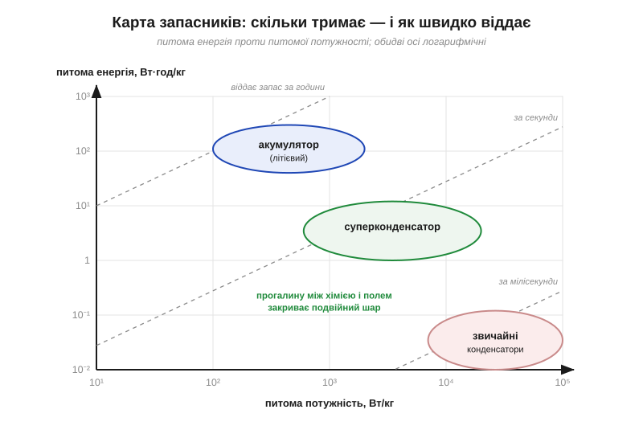
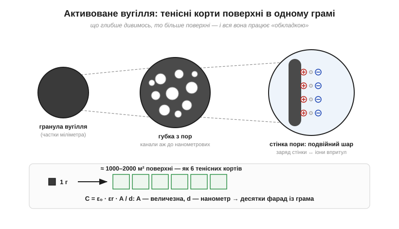
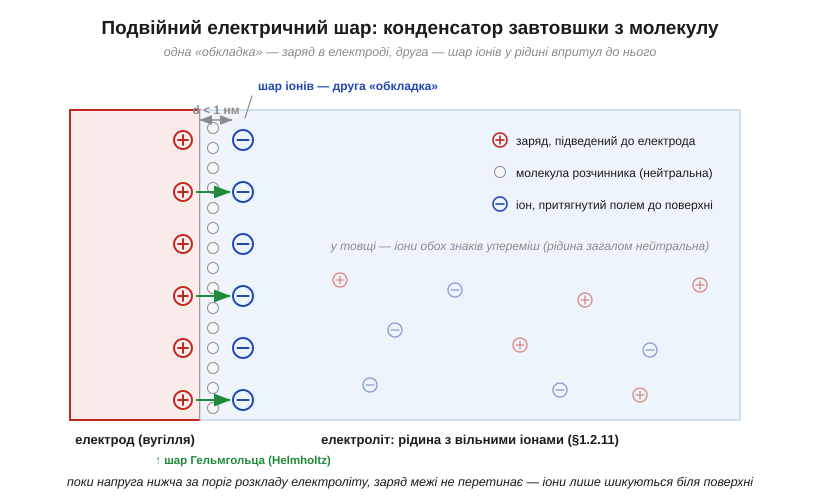
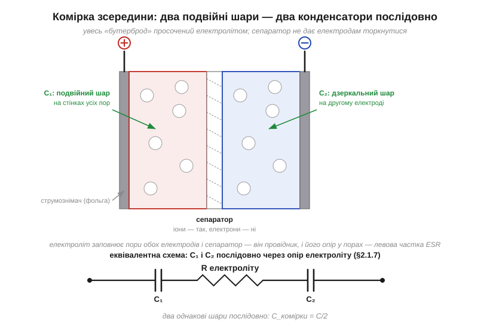
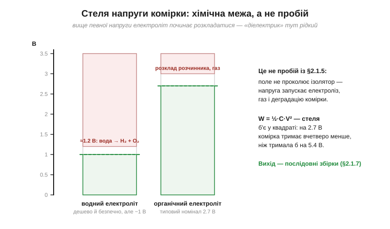
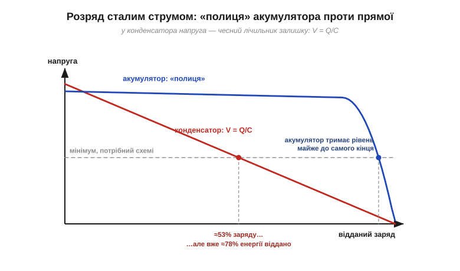
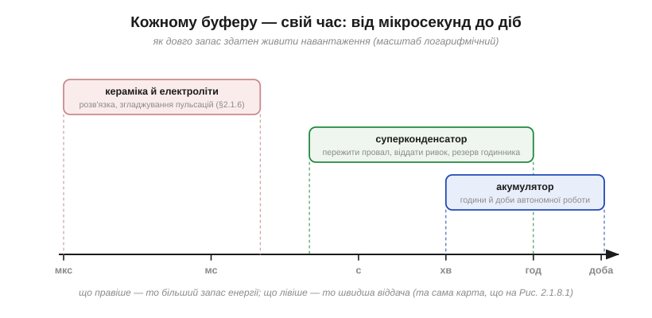
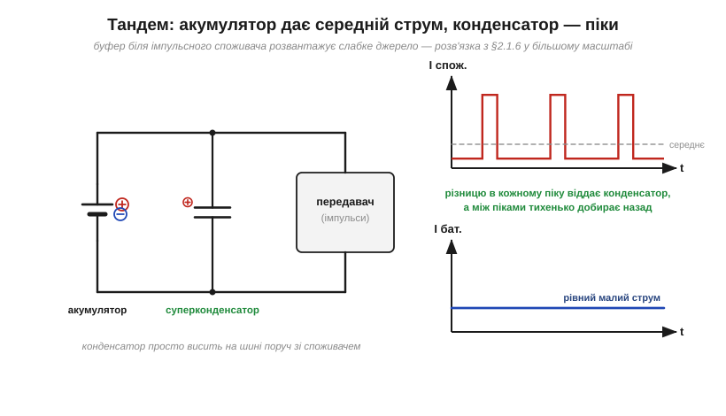

# Суперконденсатор: між конденсатором і акумулятором

Проста [оцінка ємності](root:ph-electromagnetism/capacitance) показує: конденсатор на один фарад із пласкими обкладками й повітряним зазором 0.1 мм зажадав би одинадцять квадратних кілометрів металу. А поряд існує деталь завбільшки з монету, в якій тих фарадів — десятки, а в комірках із кулак — тисячі. Ці два факти погано уживаються в одній голові: десь у конструкції мусить ховатися фокус. Він і ховається — причому красивий: жодного порушення знайомої формули C = ε₀·εr·A/d, лише обидві її ручки, докручені до фізичної межі. Так влаштований **суперконденсатор** (*supercapacitor*; трапляються також назви **іоністор** і *ultracapacitor*, а в даташитах — абревіатура *EDLC*). Розберімо, звідки беруться «фаради в кишені», чому за них платять мізерною напругою комірки — і яке місце цей компонент посідає між звичним конденсатором і акумулятором, бо він не замінює ані того, ані іншого.

### Прірва між полем і хімією

Конденсатор і акумулятор протиставлені від природи: перший виграє за потужністю, другий — за запасом. Зробімо це порівняння числовим, бо саме воно пояснює, навіщо суперконденсатор узагалі існує. Запасники енергії заведено міряти двома питомими величинами: **питома енергія** (*specific energy*) — скільки ват-годин запасу припадає на кілограм маси, і **питома потужність** (*specific power*) — скільки ват віддачі з того самого кілограма. У звичайних конденсаторів (плівкових, електролітичних) питома енергія жалюгідна — соті частки ват-години на кілограм, — зате потужність колосальна: десятки кіловат із кілограма, весь запас за мілісекунди. У літієвого акумулятора все навпаки: близько двох сотень ват-годин на кілограм — у тисячі разів більше! — але швидко віддавати їх він не вміє, та й витримує лише тисячі циклів заряд-розряд. Якщо нанести обидві властивості на одну карту, між конденсаторами й акумуляторами зяятиме провалля у кілька порядків — і саме в ньому оселився суперконденсатор.


*Питома енергія проти питомої потужності, обидві осі логарифмічні (таку діаграму називають картою Рагоне). Звичайні конденсатори — внизу праворуч: миттєва віддача, мізерний запас. Акумулятори — вгорі ліворуч: великий запас, неквапна віддача. Пунктирні діагоналі — характерний час, за який запас можна віддати. Суперконденсатор сидить рівно в прогалині: на порядки більше енергії, ніж у конденсатора, і на порядки більше потужності, ніж у акумулятора.*

Причина провалля — у самому способі зберігання. Конденсатор тримає енергію **фізично**: [полем розділеного заряду](root:ph-electromagnetism/capacitor-energy). Зарядити чи розрядити його — означає лише перегнати заряд на обкладки й назад; жодна речовина при цьому не змінюється, тому процес швидкий і повторюваний практично нескінченно. Акумулятор тримає енергію **хімічно**: заряджання перетворює одні речовини на інші, і в хімічних зв'язках уміщається в тисячі разів більше джоулів на той самий грам. Але перебудова речовини — справа повільна (звідси скромна потужність) і небезслідна (звідси втома й обмежений ресурс). Суперконденсатор — спроба підібратися до акумулятора за запасом, не зрадивши конденсаторної фізики: енергію в ньому тримає **розділений заряд**, а не реакція. Подивімося, як це вдалося.

### Дві ручки, докручені до межі

У [ємності](root:ph-electromagnetism/capacitance) три важелі: C = ε₀·εr·A/d — площа, зазор, діелектрик. Звичайні конденсатори цими важелями вже грають: згортають фольгу в рулон (площа — частки квадратного метра), тоншають плівку (зазор — одиниці мікрометрів), добирають кераміку з високою εr. Стелю цієї гри ми знаємо: до фарада — як до неба. Щоб стрибнути ще на шість порядків, площу треба підняти до **тисяч квадратних метрів**, а зазор утиснути до **нанометра** — у тисячі разів тонше за найтоншу плівку.

Із площею людство впоралося давно: це **активоване вугілля** (*activated carbon*) — вуглець, оброблений так, що його наскрізь пронизують пори аж до нанометрових. Виходить губка, в якої майже вся речовина — поверхня: внутрішня площа одного грама сягає 1000–2000 м², кілька тенісних кортів у щіпці чорного порошку. Саме з такого вугілля роблять електроди суперконденсатора, і «обкладкою» працює вся внутрішня поверхня пор одразу.


*Що глибше дивимось, то більше поверхні: гранула — губка з пор — стінка окремої пори, і на кожній стінці працює розділення заряду. Один грам такого вугілля ховає в собі 1000–2000 м² поверхні. Обидві ручки формули — величезна A і нанометровий d — і дають фаради там, де пласким обкладкам потрібні були б квадратні кілометри.*

А от зазор так просто не втиснеш. Діелектричної плівки завтовшки в нанометр не існує: таку перегородку миттєво [пробило б](root:hw-components/capacitor-parasitics) навіть скромне поле. І тут — головний фокус конструкції. А хто, власне, сказав, що друга обкладка мусить бути металевою, а між обкладками має лежати тверда плівка?

### Подвійний електричний шар

Занурмо вугільний електрод у **електроліт** (*electrolyte*) — рідину, в якій струм [переносять іони](root:ph-electromagnetism/ionic-conduction). Подамо на електрод заряд — скажімо, додатний. Його поле притягує з рідини іони протилежного знаку, і вони підпливають до поверхні та шикуються вздовж неї — впритул, наскільки дозволяють молекули розчинника, що оточують кожен іон. А торкнутися поверхні й віддати свій заряд іони не можуть: для цього потрібна хімічна реакція, а поки напруга мала, реакція не йде. От і виходить конденсатор: одна «обкладка» — заряд в електроді, друга — шар іонів у рідині, а роль діелектрика грає тонесенький прошарок молекул розчинника між ними. Його товщина — **менш ніж нанометр**.


*Заряд електрода і шар притягнутих іонів стоять одне навпроти одного, розділені лише молекулами розчинника, — це і є дві «обкладки» з зазором d < 1 нм. У товщі рідини іони обох знаків перемішані, заряджений лише тонкий шар біля поверхні. Заряд межі не перетинає: це досі розділення заряду, а не хімічна реакція.*

Цю картину — заряджена поверхня й шеренга іонів навпроти — описав ще в XIX столітті німецький фізик Герман фон Гельмгольц (*Hermann von Helmholtz*), тож найтісніший шар біля поверхні досі зветься **шаром Гельмгольца**. А всю пару «поверхів» заряду — електронного в електроді та іонного в рідині — називають **подвійним електричним шаром** (*electric double layer*). Звідси й технічне ім'я класу: *EDLC, electric double-layer capacitor* — конденсатор на подвійному електричному шарі.

> 📜 **Історична вставка:** [іоністор — конденсатор, що сто років чекав свого застосування](root:hw-components/supercapacitor/hist-supercap.md). Від замальовки Гельмгольца 1853 року через патент General Electric із чесним «механізм невідомий» і нафтову компанію SOHIO — до торгового імені «Supercapacitor» від NEC і фарад у кожній шухляді.

Найважливіше тут — те, чого **не** відбувається. Заряд не перетинає межу електрод–рідина: електрони лишаються у вугіллі, іони — в електроліті, вони лише стоять одне навпроти одного. Це й далі **фізика, а не хімія** — те саме [розділення заряду двома провідниками](root:hw-components/capacitor), просто обкладки незвичні. Саме тому суперконденсатор успадковує конденсаторні чесноти: заряд і розряд без перетворення речовини — а отже, швидко й сотні тисяч разів поспіль.

**Приклад (скільки фарад у грамі вугілля).** Оцінимо ємність подвійного шару грубо — просто підставивши «вугільні» числа у [формулу плаского конденсатора](root:ph-electromagnetism/capacitance): площа A ≈ 1000 м² (один грам), зазор d ≈ 1 нм, проникність молекулярного прошарку візьмемо εr ≈ 5:

```
C = ε₀ · εr · A / d
C = (8.854×10⁻¹² Ф/м) · 5 · (1000 м²) / (1×10⁻⁹ м)
C ≈ 44 Ф
```

Сорок із гаком фарад — **з одного грама**. Оцінка навмисно груба (не вся поверхня пор доступна іонам, а проникність у такому тісному прошарку — окрема наука), але порядок правильний: реальні електроди дають десятки фарад на грам. Порівняйте з одинадцятьма квадратними кілометрами обкладок, що їх вимагав би плаский фарад, — ось що означає докрутити A і d до фізичної межі.

### Комірка: два електроди, два шари послідовно

Справжня комірка суперконденсатора — це два вугільні електроди на металевих фольгах-струмознімачах, між ними **сепаратор** (*separator*) — пориста перегородка, і все це просочене електролітом. Прикладемо напругу: біля одного електрода вишикуються іони одного знаку, біля другого — протилежного. Тобто подвійних шарів утворюється **два**, по одному на кожному електроді, — і ввімкнені вони **послідовно**, бо сполучає їх товща електроліту.


*Фольга — вугільний електрод — сепаратор — вугільний електрод — фольга; все просочено електролітом. Подвійний шар працює на стінках усіх пор обох електродів. Еквівалентна схема — два конденсатори послідовно через опір електроліту: для однакових електродів C_комірки = C/2. Сепаратор пропускає іони, але не електрони — без нього комірка замкнулася б зсередини.*

Для [послідовного з'єднання](root:hw-components/capacitors-series-parallel) висновок миттєвий: два однакові шари дають половину — C_комірки = C/2. А електроліт між шарами — не діелектрик, а **провідник** (іонний): він нічого не запасає, він з'єднує. Його опір у вузьких звивистих порах — це і є левова частка того чималого [еквівалентного послідовного опору (ESR)](root:hw-components/capacitor-parasitics). Сепаратор же пильнує єдине: іони крізь нього проходять, електрони — ні; інакше електроди торкнулися б і комірка стала б коротким замиканням сама собі.

> 🔧 **Навіщо це.** Розуміння будови — це розуміння поведінки. Чому в суперконденсатора помітний ESR і він не для швидких сигналів — опір електроліту в порах. Чому ємність велетенська, а напруга мізерна — теж випливає з конструкції рідинної межі. І практична дрібниця: хоча обидва електроди зроблені з того самого вугілля, виробник маркує полярність комірки — і її дотримуються, бо тривала робота «навпаки» прискорює деградацію.

### Стеля у два з половиною вольти

Тепер — ціна. У звичайного конденсатора граничну напругу задає [пробій діелектрика](root:hw-components/capacitor-parasitics). Тут діелектрика немає — є рідина. Поки напруга мала, іони слухняно стоять у шарі. Але в кожного електроліту є поріг, за яким починається **електрохімія**: молекули розчинника розкладаються струмом. Вода не витримує вже ≈1.2 В — починається електроліз, розкладання на водень і кисень; тому комірки з водним електролітом тримають близько вольта. Органічні розчинники терплять більше — до ≈2.5–3 В. Звідси знайомі номінали комірок: **2.5, 2.7, 3.0 В** — і ні вольтом більше.


*Гранична напруга комірки — це поріг розкладання електроліту: ≈1.2 В для води, ≈2.7 В для органічних розчинників. Це не [пробій діелектрика](root:hw-components/capacitor-parasitics) — поле нічого не «проколює»; вище стелі заряд починає перетікати через межу, в комірці утворюється газ і вона деградує. А оскільки W = ½·C·V², низька стеля б'є по запасу в квадраті.*

Перевищення цієї стелі вбиває комірку не миттєвою іскрою, а повільно: через межу тече струм, виділяється газ, росте тиск, електроліт виснажується. Тому до напруги суперконденсатори ще вимогливіші за електролітичні конденсатори. І б'є ця стеля боляче, бо [енергія квадратична за напругою](root:ph-electromagnetism/capacitor-energy): W = ½·C·V². Тисячі фарад вражають, але помножте їх на жалюгідні сім із гаком «квадратних вольтів» — і джоулів виявиться менше, ніж обіцяла інтуїція.

**Приклад (фаради проти джоулів).** Комірка 100 Ф на 2.7 В — типорозмір із великий палець, маса ≈ 25 г:

```
W = ½ · C · V²
W = ½ · (100 Ф) · (2.7 В)²
W ≈ 365 Дж  ≈  0.1 Вт·год
```

Пальчикова батарейка приблизно тих самих розмірів і маси тримає ≈ 14 000 Дж — у **сорок** разів більше. Сто фарад звучить грізно, але джоулі рахує напруга у квадраті, і тут фізика поля зі стелею 2.7 В програє хімії з її «вбудованими» вольтами. Навіть комірка на 3000 Ф (уже з добрячий кулак) тримає ≈ 11 кДж — лише на рівні тієї ж батарейки.

### Послідовні збірки й балансування

А що робити, коли шина живлення — 5, 12 чи 48 В? Рівно те, що й зі звичайними конденсаторами: [з'єднувати комірки послідовно](root:hw-components/capacitors-series-parallel). Напруга поділиться між ними, ємність впаде (додаються обернені), а енергія складеться:

```
шість комірок 100 Ф / 2.7 В послідовно:
V    = 6 · 2.7 В = 16.2 В
1/C  = 6 / 100   →   C ≈ 16.7 Ф
W    = ½ · 16.7 · (16.2)² ≈ 2.2 кДж     (= 6 × 365 Дж — енергія комірок додалася)
```

Але тут спрацьовує тонкість, властива будь-якому [послідовному з'єднанню](root:hw-components/capacitors-series-parallel). Одразу після заряджання напруга по ланцюжку ділиться **обернено до ємностей**. Та в кожної комірки є ще й [витік](root:hw-components/capacitor-parasitics) — і в усталеному стані, коли зовнішній струм уже не тече, поділ напруги визначають саме струми витоку. Комірка, що тече найменше, поволі перебирає на себе дедалі більшу частку напруги — поки не вилізе за свою хімічну стелю, з усіма наслідками розкладання електроліту. Тому послідовні збірки завжди **балансують** (*balancing*): найпростіше — вирівнювальними резисторами паралельно кожній комірці (їхній струм значно більший за витік, тож поділ диктують уже вони), у серйозніших збірках — активними схемами, що переливають заряд між комірками.

> 🔧 **Навіщо це.** Готові суперконденсаторні модулі «на 5.5 В» чи «на 16 В» — це саме такі збірки з балансуванням усередині, тому вони й коштують дорожче за суму комірок. А якщо складати збірку з окремих комірок самотужки й заощадити на балансуванні — найміцніша комірка першою ж і загине: перенапруга дістанеться саме їй.

### Розряд: напруга тане, а не тримається

Є ще одна риса, що відрізняє суперконденсатор від акумулятора в щоденній роботі. У акумулятора напруга під час розряду довго стоїть на «полиці» біля номіналу й завалюється лише наприкінці. У конденсатора прихованих резервів немає: [V = Q/C](root:ph-electromagnetism/capacitance), напруга — чесний лічильник залишку, і під сталим струмом вона тане **лінійно**, від повної до нуля.


*Акумулятор тримає робочу напругу майже до вичерпання запасу. Конденсатор розряджається по прямій: відданий заряд прямо пропорційний просіданню напруги. Якщо схемі потрібен певний мінімум напруги, частина запасу конденсатора лишається недосяжною — хоча завдяки квадрату W ∝ V² до половини напруги встигає вийти три чверті енергії.*

Для розробника це і добре, і погано. Добре — бо за напругою завжди точно видно, скільки запасу лишилося (в акумулятора з його «полицею» це якраз болюче питання). Погано — бо споживачеві зазвичай потрібен якийсь мінімум напруги: опустилися нижче — і решта запасу недосяжна. Рятує [квадратична залежність енергії](root:ph-electromagnetism/capacitor-energy): розрядивши комірку від V₀ лише до половини, ми вже забрали 75% енергії (бо лишилося (½)² = ¼). Тож або схема мириться з «повзучою» напругою, або між конденсатором і споживачем ставлять перетворювач, що тримає вихід сталим.

**Приклад (резерв для годинника).** Маленький суперконденсатор C = 10 Ф заряджено до 3.0 В; годинниковий вузол споживає I = 200 мкА й працює до 2.0 В. Скільки триватиме резерв? Та сама оцінка, що для конденсатора-[накопичувача](root:hw-components/capacitor-uses):

```
t = C · ΔV / I
t = (10 Ф · 1.0 В) / (200×10⁻⁶ А)
t = 50 000 с  ≈  14 год
```

Чотирнадцять годин від деталі завбільшки з ґудзик — годинник переживе і заміну батареї, і ніч без мережі. На практиці закладаються скромніше: у комірки є власний саморозряд (про нього нижче), і він під'їдає запас разом зі споживачем.

### Сильні сторони — і слабке місце

**Швидкість.** Внутрішню [сталу часу](root:hw-analog/rc-time-constant) комірки оцінити просто: τ = ESR·C. Для комірки 100 Ф з ESR ≈ 10 мОм це ≈ 1 с — тобто фізично її можна зарядити за лічені секунди, аби джерело подужало такий струм. Акумулятору на те саме потрібні години: хімія не квапиться, а форсування вона запам'ятовує деградацією.

**Цикли.** Ресурс (*cycle life*) — сотні тисяч і мільйони циклів без помітної втоми, бо жодна речовина не перетворюється. Там, де заряд-розряд трапляється щохвилини, акумулятор довелося б міняти щомісяця — а суперконденсатор переживе сам пристрій.

**Холод.** В охолодженій рідині іони рухаються повільніше — ESR зростає, — але комірка чесно працює й на міцному морозі, де акумуляторна хімія вже здається.

**Слабке місце**, окрім стелі напруги, — **саморозряд** (*self-discharge*). [Витік](root:hw-components/capacitor-parasitics) у подвійного шару помітний: заряд тане відсотками за дні, тоді як справний акумулятор тримає місяцями. Тому суперконденсатор — буфер на секунди, години, щонайбільше доби, але не сховище енергії «на зиму».

### Буфер, а не бак

Зберімо нішу докупи. Кераміка й електроліти тримають живлення мікро- й мілісекунди — це [розв'язка та згладжування](root:hw-components/capacitor-uses). Акумулятор забезпечує години й доби автономності. Суперконденсатор закриває середину: секунди й хвилини — там, де акумулятор ставити жирно (та й шкода його ресурсу), а звичайного конденсатора катастрофічно мало.


*Та сама карта запасників, розгорнута в практичну шкалу: як довго запас здатен живити навантаження. Кераміка й електроліти — мікро- й мілісекунди; суперконденсатор — секунди й години; акумулятор — години й доби. Кожен буфер стоїть на своєму місці, й вони не конкурують, а доповнюють одне одного.*

Звідси типові ролі суперконденсатора: пережити **провал** живлення, не перезавантажившись; дати «**останній подих**» — кілька секунд після зникнення мережі, щоб система встигла зберегти дані й коректно згаснути; утримати **годинник** і пам'ять, поки міняють батарею; віддати **ривок** струму — на старт мотора чи імпульс передавача, — який слабке джерело саме не подужає. У ролі [резервного живлення](root:hw-components/supercapacitor/proj-backup-circuit.md) це окрема невелика схема: діодне «АБО» розв'язує комірку від основного джерела, зарядний резистор обмежує струм підзаряду, і чесний розрахунок «скільки протримає» одразу показує, чому «монетка» на 5.5 В годиться хіба що на годинник, а не на сотні міліампер.

А найвиграшніша конфігурація — **тандем** з акумулятором, де кожен робить своє: акумулятор постачає середній струм (рівне навантаження — саме те, що його хімія любить), а суперконденсатор поруч зі споживачем бере на себе піки й добирає заряд у паузах.


*Споживач смикає струм імпульсами, а джерело бачить лише рівне середнє: різницю в кожному піку віддає суперконденсатор на шині. Це та сама розв'язка живлення, лише масштабом більша: там кераміка гасила наносекундні ривки чипа, тут фаради гасять секундні ривки передавача чи мотора.*

> 🔧 **Навіщо це.** Вибір буфера енергії — це питання «на скільки часу і скільки вольтів»: на мілісекунди — звичайні конденсатори, на секунди-години — суперконденсатор (пам'ятаючи про 2.7 В на комірку, балансування й лінійне танення напруги), на довше — акумулятор. А коли навантаження імпульсне, найкраща відповідь — не «або-або», а тандем: акумулятор для запасу, суперконденсатор для ривків. Ця пара трапляється всюди — від лічильників, що мусять дописати дані при зникненні мережі, до пристроїв, які живляться від зовсім кволих джерел.

Підсумуймо. Суперконденсатор — це чесний конденсатор, у якого обкладка — внутрішня поверхня вугільної губки (тисячі квадратних метрів у грамі), а діелектрик — молекулярний зазор **подвійного електричного шару** (менше нанометра). Звідси фаради в кишені — і звідси ж ціна: хімічна стеля ≈2.7 В на комірку, послідовні збірки з балансуванням, помітні ESR і саморозряд, лінійне танення напруги. Він не замінює ні конденсатор, ні акумулятор — він тримає середину між ними: **багато потужності, відчутно енергії, мільйони циклів**.

Суперконденсатор показовий саме тим, що нічого нового до конденсаторної фізики не додає — лише докручує знайому формулу до фізичної межі. Наскрізна думка лишається тією самою: конденсатор **запасає енергію в електричному полі** й реагує на **зміну напруги**. А дзеркальний до нього компонент — [котушка](root:ph-electromagnetism/inductor-coil) — запасає енергію в полі **магнітному** й опирається, навпаки, зміні струму, і багато з тутешніх викладок повторюється там у дзеркальному вигляді (½·L·I² замість ½·C·V², стала часу L/R замість R·C).
