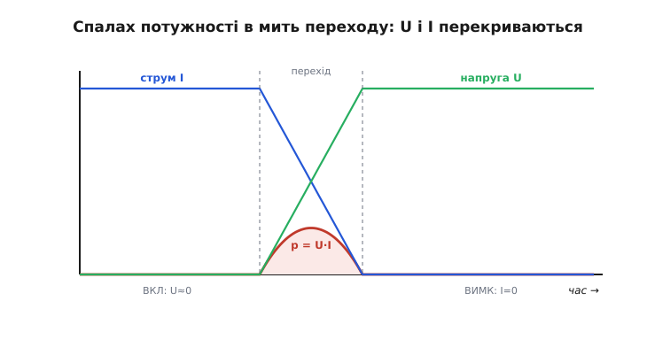
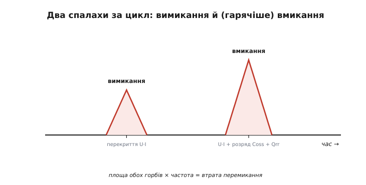
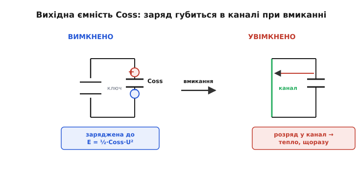
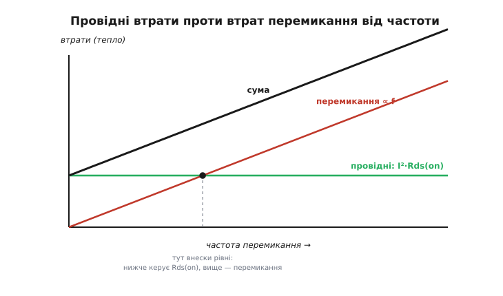

# Втрати перемикання в силових ключах

Ідеальний ключ або замкнений, або розімкнений — і в жодному з цих станів не гріється. Замкнений: на ньому нуль напруги, тож хоч крізь нього тече весь струм, добуток U·I = 0. Розімкнений: крізь нього нуль струму, тож хоч на ньому весь вольтаж, знову U·I = 0. Тепло виділяється тільки там, де напруга й струм **одночасно** не нульові. У сталому стані реальний ключ до цієї зони не потрапляє.

Але щоб перейти з «замкнено» в «розімкнено», ключ **мусить** пройти крізь усе, що між ними. На ту коротку мить, поки він **перемикається**, на ньому водночас є і напруга, і струм — і спалахує порція тепла. Це й є **втрати перемикання** *(switching losses)*: не від того, що ключ поганий, а від того, що перехід не миттєвий. У повільному вмикачі (реле, лампа, нагрівач) таких переходів одиниці за годину — втрати непомітні. Але імпульсний перетворювач живлення перемикає ключ **сотні тисяч разів за секунду**, і кожен перехід коштує тепла. На таких частотах втрати перемикання часто перевищують усе інше — і саме вони, а не опір відкритого каналу, ставлять стелю частоті й вимагають радіатора.

Розберімо це чесно: **де** саме виділяється тепло під час переходу, з **яких доданків** складаються втрати перемикання, як їх **порахувати на пальцях** і що з ними можна вдіяти.

> 🔧 **Навіщо це.** Це та стаття, до якої повертаються, коли перетворювач гріється «незрозуміло звідки»: у сталому режимі струм малий, опір каналу мілліомний, за формулою I²·R мала б виходити холоднота — а корпус пече. Майже завжди винні саме втрати перемикання: невидимі в мультиметрі, вони вилазять на кожному з мільйона переходів за секунду.

## Заборонена зона: чому перехід гарячий

Погляньмо, що відбувається з ключем-MOSFET у типовій силовій схемі — коли він **вимикає** струм, що тече в навантаження. До вимикання канал відкритий: майже вся напруга шини стоїть на навантаженні, на самому ключі — крихітний спад I·[Rds(on)](root:hw-components/rds-on), майже нуль. Після вимикання — навпаки: струм обірвано, вся напруга шини стоїть на ключі, струм крізь нього нуль.

Ключове — **як** він переходить із першого стану в другий. Не стрибком: напруга на стоці не злітає вмить, а струм не обривається вмить. Обидва змінюються за скінченний час, і в цей час вони **перекриваються** — обидва відчутні одночасно. Поки напруга повзе вгору, а струм ще не встиг упасти (чи навпаки), на ключі стоїть, скажімо, пів-напруги при пів-струмі — і в ньому розсіюється чимала миттєва потужність.


*У сталих станах одне з двох завжди нуль: замкнено — нуль напруги, розімкнено — нуль струму, тож U·I = 0 і тепла нема. Під час переходу обидва відчутні одночасно — їхній добуток дає спалах потужності (заштрихована зона). Площа спалаху й є енергія, втрачена за один перехід.*

Цю зону — коли ключ напіввідкритий, з напругою й струмом заразом — можна назвати **забороненою**: у ній ключ поводиться як великий резистор під повним навантаженням і бурхливо гріється. Стале «увімкнено/вимкнено» її оминає; перемикання — ні, воно щоразу її **проорює наскрізь**. Уся боротьба з втратами перемикання зводиться до одного: пройти заборонену зону **якнайшвидше** (щоб спалах був вузький) або **якнайхолодніше** (щоб у момент проходу напруга чи струм уже були малі — про це нижче, у «м'якому» перемиканні).

## Одне перемикання: скільки коштує перехід

Порахуймо енергію одного спалаху. Миттєва потужність у ключі — p(t) = u(t)·i(t), а втрачена за перехід енергія — площа під нею: E = ∫ p dt. Точна форма u(t) та i(t) залежить від приладу й драйвера, але для оцінки досить простого наближення: обидві величини міняються **лінійно** за час переходу t_sw. Тоді добуток u·i — це трикутник (одна росте від нуля, друга падає до нуля), і його середнє значення — рівно чверть від піку U·I; проінтегрувавши по t_sw, дістаємо просту робочу формулу:

```
E(перехід) ≈ ½ · U · I · t(sw)
```

де U — напруга, яку ключ **тримає у вимкненому стані**, I — струм, який він **веде у ввімкненому**, а t_sw — час переходу. Логіка проста: більший вольтаж і струм — вищий спалах; довший перехід — ширший спалах. Ця «половинка» — груба (реальні криві не ідеальні трикутники, а плато Міллера ще й розтягує напругову ділянку), та для інженерної прикидки її вистачає, і вона правильно показує **від чого** залежать втрати.

Тепер головне. Ця енергія губиться **на кожному** перемиканні. Перемикаємо f разів за секунду — множимо:

```
P(перемикання) ≈ E(перехід) · f = ½ · U · I · t(sw) · f
```

Ось звідки болюча залежність від частоти: втрати перемикання ростуть **лінійно з f**. Подвоїв частоту — подвоїв це тепло, хоча ключ, шина й навантаження ті самі.

**Скільки це у ватах.** Хай напівмостовий ключ у перетворювачі тримає U = 48 В, веде I = 5 А, а повний перехід (сума вмикання й вимикання) триває t_sw = 60 нс. Порахуймо втрати на 100 кГц і на 500 кГц.

```c
// Прошивка стежить за власним тепловим бюджетом і оцінює втрати ключа.
// Той самий розрахунок, який вирішує, чи потрібен радіатор.
float U    = 48.0f;      // напруга, яку ключ тримає вимкненим, В
float I    = 5.0f;       // струм, який ключ веде ввімкненим, А
float t_sw = 60e-9f;     // сумарний час переходів (вмик + вимик), с

float E_sw = 0.5f * U * I * t_sw;      // енергія одного перемикання, Дж
// = 0.5 * 48 * 5 * 60e-9 = 7.2e-6 Дж = 7.2 мкДж

float P_100k = E_sw * 100000.0f;       // = 0.72 Вт
float P_500k = E_sw * 500000.0f;       // = 3.6 Вт
```

На 100 кГц спалахи забирають 0.72 Вт — терпимо. На 500 кГц — уже 3.6 Вт, рівно вп'ятеро більше, бо вп'ятеро частіше перемикаємо. І це **лише** втрати перемикання: провідні втрати I²·Rds(on) додаються згори й від частоти не залежать. Якби вдалося прискорити драйвер і вдвічі скоротити t_sw, спалах на кожному переході став би вдвічі вужчим — і ці 3.6 Вт впали б до 1.8 Вт. Ось чому в швидких перетворювачах б'ються за кожну наносекунду переходу.

> 🔧 **Навіщо це.** Ця формула — перший фільтр при виборі частоти перетворювача. Задав бажану f, прикинув E·f, порівняв із тим, скільки тепла ключ здатен відвести (через свій тепловий опір до радіатора) — і одразу видно, чи є сенс піднімати частоту заради меншого дроселя й конденсаторів, чи ключ раніше згорить від перемикань. Часто саме ця оцінка, а не опір каналу, і визначає верхню межу частоти.

## Вмикання й вимикання — не симетричні

«Половинка ½·U·I·t» ховає, що вмикання й вимикання — **два різні** спалахи, і зазвичай не рівні. Розгляньмо їх нарізно, бо саме тут ховаються найнеприємніші сюрпризи.

**Вимикання.** Драйвер починає відсмоктувати заряд із затвора; напруга на затворі падає, канал звужується. Струм ще тримається (навантаження й дросель хочуть його продовжити), а напруга на стоці вже поповзла вгору — перекриття. Драйвер тут **допомагає**: він активно тягне затвор донизу, тож перехід можна зробити швидким, наскільки дозволяє струм драйвера й [заряд затвора Qg](root:hw-components/gate-capacitance).

**Вмикання.** Дзеркально: напруга на стоці падає, струм наростає до навантаженнєвого — знову перекриття, знову спалах. Але у вмиканні часто ховається **додаткове** тепло, якого у вимиканні немає: у ту мить ключ мусить ще й «прибрати» заряд, накопичений у двох інших місцях схеми — у власній вихідній ємності Coss і в діоді, що доти проводив струм. Обидва додатки розберемо окремо, бо саме вони роблять вмикання зазвичай **гарячішим** за вимикання й нерідко стають головними у балансі втрат.


*За один цикл ключ перемикається двічі — вимикається й вмикається, — і це два окремі спалахи. У вмиканні до перекриття U·I додається розряд вихідної ємності й «висмоктування» заряду діода, тож воно зазвичай гарячіше. Сумарна втрата перемикання — площа обох спалахів, помножена на частоту.*

## Друга прихована втрата: вихідна ємність Coss

У кожного MOSFET між стоком і витоком є паразитна **вихідна ємність** *(output capacitance, Coss)* — вона складається з ємностей структури кристала. Коли ключ **вимкнений** і тримає напругу U, ця ємність **заряджена** до U, тобто в ній запасено E = ½·Coss·U². Здавалося б, запасена — то й нехай лежить. Але коли ключ **вмикається**, він замикає стік на витік майже накоротко — і весь цей запас **розряджається крізь власний канал**, перетворюючись на тепло **всередині ключа**. Заряджав ємність — від шини (це окрема історія), розряджаєш — у власне тепло; на кожному циклі.

Отже, до перекриття U·I на вмиканні додається ще й розряд Coss:

```
E(Coss) ≈ ½ · Coss · U²        (губиться при КОЖНОМУ вмиканні)
P(Coss) ≈ ½ · Coss · U² · f
```

Ключова риса: ця втрата **не залежить від струму навантаження**. Навіть якщо перетворювач працює на холостому ходу (I ≈ 0) і перекриття U·I мізерне, розряд Coss відбувається щоразу — тому імпульсний перетворювач гріється навіть без навантаження, і на легкому навантаженні його ККД падає. Зате вона квадратично залежить від напруги: підняв шину вдвічі — ця втрата вчетверо. У низьковольтних схемах Coss-втрата дрібна, у високовольтних (сотні вольтів) — часто **головна** складова втрат перемикання.

**Одне застереження про точність.** Coss сильно **нелінійна** — при малій напрузі на стоці вона у рази більша, ніж при повній. Тому проста ½·Coss·U² з одним числом Coss дає лише грубу оцінку; даташит подає для цього окрему **енергію Eoss** (уже проінтегровану по напрузі) або криву Coss(U). Для прикидки бери Eoss із даташита; ½·Coss·U² годиться, коли Eoss не наведено, — але пам'ятай, що це наближення.


*Вимкнений ключ тримає напругу U, і його вихідна ємність Coss заряджена до ½·Coss·U². При вмиканні цей запас розряджається крізь власний канал у тепло — щоразу, незалежно від струму навантаження. Тому втрата Coss·f є навіть на холостому ході, а з напругою росте квадратично.*

**Скільки це у ватах.** Хай ключ у 60-вольтовій схемі має за даташитом Eoss = 90 нДж при 60 В (або, коли дано лише Coss ≈ 100 пФ, оцінка ½·100пФ·60² ≈ 180 нДж — видно, як нелінійність «збиває» число вдвічі). Візьмімо чесне Eoss = 90 нДж:

```c
float Eoss = 90e-9f;                 // з даташита, при робочій напрузі, Дж
float P_coss_200k = Eoss * 200000.0f;  // = 0.018 Вт  — дрібниця
float P_coss_2M   = Eoss * 2000000.0f; // = 0.18 Вт   — уже помітно на ВЧ
```

На звичайних сотнях кілогерц Coss-втрата тут дрібна, але з переходом у мегагерцовий діапазон (де тепер працюють нові прилади) вона підростає — і саме через неї «безструмове» перемикання все одно гріє. Ця сама енергія — фундаментальна межа: щоб її прибрати, вигадали «м'яке» перемикання (нижче).

## Третя втрата: зворотне відновлення діода

Якщо в схемі є діод, що проводить струм у частину циклу (наприклад, черговий діод у [понижувальному перетворювачі](root:hw-power/buck)), він теж додає до втрат перемикання — і додає їх **не собі, а ключу**, що його «перебиває».

Річ у тім, що звичайний кремнієвий p-n-діод не закривається миттєво. Поки він проводив у прямому напрямку, у його базі накопичився заряд неосновних носіїв. Коли ключ починає вмикатися й **притискає** діод у зворотному напрямку, цей накопичений заряд треба спершу **висмоктати** — і поки він смокчеться, діод ще проводить, пропускаючи короткий сплеск **зворотного** струму. Цей заряд звуть **зарядом зворотного відновлення** *(reverse recovery charge, Qrr)*, а сам сплеск летить **крізь ключ, що вмикається** — при повній напрузі на ньому. Ще один спалах тепла, знову у ключі:

```
E(Qrr) ≈ Qrr · U        (приблизно; при КОЖНОМУ вмиканні на діод)
```

Тому в швидких перетворювачах як черговий елемент беруть [діод Шотткі](root:embedded/zener-schottky) або [синхронний MOSFET](root:hw-power/sync-rectifier): у Шотткі провідність несуть лише основні носії, накопиченого заряду майже немає, і зворотного відновлення практично теж — сплеск зникає. Поставиш туди звичайний випрямний діод — отримаєш і сплеск струму, що перегріє ключ, і викид напруги з дзвоном, і зайві [електромагнітні завади](root:hw-power/emc-filtering). Зворотне відновлення — класична причина, чому «та сама схема» з дешевим діодом гріється й шумить, а з правильним — ні.

> 🔧 **Навіщо це.** Дивлячись даташит діода для імпульсної схеми, шукай не лише пряме падіння Vf, а й **Qrr** (чи trr — час відновлення). Мале Qrr економить вати тепла на кожному циклі перемикання — і не десь у діоді, а саме у твоєму дорогому силовому ключі, який цей сплеск і приймає. Для частот від десятків кілогерц це не дрібниця, а прямий внесок у грійку й у завади.

## Куди зникає заряд затвора

Є ще один доданок, який часто плутають зі втратами перемикання, хоч фізика в нього окрема — **втрата на керування затвором** *(gate-drive loss)*. Щоб перемкнути MOSFET, драйвер щоразу заряджає й розряджає ємність затвора, «переливаючи» заряд Qg. Уся ця енергія зрештою розсіюється — але **не в самому ключі**, а в опорах на шляху заряду: у вихідному опорі драйвера й у резисторі затвора. За цикл драйвер віддає:

```
P(затвора) ≈ Qg · V(драйв) · f
```

де V(драйв) — напруга живлення драйвера (типово 10–12 В). Ця потужність зазвичай невелика (частки вата), і гріє вона драйвер, а не силовий ключ, — тому в тепловому балансі **самого ключа** її не рахують. Але для частотної межі вона важлива: на дуже високих частотах драйвер сам починає гріти, і це ще одна причина, чому частоту не задереш безмежно. Детальніше про заряд Qg, плато Міллера й вибір драйвера — в окремій темі про [ємність затвора](root:hw-components/gate-capacitance); тут досить пам'ятати, що керування затвором коштує окремої, хоч і невеликої, енергії, яка теж росте з частотою.

## Повна картина: провідні втрати проти перемикання

Складімо все докупи. Потужність, що гріє силовий ключ, — це сума двох світів із різною поведінкою:

```
P(ключа) = P(провідні)   + P(перемикання)
         = I²·Rds(on)·D  + (E_overlap + E_Coss + E_Qrr)·f
           └─ від струму,   └─ від частоти,
              НЕ від частоти    НЕ від струму (Coss) / від струму (overlap)
```

- **Провідні втрати** — від струму й опору відкритого каналу; від частоти **не залежать**. Керуються [Rds(on)](root:hw-components/rds-on) і робочою шпаруватістю D (часткою часу, коли ключ відкритий).
- **Втрати перемикання** — від енергії трьох спалахів на кожному переході (перекриття U·I, розряд Coss, відновлення діода); **ростуть із частотою** і мало залежать від опору каналу.

За **низьких** частот верх беруть провідні втрати — там вибирають ключ із найменшим Rds(on), а на Coss і Qg можна не зважати. За **високих** частот верх беруть втрати перемикання — там важать малі Coss, Qrr, Qg і швидкий драйвер, а не гранично малий опір. Десь між ними лежить частота, де обидва внески зрівнюються; вище неї піднімати частоту вже невигідно — виграш у розмірі дроселя з'їдається зростанням тепла.


*Провідні втрати від частоти не залежать — горизонталь. Втрати перемикання ростуть із частотою — похила пряма. Сумарне тепло — їхня сума: за низьких частот керує опір каналу, за високих — швидкість і паразитні ємності. Точка перетину підказує, де піднімати частоту вже недоцільно.*

Це й пояснює головний конструкторський компроміс перетворювача. Вища частота — менші (а отже дешевші й легші) дросель і конденсатори, бо енергії на цикл треба менше. Але вища частота — більше втрат перемикання, тобто гарячіший ключ. Інженер шукає золоту середину: досить високо, щоб магнітні деталі були малі, але не так, щоб ключ згорів на перемиканнях. Саме тому «звичайні» перетворювачі десятиліттями сиділи в діапазоні сотень кілогерц — вище кремній грівся надто.

## Швидше — але не задарма: втрати проти завад

З формули ½·U·I·t_sw напрошується: роби перехід якнайшвидшим (менший t_sw), і втрати впадуть. Це правда — але за це доводиться платити **завадами**.

Швидкий перехід означає різку зміну напруги (велике dU/dt) і струму (велике dI/dt). А різкі фронти — це, по-перше, багатий спектр високочастотних гармонік, тобто [електромагнітні завади](root:hw-power/emc-filtering), які треба потім фільтрувати й екранувати. По-друге, різкий dI/dt на неминучих паразитних індуктивностях монтажу породжує викиди напруги й **дзвоніння** *(ringing)* — а надто високий викид може й пробити ключ, вигнавши його за [зону безпечної роботи](root:hw-components/safe-operating-area). Тому [резистором затвора](root:hw-components/mosfet-power-switch) перехід свідомо **пригальмовують** до розумної швидкості: швидше — холодніше, але «брудніше» в ефірі й небезпечніше стрибками; повільніше — тихіше й безпечніше, але гарячіше. Оптимум — не «якнайшвидше», а «настільки швидко, наскільки терплять завади й викиди».

Є й друга небезпека надто швидких фронтів. Різкий стрибок напруги на стоці крізь паразитну ємність затвор–стік може **перекинутися** назад на затвор і ненавмисно **прочинити** вже вимкнений ключ — [паразитне вмикання](root:hw-power/snubbers-dvdt) *(dv/dt-induced turn-on)*. У напівмостовій схемі це прямий шлях до наскрізного струму крізь обидва ключі. Тому швидкість переходу — завжди компроміс, і «чим швидше, тим краще» тут не працює.

## М'яке перемикання: пройти зону, коли в ній нуль

Є радикальніший шлях, ніж просто прискорювати перехід: зробити так, щоб у **момент** переходу напруга або струм на ключі вже були **нульові**. Тоді добуток U·I у забороненій зоні мізерний — і спалаху майже немає, хоч перехід і не миттєвий. Це **м'яке перемикання** *(soft switching)*, на противагу звичайному **жорсткому** *(hard switching)*, де ключ перемикають «в лоб», під повною напругою й струмом.

Двоє воріт до м'якості:

- **Перемикання при нулі напруги** *(zero-voltage switching, ZVS)* — влаштувати схему так, щоб до моменту вмикання напруга на ключі вже впала до нуля (її «зняла» стороння дія — резонанс чи струм дроселя). Тоді і перекриття U·I на вмиканні зникає, і — головне — **не витрачається** ½·Coss·U², бо ємність розряджається не в канал, а м'яко, зовнішнім струмом. ZVS особливо цінне саме тим, що прибирає Coss-втрату.
- **Перемикання при нулі струму** *(zero-current switching, ZCS)* — влаштувати так, щоб струм крізь ключ спадав до нуля до моменту вимикання. Тоді спалах вимикання зникає, а заразом і сплеск зворотного відновлення діода.

Саме заради цього будують [резонансні перетворювачі](root:hw-power/resonant-converter) (класи LLC, LCC та інші): у них LC-контур навмисно «гойдає» напругу й струм так, щоб ключі перемикалися в нульових точках. Ціна — складніший розрахунок і керування, вужчий діапазон, де м'якість зберігається. Виграш — можливість піднімати частоту в мегагерци, майже не платячи втратами перемикання, і робити перетворювачі дуже щільними й тихими. Коротко: жорстке перемикання простіше, м'яке — холодніше на високих частотах; де межа кремнію по теплу заважає, туди й приходить резонанс.

> 🔧 **Навіщо це.** Коли бачиш перетворювач, що працює на сотні кілогерц чи мегагерци й при цьому холодний, — майже напевно він м'який (резонансний, ZVS/ZCS). Жорсткий на таких частотах пік би немилосердно. Це практичний маркер: висока частота **плюс** холодний корпус означає, що конструктор вклався в м'яке перемикання, а не просто «взяв швидший ключ».

## Матеріал теж вирішує

Наостанок — чому останніми роками про втрати перемикання говорять так багато. Довгий час силовий ключ означав кремнієвий MOSFET або [IGBT](root:hw-components/igbt), і їхні втрати перемикання ставили жорстку стелю частоті. Нові **широкозонні** *(wide-bandgap)* напівпровідники — карбід кремнію (SiC) і нітрид галію (GaN) — міняють правила: у них менша вихідна ємність на однаковий струм, менший (а в GaN практично відсутній) заряд зворотного відновлення й швидші, чистіші фронти. Простими словами — та сама заборонена зона проорюється дешевше, тож частоту можна підняти в рази без теплової катастрофи. Саме тому зарядки телефонів раптом поменшали й полегшали: GaN-ключ дозволив підняти частоту, а з нею зменшити трансформатор і конденсатори. Чому матеріал так впливає на швидкість і опір — окрема тема про [питомий опір Ron·A](root:hw-components/specific-on-resistance-metric); тут досить бачити, що зменшення втрат перемикання — головна причина, чому GaN і SiC витісняють кремній у швидких перетворювачах.

Отже, повна відповідь на «звідки тепло в ключі, коли струм малий»: перемикання — це кожнораз прохід крізь заборонену зону, а плата за прохід складається з перекриття напруги й струму (½·U·I·t_sw), розряду вихідної ємності в канал (½·Coss·U²) і висмоктування заряду діода (Qrr·U), і вся ця плата множиться на частоту. Побороти її можна трьома шляхами: прискорити перехід (у межах, що дозволяють завади), прибрати паразитні заряди правильним вибором приладу й діода, або зробити перемикання м'яким, щоб проходити зону в нульовій точці. Який шлях обрати — диктує частота: до сотень кілогерц часто досить швидкого драйвера й доброго діода, вище — приходять м'яке перемикання й широкозонні матеріали.
