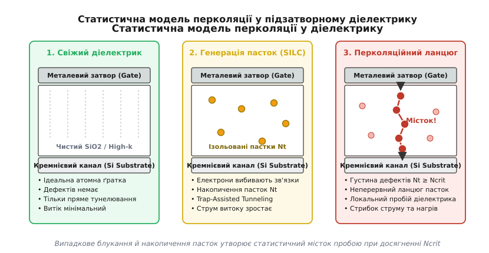
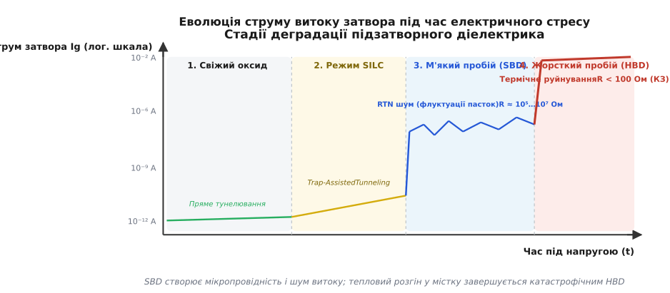
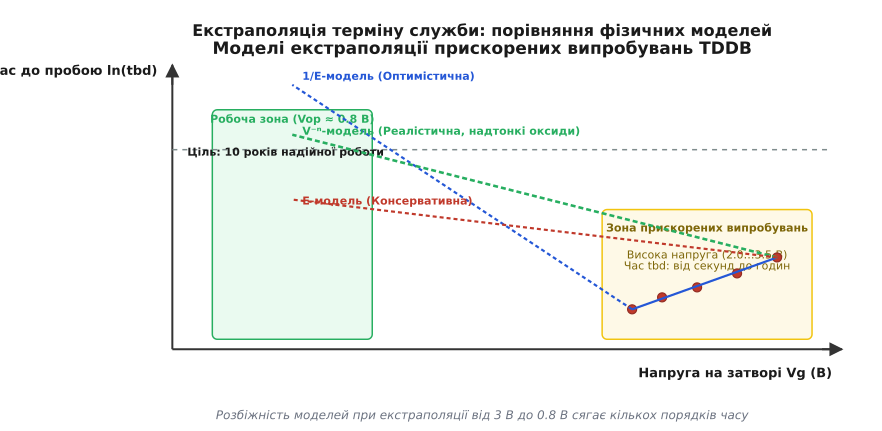
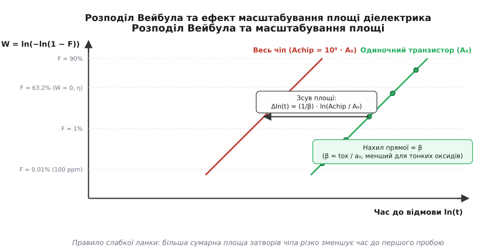

# Часо-залежний пробій оксиду (TDDB)

<preknowlist>
- [Будова MOSFET](root:hw-components/mosfet-structure) — планарна структура транзистора, тонкий підзатворний діелектрик і наведення інверсійного каналу.
- [Техпроцес](root:hw-components/process-node) — масштабування транзисторів, товщина підзатворного оксиду tox та геометричні норми мікросхем.
- [Керування полем](root:hw-components/field-control) — ємнісний затвор, напруженість електричного поля та механізми переносу заряду.
- [Квантове тунелювання](root:ph-quantum/quantum-tunnelling) — проходження носіїв заряду крізь потенціальний бар'єр діелектрика (пряме та Фаулера-Нордгейма).
- [ESD-пошкодження](root:hw-components/esd-damage) — миттєвий електричний пробій порівняно з повільною часо-залежною деградацією діелектрика.
</preknowlist>

У сучасному мікропроцесорі з геометричними нормами менше ніж 10 нанометрів товщина підзатворного діелектрика зменшена до `1.0…1.4 нм` — шару всього з чотирьох-шести атомних моношарів діоксиду кремнію або діоксиду гафнію. За номінальної напруги живлення ядра `0.85 В` напруженість електричного поля всередині цього ультратонкого шару сягає `6…10 МВ/см` (`0.6…1.0 В/нм`). Для порівняння: сухе повітря за нормальних умов зазнає електричного пробою за напруженості `30 кВ/см`, а масивні полімерні ізолятори руйнуються при `1 МВ/см`. Підзатворний діелектрик інтегральної мікросхеми безперервно працює в екстремальних електростатичних умовах, що знаходяться безпосередньо біля порогу фундаментальної міцності твердого тіла.

За такої напруженості поля кристал не виходить з ладу миттєво лише тому, що класичний лавинний пробій діелектрика вимагає полів понад `12…15 МВ/см`. Проте постійний електричний стрес у поєднанні з робочим нагрівом кристала до `85…125 °C` викликає повільну, незворотну генерацію дефектів на атомному рівні. Електрони, що тунелюють крізь потенціальний бар'єр затвора, поступово вибивають атоми з вузлів ґратки й розривають міжатомні хімічні зв'язки. Коли локальна концентрація накопичених дефектів досягає критичної межі, вони раптово замикаються в неперервний високопровідний місток між затвором і каналом транзистора, викликаючи катастрофічний пробій і загибель інтегральної схеми. Цей фундаментальний механізм зношування діелектрика називається **часо-залежним пробоєм діелектрика** (англ. *Time-Dependent Dielectric Breakdown*, скорочено **TDDB**).

TDDB становить одну з головних фізичних меж масштабування кремнієвої електроніки. Він визначає максимальну напругу, яку можна подати на транзистор, обмежує граничну робочу температуру процесорів і вимагає складних статистичних моделей для гарантування десятирічного терміну служби чіпів у смартфонах, серверах та автомобільних блоках керування.

---

## 1. Транспорт носіїв заряду крізь підзатворний діелектрик

Підзатворний ізолятор (діоксид кремнію `SiO₂`, оксинітрид кремнію `SiON` або діелектрик із високою проникністю `HfO₂`) за своєю природою є енергетичним бар'єром для електронів провідності та дірок. Висота потенціального бар'єру на межі кремній–діоксид становить приблизно `3.15 еВ` для електронів та `4.5 еВ` для дірок, а ширина забороненої зони самого `SiO₂` сягає `8.9 еВ`.

За класичною фізикою ідеальний діелектрик взагалі не повинен пропускати струм. Проте за товщини шару в кілька нанометрів у дію вступають квантовомеханічні закони, і електрони отримують кінцеву ймовірність пройти крізь бар'єр шляхом квантового тунелювання. Залежно від прикладеної напруги та товщини оксиду домінують два принципово різні режими тунелювання.

```
                  ТУНЕЛЬНІ МЕХАНІЗМИ ПЕРЕНОСУ
                 ┌─────────────────────────────┐
                 │  Електричне поле на затворі │
                 └──────────────┬──────────────┘
                                │
             ┌──────────────────┴──────────────────┐
             ▼                                     ▼
┌─────────────────────────┐           ┌─────────────────────────┐
│     Пряме тунелювання   │           │   Тунелювання Фаулера-  │
│    (Direct Tunneling)   │           │         Нордгейма       │
│      tox < 3.0 нм       │           │       tox > 3.0 нм      │
│  Трапецеподібний бар'єр │           │    Трикутний бар'єр     │
│   Електрони пронизують  │           │   Електрони входять у   │
│     увесь шар наскрізь  │           │ зону провідності оксиду │
└─────────────────────────┘           └─────────────────────────┘
```

### Тунелювання Фаулера–Нордгейма (Fowler–Nordheim Tunneling)

У відносно товстих оксидах (`t_ox > 3…4 нм`) за високих електричних полів (`E_ox > 6…7 МВ/см`) падіння напруги на діелектрику `V_ox = E_ox · t_ox` перевищує висоту енергетичного бар'єру на межі `Φ_B / q`. Внаслідок цього зона провідності діелектрика нахиляється настільки круто, що прямокутний або трапецеподібний бар'єр трансформується у вузький трикутний бар'єр.

Електрони з зони провідності кремнію тунелюють крізь трикутну вершину бар'єру безпосередньо в зону провідності діелектрика, після чого дрейфують під дією сильного поля до анода (затвора). Густина струму Фаулера–Нордгейма описується експоненційним рівнянням:

```
J_FN
= A_FN · E_ox² · exp(-B_FN / E_ox)        [струм Фаулера-Нордгейма крізь трикутний бар'єр]
```

де константи `A_FN` та `B_FN` залежать від висоти бар'єру `Φ_B` та ефективної маси електрона в діелектрику `m_ox`. Характерною рисою цього режиму є сильна залежність від напруженості поля: подвоєння поля збільшує витік на багато порядків, але сам електрон набуває високої кінетичної енергії всередині зони провідності діелектрика.

### Пряме квантове тунелювання (Direct Tunneling)

У сучасних транзисторах із товщиною підзатворного шару менше ніж `3 нм` падіння напруги на затворі є меншим за висоту бар'єру (`V_ox < Φ_B / q`). Бар'єр залишається трапецеподібним по всій товщині.

Електрон пронизує всю товщину діелектрика за один квантовий стрибок, не переходячи в зону провідності ізолятора, і потрапляє безпосередньо в протилежний електрод. Густина струму прямого тунелювання експоненційно залежить від фізичної товщини шару:

```
J_DT
= A_DT · (V_ox / t_ox)² · exp(-B_DT · t_ox / V_ox · [1 - (1 - V_ox / Φ_B)^(3/2)]) [пряме тунелювання]
```

Кожне зменшення товщини `SiO₂` всього на `0.2 нм` (один моношар атомів) збільшує струм прямого витоку затвора приблизно в `10 разів`. За товщини `1.2 нм` струм витоку свіжого діелектрика досягає значень `1…10 А/см²`, що створює колосальний потік носіїв заряду через атомну ґратку затвора навіть під час звичайної роботи чіпа.

---

## 2. Мікроскопічні механізми генерації дефектів

Проходження тунельних електронів крізь ізолятор саме по собі не руйнує матеріал миттєво, але кожен електрон переносить енергію. Зіткнення швидких носіїв із кристалічною ґраткою та депасивація хімічних зв'язків поступово створюють стабільні точкові дефекти — електронні пастки (англ. *electron traps*).

У фізиці напівпровідників виділяють три головні фізичні моделі утворення пасток під дією електричного поля та струму.

```
                 МОДЕЛІ ГЕНЕРАЦІЇ ДЕФЕКТІВ У ДІЕЛЕКТРИКУ
               ┌─────────────────────────────────────────┐
               │    Електричний та термічний стрес       │
               └────────────────────┬────────────────────┘
                                    │
       ┌────────────────────────────┼────────────────────────────┐
       ▼                            ▼                            ▼
┌────────────────────────┐ ┌────────────────────────┐ ┌────────────────────────┐
│  Інжекція дірок з      │ │ Термохімічна модель    │ │ Вивільнення водню      │
│  анода (AHI Model)     │ │ (E-Model, Dipole Relax)│ │ (Hydrogen Release)     │
│ • Гарячі електрони     │ │ • Електричне поле      │ │ • Електрони депасивують│
│   вибивають дірки      │ │   деформує зв'язки Si-O│   зв'язки Si-H           │
│ • Дірки рекомбінують,  │ │ • Зниження бар'єру     │ │ • Водень мігрує і      │
│   розриваючи зв'язки   │ │   активації розриву    │   утворює вакансії Si-O  │
└────────────────────────┘ └────────────────────────┘ └────────────────────────┘
```

### Модель інжекції дірок з анода (Anode Hole Injection, AHI)

Ця модель є класичним поясненням деградації у відносно товстих діелектриках (`t_ox > 3 нм`). Електрони, прискорені сильним полем у зоні провідності діелектрика, входять в анодний електрод (затвор або кремнієву підкладку) з високою кінетичною енергією.

Внаслідок процесів ударної іонізації гарячий електрон передає енергію електронам валентної зони анода, утворюючи пару електрон–дірка. Новоутворена високоенергетична дірка («гаряча дірка») під дією електричного поля прискорюється у зворотному напрямку та інжектується назад у валентну зону діелектрика.

Рухаючись крізь діелектрик, дірка захоплюється глибоким рівнем або рекомбінує з тунелюючим електроном. Енергія рекомбінації (`4…5 еВ`) виділяється локально у вузлі ґратки, що призводить до розриву мостикового зв'язку кремній–кисень `Si-O-Si` та утворення нейтральної кисневої вакансії (парамагнітного дефекту типу `E'`-центру, де атом кремнію має нескомпенсований вільний зв'язок `≡Si•`).

### Термохімічна модель розриву зв'язків (E-Model / Dipole Relaxation)

У суб-2-нанометрових діелектриках кінетична енергія електронів є недостатньою для ефективної ударної іонізації та генерації гарячих дірок на аноді (енергія електрона обмежена прикладеною напругою `q · V_gate < 1.5 еВ`). Проте дефекти продовжують утворюватися навіть за низьких напруг.

Термохімічна модель, розроблена Макферсоном (*J. W. McPherson*), стверджує, що першопричиною є пряма дія локального електричного поля на полярні хімічні зв'язки `Si-O`. Зв'язок `Si-O` має сильний власний дипольний момент `p_dipole ≈ 3…4 Дебая` через різницю електронегативностей кремнію (`1.9`) та кисню (`3.44`).

Зовнішнє електричне поле `E_local` механічно розтягує та поляризує диполь, зміщуючи потенційні криві міжатомної взаємодії. Це безпосередньо знижує тепловий бар'єр активації, необхідний для спонтанного розриву зв'язку:

```
E_a(E)
= E_a0 - p_dipole · E_local               [термохімічне зниження бар'єру розриву зв'язку]
```

де `E_a0 ≈ 2.0…2.2 еВ` — вихідна енергія активації розриву зв'язку `Si-O` за нульового поля. Присутність сильного поля `8 МВ/см` знижує енергетичний бар'єр розриву до значень `0.6…0.8 еВ`, які легко долаються за рахунок теплових коливань ґратки при температурах `85…125 °C`. Розірваний зв'язок релаксує, утворюючи стабільну кисневу вакансію.

### Модель вивільнення водню (Hydrogen / Proton Release Model)

Під час виробництва мікросхем межу поділу кремній–діелектрик пасивують воднем при відпалі у водневому середовищі (`H₂` або формінг-газ `N₂/H₂`), щоб зв'язати ненасичені зв'язки кремнію й усунути поверхневі пастки (`≡Si-H`, відомі як `P_b`-центри).

Коли тунельні електрони досягають анодної межі, вони взаємодіють зі зв'язками `Si-H`. Якщо енергія електрона перевищує поріг депасивації (`≈ 1.5…2.0 еВ`), водень вибивається у вигляді протона `H⁺` або нейтрального атома `H⁰`. Вивільнений водень дифундує крізь об'єм діелектрика, взаємодіє з містковими атомами кисню `Si-O-Si`, формує гідроксильні групи `Si-OH` і залишає після себе ненасичений кремнієвий дефект `≡Si•` (електронну пастку).

### Мікроскопічна природа дефектів: центри P_b та E'

Дослідження методом електронного парамагнітного резонансу (ЕПР) показують, що за деградацію відповідають два основні типи точкових дефектів:
1. **Інтерфейсні центри `P_b` (`P_b0` та `P_b1`).** Вони розташовані безпосередньо на межі кремній–діелектрик і являють собою трикоординований атом кремнію з одним неспареним електроном (`•Si≡Si₃`), орієнтованим у напрямку зв'язку `[111]`. Ці дефекти мають енергетичні рівні всередині забороненої зони кремнію й викликають деградацію крутизни та зсув порогової напруги транзистора.
2. **Об'ємні `E'`-центри.** Це кисневі вакансії в товщі діелектрика, де атом кремнію втрачає зв'язок із сусіднім киснем і релаксує з утворенням позитивно зарядженого або нейтрального парамагнітного центру (`≡Si•  ⁺Si≡`). Саме просторове накопичення `E'`-центрів утворює основу перколяційного містка пробою.

---

## 3. Перколяційна модель руйнування діелектрика

Кожен утворений точковий дефект є локалізованим квантовим станом у забороненій зоні діелектрика. Наявність пастки дозволяє електронам перескакувати крізь неї за механізмом асистованого пастками тунелювання (Trap-Assisted Tunneling, TAT).

Поки пастки розташовані далеко одна від одної, вони лише трохи збільшують фоновий витік струму. Проте процес генерації дефектів триває безперервно, і їхня просторова густина зростає.

```
       ГЕОМЕТРІЯ ПЕРКОЛЯЦІЇ У ДІЕЛЕКТРИКУ
      
       Металевий затвор (Gate)
      ═════════════════════════════════════════
      │     o               o                 │
      │           o   ●                       │
      │   o           │                       │  t_ox
      │               ●   o                   │
      │        o      │                       │
      │               ●                       │
      ═════════════════════════════════════════
       Кремнієвий канал (Channel)
       
       (●) — ланцюжок пасток, що з'єднався у місток
       (o) — розрізнені ізольовані пастки
```

Математичний опис цього процесу базується на **теорії перколяції** (від латинського *percolatio* — просочування, фільтрація). Якщо уявити діелектрик як дискретну тривимірну ґратку комірок розміром `a_0 ≈ 0.4 нм`, кожна комірка з часом може випадково перейти зі стану «ізолятор» у стан «дефект».

У міру заповнення ґратки дефектами настає критичний момент — **поріг перколяції**, коли випадково згенеровані сусідні пастки вперше торкаються одна одної, утворюючи безперервний провідний ланцюжок, який сполучає затвор із кремнієвою підкладкою.


*Статистична модель перколяції у підзатворному діелектрику: від чистої атомної ґратки крізь накопичення ізольованих пасток до утворення критичного провідного містка пробою.*

### Вплив товщини на критичну концентрацію пасток

Критична густина дефектів `N_crit`, необхідна для формування перколяційного кластера, кардинально залежить від товщини шару `t_ox`.

* Для товстого оксиду (`t_ox = 5.0 нм`) вертикальний стовпчик містить `12…15` послідовних комірок. Ймовірність того, що випадково розкидані в просторі пастки вишикуються в один ланцюжок із 15 елементів, є мізерно малою. Щоб такий ланцюг замкнувся, потрібно заповнити пастками значну частку всього об'єму діелектрика (`N_crit ≈ 10²⁰ см⁻³`).
* Для ультратонкого діелектрика (`t_ox = 1.2 нм`) товщина становить лише `3` атомні комірки. Щоб пробити такий шар, достатньо всього трьох дефектів, які випадково опинилися в одному мікроскопічному стовпчику. Критична густина дефектів стрімко падає до `N_crit ≈ 10¹⁸ см⁻³`.

Саме тому ультратонкі підзатворні діелектрики мають значно менший запас міцності до накопичення радіаційних або польових дефектів. Детальний математичний вивід функції надійності та просторової статистики наведено у вставці [Математика розподілу Вейбула для TDDB](root:hw-components/tddb/math-weibull-percolation.md).

---

## 4. Етапи деградації та електричні прояви

Деградація підзатворного ізолятора є поетапним процесом, який проходить крізь характерні фази зі специфічними електричними сигнатурами.


*Еволюція струму витоку затвора під час електричного стресу: від струмів прямого тунелювання через режим SILC та м'який пробій до катастрофічного термічного руйнування.*

```
                 ФАЗИ ДЕГРАДАЦІЇ ДІЕЛЕКТРИКА ПРИ TDDB
┌─────────────────────────────────────────────────────────────────────────┐
│ 1. Свіжий діелектрик                                                    │
│    • Мінімальний тунельний струм витоку                                 │
│    • Відсутність внутрішніх дефектів у ґратці                           │
└────────────────────────────────────┬────────────────────────────────────┘
                                     ▼
┌─────────────────────────────────────────────────────────────────────────┐
│ 2. Режим SILC (Stress-Induced Leakage Current)                          │
│    • Накопичення ізольованих пасток Nt < Ncrit                          │
│    • Повільне монотонне зростання витоку за низьких полів               │
└────────────────────────────────────┬────────────────────────────────────┘
                                     ▼
┌─────────────────────────────────────────────────────────────────────────┐
│ 3. М'який пробій (Soft Breakdown, SBD)                                  │
│    • Замикання першого одиничного перколяційного ланцюжка               │
│    • Опір містка R ≈ 10⁵…10⁷ Ом, струм витоку зростає на мікроампери   │
│    • Інтенсивний RTN шум (Random Telegraph Noise)                       │
└────────────────────────────────────┬────────────────────────────────────┘
                                     ▼
┌─────────────────────────────────────────────────────────────────────────┐
│ 4. Прогресуючий пробій (Progressive Breakdown, PBD)                     │
│    • Локальний джоулів нагрів у точці протікання струму                 │
│    • Термохімічне розширення провідного каналу                          │
└────────────────────────────────────┬────────────────────────────────────┘
                                     ▼
┌─────────────────────────────────────────────────────────────────────────┐
│ 5. Жорсткий пробій (Hard Breakdown, HBD)                                │
│    • Незворотний тепловий розгін (Thermal Runaway)                      │
│    • Локальна температура > 1400 °C (плавлення Si та металу затвора)    │
│    • Опір R < 100 Ом — повне коротке замикання затвора                  │
└─────────────────────────────────────────────────────────────────────────┘
```

### Фаза 1. Струм витоку, індукований стресом (SILC)

На початковому етапі накопичення пасток утворює додаткові енергетичні сходинки в забороненій зоні. Електрони отримують можливість тунелювати у два або три короткі кроки замість одного довгого стрибка крізь бар'єр.

Це явище називається **струмом витоку, індукованим стресом** (англ. *Stress-Induced Leakage Current*, **SILC**). SILC проявляється як помітне збільшення струму затвора саме в області малих і середніх робочих напруг (`0.5…1.2 В`). Для цифрових схем це веде до монотонного зростання статичного струму спокою чіпа (`I_DDQ`), а для енергонезалежної флеш-пам'яті `NAND/NOR` — до повільного витоку заряду з плаваючого затвора й втрати записаних даних.

### Фаза 2. М'який пробій (Soft Breakdown, SBD)

Коли перший перколяційний ланцюжок дефектів нарешті з'єднує затвор і канал, виникає **м'який пробій** (Soft Breakdown). Опір утвореного квантового мікроканалу становить порядку `10⁵…10⁷ Ом`. Струм затвора стрибкоподібно зростає від пікоампер до одиниць мікроампер.

Головною діагностичною ознакою м'якого пробою є поява сильного **телеграфного шуму** (англ. *Random Telegraph Noise*, **RTN**). Струм затвора починає хаотично перемикатися між двома або кількома дискретними рівнями. Фізична причина цього шуму полягає в тому, що поодинокі електрони почергово захоплюються пастками, розташованими поруч із провідним каналом, і вивільняються з них. Захоплений негативний заряд своїм кулонівським полем перекриває сусідній провідний шлях, модулюючи його провідність.

У багатьох цифрових схемах транзистор після настання SBD ще здатний перемикатися, оскільки витік у кілька мікроампер не може повністю пересилити струм відкритого каналу (`100…500 мкА`). Проте в аналогових блоках, джерелах опорної напруги та комірках пам'яті SRAM м'який пробій призводить до спотворення рівнів та функціональних збоїв.

### Фаза 3. Прогресуючий та жорсткий пробій (PBD та HBD)

Протікання струму крізь мікроскопічний перколяційний місток перерізом менше ніж `1 нм²` створює колосальну локальну густину струму (`J > 10⁶ А/см²`). Енергія, що розсіюється на опорі містка, викликає локальне джоулеве нагрівання.

Підвищення локальної температури на десятки чи сотні градусів різко прискорює термохімічну генерацію нових дефектів безпосередньо навколо існуючого каналу. Провідний місток починає лавиноподібно розширюватися — настає стадія **прогресуючого пробою** (Progressive Breakdown, PBD).

Кінцевою точкою процесу є **жорсткий пробій** (Hard Breakdown, HBD) — катастрофічний тепловий розгін. Густина струму перевищує `10⁸ А/см²`, а температура в зоні пробою перевищує точку плавлення кремнію (`1414 °C`). Кремній підкладки та метал затвора розплавляються й перемішуються, утворюючи мікроскопічний кратер діаметром у десятки нанометрів. Опір діелектрика падає нижче `100 Ом`, виникає постійне коротке замикання затвора на підкладку, і транзистор остаточно виходить з ладу.

---

## 5. 3D-геометрія FinFET та GAA: крайова концентрація поля

Перехід мікроелектроніки від планарних польових транзисторів до тривимірних структур FinFET та нанолистових транзисторів GAA (Gate-All-Around) суттєво змінив фізичну картину TDDB.

У планарному транзисторі електричне поле в діелектрику є однорідним по всій площині затвора. У FinFET затвор огинає вертикальне кремнієве ребро прямокутного перерізу з трьох боків.

```
                   РОЗПОДІЛ ПОЛЯ У FinFET ТА GAA
                   
                  Металевий затвор (Gate)
         ┌────────────────────────────────────────┐
         │                                        │
         │         ┌────────────────────┐         │
         │         │  Діелектрик Gate   │         │
         │     ┌───┴────────────────────┴───┐     │
         │     │◄── Крайова концентрація    │     │
         │     │    поля E на кутах ребра   │     │
         │     │   ┌────────────────────┐   │     │
         │     │   │                    │   │     │
         │     │   │ Кремнієве ребро Si │   │     │
         │     │   │      (Fin /        │   │     │
         │     │   │     Nanosheet)     │   │     │
         │     │   │                    │   │     │
```

На верхніх ребрах кремнієвого виступу радіус кривизни становить лише `1…2 нм`. Згідно з законами електростатики, на поверхнях із великою кривизною виникає ефект крайового згущення силових ліній поля (Corner Field Crowding).

Локальна напруженість електричного поля на кутах ребра перевищує середнє поле на плоских гранях на `20…40%`:

```
E_corner
= E_planar · (1 + k_geom · [t_ox / r_corner]) [крайове підсилення поля на кутах 3D-транзистора]
```

де `r_corner` — радіус скруглення кута кремнієвого ребра, `k_geom ≈ 0.3…0.5` — геометричний коефіцієнт.

Внаслідок цього генерація дефектів і формування перколяційного містка у FinFET відбувається переважно на верхніх кутах ребра. Фаундрі-виробники впроваджують спеціальні операції водневого високотемпературного оплавлення (Hydrogen Anneal) для заокруглення кутів ребер перед нанесенням High-k діелектрика, мінімізуючи локальну концентрацію поля.

---

## 6. Методики прискорених випробувань

Оскільки мікросхема повинна гарантовано працювати 10 років за номінальної напруги (`V_op = 0.85 В`) та робочої температури (`85 °C`), безпосередньо виміряти надійність за таких умов у лабораторії неможливо (тест тривав би десятиліття).

Для оцінки надійності застосовують **прискорені ресурсні випробування** (Accelerated Lifetime Testing, ALT). Тестові структури піддають жорсткому стресу за підвищених напруг (`2.0…3.5 В`) та температур (`125…200 °C`), де пробій настає за час від кількох секунд до кількох діб.

```
                  МЕТОДИКИ СТРЕС-ТЕСТУВАННЯ TDDB
┌─────────────────────────┐ ┌─────────────────────────┐ ┌─────────────────────────┐
│  Постійна напруга (CVS) │ │  Постійний струм (CCS)  │ │  Зростаюча напруга(RVS) │
│ Constant Voltage Stress │ │ Constant Current Stress │ │  Ramped Voltage Stress  │
│ • Фіксована напруга Vstr│ │ • Фіксований струм Istr │ │ • Лінійне наростання    │
│ • Вимірювання часу t_bd │ │ • Вимірювання заряду    │   напруги dV/dt           │
│ • Базовий метод для ALT │   Q_bd = I_str · t_bd     │ • Швидка відбраковка      │
└─────────────────────────┘ └─────────────────────────┘ └─────────────────────────┘
```

1. **Стрес постійною напругою (Constant Voltage Stress, CVS).** На затвор подається фіксована підвищена напруга `V_stress`, і реєструється струм витоку як функція часу. Момент різкого стрибка струму фіксується як час до пробою `t_bd`. Це найпоширеніший метод для побудови статистичних моделей довговічності.
2. **Стрес постійним струмом (Constant Current Stress, CCS).** Крізь діелектрик пропускають фіксовану густину струму `J_stress`, контролюючи падіння напруги `V(t)`. Пробій фіксується за раптовим падінням напруги. Інтеграл струму за часом визначає критичний заряд пробою:

```
Q_bd
= ∫ J(t) dt                               [критичний заряд до пробою на одиницю площі]
= J_stress · t_bd                         [за умови постійної густини струму стресу]
```

3. **Стрес лінійно зростаючою напругою (Ramped Voltage Stress, RVS).** Напругу збільшують із постійною швидкістю `dV/dt` до моменту пробою `V_bd`. Цей метод є експрес-тестом для швидкого контролю якості пластин під час виробництва.

---

## 7. Фізичні моделі екстраполяції терміну служби

Головним інженерним завданням після отримання масиву експериментальних даних `t_bd(V_stress, T_stress)` є вибір адекватної фізичної моделі для екстраполяції результатів у зону низьких робочих напруг.


*Порівняння моделей екстраполяції ресурсу діелектрика: E-модель, 1/E-модель та степенева Power-Law модель. Розбіжність прогнозів часу життя сягає кількох порядків при робочій напрузі 0.8 В.*

### 1. Лінійна модель за полем (E-Model / Thermochemical Model)

Базується на термохімічній моделі розриву зв'язків Макферсона. Вона передбачає, що логарифм часу до пробою лінійно спадає зі зростанням напруженості електричного поля:

```
t_bd
= t_0 · exp(-γ · E_ox) · exp(E_a / (k_B · T)) [термохімічна E-модель екстраполяції]
```

де `γ` — коефіцієнт прискорення полем (типово `γ ≈ 1.0…1.5 см/МВ`), `E_a ≈ 0.6…0.9 еВ` — енергія активації деградації, `k_B` — постійна Больцмана.

Ця модель є найбільш **консервативною** (песимістичною): вона прогнозує найменший термін служби при низьких напругах.

### 2. Модель оберненого поля (1/E Model / Anode Hole Injection)

Базується на моделі інжекції дірок з анода та описує деградацію крізь призму тунелювання Фаулера–Нордгейма:

```
t_bd
= τ_0 · exp(G / E_ox) · exp(E_a / (k_B · T))  [модель оберненого поля 1/E]
```

де `G ≈ 250…350 МВ/см` — характеристичний параметр поля пробою.

Ця модель є найбільш **оптимістичною**: при зменшенні напруженості поля величина `1 / E_ox` стрімко зростає, прогнозуючи практично нескінченний час життя діелектрика в низьких полях. Для товстих оксидів старіших техпроцесів вона добре узгоджувалася з експериментом, але для сучасних суб-2-нм діелектриків дає небезпечно завищені оцінки надійності.

### 3. Степенева модель напруги (Power-Law Voltage Model, V⁻ⁿ)

Експериментальні дослідження консорціумів Sematech та IMEC на діелектриках товщиною менше ніж `2 нм` показали, що ні `E`-модель, ні `1/E`-модель не описують експериментальні криві адекватно. Натомість найкращу відповідність дає степенева залежність від прикладеної напруги затвора:

```
t_bd
= C_0 · V_gate^(-n) · exp(E_a / (k_B · T))   [степенева модель для надтонких діелектриків]
```

де показник степеня `n` набуває значень `n ≈ 30…45` для сучасних оксинітридів та High-k діелектриків.

Степенева модель сьогодні визнана міжнародним індустріальним стандартом JEDEC (JESD92) для кваліфікації надтонких підзатворних діелектриків передових CMOS-техпроцесів.

---

## 8. Статистика Вейбула та масштабування площі кристала

Процес пробою окремого транзистора є випадковою подією. Якщо випробувати 100 однакових транзисторів за ідентичної напруги та температури, вони не згорять в одну секунду — їхній час життя утворює статистичний розкид, який підпорядковується **розподілу Вейбула**:

```
F(t)
= 1 - exp(- (t / η)^β)                    [кумулятивна функція частки відмов Вейбула]
```

де `F(t)` — частка приладів, що вийшли з ладу до моменту часу `t`, `η` — характеристичний час до пробою (час, за якого відмовляє `63.2%` зразків), а `β` — нахил Вейбула (параметр форми).


*Розподіл Вейбула та зсув часу життя при масштабуванні площі: від одиничного тестового транзистора площею A₀ до повного чіпа площею в мільйони квадратних мікронів.*

### Ефект площі (Area Scaling)

У лабораторії тестують невеликі тестові транзистори з площею затвора `A_test ≈ 10⁻⁶ см²` (`100 мкм²`). Проте сучасний мікропроцесор містить понад 50 мільярдів транзисторів, а сумарна площа тонкого підзатворного діелектрика на кристалі досягає `A_chip ≈ 0.05…0.1 см²` (`5…10 мм²`), що в **100 000 разів більше** за площу тестової структури.

За правилом найслабшої ланки пробій будь-якого одного транзистора з 50 мільярдів виводить із ладу весь процесор. Статистичний закон масштабування за площею визначає, що характеристичний час життя чіпа `η_chip` скорочується порівняно з тестовим транзистором:

```
η_chip
= η_test · (A_test / A_chip)^(1 / β)      [закон масштабування характеристичного часу за площею]
```

Звідси стає зрозумілою критична роль параметра `β`: що менший нахил `β`, то сильніше скорочується термін служби чіпа при переході від тестової структури до великого кристала.

### Критерій надійності 10 років та показник FIT

Індустріальний норматив надійності вимагає, щоб інтегральна схема зберігала працездатність щонайменше **10 років** безперервної експлуатації за максимальної робочої температури (`105…125 °C`) та напруги живлення `V_DD + 10%` із кумулятивним рівнем відмов менше ніж `100 ppm` (`0.01%`).

Інтенсивність відмов вимірюється в одиницях **FIT** (англ. *Failures In Time*):

```
1 FIT = 1 відмова на 10⁹ (один мільярд) приладо-годин роботи
```

Для комерційних процесорів сумарний показник відмов за всіма механізмами старіння (TDDB, електроміграція, BTI) не повинен перевищувати `1…10 FIT`. Практичний алгоритм розрахунку цих параметрів мовами C, C++ та Python реалізовано у вставці [Практична екстраполяція ресурсу TDDB](root:hw-components/tddb/proj-lifetime-extrapolation.md).

---

## 9. TDDB у міжрівневому діелектрику (BEOL Low-k)

Явище часо-залежного пробою діелектрика не обмежується підзатворним оксидом транзисторів (Front-End-of-Line, FEOL). У сучасних технологічних процесах TDDB став критичним фактором деградації на рівні металізації мікросхеми (Back-End-of-Line, BEOL).

На верхніх шарах кристала розташовані мільярди мідних провідників, розділених міжрівневим діелектриком (Inter-Layer Dielectric, ILD). Для зменшення паразитної ємності між трасами та підвищення швидкодії традиційний діоксид кремнію замінили пористими діелектриками з низькою діелектричною проникністю (Low-k діелектрики, наприклад `SiCOH`, де `k ≈ 2.2…2.7`).

```
                СТРУКТУРА МІЖРІВНЕВОГО ПРОБОЮ BEOL
                
          Мідний провідник 1             Мідний провідник 2
          (Потенціал +V_DD)              (Потенціал 0 В)
         ┌──────────────────┐           ┌──────────────────┐
         │                  │  E-поле   │                  │
         │      Мідь Cu     ├──────────►│      Мідь Cu     │
         │                  │           │                  │
         └────────┬─────────┘           └────────┬─────────┘
                  │ Бар'єр TaN/Ta                │ Бар'єр TaN/Ta
                  ▼                              ▼
          ══════════════════════════════════════════════════
               Пористий діелектрик Low-k (SiCOH, k < 2.5)
                   • Дрейф іонів Cu+ під дією поля
                   • Проростання провідних філаментів
          ══════════════════════════════════════════════════
```

У мікросхемах із нормами менше 7 нм відстань між сусідніми мідними лініями становить менше ніж `15…20 нм`. За робочої напруги `0.8…1.2 В` напруженість поля в міжрівневому діелектрику сягає `0.5…1.0 МВ/см`.

Деградація Low-k діелектрика відбувається під дією двох взаємопов'язаних процесів:
1. **Дрейф іонів міді (`Cu⁺`).** Якщо тонкий дифузійний бар'єр із нітриду танталу (`TaN/Ta`) або кобальту (`Co`) має дефекти чи недостатню товщину, атоми міді під дією електричного поля іонізуються й дрейфують у пори діелектрика Low-k, утворюючи металеві дендрити.
2. **Власна деградація Low-k матриці.** Пориста структура `SiCOH` містить велику кількість гідрофобних метильних груп (`-CH₃`). Електричний стрес руйнує зв'язки `Si-C`, створює пастки та поглинає вологу, що спричиняє пробій між лініями живлення та сигнальними трасами.

---

## 10. Інженерні методи захисту та правила проєктування

Запобігання відмовам інтегральних схем від TDDB вимагає комплексного підходу на етапах технологічного виробництва та проектування топології чіпа.

### Технологічні рішення на рівні фабу

* **High-k Metal Gate (HKMG).** Заміна `SiO₂` на діоксид гафнію `HfO₂` (`k ≈ 22…25`) дозволила за тієї самої еквівалентної ємнісної товщини (`EOT = 0.8 нм`) збільшити фізичну товщину підзатворного шару до `2.5…3.0 нм`. Це зменшило струм прямого тунелювання на 4–5 порядків, кардинально знизило потік електронів і сповільнило швидкість генерації дефектів.
* **Багатооксидні техпроцеси (Dual / Triple Gate Oxide).** На одному кристалі формують транзистори з різною товщиною підзатворного діелектрика. Для високошвидкісних логічних блоків ядра процесора застосовують надтонкий оксид `1.2 нм` при зниженій напрузі `0.75…0.85 В`. Для блоків вводу–виводу (I/O pads), які контактують із зовнішніми шинами `1.8 В` чи `3.3 В`, вирощують товстий захисний оксид `3.0…5.0 нм`.

### Схемотехнічні та топологічні обмеження (Reliability Design Rules)

САПР мікроелектронного проектування (EDA інструменти від Cadence, Synopsys, Siemens EDA) автоматично перевіряють правила надійності топології:
1. **Обмеження максимальної напруги затвор–витік (`V_GS,max`).** Заборона схемотехнічних рішень, у яких під час перехідних процесів чи увімкнення живлення напруга на затворі короткочасно перевищує допустимий ліміт `V_DD + 10%`.
2. **Динамічне керування напругою й частотою (DVFS Guardbanding).** Системи живлення чіпів обмежують максимальну напругу, що подається на ядро при пікових навантаженнях, запобігаючи небезпечному поєднанню високої температури (`105 °C`) та підвищеної напруги.
3. **Зниження коефіцієнта заповнення стресу (AC Duty-Cycle Derating).** У цифрових логічних вентилях затвор більшу частину часу перебуває в динамічному режимі перемикання (AC-стрес). Під час перебування в нульовому стані частина захоплених носіїв релаксує, що подовжує реальний час життя діелектрика в `3…10 разів` порівняно з постійним DC-стресом. Інструменти проектування враховують реальну активність перемикання кожного вузла схеми (signal toggle rate) для точного розрахунку надійності критичних трактів.

### Вбудовані датчики деградації (On-Chip Reliability Odometers)

У високопродуктивних мікропроцесорах та серверних системах на кристалі застосовують активний моніторинг надійності безпосередньо під час роботи виробу. Для цього на кристалі розміщують пари кільцевих генераторів (Ring Oscillators):
* **Опорний генератор (Fresh Reference):** перебуває у вимкненому стані й живиться лише короткочасно під час вимірювань.
* **Стресований генератор (Stressed Target):** безперервно працює під повним робочим навантаженням або штучно завищеною напругою.

Зміна різниці частот між двома генераторами реєструється цифровим лічильником із точністю до `0.01%`. Це дозволяє вбудованій системі керування живленням виявляти накопичення пасток у підзатворному оксиді та зростання струмів SILC задовго до настання м'якого пробою, своєчасно знижуючи напругу живлення ядра або перерозподіляючи обчислювальне навантаження на холодніші процесорні ядра.

> 🔧 **Навіщо це.** Розуміння фізики TDDB критично важливе для розробників мікроелектроніки та інженерів із надійності. Без точних моделей перколяції та екстраполяції Вейбула було б неможливо гарантувати працездатність сучасних процесорів: безпечне підвищення напруги живлення ядра всього на `50 мВ` заради розгону частоти скорочує час життя підзатворного діелектрика у 2–3 рази. Проектування високонадійних мікросхем для авіації, космосу, автомобільних систем допомоги водієві (ADAS) та центрів обробки даних базується на суворому дотриманні правил проектування з урахуванням TDDB.
