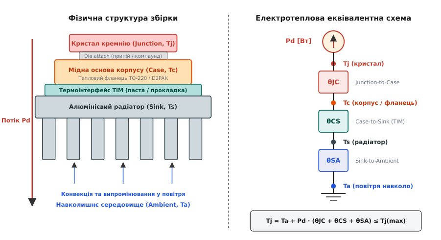
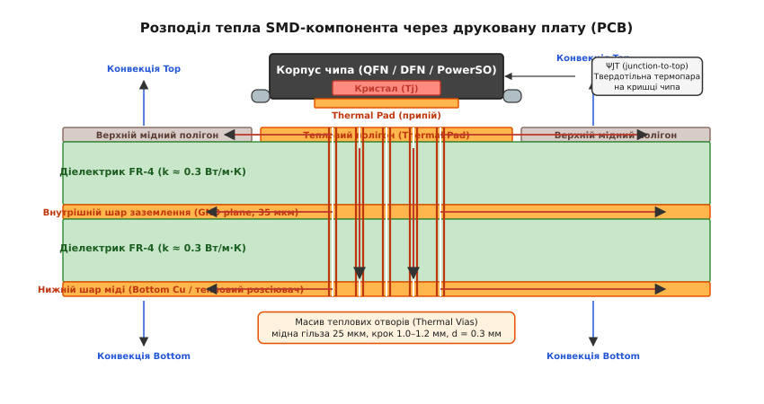
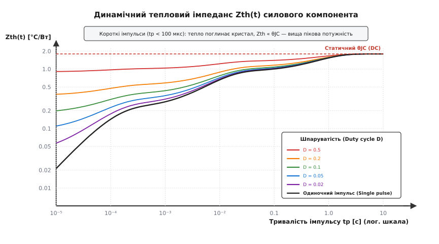
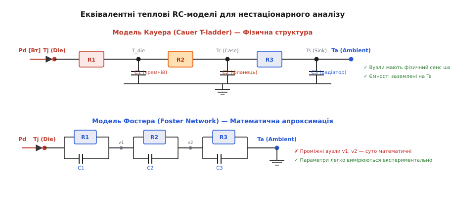

# Тепловий ланцюжок: θJC, θCS, θSA

<preknowlist>
- [Закон Ома](root:hw-analog/ohms-law) — зв'язок напруги, струму й електричного опору.
- [Тепловий опір](root:ph-thermodynamics/thermal-resistance) — базовий фізичний механізм передачі тепла через бар'єри.
- [Граничні режими](root:hw-components/abs-max-ratings) — максимальна температура переходу Tj(max) та межі безпечної роботи.
- [Корпуси компонентів](root:hw-components/packages) — конструкції напівпровідникових корпусів та їхнє теплове оформлення.
</preknowlist>

Коли крізь силовий транзистор або лінійний стабілізатор протікає робочий струм, потужність розсіювання в кілька ватів перетворюється на теплову енергію всередині кремнієвого кристала площею лише кілька квадратних міліметрів. Якщо ця енергія не відводиться назовні з тією самою швидкістю, з якою генерується, температура p-n переходу за частки секунди перевищує критичну межу 150 °C. Це спричиняє тепловий пробій, руйнування мікрозварних контактів і фізичне вигорання напівпровідникової структури. Інженер не має фізичної змоги розмістити датчик температури безпосередньо всередині запаяного пластикового чи металевого корпусу під час роботи приладу в реальних умовах.

Щоб гарантувати, що кристал за найгірших умов експлуатації не нагріється вище допустимої межі `T_j(max)`, усю конструкцію від кремнієвої пластини до навколишнього середовища розраховують як неперервний тепловий шлях. Цей шлях складається з послідовності фізичних перешкод: кристала, металевого фланця, контактного термоінтерфейсу, радіатора та примежового шару повітря. Розрахунок теплового ланцюжка дозволяє розбити загальний перепад температури на окремі проміжні складові та заздалегідь визначити, чи впорається обрана система охолодження із заданою електричною потужністю.

---

## Електротеплова аналогія та закон Фур'є

Теплопередача в твердих тілах підпорядковується фундаментальному закону теплопровідності Фур'є. В одновимірному наближенні густина теплового потоку `q` пропорційна градієнту температури:

```
q = -k · (dT/dx)
```

де `k` — коефіцієнт теплопровідності матеріалу [Вт/(м·К)]. Якщо тепловий потік потужністю `P_d` [Вт] проходить крізь однорідний шар матеріалу товщиною `L` і площею поперечного перерізу `A`, інтегрування цього виразу за товщиною шару дає лінійну залежність різниці температур `ΔT` від розсіюваної потужності:

```
ΔT = P_d · (L / (k · A))
```

Цей вираз за своєю структурою тотожний закону Ома для ділянки електричного кола `ΔV = I · R`. Геометрично-фізичний множник `L / (k · A)` визначає опір тіла проходженню теплового потоку і називається тепловим опором `θ` (або `R_th`):

```
θ = R_th = ΔT / P_d = L / (k · A)
```

Тепловий опір вимірюється в кельвінах на ват [K/Вт] або градусах Цельсія на ват [°C/Вт]. Величина в 1 °C/Вт означає, що при розсіюванні потужності в 1 Вт температура джерела тепла буде на 1 °C вищою за температуру охолоджувача.

| Електрична величина | Позначення, одиниця | Теплова величина | Позначення, одиниця |
|---|---|---|---|
| Електричний потенціал (напруга) | `V`, `ΔV` [В] | Температура (різниця температур) | `T`, `ΔT` [°C або K] |
| Електричний струм | `I` [А = Кл/с] | Тепловий потік (теплова потужність) | `P_d` [Вт = Дж/с] |
| Електричний опір | `R` [Ом = В/А] | Тепловий опір | `θ`, `R_th` [°C/Вт = K/Вт] |
| Електричний заряд | `Q` [Кл] | Теплова енергія (кількість теплоти) | `Q_th`, `E` [Дж = Вт·с] |
| Електрична ємність | `C` [Ф = Кл/В] | Теплова ємність | `C_th` [Дж/°C = Вт·с/°C] |

Електротеплова аналогія дозволяє застосовувати до аналізу теплових процесів усі класичні методи теорії кіл: закони Кірхгофа, послідовне й паралельне з'єднання, подільники напруги та операторний розрахунок перехідних процесів у RC-ланцюгах.

Тепловий закон Ома для однорідної або складеної ділянки записується через різницю температур між гарячою точкою `T_1` та холодною точкою `T_2`:

```
ΔT = T_1 - T_2 = P_d · θ
```

---

## Послідовний триланковий ланцюжок: θJC, θCS, θSA

У класичній конструкції з напівпровідниковим приладом у дискретному корпусі (наприклад, TO-220, TO-247 чи TO-264), встановленим на тепловідвідний радіатор, тепло виділяється в мікроскопічному об'ємі p-n переходу і рухається послідовно крізь три різні фізичні середовища, перш ніж потрапити у відкрите повітря.

Оскільки в усталеному стаціонарному режимі вся генерована теплова потужність `P_d` повинна без накопичення пройти крізь кожну ланку тракту, тепловий струм крізь усі шари є однаковим. Відповідно, повний тепловий перепад дорівнює сумі перепадів на кожному елементі.


*Послідовний тепловий ланцюжок. Тепловий потік Pd проходить від кристала Tj крізь основу корпусу Tc, термоінтерфейс Ts і радіатор у навколишнє середовище Ta, створюючи сумарний опір θJA = θJC + θCS + θSA.*

### 1. Тепловий опір кристал–корпус (θJC, Junction-to-Case)

Опір `θ_JC` характеризує внутрішній шлях від активної зони p-n переходу через товщу кремнієвого кристала, шар евтектичного припою або струмопровідного клею (die attach) до масивної мідної пластини або фланця корпусу (leadframe / header).

Цей опір повністю визначається внутрішньою конструкцією компонента і формується на заводі під час пакування кристала. Розробник електронного пристрою не має змоги зменшити `θ_JC` для вже виготовленого чипа.

Величина `θ_JC` залежить від кількох конструктивних чинників:
- **Площа кристала (`A_die`):** Силові транзистори на великі струми мають кристал площею 20–50 мм², що дає `θ_JC` порядку 0.3–0.8 °C/Вт. Малопотужні сигнальні чипи з кристалом 1–2 мм² мають `θ_JC` у межах 5–15 °C/Вт.
- **Тип корпусу:** Корпус TO-247 з масивним мідним фланцем товщиною 2 мм забезпечує `θ_JC ≈ 0.4–0.7 °C/Вт`; компактний TO-220 має `θ_JC ≈ 1.0–2.5 °C/Вт`; безвивідний корпус D2PAK — `θ_JC ≈ 0.8–1.5 °C/Вт`; мініатюрний SOT-23 — `θ_JC ≈ 60–100 °C/Вт`.
- **Якість з'єднання кристала з підкладкою:** Евтектичний припій (Au-Si, Pb-Sn-Ag) забезпечує високу теплопровідність (`k ≈ 30–60 Вт/(м·К)`), тоді як полімерні епоксидні клеї зі срібним наповнювачем мають меншу теплопровідність (`k ≈ 2–10 Вт/(м·К)`), що підвищує `θ_JC`.

### 2. Тепловий опір корпус–радіатор (θCS, Case-to-Sink)

Опір `θ_CS` визначається контактною зоною між зовнішнім металевим фланцем напівпровідника та поверхнею радіатора. Це єдина ланка ланцюжка, параметри якої повністю залежать від якості механічного збирання та обраного термоінтерфейсу (TIM, Thermal Interface Material).

Навіть ретельно відшліфовані металеві поверхні на мікроскопічному рівні мають шорсткість і хвилястість. За сухого контакту метал торкається металу лише у верхівках мікронерівностей, що становить менш як 1–2% номінальної площі. Решту 98% простору займають мікропорожнини, заповнені повітрям. Оскільки коефіцієнт теплопровідності нерухомого повітря вкрай низький (`k_air ≈ 0.026 Вт/(м·К)`), сухий контакт створює величезний тепловий опір (`θ_CS > 3–8 °C/Вт` для площі TO-220).

Термоінтерфейс витісняє повітря з мікрозазорів речовиною з теплопровідністю, вищою за повітря у 50–300 разів:
- **Теплопровідні пасти (Thermal Grease):** Суспензії оксидів металів (Al2O3, ZnO) або нітриду алюмінію (AlN) у силіконовому маслі (`k ≈ 1.0–8.0 Вт/(м·К)`). Під час сильного гвинтового притиску паста розтікається у надтонкий шар товщиною 15–30 мкм (BLT, Bond Line Thickness), забезпечуючи найнижчий опір серед непровідних матеріалів (`θ_CS ≈ 0.1–0.3 °C/Вт` для TO-220). Недоліком є ефект виповзання (pump-out) під час багаторазових термоциклів.
- **Еластичні термопрокладки (Gap Pads):** Силіконові або акрилові пластини товщиною 0.5–3.0 мм, армовані скловолокном (`k ≈ 1.5–6.0 Вт/(м·К)`). Використовуються для компенсації великих зазорів або встановлення кількох компонентів різної висоти на один радіатор. Через значну товщину мають помітно вищий опір (`θ_CS ≈ 1.0–3.5 °C/Вт`).
- **Електричні ізолятори (слюда, Kapton, кераміка Al2O3 / AlN):** Необхідні у випадках, коли металевий фланець транзистора з'єднаний із внутрішнім електродом (колектором або стоком під високим потенціалом), а радіатор заземлений на шасі. Слюдяна пластина товщиною 50 мкм із термопастою дає `θ_CS ≈ 0.8–1.2 °C/Вт`; високоякісна кераміка з нітриду алюмінію AlN товщиною 0.5 мм (`k ≈ 170 Вт/(м·К)`) забезпечує одночасно ізоляцію понад 5 кВ і опір `θ_CS ≈ 0.2–0.4 °C/Вт`.
- **Фазозмінні матеріали (PCM, Phase Change Materials):** Тверді полімерні воски при кімнатній температурі, які плавляться при нагріванні до 45–55 °C, самостійно витісняючи бульбашки повітря під дією притискної пружини чи кліпси (`θ_CS ≈ 0.15–0.25 °C/Вт`).

### 3. Тепловий опір радіатор–середовище (θSA, Sink-to-Ambient)

Опір `θ_SA` характеризує здатність радіатора передавати накопичену теплову енергію в навколишнє повітря. У звичайних умовах цей опір є найбільшим серед усіх трьох складових і визначає габарити охолоджувального вузла.

Тепловіддача радіатора здійснюється трьома паралельними фізичними процесами:
1. **Природна конвекція:** Повітря, що контактує з нагрітими ребрами, нагрівається, його густина зменшується, і воно спливає вгору за законом Архімеда, звільняючи місце для порції холодного повітря знизу. Швидкість природного потоку невелика (0.1–0.3 м/с), а коефіцієнт тепловіддачі становить `h_nat ≈ 5–12 Вт/(м²·К)`.
2. **Теплове випромінювання (радіація):** Передача тепла електромагнітними хвилями інфрачервоного діапазону за законом Стефана-Больцмана. Для матової анодованої чорної поверхні алюмінію коефіцієнт випромінювання (чорноти) становить `ε ≈ 0.85–0.92`, що забезпечує до 25–40% сумарної тепловіддачі за природної конвекції. Неанодований чистий полірований алюміній має `ε ≈ 0.05–0.10`, через що його `θ_SA` за відсутності обдуву на 20–30% гірший за чорний радіатор тих самих розмірів.
3. **Примусова конвекція:** Вентилятор прокачує повітря крізь ребра зі швидкістю 1.5–5.0 м/с (об'ємна витрата 10–60 CFM). Турбулентний або швидкий ламінарний потік руйнує нерухомий тепловий примежовий шар повітря на ребрах, підвищуючи коефіцієнт тепловіддачі до `h_forced ≈ 30–120 Вт/(м²·К)`. Завдяки цьому той самий радіатор під час обдуву знижує свій `θ_SA` у 3–8 разів порівняно з пасивним режимом.

---

## Статичний тепловий розрахунок та бюджет перегріву

Оскільки всі три ланки увімкнені послідовно, повний тепловий опір від кристала до навколишнього повітря `θ_JA` (Junction-to-Ambient) дорівнює їхній сумі:

```
θ_JA = θ_JC + θ_CS + θ_SA
```

За тепловим законом Ома стала температура кристала `T_j` при тривалій роботі під потужністю `P_d` в середовищі з температурою `T_a` обчислюється як:

```
T_j = T_a + ΔT_total                   [базове визначення температури переходу]
    = T_a + P_d · θ_JA                 [підстановка закону Ома для повного перегріву]
    = T_a + P_d · (θ_JC + θ_CS + θ_SA) [розкриття послідовного ланцюжка трьох опорів]
```

Головний критерій працездатності електронного вузла — безумовне виконання нерівності `T_j ≤ T_j(max)` у найнесприятливіших умовах (максимальна температура навколишнього повітря `T_a(max)` та максимальна електрична потужність `P_d(max)`).

> 🔧 **Навіщо це.** Паспортне значення `T_j(max) = 150 °C` (або `175 °C` для кремнію) є граничною аварійною межею руйнування. Надійна інженерна практика вимагає обов'язкового застосування температурного дератингу (thermal derating). За правилом Арреніуса кожні 10 °C підвищення температури кристала подвоюють швидкість деградаційних процесів (дифузія домішок, інтерметалічна втома паяних з'єднань, електроміграція металізації). У надійних промислових та бортових пристроях максимальну робочу температуру обмежують значенням `T_j(target) ≤ 105–115 °C`.

### Розрахунок максимального допустимого опору радіатора

Під час проєктування розробник знає електричну потужність `P_d`, максимальну робочу температуру середовища `T_a`, вибраний транзистор (`θ_JC`) та запланований термоінтерфейс (`θ_CS`). Невідомою величиною є необхідний тепловий опір радіатора `θ_SA`.

Алгоритм інженерного вибору:

```
1. Визначаємо температурний бюджет:
   ΔT_budget = T_j(target) - T_a(max)

2. Знаходимо максимальний допустимий сумарний опір:
   θ_JA(req) = ΔT_budget / P_d

3. Віднімаємо незмінні внутрішні та контактні опори:
   θ_SA(max) = θ_JA(req) - θ_JC - θ_CS
```

#### Покроковий приклад розрахунку системи охолодження

**Умова задачі:**
Лінійний регулятор напруги або силовий MOSFET у корпусі TO-220 розсіює потужність `P_d = 12 Вт`. Прилад розміщено всередині закритого блоку живлення, де температура повітря під навантаженням сягає `T_a = 50 °C`. Виробник задає `T_j(max) = 150 °C`. Інженер встановлює цільову робочу температуру `T_j(target) = 110 °C` (запас 40 °C).

З даташита транзистора:
- `θ_JC = 1.4 °C/Вт` (корпус TO-220, кристал середньої площі).
Монтаж:
- Електроізолювальна прокладка з оксидної кераміки Al2O3 товщиною 0.5 мм із двостороннім нанесенням силіконової термопасти: `θ_CS = 0.5 °C/Вт`.

**Обчислення кроків:**

```
ΔT_budget = 110 - 50
          = 60 °C              [максимально допустимий повний перегрів]

θ_JA(req) = 60 / 12
          = 5.0 °C/Вт          [граничний повний тепловий опір]

θ_SA(max) = 5.0 - 1.4 - 0.5
          = 3.1 °C/Вт          [максимальний опір радіатора]
```

**Аналіз результату:**
Радіатор з опором `θ_SA ≤ 3.1 °C/Вт` за природної конвекції має бути досить масивним (приблизно 80 × 60 × 30 мм). Якщо габарити корпусу не дозволяють встановити такий радіатор, застосовують вентилятор: невеликий профільний радіатор 40 × 40 × 20 мм за обдуву зі швидкістю `v = 2 м/с` забезпечує `θ_SA ≈ 2.2 °C/Вт`.

Перевіримо фактичну температуру при встановленні радіатора з `θ_SA = 2.2 °C/Вт`:

```
θ_JA_actual = 1.4 + 0.5 + 2.2          [додавання трьох складових опорів]
            = 4.1 °C/Вт                [сумарний фактичний опір системи]

ΔT_actual   = 12 · 4.1                 [множення потужності на опір]
            = 49.2 °C                  [фактичний перегрів кристала над повітрям]

T_j_actual  = 50 + 49.2                [додавання температури середовища]
            = 99.2 °C                  [менше за 110 °C, режим цілком безпечний]
```


Розподіл падіння температури за ланками ланцюжка:
- На кристалі: `ΔT_JC = 12 · 1.4 = 16.8 °C` (температура фланця `T_c = 99.2 - 16.8 = 82.4 °C`);
- На прокладці: `ΔT_CS = 12 · 0.5 = 6.0 °C` (температура радіатора `T_s = 82.4 - 6.0 = 76.4 °C`);
- На радіаторі: `ΔT_SA = 12 · 2.2 = 26.4 °C` (`T_s - T_a = 76.4 - 50 = 26.4 °C`).

---

## Поверхневий монтаж і параметричний опір θJA для SMD

У сучасній електроніці більшість силових чипів (DC-DC перетворювачі, драйвери MOSFET, контролери живлення) виготовляються в корпусах для поверхневого монтажу (SMD: SOIC-8 EP, DFN, QFN, DPAK, D2PAK). У таких компонентах немає масивного фланця для монтажу окремого радіатора, а єдиним тепловідводом слугує сама друкована плата (PCB).

Для SMD-компонентів виробники наводять у даташитах єдине число: `θ_JA` (Junction-to-Ambient). Проте пряме використання цього числа без розуміння умов його вимірювання є однією з найпоширеніших причин теплових аварій.


*Тепловий шлях SMD-компонента на платі. Тепло від кристала передається крізь нижній майданчик (thermal pad) і масив металізованих переходів (thermal vias) на внутрішні мідні шари заземлення та розсіюється конвекцією з обох боків плати.*

### 1. Пастка даташитного стандарту JEDEC

Значення `θ_JA` в даташитах вимірюється відповідно до промислових стандартів серії JEDEC JESD51:
- **JESD51-3 (Low Effective Thermal Conductivity, 1s0p):** Одностороння тестова плата з одним сигнальним шаром міді без внутрішніх шарів заземлення. На такій платі для корпусу SOIC-8 значення `θ_JA` сягає 120–160 °C/Вт.
- **JESD51-7 (High Effective Thermal Conductivity, 2s2p):** Стандартна 4-шарова тестова плата розміром 76.2 × 114.3 мм із двома внутрішніми суцільними шарами міді товщиною 1 oz (35 мкм) площею майже 100%. На такій тестовій платі той самий чип SOIC-8 демонструє `θ_JA ≈ 35–45 °C/Вт`.

Якщо розробник бере з даташита оптимістичне число `35 °C/Вт`, отримане на 4-шаровій платі JEDEC розміром із долоню, але розводить компонент на двошаровій платі з маленьким мідним п'ятачком 10 × 10 мм, реальний опір `θ_JA` становитиме не 35, а понад 90 °C/Вт, і при розсіюванні 1.5 Вт кристал миттєво перегріється.

### 2. Теплові полігони та ефект насичення площі

Для відведення тепла від відкритого майданчика (thermal pad / exposed pad) під корпусом чипа формують мідний полігон. Теплопровідність мідної фольги становить `385 Вт/(м·К)`, тоді як склотекстоліт FR-4 є теплоізолятором із провідністю лише `0.3 Вт/(м·К)`.

Через малу товщину мідного шару (стандартна фольга 1 oz має товщину `35 мкм`, потовщена 2 oz — `70 мкм`) тепловий потік зазнає значного опору розтікання (thermal spreading resistance) під час руху в горизонтальній площині. З віддаленням від джерела градієнт температури вздовж тонкої фольги стрімко спадає.

Внаслідок цього виникає ефект насичення площі охолодження:
- Збільшення площі верхнього мідного полігону від 100 мм² до 500 мм² дає різке зниження `θ_JA` (на 40–50%);
- Збільшення площі від 500 мм² до 1500 мм² знижує опір лише на додаткові 10–15%;
- Подальше нарощування площі понад 2000 мм² практично не дає результату: зовнішні ділянки міді залишаються холодними і не беруть участі у тепловіддачі, оскільки тепло не може подолати опір розтікання тонкого шару фольги.

### 3. Масив теплових перехідних отворів (Thermal Vias)

Оскільки склотекстоліт під мікросхемою перешкоджає проникненню тепла вглиб плати, під термопадом чипа обов'язково розташовують масив металізованих перехідних отворів (thermal vias). Мідні стінки отворів створюють вертикальні теплові канали з низьким опором безпосередньо до внутрішніх полігонів землі (GND plane) та нижнього шару плати.

Правила проєктування масиву перехідних отворів:
- **Діаметр отвору:** Оптимальний діаметр свердління становить `d = 0.3 мм` (або `0.25–0.33 мм`). Отвори діаметром понад 0.35 мм спричиняють капілярне витікання припою (solder wicking) з верхнього майданчика всередину отвору під час оплавлення в печі, що призводить до браку паяння та утворення пустот.
- **Товщина металізації стінок:** Гальванічна мідь у гільзі отвору повинна мати товщину не менше 20–25 мкм.
- **Крок сітки (Pitch):** Отвори розташовують у вигляді регулярної матриці з кроком `1.0–1.2 мм`.
- **Заповнення отворів (Via Plugging / Capping):** У високонадійних пристроях отвори заповнюють епоксидним компаундом із мідним покриттям зверху (IPC-4761 Type VII). Це дозволяє наносити паяльну пасту безпосередньо на відкриті отвори без ризику витікання.

Для детального математичного виведення геометрії мідних гільз, взаємного опору паралельних отворів та аналітичного розрахунку радіального розтікання тепла у багатошарових платах див. вставку [Тепловий розрахунок масиву отворів та розтікання в платі](root:hw-components/thermal-chain/math-thermal-vias.md).

### 4. Характеристичні псевдопараметри: ΨJT та ΨJB

Для контролю температури працюючого SMD-компонента в зібраному пристрої за допомогою термопари чи пірометра не можна використовувати класичний опір `θ_JC`. Опір `θ_JC` вимірюють за стандартом, коли 100% теплового потоку примусово спрямовано крізь одну грань корпусу на мідний охолоджувальний блок. У реальному SMD-чипі тепло розтікається одночасно на всі боки: понад 85–90% йде крізь термопад у друковану плату, а крізь верхню пластикову кришку в повітря виходить лише 5–10% тепла.

Якщо розробник спробує оцінити перегрів кристала за формулою `T_j = T_top + P_d · θ_JC(top)`, він отримає абсурдне завищене значення, оскільки вся потужність `P_d` насправді не виходить через верх кришки.

Для точного вимірювання за стандартом JEDEC JESD51-2A введено характеристичні параметри (thermal characterization parameters) `Ψ_JT` (Psi Junction-to-Top) та `Ψ_JB` (Psi Junction-to-Board):

```
T_j = T_top + P_d · Ψ_JT
T_j = T_board + P_d · Ψ_JB
```

- `T_top` — температура в центрі верхньої грані пластикового корпусу, виміряна тонкою термопарою (калібру 36–40 AWG);
- `Ψ_JT` — псевдоопір зв'язку кристал–верх кришки (для більшості корпусів QFN/SOIC він становить лише `0.5–2.5 °C/Вт`, тоді як `θ_JC(top)` може сягати 20–40 °C/Вт);
- `T_board` — температура мідного полігону плати на відстані 1 мм від корпусу мікросхеми.

Знаючи розсіювану потужність `P_d` та вимірявши термопарою температуру на кришці чипа `T_top`, інженер миттєво і дуже точно обчислює реальну температуру кристала: `T_j = T_top + P_d · Ψ_JT`.

---

## Динамічний тепловий імпеданс Zth(t) та імпульсні навантаження

Усі наведені вище формули описують стаціонарний стан після завершення нагріву, коли температури у всіх точках стабілізувалися. Проте у перетворювачах напруги з широтно-імпульсною модуляцією (ШІМ), силових ключах інверторів, котушках реле та схемах захисту навантаження діє короткочасними імпульсами.

Кожен фізичний шар конструкції (кремній, мідний фланець, алюмінієвий радіатор) має не лише тепловий опір, але й **теплову ємність** `C_th` [Дж/°C]:

```
C_th = m · c = ρ · V · c
```

де `m` — маса матеріалу [кг], `c` — питома теплоємність [Дж/(кг·К)], `ρ` — густина, `V` — об'єм.

Теплова ємність перешкоджає миттєвому нагріванню тіла: теплова енергія витрачається на підвищення внутрішньої енергії речовини. Добуток теплового опору на теплову ємність утворює **теплову постійну часу** ланки `τ = R_th · C_th` [секунди]:
- **Кристал кремнію:** Має крихітну масу (кілька міліграмів), тому його теплоємність дуже мала. Постійна часу становить `τ_die ≈ 0.1–2.0 мс`.
- **Мідний фланець корпусу:** Має масу кілька грамів, його постійна часу становить `τ_case ≈ 50–500 мс`.
- **Масивний алюмінієвий радіатор:** Прогрівається за час `τ_sink ≈ 1–10 хвилин`.

Завдяки різниці постійних часу короткий потужний імпульс тривалістю `t_p < 100 мкс` нагріває лише сам кристал кремнію, тоді як фланець і радіатор взагалі не встигають змінити свою температуру.


*Динамічний тепловий імпеданс Zth(t) як функція тривалості імпульсу tp для різних значень шпаруватості D. При коротких імпульсах (tp < 100 мкс) імпеданс Zth на порядки менший за статичний θJC, що дозволяє чипу витримувати високі пікові потужності без перегріву.*

Відношення перегріву кристала до амплітуди потужності імпульсу називається **динамічним тепловим імпедансом** `Z_th(t)`:

```
Z_th(t) = ΔT_j(t) / P_peak
```

На графіках даташитів наводять сімейство кривих `Z_th(t)` для одиночного імпульсу (single pulse) та для періодичних імпульсів із різними коефіцієнтами заповнення (duty cycle `D = t_p / T`):
1. **Для одиночного короткого імпульсу (`t_p = 100 мкс`):** Значення `Z_th` може становити менш як 5% від статичного `θ_JC`. Це означає, що транзистор із паспортним `θ_JC = 1.0 °C/Вт` при короткому імпульсі здатен розсіяти потужність `P_peak = 500 Вт` із перегрівом лише `ΔT = 500 · 0.05 = 25 °C`.
2. **Для періодичної послідовності імпульсів:** Перегрів складається з середнього перегріву від постійної складової потужності `P_avg = D · P_peak` та пульсацій від окремого імпульсу.

---

## Еквівалентні RC-моделі: Кауер проти Фостера

Для точного розрахунку перехідних теплових процесів у симуляторах схем (SPICE, PLECS) та аналітичних розрахунках нестаціонарних режимів використовують еквівалентні теплові RC-схеми. Існують дві принципово різні топології: модель Кауера та модель Фостера.


*Порівняння теплових RC-моделей. Модель Кауера (вгорі) зберігає фізичну структуру шарів із заземленими на Ta ємностями. Модель Фостера (внизу) є суто математичною апроксимацією з паралельними RC-ланками, проміжні вузли якої не мають фізичного змісту.*

### 1. Модель Кауера (Cauer Network / T-ladder)

Модель Кауера є прямою фізичною дискретизацією одновимірного рівняння теплопровідності. Кожна RC-ланка відповідає конкретному фізичному шару конструкції:
- Перший вузол — кремнієвий кристал (`R_1`, `C_1`);
- Другий вузол — припій die attach (`R_2`, `C_2`);
- Третій вузол — металевий фланець корпусу (`R_3`, `C_3`);
- Четвертий вузол — радіатор (`R_4`, `C_4`).

Усі теплоємності в моделі Кауера підключені одним виводом до відповідного вузла, а другим — до спільної теплової землі (опорної температури середовища `T_a`). Це відповідає фундаментальній фізиці: теплова енергія накопичується відносно абсолютного теплового нуля середовища.

**Головні переваги моделі Кауера:**
- Потенціал кожного проміжного вузла точно дорівнює фізичній температурі відповідного шару;
- До вихідного вузла моделі (фланця корпусу) можна безпосередньо підключати зовнішні теплові ланцюги (термопасту, радіатор), не змінюючи внутрішніх параметрів мікросхеми.

### 2. Модель Фостера (Foster Network / Pi-ladder)

Модель Фостера складається з послідовно з'єднаних паралельних RC-ланок. Її математичний вираз для перехідної характеристики являє собою звичайну суму експонент:

```
Z_th(t) = ∑ [i=1 .. n] R_i · (1 - exp(-t / (R_i · C_i)))
```

Виробники напівпровідників часто наводять у документації саме таблицю параметрів Фостера (`R_i`, `C_i` або `τ_i`), оскільки їх надзвичайно просто отримати автоматизованою підгонкою (curve fitting) експериментальної кривої охолодження після імпульсного нагріву.

**Критичні обмеження моделі Фостера:**
- Внутрішні вузли `v1, v2` не мають жодного фізичного змісту і не відповідають реальним шарам;
- Конденсатори підключені паралельно резисторам, а не на землю;
- **Модель не можна подовжувати:** Якщо до моделі Фостера просто приєднати послідовно зовнішній опір радіатора, розрахована динаміка перехідного процесу буде абсолютно хибною. Для коректного моделювання із зовнішнім радіатором модель Фостера необхідно обов'язково перетворити в модель Кауера.

Детальний математичний апарат апроксимації кривих, розв'язання рівняння нестаціонарної теплопровідності та покроковий алгебраїчний алгоритм перетворення ланцюга Фостера в ланцюг Кауера через розклад імпедансу в неперервний дріб наведено у вставці [Динамічний тепловий імпеданс Zth(t) та трансформація моделей Фостера і Кауера](root:hw-components/thermal-chain/math-transient-thermal.md).

---

## Числове моделювання перехідного теплового процесу

Для розрахунку температури кристала при довільній формі струму навантаження (наприклад, пусковий профіль електромотора або періодичні імпульси ШІМ зі змінною шпаруватістю) застосовують чисельне інтегрування теплового ланцюжка.

Нижче наведено практичну програму для моделювання теплового стану транзистора при довільному вхідному масиві імпульсів потужності за допомогою 3-ланкової моделі Кауера методом Ейлера.

:::tabs
```c
#include <stdio.h>
#include <math.h>

/* Структура 3-ланкової фізичної теплової моделі Кауера */
typedef struct {
    double r[3];  /* Теплові опори шарів [°C/Вт]: кристал, припій, фланець */
    double c[3];  /* Теплоємності шарів [Дж/°C] */
    double t[3];  /* Поточні температури вузлів [°C] */
} CauerModel3;

/* Крок чисельного інтегрування теплового стану методом Ейлера */
void cauer_step(CauerModel3 *m, double p_in, double t_amb, double dt) {
    /* Розрахунок теплових потоків між сусідніми вузлами */
    double q01 = (m->t[0] - m->t[1]) / m->r[0];
    double q12 = (m->t[1] - m->t[2]) / m->r[1];
    double q2a = (m->t[2] - t_amb) / m->r[2];

    /* Зміна температур вузлів: dT = (Q_in - Q_out) / C * dt */
    m->t[0] += ((p_in - q01) / m->c[0]) * dt;
    m->t[1] += ((q01 - q12) / m->c[1]) * dt;
    m->t[2] += ((q12 - q2a) / m->c[2]) * dt;
}

int main(void) {
    /* Параметри MOSFET у корпусі TO-247 (Кауер) */
    CauerModel3 mosfet = {
        .r = { 0.095, 0.345, 0.560 },             /* θJC_total = 1.0 °C/Вт */
        .c = { 1.85e-3, 2.10e-2, 2.15e-1 },       /* Дж/°C */
        .t = { 25.0, 25.0, 25.0 }                 /* Початкова температура 25 °C */
    };

    double t_ambient = 25.0;                      /* Температура повітря 25 °C */
    double dt = 1e-5;                             /* Крок за часом 10 мкс */
    double sim_time = 0.05;                       /* Загальний час моделювання 50 мс */
    double p_pulse = 200.0;                       /* Імпульс потужності 200 Вт */
    double t_pulse_end = 0.01;                    /* Тривалість імпульсу 10 мс */

    int steps = (int)(sim_time / dt);
    printf("Час [мс]\tПотужність [Вт]\tT_кристал [°C]\tT_фланець [°C]\n");

    for (int i = 0; i <= steps; i++) {
        double current_time = i * dt;
        double p_now = (current_time <= t_pulse_end) ? p_pulse : 0.0;

        cauer_step(&mosfet, p_now, t_ambient, dt);

        if (i % 200 == 0) {  /* Друк кожні 2 мс */
            printf("%.1f\t\t%.1f\t\t%.2f\t\t%.2f\n",
                   current_time * 1000.0, p_now, mosfet.t[0], mosfet.t[2]);
        }
    }

    return 0;
}
```
```cpp
#include <iostream>
#include <vector>
#include <array>
#include <iomanip>

struct ThermalLayer {
    double resistance{0.0};  // Тепловий опір [°C/Вт]
    double capacitance{0.0}; // Теплова ємність [Дж/°C]
};

class CauerThermalNetwork {
public:
    explicit CauerThermalNetwork(std::vector<ThermalLayer> layers, double initial_temp)
        : layers_(std::move(layers)), temps_(layers_.size(), initial_temp) {}

    void step(double power_in, double ambient_temp, double dt) {
        const size_t n = layers_.size();
        std::vector<double> heat_flows(n);

        // Розрахунок теплових потоків крізь послідовні резистори
        for (size_t i = 0; i < n - 1; ++i) {
            heat_flows[i] = (temps_[i] - temps_[i + 1]) / layers_[i].resistance;
        }
        heat_flows[n - 1] = (temps_[n - 1] - ambient_temp) / layers_[n - 1].resistance;

        // Оновлення температур у ємнісних вузлах
        temps_[0] += ((power_in - heat_flows[0]) / layers_[0].capacitance) * dt;
        for (size_t i = 1; i < n; ++i) {
            temps_[i] += ((heat_flows[i - 1] - heat_flows[i]) / layers_[i].capacitance) * dt;
        }
    }

    [[nodiscard]] double junction_temp() const noexcept { return temps_.front(); }
    [[nodiscard]] double case_temp() const noexcept { return temps_.back(); }

private:
    std::vector<ThermalLayer> layers_;
    std::vector<double> temps_;
};

int main() {
    // 3-ланкова модель Кауера для силового транзистора
    std::vector<ThermalLayer> mosfet_layers = {
        { 0.095, 1.85e-3 },  // Кристал кремнію
        { 0.345, 2.10e-2 },  // Припій die attach
        { 0.560, 2.15e-1 }   // Мідний фланець
    };

    constexpr double ambient_temp = 25.0;
    CauerThermalNetwork thermal_sim(mosfet_layers, ambient_temp);

    constexpr double dt = 1e-5;            // Крок інтегрування 10 мкс
    constexpr double sim_time = 0.05;      // 50 мс
    constexpr double pulse_power = 200.0;  // 200 Вт імпульс
    constexpr double pulse_duration = 0.01;// 10 мс

    const auto total_steps = static_cast<size_t>(sim_time / dt);

    std::cout << std::fixed << std::setprecision(2);
    std::cout << "Час [мс]\tПотужність [Вт]\tT_кристал [°C]\tT_фланець [°C]\n";

    for (size_t i = 0; i <= total_steps; ++i) {
        const double t = static_cast<double>(i) * dt;
        const double power = (t <= pulse_duration) ? pulse_power : 0.0;

        thermal_sim.step(power, ambient_temp, dt);

        if (i % 200 == 0) {  // Вивід кожні 2 мс
            std::cout << t * 1000.0 << "\t\t"
                      << power << "\t\t"
                      << thermal_sim.junction_temp() << "\t\t"
                      << thermal_sim.case_temp() << "\n";
        }
    }

    return 0;
}
```
:::

---

## Типові помилки та підводні камені теплового розрахунку

1. **Ігнорування деградації теплопровідності кремнію з нагріванням.**
   Коефіцієнт теплопровідності кремнію не є константою: при кімнатній температурі 25 °C він становить приблизно `148 Вт/(м·К)`, а при 125 °C падає майже вдвічі — до `95 Вт/(м·К)`. Через це внутрішній опір `θ_JC` гарячого транзистора зростає на 20–30% порівняно з паспортним значенням при 25 °C. Якщо розрахунок виконано без запасу на межі допустимого, виникає тепловий саморозігрів із подальшим пробоєм.

2. **Надмірне нанесення термопасти.**
   Спроба нанести термопасту «товстішим шаром про всяк випадок» перетворює термоінтерфейс на теплоізолятор. Теплопровідність пасти (`k ≈ 1–4 Вт/(м·К)`) у 100 разів нижча за мідь (`k ≈ 385 Вт/(м·К)`). Шар пасти товщиною 0.5 мм замість належних 30 мкм збільшує `θ_CS` у понад 10 разів. Паста повинна лише заповнювати мікропори, а надлишок має бути повністю видавлений механічним притиском.

3. **Недостатній або нерівномірний момент затягування гвинтів.**
   Притиск силового корпусу TO-220 одним гвинтом M3 з одного боку спричиняє мікроперекіс фланця: протилежний край пластини підіймається над радіатором, утворюючи повітряний клин. Для рівномірного контакту зусилля притиску має складати 1.0–1.5 Н·м або забезпечуватися каліброваною пружинною кліпсою.

4. **Забування про електричну ізоляцію спільних радіаторів.**
   Металевий фланець більшості транзисторів TO-220/TO-247 електрично з'єднаний із центральним виводом. Встановлення двох транзисторів на спільний металевий радіатор без ізолювальних втулок під гвинти та діелектричних прокладок (слюда, кераміка) призводить до прямого короткого замикання силових ліній схеми через корпус радіатора.

5. **Використання паспортного θJA для SMD без урахування реальної міді плати.**
   Встановлення чипа, розрахованого на плату JEDEC 2s2p (`θ_JA = 35 °C/Вт`), на двошарову компактну плату без термоотворів дає реальний опір `θ_JA > 90 °C/Вт`, що викликає спрацьовування теплового захисту чи вигорання схеми вже при половинному струмі навантаження.
