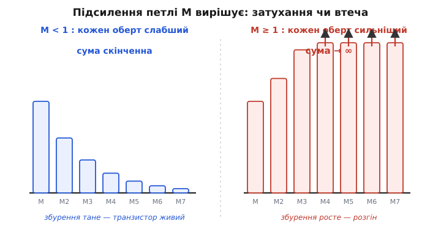

# 🧮 Критерій теплової стійкості: коли підсилення петлі переходить одиницю

Інтуїтивно вже зрозуміло: тепловий розгін трапляється, коли «петля підсилення більша за одиницю». Це гарна картинка, але інженеру з неї не побудувати схему — їй бракує **числа**. Скільки саме теплового опору ще можна дозволити? За якої напруги колектор–емітер петля стає критичною? На скільки відсотків резистор в емітері збиває небезпеку? Усі ці відповіді ховаються в одній похідній, і завдання цієї вставки — дістати їх звідти.

Підемо дорогою, якою свого часу пройшли інженери, що вперше порахували межу теплового розгону строго (класичну постановку для кремнієвих переходів дав ще наприкінці 1950-х аналіз теплової стійкості транзисторів — усталений результат, відомий як критерій теплової стійкості). Ідея проста до зухвалості: петля — це ланцюжок «температура → струм → потужність → температура», де кожна ланка є **похідною**. Помножимо похідні одну на одну вздовж усього кола — і дістанемо число, що каже, у скільки разів сильніший кожен наступний оберт за попередній. Якщо це число менше за одиницю — петля згасає; більше — втікає. Усе.

## Що означає «обійти петлю» мовою похідних

Петля замкнена, тож почати її обхід можна з будь-якої точки. Найзручніше — з температури переходу Tj, бо саме її випадкове крихітне збурення ми хочемо простежити навколо кола й побачити, чи повернеться воно більшим, ніж пішло.

Уявімо, що температура переходу зросла на нескінченно малий δTj. Простежмо, що станеться з нею за один повний оберт.

**Ланка перша: температура → струм.** Нагрів змінює струм колектора. Наскільки чутливо — задає похідна `dIc/dTj` (амперів на градус). Звідки вона береться фізично, розберемо нижче; поки що це просто перша ланка.

```
δIc = (dIc/dTj) · δTj
```

**Ланка друга: струм → потужність.** Транзистор розсіює `P = Ic·Vce`. Якщо напруга колектор–емітер тримається сталою (а в багатьох режимах це майже так), то добавка струму перетворюється на добавку потужності з коефіцієнтом, що дорівнює просто напрузі:

```
dP/dIc = Vce        (за сталої Vce)
δP = Vce · δIc
```

**Ланка третя: потужність → температура.** Зайва потужність піднімає температуру переходу, і коефіцієнт тут — [тепловий опір](topic:ph-thermodynamics/thermal-resistance) Rθ (градусів на ват). Це означення теплового опору в дії: скільки градусів дає кожен ват, розсіяний у кристалі.

```
dTj/dP = Rθ
δTj_назад = Rθ · δP
```

Тепер найголовніший крок — **зчепити три ланки в коло**. Підставимо одну в одну й подивимося, яку добавку до температури δTj_назад приніс повний оберт, що почався з первісного δTj:

```
δTj_назад = Rθ · δP
          = Rθ · Vce · δIc
          = Rθ · Vce · (dIc/dTj) · δTj
```

Згрупуймо все, окрім самого δTj, в один множник:

```
δTj_назад = [ Rθ · Vce · (dIc/dTj) ] · δTj
            └──────────── M ────────────┘
```

Оце M у квадратних дужках і є **підсилення за один оберт петлі** (англ. *loop gain*) — безрозмірне число, яке множить первісне збурення, перетворюючи його на добавку після повного кола. Воно зібране рівно з тих трьох ланок, що ми проходили на пальцях, тільки тепер кожна з них — конкретна похідна, яку можна порахувати.

```
        dIc
M = Rθ · ─── · Vce          (за сталої Vce)
        dTj
```

> 🔧 **Навіщо це.** Вся теорія теплового розгону вміщається в одне це число. M < 1 — транзистор живе вічно, хоч як його грій у межах паспорта: збурення згасає. M ≥ 1 — приречений: збурення повертається не меншим, а більшим, і наступний оберт додасть ще більше. Уся боротьба з розгоном зводиться до того, щоб тримати M під одиницею, а кожен із трьох множників — це окрема ручка, за яку інженер може смикнути.

## Чому критерій — рівно «M = 1», а не «гаряче»

Перш ніж рахувати множники, варто переконатися, що поріг справді стоїть на M = 1, а не десь інде. Це не означення, а наслідок — і його видно, якщо просумувати всі оберти петлі.

Перший оберт повернув δTj·M. Цей повернений приріст сам стає новим збуренням і йде на другий оберт, повертаючи ще в M разів менше (чи більше): δTj·M². Третій оберт — δTj·M³. І так без кінця. Повна добавка до температури — сума всієї цієї нескінченної низки обертів:

```
ΔTj = δTj · (M + M² + M³ + M⁴ + …)
    = δTj · M/(1 − M)        для M < 1
```

Це звичайна геометрична прогресія, і поводиться вона показово. Поки M < 1, сума **скінченна**: збурення дає скінченний підйом температури й система осідає в новій рівновазі трохи тепліше, ніж була. Що ближче M підповзає до одиниці, то більший множник 1/(1 − M) — система дедалі «нервовіша», крихітне збурення дає дедалі помітніший підйом. А коли M досягає одиниці, знаменник перетворюється на нуль: сума **розходиться**, скінченної рівноваги більше немає. Це й є математичний підпис розгону — не «занадто гаряче», а **втрата самої точки рівноваги**.


*Кожен оберт петлі додає до температури свою порцію δTj·Mⁿ — стовпчики на діаграмі. Ліворуч (M < 1) кожен наступний коротший за попередній: порції тануть геометрично, їхня сума скінченна, температура осідає в новій рівновазі. Праворуч (M ≥ 1) кожна порція більша за попередню, стовпчики вибивають за поле — сума необмежена, рівноваги немає. Поріг стійкості лежить рівно там, де стовпчики перестають танути, — при M = 1.*

> 🔧 **Навіщо це.** Множник 1/(1 − M) — не абстракція, його видно на стенді. Транзистор із M = 0.9 формально стабільний, але крихітне коливання живлення чи дотик паяльника дають підйом температури в 1/(1−0.9) = 10 разів більший за «чесний». Такий каскад тримається на волосині: ще трохи гіршає тепловідвід від пилу — і M переходить одиницю. Тому проєктують не «аби M < 1», а з запасом — типово M ≤ 0.5…0.7, щоб найгірший день (спека, забитий радіатор, розкид параметрів) не дотягнув петлю до краю.

## Звідки береться dIc/dTj — два незалежні поштовхи

Тепер до серцевини — першої похідної, що й вирішує все. Чутливість струму до температури `dIc/dTj` має два фізично різні джерела, які додаються.

**Джерело перше: сповзання VBE.** Струм колектора пов'язаний з напругою база–емітер усталеним співвідношенням теорії p-n-переходу:

```
Ic = Is · exp(VBE / VT)
```

де `VT = kT/q` — тепловий потенціал (≈ 25.85 мВ при 300 K), а `Is` — струм насичення, що сам шалено росте з температурою. Якщо схема тримає VBE **фіксованою** (жорстке зміщення напругою), то весь температурний дрейф струму йде через Is. Зручніше, однак, дивитися на це з боку, яким користуються розробники зміщення: щоб тримати струм сталим, напругу VBE довелося б із нагрівом зменшувати з усталеним темпом

```
dVBE/dT ≈ −2 мВ/°C        (кремній, −1.8…−2.0 мВ/°C)
```

Звідки саме −2 мВ/°C — варто показати, бо це число не з повітря. Продиференціювавши VBE = VT·ln(Ic/Is) і підставивши температурну залежність Is (вона тягне за собою ширину забороненої зони Eg ≈ 1.12 еВ для кремнію), дістають

```
dVBE        VBE − Eg/q − (4+m)·VT
──── = ──────────────────────────────
 dT                  T
```

де m ≈ 1.5 описує, як рухливість носіїв падає з температурою. Підставмо реальні числа: VBE ≈ 0.65 В, Eg/q = 1.12 В, VT ≈ 0.0259 В, T = 300 K:

```
dVBE   0.65 − 1.12 − 5.5·0.0259   0.65 − 1.12 − 0.142
──── = ─────────────────────────  = ───────────────────  ≈ −0.00204 В/°C
 dT             300                       300
```

Виходить рівно −2 мВ/°C — і видно, **чому коефіцієнт від'ємний**: визначальний доданок —Eg/q = −1.12 В набагато переважає додатний внесок VBE. Фізично перемагає експоненційне зростання струму насичення Is з температурою над повільнішим зростанням теплового потенціалу VT. Перехід із нагрівом стає «жадібнішим».

Тепер перекладемо це сповзання VBE на струм за фіксованого зміщення. Маленька «зайва» напруга на переході, що з'являється від нагріву, дорівнює −(dVBE/dT)·δT, тобто кристал «бачить» додатково +2 мВ на кожен градус. А похідну струму за напругою дає та сама експонента:

```
dIc        Ic
─── = ── = Ic/VT        (крутість переходу)
dVBE      VT
```

Зчіпляємо два кроки — і дістаємо першу складову чутливості:

```
dIc        dIc      dVBE     Ic      мВ          Ic
─── (VBE) = ──── · (−────) = ── · (+2 ──) = ──────── · 2 мВ/°C
dTj        dVBE      dT      VT      °C          VT
```

Підставмо число: при Ic = 100 мА і VT = 25.85 мВ ця складова дає `(0.1 / 0.02585) · 0.002 ≈ 0.0077 А/°C` — тобто струм росте на **7.7 мА на кожен градус**, цілих **7.7 %/°C**. Це жахливо багато — і це найголовніший висновок усього виведення: за **по-справжньому жорсткого** зміщення напругою повна експонента робить перехід неймовірно чутливим до тепла. Саме тому фіксована VBE — заборонений прийом: вона ставить у першу ланку петлі найбільший можливий коефіцієнт.

На практиці навіть «погане» зміщення рідко буває аж настільки жорстким: будь-який реальний дільник на базі має скінченний опір, будь-яка розводка має дещицю опору в емітері — і вони вже трохи послаблюють експоненту. Тому в наскрізному прикладі теми взято куди лагіднішу ефективну чутливість **~0.6 %/°C** (0.6 мА/°C при тих самих 100 мА) — приблизно у **13 разів** меншу за голу експоненту. Це і є та цифра, з якою працює реальний каскад із бодай якимось зміщенням; саме її далі й підставлятимемо в петлю. А «гола» цифра 7.7 %/°C показує, **наскільки страшна верхня межа** — і чому за неї ніколи не варто підходити близько.

> 🔧 **Навіщо це.** Зверніть увагу: чутливість dIc/dTj пропорційна **самому струму** Ic. Що більший робочий струм, то крутіша петля — подвоїли струм спокою, подвоїли й чутливість до тепла. Ось чому потужні каскади, де течуть ампери, набагато ближчі до краю розгону, ніж сигнальні, де течуть міліампери, навіть за того самого тепловідводу.

**Джерело друге: струм витоку.** Незалежно від VBE, крізь зворотно зміщений перехід база–колектор тече паразитний струм витоку ICBO, породжений тепловим народженням носіїв. Він додається до струму колектора (для схеми зі спільним емітером — помножений на (β+1), бо витік бази підсилюється транзистором). Витік росте з температурою показово, подвоюючись приблизно кожні 8…10 °C:

```
ICBO(T) = ICBO(T₀) · 2^((T − T₀)/10)
```

Похідна показової функції — вона сама, помножена на ln2/10:

```
dICBO     ln2
───── = ──── · ICBO ≈ 0.069 · ICBO        (А/°C)
 dTj      10
```

У сучасному кремнію ICBO мізерний (нано- й піко-ампери при кімнаті), тож ця складова зазвичай тоне на тлі сповзання VBE — і в розрахунках кремнієвого каскаду її часто відкидають. Але історично, в епоху германію з його великим витоком, саме вона була головним двигуном розгону, і повна чутливість — це **сума обох**:

```
dIc      Ic              ln2
─── = ── · 2 мВ/°C  +  (β+1)·──·ICBO
dTj     VT               10
   └─ сповзання VBE ─┘  └─── витік ───┘
```

Обидва доданки додатні й штовхають струм у той самий бік — тому й петля одна, а поштовхи в неї входять паралельно.

## Поріг по тепловому опору

Тепер у нас є все, щоб дістати перше робоче число — **критичний тепловий опір**. Прирівняймо петлю до межі M = 1 і виразимо Rθ:

```
M = Rθ · Vce · (dIc/dTj) = 1

                 1
Rθ_крит = ───────────────────
          Vce · (dIc/dTj)
```

Усе, що з тепловим опором **меншим** за Rθ_крит, — стабільне; усе, що більшим, — приречене. Це й є той «критичний Rθ, за якого петля рівно на грані», про який мова в темі.

**Робочий приклад: де межа радіатора.** Візьмемо рівно ту схему з наскрізного прикладу теми: Vce = 10 В, Ic = 100 мА, ефективна чутливість 0.6 %/°C (тобто dIc/dTj = 0.006·Ic = 0.6 мА/°C). Знайдемо найбільший тепловий опір, за якого петля ще не втікає.

```c
// Критичний тепловий опір для теплового розгону.
// Беремо ефективну чутливість каскаду 0.6 %/°C (як у наскрізному прикладі теми).
#include <stdio.h>

int main(void) {
    const float Vce = 10.0f;      // напруга колектор–емітер, В
    const float Ic  = 0.100f;     // струм спокою, А
    const float tc  = 0.006f;     // ефективна чутливість, частка струму на °C

    float dIc_dTj  = tc * Ic;             // чутливість струму, А/°C → 0.6 мА/°C
    float Rth_crit = 1.0f / (Vce * dIc_dTj);

    printf("dIc/dTj  = %.4f A/C\n", dIc_dTj);   // 0.0006 A/C
    printf("Rth_crit = %.0f C/W\n", Rth_crit);  // ~167 C/W
    return 0;
}
```

Покроково, щоб бачити, звідки число:

```
dIc/dTj = 0.006 · 0.100 = 0.0006 А/°C        (0.6 мА/°C)
Rθ_крит = 1 / (10 · 0.0006) = 1 / 0.006 ≈ 167 °C/Вт
```

Висновок промовистий і прямо стикується з темою. У наскрізному прикладі статті Rθ = 30 °C/Вт давав стабільність, а Rθ = 200 °C/Вт — розгін; тепер видно **точну межу між ними — близько 167 °C/Вт**. Тридцять — глибоко в безпеці (M = 30·10·0.0006 ≈ 0.18), двісті — за межею (M = 200·10·0.0006 ≈ 1.2, петля втікає). Радіатор перестає бути «про всяк випадок» і стає числом, яке або менше за 167, або фатальне. А якби зміщення було по-справжньому жорстким — з голою чутливістю 7.7 мА/°C — той самий критичний опір упав би в ті ж 13 разів, до жалюгідних ~13 °C/Вт, недосяжних без масивного радіатора: ще одна причина не зміщувати потужний каскад фіксованою напругою.

> 🔧 **Навіщо це.** Rθ_крит — це межа, яку даташит ніколи не друкує прямо, але яку щоразу треба прикинути для лінійного силового каскаду. Якщо повний тепловий опір шляху (кристал → корпус → радіатор → повітря) виходить близьким до Rθ_крит, схема нежиттєздатна за будь-якого паспорта: треба або кращий радіатор, або менший струм, або менша Vce, або емітерне гальмо. Жоден «запас за потужністю» цього не замінить — розгін чхати хотів на середній ват, його цікавить лише похідна.

## Поріг по напрузі Vce й чому небезпечна половина живлення

Vce входить у петлю прямим множником — отже, є й **критична напруга**, вище за яку петля втікає за того самого тепловідводу. Виразимо її так само:

```
                 1
Vce_крит = ───────────────────
          Rθ · (dIc/dTj)
```

Доти, доки реальна Vce нижча за Vce_крит, петля стабільна; перевалила — розгін. Це пояснює, чому той самий транзистор на тому самому радіаторі спокійно живе при низькій напрузі живлення й раптом починає горіти, коли напругу підняли: підняли Vce — підняли M, і в якийсь момент перетнули одиницю.

Та найцікавіше ховається глибше, і про нього варто сказати окремо, бо звідси береться знамените практичне правило. Досі ми вважали Vce фіксованою. Але в лінійному каскаді з резистором у колекторі Rc напруга на транзисторі сама залежить від струму: чим більший струм, тим більше падає на Rc, тим **менша** Vce лишається на самому транзисторі. Тоді потужність уже не просто Vce·Ic, а

```
P = Ic · Vce = Ic · (Vcc − Ic·Rc)
```

Це парабола по струму, і її похідна `dP/dIc = Vcc − 2·Ic·Rc` уже не дорівнює просто Vce. Друга ланка петлі міняється — і петля найсильніша там, де ця похідна найбільша за модулем при додатному знаку, тобто де потужність ще росте зі струмом. Максимум потужності парабола бере рівно посередині навантажувальної прямої, при

```
Vce = Vcc/2,    Ic = Vcc/(2·Rc)
```

саме там, де на транзисторі падає половина живлення. Це й дає усталене **правило великого пальця: тримай робочу точку лінійного каскаду так, щоб Vce ≤ Vcc/2** — нижче за цю точку похідна потужності за струмом спадає, петля слабшає, і запас від розгону росте. Половина живлення — це гребінь, по обидва боки від якого безпечніше; заводити постійну робочу точку потужного приладу на сам гребінь означає ставити петлю в найгірше можливе положення.

> 🔧 **Навіщо це.** Звідси випливає, чому лінійні стабілізатори й підсилювачі класу A найнебезпечніші не на максимальному струмі, а **на половині напруги** — там добуток Vce·Ic найбільший і петля найкрутіша. Гріється і близький до розгону каскад саме в середині діапазону, а не на його краях. Проєктувальник тримає постійну точку подалі від Vcc/2, лишаючи цей режим хіба що короткому сигнальному піку, не сталому навантаженню.

## Як емітерний резистор збиває dIc/dTj

Лишилася найдієвіша ручка — і тепер видно точно, **на скільки** вона крутить петлю. Резистор у емітері RE б'є по першій ланці: він зменшує `dIc/dTj`, бо більше не дає струму вільно слухатися температури.

Механіку розберімо строго. Із RE керувальна напруга на переході вже не вся VBE від джерела зміщення, а різниця: напруга бази мінус падіння на резисторі. Реальна напруга, що відкриває перехід, —

```
VBE = Vб − Ic·RE
```

Тепер тепло діє двома каналами одночасно. По-перше, прямо тягне струм угору через сповзання переходу (член із dVBE/dT). По-друге — і ось протидія — щойно струм пробує зрости, росте падіння Ic·RE, яке **віднімається** від керувальної напруги й прикриває перехід. Запишемо це як рівновагу приростів. Повний приріст струму за нагріву складається з прямого теплового поштовху мінус гальмівна реакція самого RE:

```
dIc      Ic        dVBE        Ic       dIc
─── = ── · (−────) − ── · RE · ───
dTj      VT         dT          VT       dTj
       └─ поштовх ─┘     └─ гальмо RE ─┘
```

Член із гальмом сидить в обох частинах (бо реакція RE сама залежить від того, як зміниться струм) — зберімо dIc/dTj докупи:

```
dIc            Ic        dVBE
─── · (1 + ──·RE) = ── · (−────)
dTj            VT         VT       dT

         (Ic/VT)·(−dVBE/dT)        (dIc/dTj)_голий
dIc/dTj = ───────────────────  = ──────────────────
            1 + (Ic·RE)/VT          1 + (Ic·RE)/VT
```

Ось і вся магія в одній дробині. Чисельник — це знайома гола чутливість без резистора. Знаменник `1 + (Ic·RE)/VT` — **коефіцієнт послаблення петлі від RE**, і він тим більший, чим більше падіння Ic·RE порівняно з тепловим потенціалом VT. Це безпосередньо той самий [від'ємний зворотний зв'язок](topic:hw-analog/negative-feedback) за струмом: глибина зворотного зв'язку дорівнює відношенню падіння на RE до VT.

Прикиньмо силу гальма. Хай Ic = 100 мА, і ми поставили RE так, щоб на ньому падало скромні 0.5 В:

```
Ic·RE = 0.5 В,   VT = 0.02585 В
знаменник = 1 + 0.5/0.02585 = 1 + 19.3 = 20.3
```

Чутливість dIc/dTj **упала більш ніж у 20 разів** — а разом із нею в стільки ж разів упало й підсилення петлі M. Транзистор, що без RE стояв за межею з M ≈ 1.2 (той самий кепський випадок Rθ = 200 °C/Вт), із цим резистором має M ≈ 1.2/20.3 ≈ 0.06 — глибоко й безпечно, навіть на поганому радіаторі. І ціна питання — лише половина вольта, «з'їдена» резистором. Ось чому пів вольта на RE вистачає, щоб теплове сповзання просто перестало існувати як загроза: воно дробиться на двадцять.

> 🔧 **Навіщо це.** Звідси видно інженерне правило вибору RE кількісно: послаблення дорівнює (Ic·RE)/VT + 1, тож, аби збити петлю в N разів, бери падіння на RE близько (N−1)·VT ≈ N·26 мВ при кімнаті. Хочеш десятиразовий запас — клади ~0.25 В на RE; двадцятиразовий — ~0.5 В. Більше падіння — глибше гальмо, але й більша втрата напруги живлення й нижче підсилення каскаду. Угода майже завжди вигідна: кілька десятих вольта проти повної стабільності робочої точки.

## Уся петля в одному критерії

Зберімо всі ланки в одне місце. Підсилення петлі — добуток трьох похідних уздовж кола, а тепловий розгін настає, коли цей добуток досягає одиниці:

```
розгін  ⟺   M = Rθ · Vce · (dIc/dTj) ≥ 1

де       dIc      (Ic/VT)·(−dVBE/dT) + (β+1)·(ln2/10)·ICBO
         ─── = ──────────────────────────────────────────
         dTj                 1 + (Ic·RE)/VT
```

Уся фізика теплового розгону, з якою інженер має справу щодня, схована в цій одній формулі, і кожен її шматок — окрема ручка керування:

- **Rθ** — тепловідвід: радіатор, мідь на платі, тепловий контакт. Менший Rθ — слабша остання ланка. Звідси `Rθ_крит = 1/(Vce·dIc/dTj)`.
- **Vce** — напруга на приладі: множить струм у потужність. Звідси `Vce_крит` і правило `Vce ≤ Vcc/2` для лінійного каскаду.
- **Ic/VT** — крутість переходу: росте з робочим струмом, тому потужні каскади ближчі до краю.
- **−dVBE/dT ≈ 2 мВ/°C** — той самий фундаментальний поштовх від фізики p-n-переходу, який не прибрати, бо він закладений у саму ширину забороненої зони.
- **(β+1)·ICBO·ln2/10** — внесок витоку: малий у кремнію, колись фатальний у германію.
- **1 + (Ic·RE)/VT** — гальмо в знаменнику: єдиний доданок, що петлю **зменшує**, і робить це тим сильніше, чим глибший зворотний зв'язок за струмом.

Те, що в темі звучить як «петля з підсиленням більшим за одиницю», тут перетворилося на нерівність із числами, яку можна перевірити для конкретної схеми ще на папері — до того, як кристал почорніє. Розгін перестає бути несподіванкою: він рівно тоді, коли добуток трьох похідних перевалює одиницю, і кожен запобіжник із теми — резистор, радіатор, нижча напруга — це лише різні способи втримати цей добуток під нею.
