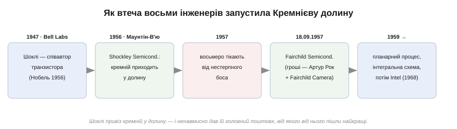
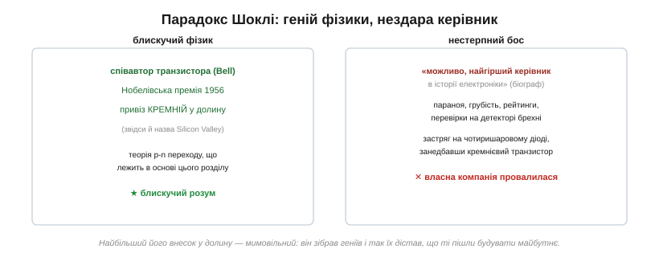
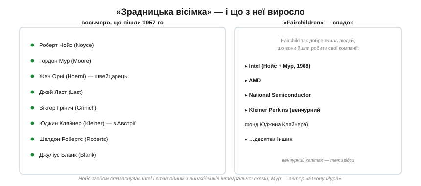

# 📜 Шоклі, «зрадницька вісімка» і народження Кремнієвої долини

Транзистор винайшли в Bell Labs на сході США — а от **індустрія**, що зробила його основою цивілізації, виросла за три тисячі миль, у каліфорнійській долині фруктових садів. Як вона там опинилася? Через одну людину, яка привезла туди кремній, — і через вісьмох, які від неї втекли. Це історія про те, як **поганий начальник** ненавмисно запустив найбільший технологічний бум в історії.

*Шоклі привіз кремній у долину (1956), за рік від нього пішли вісім інженерів і заснували Fairchild Semiconductor (1957) — а з неї виросла вся напівпровідникова індустрія, аж до Intel.*

## Геній, що повернувся додому

**Вільям Шоклі** (*William Shockley*) — один зі співавторів транзистора. У Bell Labs він керував групою, де Джон Бардін і Волтер Браттейн у 1947 році зробили перший точковий транзистор; сам Шоклі розробив теорію PN-переходу й площинного транзистора, на якій, по суті, стоїть увесь цей розділ. У 1956 році всі троє дістали Нобелівську премію з фізики. Блискучий розум — це безсумнівно.

Того ж 1956 року Шоклі залишив Bell Labs і повернувся до рідної Каліфорнії, де заснував у містечку Маунтін-В'ю власну фірму — **Shockley Semiconductor Laboratory** (фінансував її Beckman Instruments). Мета була ясна й правильна: зробити комерційний **кремнієвий** транзистор. Саме цей крок і привіз кремній у тиху долину садів на південь від Сан-Франциско — місце, що згодом стане **Кремнієвою долиною** і назветься так саме завдяки кремнію. Шоклі вмів вербувати таланти: він зібрав блискучу команду молодих докторів наук з усієї країни.

## Нестерпний бос

І тут блискучий фізик виявився, за словами його біографа, «можливо, найгіршим керівником в історії електроніки».

*Той самий чоловік — і вершина фізики (транзистор, Нобель, кремній у долині), і провал керівництва. Параноя, приниження, недовіра — і застрягання на побічному проєкті замість головного.*

Шоклі керував авторитарно й параноїдально: підозрював співробітників у змовах, вивішував їхні зарплати на загальний огляд, а одного разу навіть зажадав перевірки на детекторі брехні через дріб'язкову травму в офісі. До того ж він наполіг кинути сили не на кремнієвий транзистор, а на власну ідею — **чотиришаровий діод** (прилад, що сам «защіпується» у ввімкнений стан). Колеги вважали проєкт надто ризикованим для молодої компанії; Шоклі не слухав. Талановиті інженери, яких він сам і зібрав, опинилися під керівництвом, що отруювало роботу.

## Вісім доларових банкнот

У 1957 році терпець урвався. Вісім провідних інженерів вирішили піти разом. За переказом, лист про намір кількох співробітників звільнитися потрапив на стіл молодого фінансового аналітика з Волл-стріт **Артура Рока** (*Arthur Rock*), і той дав пораду, що змінила історію: не шукайте, куди найнятися, — **заснуйте власну компанію**, а гроші ми знайдемо. Рок звів їх із Шерманом Фейрчайлдом, і вісімка дістала 1,38 мільйона доларів від його корпорації **Fairchild Camera and Instrument**. На знак угоди один із банкірів роздав вісьмом засновникам по новенькій доларовій банкноті — підписатися на них замість контракту.

**18 вересня 1957 року** народилася **Fairchild Semiconductor**. Шоклі назвав відхід своїх людей **зрадою** — звідси й прізвисько, яке історія залишила за вісімкою: *traitorous eight*, «зрадницька вісімка».

*Вісім засновників Fairchild — і «Fairchildren», компанії, що відбрунькувалися від неї згодом. Серед восьми — швейцарець Жан Орні (планарний процес) і Юджин Кляйнер, що приїхав із Австрії.*

Назвімо їх поіменно, бо за «вісімкою» стоять конкретні люди: **Роберт Нойс**, **Гордон Мур**, **Жан Орні** (*Hoerni*, швейцарець), **Джей Ласт**, **Віктор Грінич**, **Юджин Кляйнер** (*Kleiner*, що хлопчиком утік із Відня), **Шелдон Робертс** і **Джуліус Бланк**. Це були не «зрадники», а інженери, що відмовилися марнувати талант під поганим керівництвом, — і виявилися праві.

## Що з цього виросло

Fairchild Semiconductor стала не просто успішною — вона стала **колискою цілої індустрії**. Уже за два роки швейцарець Жан Орні винайшов там **планарний процес** — той самий, що [зробив кремній непереможним проти германію](root:ph-condensed/semiconductor/hist-silicon-germanium.md), — а Роберт Нойс — одну з перших **інтегральних схем**. Але головне сталося далі: Fairchild так блискуче вирощувала таланти, що ті раз по раз ішли засновувати **власні** фірми. Ці спін-офи прозвали «**Fairchildren**» — «діти Fairchild», — і їх були десятки. Найвідоміша — **Intel**, яку 1968 року заснували двоє з тієї самої вісімки, Нойс і Мур (той самий Гордон Мур, чий «закон Мура» потім задаватиме ритм усій галузі). Від Fairchild пішли й AMD, і National Semiconductor; а Юджин Кляйнер заснував Kleiner Perkins — один із перших венчурних фондів, тож і сама модель «венчурні гроші під сміливу ідею», на якій стоїть уся долина, теж родом звідси.

Так одна втеча розгалузилася в цілу екосистему. А іронія, заради якої цю історію й варто пам'ятати, — у самому Шоклі. Він **привіз** кремній у долину й **зібрав** там геніїв — без цього нічого б не сталося. Та його найбільший внесок у Кремнієву долину виявився **мимовільним**: він так нестерпно керував, що найкращі пішли — і збудували майбутнє вже без нього, тоді як його власна компанія зачахла. (Сумний постскриптум: пізніше Шоклі скотився в расистські псевдонаукові теорії про спадковість інтелекту й остаточно зруйнував свою репутацію — гірке нагадування, що блиск в одній царині не дає ні мудрості, ні моральної рації в інших.)

Висновок цієї історії ширший за електроніку. **Геніальна ідея — це необхідно, але далеко не достатньо.** Транзистор винайшли на сході; перетворили на індустрію — на заході, і не тому, що там були розумніші фізики, а тому, що там зійшлися таланти, свобода піти й почати своє, і гроші, готові ризикнути. Шоклі дав долині перші два інгредієнти — кремній і людей; а свободу піти ці люди взяли самі, попри ярлик «зрадників». Наступного разу, тримаючи в руках транзистор, згадайте: за ним стоїть не лише фізика PN-переходу, а й вісім підписів на доларових банкнотах.
