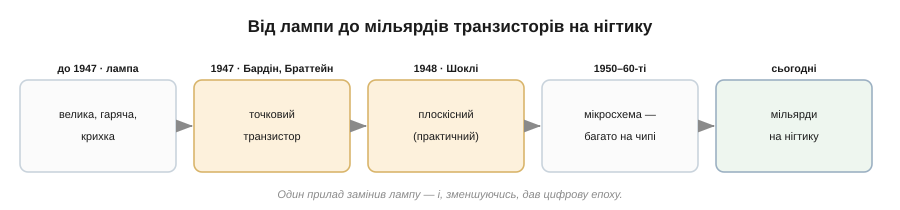
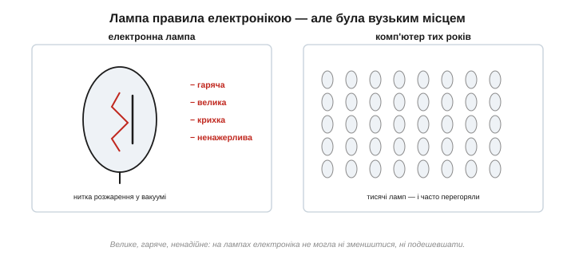
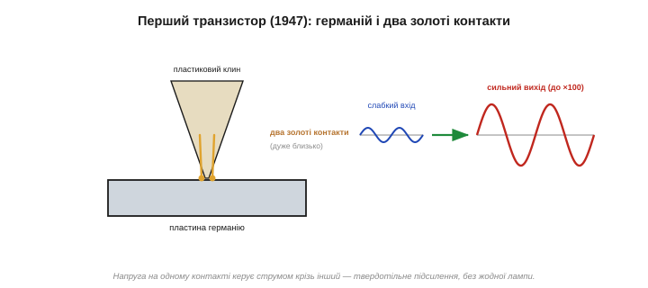
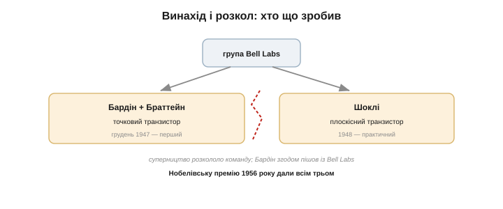
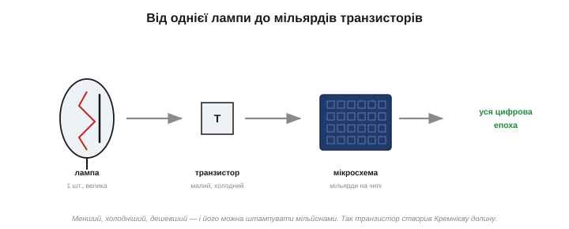

# 📜 1947, Bell Labs: винахід транзистора

> Транзистор — чи не найважливіший винахід XX століття: з нього зроблено кожен комп'ютер, телефон, мікросхему. Він народився наприкінці 1947 року в лабораторіях Белла — у кілька тижнів гарячкової роботи й кількох років гіркого суперництва. Це історія про те, як шматочок германію замінив електронну лампу й відкрив цифрову епоху — і про людей, чия співпраця обернулася розколом.

Усе цифрове навколо вас — телефон, екран, на якому ви читаєте, — зрештою зібране з мільярдів копій одного крихітного приладу: **транзистора**. Він прийшов на зміну гарячій скляній лампі — і, на відміну від неї, міг зменшуватися майже без кінця. За цим стоїть драматична історія з геніальністю, щасливим випадком і людськими амбіціями. Пройдімо її від «тиранії лампи» до Кремнієвої долини.

*Шлях транзистора. До 1947-го панувала лампа — велика й гаряча. У грудні 1947-го Бардін і Браттейн зробили перший транзистор; 1948-го Шоклі — практичніший; згодом транзистори навчилися складати тисячами, потім мільярдами на одному чипі. Один прилад дав цифрову епоху.*

---

## Тиранія лампи

До 1947 року активною електронікою правила **електронна лампа**. Лампа вміла головне — **підсилювати** сигнал і **перемикати**, чого не міг ні діод, ні кристал. На лампах працювали радіо, телефонні підсилювачі, перші комп'ютери. Та була вона жахливо незручна: велика, як палець чи більша; **гаряча**, бо потребувала розжареної нитки у вакуумі; **крихка** (скло!); ненажерлива на струм; і не вмикалася миттєво — мусила прогрітися.

Поки приладів були десятки, це терпіли. Та коли їх стали тисячі, лампа перетворилася на стіну. Знаменитий комп'ютер **ЕНІАК** (*ENIAC*, 1945) мав близько **18 тисяч** ламп — і котрась перегоряла кожні день-два, тож машину доводилося раз у раз лагодити. Ціла зала, тонни заліза, кіловати тепла — і все це, щоб робити обчислення, які сьогодні робить дешевий годинник. Електроніка вперлася в стіну: на лампах вона не могла ні **зменшитися**, ні **подешевшати**, ні стати надійною.

*Електронна лампа: гаряча, велика, крихка, ненажерлива. Комп'ютер тих років — це шафа з тисячами таких ламп, де котрась раз у раз перегоряла. На цьому годі було будувати щось мале й надійне.*

> 🔧 **Навіщо це.** Урок тут понадчасовий: технологія впирається в стіну не тоді, коли перестає працювати, а коли перестає **масштабуватися**. Лампа працювала чудово — але не вміла дешевшати й зменшуватися. Інженери мріяли про «твердотільний» підсилювач: без вакууму, без розжарення, без скла — щось маленьке, холодне й надійне, що можна було б робити мільйонами. Саме ця мрія й вела дослідників Белла.

---

## Полювання на твердотільний підсилювач

Після Другої світової війни лабораторії Белла зібрали групу фізиків шукати напівпровідниковий підсилювач — під орудою честолюбного й блискучого **Вільяма Шоклі** (*William Shockley*). Навіщо це було Беллу? Телефонній компанії, що тягла лінії через увесь континент, конче потрібні були надійні **підсилювачі-повторювачі** замість тисяч ламп, які гріються й перегоряють. Твердотільний підсилювач обіцяв телефонну мережу, що не ламається щодня, — комерційний інтерес тут ішов пліч-о-пліч із науковим. Ідея давно носилася в повітрі: ще **1925–1928 років** **Юліус Едґар Лілієнфельд** (*Julius Lilienfeld*) запатентував принцип польового транзистора — керувати струмом у напівпровіднику електричним полем, — але збудувати робочий прилад тоді було годі (і його забуті патенти згодом завадять Беллу патентувати власний польовий транзистор). А кристалічне підсилення мигцем бачили й раніше — як-от [«кристадин» Лосєва](root:hw-sensing/led-photodiode) 1920-х. Бракувало надійного, зрозумілого приладу.

Перша спроба Шоклі — польовий підхід — **не спрацювала**: струм уперто не корився полю. Розгадку дав теоретик групи **Джон Бардін** (*John Bardeen*): на поверхні напівпровідника електрони «застрягають» у пастках (поверхневі стани) й екранують поле, не пускаючи його всередину. Це розуміння й вивело групу на правильний шлях — працювати не з полем крізь поверхню, а з контактами просто на ній. Ключовий момент: невдача обернулася відкриттям. Збагнувши, **чому** поле не діє (його з'їдають поверхневі заряди), Бардін підказав обхід — упливати на ці заряди безпосередньо, точковими контактами. Так провал першої ідеї проклав дорогу до другої — тієї, що спрацювала.

---

## Грудень 1947: перший транзистор

Далі настали «чарівні тижні». Теоретик **Джон Бардін** і експериментатор **Волтер Браттейн** (*Walter Brattain*) працювали в парі. **16 грудня 1947 року** вони притиснули до шматочка надчистого германію два золоті контакти, рознесені на крихітну відстань (утримував їх пластиковий клинець), — і сталося диво: напруга на одному контакті **керувала** набагато більшим струмом крізь інший. Слабкий сигнал виходив **підсиленим** — разів у сто. **23 грудня** прилад показали керівництву. Це був перший у світі **твердотільний підсилювач** — без вакууму, без розжарення, без скла. Народилася нова епоха.

Германій був не випадковий: саме його за війну навчилися очищати для радарних детекторів, тож чистий матеріал був під рукою. А контакти ставили **дуже близько** — на частку міліметра — бо лише так дія одного діставалася до іншого крізь тонкий шар кристала. Ті кілька грудневих тижнів 1947-го заведено називати чи не найпліднішими в історії техніки.

*Точковий транзистор Бардіна й Браттейна: пластина германію, два золоті контакти на пластиковому клині — дуже близько один до одного. Напруга на одному контакті керує струмом крізь інший, підсилюючи сигнал до ста разів. Лампа стала непотрібною.*

Прилад охрестили **транзистором** — це слово вигадав інженер Белла **Джон Пірс** (*John Pierce*) 1948 року, склавши його з «transfer» і «resistor» (переносний опір). Назва прижилася миттєво. А перший пристрій звали **точковим транзистором** — за тими двома гострими контактами, що дотикались до кристала.

> 🔧 **Навіщо це.** Зверніть увагу на пару, що зробила прорив: **теоретик** (Бардін) і **експериментатор** (Браттейн). Бардін розумів, *чому* не виходить і куди копати; Браттейн умів зробити це руками. Поодинці ні той, ні той не дійшов би так швидко — прорив народився саме на стику глибокої теорії й вправного експерименту. Це типово для великих відкриттів і варте запам'ятовування.

---

## Шоклі й розкол

А тепер — людська драма. Шоклі був **керівником** групи, і прорив стався на ідеях, які він плекав, — але **без його прямої участі**: вирішальний прилад зробили Бардін і Браттейн майже самі, поки він був в інших справах. Це його глибоко вразило. У січні **1948 року** Шоклі за кілька тижнів напруженої роботи вигадав **інший**, кращий прилад — **плоскісний** (*junction*) транзистор: не з примхливими гострими контактами, а з акуратними [p-n переходами в товщі кристала](root:hw-components/bjt-structure). Він був надійніший і — головне — придатний до **масового виробництва**. Саме плоскісний транзистор, а не точковий, заполонив згодом світ. Чому переміг саме він? Точковий був примхливий і крихкий — ті гострі контакти легко збивалися, мов колишній «котячий вус». Плоскісний же, із переходами в товщі кристала, виходив міцним, передбачуваним і придатним до конвеєра. Іронія: прилад програв тому, хто зробив його не першим, зате кращим.

Та сварка вже розгорілася. Шоклі прагнув, щоб патент стояв на його імені, і фактично **відсторонив** Бардіна й Браттейна від роботи над плоскісним приладом. Колись дружна група розкололася. Бардін, не витримавши, **залишив** Белл 1951 року й пішов у фізику надпровідності — де згодом здобуде **другу** Нобелівську премію (унікальний випадок — Бардін єдиний, хто має дві Нобелівські премії саме з фізики: за транзистор і за теорію надпровідності). Браттейн відмовився далі працювати з Шоклі й перейшов до іншої групи.

*Бардін і Браттейн зробили перший (точковий) транзистор у грудні 1947-го; ображений Шоклі невдовзі вигадав практичніший плоскісний (1948). Суперництво за визнання розкололо команду. А проте Нобелівську премію з фізики 1956 року дали всім трьом — за відкриття транзисторного ефекту.*

І все ж історія віддала належне всім: **1956 року** Бардін, Браттейн і Шоклі разом отримали **Нобелівську премію з фізики** «за дослідження напівпровідників і відкриття транзисторного ефекту». Прорив був спільний — навіть якщо люди, що його зробили, уже не розмовляли одне з одним.

---

## Від лампи до Кремнієвої долини

Плоскісний транзистор можна було робити дешево й мільйонами — і світ змінився блискавично. Транзистори витіснили лампи з радіо й комп'ютерів; апарати поменшали, схолонули, подешевшали. А далі стався другий стрибок: навчилися робити **багато** транзисторів на одному шматочку кремнію разом — так народилася **мікросхема** (інтегральна схема). Кількість транзисторів на чипі почала подвоюватися кожні приблизно два роки (це згодом назвуть **законом Мура**) — від одиниць до тисяч, мільйонів, **мільярдів** на нігтику. Ключем до цього стала **інтегральна схема**: наприкінці 1950-х Джек Кілбі й Роберт Нойс (незалежно) придумали робити транзистори, з'єднання й решту деталей одразу на спільному кристалі, не паяючи кожен окремо. Відтоді складність зростала не додаванням деталей руками, а **друком** їх дедалі дрібніше — звідси й нестримне подвоєння.

Чому це так перевернуло світ? Бо транзистор уміє двоє: **підсилювати** (робить слабкий сигнал сильним — радіо, звук, зв'язок) і **перемикати** (вмикати-вимикати струм за командою — а «ввімкнено/вимкнено» це і є нулі та одиниці логіки). Перше дало портативну електроніку, друге — комп'ютери. Лампа вміла те саме — але мільярд ламп у кишеню не вмістити, а мільярд транзисторів — уміщається залюбки.

*Лампа → транзистор → мікросхема. Кожен крок — менше, холодніше, дешевше й численніше. Те, що колись займало залу з тисячами ламп, тепер ховається в кристалику з мільярдами транзисторів. Так транзистор створив усю цифрову техніку.*

А ще транзистор створив **Кремнієву долину**. 1956 року Шоклі заснував у Каліфорнії власну компанію (Shockley Semiconductor) — та через його важкий характер вісім найкращих інженерів («зрадницька вісімка», серед них Роберт Нойс і Гордон Мур) **пішли** від нього й заснували Fairchild Semiconductor. Із неї виросли десятки фірм — зокрема Intel, — що й перетворили долину садів на серце світової електроніки. Іронія долі: своїм характером Шоклі мимоволі й посіяв ту індустрію, коли від нього розбіглися таланти.

> 🔧 **Навіщо це.** Дві думки на майбутнє. Перша: транзистор переміг лампу не тому, що краще підсилював (попервах — навіть гірше), а тому, що **масштабувався** — маленький, холодний, дешевий, складаний у мільйони. Друга: уся ваша цифрова техніка — це, по суті, **мільярди транзисторів-перемикачів**. Зрозумівши один транзистор, ви зрозумієте цеглинку, з якої складено все інше.

Сумна примітка наостанок, бо історія науки буває й така: Шоклі під кінець життя зажив ганебної слави, проповідуючи расистські псевдонаукові ідеї. Геній у фізиці не убезпечує від хибних і шкідливих поглядів поза нею — це варто пам'ятати, віддаючи належне його внеску в транзистор і не плутаючи одне з іншим.

---

## Що з цього лишилось

Озирнімося на цей ланцюг — від гарячої лампи до холодного кристала.

- **Транзистор = твердотільний підсилювач і перемикач.** Те, що робила лампа, але маленьке, холодне, надійне й дешеве. Саме це, а не якась окрема перевага, і зробило революцію.
- **Винахід — колективний.** Ідею поля заклав Лілієнфельд (1925); перший прилад зробили Бардін і Браттейн (1947); практичний — Шоклі (1948); назву дав Пірс (1948). Не один герой, а ланцюг — попри всі особисті чвари.
- **Масштабованість вирішує.** Лампа програла не якістю, а нездатністю зменшуватися й дешевшати. Транзистор виграв саме цим — і дав мікросхему, закон Мура й цифрову епоху.
- **Геній і людина — різні речі.** Прорив супроводжувався гірким суперництвом, а один із творців згодом зганьбив себе поглядами поза наукою. Віддаючи належне внескові, не варто ідеалізувати людей.

А головне для нас, практиків: серце всієї цієї історії — це **один транзистор** і те, як малий струм керує великим. Зрозумівши цю єдину цеглинку, ви триматимете в руках принцип, на якому стоїть кожен підсилювач, кожен логічний вентиль, кожен процесор.
