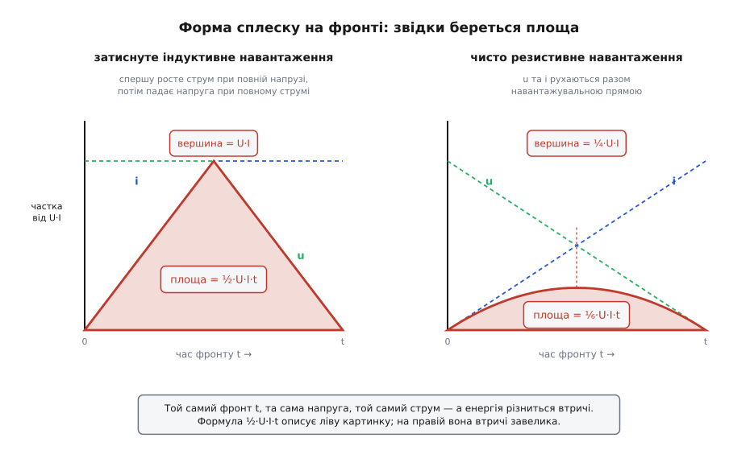
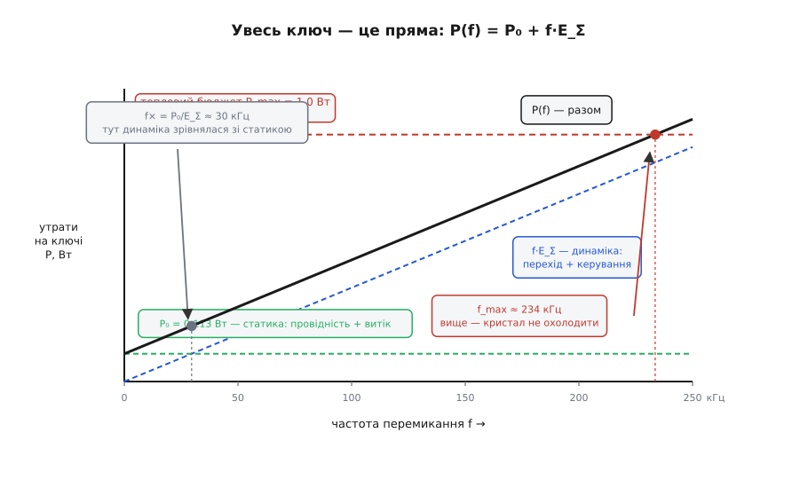
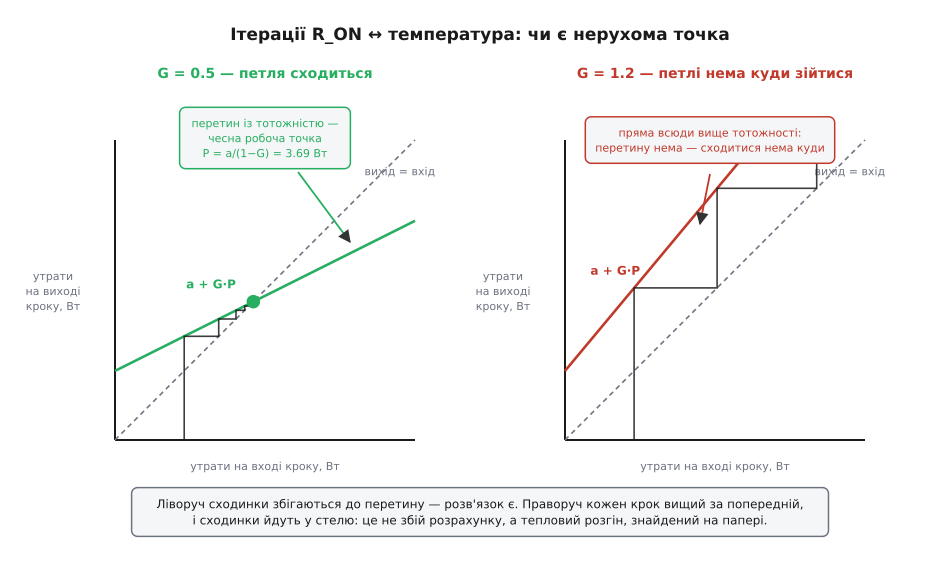
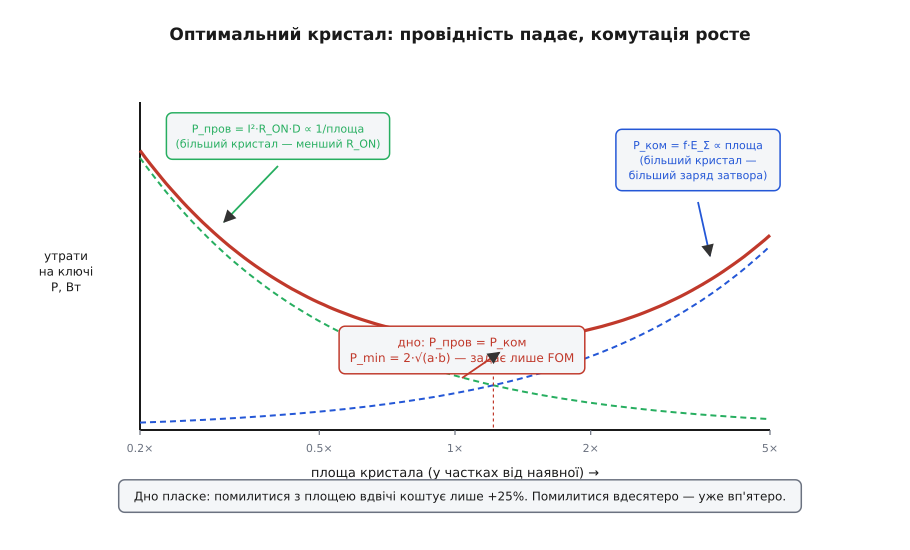

# 🧮 Бюджет утрат ключа: чотири доданки, енергія фронту й стеля частоти

## Що саме ми рахуємо

Миттєва потужність на ключі — це добуток миттєвих значень: p(t) = u(t)·i(t). Але кристалові до миттєвих значень байдуже. Він має теплоємність, він не встигає за наносекундами, і його температуру задає не сплеск, а **середнє за багато періодів**. Тому рахувати треба середнє:

```
P̄ = (1/T)·∫₀ᵀ u(t)·i(t) dt = E_період / T = f · E_період
```

Остання рівність виглядає як переписування означення, а насправді це вже весь апарат. Середня потужність дорівнює **частоті, помноженій на енергію одного періоду**. Отже, будь-яка витрата, яку вдається сформулювати як «стільки-то джоулів за один клац», автоматично перетворюється на доданок, помножений на f. Питання лише в тому, які витрати так формулюються, а які ні.

І тут ховається справжня причина, чому чотири рахунки розпадаються саме на дві сім'ї — причина не табличная, а геометрична. Розіб'ємо інтеграл за періодом на шматки:

```
E_період = ∫(поки відкрито) p dt + ∫(поки закрито) p dt + ∫(на фронтах) p dt
```

Поки ключ **стоїть** у якомусь стані, потужність там стала, а тривалість шматка пропорційна періодові: відкрито він D·T, закрито (1−D)·T. Тому

```
∫(поки відкрито) p dt = P_відкр · D · T     →     внесок у P̄ = f · P_відкр · D · T = P_відкр · D
```

**Частота скоротилася.** Період розтягнувся — і шматок розтягнувся разом із ним, рівно настільки ж.

А фронт не розтягується. Фронт триває стільки, скільки триває, — його тривалість задають заряд затвора й сила драйвера, а не те, як часто ви клацаєте. Клацайте раз на секунду або сто тисяч разів на секунду — кожен окремий фронт коштує ту саму фіксовану порцію E, і в інтегралі за періодом вона стоїть як стала:

```
∫(на фронтах) p dt = E_on + E_off  = const      →     внесок у P̄ = f · (E_on + E_off)
```

**Частота лишилася.** Ось і весь вододіл, і він не між «важливим і дрібним», а між тим, що **розтягується разом із періодом**, і тим, що **не розтягується**. Стани розтягуються — з них частота зникає. Фронти не розтягуються — за них платять поштучно. Керування затвором потрапляє в другу сім'ю з тієї ж причини: заряд у затвор ллють один раз за клац, а не безперервно.

Далі лишається зробити те, що ця картинка обіцяє: чесно порахувати кожен інтеграл.

## Звідки береться трикутник

Формула ½·U·I·t виглядає як здогад «ну, десь половина» — а насправді це точна площа точної фігури, і фігуру задає **коло**, а не транзистор.

Візьмімо найтиповіший випадок силової техніки: індуктивне навантаження, затиснуте діодом (саме так улаштована кожна стійка перетворювача). Увімкнення розпадається на дві фази, і порядок фаз **вимушений**:

**Фаза 1 — росте струм, напруга тримається.** Ключ починає провадити, але струм навантаження поки що йде через діод. Доки діод провадить, він **притискає** вузол — напруга на ключі лишається повною, хоч ключ уже відкривається. Струм у ключі росте від нуля до струму навантаження, і весь цей час напруга на ньому — повна U.

**Фаза 2 — тримається струм, падає напруга.** Щойно ключ перебрав увесь струм, діод стає непотрібним і зачиняється. Тільки **тепер** вузол відпущено, і напруга на ключі може падати. Струм при цьому нікуди не дінеться: котушка тримає його стало.

Фази не накладаються, і не через якусь властивість кристала — їх розвело коло. Порахуймо:

```
фаза 1:   u = U,  i = I·(τ/t₁)     →   p = U·I·(τ/t₁)      росте лінійно  0 → U·I
фаза 2:   i = I,  u = U·(1 − τ/t₂) →   p = U·I·(1 − τ/t₂)  падає лінійно  U·I → 0

E = ∫ p dτ = ½·U·I·t₁ + ½·U·I·t₂ = ½·U·I·(t₁ + t₂) = ½·U·I·t
```

Потужність лінійно виросла до вершини й лінійно повернулася до нуля — це **трикутник** з основою t = t₁ + t₂ і висотою U·I. [Площа під кривою](topic:math-analysis/integral) трикутника — половина добутку основи на висоту. Ніякого наближення й ніякого підганяння: ½·U·I·t — це просто площа тієї фігури, яку дала модель.

Варто затриматися на висоті. U·I — це **повний** добуток: на мить ключ тримає на собі всю напругу живлення і весь струм навантаження заразом. Гірших точок у площині немає взагалі, і саме тому траєкторія фронту так небезпечно близько підходить до межі [зони безпечної роботи](topic:hw-components/safe-operating-area).

## Резистивне навантаження дає іншу фігуру

А тепер приберімо котушку й діод. На чистому резисторі притискати вузол нема кому — і ніщо не розводить фази. Напруга та струм зчеплені [навантажувальною прямою](topic:hw-analog/load-line) й рухаються разом:

```
u = E·(1 − x),   i = (E − u)/R = (E/R)·x = I·x,      x = τ/t

p = u·i = E·I·x·(1 − x)                    — парабола, а не трикутник

вершина при x = ½:   p = E·I·¼ = ¼·U·I
площа:  ∫₀¹ x(1−x) dx = ½ − ⅓ = ⅙         →   E = ⅙·U·I·t
```

Та сама тривалість фронту, та сама напруга, той самий струм — і вершина вчетверо нижча, а енергія втричі менша. Уся різниця в тому, що на індуктивному навантаженні прилад **послідовно** побував у двох найгірших станах, а на резистивному він проїхав прямою через середину, де напруга й струм уже поділені між ним і навантаженням.


*Обидві панелі — той самий фронт t, та сама U, той самий I. Ліворуч фази розведено діодом: спершу росте струм при повній напрузі, потім падає напруга при повному струмі — потужність описує трикутник із вершиною U·I. Праворуч u та i йдуть разом навантажувальною прямою — виходить парабола з вершиною вчетверо нижчою і площею втричі меншою.*

І ось що варто помітити у вершині тієї параболи. Для кола 12 В на 4 Ω вона дорівнює E·I/4 = E²/(4R) = 9 Вт — рівно те число, на якому назавжди застряг би плавний прилад, поставлений у середину. **Це та сама точка площини.** Ключ у ній буває; плавний прилад у ній живе. Різниця не в потужності, а в тривалості перебування — бо втрати вимірюються не ватами, а ватами, помноженими на час.

**Приклад. Той самий фронт 100 нс на 12 В і 3 А — дві фігури, дві ціни.**
```
затиснуте індуктивне:  E = ½·12·3·100·10⁻⁹ = 1.8 мкДж     вершина 36 Вт
чисто резистивне:      E = ⅙·12·3·100·10⁻⁹ = 0.6 мкДж     вершина  9 Вт
```
Утричі — і це ще той випадок, коли модель помиляється на нашу користь.

## Коли ця оцінка бреше

Формула ½·U·I·t описує одну конкретну ідеалізацію: затиснуте індуктивне навантаження, лінійні фронти, більше нічого в колі немає. Реальність відхиляється від неї в обидва боки, і корисно знати, у який саме.

**Убік песимізму — формула завелика.** Резистивне навантаження вже дало втричі менше. Ще різкіше — [м'яка комутація](topic:hw-power/soft-switching-zvs-zcs): якщо влаштувати коло так, щоб напруга на ключі впала до нуля **раніше**, ніж піде струм (або струм спав до нуля раніше, ніж підніметься напруга), добуток на фронті стає майже нульовим і трикутник просто зникає. Тоді ½·U·I·t завищує втрати не на відсотки, а на порядки. Уся вигода [резонансних перетворювачів](topic:hw-power/resonant-converter) саме в цьому: вони не роблять фронт швидшим — вони роблять його **безкоштовним**, перенісши перемикання в мить, коли один зі співмножників уже нульовий.

**Убік оптимізму — формула замала, і це коштує приладів.**

*[Зворотне відновлення](topic:hw-components/reverse-recovery) діода.* Той самий діод, що притискав вузол, не зачиняється миттєво: накопичений у ньому заряд Q_rr треба виміти, і виметається він **крізь наш ключ** при повній напрузі. Це додає приблизно Q_rr·U до кожного ввімкнення плюс кидок струму понад струм навантаження. На кволому вбудованому діоді кремнієвого MOSFET цей доданок легко перевищує сам ідеальний трикутник.

*[Вихідна ємність](topic:hw-components/output-capacitance) C_oss.* Поки ключ закритий, його власна вихідна ємність заряджена до повної напруги й тримає в собі енергію E_oss. При жорсткому ввімкненні канал розряджає цю ємність **сам у себе** — уся E_oss за кожен клац іде в тепло. Найпідступніше тут те, що цьому доданкові байдуже до швидкості фронту: скоротіть фронт удвічі — трикутник поменшає вдвічі, а E_oss не поворухнеться.

*Паразитна індуктивність на вимкненні.* Висота трикутника — не U, а U + L·di/dt: викид виносить напругу понад живлення. Саме з цим борються [снабери](topic:hw-power/snubbers-dvdt), і платять за це — знову ж таки — теплом, просто в іншому місці.

*Паспортні t_r/t_f — це не час утрат.* Їх виміряно за одних конкретних U, I, R_затв і температури, і масштабувати їх на ваш режим не можна. Та й самі фронти не лінійні: на [міллерівському плато](topic:hw-analog/miller-effect) швидкість зміни напруги задає струм затвора крізь ємність C_gd, а та ємність шалено нелінійна за напругою. Саме тому серйозні паспорти дають **виміряні** криві E_on/E_off від струму — вони існують рівно тому, що замкненій формулі не можна довіряти як числу.

Висновок звідси не «формула погана», а точніший: **½·U·I·t — це закон масштабування, а не вимірювання.** Він чесно каже, що станеться, коли подвоїти струм, подвоїти напругу, скоротити фронт удвічі чи підняти частоту вдесятеро. Він не каже, скільки буде ватів із точністю до другої цифри. Ним вирішують **будову** схеми; конкретний прилад вибирають за кривими E_on/E_off або за виміром. Плутати ці дві ролі — найдорожча помилка в усьому рахунку.

## Чотири доданки складаються в пряму

Тепер зберімо все. Провідність: поки ключ відкритий, u = I·R_ON і i = I, тож p = I²·R_ON, а стан триває частку D. Витік: поки закритий, u = U та i = I_вит, стан триває (1−D). Фронти вже пораховано. Лишилося керування — і його варто вивести чесно, бо звідти виходить неочевидне.

**Енергія керування.** Затвор — ємність, але [ємність препаскудна](topic:hw-components/gate-capacitance): нелінійна, з плато посередині, тож ½·C·U² до неї не застосуєш. Заходьмо через заряд і через закон збереження. За **повний період** затвор повертається туди, звідки почав: та сама напруга, той самий заряд, та сама запасена енергія. Отже, чиста зміна запасеної енергії за період — точно нуль, а значить **усе, що джерело віддало, розсіялося**. А віддало воно легко рахований шматок: проштовхнуло [заряд Q_g](topic:hw-components/gate-charge-curve-phases), тримаючи на своїх затискачах U_кер. Тому

```
P_кер = f · Q_g · U_кер
```

Придивіться, чого в цій формулі **немає**: у ній немає R_затв. Резистор у затворі вирішує, як **швидко** поїде заряд і **де** він згорить — у самому резисторі, у внутрішньому опорі затвора чи у вихідному каскаді [драйвера](topic:hw-power/gate-driver), — але не скільки його згорить. Кволий драйвер не заощаджує на керуванні жодного мікроджоуля; він лише розтягує фронт, а розтягнутий фронт дорожчає за **іншим** доданком. Це рідкісний випадок, коли інтуїція «повільніше — ощадливіше» помиляється в обидва боки одразу.

Складаємо:

```
P(f) = I²·R_ON·D + U·I_вит·(1−D)  +  f·( E_on + E_off + Q_g·U_кер )
       └────────── статика P₀ ─────────┘   └───── енергія за період E_Σ ─────┘

P(f) = P₀ + f · E_Σ
```

**Ключ описується двома числами.** Не чотирма — двома. Вільний член у ватах і нахил у джоулях. Причому нахил **буквально є енергією**: ват, поділений на герц, — це джоуль, і розмірність тут не формальність, а той самий вододіл, з якого ми почали.

```
розмірність:  [Дж/цикл] · [цикл/с] = [Дж/с] = [Вт]      ✓
```

**Приклад. Ключ веде 3 А від 12 В: R_ON = 25 мОм, D = 0.5, фронт 100 нс, витік 1 мкА, Q_g = 20 нКл при U_кер = 10 В.**
```
P₀  = 3²·0.025·0.5 + 12·10⁻⁶·0.5 = 0.1125 + 0.000006 = 0.113 Вт
E_Σ = 2·1.8 мкДж + 20·10⁻⁹·10 Дж = 3.6 мкДж + 0.2 мкДж = 3.8 мкДж

P(f) = 0.113 + f·3.8·10⁻⁶            (перевірка при 20 кГц: 0.113 + 0.076 = 0.189 Вт)
```

Зверніть увагу на пропорцію всередині E_Σ: 3.6 мкДж на фронти проти 0.2 мкДж на затвор. Керування — вісімнадцята частина динаміки, дарма що в списку рахунків стоїть нарівні з рештою. Це знадобиться далі.


*Уся поведінка ключа з частотою — одна пряма. Зелена горизонталь — статика P₀: провідність і витік, частоті байдужі. Синя похила — динаміка f·E_Σ: виходить із нуля, бо при нульовій частоті клацати нема чого. Чорна — сума. Перетин f× там, де похила наздогнала горизонталь; червона стеля — тепловий бюджет, і точка, де його пробито, дає f_max.*

## Перетин: де динаміка переганяє статику

Прирівняймо дві сім'ї:

```
f · E_Σ = P₀      →      f× = P₀ / E_Σ = 0.1125 / (3.8·10⁻⁶) ≈ 29.6·10³ Гц ≈ 30 кГц
```

Наш ключ працює на 20 кГц — нижче перетину: 0.113 Вт статики проти 0.076 Вт динаміки.

Але корисніше не саме число, а те, **що воно означає для рішення**. f× — це коліно пружності. Далеко нижче нього частота майже безкоштовна; далеко вище — коштує лінійно:

```
при f = ¼·f× :  P = 1.25·P₀   →  подвоєння частоти додає  +20%
при f = 4·f×  :  P = 5·P₀      →  подвоєння частоти додає  +80%
```

Ось звідки береться дивна на позір поведінка реальних схем: до якогось моменту частоту піднімають і майже нічого не помічають, а потім кожен наступний крок раптом починає коштувати повну ціну. Нічого не «раптом» — просто перейшли коліно.

## Тепловий бюджет: скільки герців узагалі можна купити

Утрати самі по собі нікого не цікавлять — цікавить температура кристала. Тепло мусить вийти назовні, а виходить воно крізь [тепловий опір](topic:ph-thermodynamics/thermal-resistance):

```
T_кристала = T_середовища + P · R_θ
```

R_θ — не одне число, а ланцюжок послідовних опорів: кристал → корпус, корпус → [радіатор](topic:hw-components/heatsink), радіатор → повітря. Перевернімо обмеження й дістаньмо стелю:

```
P_max = (T_j,max − T_a) / R_θ
f_max = (P_max − P₀) / E_Σ
```

**Приклад. Той самий ключ: T_j беремо 110 °C (із запасом від паспортних 150), T_a = 60 °C, R_θ = 50 K/Вт.**
```
P_max = (110 − 60)/50 = 1.0 Вт
f_max = (1.0 − 0.1125)/(3.8·10⁻⁶) ≈ 234·10³ Гц
```
Запас від 150 до 110 — не боягузтво, а [дератинг](topic:hw-components/power-derating): паспортна межа є межею руйнування, а не режимом роботи.

Тепер прочитаймо будову цієї формули — вона каже більше за число.

**У чисельнику стоїть різниця.** Якщо P₀ ≥ P_max, то f_max ≤ 0: ключ згорить від самої лише провідності, **на будь-якій частоті**, і жодне «перемикати повільніше» не врятує, бо повільніше — це нижче за f, а f тут уже не при чому. Статику платять першою; герци купують на решту.

**f_max і f× — різні частоти на різні питання.** У нашому прикладі стеля лежить увосьмеро вище за перетин. Перетин каже, **куди йдуть гроші**; стеля каже, **де починається дим**. Плутати їх — типова й дорога помилка: пройти перетин не заборонено, там просто змінюється ціна наступного герца.

**Найдешевша ручка тут — R_θ, а не транзистор.** Стеля майже пропорційна P_max, а P_max обернено пропорційна R_θ. Удвічі менший тепловий опір — удвічі більше дозволених герців, і для цього не треба міняти прилад: вистачить міді під корпусом.

## Коло, що замикається саме на себе

Досі ми вважали R_ON числом. Він не число — він функція температури. А температура — функція втрат. А втрати — функція R_ON. Коло замкнулося, і замкнулося воно **на себе**.

У польового ключа опір росте з нагрівом: ґратка коливається сильніше, рухливість носіїв падає. Локально це добре описує пряма:

```
R_ON(T) = R₂₅ · [1 + α·(T − 25)]
```

Для низьковольтного кремнієвого MOSFET R_ON від 25 до 125 °C росте разів у 1.6–1.8 (у високовольтних — у 2–2.4), що дає α ≈ 0.008 на кельвін. Справжню нормовану криву дає паспорт; ця пряма — місцеве наближення до неї.

Запишімо петлю чесно. Хай P_c0 = I²·D·R₂₅ — провідність при 25 °C, а P_ін — усе інше (фронти, затвор, витік; вважаймо їх поки що байдужими до температури):

```
P   = P_c0·[1 + α·(T_j − 25)] + P_ін
T_j = T_a + R_θ·P
```

Два рівняння, дві невідомі, обидва лінійні — підставмо одне в друге й розв'яжімо. Ітерації не потрібні:

```
        P_c0·[1 + α·(T_a − 25)] + P_ін
P  =  ─────────────────────────────────
              1 − α·R_θ·P_c0
```

**Дивіться на знаменник.** У ньому сидить безрозмірне число:

```
G = α · R_θ · P_c0
```

Це **підсилення петлі**, а 1/(1−G) — класичний множник зворотного зв'язку. Петля проста: втрати гріють кристал → кристал піднімає R_ON → R_ON піднімає втрати. G каже, яка частка збурення повертається по колу назад.

І ось найкраще. На практиці цю точку шукають **ітераціями**: припустили температуру → порахували R_ON → порахували втрати → порахували температуру → повторили. Подивімося, чим є ця ітерація насправді:

```
P₁ = a
P₂ = a + G·a
P₃ = a + G·a + G²·a
…
Pₙ →  a·(1 + G + G² + G³ + …) = a/(1 − G)
```

**Ітерація — це геометрична прогресія**, і збігається вона тоді й лише тоді, коли G < 1. Отже, коли числа в таблиці розбігаються, це не поганий початковий здогад і не хиба методу: це прогресія зі знаменником не менше одиниці, тобто **фізичне твердження, що рівноваги не існує взагалі**. Ітерації не «не змогли знайти» розв'язок — вони чесно доповіли, що знаходити нема чого. Це [тепловий розгін](topic:hw-components/thermal-runaway), спійманий на папері за кілька хвилин до того, як його спіймали б у металі.


*Кожна сходинка — один прохід ітерації: вертикаль «порахували вихід», горизонталь «подали його на вхід наступного кроку». Ліворуч (G = 0.5) пряма відображення положистіша за тотожність, сходинки збігаються до перетину — робоча точка є. Праворуч (G = 1.2) пряма всюди вище тотожності, перетинати нема що, і сходинки йдуть угору без упину.*

**Тепер переведімо G у градуси.** Добуток R_θ·P_c0 — це рівно ΔT_c0, той нагрів, який дала б сама холодна провідність. Отже:

```
G = α · ΔT_c0            →      G = 1  ⟺  ΔT_c0 = 1/α ≈ 125 K
```

**1/α — це температурний масштаб розгону.** Звідси правило, яке не треба запам'ятовувати, бо його щоразу можна вивести: якщо сама лише провідність, порахована за **холодним** R_ON, підняла б кристал приблизно на 125 K над середовищем — ви на межі. Це число перевіряється в голові.

**Приклад. Той самий ключ веде 10 А замість трьох. R_θ = 50 K/Вт, T_a = 60 °C, f = 20 кГц.**
```
динаміка при 10 А:  E_on = ½·12·10·100·10⁻⁹ = 6 мкДж
                    P_ін = 20·10³·(2·6 + 0.2)·10⁻⁶ = 0.244 Вт

наївно — R_ON холодний, петлі не помічаємо:
   P   = 10²·0.025·0.5 + 0.244 = 1.25 + 0.244 = 1.49 Вт
   T_j = 60 + 50·1.49 = 135 °C                    → «вкладаємось у 150, беремо»

чесно — петля врахована:
   P_c0 = 1.25 Вт      ΔT_c0 = 50·1.25 = 62.5 K      G = 0.008·62.5 = 0.5
   a    = 1.25·[1 + 0.008·(60−25)] + 0.244 = 1.6 + 0.244 = 1.844 Вт
   P    = 1.844/(1 − 0.5) = 3.69 Вт
   T_j  = 60 + 50·3.69 = 244 °C                    → кристал мертвий
```
Наївний рахунок помилився в два з половиною рази — і не в дрібниці, а у **вироку**. Уся різниця — множник 1/(1−G): при G = 0.5 петля подвоює все, що в неї потрапляє, і робить це мовчки.

А де межа? Прирівняймо G до одиниці:

```
G = α·R_θ·I²·D·R₂₅ = 1     →     I_кр = √( 1 / (α·R_θ·D·R₂₅) )
                                      = √( 1 / (0.008·50·0.5·0.025) ) = √200 ≈ 14.1 А
```

Вище ≈14 А цей ключ **із цим охолодженням** не має теплової рівноваги взагалі.

І тепер помітьте, чого в G **немає**: там немає T_a. Температура середовища сидить у чисельнику й ніколи — у підсиленні петлі. Звідси твердження, від якого стає незатишно: **чи існує розв'язок узагалі — вирішує лише підсилення петлі; температура середовища вирішує тільки, наскільки гарячим буде той розв'язок, який існує.** Холодна кімната не рятує від розгону — вона лише відтягує мить, коли він проявиться.

Друге, чого в G майже немає, — самого транзистора. Найбільший важіль у добутку α·R_θ·P_c0 — це R_θ: посадіть той самий прилад на радіатор із R_θ = 5 K/Вт, і при тих самих 10 А вийде G = 0.05 замість 0.5. **Тепловий розгін ключа — це властивість охолодження, а не приладу.** Радіатор ділить підсилення петлі так само буквально, як ділить температуру.

І остання грань того самого числа. Той-таки α, що будує петлю розгону, — це рівно те, завдяки чому польові ключі можна ставити паралельно: транзистор, який захопив більше струму, гріється дужче, його R_ON росте, і він **сам** віддає надлишок сусідам. Один коефіцієнт, дві протилежні ролі: механізм розгону всередині одного приладу й механізм самовирівнювання між кількома. Різниця тільки в тому, яку петлю ви розглядаєте.

Ну і поправмо стелю, порахувану вище на холодну руку:

```
при T_j = 110 °C:  R_ON = 25·(1 + 0.008·85) = 42 мОм
                   P₀   = 3²·0.042·0.5 = 0.189 Вт        (замість 0.113)
                   f_max = (1.0 − 0.189)/(3.8·10⁻⁶) ≈ 213·10³ Гц
```
Стеля просіла з 234 до 213 кГц. Рахувати P₀ за холодним R_ON, а межу — за гарячим кристалом означає вимагати від приладу бути гарячим і холодним одночасно.

## Оптимум, коли ще нічого не порушено

Уявімо, що ви вклалися: до стелі далеко, G мале, нічого не горить. Чи є ще якийсь правильний вибір — чи далі просто «бери найменший R_ON, який тягне гаманець»?

Є. І він не там, де підказує інтуїція.

**Чому взагалі є що вибирати.** Силовий MOSFET — це не окрема конструкція, а **геометрія**, порізана на шматки. Виробник розробляє комірку — повторювану мікроскопічну структуру — а тоді ріже пластину на кристали різної площі. Усе, що залежить від площі, залежить від неї лінійно:

```
більша площа A  →  більше комірок паралельно  →  R_ON = k_r / A     (падає)
                                                  Q_g  = k_q · A     (росте)
```

Перемножмо:

```
R_ON · Q_g = (k_r/A) · (k_q·A) = k_r · k_q          — площа скоротилася
```

**Добуток не залежить від площі.** Він — властивість **комірки**, а не партномера: усі прилади, вирізані з однієї геометрії, і п'ятиміліомний велетень, і п'ятдесятиміліомний куцан, несуть той самий R_ON·Q_g. Тому його й називають показником якості (англ. *figure of merit*, FOM). Ви не купуєте кращий R_ON — ви купуєте **більший шматок того самого**. Відрізняються ж технології, а не прилади в межах технології.

Час фронту масштабується так само. Драйвер із заданим струмом жене в затвор заряд, і фронт триває стільки, скільки треба, щоб перевезти міллерівський заряд:

```
t = Q_gd / I_кер   ∝  A        →       E_фронт = ½·U·I·t  ∝  A
```

Отже **все, що множиться на частоту, росте з площею; усе, що не множиться, — падає.** Оце і є та розмінна монета, і в неї є дно:

```
P(A) = a/A + b·A          a = I²·D·k_r          b = f·( k_q·U_кер + U·I·k_gd/I_кер )

dP/dA = −a/A² + b = 0     →     A* = √(a/b)

у точці A*:   a/A* = √(a·b) = b·A*      →      P_пров = P_ком
              P_min = 2·√(a·b)
```

**У дні ванни провідність точно дорівнює комутації.** Не «приблизно порівну» — точно. І це те саме твердження, що й f×, лише побачене з іншого боку:

```
f×(s) = P₀/E_Σ ∝ (a/s)/(b₁·s) = f×₀/s²          (s — у скільки разів більша площа)

f× = f   ⟺   s = √(f×₀/f)   ⟺   A = A*
```

**Кристал підібрано під частоту рівно тоді, коли f× збігається з робочою частотою.** Перетин — не небезпека, якої треба уникати; це **мішень**, у яку треба влучити. Наш ключ: f×₀ = 29.6 кГц при робочих 20 кГц, тож s* = √(29.6/20) = 1.22 — кристалові годилося б бути на 22% більшим. Виграш: 0.1885 → 0.1849 Вт, тобто 2%. Ми й так практично в дні.


*Вісь площі логарифмічна, тому спад і зростання виглядають дзеркально, а сума — симетричною ванною. Дно лежить точно на перетині двох складників, і його висота 2·√(a·b) залежить лише від FOM — від технології, а не від того, який саме кристал із неї вирізали.*

**Дно пласке**, і це варто зважити в числах, бо саме воно робить цю інженерію взагалі можливою:

```
P(s)/P_min = ½·( s/s* + s*/s )

схибити вдвічі     →  ½·(2 + ½)    = 1.25   →  +25%
схибити втричі     →  ½·(3 + ⅓)    ≈ 1.67   →  +67%
схибити вдесятеро  →  ½·(10 + 0.1) ≈ 5.05   →  у п'ять разів
```

Промахнутися вдвічі коштує чверті — тому підбирати кристал із точністю до відсотка безглуздо. А от промахнутися на порядок — узяти ключ на 100 А в коло на 1 А, «бо з запасом» — коштує вже вп'ятеро. **Запас у силовому ключі не безкоштовний і не монотонний:** до дна він допомагає, за дном працює проти вас, і заряд затвора, який ви оплачуєте на кожному клаці, — це і є ціна невикористаного запасу.

**А тепер підставмо FOM у дно.** Розкриємо a·b, згрупувавши k_r з кожним із k:

```
a·b = I²·D · f · ( R_ON·Q_g·U_кер  +  U·I·R_ON·Q_gd / I_кер )

P_min = 2·I·√( D·f·( FOM_g·U_кер + U·I·FOM_gd/I_кер ) )

       де FOM_g = R_ON·Q_g,  FOM_gd = R_ON·Q_gd  —  обидва не залежать від площі
```

**У формулі дна немає ані R_ON, ані Q_g — лише їхні добутки.** Мінімально досяжні втрати не залежать від того, який прилад ви купили: вони залежать від **технології**, з якої його вирізали, від задачі (U, I, D), від сили драйвера — і від **√f**. Купити «кращий» прилад тієї самої технології не опускає дно ні на міліват; воно лише зсуває, де саме те дно лежить. А зростання як √f, а не як f, — окремо приємна новина: подвоєння частоти піднімає **оптимально підібраний** ключ лише в 1.41 раза, бо разом із частотою міняється й оптимальний кристал.

Перевірмо на наших числах:

```
FOM_g  = 0.025 · 20 нКл = 500 мОм·нКл        FOM_gd = 0.025 · 6 нКл = 150 мОм·нКл
I_кер  = Q_gd/t = 6 нКл / 100 нс = 60 мА

P_min = 2·3·√( 0.5·20·10³·(5·10⁻⁹ + 12·3·1.5·10⁻¹⁰/0.06) ) = 0.185 Вт     ✓ те саме 2·√(a·b)
```

І придивіться до пропорції всередині дужок: доданок затвора 5·10⁻⁹ проти доданка фронту 9·10⁻⁸ — **фронт важить у 18 разів більше**. З таким кволим драйвером бюджет визначає не FOM_g = R_ON·Q_g, яким рясніють рекламні таблиці, а FOM_gd = R_ON·Q_gd. Ось чому для жорсткої комутації у фахових порівняннях беруть саме R_ON·Q_gd, а для дуже високих частот — ще й R_ON·Q_oss: у кожного режиму головний свій доданок, а отже й свій показник якості. Показник якості — це не одне число приладу, це відповідь на питання «що саме у вас домінує».

І ще: у дні сидить I_кер — сила драйвера. Дно опускається як 1/√I_кер, і це чесна межа нашої моделі: **сильніший драйвер розриває зв'язок E_фронт ∝ A**, бо скорочує фронт, не чіпаючи заряду. Ручка справжня, але не дармова — швидший фронт купують викидами, дзвоном і завадами, а сам фронт має дно, задане внутрішнім опором затвора й індуктивністю петлі. Драйвер — теж змінна цієї задачі, просто зі своїм рахунком.

**А чому в дна є дно.** FOM теж не безкоштовний — його притискає матеріал. В уніполярному приладі напругу тримає дрейфова область, і що вища робоча напруга, то товщою й слабше легованою вона мусить бути; і те, і те піднімає R_ON. Класичний результат — «кремнієва межа»: питомий опір відкритого приладу росте приблизно як **2.5 степінь** напруги пробою.

```
R_ON,пит ≈ const · BV^2.5
```

Джерела дають передмножник близько (5.9…8.3)·10⁻⁹ Ω·см² залежно від припущень; **усталений тут саме показник 2.5**, а не конкретна стала. Це не технологічна кволість, яку виправить краще виробництво: діелектрична проникність, рухливість і поле пробою в кремнію такі, які вони є.

Показник якості для **матеріалів** — саме такий добуток проникності, рухливості й куба критичного поля — сформулював 1979 року Б. Джаянт Баліга (індійсько-американський інженер, народжений 28 квітня 1948 року в Ченнаї), і той показник ще на папері показав, що GaAs, карбід кремнію й алмаз обіцяють силові прилади, недосяжні для кремнію; наступного року Баліга винайшов у дослідному центрі General Electric IGBT. Обидва факти усталені. Хід думки в нього був той самий, що й у нас на цій сторінці: знайти число, від якого залежить дно, і показати, що воно — властивість матеріалу, а не приладу.

Тому [SiC](topic:hw-components/sic-mosfet-power) і GaN — не «швидші транзистори», а **інші дна**. І тому обхідні структури на кшталт надпереходу цінні не тим, що дають менший R_ON (більший кристал теж дає менший R_ON), а тим, що ламають [сам показник 2.5](topic:hw-components/silicon-1d-limit-physics).

## Що з цього лишається в руках

Не числа — вони ваші будуть інші. Апарат:

1. **Середнє = частота × енергія за період.** Вододіл між сім'ями доданків проходить не між важливим і дрібним, а між тим, що розтягується разом із періодом (стани — з них f зникає), і тим, що не розтягується (фронти й затвор — вони поштучні).
2. **Ключ — це два числа:** P₀ у ватах і E_Σ у джоулях. P(f) = P₀ + f·E_Σ — пряма, і нахил її буквально є енергією.
3. **½·U·I·t — площа трикутника**, який дає модель затиснутого індуктивного навантаження. Резистивне дає ⅙·U·I·t, м'яка комутація — майже нуль, зворотне відновлення й C_oss — більше. Це закон масштабування, не вимірювання.
4. **f× = P₀/E_Σ** — коліно, де частота з дешевої стає дорогою. Не заборона.
5. **f_max = (P_max − P₀)/E_Σ, P_max = (T_j,max − T_a)/R_θ** — стеля. Чисельник — різниця: спершу заплати статику, потім купуй герци.
6. **G = α·R_θ·P_c0 = α·ΔT_c0** — підсилення теплової петлі. Усе множиться на 1/(1−G); при G ≥ 1 розв'язку немає, і саме тоді ітерації розбігаються. 1/α ≈ 125 K — температурний масштаб розгону.
7. **P_min = 2·√(a·b) при P_пров = P_ком** — дно ванни; його висоту задає лише FOM, а FOM упирається в матеріал.

І одна думка понад формулами. Провідність, витік, фронт і затвор — це чотири різні фізичні явища, вони живуть у різних розділах підручників і вимірюються різними приладами. Але в бюджеті вони зводяться до двох питань: **скільки коштує стояти і скільки коштує рушити.** Перше не залежить від частоти, друге залежить від неї лінійно, а між ними є точка, де вони рівні. Уся інженерія ключа — це свідомий вибір, з якого боку від тієї точки жити.
