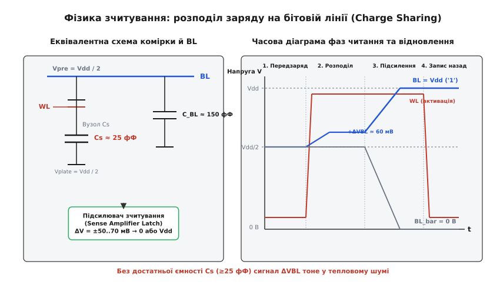
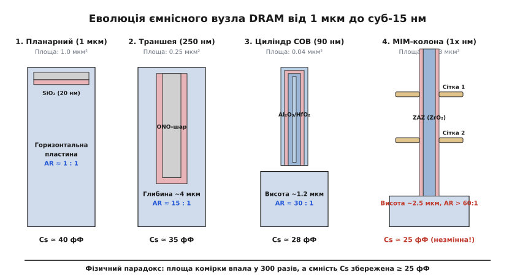
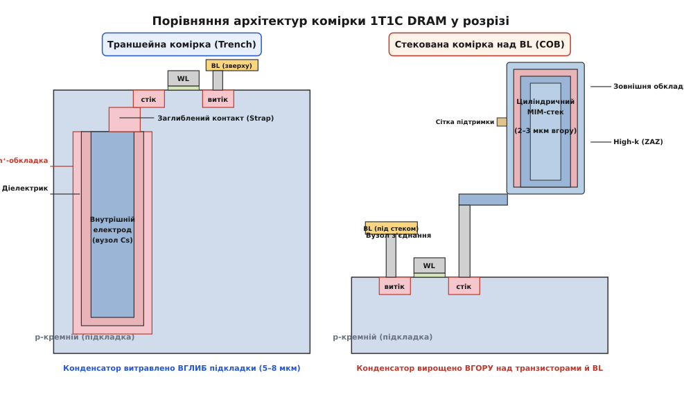
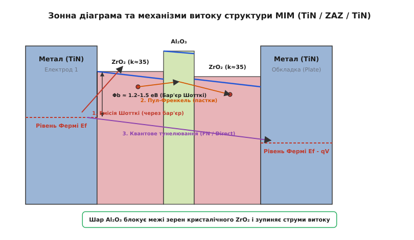

# Траншейний і стекований конденсатор DRAM

<preknowlist>
- [DRAM: транзистор і конденсатор](topic:hw-components/dram-cell) — базовий принцип комірки 1T1C, руйнівне зчитування та потреба в регенерації заряду.
- [Окислення, легування й травлення](topic:hw-components/doping-etching-metal) — реактивне іонне травлення кремнію та осадження діелектричних плівок.
- [Діелектрична проникність](topic:physics/dielectric-permittivity) — поляризація середовища, відносна проникність та ємність плоского конденсатора.
- [Робота виходу та зонна діаграма](topic:physics/work-function-contact-potential) — енергетичні бар'єри на межі металу й діелектрика.
</preknowlist>

Коли площа комірки динамічної пам'яті (1T1C DRAM) зменшується від 1.0 мкм² у вузлах мікронного масштабу до менш ніж 0.003 мкм² у сучасних технологічних процесах класу 10 нанометрів, площа горизонтальної проекції чіпа під один біт скорочується більш ніж у триста разів. Проте електрична ємність накопичувального конденсатора `C_s` не має права пропорційно зменшуватися: вона жорстко зафіксована на рівні щонайменше 25–30 фемтофарад (фФ, де `1 фФ = 10⁻¹⁵ Ф`). Якщо ємність впаде бодай до 10 фФ, диференціальний сигнал на бітовій лінії зменшиться нижче 30 мілівольт і потоне в тепловому шумі та технологічному розкиді транзисторів підсилювача зчитування, роблячи надійне збереження даних фізично неможливим. Щоб утримати фіксовану ємність на зникаюче малій ділянці кристала, мікроелектроніка відмовилася від плоских поверхонь і розгорнула конденсатор у тривимірний простір, створивши дві фундаментальні інженерні школи: траншейну та стековану.

### Парадокс стискання: чому ємність є константою

Необхідність збереження величини `C_s ≥ 25 фФ` диктується фізикою зчитування даних у масиві DRAM. У комірці 1T1C (один транзистор — один конденсатор) біт інформації зберігається як наявність або відсутність заряду `Q = C_s · V_cell`. Коли лінія слова активує затвор транзистора доступу, цей крихітний заряд виливається у довгу металеву бітову лінію (*Bitline*), до якої паралельно підімкнено сотні інших закритих комірок стовпця.


*Зліва: еквівалентна схема комірки DRAM, підімкненої до бітової лінії з паразитною ємністю C_BL і диференціального підсилювача зчитування. Справа: часова діаграма напруг — активація лінії слова WL перерозподіляє заряд, створюючи малий стрибок напруги ΔV_BL ≈ 60 мВ, який підсилювач лавиноподібно розгортає до повних рівнів живлення 0 В і V_DD.*

Бітова лінія має значну власну розподілену паразитну ємність `C_BL ≈ 120–200 фФ`, що складається з бар'єрної ємності p-n переходів витоків сотень транзисторів доступу та ємності металевого провідника відносно підкладки. Перед початком зчитування лінія передзаряджається до проміжного опорного потенціалу `V_pre = V_DD / 2`. Після відкриття транзистора заряд перерозподіляється між ємністю комірки `C_s` та паразитною ємністю `C_BL`. Корисний диференціальний стрибок напруги `ΔV_BL`, який з'являється на вході підсилювача зчитування, описується [фізикою розподілу заряду](topic:hw-components/trench-capacitor/math-charge-sharing.md):

```
ΔV_BL = ± (V_DD / 2) · (1 / (1 + C_BL / C_s))
```

При сучасній напрузі живлення ядра пам'яті `V_DD = 1.0 В` величина `V_DD / 2 = 500 мВ`. Оскільки бітова лінія збирає паразитні ємності сотень комірок, співвідношення `C_BL / C_s` зазвичай становить від `6 : 1` до `8 : 1`. При `C_s = 25 фФ` та `C_BL = 150 фФ` корисний стрибок напруги дорівнює:

```
ΔV_BL = 500 мВ ÷ (1 + 150 / 25) = 500 мВ ÷ 7 ≈ 71.4 мВ
```

Ці сімдесят мілівольт — увесь запас сигналу, на якому працює пам'ять. Підсилювач зчитування являє собою чутливий тригер на зустрічно увімкнених інверторах. Реальні транзистори цього тригера мають випадковий розкид порогових напруг `ΔV_th` через статистичні флуктуації кількості легуючих атомів у нанометровому каналі (*Random Dopant Fluctuation*, RDF). Похибка асиметрії підсилювача разом із перехресними наводками від сусідніх бітових ліній та тепловим шумом `√(k_B · T / C_BL)` утворює сумарний шумовий бар'єр амплітудою близько 50–60 мВ.

Для компенсації паразитних наводок від сусідніх стовпців застосовують архітектуру **складеної бітової лінії (*Folded Bitline*)** та просторове перехрещування провідників (*Bitline Twisting*). У такій схемі пряма лінія `BL` та комплементарна лінія `BL_bar` міняються місцями в середині масиву, завдяки чому ємнісні завади від сусідніх шин стають строго синфазними і повністю віднімаються диференціальним каскадом підсилювача.

Якщо ємність конденсатора `C_s` зменшиться бодай до `10 фФ`, відношення `C_BL / C_s` підскочить до 15, а корисний сигнал `ΔV_BL` впаде до `31 мВ` — тобто опиниться значно нижче рівня шумів. Підсилювач почне хаотично перекидатися в хибні стани. Отже, закон схемотехніки незмінний: зменшуючи фізичні розміри транзистора, інженери зобов'язані тримати `C_s ≥ 25–30 фФ` незмінною в кожному новому поколінні чіпів.

Крім того, ємність `C_s` визначає стійкість пам'яті до одиночних радіаційних збоїв (*Soft Error Rate*, SER). Космічні нейтрони та альфа-частинки з матеріалів корпусу генерують у кремнії пакети вільних носіїв. Критичний заряд перемикання комірки `Q_crit = C_s · (V_DD / 2)` при `C_s = 25 фФ` становить близько 12.5 фемтокулонів. Якщо ємність знизити нижче цієї межі, фонова іонізація почне масово спотворювати збережені біти.

### Геометрична пастка плоского конденсатора

Згадаймо класичну формулу плоского паралельного конденсатора:

```
C = ε_0 · ε_r · A / d
```
де `ε_0 = 8.854 · 10⁻¹² Ф/м` — електрична стала, `ε_r` — відносна діелектрична проникність матеріалу ізолятора, `A` — площа пластин, `d` — товщина діелектричного шару.

У вузлі 130 нм площа комірки DRAM становила близько `0.1 мкм²`, а площа горизонтальної ділянки під конденсатор — не більше `A ≈ 0.04 мкм² = 4 · 10⁻¹⁴ м²`. Якщо використати як діелектрик стандартний термічний діоксид кремнію (SiO₂, `ε_r ≈ 3.9`), то для отримання цільової ємності `C = 25 фФ` необхідна товщина діелектрика складе:

```
d = ε_0 · ε_r · A / C
= (8.854 · 10⁻¹² · 3.9 · 4 · 10⁻¹⁴) / (25 · 10⁻¹⁵)
≈ 5.5 · 10⁻¹¹ м = 0.055 нм
```

Величина `0.055 нм` — це половина радіуса окремого атома кремнію. Фізично такий шар неможливо створити, адже міжатомна відстань у кристалічній ґратці кремнію становить близько `0.235 нм`. Більше того, як тільки товщина плівки SiO₂ стає меншою за 2.0 нм, починає домінувати квантовомеханічне пряме тунелювання електронів крізь енергетичний бар'єр. Струм витоку зростає експоненційно і досягає тисяч ампер на квадратний сантиметр: такий «конденсатор» розряджається не за мілісекунди, а за частки наносекунди.


*Еволюція геометрії конденсатора DRAM: від простої горизонтальної пластини (1 мкм) через ранні траншеї в підкладці (250 нм) та циліндри над бітовою лінією (90 нм) до надтонких металевих колон з аспектним співвідношенням понад 60:1 і сітками механічної підтримки (1x нм).*

Вихід із цієї геометричної пастки існує лише один: згорнути площу `A` у вертикальний вимір. Щоб умістити необхідну площу поверхні на крихітному п'ятачку кремнію, конденсатор необхідно витягнути вгору або вирити вглиб, створивши 3D-структуру з гігантським аспектним співвідношенням (*Aspect Ratio*, AR — відношення висоти або глибини до поперечного діаметра отвору).

### Траншейний конденсатор: ємність у товщі кремнію

Першою зрілою відповіддю індустрії на кризу площі став **траншейний конденсатор** (*Trench Capacitor*, від англ. *trench* — «рів, траншея, шахта»). Цю архітектуру розробили й десятиліттями вдосконалювали корпорації IBM, Siemens (Infineon) та Toshiba.

Ідея полягає в тому, що конденсатор формується безпосередньо всередині монокристалічної кремнієвої підкладки p-типу ще до того, як на її поверхні будуть виготовлені транзистори доступу.


*Зліва: траншейна комірка — глибокий колодязь у кремнієвій підкладці (5–8 мкм) з дифузійною n⁺-обкладкою, діелектриком і центральним полікремнієвим електродом, з'єднаним із транзистором заглибленим контактом (Strap). Справа: стекована комірка (COB) — транзистор розміщено внизу, бітову лінію прокладено посередині, а над ними вирощено високий тонкостінний циліндричний MIM-конденсатор з діелектриком High-k і сіткою механічної фіксації.*

Технологічний цикл створення траншейної комірки складається з таких прецизійних фаз:
1. **Глибоке реактивне іонне травлення (*Deep Reactive Ion Etching*, DRIE):** крізь вікна жорсткої маски з нітриду кремнію в підкладці витравлюють вертикальну шахту глибиною 5–8 мкм при діаметрі всього 0.1–0.15 мкм (аспектне співвідношення від 40:1 до 60:1). Для травлення застосовують циклічний процес чергування фторувальних газів (SF₆) та пасиваційних полімерів (C₄F₈) — процес Боша (*Bosch Process*) — або кріогенне плазмове травлення в суміші SF₆/O₂ при температурах підкладки близько −110 °C, де пасивація бічних стінок відбувається за рахунок конденсації тонкого шару оксифториду кремнію SiOxFy.
2. **Формування заглибленої обкладки (*Buried Plate*):** крізь стінки нижньої частини траншеї проводять високотемпературну газову або твердофазну дифузію домішки n-типу (миш'яку або фосфору) у навколишній p-кремній. Для цього дно шахти заповнюють легованим миш'яковисто-силікатним склом (ASG) і проводять швидкий термічний відпал. Усі заглиблені обкладки сусідніх комірок зливаються в єдиний суцільний провідний шар n⁺-типу в глибині підкладки, який слугує спільною заземленою обкладкою всього масиву.
3. **Осадження діелектрика:** внутрішню поверхню шахти покривають тонким тришаровим діелектриком оксид-нітрид-оксид (ONO) або шаром High-k діелектрика.
4. **Заповнення центрального електрода:** траншею вщерть заповнюють полікристалічним кремнієм, сильно легованим фосфором (n⁺-poly), який утворює внутрішній ізольований вузол комірки.
5. **Комірний оксид (*Collar Oxide*):** у верхній частині траншеї (глибина 0–1 мкм) формують товстий шар діоксиду кремнію (близько 20–30 нм), щоб усунути паразитний вертикальний польовий транзистор уздовж бічної стінки траншеї між заглибленою обкладкою та поверхнею кристала.
6. **Заглиблений контакт (*Buried Strap*):** на поверхні бічної стінки траншеї створюють локальне вікно дифузії, крізь яке полікремній вузла зберігання електрично з'єднується з областю стоку планарного MOSFET-транзистора доступу шляхом твердофазного перерозподілу легуючої домішки.

Головна перевага траншейного підходу полягала в ідеальній плоскості поверхні пластини (*Planar Surface Topology*). Після заповнення й полірування траншей кремнієва пластина залишалася абсолютно гладкою. Це дозволяло формувати транзистори доступу, лінії слова й бітові лінії за допомогою оптичної літографії без спотворень фокусування, що було вирішальним фактором у 1990-х роках.

Проте при масштабуванні технологічних норм нижче 90 нм траншея вперлася в нездоланні фізичні обмеження:
- **Ефект RIE-затримки (*Aspect Ratio Dependent Etching*, ARDE):** на глибині понад 5 мкм швидкість травлення кремнію різко сповільнюється, оскільки нейтральні радикали плазми не встигають досягати дна через кнудсенівську дифузію у вузькому каналі, а іони втрачають енергію під час ковзних зіткнень зі стінками. Отвір звужується донизу, утворюючи конічну форму з малою площею.
- **Пробій підкладки (*Substrate Punchthrough*):** коли відстань між сусідніми траншеями скоротилася до менш ніж 60 нм, напруженість поля між їхніми заглибленими n⁺-обкладками спричинила паразитні струми витоку через збіднену p-підкладку, руйнуючи ізоляцію сусідніх бітів.
- **Конфлікт із мілкою ізоляцією (*Shallow Trench Isolation*, STI):** траншея вела безперервну боротьбу за площу підкладки з діелектричними ровами STI, необхідними для ізоляції активних областей транзисторів. Крім того, топологія траншейного масиву обмежувала мінімальний розмір комірки стандартом `8F²` (де `F` — мінімальний напівкрок літографії), що унеможливлювало перехід до надщільних схем `6F²`.

### Стекований конденсатор: хмарочоси над транзисторами

Паралельно розвивалася альтернативна концепція — **стекований конденсатор** (*Stacked Capacitor*, від англ. *stack* — «стос, штабель, колона»). У цій архітектурі конденсатор виноситься з кремнієвої підкладки вгору і вирощується у шарах міжрівневого діелектрика над площиною транзисторів і бітових ліній. Така топологія дістала назву **конденсатор над бітовою лінією** (*Capacitor Over Bitline*, COB).

Еволюція форми стекованого конденсатора пройшла кілька драматичних етапів:
1. **Простий плоский стек (Flat Stack):** горизонтальна пластина над затвором транзистора (працювала до норм 0.5 мкм).
2. **Ребристі та коробкові структури (Fin / Box):** електроди зі складними вертикальними ребрами для збільшення площі (покоління 0.35–0.25 мкм).
3. **Циліндричні та короноподібні структури (Cylinder / Crown):** порожнисті вертикальні тонкостінні металеві чаші (покоління 180–70 нм). Головний трюк циліндра полягає в тому, що діелектрик і зовнішня обкладка вкривають чашу як зсередини, так і ззовні, що подвоює робочу площу ємності без збільшення площі проекції комірки.
4. **Суцільні ультрависокі колони (Pillar / Pedestal):** монолітні тонкі металеві стовпчики висотою 2.0–2.8 мкм при діаметрі 20–30 нм (покоління 20 нм і нижче).

Стекована архітектура повністю звільняє кремнієву підкладку: вона використовується виключно для оптимізації високоякісних транзисторів доступу. Крім того, оскільки конденсатор формується наприкінці виробничого процесу, інженери отримали свободу застосовувати екзотичні метали та оксиди, несумісні з високотемпературним відпалом кремнію.

Технологічний процес виготовлення циліндричного стека починається зі створення товстого шару жертовного оксиду (BPSG або TEOS) висотою 2–3 мкм. У ньому витравлюють глибокі отвори, осаджують тонкий шар нижнього електрода (TiN), після чого жертовний оксид повністю видаляють вибірковим рідинним травленням у розчині фтороводневої кислоти (HF), залишаючи ліс відкритих стоячих металевих циліндрів. Вирівнювання шарів діелектрика здійснюють методом хіміко-механічного полірування (CMP), швидкість зняття матеріалу в якому підпорядковується закону Престона:

```
MRR = K_p · P · V
```
де `K_p` — коефіцієнт Престона, `P` — тиск полірувальної головки, `V` — лінійна швидкість обертання диска.

Проте зі зростанням висоти циліндрів виникла нова фізична небезпека: **механічний колапс від капілярних сил (*Capacitive Stiction / Pattern Collapse*)**. При аспектному співвідношенні понад 50:1 стовпчик висотою 2.5 мкм і товщиною 30 нм стає механічно гнучким, як тонка тростина. На етапі рідинного травлення жертовного оксиду та подальшого сушіння деіонізованою водою сили поверхневого натягу меніска рідини притягують сусідні стовпчики один до одного:

```
F_cap ∝ (2 · γ · cos θ) / d_gap
```
де `γ` — коефіцієнт поверхневого натягу води, `θ` — крайовий кут змочування, `d_gap` — відстань між циліндрами.

Сили меніска згинають ультратонкі циліндри, вони торкаються один одного й назавжди злипаються під дією сил Ван-дер-Ваальса, викликаючи коротке замикання між сусідніми бітами пам'яті.

Для подолання цієї проблеми застосовують два взаємодоповнюючі рішення:
- **Надкритичне сушіння діоксидом вуглецю (*Supercritical CO₂ Drying*):** рідкий CO₂ переводять у надкритичний стан при температурі `T_c = 31.1 °C` та тиску `P_c = 7.38 МПа`. У надкритичному стані межа фаз «рідина-газ» зникає, коефіцієнт поверхневого натягу стає рівним нулю, і капілярні сили повністю усуваються.
- **Сітки механічної підтримки (*Support Mesh / Supporter*):** на середній та верхній висоті масиву циліндрів формують горизонтальні перфоровані мембрани з нітриду кремнію (Si₃N₄) або аморфного вуглецю товщиною 20–40 нм. Ці горизонтальні балки зв'язують мільярди сусідніх вертикальних колон у єдиний жорсткий просторовий каркас, запобігаючи їхньому згинанню та злипанню під час рідинного очищення.

Детальний перебіг двадцятирічної технологічної війни та остаточний тріумф стекової концепції описано в [історії протистояння архітектур](topic:hw-components/trench-capacitor/hist-trench-vs-stacked.md).

### Діелектрична революція: від ONO до наноламінатів High-k

Збільшення висоти 3D-структур має межу механічної стійкості. Другим фундаментальним важелем підвищення ємності є перехід до матеріалів із надвисокою діелектричною проникністю — діелектриків **High-k** (де `k` — позначення відносної проникності `ε_r`).

Для стандартизованого порівняння різних діелектриків у мікроелектроніці використовують поняття **еквівалентної товщини оксиду** (*Equivalent Oxide Thickness*, EOT). EOT показує, яку товщину повинен мати шар діоксиду кремнію (SiO₂), щоб забезпечити таку саму ємність на одиницю площі, як даний шар High-k діелектрика фізичної товщини `d_highk`:

```
EOT = d_highk · (ε_SiO2 / ε_highk) = d_highk · (3.9 / ε_highk)
```

Чим вища діелектрична проникність `ε_highk`, тим товстішим фізично можна зробити шар `d_highk`, зберігаючи крихітний EOT (менше 0.5 нм) і повністю придушуючи прямий квантовий витік електронів.

| Матеріал діелектрика | Проникність `ε_r` (k) | Ширина забороненої зони `E_g` (еВ) | Зсув зони провідності `ΔE_c` до TiN (еВ) |
| :--- | :--- | :--- | :--- |
| **Діоксид кремнію (SiO₂)** | 3.9 | 8.9 | 3.1 |
| **Нітрид кремнію (Si₃N₄)** | 7.0 | 5.1 | 2.1 |
| **Оксид алюмінію (Al₂O₃)** | 9.0 | 8.8 | 2.8 |
| **Діоксид гафнію (HfO₂)** | 20–25 | 5.7 | 1.4 |
| **Діоксид цирконію (ZrO₂)** | 35–40 (тетрагональний) | 5.8 | 1.3 |
| **Титанат стронцію (SrTiO₃ / STO)** | 150–300 (перовськіт) | 3.2 | 0.2 |

Таблиця виявляє фундаментальний закон фізики твердого тіла: **чим вища діелектрична проникність матеріалу, тим вужчою є його заборонена зона `E_g`**. 

Вузька заборонена зона неминуче призводить до малого енергетичного зсуву зони провідності `ΔE_c` на межі контакту діелектрика з металевим електродом. Це знижує потенційний бар'єр Шотткі й провокує катастрофічне зростання струмів термоелектронного витоку. Саме через це надвисокопроникні перовськіти (SrTiO₃ та BaSrTiO₃), попри привабливий показник `k > 200`, не змогли замінити помірні діелектрики в масовому виробництві DRAM: при робочій температурі кристала +85 °C витік електронів через низький бар'єр `0.2 еВ` спустошує комірку за мікросекунди.

Оптимальним компромісом став тетрагональний діоксид цирконію (ZrO₂, `k ≈ 35–40`), однак у чистому вигляді він страждає від кристалізації під час технологічного відпалу. Межі кристалічних зерен слугують прямими каналами витоку струму.

Інженерним шедевром сучасної пам'яті стала структура **ZAZ — наноламінат ZrO₂ / Al₂O₃ / ZrO₂**.


*Зонна енергетична діаграма структури MIM: між електродами нітриду титану (TiN) розміщено наноламінат ZAZ. Центральний моноатомний шар Al_2O_3 створює високий внутрішній потенційний бар'єр і розриває межі кристалічних зерен ZrO_2, блокуючи емісію Шотткі, стрибкову провідність Пула-Френкеля та квантове тунелювання.*

У тришаровому сендвічі ZAZ між двома шарами ZrO₂ товщиною 3–4 нм вставляють ультратонкий шар аморфного Al₂O₃ товщиною всього 0.5–0.8 нм. Осадження ведуть методом атомно-пошарового осадження (ALD) з прекурсорів TEMAZ (для цирконію), триметилалюмінію TMA (для алюмінію) та озону O₃ або водяної пари H₂O як окислювача. Кінетика процесу контролюється кнудсенівською дифузією молекул прекурсорів у глибокі циліндри: тривалість імпульсу подачі газу вибирають пропорційно квадрату аспектного співвідношення `τ ∝ (H / D)²`, щоб забезпечити повне покриття стінок на дні.

Аморфний оксид алюмінію виконує дві критичні функції:
1. Фізично розриває ріст кристалічних зерен ZrO₂, перешкоджаючи утворенню наскрізних мікротріщин і меж зерен від одного електрода до іншого.
2. Стабілізує високопроникну тетрагональну кристалічну фазу ZrO₂, не дозволяючи їй перейти в низькопроникну моноклінну фазу (`k ≈ 18`).

Завдяки структурі ZAZ вдалося досягти фізичної товщини діелектрика близько 7–8 нм при еквівалентній товщині оксиду `EOT ≈ 0.45–0.55 нм` зі збереженням струму витоку нижче `10⁻¹⁵ А` на комірку.

### Металізація електродів: структури MIM (Metal-Insulator-Metal)

До покоління 90 нм обкладки конденсаторів виготовляли з сильно легованого полікристалічного кремнію (структури *Polysilicon-Insulator-Polysilicon*, PIP). Проте полікремній створив власний нездоланний фізичний бар'єр — **ефект збіднення полікремнію (*Polysilicon Depletion Effect*)**.

Полікристалічний кремній є напівпровідником із кінцевою концентрацією носіїв заряду. При прикладанні електричного поля біля поверхні контакту з діелектриком утворюється збіднений шар товщиною `d_depl ≈ 0.3–0.5 нм`, позбавлений вільних носіїв. Цей шар діє як додатковий послідовно увімкнений паразитний конденсатор малого номіналу:

```
1 / C_eff = 1 / C_diel + 1 / C_depl_top + 1 / C_depl_bot
```

Збіднення електродів додавало до еквівалентної товщини діелектрика майже `0.8 нм` паразитного EOT, що з'їдало понад 30% ефективної ємності комірки.

Вирішенням став перехід до структури **метал-діелектрик-метал** (*Metal-Insulator-Metal*, MIM). Метал має колосальну концентрацію вільних електронів (`n ∼ 10²² см⁻³`), тому товщина його екранування дорівнює нулю: ефект збіднення повністю зникає.

Стандартним металом обкладок став **нітрид титану (TiN)**, який осаджують методом атомно-пошарового осадження (ALD) за самообмежувальною хімічною реакцією тетрахлориду титану з аміаком при температурі 400–450 °C:

```
TiCl_4 + NH_3 → TiN + HCl (леткі продукти)
```

TiN має високу роботу виходу електронів `Φ_m ≈ 4.6–4.8 еВ`. Це створює високий бар'єр Шотткі `Φ_B ≈ 1.3–1.5 еВ` на межі з ZrO₂, що експоненційно придушує струм витоку електронів. У передових вузлах нанометрового класу внутрішній електрод модифікують благородними металами з ще більшою роботою виходу — рутенієм (Ru, `Φ_m ≈ 4.9 еВ`) або платиною (Pt, `Φ_m ≈ 5.6 еВ`).

Технологія ALD забезпечує 100% конформність (рівномірність товщини плівки) всередині вузьких циліндрів глибиною 2.5 мкм, де традиційне хімічне осадження (CVD) чи фізичне напилення (PVD) призводило б до закупорювання верхнього отвору й утворення порожнин.

### Фізика струмів витоку та вікно регенерації

Заряд, збережений у конденсаторі `C_s`, безупинно витікає через чотири паралельні канали:
1. **Емісія Шотткі (*Schottky Emission*):** термоемісія електронів із металевого електрода через енергетичний бар'єр у зону провідності High-k діелектрика під дією температури. Зниження бар'єру за рахунок сил дзеркального зображення становить `ΔΦ_B = √(q · E / (4 · π · ε_0 · ε_r))`.
2. **Емісія Пула-Френкеля (*Poole-Frenkel Emission*):** польова термічна іонізація електронів, захоплених на енергетичних пастках і дефектах кристалічної ґратки діелектрика. Зниження потенційної ями пастки в сильному полі дорівнює `ΔΦ_PF = √(q · E / (π · ε_0 · ε_r))`.
3. **Квантове тунелювання (*Fowler-Nordheim & Direct Tunneling*):** проходження електронів крізь звужений електричним полем трикутний або трапецієподібний бар'єр діелектрика.
4. **Витік транзистора доступу:** зворотний струм закритого p-n переходу витоку, підпороговий витік каналу MOSFET та витік, індукований полем затвора (*Gate-Induced Drain Leakage*, GIDL).

Максимально допустимий час утримання біта (*Retention Time, t_ret*) визначається співвідношенням:

```
t_ret = (C_s · ΔV_crit) / I_leak_total
```
де `ΔV_crit ≈ 0.2 В` — граничне падіння напруги, після якого зчитування стає ненадійним, а `I_leak_total` — сумарний струм усіх чотирьох механізмів.

За промисловим стандартом JEDEC період регенерації всієї пам'яті за нормальної температури становить `t_REFI = 64 мс`. Звідси максимально допустимий сумарний витік однієї комірки:

```
I_leak_max = (25 · 10⁻¹⁵ Ф · 0.2 В) / (64 · 10⁻³ с) ≈ 7.8 · 10⁻¹⁴ А = 78 фА
```

При підвищенні температури кристала до +85 °C або +95 °C (типовий нагрів у серверах і смартфонах під навантаженням) струми термоелектронної емісії Шотткі та витоки p-n переходів зростають за експоненційним законом `exp(-E_a / (k_B · T))`. Струм витоку зростає в рази. 

Саме тому контролер пам'яті зобов'язаний автоматично перемикатися на **подвоєну частоту регенерації (*2x Refresh Rate*)**, скорочуючи інтервал `t_REFI` з 64 мс до 32 мс, а при екстремальних температурах — до 16 мс. Без високої ємності `C_s ≥ 25 фФ` навіть подвоєння частоти не врятувало б біти від розпаду.

### Архітектурний підсумок і горизонт 3D DRAM

Історична дуель двох підходів завершилася повною перемогою стекованого MIM-конденсатора над бітовою лінією (COB).

Траншейна архітектура досягла фундаментального бар'єра на межі 70 нм, оскільки намагалася модифікувати сам монокристалічний кремній підкладки. Її погубила неможливість витравлювати отвори глибше 60:1 без руйнування кремнієвої ґратки та неможливість осаджувати передові наноламінати High-k на дно замкнених шахт.

Стекований конденсатор виграв завдяки модульності: він розв'язав термодинамічні бюджети транзисторів і конденсаторів у часі й просторі. Кремнієві транзистори формуються першими за високих температур (>1000 °C), а над ними в м'яких температурних умовах (<450 °C) вирощується багатоповерховий ліс із тонкостінних колон TiN / ZAZ / TiN.

Сьогодні стековані MIM-конденсатори досягли висоти майже 3 мкм при аспектному співвідношенні понад 70:1. Це абсолютна фізична межа класичного вертикального стека: подальше зростання висоти загрожує незворотним руйнуванням сіток підтримки та неможливістю дифузії газів-прекурсорів ALD.

Наступним кроком індустрії пам'яті стане перехід до **3D DRAM** — перенесення самої комірки 1T1C або безконденсаторної комірки 2T0C на основі оксидних напівпровідників (IGZO) у монолітну багатошарову структуру, де комірки будуть нашаровуватися поверхами одна над одною, подібно до сучасної 3D NAND флеш-пам'яті.

> 🔧 **Навіщо це.** Фізика конденсатора DRAM визначає реальні системні характеристики комп'ютерів. Величина ємності `C_s` та її витоки безпосередньо формують таймінги оперативної пам'яті: час активації рядка `tRCD`, час передзаряду `tRP` та тривалість циклу поновлення `tRFC`. Необхідність періодичної регенерації відбирає до 5–10% пропускної здатності шини пам'яті та генерує значне енергоспоживання в режимах очікування мобільних пристроїв. Розуміння температурної залежності струмів витоку High-k діелектриків пояснює, чому дата-центри витрачають гігавати енергії на охолодження пам'яті: підтримка температури чіпів нижче +85 °C дозволяє утримувати стандартний інтервал `tREFI = 64 мс`, запобігаючи деградації продуктивності через часте поновлення. Нарешті, саме паразитна ємність бітових ліній та витоки сусідніх комірок є фізичним першоджерелом уразливості *Rowhammer*, де багаторазова швидка активація сусіднього рядка слова прискорює стікання заряду з конденсаторів жертви.
