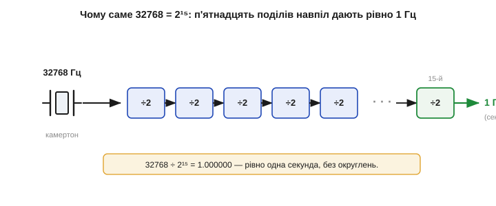
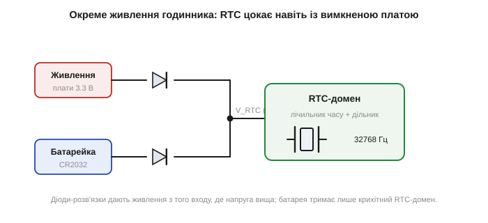

# Годинниковий кварц 32768 Гц і RTC

Серед усіх кварців є один особливий, що трапляється чи не в кожному пристрої з годинником: резонатор на **32768 Гц**. Це дивне на вигляд число — насправді найрозумніший вибір для відліку **реального часу**, а сам кварц і схема навколо нього влаштовані інакше, ніж мегагерцові «такти». Розберімося, чому саме 32768 і як на ньому будують годинник реального часу — **RTC** *(real-time clock)*.

### Чому саме 32768 = 2¹⁵

32768 — це рівно **2¹⁵**, два в п'ятнадцятому степені. У цьому й уся розгадка дивного числа. Годиннику потрібен сигнал з періодом рівно **одна секунда** — від нього він нарощує лічильник секунд, далі хвилин, годин, діб. Постає питання: як з частоти кварцу зробити рівно один тік на секунду? Найдешевший спосіб поділити частоту в цифровій схемі — **навпіл**: один тригер-лічильник (T-тригер) перемикається на кожному другому фронті входу й на виході дає рівно вдвічі нижчу частоту. Це коштує одного тригера й не вносить жодної похибки — поділ на 2 точний за самою природою.

Тепер поставимо такі тригери ланцюжком: кожен ділить навпіл те, що дав попередній. Після n тригерів частота поділиться на 2ⁿ. Скільки треба, щоб з 32768 Гц дістати 1 Гц? Рівно п'ятнадцять, бо 2¹⁵ = 32768. І тоді 32768 Гц, поділена на 2¹⁵, дає **точно 1.000000 Гц** — одну секунду без жодного округлення, самими лише поділами навпіл, без хитрої арифметики.


*Чому 32768 = 2¹⁵. Камертонний кварц дає 32768 Гц. Ланцюжок із п'ятнадцяти тригерів-дільників, кожен ділить частоту навпіл, перетворює її точно на 1 Гц — одну секунду. 32768 ÷ 2¹⁵ = 1.000000, без залишку. Будь-яке інше близьке число дало б дробову секунду.*

Тепер видно, чому не взяли «кругле» 30000 чи 50000 Гц. Поділ на двійки з 30000 ніколи не дасть цілого числа герц (30000/2¹⁴ = 1.83…), і щоб дістати секунду, довелося б ділити на 30000 спеціальним лічильником — дорожче, більше логіки, більше струму. А 2¹⁵ ділиться навпіл чисто п'ятнадцять разів — і весь дільник зводиться до простого ланцюжка тригерів.

Чому ж саме п'ятнадцятий степінь, а не, скажімо, 2¹⁰ (1024 Гц) чи 2²⁰ (понад мільйон)? Тут компроміс. З одного боку, частота має бути **достатньо низькою**, щоб споживання було крихітним: [CMOS-логіка споживає тим менше, чим рідше перемикається](topic:hw-digital/cmos), а годинник мусить цокати від маленької батарейки **роками** на одиницях мікроампер. З іншого — надто низька частота дала б завелику й крихку пластину та гірше Q. 32768 Гц (≈ 32.8 кГц) — золота середина: камертон такої частоти виходить мікроскопічним і добротним, а 15 поділів — небагато логіки. Тому ця частота й стала світовим стандартом годинникових кварців; її ще називають «watch crystal» чи просто «32k».

Варто оцінити й точність такого ділення. Поділ на 2 — ідеально точна операція: тригер не вносить ні крихти похибки, він лише рахує фронти. Тож **уся** похибка годинника походить винятково від самого кварцу — від того, наскільки 32768 Гц справді дорівнюють 32768 Гц. Дільник нічого не псує і нічого не виправляє. Це й добре (нема зайвих джерел похибки), і вимогливо: точність годинника цілком лягає на резонатор, тому до годинникового кварцу й висувають окремі вимоги щодо допуску й температурної кривої.

### Камертонний кристал у циліндрику

Годинниковий кварц і виглядає інакше, і коливається інакше за мегагерцовий. Щоб дістати таку низьку частоту, пластину довелося б зробити завеликою, тож кристал вирізають у формі крихітного **камертона** *(tuning fork)* — двозубої «виделки», зубці якої коливаються назустріч одне одному, точнісінько як зубці справжнього камертона. Розміри підібрано так, щоб власна частота цих коливань була рівно 32768 Гц. Цю мікроскопічну виделку запаковують у характерний маленький металевий **циліндрик** (корпус близько 2×6 мм), часто у вакуумі.

Чому саме виделка, а не пластина, як у мегагерцового кварцу? Бо частота зсуву по товщині (AT-зріз) обернено пропорційна товщині, і щоб дістати низькі 32 кГц, пластину довелося б зробити абсурдно товстою — кілька сантиметрів, що несумісно з годинником. А камертон коливається **згином зубців**, і його частота задається довжиною й товщиною зубців у зовсім інший спосіб: маленька виделка кількох міліметрів завдовжки якраз дає 32 кГц. Тобто форму обрали під частоту: для високих частот зручний тонкий зсув по товщині, для низьких — згинальний камертон. Тут добре видно, що **спосіб коливання** — повноцінний параметр конструкції, а не дрібниця.

Камертонна форма дає дуже високе Q при малих розмірах, але має й слабину: такий кристал **боїться перегріву й удару**. Тонкі зубці виделки крихкі — сильний удар може їх зламати, а надмірний нагрів при паянні псує кристал або зсуває частоту назавжди. Саме тому годинниковий кварц паяють обережно, коротким дотиком, а в даташиті на нього є окреме застереження про температуру й тривалість паяння — на відміну від звичайного [кварцового резонатора](topic:hw-components/crystal), до якого ставляться вільніше. Через крихкість камертона в техніці, що зазнає ударів, його часто замінюють на [ударостійкий MEMS чи кварцовий генератор у міцнішому виконанні](root:embedded/ceramic-mems-resonators).

Температурна крива камертонного кварцу теж інша, ніж в AT-зрізу. Вона не кубічна, а **параболічна** з максимумом (точкою повороту) близько 25 °C: частота найвища біля кімнатної температури й спадає **і на холоді, і на спеці**. Коефіцієнт — приблизно −0.035 ppm/°C² від точки повороту; тобто відхилення на 10 °C у будь-який бік дає ≈ −0.035 · 10² = −3.5 ppm. Звідси практичний наслідок: годинник на зап'ясті чи в теплій кишені йде трохи інакше, ніж на морозі. Цей параболічний хід легко скомпенсувати програмно, бо він простий і передбачуваний — багато RTC уміють підкручувати лічильник за виміряною температурою.

**Приклад (наскільки температура збиває годинник).** Годинниковий кварц із параболічним коефіцієнтом −0.035 ppm/°C² лежить на вулиці при 0 °C (відхилення 25 °C від точки повороту 25 °C).

```
Δf = −0.035 · (25)² = −0.035 · 625 ≈ −22 ppm
у секундах: 0.0864 · 22 ≈ 1.9 с/добу повільніше
```

Майже дві секунди на добу лише через холод — помітно для точного годинника, але цілком у межах звичайного побутового.

**Приклад (точність годинникового кварцу).** Типовий годинниковий кварц має допуск ±20 ppm за кімнатної температури. Скільки набіжить годинник за місяць?

```
за добу: 0.0864 · 20 = 1.73 с/добу
за 30 діб:            ≈ 52 с
```

Майже хвилина за місяць — звідси й знайома потреба час від часу підкручувати дешевий настінний годинник. Точніші годинники беруть кварц із меншим допуском, підстроюють CL або компенсують дрейф програмно.

### RTC і окреме живлення годинника

**RTC** — це вузол (окрема мікросхема або блок усередині мікроконтролера), що з 32768 Гц робить календарний час: секунди, хвилини, години, дату. Усередині — той самий [генератор П'єрса](topic:hw-analog/pierce-oscillator) на годинниковому кварці і ланцюжок дільників із лічильниками.

Зберігати час можна двома способами, і RTC трапляються обох ґатунків. Перший — **календарні регістри**: окремі лічильники секунд, хвилин, годин, днів, місяців, років, що самі перевертаються (60 секунд → +1 хвилина) і враховують високосні роки. Читати зручно — одразу готова дата. Другий — **єдиний лічильник секунд** від умовного «нуля епохи» (як Unix-час, де відлік іде від 1970 року): RTC просто нарощує одне велике число, а переведення в дату робить програма. Цей спосіб простіший у залізі (один лічильник замість семи) і зручний для арифметики з часом (різницю двох моментів знайти — просто відняти числа). Обидва підходи спираються на той самий тік 1 Гц із дільника; різниця лише в тому, як накопичену секунду подавати назовні.

Головна особливість RTC — **окреме живлення**. Годинник має йти безперервно, навіть коли пристрій вимкнено, знеструмлено чи лежить на полиці місяцями. Якби RTC живився від загального живлення плати, він би скидався при кожному вимкненні, і час доводилося б виставляти щоразу. Тому RTC-домен живлять від маленької **резервної батарейки** (класична монета CR2032 на 3 В) через схему перемикання живлення, що автоматично бере те джерело, де напруга вища. Поки плата ввімкнена, її живлення (зазвичай вище за батарейку) живить і RTC, а батарейку не чіпає взагалі — вона лежить незаймана; щойно основне живлення зникає, напруга на вузлі падає до батарейкової, і годинник безшумно, без перерви, переходить на батарейку. Зворотно — так само плавно. Цей вузол так і зветься: VBAT-домен, або back-up domain.


*Живлення RTC-домену. Основне живлення плати й резервна батарейка через розв'язку живлять вузол V_RTC — активним стає те джерело, що має вищу напругу. Поки плата ввімкнена, годинник живиться від неї; коли вимкнено — від батарейки. Крихітний RTC-домен (генератор 32768 Гц + лічильник) споживає так мало, що однієї батарейки вистачає на роки.*

Щоб цієї батарейки вистачало на роки, RTC-домен проєктують на **мікроскопічне споживання** — одиниці мікроампер. Цьому й допомагає низька частота 32768 Гц: рідкі перемикання CMOS-логіки означають крихітний струм. Прикинемо: батарейка CR2032 має ємність близько 220 мА·год; при споживанні RTC у 1 мкА її вистачить приблизно на 220 000 годин — понад 25 років (на практиці менше через саморозряд самої батарейки, але все одно роки). Звідси й уся логіка вибору, що зійшлася в одній деталі: низька частота → мала потужність → довге життя від батарейки; степінь двійки → проста й точна секунда; камертон → мізерні розміри. Кожне рішення в годинниковому кварці служить головній меті — цокати точно й майже задарма.

### Що дає RTC, крім секунд

Сучасний RTC — це не лише лічильник секунд. Над ланцюжком дільників надбудовано **календарну логіку**, що автоматично переводить накопичені секунди в хвилини, години, дні, місяці й роки, ураховуючи різну довжину місяців і **високосні роки**. Тому програмі не треба самій рахувати дати — вона просто читає з RTC готові «рік-місяць-день-година-хвилина-секунда». Крім того, RTC зазвичай уміє **будильники** (alarm): спрацювати в задану мить, розбудивши процесор зі сну, — це основа пристроїв, що сплять і прокидаються за розкладом. А ще в RTC-домені часто є кілька байтів **резервної пам'яті**, що теж живиться від батарейки й переживає вимкнення, — туди кладуть дрібні налаштування, які мають зберегтися.

Уся ця логіка теж живиться від крихітного струму VBAT-домену й працює на тих самих 32768 Гц. Тому годинниковий кварц — не просто «ще один [кварцовий резонатор](topic:hw-components/crystal)», а серце цілого автономного вузла, що живе власним життям, поки решта чипа спить або знеструмлена.

### Вбудований RTC чи окрема мікросхема

RTC буває у двох виконаннях, і вибір між ними — типова інженерна розвилка. Перший варіант — **вбудований** у мікроконтролер: окремий блок із власним живленням VBAT, до якого зовні чіпляють лише годинниковий кварц і резервну батарейку. Це дешево (нема окремого чипа) і компактно, тож так роблять найчастіше. Слабина — точність: вбудований RTC ділить турботи з рештою кристала, його кварцовий вузол не завжди ідеально розведений, та й температурної компенсації зазвичай нема.

Другий варіант — **окрема мікросхема RTC** на шині (типово I²C). У ній годинниковий кварц і вся логіка інтегровані разом, часто з кращим розведенням, а дорожчі моделі мають **вбудовану термокомпенсацію** (по суті мініатюрний [TCXO](root:embedded/tcxo-ocxo) для 32768 Гц) і дають одиниці ppm замість десятків — це вже годинник, що набігає секунди не за добу, а за місяці. Такі чипи беруть, коли точність часу справді важлива (логери, прилади обліку), або коли хочуть зняти турботу про кварц із головного процесора. Платіж — окремий компонент, місце на платі й лінії шини.

Розвилка тут знайома: дешевше й простіше (вбудований) проти точніше й надійніше (окремий чип). А спільне в обох — те саме серце на 32768 Гц і той самий принцип резервного живлення.

Те, як саме годинниковий кварц обвалив колись цілу швейцарську годинникову індустрію — окрема драматична історія ([📜 кварцова криза](topic:hw-components/watch-crystal-rtc/hist-quartz-crisis.md)).
