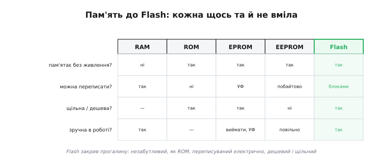
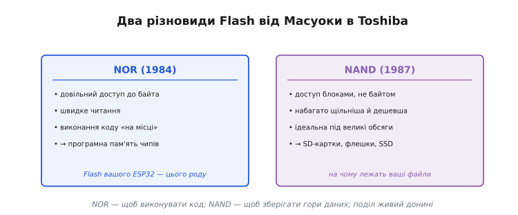
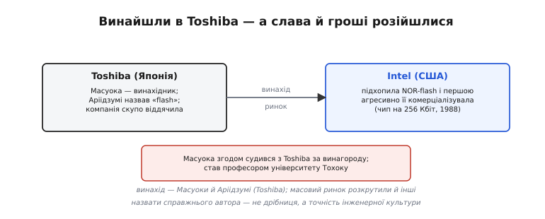

# 📜 Фудзіо Масуока і Flash: пам'ять, названа за спалахом

> Той Flash, у який лягає прошивка вашого ESP32 — і той, що в кожній флешці, SD-картці й SSD, — народився в одній голові й дістав ім'я через камеру. Це історія про японського інженера, чий прорив дав світові постійну пам'ять, і про те, як винахід і визнання розійшлися різними дорогами.

## Крихта, що пам'ятає все

Спиніться на мить і подумайте, скільки всього у вашому житті **пам'ятає** без живлення: телефон, що зберігає фото; флешка в кишені; SD-картка у фотоапараті; сама прошивка вашого ESP32, що чекає у Flash, поки ви ввімкнете плату. За всім цим — одна й та сама пам'ять, **Flash**, і один винахід, зроблений в Японії у 1980-х. Сьогодні він настільки всюдисущий, що його не помічають, як повітря. А колись такої пам'яті просто не існувало — і зробити її здавалося неможливим. Як же вона постала?

## Пам'ять, що не вміла всього одразу

На зорі мікроелектроніки з пам'яттю була прикра дилема. **RAM** — швидка й вільно переписувана, але **забуває** все, щойно зникає живлення. **ROM** — пам'ятає вічно, та її вміст зашитий **намертво** ще на заводі. Між цими полюсами тулилися компроміси, і кожен чимось муляв: **EPROM** можна було перепрограмувати, але стиралася вона **ультрафіолетом** крізь віконце — чіп доводилося виймати й класти під лампу на чверть години. **EEPROM** стиралася вже електрично, без лампи, — але **побайтово**, повільно, і коштувала дорого, бо кожна комірка несла зайву обв'язку.

*Кожен тип пам'яті чимось не вдовольняв. RAM забуває без живлення; ROM незмінна; EPROM стирається ультрафіолетом; EEPROM — електрично, але побайтово й дорого. Бракувало одного: швидко стиратися й переписуватися **електрично**, та ще й бути **щільною й дешевою**. Цю прогалину й закрив Flash.*

Особливо муляла EPROM. Її віконце з кварцу, крізь яке стирали ультрафіолетом, було не примхою дизайну, а **необхідністю** — і водночас постійним клопотом: щоб виправити один рядок коду, інженер мусив вийняти чіп із плати, покласти його під УФ-лампу на 15–20 хвилин, тоді запрограмувати наново й вставити назад. Ціла церемонія заради дрібної правки. А EEPROM, що цю церемонію скасовувала, була такою дорогою, що нею економили на кожному байті. Світ застряг між «дешево, але незручно» і «зручно, але дорого».

Інакше кажучи, світ потребував пам'яті, яка б поєднала несумісне: **незабутливість** ROM, **електричну** перезаписуваність EEPROM — і при цьому була б **щільною й дешевою**, як проста ROM. Здавалося, що так не буває. А тоді один інженер показав, що буває.

## Фудзіо Масуока в Toshiba

Цей інженер — **Фудзіо Масуока** (*Fujio Masuoka*, 舛岡 富士雄), що прийшов у японську **Toshiba** ще 1971 року й роками працював над пам'яттю. Його ідея, що визріла на початку 1980-х, була зухвало проста за духом: а що, як стирати не кожну комірку окремо (як у дорогій EEPROM), а **великими блоками одразу** — усе разом, одним рухом? Так зникає та сама зайва обв'язка довкола кожної комірки, що робила EEPROM дорогою й нещільною. Комірки можна пакувати **щільно**, як у дешевій ROM, — і все одно стирати їх **електрично**, без жодної ультрафіолетової лампи. Платою стало те, що стирати доводиться **гуртом**, цілим блоком, а не точково; але для більшості задач це виявилося чудовою угодою.

Варто знати й те, що шлях винаходу не був гладким **усередині** самої Toshiba. За багатьма свідченнями, керівництво не вважало Flash пріоритетом і не поспішало в нього вкладатися — Масуока працював над ним радше всупереч, ніж завдяки корпоративним планам, у час, вільний від «головних» проєктів. Це теж типова деталь історії проривів: по-справжньому нове часто визріває **збоку** від офіційних дорожніх карт, тримаючись на впертості однієї людини, яка бачить те, чого ще не бачать менеджери. І лише коли винахід довів себе, компанія взялася за нього всерйоз.

## NOR (1984) і NAND (1987): два різновиди

Масуока зробив не одну, а **дві** пам'яті, що й донині ділять між собою весь світ зберігання. Спершу, 1984 року, він представив **NOR-flash**: у ній до кожного байта є **довільний доступ**, читання швидке, і код можна **виконувати прямо з неї**, не переписуючи в RAM. А 1987-го — **NAND-flash**, де доступ іде не до байта, а до цілого **блоку**; зате комірки пакуються ще щільніше й коштують ще дешевше, тож NAND ідеальна під **великі обсяги** даних.

*Два різновиди від Масуоки. **NOR** — довільний доступ, швидке читання, виконання коду «на місці»: саме такий Flash тримає програму у вашому ESP32. **NAND** — доступ блоками, але набагато щільніша й дешевша: на ній лежать ваші файли — SD-картки, флешки, SSD. Поділ, заданий ще у 80-х, живий донині.*

Звідки взялися самі назви — **NOR** і **NAND**? Із того, як з'єднані комірки в масиві: їхня схема нагадує логічні вентилі **АБО-НЕ** (*NOR*) та **І-НЕ** (*NAND*) із цифрової логіки. У NOR-структурі комірки під'єднані так, що до кожної є прямий доступ, — звідси швидке читання й виконання «на місці». У NAND вони з'єднані **послідовно**, ланцюжком, як транзистори у вентилі І-НЕ, — це й дає вищу щільність, але змушує читати й стирати **групами**. Тобто навіть імена цих пам'ятей — родом із тієї самої цифрової логіки, що й увесь чіп.

Цей поділ — не історична дрібниця, а карта сьогодення. Коли ваш ESP32 виконує прошивку прямо з Flash (через [кеш в архітектурі ESP32](topic:hw-arch/esp32-architecture)), він спирається на **NOR**-рід пам'яті — той, що дозволяє виконання «на місці». А коли ви пишете файли на SD-картку чи носите дані на флешці — під ними **NAND**. Обидві лінії тягнуться прямо від тих доповідей Масуоки 1984 і 1987 років.

А як Flash взагалі **пам'ятає** біт без живлення? Серце кожної комірки — транзистор із **плаваючим затвором** (*floating gate*): крихітний острівець провідника, з усіх боків оточений ізолятором. Загнати в нього заряд (електрони) — і він там **застрягає**, бо тікати нікуди; так комірка зберігає свій стан **роками без жодного струму**. Наявність чи відсутність цього захопленого заряду й кодує нуль або одиницю. Запис — це заштовхати електрони в острівець, стирання — витягти їх назад (тим самим блоком). У цьому й уся незабутливість Flash: біт тримається не живленням, а **фізично замкненим зарядом**. Тонка механіка цього — окрема [внутрішня будова Flash](topic:hw-components/flash-internals); тут досить відчути красу ідеї — пам'ять, що тримає дані в пастці з електронів.

## Спалах камери: звідки назва

Лишалося дати винаходу ім'я — і тут історія робить свій найколоритніший поворот. Коли колега Масуоки, **Сьодзі Аріідзумі** (*Shōji Ariizumi*), побачив, як уся пам'ять стирається **миттєво, цілим блоком за один спалах** електричного імпульсу, йому це нагадало **спалах фотокамери**. Звідси й назва — **flash**. Образ виявився таким влучним, що пережив десятиліття: мільярди людей щодня кажуть «флешка», навіть не здогадуючись, що це відлуння враження одного інженера від фотоспалаху наприкінці 1980-х. Гарне ім'я — теж частина винаходу: воно прилипає, і річ із ним легше входить у світ.

## Хто зібрав плоди: винахід тут, нагорода деінде

А тепер — про несправедливість, заради якої цю історію варто розповісти повністю. Винахід стався в **Toshiba**, японській компанії, і авторство тут чисте: ідею й обидві пам'яті дав **Масуока**, ім'я — **Аріідзумі**. Та сама Toshiba, як часто буває з великими корпораціями, **недооцінила** свого винахідника: за прорив, що згодом приніс індустрії десятки мільярдів, інженер дістав, за переказами, мізерну винагороду й не надто стрімку кар'єру.

*Винахід — Масуоки й Аріідзумі в Toshiba. Та масовий ринок NOR-flash першою агресивно розкрутила американська **Intel** (чип на 256 Кбіт, 1988). А сам Масуока згодом **судився** з Toshiba за справедливу винагороду й пішов у науку — професором університету Тохоку. Класичний візерунок: винайшов тут — нагороду здобув деінде.*

Тим часом по інший бік океану за Flash вхопилася **Intel**: вона підхопила саме NOR-флеш і першою **агресивно її комерціалізувала**, випустивши 1988 року чип на 256 кілобітів, що швидко пішов у автомобілі, комп'ютери й масову техніку. Тобто **винайшли** Flash у Японії, а **ринок** значною мірою зняли інші, спритніші в комерції. А самому Масуоці, щоб домогтися визнання й справедливої винагороди, довелося згодом **судитися** з власною компанією. Цей конфлікт мав ширше тло: у Японії тих років патентний закон (стаття 35) визнавав за **інженером-співробітником** право на справедливу частку від винаходу, зробленого на роботі, — і саме на цю норму спиралися гучні позови винахідників проти роботодавців. Найвідоміший — справа Сюдзі **Накамури** (*Shuji Nakamura*) за синій світлодіод, де суд спершу присудив астрономічну компенсацію, а тоді сторони владнали спір на значно меншій сумі. Позов Масуоки був із тієї самої череди: суспільство поступово визнавало, що за корпоративним «ми винайшли» стоять **конкретні люди**, яким належить і слава, і частка плодів. Згодом Масуока пішов у науку, ставши професором університету **Тохоку**.

Тут варто бути справедливими в обидва боки, як велить чесна історія. Toshiba таки **створила** Flash — це її лабораторії, її ресурси, її люди; і применшувати роль компанії як середовища винаходу не варто. Intel **не вкрала** ідею — вона зробила свою, цілком реальну справу: перетворила лабораторний прорив на масовий продукт, а це теж важка й цінна робота. Та поряд із цими корпоративними заслугами не можна губити головного імені: **Flash придумав Масуока**, а назвав **Аріідзумі**. Назвати справжнього автора — не прискіпливість, а **точність**, якої вимагає інженерна культура; той самий візерунок «винайшов тут — нагороду здобув деінде» повторюється в історії електроніки знову й знову, і щоразу варто свідомо вертати належне тому, хто був першим.

А сам Масуока на минулих заслугах не спинився: у Тохоку він узявся за **тривимірну** Flash-пам'ять — спосіб складати комірки не лише в площині, а й угору, поверхами, щоб умістити ще більше в той самий клаптик кремнію (саме цей напрям нині й рухає галузь уперед). З роками прийшло й визнання: галузеві нагороди, місце в історії електроніки, шана як «батькові Flash». Пізнє — та все ж справедливе нагадування, що за кожним «компанія винайшла» стоїть жива людина з ім'ям.

## Чому Flash переміг — і дійшов до вас

Угода, яку запропонував Масуока, виявилася саме тією, якої прагнув світ: **електричне стирання блоками** прибрало і ультрафіолетову мороку EPROM, і дорожнечу EEPROM, лишивши щільність і дешевизну. Наслідки переросли будь-які сподівання. На NAND виросли **USB-флешки**, **SD-картки**, **SSD** — уся портативна пам'ять сучасності; на NOR — **програмна пам'ять** мікроконтролерів, та сама, у яку лягає прошивка. Без Flash не було б ані смартфона у вашій кишені, ані ESP32 на вашому столі: ваш код просто не мав би де надовго оселитися.

Іронія долі: попри скупість до винахідника, сама **Toshiba** зрештою стала одним зі **світових гігантів** NAND-пам'яті (згодом цей бізнес виокремився в компанію Kioxia), а спільно розроблена нею **SD-картка** заполонила планету. Flash виріс в індустрію на сотні мільярдів доларів — одну з найбільших у всій електроніці. Те, що починалося як спосіб зробити перезаписувану пам'ять дешевшою, перевернуло геть усе: від фотоапаратів і смартфонів до центрів обробки даних, де SSD витіснили механічні диски. Мало який винахід дав такий важіль на весь цифровий світ — і тим прикріше, як скромно подякували його авторові на старті.

Flash знайшов і своє постійне місце в **ієрархії пам'яті**. Згори — швидка, але дорога й забутлива RAM; знизу колись були лише повільні механічні диски. Flash сів акурат **посередині**: незабутливий, як диск, але без жодних рухомих частин, тихий, ударостійкий і набагато швидший. Ця ніша виявилася такою зручною, що Flash не просто заповнив її, а й заходився **витісняти сусідів** — спершу дискети й оптичні диски, тоді дедалі більше й жорсткі. Інженерна угода Масуоки, схоже, влучила в саму потребу обчислювального світу.

Один приклад вартий тисячі цифр. Flash зробив можливою **цифрову фотографію** в сучасному вигляді: знімки лягали вже не на плівку, а на крихітну перезаписувану картку, яку можна стерти й зняти наново тисячі разів. Плівкова індустрія, що панувала ціле століття, відступила за якихось десять років — і чималою мірою через те, що Масуока дав світові дешеву перезаписувану пам'ять. Те саме повторилося з музичними плеєрами, телефонами, відеокамерами: усюди, де доти крутилися стрічки чи диски, тихо оселився Flash.

І саме Flash остаточно **поховав** EPROM з її ультрафіолетовою церемонією: навіщо лампа й кварцове віконце, коли можна стерти й переписати електрично, прямо на платі, ще й дешевше? За якихось десятиліття та незручна пам'ять із віконцем майже зникла, а Flash став за умовчанням усюди, де треба зберігати «надовго, але з правом передумати».

Іскра, що нагадала Аріідзумі фотоспалах, обернулася на **бум**, який досі не вщухає — уже понад сорок років. І щоразу, коли ви прошиваєте чіп, зберігаєте калібрування в [NVS](topic:sys-fw/nvs) чи пишете файли на SD-картку, під усім цим — той самий винахід одного інженера з Toshiba, що відмовився вірити, ніби незабутлива пам'ять мусить бути або незмінною, або дорогою.

## Звідки в Flash усі його примхи

Ця історія — не лише шана авторові, а й **ключ** до вдачі самого Flash. Бо саме з того, **як** Масуока зробив його дешевим — стиранням **великими блоками**, — випливають усі його примхи: чому у Flash треба **спершу стерти, а тоді писати**; чому він [зношується](topic:sf-data/wear-leveling) від багатьох стирань; чому дрібний лічильник не можна безкарно оновлювати щосекунди. Усе це — прямі наслідки тієї давньої угоди «щільність і дешевизна ціною блочного стирання». Зрозумівши, **звідки** взялися правила Flash, легше прийняти їх як належне.
