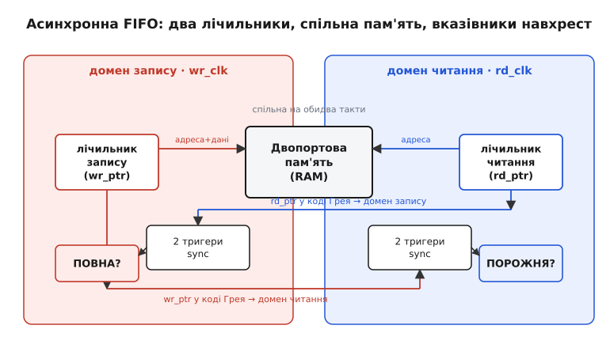
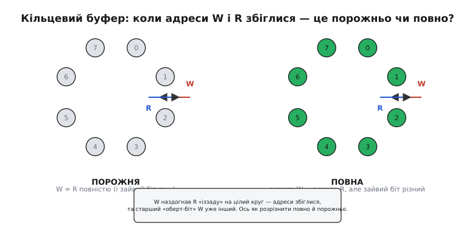
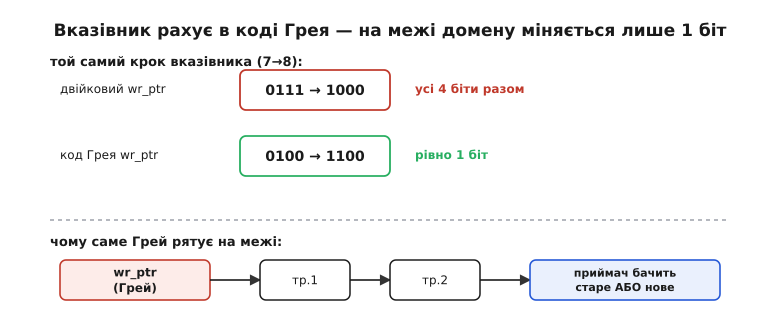

# Асинхронна черга FIFO

Два шматки цифрової схеми цокають кожен під свій кварц — процесор на 200 МГц, зовнішній АЦП на 40 МГц, — і між ними ллється безперервний потік даних. АЦП видає відлік за відліком у своєму ритмі; процесор забирає їх у своєму. Ритми не пов'язані: жоден не «знає», коли настане фронт другого. Як провести потік з одного такту в інший так, щоб не загубити й не задублювати жодного слова — і при цьому не змушувати сторони чекати одна на одну? Відповідь, до якої дійшла вся цифрова індустрія, — **асинхронна черга FIFO**.

FIFO — це англійська абревіатура *first in, first out*, «перший зайшов — перший вийшов»: черга, з якої дані виходять у тому самому порядку, у якому заходили, як черга людей у касу. «Асинхронна» означає, що її два кінці живуть під **різними, непов'язаними тактами**: пишемо в неї на одному ритмі, читаємо на іншому. Саме ця буферна черга розв'язує задачу передачі суцільного потоку через межу [тактових доменів](root:hw-digital/clock-domain-crossing) — там, де просте з'єднання дротів дає рідкісні нездоланні збої.

> 🔧 **Навіщо це.** Щойно у вашому пристрої зустрічаються два джерела такту — а це майже завжди: свій кварц у ядра, свій у радіомодуля, свій у давача, свій у USB — і між ними тече потік (аудіо, відлік давача, мережевий пакет), вам потрібна асинхронна FIFO. Вона стоїть у кожному мосту між шинами, на вході й виході кожного швидкого інтерфейсу, всередині майже кожної мікросхеми зв'язку. Зрозуміти її будову — значить перестати боятися найпідступнішого класу цифрових багів.

## Чому черга, а не пряме з'єднання

Почнімо з того, чому потік узагалі не можна просто «перекинути дротом». Усередині однієї тактової області панує сувора дисципліна: усі тригери защіпають дані за одним фронтом, а період такту підібрано так, щоб сигнали встигли застигнути задовго до наступного фронту. Тому дані там ніколи не міняються в небезпечну мить.

А на межі доменів ця домовленість зникає. Сигнал з першої області міняється за **її** ритмом, а тригер другої защіпає його за **своїм**. Рано чи пізно зміна припаде рівно на фронт приймача — у крихітне заборонене вікно навколо фронту, де вхід мусить стояти незмінно. Тоді тригер може зависнути в стані «ні нуль ні одиниця» на непередбачуваний час — це [метастабільність](root:hw-digital/metastability-timing), корінь усіх бід на межі. Для **одного** біта ліки відомі: два тригери поспіль, і ймовірність збою падає до століть напрацювання.

> Коротко про синхронізатор, бо на ньому все тримається. **Метастабільність** — це коли тригер, чий вхід змінився рівно на фронті такту, застрягає між рівнями «0» і «1» й «дзвенить» там випадковий час. Ліки для **одного біта** — [синхронізатор із двох тригерів](root:hw-digital/metastability-timing): перший приймає удар і має цілий період такту, щоб розв'язатися, перш ніж його зчитає другий. Ключове: він працює лише для **одного** біта.

Але потік — це не один біт. І тут ховається пастка, через яку наївне рішення провалюється. Дані ще півбіди — а от **скільки** їх у буфері, чи є що читати й чи є куди писати, ми знаємо лише через **лічильники**: скільки слів записано і скільки прочитано. Ці лічильники живуть у різних доменах, і кожній стороні треба бачити чужий, щоб вирішувати. А передати багатобітне число через межу побітно — не можна: біти проходять синхронізатори з різними випадковими затримками, один «приїде» на такті N, сусідній — на N+1, і приймач упіймає **мішанину** старих і нових бітів, число, якого ніколи не існувало. Уся хитрість асинхронної FIFO — саме в тому, як обійти цю пастку.

## Кільцевий буфер і два вказівники

В основі FIFO лежить проста ідея — **кільцевий буфер** (англ. *circular buffer*). Уявіть смужку однакових комірок пам'яті, скручену в кільце: комірки 0, 1, 2, … , N−1, а після останньої знову йде нульова. Пишемо по колу, читаємо по колу, і місце ніколи не закінчується — лічильники просто оббігають кільце знову й знову.

Хто куди пише й читає, задають два **вказівники** (англ. *pointer* — «показник») — насправді це звичайні лічильники адрес:

- **вказівник запису** (`wr_ptr`) — номер комірки, куди ляже наступне слово; живе в домені запису й збільшується на кожен запис;
- **вказівник читання** (`rd_ptr`) — номер комірки, звідки візьметься наступне слово; живе в домені читання й збільшується на кожне читання.

Дані лежать у [двопортовій пам'яті](root:hw-digital/dual-port-ram) — такій, що має окремий порт для запису й окремий для читання, тож обидві сторони працюють із нею одночасно, кожна під своїм тактом, не заважаючи одна одній. Порт запису адресується вказівником запису, порт читання — вказівником читання.


*Серце асинхронної FIFO. Кожен домен має свій вказівник-лічильник, обидва адресують спільну двопортову пам'ять. Щоб порахувати прапорці, кожен вказівник у коді Грея переводять синхронізатором у **чужий** домен: там його порівнюють із місцевим вказівником. Праворуч народжується «порожня», ліворуч — «повна».*

Уся робота черги зводиться до двох питань, на які треба відповідати щотакту: чи є що **читати** (буфер не порожній) і чи є куди **писати** (буфер не повний). Обидва — це порівняння двох вказівників. І обидва впираються в те, що вказівники живуть у різних доменах.

## Порожньо, повно й зайвий біт

Найтонше місце всієї конструкції — розрізнити **порожній** буфер і **повний**. Коли `wr_ptr` наздогнав `rd_ptr` — читати нічого, буфер порожній. Коли `wr_ptr` обійшов кільце й **знову** зрівнявся з `rd_ptr` ззаду — писати нікуди, буфер повний. Проблема очевидна: в обох випадках обидва вказівники показують на **ту саму комірку**. Як їх відрізнити?

Розв'язок гарний своєю простотою: додати вказівникам **один зайвий старший біт** понад те, що потрібно для адресування. Для буфера на 8 комірок адреси досить трьох бітів (0…7), а вказівник роблять **чотирибітним**. Молодші три біти — це адреса в пам'яті; старший, зайвий, — це лічильник «обертів» кільця: він перемикається щоразу, коли вказівник проходить повне коло.

Тепер обидва стани розрізняються чисто:

```
ПОРОЖНЯ:  wr_ptr == rd_ptr  повністю (усі 4 біти, зайвий теж)
ПОВНА:    адреси рівні (молодші 3 біти),  але зайвий біт РІЗНИЙ
```

Логіка проста й точна. Якщо всі чотири біти збіглися — вказівники стоять на одній комірці **на одному оберті**: між ними не записано нічого, буфер порожній. Якщо збіглися лише адреси, а старший «оберт-біт» різний — це означає, що вказівник запису пройшов **на один повний круг більше**, ніж вказівник читання: він наздогнав читання ззаду, все кільце заповнене.


*Ліворуч: W і R показують на ту саму комірку й збігаються **повністю** — черга порожня, читати нічого. Праворуч: адреси теж однакові, але W зробив на один оберт кільця більше — його зайвий старший біт інший — тож кільце заповнене вщент. Один-єдиний додатковий біт вказівника й розрізняє ці дві дзеркальні ситуації.*

## Код Грея: щоб вказівник пережив межу

Лишилося головне. Щоб порахувати «порожньо», домен читання мусить порівняти свій `rd_ptr` із `wr_ptr` **із чужого домену**. Щоб порахувати «повно», домен запису мусить бачити `rd_ptr` із чужого домену. Тобто кожен вказівник — багатобітне число — доводиться **проводити через межу**. А ми щойно бачили: багатобітне число не можна синхронізувати побітно, бо на переході, де міняється кілька бітів, приймач упіймає неможливу мішанину.

Порятунок — рахувати вказівники не у звичайному двійковому, а в [коді Грея](root:hw-digital/gray-code) (англ. *Gray code*, на честь Френка Грея з Bell Labs). Це такий спосіб нумерації, де між будь-якими двома сусідніми значеннями міняється **рівно один біт**. Лічильник, що йде в коді Грея, ніколи не перемикає два біти за раз.

І це вмить розв'язує пастку. Вказівник змінюється **по одному кроку** за раз — плюс одна комірка на запис. А якщо на кожному кроці міняється лише один біт, то навіть коли приймач упіймає точнісінько мить переходу, той єдиний біт дасть або старе значення, або нове — **проміжного просто немає чому виникнути**. Мішанина була б можлива лише за одночасної зміни кількох бітів; у коді Грея їх ніколи не міняється більш ніж один.


*Той самий крок вказівника 7→8. У двійковому це 0111→1000 — усі чотири біти разом, класичне джерело сміття на межі. У коді Грея це 0100→1100 — міняється рівно один старший біт. Тому вказівник у коді Грея можна спокійно вести крізь звичайний двотригерний синхронізатор: приймач завжди зчитає або повністю старе, або повністю нове число, ніколи нічого третього.*

Ось повна картина роботи. Кожен вказівник усередині свого домену рахують у коді Грея. Далі його чотири біти проводять через двотригерний синхронізатор у чужий домен — і хоч синхронізатори спрацьовують із різними затримками, це вже не шкодить: міняється лише один біт, тож будь-яка комбінація на виході — це або старе значення вказівника, або нове, обидва **коректні**. У чужому домені синхронізований вказівник порівнюють із місцевим і дістають прапорець. Порожньо рахують у домені читання (свіжий `rd_ptr` проти синхронізованого `wr_ptr`), повно — у домені запису (свіжий `wr_ptr` проти синхронізованого `rd_ptr`).

Тут ховається дрібна, але важлива несиметрія, і вона робить конструкцію **безпечною за побудовою**. Синхронізований вказівник завжди трохи **застарілий** — він відстає на такт-два, поки повзе крізь тригери. Але відстає він у безпечний бік. Домен читання бачить `wr_ptr` трохи меншим, ніж насправді, — тобто вважає, що даних менше, ніж є. У найгіршому разі він на такт-два **зарано** оголосить «порожньо» й пропустить читання, але **ніколи не прочитає з порожнього** буфера. Дзеркально домен запису бачить `rd_ptr` застарілим, вважає буфер повнішим, ніж є, тож у найгіршому разі **зарано** скаже «повно» — але **ніколи не запише в повний**. Помилка завжди консервативна: черга радше здасться трохи меншою, ніж є, але цілісності не втратить ніколи.

> 🔧 **Навіщо це.** Ця несиметрія — не академічна тонкість, а практична гарантія, на яку ви спираєтесь. Вам **не треба** ловити граничні такти й хвилюватися, чи не прослизне зайве читання: сама будова FIFO виключає читання з порожнього й запис у повний. Ви лише перевіряєте прапорці `empty` та `full` перед кожним доступом — а решту робить консервативне запізнення синхронізатора. Ось чому асинхронна FIFO — це не «ще один буфер», а перевірений будівельний блок, якому довіряють мости шин у кремнії.

Це і є класична конструкція, яку в цифровій техніці вважають стандартною. Її канон заклав інженер [Кліффорд Каммінгс у праці 2002 року](root:hw-digital/async-fifo/hist-cummings-fifo.md), і відтоді майже кожна асинхронна FIFO — від навчального прикладу до промислового моста — будується саме так: кільцевий буфер, вказівники із зайвим бітом, код Грея й двотригерні синхронізатори.

## Як це виглядає у прошивці

FPGA й спеціалізовані мікросхеми будують таку FIFO прямо в залізі. Але з боку процесора ви часто маєте справу з **готовою** апаратною FIFO — усередині UART, SPI, контролера Ethernet, аудіокодека, — і працюєте з нею через регістри. Логіка коду щоразу однакова: перш ніж читати, спитай апаратуру, чи є дані; перш ніж писати, спитай, чи є місце. Саме прапорці `empty`/`full`, які так ретельно рахує залізо, ви й читаєте.

**Умова: читаємо приймальну FIFO UART, лише коли вона не порожня.** Апаратура UART уже провела дані з ефірного такту у ваш системний такт через внутрішню чергу; ваша справа — забрати їх, не намагаючись читати з порожньої.

```c
#define UART_SR    (*(volatile uint32_t*)0x40011000)  // регістр стану
#define UART_DR    (*(volatile uint32_t*)0x40011004)  // регістр даних
#define SR_RXNE    (1u << 5)   // RX FIFO не порожня: є що читати
#define SR_TXFF    (1u << 7)   // TX FIFO повна: писати нікуди

// Забрати все, що встигло накопичитись у приймальній черзі.
void uart_drain_rx(uint8_t *buf, uint32_t cap, uint32_t *len)
{
    uint32_t n = 0;
    // Поки прапорець «не порожня» стоїть — черга віддає слово за словом.
    while ((UART_SR & SR_RXNE) && n < cap) {
        buf[n++] = (uint8_t)UART_DR;   // читання DR зсуває rd_ptr у залізі
    }
    *len = n;
}
```

Зверніть увагу: ми **жодного разу** не рахуємо самі вказівники й не думаємо про код Грея — усе це заховане в мікросхемі. Назовні стирчить один прапорець `RXNE` («приймальна черга не порожня»), і вся дисципліна зводиться до `while (не порожня) читай`. Це і є сенс FIFO як будівельного блоку: складність перетину доменів схована всередині, а користувачеві лишається просте питання «є що взяти?».

**Умова: віддаємо потік у передавальну FIFO, не переповнюючи її.** Дзеркальний бік — запис. Черга передавача має свій прапорець «повна»; поки він не піднявся, можна класти наступне слово.

```c
// Віддати блок у передавальну чергу UART, поважаючи прапорець «повна».
void uart_push_tx(const uint8_t *buf, uint32_t len)
{
    for (uint32_t i = 0; i < len; ) {
        if (UART_SR & SR_TXFF)
            continue;              // черга повна — чекаємо, поки залізо звільнить місце
        UART_DR = buf[i++];        // запис DR зсуває wr_ptr у залізі
    }
}
```

Тут `continue` крутиться доти, доки апаратна FIFO не віддасть у ефір чергове слово й не звільнить місце — тобто доки вказівник читання **всередині заліза** не зрушить і прапорець «повна» не впаде. Ми знову спираємося на консервативну гарантію: поки прапорець `TXFF` стоїть, писати не можна, і залізо цього не дозволить зіпсувати. Якщо ж потрібна власна FIFO між двома вашими програмними потоками під різними перериваннями, [її нескладно скласти в коді](root:hw-digital/async-fifo/proj-ring-buffer.md) на тому самому кільцевому буфері з двома індексами.

Так замикається коло. Ідея першою-зайшов-першою-вийшов, кільце комірок, два лічильники із зайвим бітом і код Грея на межі — усе це разом перетворює найпідступніший стик двох тактів на надійний, майже нудний у користуванні будівельний блок. І хоч би на якому рівні ви з ним стрічались — розписуючи регістри FPGA чи просто читаючи `RXNE` в прошивці, — усередині працює та сама струнка конструкція.
