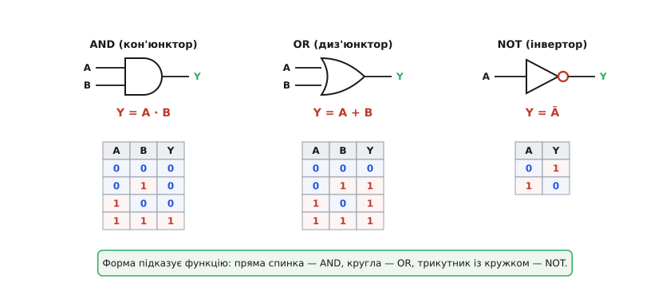
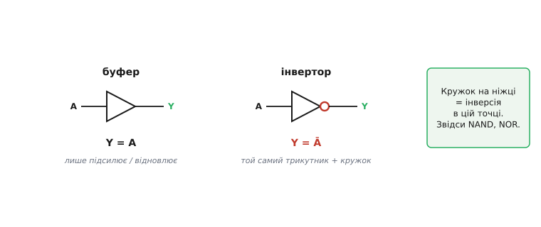
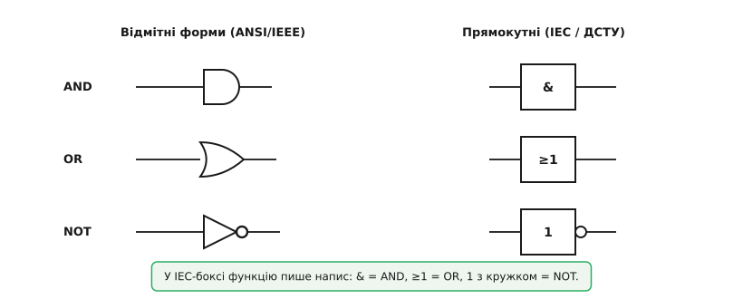
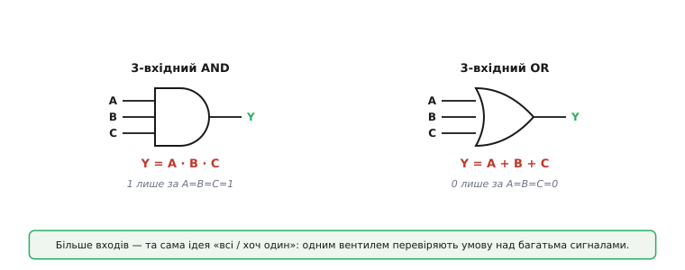
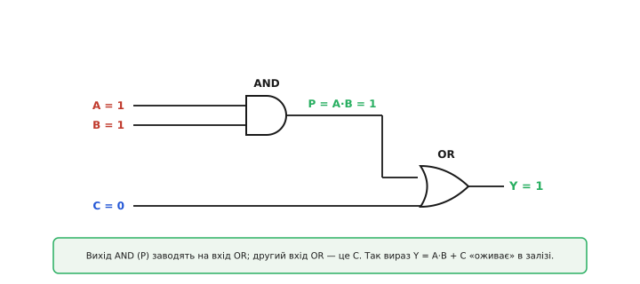
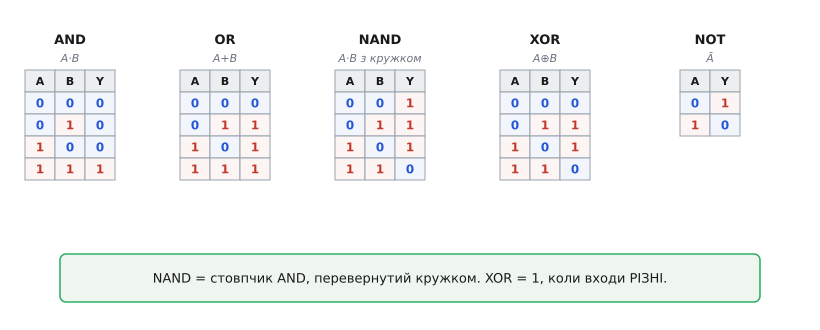

# Базові вентилі

Операції [«і», «або», «не» булевої алгебри](root:math-logic/boolean-algebra) живуть на папері — як абстрактні дії над 0 і 1. Дамо їм фізичне тіло. **Вентиль** (англ. *gate* — «ворота, заслінка») — це реальний електронний елемент (усередині — [кілька транзисторів](root:hw-digital/cmos-gate)), що **виконує** одну булеву операцію: бере на входи [логічні рівні (0 і 1 у вигляді діапазонів напруг)](root:hw-digital/logic-levels-as-ranges) і видає на вихід результат. Кожна операція Буля має свій **схемний символ**, і вся цифрова техніка малюється цими символами, як речення — літерами.

### Вентиль — це операція з тілом

Три основні символи невипадкові: форма **сама підказує** функцію, тож досвідчене око читає схему, не вчитуючись у підписи.


*Три вентилі у відмітних формах. **AND** (кон'юнктор, від лат. *coniunctio* — сполучення) — пряма «спинка» й округлий ніс; Y = A·B. **OR** (диз'юнктор, від лат. *disiunctio* — роз'єднання) — увігнута спинка й гострий ніс; Y = A+B. **NOT** (інвертор, від лат. *invertere* — перевертати) — трикутник із кружком на виході; Y = Ā. Входи зліва, вихід справа. Під кожним символом — його таблиця істинності.*

Форма прив'язується до сенсу. **AND** має рівну спинку: щоб на виході зійшлася одиниця, треба, щоб «усе» зійшлося на входах — строга пряма лінія. **OR** має округлу спинку, ніби «вбирає» сигнали з боків: досить одного, і вихід уже 1. **NOT** — гострий трикутник із характерним **кружком**, що й позначає перевертання. Назви двомовні: український кон'юнктор / диз'юнктор / інвертор поряд з англійським AND / OR / NOT — обидва набори трапляються в літературі.

### Кружок означає інверсію; буфер

Маленький **кружок** на виході інвертора — не прикраса, а повноцінний знак, і його варто засвоїти окремо, бо він буде всюди. **Кружок (бульбашка) у будь-якій точці символа означає «тут перевернути» (інверсія).** Зітри кружок з інвертора — лишиться просто трикутник, що нічого не перевертає.


*Трикутник **без** кружка — це **буфер** (англ. *buffer* — «прокладка, підсилювач»): Y = A, логіки він не змінює. Трикутник **із** кружком — **інвертор**: Y = Ā. Загальне правило: кружок на ніжці = інверсія в цій точці — звідси й виростають [NAND і NOR](root:hw-digital/nand-nor).*

Буфер варто оцінити окремо: навіщо вентиль, чий вихід дорівнює входу? А ось навіщо. Реальний сигнал слабне, [його фронт стає пологим](root:hw-digital/edges-rise-time), один вихід не тягне багато входів. Буфер **освіжає** логічний рівень — видає чисті, повносилі 0 чи 1 з крутим фронтом, здатні керувати десятками наступних входів. Це «підсилювач для цифри»: логіки не додає, зате відновлює якість сигналу. А кружок-інверсія — універсальний модифікатор: домалюй його на виході AND — дістанеш NAND, на виході OR — NOR.

### Два стандарти символів

Тут чесно попередимо про джерело плутанини: символи вентилів існують у **двох** стандартах, і обидва трапляються в схемах та даташитах.


*Ліворуч — **відмітні форми** (стандарт ANSI/IEEE, поширений у США й серед аматорів): різні фігури для різних вентилів. Праворуч — **прямокутні** символи (стандарт IEC 60617, він же ДСТУ, поширений в Європі й офіційній документації): однаковий прямокутник, а функцію пише **напис** усередині — «&» це AND, «≥1» це OR (бо вихід 1, коли на вході одиниць ≥ 1), «1» з кружком це NOT.*

Користуватися будемо переважно **відмітними формами** — вони наочніші для навчання й найпоширеніші в аматорських схемах. Та знати IEC-позначення теж треба: європейський даташит чи стара пострадянська схема покаже саме прямокутники з «&» і «≥1». Те саме поняття записують двома нотаціями — і впізнавати варто **обидві**.

### Багатовхідні вентилі

Два входи — звичний випадок, але не межа. AND і OR бувають на **3, 4, 8 і більше** входів, і правило лишається тим самим, лише поширеним на всі входи.


*У **3-вхідного AND** Y = A·B·C: вихід 1 **лише** тоді, коли всі три входи 1 (досить одному нулю — і вихід 0). У **3-вхідного OR** Y = A+B+C: вихід 0 **лише** коли всі три 0 (досить одній одиниці — і вихід 1). Кількість входів називають *fan-in* (англ. «вхідне віяння»); вона буває 2, 3, 4, 8…*

На практиці це зручно: щоб перевірити «чи всі вісім давачів справні», беруть один 8-вхідний AND, а не сім окремих. А якщо потрібного числа входів немає в наявності, його **складають** із менших — два 2-вхідні AND послідовно дають 3-вхідний. Складати вентилі один з одного і є головне вміння.

### З'єднуємо вентилі у вираз

Уся сила вентилів розкривається, коли **вихід одного стає входом іншого**. Так із кількох простих елементів складають будь-який, скільки завгодно складний вираз — точнісінько як [у булевій алгебрі](root:math-logic/boolean-algebra) функції складають з операцій.


*Реалізація виразу Y = A·B + C двома вентилями. Спершу AND обчислює проміжний сигнал P = A·B; його вихід заводять на вхід OR, другим входом якого є C. Вихід OR і є Y = P + C = A·B + C. Підпис на проміжному дроті показує сигнал P — корисна звичка підписувати «внутрішні» вузли.*

Уміння «прогнати» 0 і 1 крізь схему, вентиль за вентилем, — найважливіша практична навичка тут. Подамо на цю схему A = 1, B = 1, C = 0 і простежмо сигнал:

```
крок 1 (AND):  P = A · B = 1 · 1 = 1
крок 2 (OR):   Y = P + C = 1 + 0 = 1
```

А для A = 1, B = 0, C = 0:

```
крок 1 (AND):  P = A · B = 1 · 0 = 0
крок 2 (OR):   Y = P + C = 0 + 0 = 0
```

Саме так читають будь-яку логічну схему: від входів до виходу, обчислюючи сигнал на кожному дроті. І саме так — з'єднуючи виходи зі входами — складають [суматори, мультиплексори й решту комбінаційних блоків](root:hw-digital/combinational-circuits), з яких збудовано процесор.

### П'ять таблиць істинності

Поведінку вентиля повністю задає його **таблиця істинності** — перелік усіх комбінацій входів і виходу на кожну. Двовхідний вентиль має чотири рядки (2² комбінації), одновхідний — два. Зберімо разом п'ять, які треба знати напам'ять.


*П'ять базових таблиць. **AND** дає 1 лише на рядку «1 1». **OR** дає 0 лише на «0 0». **NAND** — це AND із кружком: його стовпчик Y дослівно перевернутий проти AND. **XOR** (англ. *exclusive or* — «виключне або») дає 1, коли входи **різні**. **NOT** перевертає єдиний вхід.*

**Worked-приклад: п'ять виходів на однакові входи A = 1, B = 0.** Підставмо одну пару входів у кожну операцію й порахуймо:

```
AND:   Y = A · B        = 1 · 0   = 0       // обидва? ні   → 0
OR:    Y = A + B        = 1 + 0   = 1       // хоч один? так → 1
NAND:  Y = NOT(A · B)   = NOT(0)  = 1       // AND, тоді кружок
XOR:   Y = A ⊕ B        = 1 ⊕ 0   = 1       // різні? так   → 1
NOT:   Y = NOT(A)       = NOT(1)  = 0       // лише вхід A
```

Видно, як кружок працює механічно: NAND спершу рахує AND (тут 0), а потім перевертає (стає 1). XOR збігся з OR на цій парі, але вони різні: на парі «1 1» OR дає 1, а XOR — 0, бо входи однакові. Ось чому XOR ще звуть «детектором різниці»: він каже, **чи відрізняються** два біти.

Зв'язок NAND і NOR з AND і OR — не випадковий збіг, а **закони де Морґана** (англ. *De Morgan's laws*). Британський математик Оґастес де Морґан (Augustus De Morgan, 1806–1871) сформулював їх 1847 року у книжці *Formal Logic*, що вийшла майже того самого дня, що й праця Джорджа Буля про алгебру логіки; саму ідею знали й раніше — ще Арістотель і середньовічні логіки. Словами законів: «не (A і B)» дорівнює «не-A або не-B», а «не (A або B)» дорівнює «не-A і не-B». У символах:

```
NOT(A · B) = NOT(A) + NOT(B)     // інверсія AND — це OR інверсій
NOT(A + B) = NOT(A) · NOT(B)     // інверсія OR  — це AND інверсій
```

> 🔧 **Навіщо це.** Де Морґан — щоденний інструмент, а не теорія. По-перше, він дає змогу будувати будь-яку логіку **на самих NAND** (або самих NOR): саме тому ці два вентилі звуть універсальними, і саме їх кладуть у кремній. По-друге, у коді він рятує від помилок: умову `!(a && b)` сміливо переписуй як `!a || !b` — поведінка та сама, а читати легше.

> 🔧 **Навіщо це.** Ці символи — алфавіт, яким написані **всі** цифрові схеми: від найпростішого модуля до даташита мікроконтролера. Навчившись упізнавати форму (пряма спинка — AND, кругла — OR, трикутник із кружком — NOT) і простежувати 0 і 1 крізь з'єднання, ти читатимеш логічну частину будь-якої схеми так само вільно, як текст. А кружок-інверсія — той дрібний знак, що відрізняє AND від [NAND](root:hw-digital/nand-nor) і часто ховає всю «родзинку» схеми: проґавиш кружок — і переплутаєш функцію на протилежну.
