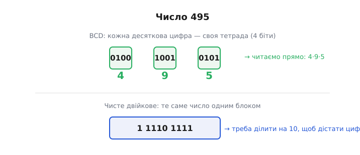
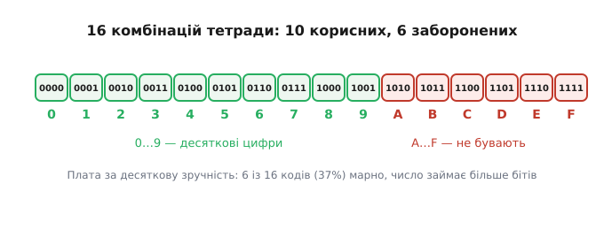
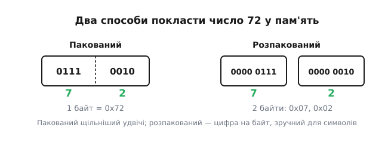
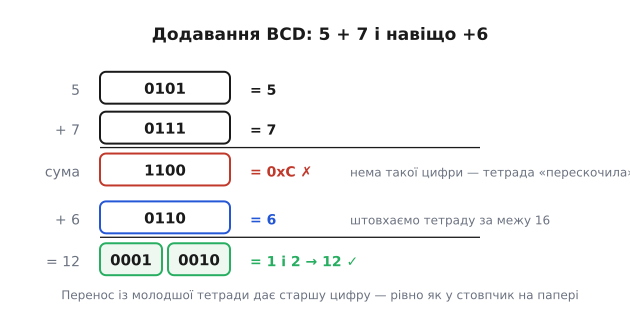

# BCD: двійково-кодоване десяткове

Комп'ютер рахує двійкою, а людина живе десяткою. Ці два світи мусять якось зустрічатися — щоразу, коли число показують на індикаторі, вводять із клавіатури, друкують на чеку чи звіряють із гривнями на рахунку. Найпряміший спосіб їх помирити — не переганяти ціле число з однієї системи в іншу, а **закодувати кожну десяткову цифру окремо**. Саме це й робить BCD (англ. *binary-coded decimal* — двійково-кодоване десяткове): не одне двійкове число замість десяткового, а десяткові цифри, кожна вбрана у свою жменьку бітів.

## Навіщо взагалі кодувати десяткове, коли є двійкове

Здавалося б, дивина. У нас є чудовий, щільний, природний для заліза спосіб зберігати числа — звичайне двійкове. Число 495 у ньому — це `1 1110 1111`, дев'ять бітів, і апаратний суматор додає такі числа за один такт. Навіщо вигадувати щось іще?

Відповідь у тому, що двійкове число — **суцільне**. Щоб дістати з `1 1110 1111` окремі цифри 4, 9, 5 — саме те, що треба вивести на індикатор чи надрукувати, — доводиться **ділити на 10 з остачею**, раз за разом. А ділення — найдорожча арифметична операція; на дрібному мікроконтролері без апаратного дільника воно розгортається в довгу підпрограму. Виходить парадокс: число вже в пам'яті, а щоб просто **показати** його людині, потрібні десятки тактів обчислень.

BCD прибирає цей клопіт у корені. Якщо кожна цифра лежить окремо, показати число — це просто пройтися по цифрах і для кожної засвітити свій знак. Жодного ділення: цифри вже готові, розкладені.

Є й друга, історично навіть важливіша причина — **гроші**. Десяткове число 0.1 у двійковому з комою не подається точно: воно перетворюється на нескінченний періодичний дріб, який доводиться обрізати, і в кожному обрізанні ховається крихітна похибка. Для фізики це байдуже, а для бухгалтерії — катастрофа: додайте мільйон разів по «десять копійок», і накопичена похибка зіпсує баланс до копійки, якої не сходиться. У десятковому ж рахунку 0.10 — це рівно 0.10, і сума завжди точна до останнього розряду. Тому машини, що рахували гроші, змалку рахували **десятково**, і BCD — прямий нащадок цієї потреби. [Як десяткова точність грошей породила BCD у надрах рахункових машин](topic:hw-digital/bcd-encoding/hist-bcd-decimal-machines.md) — окрема жива історія, від Марка I й перфокарт до System/360.

> 🔧 **Навіщо це.** На мікроконтролері, що жене цифри на семисегментний індикатор чи РК-екран, різниця відчутна. Тримаєте лічильник у BCD — оновлення дисплея коштує кілька зсувів і масок. Тримаєте у двійковому — щоразу перед виводом крутите ділення на 10 у циклі. У проєкті на дешевому 8-бітному ядрі без апаратного ділення це реальні такти, з'їдені на порожньому місці.

## Сама ідея: тетрада на цифру

Десяткових цифр десять — від 0 до 9. Щоб закодувати число до 9 у двійковому, потрібно **чотири біти** (три дають лише до 7, замало). Чотири біти — це **тетрада**, або пів-байта (англ. *nibble* — «шматочок»). Домовляємось про найпростіше відображення: цифру записуємо тими самими чотирма бітами, якими її дало б звичайне двійкове.

```text
цифра   тетрада
  0       0000
  1       0001
  2       0010
  ...
  8       1000
  9       1001
```

Ось і весь код. Багатоцифрове число — це просто **низка тетрад**, по одній на цифру, у тому самому порядку, що й на письмі.



*Число 495 двома способами. У BCD кожна цифра — окрема тетрада, цифри видно одразу. У чистому двійковому те саме число — суцільний блок, з якого цифри доводиться виколупувати діленням на 10.*

Це саме те відображення, яке дає код і зчитує людина без жодних перерахунків. Тетрада `0101` — це цифра 5, хоч у BCD, хоч у звичайному двійковому. Різниця не в тому, як виглядає окрема тетрада, а в тому, що **тетради не зливаються в одне число**: у BCD `0100 1001 0101` читається як «чотири, дев'ять, п'ять» → 495, а не як єдине двійкове число (яким воно дорівнювало б аж 1173).

## Ціна зручності: марнування коду

За десяткову зручність доводиться платити, і плата видна одразу. Тетрада має 16 можливих комбінацій (2⁴), а цифр лише десять. Отже, комбінації від `1010` до `1111` — тобто шістнадцяткові A, B, C, D, E, F — у правильному BCD **не бувають узагалі**. Шість кодів із шістнадцяти простоюють даремно.



*Десять комбінацій тетради кодують цифри, шість старших не використовуються ніколи. Це 37% змарнованого кодового простору — прямий наслідок того, що десятка не степінь двійки.*

Наслідок практичний: **те саме число в BCD займає більше бітів, ніж у двійковому**. Байт (8 бітів) у чистому двійковому вмістить значення до 255, а в BCD — лише дві цифри, тобто до 99. Приблизно кожен шостий біт іде намарне. Для великих масивів чисел це помітна різниця в пам'яті, і саме тому загального призначення числа тримають двійково, а BCD дістають там, де його зручності переважують цю ціну.

## Пакований і розпакований

Тетрада — це пів-байта, а пам'ять адресується байтами. Звідси два способи розкласти BCD-цифри по байтах, і обидва вживані.

**Пакований BCD** (англ. *packed*) кладе **дві цифри в один байт**: старша тетрада — старша цифра, молодша — молодша. Число 72 стає одним байтом `0111 0010`, тобто на вигляд `0x72`. Гарна властивість: шістнадцятковий запис байта **збігається** з десятковими цифрами, які він кодує. Це не випадковість — саме тому BCD-регістри так легко читати очима.

**Розпакований BCD** (англ. *unpacked*) віддає **цілий байт на одну цифру**, старша тетрада — нулі. Число 72 стає двома байтами `0x07` і `0x02`. Марнотратніше вдвічі, зате кожна цифра — самостійний байт, який зручно обробляти й майже без роботи перетворити на друкований символ (додав код нуля `'0'` — і маєш текст).



*Пакований BCD щільніший удвічі — дві цифри в байті, а шістнадцятковий вигляд байта прямо показує цифри. Розпакований дає цифру на байт: марнотратніше, зате кожна цифра готова стати символом.*

Вибір простий. Треба щільно й компактно (регістри годинника, лічильники) — пакований. Треба зручно гнати цифри в текст чи на індикатор — розпакований.

## Читаємо число з реального заліза

BCD — не музейна цікавинка: він живе всередині майже кожної мікросхеми [годинника реального часу](topic:hw-components/rtc-timekeeping) (RTC — окремий чип, що веде лік часу, поки основна система спить). Такий чип тримає секунди, хвилини, години, дату — **усе пакованим BCD**. Секунди 49 лежать у регістрі як `0x49`, а не як двійкове `0x31`. Зроблено це навмисне: мікроконтролер прочитав байт — і цифри вже готові до показу, ділити нічого.

Але прочитати їх треба правильно, і тут ховається типова пастка. Байт із чипа — це **дві тетради, а не число**. Наївне `sec = read_reg(0x00)` дасть вам `0x49`, тобто десяткове 73, — і годинник почне брехати. Треба розібрати байт на тетради й скласти справжнє значення:

**Розбір пакованого BCD-байта секунд у число**
:::tabs
```c
#include <stdint.h>

// байт із RTC у форматі пакованого BCD -> звичайне число 0..99
uint8_t bcd_to_bin(uint8_t bcd) {
    uint8_t hi = bcd >> 4;        // старша тетрада — десятки
    uint8_t lo = bcd & 0x0F;      // молодша тетрада — одиниці
    return hi * 10 + lo;          // складаємо десяткову вагу
}

// приклад: у регістрі секунд лежить 0x49
uint8_t raw = 0x49;              // так чип віддає «сорок дев'ять»
uint8_t sec = bcd_to_bin(raw);   // hi=4, lo=9 -> 4*10 + 9 = 49  ✓
```
```python
# байт із RTC у форматі пакованого BCD -> звичайне число 0..99
def bcd_to_bin(bcd):
    hi = bcd >> 4         # старша тетрада — десятки
    lo = bcd & 0x0F       # молодша тетрада — одиниці
    return hi * 10 + lo   # складаємо десяткову вагу

# приклад: у регістрі секунд лежить 0x49
raw = 0x49               # так чип віддає «сорок дев'ять»
sec = bcd_to_bin(raw)    # hi=4, lo=9 -> 4*10 + 9 = 49  ✓
```
:::

Ключ у рядку `hi * 10 + lo`. Старша тетрада важить не 16 (як було б у чистому двійковому байті), а **десять** — бо це десяткова цифра десятків. Помножити на 10, а не лишити зсунутою на 4 біти, — і є вся суть перетворення пакованого BCD у число.

Зворотний бік — записати число назад у чип — так само коротко: розкласти на десятки й одиниці і зшити в тетради.

**Число назад у пакований BCD**
:::tabs
```c
// звичайне число 0..99 -> пакований BCD для запису в RTC
uint8_t bin_to_bcd(uint8_t val) {
    return ((val / 10) << 4) | (val % 10);
    //       десятки в старшу     одиниці в молодшу
}
// bin_to_bcd(49) -> (4 << 4) | 9 = 0x40 | 0x09 = 0x49
```
```python
# звичайне число 0..99 -> пакований BCD для запису в RTC
def bin_to_bcd(val):
    return ((val // 10) << 4) | (val % 10)
    #        десятки в старшу      одиниці в молодшу
# bin_to_bcd(49) -> (4 << 4) | 9 = 0x40 | 0x09 = 0x49
```
:::

Тут `/ 10` і `% 10` таки з'являються — одне ділення на два байти при записі. Але запис часу трапляється рідко (наставили годинник — і забули), а читання-показ — щосекунди; головний, частий шлях лишається без ділення. У цьому й вигода: дорогу операцію ми відсунули на рідкісний бік.

Зверни увагу на ще одну пастку живого заліза: у тих самих регістрах старші біти часто **зайняті не цифрою**. У багатьох RTC найстарший біт регістра секунд — це прапорець спину генератора, а не частина числа. Тому перед розбором такий біт маскують (`raw & 0x7F`), інакше «зупинений годинник» причепиться до десятків секунд і зіпсує лік. BCD дає цифри задарма, але біти навколо них треба знати.

## Арифметика, що спотикається

Двійковий суматор — проста, відпрацьована річ, і спокуса велика: складати BCD-числа тим самим суматором, що й звичайні двійкові. Та щойно сума однієї тетради переступить 9, код ламається — бо **тетрада не має цифр понад 9**, а суматор про це не знає й лізе в заборонені коди A…F.

Подивімось на найпростіше: 5 + 7. У десятковому це 12. Складімо тетради як звичайне двійкове:

```text
  0101   (5)
+ 0111   (7)
------
  1100   = 0xC
```

`1100` — це дванадцять, але як **єдина тетрада**, а тетрада стільки не вміщає: `0xC` — заборонений код, а не пара цифр «1 і 2». Суматор дав арифметично правильне двійкове число, та в термінах BCD воно **безглузде**. Треба підправити.

Лік простий: тетрада «прострибнула» діапазон 0…9 і не породила переносу в наступну цифру, хоч мала б. Виправлення — **додати 6**. Шість — це рівно та різниця, на яку тетрада (мод 16) «відстає» від десяткового переносу (мод 10): доштовхнувши суму на 6, ми переганяємо тетраду за межу 16, отримуємо законний перенос у старшу цифру, а в молодшій лишається правильний залишок.

```text
  1100   (хибне 0xC)
+ 0110   (корекція +6)
------
1 0010   → перенос 1, тетрада 0010 = 2  →  цифри 1 і 2  →  12  ✓
```



*Чому +6. Сира сума 5+7 дає заборонений код 0xC. Додавши 6, ми виштовхуємо тетраду за межу 16 — з'являється правильний перенос у старшу цифру, а в молодшій лишається 2. Виходить 12, точно як у стовпчик на папері.*

Це і є серце BCD-арифметики: **після кожного додавання перевіряй кожну тетраду й, де вона перескочила 9 (або дала перенос), додавай 6**. Старі процесори мали для цього спеціальну команду-поправку одразу за додаванням; загалом же правило корекції, віднімання, знак і самодоповняльні варіанти коду складаються в окрему невеличку науку — [чому саме +6 виправляє суму й як на цьому побудована десяткова арифметика заліза](topic:hw-digital/bcd-encoding/math-bcd-arithmetic.md).

> 🔧 **Навіщо це.** Якщо ведете лічильник прямо в пакованому BCD (щоб не перетворювати перед кожним показом), інкремент — не просто `++`. Дійшовши цифрою до 9, наступний крок має дати не заборонене `0xA`, а перенос: молодша цифра в нуль, старша +1 — рівно та сама поправка на 6. Забудете її — індикатор після «...9» покаже сміття замість «...10».

## Двійкове ↔ BCD: коли перетворення все ж потрібне

Часто число народжується двійковим — його порахував [лічильник](topic:hw-digital/counters), виміряв АЦП, повернула арифметика, — а показати треба десятково. Значить, потрібен міст: двійкове → BCD. Найпряміше — ділити на 10 у циклі, збираючи остачі; це працює, але тягне за собою те саме ділення, від якого ми тікали.

Є розумніший шлях, що обходиться **без жодного ділення** — самими зсувами й додаваннями. Його звуть **double dabble** (англ., буквально «подвійне вмочання»), або «зсув-і-додай-3». Ідея вивернута навиворіт: замість діставати цифри з двійкового числа, ми **вдвигаємо** його по біту в поле BCD-цифр, і щоразу, коли якась цифра ось-ось перескочить за 9, завчасно додаємо їй 3 — та сама корекція, тільки наперед. Через свою простоту (лише зсуви й порівняння) цей спосіб — улюбленець і крихітних мікроконтролерів, і апаратних схем у ПЛІС. Готовий робочий код в обидва боки, з розбором чому саме +3 і як воно лягає в залізо — [double dabble і зворотне перетворення на C](topic:hw-digital/bcd-encoding/proj-double-dabble.md).

## Де BCD доречний, а де ні

Складімо все в одне правило, бо саме тут легко схибити з вибором.

BCD **на своєму місці** там, де числа весь час зустрічаються з людиною або з десятковим світом і майже не рахуються всередині. Годинники й календарі (той-таки RTC), лічильники на індикаторах, покази вимірювальних приладів, введення з десяткової клавіатури, а історично й головно — **грошові рахунки**, де десяткова точність до копійки не обговорюється. Спільне в усіх цих випадках одне: цифри або показують, або звіряють із десятковим оригіналом набагато частіше, ніж над ними щось обчислюють.

BCD **не на своєму місці** скрізь, де числа треба **багато й швидко рахувати**. Для звичайної цілочислової арифметики двійкове компактніше й додається без поправок; для дробів і фізики — двійкове з рухомою комою; для знакових величин природний вибір — [доповняльний код](topic:hw-digital/twos-complement-hardware), у якому віднімання зводиться до додавання без окремої логіки для знака. Пхати туди BCD означало б і марнувати біти, і чіпляти корекцію на кожну дію.

Отож BCD — це не «застарілий двійковий» і не «кращий двійковий», а **вузький інструмент стику**: місток між тим, як рахує машина, і тим, як читає, вводить і рахує гроші людина. Тримайте його рівно там, де цей стик проходить, — на індикаторі, в годиннику, у бухгалтерії, — а в надрах обчислень лишайте звичайне двійкове й не платьте зайвими бітами й поправками там, де людини поряд немає.
