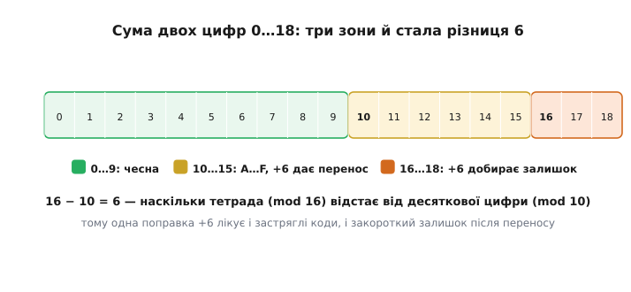
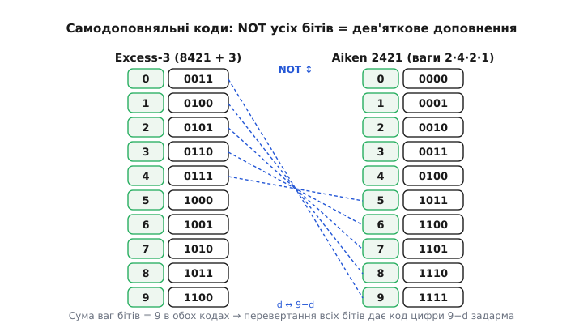

# 🧮 Чому +6: арифметика BCD

Двійковий суматор рахує за одним-єдиним законом: він додає біти й переносить, коли розряд переповнюється — тобто коли доходить до 16 у тетраді. А десяткова цифра переповнюється не на 16, а на 10. Ось і вся суперечка. Уся арифметика BCD — це наука про те, як помирити суматор, який рахує по 16, із цифрою, яка рахує по 10. З'ясується, що вся ця наука тримається на одному-єдиному числі — **шістці** — і на розумінні, звідки вона береться. Розберімо це від самого низу: чому саме 6, чому не 5 і не 7, як залізо ловить момент для поправки одним прапорцем, як те саме число −6 повертає нам віднімання, і як хитро дібрані коди роблять частину цієї роботи задарма.

## Дві модульні арифметики, що не збігаються

Почнімо з того, що взагалі означає «додати» в тетраді. Тетрада — це чотири біти, тобто лічильник за модулем 16: коли сума переходить 15, старший біт «падає» назовні як перенос, а всередині лишається залишок за модулем 16. Це закон заліза, і він незмінний.

```text
у тетраді:  a + b  дає  (a + b) mod 16,  а перенос = ⌊(a + b) / 16⌋
```

Десяткова ж цифра — це лічильник за модулем **10**. Коли дві цифри в сумі переходять 9, ми хочемо, щоб «десятка» вийшла переносом у наступний розряд, а всередині лишився залишок за модулем 10.

```text
у десятковій цифрі:  a + b  дає  (a + b) mod 10,  а перенос = ⌊(a + b) / 10⌋
```

Дві формули однакові на вигляд, але з різними числами — 16 проти 10 — і саме ця різниця й є вся проблема. Поки сума двох цифр не перевищує 9, обидві формули дають те саме: `mod 16` і `mod 10` від малого числа збігаються, переносу немає ні там, ні там. Тетрада, поки в ній 0…9, поводиться як чесна десяткова цифра — тому наївне складання BCD-чисел суматором **іноді працює** й присипляє пильність. Але щойно сума дійде до 10, дві арифметики розходяться, і суматор починає тихо брехати.

Подивімось, **де саме** й **на скільки** вони розходяться. Візьмімо суму двох цифр `s = a + b`; вона може бути від 0 до 18 (бо 9+9=18). Порівняймо, що дає кожна арифметика:

```text
 s   двійково   mod16→(перенос,тетрада)   mod10→(перенос,цифра)   збіг?
 0    00000        0 , 0                     0 , 0                так
 …
 9    01001        0 , 9                     0 , 9                так
10    01010        0 , A(=10)                1 , 0                НІ
11    01011        0 , B(=11)                1 , 1                НІ
 …
15    01111        0 , F(=15)                1 , 5                НІ
16    10000        1 , 0                     1 , 6                НІ
17    10001        1 , 1                     1 , 7                НІ
18    10010        1 , 2                     1 , 8                НІ
```

Придивімося до колонок. Скрізь, де є розбіжність (s ≥ 10), десяткова відповідь **більша від тетради рівно на 6** у цифрі — і там, де тетрада не дала переносу, десяткова таки дала. Це не випадковість і не збіг для окремих чисел: різниця модулів `16 − 10 = 6` **стала**. Кожна одиниця, яку тетрада «недобирає» до свого переповнення на 16, — це одиниця, на яку вона відстала від десяткового переповнення на 10. А відстає вона рівно на шість.

> 🔧 **Навіщо це.** Це не абстракція, а причина, чому лічильник у пакованому BCD не можна інкрементувати простим `++`. Тримаєте на індикаторі значення в BCD, дійшли до `...9`, додали 1 — залізо дасть `...A`, заборонений код, бо воно рахує по 16. Щоб дістати `...10` (перенос у старшу цифру, нуль у молодшу), треба доштовхнути на ту саму шістку. Уся ця стаття — про те, звідки вона й де її ставити.

## Корекція +6: доштовхнути тетраду до чесного переносу

Тепер сама поправка. Суматор порахував тетраду за модулем 16 і дав нам одне з двох «неправильних» станів:

**Випадок А — тетрада застрягла в діапазоні A…F (10…15).** Це коли `s` від 10 до 15: переносу немає, а в тетраді сидить заборонений код. Ми хочемо перегнати це в «перенос + залишок mod 10». Додаймо 6:

```text
було: тетрада = s      (10 ≤ s ≤ 15, переносу немає)
+6:   s + 6            (16 ≤ s+6 ≤ 21)
                        тепер це ≥ 16 → тетрада переповнюється!
дає:  перенос = 1,  залишок = s + 6 − 16 = s − 10
```

Погляньте на останній рядок: `s − 10` — це рівно те, що мала дати десяткова арифметика (`s mod 10` при 10 ≤ s ≤ 15). А перенос, якого бракувало, з'явився сам собою, бо +6 виштовхнуло суму за межу 16. Шістка тут працює як важіль: вона не «додає значення», вона **зсуває поріг переповнення** тетради з 16 на 10.

**Випадок Б — тетрада вже дала перенос, але залишок неправильний.** Це коли `s` від 16 до 18: суматор виніс перенос (бо s ≥ 16), а в тетраді лишилося `s − 16`, що на 6 менше за потрібне `s − 10`. Тут перенос уже є й чіпати його не треба — але залишок закороткий на шість. Додаймо 6 просто до тетради:

```text
було: тетрада = s − 16   (перенос уже винесено)
+6:   s − 16 + 6 = s − 10    ← саме те, що треба
```

І знову шістка ставить усе на місце. Диво в тому, що **обидва випадки лікуються однаково — додаванням 6**, хоч логіка в них різна: в А шістка **створює** перенос, у Б — лише **виправляє залишок** при вже наявному переносі. Одне число, дві ролі. Саме тому правило корекції звучить коротко: «де тетрада вийшла за 9 або дала перенос — додай 6».



*Уся сума двох цифр укладається в 0…18. До 9 тетрада чесна. У зоні 10…15 вона застрягла в заборонених кодах — +6 виштовхує її за 16 і породжує перенос. У зоні 16…18 перенос уже винесено, +6 лише добирає залишок. Різниця модулів 16 − 10 = 6 однакова скрізь — тому одна поправка лікує обидва випадки.*

Порахуймо повний приклад, де спрацьовують обидві тетради воднораз, — це показує, що корекція йде розряд за розрядом і переноси лягають природно.

**Додавання пакованих BCD: 58 + 27 = 85**

```text
        десятки  одиниці
  58 =   0101     1000
+ 27 =   0010     0111
------  ------   ------
сира сума по тетрадах (як звичайне двійкове):
  одиниці: 1000 + 0111 = 1111 = 0xF   → застрягло в A…F (випадок А)
  десятки: 0101 + 0010 = 0111 = 7     → у діапазоні 0…9, чесно

корекція одиниць (+6):
  1111 + 0110 = 1 0101  → перенос 1 у десятки, залишок 0101 = 5  ✓

десятки з урахуванням переносу:
  0111 + 1 (перенос) = 1000 = 8       → у діапазоні 0…9, поправка не треба

результат:  1000 0101 = 0x85 = 85     ✓
```

Зверніть увагу, як перенос із молодшої тетради **влився в старшу цифру** ще до того, як ми вирішили, чи потрібна поправка десяткам. Тому правильний порядок — коригувати від молодшого розряду до старшого, підхоплюючи переноси, точнісінько як стовпчиком на папері.

## Half-carry: як залізо ловить випадок А, не бачачи цифр

Тут постає тонке питання, яке легко проґавити. У випадку Б («тетрада дала перенос») залізо саме знає, що сталося: перенос із тетради — це подія, яку суматор помічає. А от випадок А — «тетрада застрягла в A…F» — набагато підступніший. Уявіть суму одиниць `1111` (0xF). Переносу з тетради **немає** (бо 15 < 16), і значення `1111` для суматора — цілком законне двійкове число. Звідки заліза знати, що ця тетрада «хвора» й потребує +6?

Відповідь могла б бути: «порівняй тетраду з 9». І це працює для випадку А. Але є ще підступніший підвипадок, який голе порівняння з 9 **пропускає**. Розгляньмо 8 + 9 в одній тетраді:

```text
1000 + 1001 = 1 0001   → перенос 1 із тетради, залишок 0001 = 1
```

Тетрада після додавання дорівнює `0001` — це «1», цілком законна цифра, менша за 9! Порівняння «чи тетрада > 9» скаже «ні, все гаразд» — і **помилиться**, бо насправді сталося переповнення (8+9=17, мала бути 7 із переносом, а не 1). Що видало б правду? Той факт, що **при додаванні стався перенос із молодшої тетради в старшу** — з біта 3 у біт 4.

Ось для чого існує окремий прапорець — **половинний перенос** (англ. *half-carry*, «половинний», бо це перенос із середини байта; в Intel його звуть *auxiliary carry*, допоміжний перенос, AC або AF). Це біт у регістрі стану процесора, який виставляється рівно тоді, коли додавання дало **перенос із розряду 3 у розряд 4** — тобто з молодшої тетради в старшу. Він ловить саме випадок Б-в-мініатюрі всередині однієї тетради: переповнення, яке сховалося, лишивши малий залишок.

Отже, повне правило корекції молодшої тетради враховує **дві** причини:

```
додати 6 до молодшої тетради, ЯКЩО:
    (молодша тетрада > 9)   ← випадок А: застрягла в A…F
  АБО
    (half-carry = 1)         ← було переповнення, залишок ≤ 9 обманює
```

А для старшої тетради — те саме, але замість half-carry дивимося на звичайний **перенос** (англ. *carry*, C або CF) з усього байта, і додаємо не 6, а 0x60 (шістку в старшу тетраду):

```
додати 0x60 до старшої тетради, ЯКЩО:
    (старша тетрада > 9)   АБО   (carry = 1)
```

> 🔧 **Навіщо це.** Half-carry — це прапорець, який у звичайному житті програміста майже ніколи не видно: до нього немає прямої команди «перевір half-carry», його не читають в `if`. Він існує майже виключно заради BCD-поправки. Тому коли ви пишете BCD-арифметику вручну на C (без апаратної команди DAA), доводиться відтворювати цю логіку самому — і саме підвипадок «8+9 дало 1» найчастіше забувають, бо порівняння з 9 виглядає достатнім. Не достатнє: без перевірки переносу воно тихо зіпсує кожну суму, де тетрада перескочила рівно на 16…18.

## DAA: одна команда, що робила всю поправку

Раз поправка щоразу однакова, її гріх не вбудувати в залізо. Старі 8-бітні процесори саме так і зробили: після команди додавання ставилася одна команда **десяткової поправки** — **DAA** (англ. *Decimal Adjust Accumulator*, «десяткове коригування акумулятора»). Вона за один такт робила все, що ми розписали вручну: дивилася на обидві тетради акумулятора, на прапорці half-carry й carry — і додавала 6 та/або 0x60 там, де треба.

Історична довідка, перевірена: DAA з'явилася в **Intel 8080** (1974) — це перший масовий процесор, що мав і прапорець допоміжного переносу, і команду десяткової поправки як пару. Пізніші x86 успадкували DAA заради сумісності зі спадком 8080; у 64-бітному режимі (x86-64) її вже викинули — команда стала недійсною. Тобто DAA прожила від зорі мікропроцесорів майже до наших днів суто як міст у минуле. *(Статус: усталений факт, за реконструкцією логіки 8080/8085 і документацією Intel.)*

Робочий цикл виглядав так — додавання, потім поправка:

```
; скласти дві пакованих BCD-цифри у 8080-подібному асемблері
    MOV  A, B      ; A = перше BCD-число, напр. 0x58
    ADD  C         ; A = A + C (сира двійкова сума), C=0x27 → A=0x7F
                   ; тут half-carry=0 (8+7=15<16, переносу з біта 3 нема)
    DAA            ; десяткова поправка: тетрада одиниць F>9 → +6 = 0x85;
                   ; це +6 саме дало перенос у тетраду десятків (8→8, без поправки);
                   ; результат A = 0x85, carry виставлено як десятковий перенос
```

Ключова тонкість DAA — вона працює **тільки на добуток попереднього додавання**, бо покладається на half-carry й carry, які виставило саме додавання. Виконати DAA «просто так», без свіжого `ADD` перед нею, — безглуздо: прапорці вже не про те. Це й пояснює, чому DAA — не окрема арифметична дія, а завжди **другий крок** пари «додай і поправ».

## Віднімання: та сама шістка, тільки −6

Тепер віднімання. Спокуса симетрії підказує: якщо додавання лікується +6, то віднімання — −6. Так і є, але варто зрозуміти **чому**, бо тут теж легко наламати.

Коли ми віднімаємо дві цифри `a − b` і `a < b`, у десятковому світі ми **позичаємо десятку** зі старшого розряду: результат стає `a − b + 10`, а зі старшого розряду йде борг (англ. *borrow*). Залізо ж, віднімаючи тетради, позичає не десятку, а **шістнадцятку**: воно дає `a − b + 16`. І знову розбіжність рівно на 6 — тільки тепер тетрада **завелика** на шість, бо позичила 16 замість 10.

```
десятково при позиці:  a − b + 10
у тетраді при позиці:   a − b + 16     ← на 6 більше
```

Отже, коли віднімання тетради дало борг (спрацював half-carry як «половинний позик»), тетрада завелика на 6, і її треба **зменшити на 6**:

```
корекція віднімання: якщо був half-borrow → відняти 6 з тетради
```

Порахуймо приклад, де молодша цифра змушена позичати.

**Віднімання пакованих BCD: 42 − 27 = 15**

```
        десятки  одиниці
  42 =   0100     0010
− 27 =   0010     0111
------  ------   ------
сира двійкова різниця по тетрадах:
  одиниці: 0010 − 0111 → 2 − 7 < 0 → позика зі старшого:
           2 − 7 + 16 = 11 = 1011,  half-borrow = 1
  десятки: 0100 − 0010 − 1(позика) = 0001 = 1

корекція одиниць (−6, бо був half-borrow):
  1011 − 0110 = 0101 = 5   ✓   (позичена була 16, а треба 10 → зайві 6 геть)

десятки: 0001 = 1, позики зі старшого не було → поправка не треба

результат:  0001 0101 = 0x15 = 15   ✓
```

Симетрія повна й красива: **додаєш — доштовхуєш на +6** (щоб тетрада переповнилася раніше, на 10), **віднімаєш — знімаєш −6** (бо позичила забагато, 16 замість 10). Старі процесори мали для віднімання окрему команду-поправку — в Intel це **DAS** (англ. *Decimal Adjust after Subtraction*). Причина двох окремих команд, а не однієї «розумної», проста: DAA й DAS дивляться на прапорці однаково, але діють протилежно — одна додає 6, друга віднімає, і залізу треба знати наперед, що саме коригувати.

Практична пастка: на процесорах, де окремої DAS немає (наприклад, деякі пізніші ARM), віднімання BCD роблять **через додавання доповнення** — і саме тут у гру входять самодоповняльні коди, до яких ми зараз перейдемо. Але спершу — коротка, але важлива розвилка про те, у якому вигляді тримати цифри під час усієї цієї арифметики.

## Пакований проти розпакованого в самій арифметиці

Про [пакований і розпакований BCD](topic:hw-digital/bcd-encoding) як спосіб укладати цифри в пам'ять сказано в самій темі; тут важить інше — **як вибір між ними міняє арифметику**.

**Пакований** (дві цифри в байті) — щільний, але кожна арифметична дія над байтом зачіпає **обидві тетради воднораз**, і поправку доводиться робити для двох цифр за раз: молодша тетрада +6 за half-carry, старша +0x60 за carry. Саме заради цього подвійного випадку й потрібна повноцінна DAA, яка вміє коригувати обидві половини байта одним махом. Плюс: за один `ADD` ви складаєте одразу дві десяткові цифри. Мінус: логіка переносів між тетрадами всередині байта прихована, і без DAA її морочливо відтворювати.

**Розпакований** (одна цифра на байт, старша тетрада — нулі) марнотратніший, зате арифметика **простіша й прозоріша**. Складаєте дві цифри — результат від 0 до 18 сидить у молодшій тетраді байта, старша порожня, тож поправка зводиться до одного питання «чи вийшло за 9» без клопоту з другою цифрою:

**Додавання розпакованих BCD-цифр на C, без DAA**

:::tabs
```cpp
#include <stdint.h>

// скласти дві розпаковані BCD-цифри (0..9 кожна);
// повертає молодшу цифру суми, а перенос кладе у *carry
uint8_t bcd_digit_add(uint8_t a, uint8_t b, uint8_t *carry) {
    uint8_t s = a + b + *carry;   // сира сума, 0..19
    if (s > 9) {                  // цифра переповнилась десятково
        s -= 10;                  // залишок mod 10  (те саме, що +6 і зняти 16)
        *carry = 1;               // десятковий перенос у старшу цифру
    } else {
        *carry = 0;
    }
    return s;                     // готова цифра 0..9
}
```
```python
# скласти дві розпаковані BCD-цифри (0..9 кожна);
# повертає пару (молодша цифра суми, перенос у старшу цифру)
def bcd_digit_add(a, b, carry):
    s = a + b + carry             # сира сума, 0..19
    if s > 9:                     # цифра переповнилась десятково
        return s - 10, 1          # залишок mod 10 і десятковий перенос у старшу
    return s, 0                   # готова цифра 0..9, переносу немає
```
:::

Зверніть увагу на рядок `s -= 10`. У розпакованому вигляді ми можемо дозволити собі відняти саме 10, а не гратися з «+6 і переповнення тетради», бо старша тетрада байта вільна й нічому не заважає — байт легко вміщає проміжне 0…19. Це та сама десяткова арифметика, лише виражена прямо. Пакований формат такої розкоші не має: там над «десяткою» вже сидить сусідня цифра, тому доводиться діяти хитрощами з +6 усередині тетради. Ось чому апаратна DAA — про пакований формат, а розпакований часто обходиться простим C без жодних поправкових команд.

Правило вибору для арифметики просте: рахуєте багато й тримаєте компактно (грошові поля, довгі BCD-числа) — пакований плюс DAA; рахуєте зрідка, а головне — потім гоните цифри в текст чи на індикатор — розпакований, де кожна цифра вже майже готовий символ і арифметика тривіальна.

## Самодоповняльні коди: коли дев'яткове доповнення — це просто NOT

Тепер найкрасивіша частина. Віднімання через доповнення — стара, могутня ідея: щоб відняти, додай доповнення від'ємника. У десятковому світі роль, яку у двійковому грає [доповняльний код](topic:hw-digital/twos-complement-hardware), виконує **дев'яткове доповнення** (англ. *nine's complement*): доповнення цифри d — це `9 − d`. Відняти число зводиться до додавання його дев'яткового доповнення й корекції кінцевого переносу.

> 🔧 **Навіщо це.** [Доповняльний код](topic:hw-digital/twos-complement-hardware) — це спосіб звести віднімання до додавання, замінивши число його «дзеркалом до повного оберту» так, щоб апаратний суматор, який уміє лише додавати, виконав віднімання без окремої відніманої логіки. Для десяткової арифметики роль такого дзеркала грає дев'яткове доповнення `9 − d`: додав його замість того, щоб віднімати, підхопив перенос — і маєш різницю. Уся цінність самодоповняльних кодів у тому, що вони роблять обчислення `9 − d` безкоштовним.

Проблема в тому, що в звичайному 8421 BCD обчислити `9 − d` для кожної цифри — це окрема робота: `9 − 3 = 6`, `9 − 7 = 2` тощо, таблиця відніманнь. А що, якби код цифри був підібраний **так**, що дев'яткове доповнення виходило б простим **перевертанням усіх бітів** — тим самим `NOT`, яким двійкове доповнення дає одиничне? Тоді десяткове віднімання коштувало б рівно стільки ж, скільки двійкове: один інвертор на тетраду.

Код, у якому інверсія всіх бітів цифри `d` дає код цифри `9 − d`, звуть **самодоповняльним** (англ. *self-complementing*). Умова на такий код чисто арифметична. Якщо всі чотири біти важать сумарно так, що вага коду `W(d)` плюс вага інверсії `W(NOT d)` завжди дає ту саму сталу, то перевертання бітів автоматично «віддзеркалює» цифру. Для чотирьох бітів сума коду й його інверсії — це код із усіх одиниць, тобто вага `1111`. Щоб інверсія `d` давала `9 − d`, потрібно:

```
W(d) + W(NOT d) = 9      для кожної цифри d = 0…9
```

тобто сума ваг усіх чотирьох бітів коду має дорівнювати 9. Це і є критерій самодоповняльності. Звичайний 8421 його провалює: 8 + 4 + 2 + 1 = 15, не 9 — тому 8421 **не** самодоповняльний. А от два коди його задовольняють, і обидва вживані.



*Самодоповняльний код: перевертання всіх чотирьох бітів цифри d дає код цифри 9 − d. Пари 0↔9, 1↔8, 2↔7, 3↔6, 4↔5 дзеркальні. Обидва коди — Excess-3 і Aiken 2421 — мають суму ваг бітів рівно 9, тому дев'яткове доповнення в них безкоштовне: один інвертор замість таблиці віднімань.*

### Excess-3: зсунути на три, щоб зловити симетрію

Найпростіший самодоповняльний код — **Excess-3** (англ. «надлишок три»; історично й *XS-3*). Рецепт до сміху короткий: візьми звичайний 8421 BCD і **додай 3** до кожної цифри.

```
цифра   8421      +3    Excess-3
  0     0000            0011
  1     0001            0100
  2     0010            0101
  3     0011            0110
  4     0100            0111
  5     0101            1000
  6     0110            1001
  7     0111            1010
  8     1000            1011
  9     1001            1100
```

Перевірмо самодоповняльність на око. Код цифри 2 — це `0101`. Перевернімо всі біти: `1010`. А `1010` — це код цифри 7 у цій таблиці. І справді, `9 − 2 = 7`. Ще: код 0 — `0011`, інверсія `1100` — це 9. Працює для всіх пар. Чому? Excess-3 представляє цифру `d` числом `d + 3`. Інверсія чотирибітного числа `x` — це `15 − x`. Отже, інверсія коду цифри `d` дорівнює `15 − (d + 3) = 12 − d = (9 − d) + 3` — а це рівно код Excess-3 для цифри `9 − d`. Зсув на 3 навмисне поставив «центр» коду симетрично посеред тетради (діапазон 3…12 замість 0…9), і саме ця центрованість робить інверсію дзеркалом.

Excess-3 має й другий подарунок, який колись дуже цінували. У ньому **немає коду з усіх нулів для значущої цифри**: цифра 0 — це `0011`, а не `0000`. Тому суцільний нуль `0000` вирізняється як «нічого/порожньо», що зручно для передавання й для схем, де треба відрізнити «нуль-цифру» від «немає сигналу». Крім того, у складанні Excess-3 переноси між тетрадами народжуються природніше, ніж у чистому 8421, бо зсув на 3 підправляє поріг — хоча поправку `±3` для повернення в Excess-3 після додавання все одно доводиться робити.

### Aiken 2421: зважений і теж самодоповняльний

Другий код — **Aiken** (2421), і він хитріший, бо намагається всидіти на двох стільцях: бути **зваженим** (як 8421, де кожен біт має свою вагу — тут 2, 4, 2, 1) **і** самодоповняльним воднораз. Сума ваг: 2 + 4 + 2 + 1 = 9 — критерій самодоповняльності виконано точно.

```
цифра   Aiken 2421   (ваги 2·4·2·1)
  0        0000
  1        0001
  2        0010
  3        0011
  4        0100
  5        1011
  6        1100
  7        1101
  8        1110
  9        1111
```

Тут ховається тонкість, яку варто розкрити, бо вона пояснює, чому таблиця саме така. Ваги 2-4-2-1 **неоднозначні**: одну й ту саму цифру можна скласти по-різному. Скажімо, цифру 3 можна отримати як `0011` (2+1) — а можна було б і як `1001`? Ні, `1001` = 2+1 = 3 теж (старший «2» плюс молодший «1»)! Обидва дають 3. Так само 5 — це `1011` (2+2+1) або `0101` (4+1). Код **сам по собі** не диктує єдиного представлення; таблицю доводиться **добирати** так, щоб зберегти дзеркальну симетрію.

І добирають її за єдиним правилом: цифри **0…4 беруть коди зі старшим бітом 0** (`0000…0100`), а цифри **5…9 — коди зі старшим бітом 1** (`1011…1111`). Тоді перевертання всіх бітів переводить кожен код нижньої половини рівно в код верхньої: `0000`(0) ↔ `1111`(9), `0001`(1) ↔ `1110`(8), і так далі. Шість «середніх» комбінацій — `0101, 0110, 0111, 1000, 1001, 1010` — навмисне **не використовуються**, бо якби ми пустили в діло, скажімо, `0101` для 5, дзеркало зламалося б (інверсія `0101` — це `1010`, яке ми теж мусили б комусь віддати, і симетрія розповзлася б). Тобто заборонені коди в Aiken — не «марнування, як у 8421», а **свідома жертва заради самодоповняльності**: із двох способів записати цифру щоразу обрано той, що тримає дзеркало цілим.

Історична довідка, перевірена: код названо на честь **Говарда Гатевея Ейкена** (Howard Hathaway Aiken, американець, творець релейного комп'ютера Harvard Mark I). Код 2421 застосовували в машині **Harvard Mark III** для стику десяткового вводу-виводу з двійковим нутром; його й досі згадують у контексті цифрових годинників і калькуляторів. *(Статус: усталений факт; авторство коду за Ейкеном підтверджене, застосування в Mark III — за історією гарвардських машин.)*

### Чому це справді спрощує віднімання

Зберімо нитку докупи, бо в цьому вся мета. Ми хочемо віднімати десяткові числа через дев'яткове доповнення, щоб суматор, який уміє лише додавати, робив і віднімання. Дев'яткове доповнення вимагає для кожної цифри обчислити `9 − d`. У самодоповняльному коді це обчислення — **просто інверсія всіх бітів тетради**, один шар вентилів `NOT`, миттєвий і безкоштовний. Порахуймо повний приклад у Excess-3, щоб побачити, як усе стає на місце.

**Віднімання через дев'яткове доповнення: 8 − 3 = 5 (в Excess-3)**

```
крок 1. дев'яткове доповнення від'ємника 3 — це інверсія його коду:
        код 3 в Excess-3 = 0110
        NOT(0110)        = 1001  = код цифри 6   (і справді 9 − 3 = 6)

крок 2. додаємо зменшуване й доповнення від'ємника (обидва в Excess-3):
        8 → 1011
        6 → 1001   (це доповнення)
        1011 + 1001 = 1 0100   → перенос 1, тетрада 0100

крок 3. кінцевий перенос = 1 означає «додати його назад» (end-around carry),
        а результат у тетраді довести до Excess-3:
        0100 + перенос 1 = 0101 … далі стандартна поправка Excess-3
        дає код цифри 5 = 1000                                  ✓
```

Суть кроку 1: **уся робота з обчислення `9 − 3` звелася до одного `NOT`**. Не таблиця, не віднімач — інвертор. Ось за що платять неоднозначністю ваг і забороненими кодами: за те, що найдорожчий шматок десяткового віднімання — дев'яткове доповнення — стає безкоштовним. У 8421 довелося б для кожної цифри мати справжній віднімач `9 − d`; у самодоповняльному коді його немає взагалі. Це та сама філософія, що й [доповняльний код](topic:hw-digital/twos-complement-hardware) у двійковому: підбери представлення так, щоб віднімання перетворилося на додавання чогось, що дістається задарма.

## Одна шістка, від якої все розходиться

Відступімо на крок і подивімося на цілу картину. Уся арифметика BCD виросла з єдиного факту: тетрада рахує по 16, а цифра — по 10, і різниця цих модулів дорівнює 6. Ця шістка проросла в усе. Додавання доштовхує тетраду на **+6**, щоб вона переповнилася вчасно. Віднімання знімає **−6**, бо тетрада позичила зайве. Апаратна поправка (DAA/DAS) — це та сама шістка, вбудована в кремній і націлена прапорцями half-carry й carry, які ловлять момент, коли поправка потрібна. А самодоповняльні коди — Excess-3 зі своїм зсувом на 3 (половина від 6, поставлена так, щоб центрувати діапазон) і Aiken 2421 із сумою ваг рівно 9 — це спроба заплатити частину цього податку **наперед**, іще на етапі вибору кодів, щоб дев'яткове доповнення для віднімання виходило одним перевертанням бітів.

Тому «чому +6» — не дрібне правило, яке треба запам'ятати, а верхівка одного простого причинного ланцюга: **різні модулі → стала різниця 6 → доштовхнути (додавання) або зняти (віднімання) цю різницю → зловити момент прапорцем → або взагалі підібрати код, де частина роботи безкоштовна**. Зрозумів шістку — зрозумів усю десяткову арифметику заліза.
