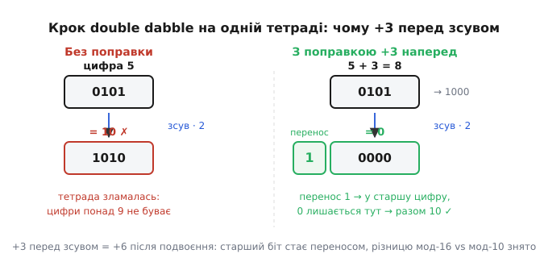

# ⚙️ Double dabble: двійкове ↔ BCD без ділення

Число народилося у двійковому світі — його порахував лічильник, повернув АЦП, склала арифметика, — а на семисегментному індикаторі має світитися десятковими цифрами. Значить, треба міст: із суцільного двійкового блоку дістати окремі цифри й розкласти їх по тетрадах. Найпряміший міст очевидний: ділити число на 10 з остачею, раз за разом, поки не скінчиться. Остача — цифра, частка йде на наступне ділення. Працює бездоганно й пишеться в три рядки.

Але цей міст веде рівно через ту прірву, від якої BCD і рятує. Ділення — найдорожча цілочислова дія; на дешевому 8-бітному ядрі без апаратного дільника кожне `% 10` розгортається в довгу підпрограму зсувів і віднімань, і таких ділень треба стільки, скільки цифр. Виходить смішне: сам сенс BCD — показувати числа **без ділення**, а щоб число туди перевести, ми ділення викликаємо. Отже, питання чесне: чи можна перекласти двійкове в BCD, не поділивши жодного разу?

Можна. І прямий, і зворотний бік мосту будуються з операцій, які вміє навіть найдрібніший процесор — зсув, порівняння, додавання. Прямий бік — знаменитий **double dabble** (англ., буквально «подвійне вмочання»), він же «зсув-і-додай-3» (*shift-and-add-3*). Зворотний — ще простіший, на самих множеннях на десять. Розберімо обидва до кістяка: спершу ідею, тоді чому вона працює, тоді робочий C для прошивки, тоді пастки з розрядністю та переповненням, і насамкінець — як той самий алгоритм лягає ланцюгом гейтів у ПЛІС.

> 🔧 **Навіщо це.** Будь-який пристрій, що показує пораховане число людині, стоїть на цьому мосту. Лічильник обертів, вольтметр, ваги, таймер — усередині двійкове, на екрані десяткове. На ядрі з апаратним діленням різниця мала, ділення й підходить. Але на дешевій 8-бітці (а таких у виробах — море) double dabble перетворює число за лічені зсуви замість сотень тактів на цикл ділень. І він єдиний придатний, коли перетворення робить не процесор, а логіка в ПЛІС: ділення в залізі — дорога махина, а «зсув-і-додай-3» — жменька суматорів.

## Ідея прямого боку: вдвигати біти в поле цифр

Звичне ділення дивиться на число **згори**: відкушує молодшу цифру остачею й зменшує решту. Double dabble заходить із протилежного боку — **знизу, побітно**, і будує десяткове число так само, як його читає людина зліва направо.

Уявімо два сусідні поля. Ліворуч — порожнє поле BCD-цифр, кілька тетрад, поки всі нулі. Праворуч — наше двійкове число. Тепер робимо одну-єдину дію багато разів: **зсуваємо всю цю пару вліво на один біт**. Найстарший біт двійкового числа випадає праворуч — і в'їжджає в наймолодший біт поля BCD. Іще зсув — наступний біт двійкового числа перетікає в BCD-поле, а те, що вже там було, посувається на розряд вище. Так біт за бітом усе двійкове число «перетікає» зліва направо в поле цифр.

Чому це взагалі має дати десяткове число? Бо зсув уліво на один біт — це **множення на два**. Коли ми зсуваємо поле BCD і доливаємо туди черговий біт числа, ми робимо рівно те, що робить людина, читаючи двійкове число зліва направо: бере накопичене, подвоює його і додає нову цифру. Читання двійкового `1011` — це `((1·2 + 0)·2 + 1)·2 + 1`: щоразу подвоїти й додати наступний біт. Double dabble рахує саме цей вираз — тільки накопичувач тримає не у двійковому, а в **десятковому** вигляді, тетрадами. От і вся хитрість: старий добрий метод Горнера, порахований у BCD-полі.

Була б тетрада звичайним двійковим лічильником — на цьому й скінчилося б. Але тетрада мусить лишатися **десятковою цифрою**, а вона живе лише в діапазоні 0…9. І тут з'являється сіль алгоритму.

## Чому саме +3: корекція наперед

Слідкуймо за однією тетрадою. Зараз у ній лежить якась цифра, а наступний крок її **подвоїть** (це ж зсув уліво). Поки цифра ≤ 4, подвоєння дає ≤ 8 — законна цифра, тетрада не виходить за межу. А щойно цифра ≥ 5, подвоєння викине її за 9: п'ятірка стала б десяткою, вісімка — шістнадцяткою. Тетрада не має таких цифр — код зламався б, як і при звичайному додаванні BCD, що перескочило дев'ятку.

Значить, треба виправляти. І найрозумніше — виправляти **не після**, коли вже маємо заборонений код, а **наперед**, поки цифра ще ціла: перед кожним зсувом дивимось на кожну тетраду, і якщо в ній **5 або більше**, додаємо до неї **3**. Далі йде зсув, і все стає на місця.

Звідки саме трійка? При звичайному додаванні BCD поправка — **+6**: шість — це та різниця, на яку тетрада (мод 16) відстає від десяткового переносу (мод 10). Тут корекція та сама, лише **до подвоєння, а не після**. А подвоєння множить на два — тож поправка, додана **перед** зсувом, теж подвоїться. Отже, щоб після зсуву вийшло потрібне +6, перед зсувом треба додати рівно **вдвічі менше — +3**. Трійка — це шістка, ощадливо додана наперед, поки зсув її ще не подвоїв.

Простежмо на числі. Хай у тетраді цифра 5, і зараз буде зсув.

```text
без корекції:  5  →  зсув (·2)  →  10   ← заборонений код, тетрада зламалась
з корекцією:   5 + 3 = 8  →  зсув (·2)  →  16 = 1 0000
                                          ↑ перенос 1 у старшу цифру
                                          ↓ у тетраді лишається 0000 = 0
підсумок: 5 стало «1 і 0» → у наступному розряді 10, точно правильно ✓
```

Подвоєна п'ятірка мала б дати десятку — і вона її дає, але **правильно розкладену**: одиниця переноситься в старшу цифру, нуль лишається в молодшій. Додавання трійки зробило дві речі одразу. По-перше, `8 = 1000` — після подвоєння це `1 0000`, тобто найстарший біт тетради виштовхнувся за її межу й став **переносом у сусідню цифру** — рівно те, чого ми хочемо від десяткового розряду. По-друге, та трійка, що ми долили, після подвоєння стала **шісткою** — і саме вона компенсує різницю між двійковим (мод 16) і десятковим (мод 10) ліком у тетраді. Одна маленька +3 наперед робить усю роботу +6, ще й безкоштовно вганяє перенос куди слід.

Перевірмо межу з іншого краю. Хай у тетраді 4 — корекції не буде (4 < 5), зсув дасть 8, законна цифра. А хай 9 — найбільша можлива: `9 + 3 = 12 = 1100`, після зсуву `1 1000 = 24 = 1·16 + 8`, тобто перенос 1 і цифра 8. Дев'ятка, подвоєна разом із новим бітом-одиницею знизу, це 19; а тут вийшло «1 і 8» → 18, плюс той біт, що втече знизу, дасть 19. Сходиться на кожному значенні від 5 до 9 — тому поріг саме «≥ 5», і додаємо саме 3.



*Крок алгоритму зблизька. Ліворуч — без поправки: подвоєна п'ятірка ламає тетраду. Праворуч — із поправкою +3 наперед: після зсуву старший біт стає переносом у сусідню цифру, у молодшій лишається правильний залишок. Трійка перед зсувом = шістка після нього.*

## Прогін цілком: 8-бітне число в три цифри

Тепер зберімо крок у повний прохід. Візьмемо байт 243 = `1111 0011` і переженемо його в три BCD-цифри. Поле цифр — три тетради (сотні·десятки·одиниці), спершу всі нулі. Робимо 8 зсувів (по одному на біт), перед кожним коригуючи ті тетради, де вже ≥ 5.

Тонкість, яку легко проґавити руками, одна: коригувати треба **всі** тетради **перед** кожним зсувом, а перевірку «≥ 5» робити по **справжній** цифрі, до додавання трійки. Після корекції тетрада може тимчасово стати понад 9 (7+3=10) — це нормально, наступний зсув її одразу «розрядить» переносом. Замість ловити кожен крок пальцем на папері — довірмо машині: ось повний прогін, і на ньому звіримо, що на виході саме `2 4 3`.

**Робочий double dabble: 8-бітне двійкове → три десяткові цифри**
:::tabs
```cpp
#include <cstdint>

// Перетворює 8-бітне двійкове (0..255) у три десяткові цифри BCD.
// out[0] — сотні, out[1] — десятки, out[2] — одиниці.
void bin_to_bcd8(uint8_t value, uint8_t out[3]) {
    // Поле BCD тримаємо в одному 16-бітному слові: три тетради поспіль.
    //   біти 11..8 — сотні, 7..4 — десятки, 3..0 — одиниці.
    uint16_t bcd = 0;

    for (int8_t i = 7; i >= 0; --i) {          // від старшого біта до молодшого
        // 1) КОРЕКЦІЯ НАПЕРЕД: кожній тетраді, де цифра >= 5, додати 3
        if (((bcd >> 0) & 0xF) >= 5) bcd += (3 << 0);   // одиниці
        if (((bcd >> 4) & 0xF) >= 5) bcd += (3 << 4);   // десятки
        if (((bcd >> 8) & 0xF) >= 5) bcd += (3 << 8);   // сотні

        // 2) ЗСУВ: усе поле вліво, згори втягуємо черговий біт числа
        bcd <<= 1;
        bcd |= (value >> i) & 1;               // старший біт value -> молодший біт поля
    }

    out[0] = (bcd >> 8) & 0xF;                 // сотні
    out[1] = (bcd >> 4) & 0xF;                 // десятки
    out[2] = (bcd >> 0) & 0xF;                 // одиниці
}

// приклад: bin_to_bcd8(243, d) -> d = {2, 4, 3}
//          bin_to_bcd8(255, d) -> d = {2, 5, 5}   (максимум для байта)
```
```python
# Перетворює 8-бітне двійкове (0..255) у три десяткові цифри BCD.
# Повертає (сотні, десятки, одиниці).
def bin_to_bcd8(value):
    # Поле BCD тримаємо в одному цілому: три тетради поспіль.
    #   біти 11..8 — сотні, 7..4 — десятки, 3..0 — одиниці.
    bcd = 0

    for i in range(7, -1, -1):                 # від старшого біта до молодшого
        # 1) КОРЕКЦІЯ НАПЕРЕД: кожній тетраді, де цифра >= 5, додати 3
        if (bcd >> 0) & 0xF >= 5: bcd += 3 << 0    # одиниці
        if (bcd >> 4) & 0xF >= 5: bcd += 3 << 4    # десятки
        if (bcd >> 8) & 0xF >= 5: bcd += 3 << 8    # сотні

        # 2) ЗСУВ: усе поле вліво, згори втягуємо черговий біт числа
        bcd <<= 1
        bcd |= (value >> i) & 1                 # старший біт value -> молодший біт поля

    return (bcd >> 8) & 0xF, (bcd >> 4) & 0xF, bcd & 0xF

# приклад: bin_to_bcd8(243) -> (2, 4, 3)
#          bin_to_bcd8(255) -> (2, 5, 5)   (максимум для байта)
```
:::

Три речі варто прочитати уважно. **Перше** — порядок усередині циклу залізний: спершу корекція, тоді зсув. Переставиш — і поправка або запізниться (тетрада вже зламалась), або спрацює на ще не існуючій цифрі. **Друге** — біти числа беремо від старшого (`value >> 7`) до молодшого (`value >> 0`), бо десяткове число будується зліва направо, зі старшого розряду. **Третє** — усе поле BCD живе в одному `uint16_t`, і тетради не заважають одна одній: перенос із молодшої (біт 3→4, 7→8) природно перетікає в старшу тим самим `<<= 1`. Не треба ні окремих змінних на цифру, ні ручного переносу — зсув усього слова робить це сам.

Розкладімо перші кроки, щоб побачити механізм наживо (поле показане трьома тетрадами, праворуч — що лишилось у `value`):

```text
поле BCD:  сотні десятки одиниці │ обробляється біт value
початок:   0000  0000   0000     │ 1111 0011  (243)

біт 7 (=1):  корекції нема       зсув+біт → 0000 0000 0001
біт 6 (=1):  корекції нема       зсув+біт → 0000 0000 0011
біт 5 (=1):  корекції нема       зсув+біт → 0000 0000 0111   (одиниці = 7)
біт 4 (=1):  одиниці 7≥5 → +3=10 зсув+біт → 0000 0001 0101   (7+3=10=1010; ·2=10100 → перенос у десятки, одиниці 0101=5? див. нижче)
```

На четвертому біті вже видно, як корекція жене перенос між тетрадами: одиниці доросли до 7, ми додали 3 (стало 10 = `1010`), і зсув `·2` виштовхнув старший біт цієї тетради в десятки — саме так десяткове перенесення й народжується. Далі механізм повторюється, і по восьмому біті поле стає `0000 0100 0011`, тобто цифри `2·4·3`. Довіряти тут краще коду, ніж олівцю: ручний прогін легко зіпсувати, проґавивши поріг у якійсь тетраді, а програма робить перевірку щокроку сама.

## Пастка перша: розрядність поля BCD

Найпідступніша помилка double dabble — **замалий буфер під BCD-поле**. Тетрад мусить бути стільки, скільки десяткових цифр дасть найбільше можливе число, — і жодною менше.

Порахуймо чесно. Байт (8 біт) сягає 255 — це **три** цифри, отже три тетради, 12 біт поля. 16-бітне число сягає 65535 — **п'ять** цифр, п'ять тетрад, 20 біт. 32-бітне — 4294967295, аж **десять** цифр, сорок біт поля. Загальне правило: n-бітному числу треба ⌈n·log₁₀2⌉ ≈ ⌈n·0.301⌉ десяткових цифр, кожна — тетрада. Округляти лише **вгору**: якщо вийшло 4.8 цифри — це п'ять тетрад, бо число інколи справді досягає п'ятизначного.

```
розрядність числа → макс. значення → цифр → тетрад → біт поля BCD
   8 біт              255              3       3        12
  12 біт             4095              4       4        16
  16 біт            65535              5       5        20
  24 біт         16777215              8       8        32
  32 біт       4294967295             10      10        40
```

Що станеться, як тетрад забракне? Найстарша цифра, якій не лишилося місця, **загубиться** — точніше, її перенос піде «за край» поля й пропаде або, ще гірше, зіпсує сусідній розряд. Число 300 у полі на дві тетради (яке вміщає лише 0…99) вийде обрізаним до 00 — трійка сотень нікуди подітись. І біда в тому, що на малих значеннях (поки число ≤ 99) усе працює бездоганно, а зривається лише на великих — тобто в тестах на 5, 42, 99 код здається правильним, а в полі на числі 100 тихо бреше.

Тому розрядність поля рахують від **максимуму типу**, а не від «типових» значень. Для 16-бітного лічильника — п'ять тетрад, завжди, навіть якщо зазвичай там дрібні числа: одного разу воно дійде до максимуму, і поле має бути готове.

## Пастка друга: переповнення проміжної тетради й буфера

Друга пастка тонша. Під час прогону тетрада **тимчасово** роздувається понад 9 — одразу після додавання трійки (7+3=10) чи після зсуву, поки перенос ще не «розсмоктався». Це нормально, і код вище це терпить, бо тримає поле в широкому `uint16_t`, де є куди рости. Але якщо хтось спробує ощадити й покласти п'ятицифрове поле (20 біт) у 16-бітну змінну — старша тетрада на піку роздування вилізе за 16-й біт і **втратить перенос**. Симптом той самий, що й у попередній пастці, але причина інша: не «мало тетрад», а «тип поля вужчий за суму всіх тетрад плюс запас на перенос».

Практичне правило: тип під поле BCD бери так, щоб він вмістив **усі тетради результату** (по 4 біти на цифру) **з запасом на верхній перенос**, і не спокушайся втиснути поле в менше. Для трьох цифр — `uint16_t` (12 біт даних, є запас). Для п'яти-десяти цифр беруть `uint32_t`/`uint64_t` або масив байтів, де кожна тетрада гарантовано має свій простір і сусідів не чіпає.

Ось параметризований варіант на будь-яку розрядність — поле лежить у масиві байтів, по одній **розпакованій** цифрі на байт, тож ані тіснява типу, ані перенос за край уже не загрожують:

**Універсальний double dabble на N цифр (поле — масив цифр по байту)**
```c
#include <stdint.h>
#include <string.h>

// Перетворює число будь-якої ширини у DIGITS десяткових цифр.
// digits[0] — найстарша цифра. Викликач дає масив достатнього розміру:
//   DIGITS >= ceil(NBITS * 0.30103).
void bin_to_bcd_n(uint32_t value, uint8_t *digits, uint8_t DIGITS, uint8_t NBITS) {
    memset(digits, 0, DIGITS);                 // поле цифр — усі нулі

    for (int8_t i = NBITS - 1; i >= 0; --i) {
        // 1) корекція наперед: кожній цифрі >= 5 додати 3
        for (uint8_t d = 0; d < DIGITS; ++d)
            if (digits[d] >= 5) digits[d] += 3;

        // 2) зсув усього поля вліво на 1 біт, з переносом між цифрами
        uint8_t carry = (value >> i) & 1;      // біт числа входить у наймолодшу цифру
        for (int8_t d = DIGITS - 1; d >= 0; --d) {
            uint8_t v = (uint8_t)((digits[d] << 1) | carry);  // подвоїли й влили перенос знизу
            digits[d] = v & 0xF;               // лишили тетраду
            carry     = v >> 4;                // старший біт -> перенос у сусідню цифру
        }
    }
}

// приклад: bin_to_bcd_n(65535, d, 5, 16) -> d = {6,5,5,3,5}
//          bin_to_bcd_n(1000,  d, 4, 16) -> d = {1,0,0,0}
```

Тут перенос між цифрами ми ведемо **вручну** (`carry`), бо поле розкидане по окремих байтах, а не лежить одним словом. Зате код чесно масштабується на будь-яку ширину: `NBITS` біт числа, `DIGITS` цифр на виході — і жодна тетрада фізично не може переповнити свій байт, бо байт вміщає до 255, а на піку роздування цифра не перевищить `9·2+1 = 19`. Розпакований вихід іще й зручний: додав до кожного `digits[d]` код нуля `'0'` — і маєш готовий рядок для друку чи індикатора.

> 🔧 **Навіщо це.** Ці дві пастки — не теорія. Реальний баг у полі виглядає так: вольтметр показує напругу правильно до 9.99 В, а на 10.00 В раптом висвічує 0.00. Причина майже завжди одна — буфер BCD чи його тип розрахували на «типові» покази, а не на максимум шкали. Правило рятує від цілого класу таких зривів: рахуй тетради й ширину типу від **найбільшого** можливого числа, округляй угору, лиши запас на перенос.

## Зворотний бік: BCD → двійкове через hi·10 + lo

Зворотний міст — коли на вході вже десяткові цифри (з клавіатури, з BCD-регістра, з мережевого пакета), а всередині треба звичайне двійкове число для арифметики. Тут навіть простіше, і теж без ділення.

Ідея — той самий метод Горнера, тільки в інший бік: пройтися по цифрах від **старшої до молодшої**, накопичуючи `результат = результат·10 + цифра`. Кожна нова цифра множить накопичене на десять (посуває розряд) і додає себе. Множення на 10 — не ділення, воно дешеве: `x·10 = x·8 + x·2 = (x << 3) + (x << 1)`, два зсуви й додавання, які вміє будь-яке ядро.

**Пакований BCD-байт (дві цифри) → двійкове**
```c
#include <stdint.h>

// Один пакований BCD-байт (0x00..0x99) -> число 0..99, без ділення.
uint8_t bcd_byte_to_bin(uint8_t bcd) {
    uint8_t hi = bcd >> 4;                  // старша тетрада — десятки
    uint8_t lo = bcd & 0x0F;                // молодша — одиниці
    return (uint8_t)(hi * 10 + lo);         // десяткова вага старшої = 10
    //     hi*10 = hi*8 + hi*2 = (hi<<3)+(hi<<1) — компілятор так і зробить
}
// bcd_byte_to_bin(0x49) -> 4*10 + 9 = 49
```

Ключ — у тому, що старша тетрада важить **десять**, а не шістнадцять. Наївне `(bcd >> 4) * 16 + lo` (тобто просто «прочитати байт як двійковий») дало б для `0x49` аж 73 — класична помилка, від якої годинник починає брехати. Правильно множити старшу цифру на десяткову вагу.

Для довгого числа з багатьох цифр — та сама згортка в циклі:

**Рядок десяткових цифр (розпакованих) → двійкове число**
```c
#include <stdint.h>

// digits[0] — найстарша цифра, count цифр. Повертає двійкове значення.
uint32_t bcd_digits_to_bin(const uint8_t *digits, uint8_t count) {
    uint32_t result = 0;
    for (uint8_t i = 0; i < count; ++i)     // від старшої цифри до молодшої
        result = result * 10 + digits[i];   // накопичуємо: ·10, тоді + цифра
    return result;
}
// {2,4,3}      -> 243
// {6,5,5,3,5}  -> 65535
```

Зворотний бік теж має свою пастку розрядності, тільки дзеркальну: тепер переповнитись може **результат**. П'ять десяткових цифр сягають 99999 — це більше за 65535, тобто в `uint16_t` не влізе; треба `uint32_t`. Десять цифр (до 9999999999) переростають `uint32_t` — треба `uint64_t`. Правило дзеркальне до прямого боку: тип результату бери такий, щоб він вмістив найбільше число, яке дадуть усі цифри на вході.

## Те саме в залізі: ланцюг гейтів у ПЛІС

Найкраще double dabble показує себе там, де процесора нема зовсім, — у програмованій логіці (ПЛІС / FPGA). Причина проста: **ділення в залізі — величезна, повільна махина**, а «зсув-і-додай-3» будується з дрібнички.

Апаратний варіант розгортає цикл у **простір** замість часу. Замість того щоб один блок робив 8 кроків по черзі, ставлять 8 однакових шарів логіки поспіль, і число «протікає» крізь них комбінаційно, без тактів. Кожен шар — це:

- набір **коректорів «add-3»**, по одному на тетраду: невелика комбінаційна схема, що дивиться на 4 біти тетради і, якщо там ≥ 5, додає 3. Уся ця схема — кілька логічних гейтів; таблиця «вхід 0…4 без змін, 5…9 → +3» зводиться до простих булевих виразів на 4 входи й 4 виходи;
- **перепроводка на зсув**: виходи коректорів просто під'єднані до входів наступного шару зі зміщенням на один розряд, плюс черговий біт числа заходить знизу. Зсув у комбінаційній логіці — це навіть не елемент, а **спосіб з'єднати дроти**: нічого не обчислюється, лінія просто йде на сусідній розряд.

Виходить драбина: біти двійкового числа заходять зверху, протікають крізь шари корекції-та-зсуву й виходять знизу готовими тетрадами. Жодного суматора на повну ширину, жодного дільника — самі 4-бітні коректори й дроти. Ціна, про яку варто знати чесно: така розгорнута схема має велику **затримку** (сигнал проходить усі шари послідовно) — тому на високих частотах її або конвеєризують (ставлять регістри між шарами, і тоді це знову кроки в часі, зате з великою пропускною здатністю), або лишають один шар і женуть число через нього 8 разів, як у прошивці. Опис такої логіки мовою [HDL](root:hw-digital/hdl) — кількадесят рядків: цикл `for` у синтезованому коді розгортається саме в цей ланцюг шарів.

> 🔧 **Навіщо це.** Коли ПЛІС рахує щось швидко (лічить імпульси, міряє частоту) і має сама вивести результат на індикатор, double dabble — стандартне рішення саме тому, що дешеве в гейтах. Готовий блок «binary→BCD» на «зсув-і-додай-3» є мало не в кожній бібліотеці IP-ядер; зрозумівши тут механізм, ви читатимете такий блок як знайомий, а не як чорну скриньку.

## Один алгоритм, обидва боки мосту

Зведімо в ланцюг, бо в цьому вся краса. Показати пораховане число людині — це двійкове → BCD: **вдвигаємо** число по біту в поле десяткових цифр, а перед кожним зсувом підправляємо на +3 кожну тетраду, що доросла до 5, — бо +3 наперед це +6 після подвоєння, і саме воно жене правильний перенос у старший розряд. Прийняти введене людиною число в машину — це BCD → двійкове: **згортаємо** цифри від старшої до молодшої, `результат·10 + цифра`, а множення на десять розкладається на два зсуви й додавання. Жодного ділення в жоден бік.

Обидва боки — це той самий Горнерів вираз, порахований у різних системах: прямий тримає накопичувач десятковим і доливає двійкові біти, зворотний тримає накопичувач двійковим і доливає десяткові цифри. І в прошивці на дешевій 8-бітці, і ланцюгом гейтів у ПЛІС працює однаково: дрібні, дешеві операції замість дорогого ділення. А єдине, за чим треба пильнувати, — розрядність: поле цифр рахуй від найбільшого можливого числа й округляй угору, тип результату бери з запасом на верхній перенос. Дотримав цього — і міст між двійковим нутром машини й десятковим світом людини стоїть міцно, без жодної дорогої дії посередині.

---

*Історична примітка. Хто першим описав «зсув-і-додай-3», документально невідомо: усталеного авторства чи дати винаходу в джерелах немає, а назва «double dabble» — радше фольклор інженерів, ніж чийсь термін (у 1960-х так називали навіть інший, усний спосіб перерахунку двійкового в десяткове подвоєнням). Тож коректно говорити про алгоритм як про відому техніку без певного автора, а не приписувати його комусь конкретному. Статус доказовості: усталена техніка, авторство недоведене.*
