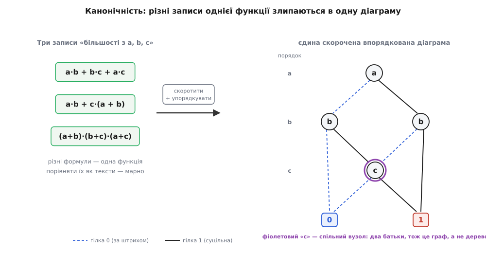
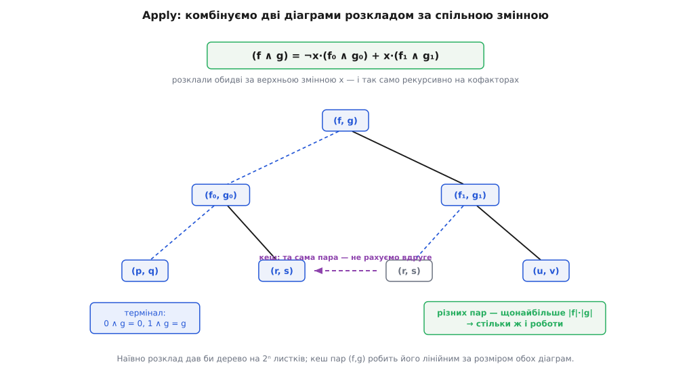
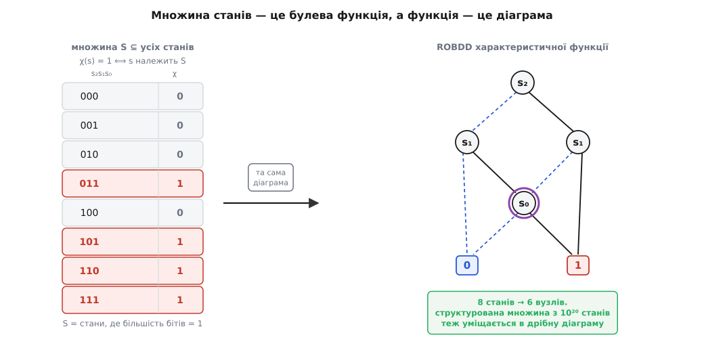

# Двійкова діаграма рішень (BDD)

<preknowlist>
- [Булева алгебра](topic:math-logic/boolean-algebra) — булеві функції, таблиця істинности, операції І (·), АБО (+), НЕ (¬).
- [Розклад Шеннона](topic:math-logic/shannon-expansion) — тотожність f = ¬x·f₀ + x·f₁: розтин функції за однією змінною на два простіші кофактори f₀ і f₁.
- [Двійкове дерево](topic:sf-algorithms/binary-tree) — вузол із двома нащадками; корінь, гілки, листки; шлях від кореня до листка.
- [Хеш-таблиця](topic:sf-algorithms/hash-table) — сховище «ключ → значення» зі сталим усередненим доступом; на ній тримаються унікальна таблиця й кеш операцій.
- [Рекурсія](topic:sf-algorithms/recursion) — зведення задачі до себе ж на менших входах; усі операції над BDD рекурсивні.
</preknowlist>

Дали вам дві логічні схеми — два кола з вентилів І, АБО, НЕ — і одне питання: чи обчислюють вони **ту саму** функцію? Може, друга — спрощена версія першої, і треба переконатися, що спрощення нічого не зіпсувало. Може, це два незалежні проєкти, і хочеться знати, чи вони збігаються. На вигляд схеми різні: інша кількість вентилів, інші проміжні сигнали. Але вигляд ще нічого не каже — дві геть несхожі формули можуть задавати одну функцію.

Найпрямолінійніша відповідь — перебрати всі входи. Для `n` змінних це **2ⁿ** комбінацій: тридцять входів — уже мільярд перевірок, шістдесят — більше, ніж атомів у кімнаті. Другий шлях — довести рівність алгеброю, перетворюючи одну формулу на іншу. Але питання «чи ця булева формула тотожно істинна» — це [задача здійсненности (SAT)](topic:computability/boolean-satisfiability) у масці, а для неї не знають способу швидшого за перебір у найгіршому разі. Обидва прямі шляхи впираються в експоненту.

І тут варто спитати інакше. Ми весь час намагаємося **порівняти** два подання функції. А що, якби подання було таке, що рівні функції виглядають **однаково** — байт у байт, вузол у вузол? Тоді питання «чи вони рівні» перетворюється на «чи це той самий об'єкт», а це — одне порівняння, а не мільярд. Структуру даних судять не за тим, як гарно вона щось зберігає, а за тим, які **питання** вона робить дешевими. Двійкова діаграма рішень (BDD; від гр. *diágramma* — накреслення) — це подання булевої функції, скроєне рівно під це: воно зазвичай компактне, а головне — **канонічне** (гр. *kanón* — правило, мірило), тобто в кожної функції за домовленого порядку змінних воно **єдине**. Побудуймо його від причини й побачимо, звідки береться ця єдиність і що вона дарує.

### Розтин, що породжує дерево

Почнімо з інструмента, який дозволяє «розібрати» функцію на частини, — з [розкладу Шеннона](topic:math-logic/shannon-expansion). Візьмімо будь-яку змінну, скажімо `a`, і спитаймо окремо: якою стане функція, коли `a = 0`, і якою — коли `a = 1`? Кожна відповідь — це вже функція від решти змінних, простіша за вихідну; їх звуть **кофакторами** (лат. *co-* — спільно, *factor* — чинник) і позначають `f₀` та `f₁`. Сама функція збирається з них назад однією тотожністю:

```
f  =  ¬a·f₀  +  a·f₁
```

Читається дослівно: «якщо `a` — нуль, візьми `f₀`; якщо `a` — одиниця, візьми `f₁`». Розтин можна повторювати: розклали за `a`, тоді кожен кофактор розкладімо за наступною змінною, і так до кінця. Виходить **двійкове дерево рішень**: корінь питає про першу змінну, його діти — про другу, і кожен шлях від кореня вниз перевіряє всі змінні по черзі, доки не впреться в листок — готову відповідь `0` або `1`. Домовмося малювати гілку «0» штриховою, а гілку «1» — суцільною; тоді шлях згори донизу читається як конкретний набір входів, а листок на його кінці — значення функції на цьому наборі.

Дерево наочне, але за розміром воно нічого не виграло: у повного дерева від `n` змінних — **2ⁿ** листків, та сама вибухова кількість, що й у таблиці істинности. Проте, на відміну від таблиці, у дереві **видно надмірність** — і саме її можна виполоти.

### Два скорочення перетворюють дерево на граф

Придивімося, де в дереві марнується місце. Надмірність буває двох різновидів, і кожному відповідає одне правило прибирання.

**Перше — зайве питання.** Трапляється вузол, обидві гілки якого — «0» і «1» — ведуть в **одне й те саме** місце. Це означає, що змінна, яку він перевіряє, тут ні на що не впливає: хоч 0, хоч 1 — далі однаково. Такий вузол не вирішує нічого; викиньмо його, а стрілки, що вели до нього, перенаправмо просто на його спільного нащадка.

**Друге — двійники.** Трапляються два різні вузли, що перевіряють одну змінну й мають **однакову** гілку «0» і **однакову** гілку «1». Вони задають ту саму підфункцію — то навіщо тримати обидва? Лишімо один, а всі посилання на другий перенаправмо на нього.

Застосовуймо ці два правила, доки є що прибирати. Щойно двійники починають зливатися, стається головне: вузол, який був окремим листочком дерева, тепер має **кількох батьків** — на нього вказують з різних місць. А структура, де у вузла може бути більше одного батька і водночас немає жодного циклу (з вершини не можна, йдучи за стрілками, повернутися до неї ж), — це вже не дерево, а **орієнтований ациклічний граф** (гр. *a-* — не, *kýklos* — коло; англ. DAG). Дерево з 2ⁿ листків стискається у граф, де кожна **різна** підфункція живе в єдиному екземплярі, а два термінали (лат. *terminus* — межа) — `0` і `1` — спільні на всю діаграму.

**Побудуймо діаграму «більшости» — maj(a, b, c), що дає 1, коли серед a, b, c одиниць щонайменше дві.**

```
Таблиця істинности                Розтин за a (розклад Шеннона):
 a b c | maj
 0 0 0 |  0      a = 0:  лишається «b і c обидва по 1»  →  f₀ = b·c
 0 0 1 |  0      a = 1:  лишається «b або c хоч один»   →  f₁ = b + c
 0 1 0 |  0
 0 1 1 |  1      Отже  maj = ¬a·(b·c) + a·(b + c).
 1 0 0 |  0
 1 0 1 |  1      Розкладімо кофактори за b:
 1 1 0 |  1        b·c :  b = 0 → 0,   b = 1 → c
 1 1 1 |  1        b+c :  b = 0 → c,   b = 1 → 1
```

Обидва кофактори на дні впираються в **ту саму** підфункцію — «перевір `c`: якщо 0 → 0, якщо 1 → 1», тобто просто `c`. За другим правилом два однакові `c`-вузли зливаються в один. І ось результат: діаграма з чотирьох вузлів-питань (`a`, лівий `b`, правий `b`, спільний `c`) та двох терміналів. Вісім листків повного дерева злиплися в дрібний граф, а той єдиний `c` із двома батьками — це рівно те місце, де дерево стало графом.

> 🔧 **Навіщо це.** Спільний вузол — це не косметика, а пам'ять. У реальному пакеті BDD одна підфункція, хай на неї посилаються тисячі разів, зберігається **раз**. Саме тому діаграма функції з десятками змінних часто важить кілобайти там, де таблиця істинности не влізла б у всесвіт: платимо не за кількість входів, а за кількість **різних** підфункцій, а їх зазвичай куди менше.

### Порядок — і чому він робить діаграму єдиною

Одного скорочення ще замало, щоб рівні функції гарантовано виглядали однаково. Уявімо, що один автор розкладав змінні в порядку `a, b, c`, а інший — `c, a, b`. Обидва здобудуть правильні, повністю скорочені діаграми тієї самої функції, але **різні** на вигляд — бо перевіряють змінні в різній послідовності. Порівняти їх поглядом знову не вийде.

Ліки прості: домовитися про **один** порядок змінних наперед і будувати всі діаграми лише в ньому — щоб на кожному шляху змінні йшли строго `x₁, x₂, …, xₙ`, ніколи не забігаючи й не повертаючись. Скорочену діаграму, побудовану в такому фіксованому порядку, називають **скороченою впорядкованою двійковою діаграмою рішень** (ROBDD — *reduced ordered* BDD); зазвичай, кажучи «BDD», мають на увазі саме її.

І тепер — те, заради чого все затівалося. **За фіксованого порядку змінних повністю скорочена діаграма функції — єдина.** Двох різних правильних діаграм тієї самої функції не буває: обидва джерела неоднозначности (зайві вузли й двійники) прибрані, а порядок закріплений, тож лишається рівно одна форма. Це і є **канонічність**. Строге доведення — коротка [індукція за числом змінних](topic:hw-digital/binary-decision-diagram/math-canonicity.md): вона показує, що скорочена форма кофакторів визначена однозначно, а отже, й уся діаграма над ними. Результат — скорочення плюс порядок дають канонічну форму, з ефективними алгоритмами до неї — це підсумок роботи Рендела Брайанта (*Bryant*) 1986 року; сама форма старша (її подав Ч. Лі в Bell Labs 1959-го, а назву дав Ш. Акерс 1978-го), але єдиною її зробило саме **обмеження** порядку.


*Три несхожі записи функції «більшість із a, b, c» — суму добутків, винесення спільного множника, добуток сум — годі порівняти як тексти. Але кожен, пройшовши крізь скорочення й фіксований порядок `a → b → c`, злипається в ту саму діаграму. Рівність функцій стала рівністю малюнків.*

Що з цього випливає — низка колись важких питань, які на канонічній діаграмі стають майже безкоштовними:

- **Еквівалентність.** Дві функції рівні тоді й лише тоді, коли їхні діаграми — той самий об'єкт. Побудували обидві, порівняли корені — і все. Те, що для формул було задачею рівня SAT, тут коштує одне порівняння.
- **Тавтологія** (функція тотожно істинна): чи вся діаграма — це просто термінал `1`?
- **Суперечність** (тотожно хибна): чи це просто термінал `0`?
- **Здійсненність** (чи існує хоч один набір, що дає 1): чи діаграма — **не** термінал `0`? А якщо здійсненна, то й приклад набору читається одразу — будь-який шлях, що веде в `1`, за `n` кроків згори вниз.

> 🔧 **Навіщо це.** На цьому стоїть перевірка еквівалентности в проєктуванні мікросхем (EDA): після кожного автоматичного перетворення схеми — оптимізації, вставки буферів, [відображення в LUT](topic:hw-digital/lut-mapping) — треба довести, що функція не змінилася. Будують BDD «до» і «після», звіряють корені; збіг — гарантія, що інструмент нічого не зламав. Мільярд входів перевірено одним порівнянням покажчиків.

Ця роль канонічної форми не унікальна для булевих функцій: рівно так само [мінімальний скінченний автомат](topic:computability/state-minimization) єдиний для своєї мови, і два автомати рівносильні тоді й лише тоді, коли їхні мінімальні форми збігаються. BDD — це той самий прийом «звести об'єкт до єдиного канонічного представника», перенесений на булеві функції.

### Порядок вирішує розмір — інколи катастрофічно

За єдиність доводиться платити, і плата ось яка: **розмір діаграми залежить від обраного порядку змінних**, і залежить різко. Та сама функція в одному порядку буває лінійною, а в іншому — експоненційною.

Класичний приклад — функція «попарного збігу» `f = a₁·b₁ + a₂·b₂ + … + aₙ·bₙ`. Поставмо змінні **упереміш**: `a₁, b₁, a₂, b₂, …`. Тоді діаграма, спускаючись, перевіряє пару `(aᵢ, bᵢ)` і одразу забуває її: або добуток уже дав 1 (тоді вся функція 1), або йдемо до наступної пари з чистими руками. На кожному рівні — жменька вузлів, разом їх ≈ 2n, лінійно. А тепер поставмо **блоками**: спершу всі `a`, потім усі `b`. Тепер, перевіривши всі `a`, діаграма мусить **пам'ятати** кожне з n значень, щоб згодом було з чим порівнювати `b`. А запам'ятати n бітів — це 2ⁿ можливих станів пам'яті, тобто 2ⁿ вузлів. Функція та сама — розмір відрізняється в експоненту разів.

За цим стоїть точна інтуїція: **ширина діаграми на будь-якому рівні — це те, скільки інформації про вже перевірені змінні треба донести до тих, що попереду**. Гарний порядок ставить поряд ті змінні, що взаємодіють, — тоді нести майже нічого. Поганий розриває їх — і між частинами доводиться тягти цілий стан.

Звідси два тверезі наслідки. Перший: знайти **оптимальний** порядок — задача важка; питання «чи існує порядок, що дає діаграму не більшу за задану» — NP-повне (Bollig, Wegener, 1996), тож на практиці користуються евристиками й **динамічним переставлянням** змінних просто під час роботи (метод «просіювання» — sifting). Другий, суворіший: є функції, у яких діаграма велика за **будь-якого** порядку. Найвідоміша — **множення**: середній біт добутку двох n-бітових чисел вимагає щонайменше 2^(n/8) вузлів, хоч як переставляй змінні (Bryant, 1991). BDD — не чарівна паличка: вона виграє, коли функція має структуру, яку добрий порядок оголює, і безсила, коли такої структури немає. Тому BDD чудова для схем керування, протоколів, залежностей — і безпорадна проти арифметичного множення.

### Рахувати розв'язки одним проходом

Канонічна діаграма відповідає не лише на «чи існує розв'язок», а й на значно тонше «а **скільки** їх». Питання «скільки наборів входів дають 1» — це підрахунок розв'язків, і взагалі він належить до [класу складности #P](topic:computability/sharp-p-counting), тобто в найгіршому разі важчий за просту здійсненність. Але на готовій BDD він розв'язується одним проходом графом.

**Скільки наборів дають maj = 1? Порахуймо знизу вгору, не торкаючись усіх 2ⁿ рядків.**

Ідея: для кожного вузла порахуймо, скільки наборів (зі змінних від його рівня й нижче) ведуть у термінал `1`. Термінал `1` дає 1, термінал `0` дає 0. Для вузла-питання це сума по двох гілках — але з поправкою: якщо гілка **перестрибує** через рівні (пропущені змінні, що вилетіли під час скорочення), її внесок множиться на `2ᵏ`, бо кожна пропущена змінна вільна — годяться обидва її значення.

```
Порядок a, b, c.  Рівні: a → 0, b → 1, c → 2, термінали → 3.
Внесок гілки = count(куди веде) × 2^(пропущені рівні).

вузол c :       гілка 0 → терм.0 : 0        count = 0 + 1        = 1
                гілка 1 → терм.1 : 1
вузол b (b·c):  гілка 0 → терм.0, ×2 (нема c): 0×2 = 0
                гілка 1 → вузол c            : 1×1 = 1  count = 1
вузол b (b+c):  гілка 0 → вузол c            : 1×1 = 1
                гілка 1 → терм.1, ×2 (нема c): 1×2 = 2  count = 3
корінь a :      гілка 0 → b(b·c): 1;  гілка 1 → b(b+c): 3
                count = 1 + 3                                    = 4
```

Розв'язків — **4** (це набори 011, 101, 110, 111). Проходів було по одному на вузол — шість, а не 2³ = 8 рядків таблиці; для функції від `n` змінних це `O(розмір діаграми)`, а не `O(2ⁿ)`. Ось чому BDD цінують там, де треба не просто знайти розв'язок, а **перелічити** чи **порахувати** їх: скільки конфігурацій системи безпечні, скільки шляхів у схемі ведуть до відмови. Дорога в загальному випадку задача стає лінійним обходом — за умови, що діаграма помістилася.

### Комбінувати функції: алгоритм Apply

Досі ми діаграму лише будували й розпитували. Але справжня сила структури — у тому, що функції можна **комбінувати, не розгортаючи їх назад**. Маємо BDD для `f` і для `g` — і хочемо BDD для `f · g`, `f + g`, `f ⊕ g`, будь-якої логічної комбінації, знову ж таки скорочену й упорядковану, без проміжного дерева на 2ⁿ листків. Це робить алгоритм **Apply**.

Ключ до нього — що розклад Шеннона **узгоджується** з логічними операціями. Візьмімо найвищу за порядком змінну `x`, за якою питає хоч одна з двох діаграм, і розкладімо за нею **обидві** функції одразу:

```
f ∧ g  =  ¬x·(f₀ ∧ g₀)  +  x·(f₁ ∧ g₁)
```

(тут `∧` — та сама кон'юнкція, що й `·`). Тобто «`f` І `g`» зводиться до двох менших «`f` І `g`» — на кофакторах. Узяти кофактор діаграми за `x` дешево: якщо її корінь питає саме про `x`, кофактор `f₀` — це його гілка «0», а `f₁` — гілка «1»; якщо ж корінь питає про пізнішу змінну (тобто від `x` не залежить), обидва кофактори — це сама діаграма. Рекурсія спускається до самого дна, де хоча б одна сторона стала терміналом, — а там відповідь очевидна: `0 · g = 0`, `1 · g = g`. З цих терміналів результат збирають назад тим самим правилом породження вузла (з обома скороченнями), тож на виході одразу канонічна діаграма.

Одне «але» робить різницю між іграшкою й інструментом. Наївно рекурсія розгалужується вдвічі на кожній змінній — знову 2ⁿ викликів. Але придивімося: різних **пар** `(f, g)`, що можуть трапитися, небагато — не більше, ніж вузлів у першій діаграмі, помножити на вузли в другій. А отже, багато пар повторюються. Тож запам'ятовуймо вже пораховане: пару `(f, g)` разом із результатом кладемо в кеш, і на повторний запит віддаємо готове, не рахуючи вдруге. Це [мемоізація](topic:sf-algorithms/memoization) (лат. *memorare* — запам'ятовувати), і вона перетворює експоненту на добуток: `O(|f|·|g|)` — стільки, скільки різних пар, стільки й роботи.


*Дерево викликів `Apply(∧)`. Кожен виклик розтинає пару за верхньою змінною на дві менші пари кофакторів. Коли та сама пара `(r, s)` виникає вдруге, кеш віддає готовий результат — і дерево, що наївно розрослося б до 2ⁿ листків, стискається до числа різних пар.*

Замість окремих процедур для І, АБО, XOR пакети BDD зазвичай мають **одну** універсальну операцію — потрійну `ITE(f, g, h)` (*if-then-else*, «якщо f, то g, інакше h»), тобто `f·g + ¬f·h`. Крізь неї виражається геть усе: `І(f, g) = ITE(f, g, 0)`, `АБО(f, g) = ITE(f, 1, g)`, `НЕ f = ITE(f, 0, 1)`, `XOR(f, g) = ITE(f, ¬g, g)`. Тож увесь алгебраїчний апарат — це один рекурсивний обхід із одним кешем; [робоча реалізація з обома таблицями — в окремому розборі](topic:hw-digital/binary-decision-diagram/proj-apply.md).

> 🔧 **Навіщо це.** Саме тому пакет BDD компактний, але всемогутній: замість десятка операцій — одна рекурсія `ITE` на кілька десятків рядків, і вона вже вміє все булеве числення. Додати нову операцію — це підібрати трійку аргументів до `ITE`, а не писати новий алгоритм.

### Дві таблиці, на яких усе тримається

Уся ця машинерія спирається на дві хеш-таблиці, і варто розрізняти їхні ролі, бо плутають їх часто.

**Унікальна таблиця** стереже канонічність. Перш ніж створити вузол `(змінна, гілка-0, гілка-1)`, реалізація шукає такий ключ у цій таблиці: якщо він уже є — повертає **наявний** вузол, нового не робить. Це прийом «спільного зберігання однакового» (*hash-consing*): двох структурно однакових вузлів у пам'яті просто не існує, тож структурна рівність збігається з рівністю покажчиків, а канонічність тримається **глобально** — не лише всередині однієї функції, а між усіма функціями пакета. Тому й еквівалентність двох BDD — це порівняння покажчиків: вони або той самий вузол, або ні.

**Кеш операцій** (*computed table*) стереже швидкість. Це та сама мемоізація з `Apply`: результати `ITE(f, g, h)` складають сюди за ключем-трійкою, щоб повторний виклик віддав готове. Унікальна таблиця тримає граф **малим** (нічого не дублюється), кеш операцій тримає обчислення **швидкими** (нічого не рахується двічі). Обидві — звичайні [хеш-таблиці](topic:sf-algorithms/hash-table), і саме їхня пара робить BDD не академічною цікавинкою, а робочим інструментом.

### Множина — це булева функція

Тепер — поворот, який пояснює, чому діаграми рішень свого часу перевернули цілу галузь. Досі йшлося про функції. Але **множина** — це теж функція. Візьмімо будь-яку множину `S` бітових векторів (наприклад, наборів входів) і зіставмо їй **характеристичну функцію** `χ`: `χ(s) = 1`, коли `s` належить `S`, і `0` інакше. Множина та її характеристична функція — це буквально одне й те саме, записане по-різному. А отже, множину можна тримати як BDD.

І тут структура показує весь розмах. Множину з астрономічним числом елементів, **якщо вона має структуру**, характеристична функція описує компактно, а BDD — тим паче. Мільярд векторів, що підкоряються простому правилу, вміщається в дрібну діаграму — так само, як «більшість із трьох бітів» уміщається в шість вузлів.


*Множина `S` (стани, де більшість бітів — одиниці) як таблиця характеристичної функції `χ`, а поряд — її діаграма. Це та сама діаграма «більшости»: множина, функція й граф — три погляди на один об'єкт. Ключове: діаграма росте не з числа елементів, а зі складности **правила**, тож структурована множина з 10²⁰ станів теж може важити копійки.*

Далі — те, заради чого все й будувалося. Не лише множина, а й **відношення** — це булева функція: «зі стану `s` система за один крок може перейти в стан `s′`» — це функція від двох наборів бітів, `(s, s′)`, яку теж можна тримати як BDD. А маючи характеристичну функцію множини станів і функцію переходів, «які стани досяжні за один крок» обчислюють однією комбінацією операцій — Apply плюс **квантор існування** по змінних поточного стану, а сам квантор — це знову Apply: `∃xᵢ f = f|xᵢ=0 + f|xᵢ=1` (є перехід або при `xᵢ = 0`, або при `xᵢ = 1`). Повторюючи цей крок до нерухомої точки, дістають **усю** множину досяжних станів — не перелічивши жодного поодинці.

Так народилася **символьна перевірка моделей**: замість переліку станів по одному система тримається як булева функція, і питання «чи можна колись дістатися поганого стану» стає обчисленням над BDD. Це дозволило перевіряти системи з 10²⁰ станів і більше (Burch, Clarke, McMillan, Dill, Hwang, 1990) — там, де прямий перелік не мав жодних шансів, — і зробило BDD осердям апаратної [формальної верифікації](topic:sf-release/formal-verification). Як саме канонічна форма 1986 року за кілька років перетворила верифікацію зі знемоги на індустрію — [окрема історія](topic:hw-digital/binary-decision-diagram/hist-model-checking.md).

### Родичі, коли класична BDD не пасує

Класична ROBDD — не остання зупинка, і два її родичі варто знати, бо кожен народився з конкретної незручности. Коли множини **розріджені** (у типовому наборі майже всі змінні — нулі, як у списках небагатьох обраних елементів), вигіднішим стає **ZDD** — діаграма з «нульовим приглушенням» (*zero-suppressed*, Minato, 1993): інше правило скорочення, підігнане саме під розрідженість, і для таких множин діаграма виходить меншою. А коли функція веде не в `{0, 1}`, а в ширший набір значень — числа, ймовірності, ваги, — беруть **багатотермінальні** діаграми (MTBDD / ADD): та сама ідея спільних підграфів, але листків більше, ніж два. Обидва — та сама конструкція «розтин за змінною плюс спільне зберігання», перенастроєна під інший різновид даних.

Коло замикається на тому, з чого почали. BDD виторговує свободу формул — де одна функція має тисячу облич — на дисципліну єдиної форми, і цією ціною купує здатність **відповідати**: рівні чи ні, здійсненна чи ні, скільки розв'язків, чи досяжний поганий стан — усе поглядом на граф, а не пошуком. Вона виграє рівно там, де у функції є структура й добрий порядок її оголює, і чесно програє, коли структури немає, — як доведено на множенні. Тому цінність цієї структури даних вимірюється не тим, скільки вона зберігає, а тим, які питання перестають бути важкими: чи два проєкти — та сама схема, і чи вміє система колись зламатися.
