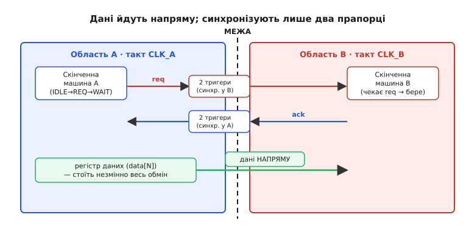
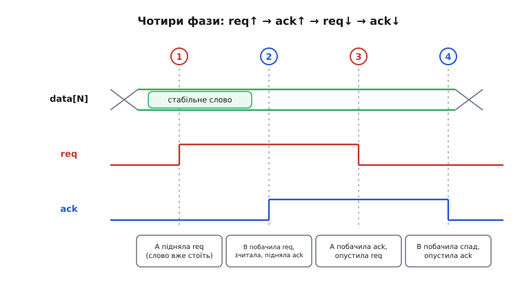

# ⚙️ Рукостискання між тактовими доменами

Є одне слово — команда, адреса, поле конфігурації, — яке треба зрідка перекинути з області A в область B, а такти в них не пов'язані. Синхронізувати кожен біт окремо не можна: біти приїдуть урізнобій і складуться в число, якого ніколи не було. Код Грея теж не рятує, бо слово довільне — за один запис може змінитися скільки завгодно бітів разом. Лишається третій шлях, найнадійніший із усіх: **рукостискання** (англ. *handshake* — «потиск рук»), коли дві сторони не женуть дані наосліп, а домовляються про кожну передачу.

Головну ідею вже названо в статті-власнику: **самі дані не синхронізуємо взагалі** — вони просто стоять на звичайних дротах; синхронізуємо лише два керівні прапорці — «дані готові» (*request*) і «прийняв» (*acknowledge*), кожен по одному біту, а одному біту двотактовий синхронізатор цілком до снаги. Тут ми розберемо це рукостискання **до дна**: намалюємо обидві скінченні машини по такту, побачимо, чому фаз саме чотири, напишемо **робочу прошивку** — і цикл, що моделює логіку по фронту такту, і справжній обмін між двома незалежними контекстами мікроконтролера, — а тоді пройдемося пасткам, на яких валиться навіть правильна на вигляд схема.

## Задача: одне слово, дві сторони, спільна домовленість

Сформулюймо чітко, щоб не розпливтися. Дано:

- в області A (такт `CLK_A`) періодично народжується **слово** `data` завширшки, скажімо, 32 біти;
- його треба доставити в область B (такт `CLK_B`) **цілим** — B має побачити або повністю старе, або повністю нове значення, ніколи проміжне;
- передачі **рідкі й поодинокі** (нове слово — раз на багато тактів), тож можна дозволити собі «церемонію» на кожне з них;
- такти `CLK_A` і `CLK_B` **не пов'язані**: різні частоти, різні фази, будь-яке співвідношення, аж до майже однакових (найпідступніший випадок, бо фронти повільно «наповзають» один на одного).

Наївне «завести шину напряму й защіпнути в B» ми вже відкинули в статті-власнику: 32 біти долають межу через 32 незалежні синхронізатори, кожен зі своїм випадковим запізненням, і приймач між тактами N та N+1 бачить мішанину. Питання тільки одне: як зробити, щоб **у мить, коли B зчитує шину, шина гарантовано стояла незмінно вже давно** — довше, ніж триває будь-яка метастабільність. Рукостискання дає саме цю гарантію, і дає її **одним бітом**.

> 🔧 **Навіщо це.** Цей самий візерунок ви зустрінете скрізь, де два незалежні «двигуни» обмінюються не потоком, а окремими повідомленнями: команда від процесора до апаратного прискорювача на іншому такті, поле конфігурації в радіомодуль, «мейлбокс» між двома ядрами, обмін між перериванням від зовнішнього давача й головним циклом. Хто вміє скласти надійне рукостискання руками, той не боїться жодної такої межі й не тулить туди FIFO там, де вистачить чотирьох сигналів.

## Ідея: синхронізуємо домовленість, а не вантаж

Уся хитрість тримається на одному спостереженні. **Дані — багатобітні, і тому небезпечні. Прапорець — однобітний, і тому безпечний.** Отже, перекладімо всю відповідальність за перетин межі на прапорці, а дані лишімо стояти на дротах непорушно.

Розгорнімо ланцюжок причин.

Область A, коли має нове слово, спершу **виставляє його на шину** й тримає там незмінно. Аж тоді, окремим тактом пізніше, вона піднімає прапорець `req` = 1. Прапорець іде в область B через звичайний двотактовий синхронізатор — той самий, що рятує один біт: перший тригер приймає удар і має цілий період `CLK_B`, щоб розв'язати можливу метастабільність, другий віддає вже чистий сигнал. Механізм цього однобітного синхронізатора й фізику зависання ми не переписуємо — суть у зносці.

> **Синхронізатор одного біта — фундамент усього.** Однобітний асинхронний сигнал не можна заводити прямо в логіку: рано чи пізно його фронт припаде рівно на фронт приймача, порушить вікно setup/hold і на такт защіпне метастабільний рівень «ні 0 ні 1». Ліки — **два тригери поспіль на такті приймача**: перший ловить можливе зависання й має повний період, щоб «дозвеніти» до 0 чи 1, другий зчитує вже усталене й віддає в логіку чистий біт. Ціна — **два такти затримки** й вимога, щоб сигнал тримався достатньо довго. Саме цим синхронізатором ми проводимо `req` у бік B і `ack` у бік A. Детально — [двотактовий синхронізатор](root:hw-digital/metastability-timing/proj-two-ff-synchronizer.md) і сама [метастабільність](root:hw-digital/metastability-timing).

Тепер ключова думка. Поки прапорець `req` повз крізь два тригери синхронізатора, у B **минуло щонайменше два такти** `CLK_B`. А слово на шині стоїть **ще довше** — воно з'явилося ДО того, як A підняла `req`. Тож коли машина B нарешті бачить синхронізований `req` = 1, шина під ним уже давним-давно застигла: жодного руху, жодного заборонного вікна. B спокійно защіпає **всі 32 біти разом**, одним фронтом, і дістає цілісне значення. Метастабільність могла бути тільки на однобітному `req` — і її вже погасив синхронізатор.

Прийнявши слово, B піднімає власний прапорець `ack` = 1 і шле його назад в A — так само через двотактовий синхронізатор, тепер уже на такті `CLK_A`. A бачить `ack`, розуміє «дійшло», і опускає `req` = 0. B бачить, що `req` спав, і у відповідь опускає `ack` = 0. Коло замкнулося: обидва прапорці знову внизу, і система готова до наступного слова.


*Слово `data` перетинає межу звичайними дротами, без жодного синхронізатора — його ніхто не защіпає, поки воно рухається. Синхронізують лише два однобітні прапорці: `req` через двійку тригерів у домені B, `ack` — через двійку тригерів у домені A. Кожен домен має свою маленьку скінченну машину, і саме їхній діалог гарантує, що B зчитує шину лише тоді, коли вона давно стоїть.*

Отут і криється краса: **жоден біт даних не проходить через синхронізатор**. Синхронізуються два прапорці, по одному в кожен бік, і кожен — один біт, для якого все давно вирішено. Дані ж просто «чекають» на дротах, поки домовленість дозволить їх узяти.

## Чому фаз саме чотири

Придивімося до кола `req↑ → ack↑ → req↓ → ack↓`. Це **чотирифазне рукостискання** (англ. *four-phase handshake*), його ще звуть **протоколом з поверненням у нуль** (англ. *return-to-zero*), бо наприкінці обидва сигнали обов'язково вертаються в 0. Чотири фази — не примха, а мінімум, який дає кожній стороні **однозначно** зрозуміти партнера **рівнем**, а не миттю.

Пройдімо фази по одній і побачимо, що жодну не викинути.

```
Фаза 1  req: 0→1   A каже «слово на шині, бери»
Фаза 2  ack: 0→1   B каже «побачив, зчитав, тримаю»
Фаза 3  req: 1→0   A каже «знаю, що взяв; знімаю запит»
Фаза 4  ack: 1→0   B каже «бачу зняття; я теж готовий до наступного»
```


*Слово на шині (зелена смуга) стоїть незмінно від фази 1 і аж поки B його не зчитає — куди довше за будь-яку метастабільність прапорця. `req` (червоний) піднімається у фазі 1 й опускається у фазі 3; `ack` (синій) відповідає у фазі 2 і знімається у фазі 4. Кожен перехід — окрема домовленість, яку інша сторона бачить сталим рівнем після свого синхронізатора, а не короткочасним імпульсом.*

Чому не обійтися **двома** фазами — просто «A підняла `req`, B підняла `ack`, і все»? Бо тоді прапорці лишилися б угорі, і **наступну** передачу не було б чим відрізнити від попередньої. A виставила нове слово — але `req` уже й так = 1; як B здогадається, що це **нове**, а не те саме? Довелося б домовлятися про «зміну рівня = нова подія», і це справді робить **двофазний** протокол (про нього нижче) — але він вимагає, щоб обидві сторони пам'ятали попередній рівень і реагували на **перехід**, а не на рівень. Чотирифазний натомість щоразу вертає прапорці в 0, тож кожна передача починається з чистого аркуша — простіше й важче помилитися. Плата — вдвічі більше переходів (чотири замість двох), тобто трохи повільніше.

Порахуймо, у скільки тактів обходиться одне слово. Кожен перехід прапорця приймальна сторона бачить **не одразу**, а через свій двотактовий синхронізатор — плюс такт-два на реакцію самої машини. Груба, але чесна оцінка повного кола:

```
req↑ бачить B   ≈ 2 такти CLK_B  (синхронізатор)
B зчитала, ack↑ ≈ 1 такт  CLK_B
ack↑ бачить A   ≈ 2 такти CLK_A
A зняла req↓    ≈ 1 такт  CLK_A
req↓ бачить B   ≈ 2 такти CLK_B
B зняла ack↓    ≈ 1 такт  CLK_B
ack↓ бачить A   ≈ 2 такти CLK_A
────────────────────────────────
разом           ≈ 5 тактів B + 6 тактів A на одне слово
```

Тобто **приблизно десяток тактів обох областей** на кожну передачу. Для команди, що йде раз на тисячі тактів, це нічого; для суцільного потоку — задорого, і там уже потрібна [асинхронна черга FIFO](root:hw-digital/async-fifo). Це і є межа застосовності рукостискання: **рідкі поодинокі слова — так, потік — ні**.

## Дві скінченні машини

Серце схеми — дві маленькі **скінченні машини** (англ. *finite-state machine*, FSM): одна в A керує запитом, друга в B — прийманням. Кожна живе у своєму такті й «спілкується» з іншою лише через синхронізовані прапорці. Опишемо їхні стани словами, а тоді — кодом.

**Машина A (домен передавача), три стани:**

```
IDLE  — нема чого слати; req = 0. Коли з'явилося нове слово:
        виставити його на шину, перейти в SET_REQ.
SET_REQ (REQ) — тримати слово на шині, req = 1. Чекати ack_sync = 1.
        Побачила ack → перейти в CLEAR.
CLEAR (WAIT) — req = 0. Чекати, поки ack_sync знову впаде в 0
        (B побачила зняття запиту). ack_sync = 0 → назад в IDLE, готові до наступного.
```

**Машина B (домен приймача), теж три стани:**

```
WAIT_REQ (IDLE) — ack = 0. Чекати req_sync = 1.
        Побачила запит → зчитати шину в свій регістр, перейти в GOT.
GOT — дані взято; ack = 1. Чекати, поки req_sync впаде в 0.
        req_sync = 0 → перейти в DONE.
DONE — ack = 0 (зняли підтвердження). Одразу назад у WAIT_REQ.
```

Зверніть увагу на симетрію: кожна машина спершу **діє на підйом** прапорця партнера, тоді **чекає на його спад**. Саме це «чекати спаду» й реалізує третю та четверту фази — без них система застрягла б із піднятими прапорцями.

## Робочий код 1: логіка по фронту такту

Найчесніший спосіб показати цифрову схему в C — написати функцію, яку викликають **раз на фронт такту**, і яка робить рівно те, що зробили б тригери: читає входи, рахує наступний стан, оновлює виходи. Це не псевдокод — такий цикл-модель справді ганяють у прошивці програмного ядра (soft-core) чи в бітовому симуляторі логіки, і він **один-в-один** лягає на RTL. Тут добре видно, де саме сидять синхронізатори й чому їх по два тригери.

**Домен-передавач A: скінченна машина плюс нічого зайвого.** Викликається щофронту `CLK_A`.

```c
#include <stdint.h>
#include <stdbool.h>

// Стани машини A
typedef enum { A_IDLE, A_REQ, A_WAIT } a_state_t;

typedef struct {
    a_state_t state;
    uint32_t  data_out;   // шина в бік B: стоїть незмінно весь обмін
    bool      req;        // прапорець «дані готові» в бік B

    // Двотактовий синхронізатор ack, що приходить з домену B:
    // два тригери, тактовані CLK_A. ack_meta ловить можливу метастабільність,
    // ack_sync — уже чистий сигнал, яким користується машина.
    bool      ack_meta;
    bool      ack_sync;
} tx_t;

// Один фронт CLK_A. ack_in — сирий асинхронний ack з домену B.
// new_word/word — чи є що слати і що саме (з логіки-джерела в домені A).
void tx_clk(tx_t *s, bool ack_in, bool new_word, uint32_t word) {
    // 1) Синхронізатор ack: спершу засуваємо конвеєр тригерів.
    //    Порядок саме такий — новий сирий біт входить у meta,
    //    попереднє meta переходить у sync (як два тригери поспіль).
    s->ack_sync = s->ack_meta;
    s->ack_meta = ack_in;
    bool ack = s->ack_sync;        // чистий, синхронізований ack

    // 2) Скінченна машина за синхронізованим ack.
    switch (s->state) {
    case A_IDLE:
        s->req = false;
        if (new_word) {
            s->data_out = word;     // виставили слово на шину…
            s->req      = true;     // …і аж тепер підняли req (фаза 1)
            s->state    = A_REQ;
        }
        break;

    case A_REQ:
        // Слово тримаємо, req тримаємо. Чекаємо ack = 1 (фаза 2 дійшла).
        if (ack) {
            s->req   = false;       // фаза 3: знімаємо запит
            s->state = A_WAIT;
        }
        break;

    case A_WAIT:
        // req уже 0. Чекаємо, поки ack теж упаде (фаза 4 дійшла).
        if (!ack) {
            s->state = A_IDLE;      // коло замкнулося, готові до наступного
        }
        break;
    }
}
```

**Домен-приймач B: дзеркальна машина, що защіпає шину одним махом.** Викликається щофронту `CLK_B`.

```c
// Стани машини B
typedef enum { B_WAIT, B_GOT, B_DONE } b_state_t;

typedef struct {
    b_state_t state;
    uint32_t  data_latched;  // сюди защіпається ціле слово
    bool      got;           // прапорець: є свіже прийняте слово
    bool      ack;           // прапорець «прийняв» у бік A

    // Двотактовий синхронізатор req, тактований CLK_B.
    bool      req_meta;
    bool      req_sync;
} rx_t;

// Один фронт CLK_B. req_in — сирий асинхронний req з домену A.
// bus — поточне значення шини data (те, що A виставила й тримає).
void rx_clk(rx_t *s, bool req_in, uint32_t bus) {
    // 1) Синхронізатор req: два тригери поспіль.
    s->req_sync = s->req_meta;
    s->req_meta = req_in;
    bool req = s->req_sync;         // чистий, синхронізований req

    s->got = false;                 // імпульс «нове слово» тримаємо один такт

    // 2) Скінченна машина за синхронізованим req.
    switch (s->state) {
    case B_WAIT:
        s->ack = false;
        if (req) {
            // req уже давно 1 (пройшов 2 тригери), отже шина під ним
            // стоїть незмінно ще довше — можна брати ВСІ біти разом.
            s->data_latched = bus;   // цілісний захват 32 бітів одним фронтом
            s->got          = true;  // сигнал логіці B: слово готове
            s->ack          = true;  // фаза 2: підтверджуємо
            s->state        = B_GOT;
        }
        break;

    case B_GOT:
        // ack тримаємо. Чекаємо, поки req упаде (фаза 3 дійшла).
        if (!req) {
            s->ack   = false;        // фаза 4: знімаємо підтвердження
            s->state = B_DONE;
        }
        break;

    case B_DONE:
        s->ack   = false;
        s->state = B_WAIT;           // одразу назад у чекання
        break;
    }
}
```

Зверніть увагу на три речі, що роблять цей код правильним, а не «майже правильним».

По-перше, у синхронізаторі **спершу** переписуємо `sync ← meta`, і **тоді** `meta ← вхід`. Це моделює два тригери, що защіпають **одночасно** по фронту: старе значення першого перетікає в другий, а новий вхід — у перший. Поміняй порядок місцями — і сигнал пройде обидва тригери за один такт, тобто синхронізатора наче й не було.

По-друге, машина B защіпає `bus` **у тому такті, коли вперше побачила `req_sync = 1`**. До цього моменту `req` пройшов два тригери — щонайменше два повні періоди `CLK_B`, — а шина стоїть іще довше. Тому захват `s->data_latched = bus` цілком безпечний: під ним давно нічого не рухається.

По-третє, `got` тримається **рівно один такт** (на початку функції гасимо його в `false`). Це «строб» — імпульс завширшки в такт, яким логіка B розуміє: «саме зараз з'явилося свіже слово». Без гасіння він завис би в 1 назавжди.

## Робочий код 2: справжній обмін у прошивці

Модель по такту прекрасно пояснює логіку, але в живому мікроконтролері ви рідко пишете тактовий цикл руками. Куди частіше «дві тактові області» — це **два незалежні контексти виконання**: обробник переривання, що спрацьовує від власного давача чи таймера, і головний цикл; або два ядра. Вони теж «асинхронні» одне до одного — переривання може вдарити будь-якої миті головного циклу, — і той самий багатобітний CDC вигулькує тут як зіпсована структура, зчитана посеред запису.

Покажемо **робочу прошивку**: обробник переривання (грає роль домену A) складає багатослівне повідомлення, головний цикл (домен B) його забирає, і між ними — те саме рукостискання. Дані — напряму в спільній пам'яті; синхронізуються лише прапорці.

```c
#include <stdint.h>
#include <stdbool.h>

// Повідомлення завширшки кілька слів — саме той «багатобітний вантаж»,
// який не можна читати посеред запису.
typedef struct {
    uint32_t timestamp;
    uint32_t value;
    uint16_t channel;
    uint16_t flags;
} sample_t;

// Спільний «мейлбокс» між ISR та головним циклом.
// ВАЖЛИВО: прапорці — volatile, бо їх пише один контекст, а читає інший;
// без volatile компілятор має право закешувати їх у регістрі й ніколи
// не перечитати з пам'яті — і цикл зависне назавжди.
static volatile bool     mbx_req = false;   // ISR → main: «дані готові»
static volatile bool     mbx_ack = false;   // main → ISR: «прийняв»
static          sample_t mbx_data;          // самі дані (під захистом прапорців)

// ── Домен A: обробник переривання від давача ────────────────────────────
// Викликається апаратно, асинхронно до головного циклу.
void sensor_isr(void) {
    // Якщо попереднє слово ще не забрали (req уже стоїть) — не чіпаємо
    // мейлбокс, інакше перепишемо дані з-під носа читача. Пропускаємо відлік
    // (або, за потреби, накопичуємо окремо) — але НІКОЛИ не рвемо обмін.
    if (mbx_req)
        return;

    // Фаза 0: наповнюємо дані ДО підняття прапорця.
    mbx_data.timestamp = hw_read_timer();
    mbx_data.value     = hw_read_adc();
    mbx_data.channel   = hw_read_channel();
    mbx_data.flags     = hw_read_flags();

    // Бар'єр пам'яті: усі записи в mbx_data мусять лягти в пам'ять
    // ДО того, як стане видимим mbx_req. Інакше процесор чи компілятор
    // можуть переставити порядок, і читач побачить req=1 над недописаними даними.
    __asm volatile ("" ::: "memory");   // компіляторний бар'єр
    // (на багатоядерних — тут потрібен апаратний бар'єр, напр. DMB на ARM)

    mbx_req = true;                     // фаза 1: піднімаємо запит
    // Далі ISR виходить; підтвердження перевіримо наступного разу.
}

// ── Домен B: головний цикл ──────────────────────────────────────────────
void main_loop(void) {
    for (;;) {
        // Чекаємо запит. mbx_req — volatile, тож справді перечитуємо щоразу.
        if (mbx_req && !mbx_ack) {
            // req стоїть → дані повністю дописані (їх поставили ДО req,
            // а бар'єр не дав переставити). Беремо структуру ЦІЛОЮ.
            sample_t local = mbx_data;      // єдине, цілісне копіювання

            __asm volatile ("" ::: "memory");
            mbx_ack = true;                 // фаза 2: підтверджуємо прийом

            // Обробляємо СВОЮ копію — mbx_data вже вільна для ISR.
            process_sample(&local);
        }

        // Завершуємо коло: коли ISR зняв req, знімаємо й ack.
        if (!mbx_req && mbx_ack) {
            mbx_ack = false;                // фаза 4
        }

        do_other_work();
    }
}

// ── Друга половина машини A — у наступному вході ISR ─────────────────────
// Фазу 3 (зняти req по ack) робимо на початку кожного переривання,
// щоб не крутити зайнятого очікування всередині ISR.
void sensor_isr_prologue(void) {
    if (mbx_req && mbx_ack) {
        mbx_req = false;    // фаза 3: головний цикл підтвердив — знімаємо запит
    }
}
```

Тут та сама чотирифазна логіка, лише «тригери» замінила спільна пам'ять, а «фронт такту» — момент, коли контекст отримав керування. Розберімо, чому кожна дрібниця на місці.

**Дані заповнюють ДО підняття `mbx_req`.** Точно як у залізі слово виставляють на шину перед `req`. Читач бере структуру лише побачивши `req` = 1 — а на той час вона вже вся на місці.

**Копіюємо структуру цілою: `sample_t local = mbx_data;`.** Це і є «цілісний захват усіх бітів одним фронтом» із залізної версії. Ми не читаємо поля вроздріб, бо тоді між читанням `timestamp` і `value` ISR (якби прапорці це дозволяли) міг би втрутитися. Прапорці не дозволяють — але звичка брати вантаж одним рухом рятує від цілого класу помилок.

**`volatile` на прапорцях — не забаганка.** Прапорець пише один контекст, читає інший. Без `volatile` оптимізатор має повне право припустити, що `mbx_req` не змінюється між ітераціями циклу (бо в самому циклі його ніхто не пише), закешувати його в регістрі — і `main_loop` ніколи не побачить, що ISR підняв запит. Це класичне «зависло, а в дебагері все правильно»: під дебагером оптимізації часто слабші, і баг ховається.

**Бар'єр пам'яті `__asm volatile("" ::: "memory")`.** `volatile` гарантує, що звернення **буде**, але не завжди — що воно не **переставиться** відносно записів у звичайну (не-`volatile`) `mbx_data`. Компіляторний бар'єр забороняє переставляти записи через себе: усе, що записано в `mbx_data` вище, ляже в пам'ять до того, як стане видимим `mbx_req = true`. На **одному** ядрі цього досить. На **кількох** ядрах цього замало — там процесор сам переставляє записи в пам'яті, і потрібен апаратний бар'єр (`DMB`/`DSB` на ARM, відповідні інструкції на інших архітектурах) або атомарні операції з правильною семантикою впорядкування. Плутати ці два рівні — найтонша пастка всього прийому.

> 🔧 **Навіщо це.** Мейлбокс «ISR → головний цикл» — чи не найчастіша реальна поява CDC у житті вбудованика, хоч слова «тактовий домен» тут ніхто не вимовляє. Давач кидає переривання своїм ритмом, ваш цикл крутиться своїм — і варто прочитати з переривання багатослівну структуру «шматками» без такої домовленості, як колись зловите піврядка старих даних і піврядка нових. Той самий чотирифазний прапорцевий протокол наводить лад: дані заповнюємо перед прапорцем, читач бере цілу копію, коло замикаємо зняттям обох прапорців.

## Складність і пастки

Рукостискання просте на вигляд, і саме тому в нього легко закласти дефект, який визріє через тижні. Пройдімося найгострішими граблями — кожні з механізмом, а не просто «стережіться».

**Дані знімати зарано.** Найпоширеніша смерть схеми: A піднімає `req`, а наступним же тактом міняє шину чи опускає `req`, не дочекавшись `ack`. Тоді B, чий синхронізатор ще й `req` не довів, або взагалі проґавить запит, або защіпне шину вже після зміни. Залізне правило: **A тримає і дані, і `req`, аж поки не побачить синхронізований `ack`.** Слово мусить стояти незмінно від фази 1 до фази 3 — увесь час, поки прапорець гуляє туди-назад.

**Синхронізувати треба обидва фронти.** Дехто синхронізує лише підйом `req`, а спад пускає «як є», думаючи, що нуль безпечний. Ні: спад `req` — теж асинхронна зміна, теж може влучити у вікно приймача й зависити тригер. Через двотактовий синхронізатор проходить **увесь сигнал**, обидва його фронти. Те саме для `ack`. Пропустиш один фронт — дістанеш рідкісне зависання саме на завершенні обміну.

**Декодувати синхронізовані біти комбінаційно — заборонено.** Це стосується будь-якого CDC, але тут особливо спокусливо: «а зберу з двох синхронізованих прапорців стан машини комбінаційною логікою». Не можна. Навіть якщо кожен прапорець синхронізований **окремо**, їхні фронти в приймачі можуть розійтися на такт, і комбінація (`req_sync AND NOT ack_sync` абощо) на один такт видасть **фальшивий сплеск** — рівно та багатобітна пастка, від якої ми тікаємо. Правило: спершу защіпнути синхронізований сигнал у стан машини, і **лише тоді** ним користуватися; ніколи не декодувати «на льоту» кілька щойно синхронізованих ліній разом.

**Скидання (reset) обох доменів.** Якщо A скинули посеред обміну (`req` завис угорі), а B — ні, B чекатиме спаду `req`, якого не буде, і застрягне. Обидві машини мають скидатися в чисті `IDLE`/`WAIT` зі знятими прапорцями, а сам сигнал скидання, якщо він приходить з іншого домену, теж треба синхронізувати (це окрема тема — синхронне зняття скидання). У прошивковій версії аналог — не забути скинути `mbx_req`/`mbx_ack` при перезапуску периферії, інакше після м'якого рестарту мейлбокс «зависне» з піднятим прапорцем.

**Однаковий блок для однобітного сигналу — надлишок.** Дзеркальна пастка з іншого боку: рукостискання городять там, де досить простого рівня. Якщо вам треба провести через межу **один біт** — прапорець готовності, рівень «увімкнено» — то це просто двотактовий синхронізатор, без жодного `req`/`ack`. Рукостискання потрібне лише коли вантаж **багатобітний** і його треба взяти цілим. Не тягніть чотири сигнали туди, де вистачить двох тригерів.

**Забути `volatile` й бар'єр (прошивкова версія).** Уже розібрали, але це настільки часта причина «магічних зависань», що варте повтору: прапорці мейлбокса — завжди `volatile`; записи даних відділяємо від підняття прапорця бар'єром пам'яті; на багатоядерній системі бар'єр має бути **апаратний**, не лише компіляторний. Пропуск будь-чого з цього дає баг, що не відтворюється під дебагером і зникає від найменшої зміни коду — бо змінюється розкладка оптимізацій.

**Метастабільність не зникає — вона лише стає майже неймовірною.** Останнє й головне за духом. Двотактовий синхронізатор не **виключає** зависання, а дає першому тригеру цілий період, щоб розв'язатися; ймовірність, що він не встигне, падає експоненційно з часом і стає одна на роки чи століття напрацювання. Для однобітного прапорця це прийнятно. Але саме тому дані **ніколи** не женуть через синхронізатор: там багато бітів, і на кожному — свій рідкісний шанс. Уся конструкція рукостискання й існує, щоб під удар потрапляв **лише один біт за раз**, а вантаж стояв у безпеці на дротах.

## Двофазний варіант — коли швидкість критична

Наостанок — альтернатива, яку варто знати, хоч потрібна вона рідше. **Двофазне рукостискання** (англ. *two-phase*, або *transition-signalling* — сигналізація переходом) не вертає прапорці в нуль. Тут **сам перехід** `req` — байдуже, 0→1 чи 1→0 — означає «нове слово», а перехід `ack` — «прийняв». Наступна передача просто знову міняє рівень `req` у протилежний бік.

Виграш — удвічі менше переходів на слово (дві фази замість чотирьох), тобто вища пропускність там, де слова йдуть щільно, а такти повільні. Ціна — складніша логіка: кожна сторона мусить **пам'ятати попередній рівень** і порівнювати з ним синхронізований сигнал, щоб упіймати саме **зміну**. Помилитися легше, тестувати важче. Тому за замовчуванням беруть **чотирифазний** — простіший і надійніший, — а до двофазного вдаються лише коли профіль показав, що зайві два такти на слово справді муляють. Ці два протоколи — не «кращий і гірший», а обмін «простота ⇄ швидкість», і вибір диктує задача.

Підсумуймо суть. Рукостискання розв'язує багатобітний перетин доменів, **не синхронізуючи даних узагалі**: слово стоїть на дротах непорушно, а межу перетинають лише два однобітні прапорці `req`/`ack`, кожен через двотактовий синхронізатор. Дві дзеркальні скінченні машини ведуть чотири фази `req↑→ack↑→req↓→ack↓`, і завдяки їм приймач защіпає вантаж лише тоді, коли той давно застиг. У прошивці той самий візерунок працює між перериванням і головним циклом чи між ядрами — з `volatile`-прапорцями й бар'єром пам'яті замість тригерів. Коштує це десяток тактів на слово, тож годиться для **рідких поодиноких** передач; для потоку існує FIFO. А головна думка одна на всі рівні: під удар метастабільності підставляй **один біт**, а багатобітний вантаж бери **цілим і лише тоді, коли він гарантовано не рухається**.
