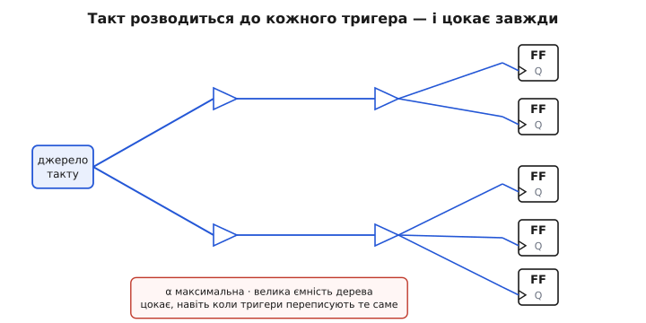
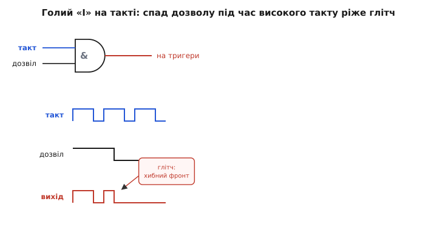
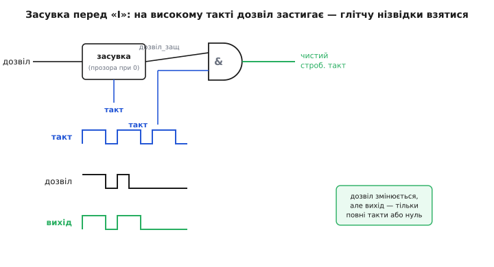

# Тактове стробування

Уяви процесор, що нічого не робить. Програма впала в цикл очікування, жоден регістр не має міняти значення, з зовнішнього боку — цілковитий спокій. І все одно чип теплий, і батарея сідає. Куди тече енергія, якщо схема стоїть?

Відповідь у тому, що синхронна схема ніколи по-справжньому не «стоїть». Її серце — **такт** (англ. *clock* — годинник), сигнал, що безперервно смикається вгору-вниз десятки чи сотні мільйонів разів на секунду, і цей стрибок доходить до **кожного** тригера в блоці. Навіть коли тригер щоразу перезаписує сам у себе те саме число, він усе одно клацає на кожен фронт — і платить за це енергією. Такт не питає, чи є робота; він цокає завжди.

Тактове **стробування** (англ. *gating* — «пропускання крізь ворота», від *gate* — ворота) — це проста й потужна ідея: якщо блок зараз не потрібен, **перекрий йому такт**. Постав на дорозі такту ворота й зачини їх — хай сигнал до сплячого блоку просто не доходить. Тригери завмруть, перестануть клацати, і споживання цього шматка схеми впаде майже до нуля. Розберімо, **звідки** береться це споживання, **чому** такт — головний винуватець, і **як** зачинити ворота так, щоб не наробити біди.

### Звідки взагалі береться споживання в CMOS

Щоб зрозуміти, чому глушіння такту так помагає, треба спершу побачити, на що [CMOS](topic:hw-digital/cmos)-схема витрачає енергію. А витрачає вона її майже виключно **в момент перемикання**, і майже не витрачає в спокої — це наріжна властивість цієї технології.

Кожен логічний вихід керує якоюсь ємністю: затворами наступних транзисторів, ємністю доріжок. Поки вихід тримає стале «0» чи стале «1», струм крізь нього майже не тече (у CMOS у будь-якому усталеному стані один із двох транзисторів завжди закритий). Але щойно вихід **перемикається** — скажімо, з «0» на «1» — він мусить **зарядити** цю ємність до напруги живлення. Заряд `Q = C · V` приходить із живлення, а при наступному перемиканні назад той самий заряд скидається в землю. Кожен такий цикл «заряд-розряд» безповоротно спалює порцію енергії `C · V²`. Помнож на те, скільки разів на секунду це стається, — і матимеш потужність.

Звідси головна формула динамічного споживання, на якій тримається все:

```
P = α · C · V² · f
```

де `f` — тактова частота, `V` — напруга живлення, `C` — сумарна перемикана ємність, а `α` (альфа) — **коефіцієнт активності** (*activity factor*): яка частка вузлів реально перемикається за один такт. Прочитай її по-людськи: **потужність — це ціна одного перемикання (`C · V²`), помножена на те, як часто перемикання трапляються (`α · f`)**. Не міняється сигнал — не платимо; міняється щотакту — платимо на повну.

> 🔧 **Навіщо це.** Ця формула — карта важелів проти споживання. `V²` — найжирніший, тож зниження напруги дає найбільше (звідси динамічне масштабування напруги), але воно вповільнює схему. `C` задане технологією й топологією. Лишаються `f` і `α` — і саме на них б'є тактове стробування: воно **обнуляє активність цілого блоку**, штучно роблячи його `α = 0` там і тоді, де робота не йде. Жодна інша техніка не прибирає споживання так дешево — лише перекриваєш один дріт.

### Чому такт — найненажерливіший сигнал у схемі

Тепер ключове спостереження. Із усіх сигналів у синхронній схемі є один особливий — той, що перемикається **гарантовано, завжди й усюди**. Це такт.

Подивися на будь-який інший вузол: вихід суматора, біт регістра, лінія даних. Він міняється лише **іноді** — коли обчислення справді дало інший результат. Для типових даних активність такого вузла невелика: `α` десь 0.1–0.3, тобто перемикається він у середньому раз на кілька тактів. А тепер такт: він за визначенням робить **два** перемикання щотакту (вгору і вниз), тобто його `α` фактично максимальне. І цей сигнал розведений на **весь** блок — до затвора кожнісінького тригера, крізь ланцюг підсилювачів-повторювачів, які женуть його по всьому кристалу. Ця розгалужена мережа зветься **тактовим деревом** (*clock tree*), і в ній сидить велика ємність `C`, яку доводиться перезаряджати двічі за період.

Складімо: найбільша `α` (перемикається завжди) × велика `C` (усе дерево) × та сама `f`. Не дивно, що тактове дерево з'їдає **велику частку** всієї динамічної потужності чипа — часто третину й більше. Це найдорожчий сигнал у системі, і він цокає навіть тоді, коли всі підключені тригери щотакту переписують у себе те саме.


*Один такт від джерела розгалужується крізь ланцюг повторювачів до всіх тригерів блоку. Кожна гілка цього дерева перезаряджається двічі за період — завжди, незалежно від того, чи роблять тригери корисну роботу. Тому саме тактове дерево, а не логіка даних, часто виявляється найбільшим споживачем.*

Ось де ховається марнотратство «сплячого» процесора. Блок стоїть, дані не міняються, корисної роботи нуль — а найдорожчий сигнал у ньому все одно смикається на кожен фронт і тягне з батареї. Логічний висновок напрошується сам: **якщо блок не працює, найперше, що треба вимкнути, — це його такт**.

### Наївне рішення — і чому воно небезпечне

Перша думка проста до безсоромності: постав на шляху такту вентиль «І» (AND). Один його вхід — сам такт, другий — сигнал дозволу `EN` (*enable*). Коли `EN = 1`, ворота відчинені: `такт · 1 = такт`, сигнал іде далі. Коли `EN = 0`, ворота зачинені: `такт · 0 = 0`, на виході мертвий нуль, тригери завмерли. Начебто саме те, що треба.

Але тут ховається пастка, через яку так робити **не можна**. Уся біда — в тому, **коли** саме дозвіл `EN` міняється. Бо `EN` — це звичайний логічний сигнал, і приходить він абсолютно несинхронно з тактом: він може смикнутися посеред такту, у будь-яку мить. І якщо `EN` зміниться в невдалий момент — коли такт **високий**, — на виході вентиля вискочить короткий паразитний імпульс.

Розберімо по кроках, чому. Хай такт зараз «1» і ворота відчинені. Раптом `EN` падає в «0» — але не миттєво, а з крихітною затримкою крізь логіку. На той короткий проміжок, поки `EN` ще не встиг остаточно осісти, вихід `такт · EN` встигає смикнутися: був «1» (бо такт «1» і `EN` ще «1»), а стане «0». Виходить обрубаний, куций фронт — [**глітч**](topic:hw-digital/glitch-combinational) (*glitch* — паразитний імпульс), фальшивий фронт такту, якого програма не замовляла. Це той самий різновид короткого хибного імпульсу, що народжується, коли входи логіки міняються не строго одночасно й вихід на мить проскакує проміжне значення, — тільки тут ціна особлива, бо смітить він на **тактовому** дроті.

Для тактового входу глітч — це катастрофа. Тригер не розрізняє «справжній» фронт від «фальшивого»: будь-який фронт на його тактовому вході він сприймає як команду **защіпнути дані зараз**. Зайвий фронт — зайве защіпування не в ту мить: тригер ковтне випадкове проміжне значення шини даних, і схема защіпне сміття. Один такий глітч — і стан збито, причому непередбачувано й нестабільно.


*Такт заходить в один вхід «І», дозвіл — в інший. Поки такт високий, будь-яка зміна дозволу одразу пролазить на вихід: спад дозволу вирізає з такту куций хибний імпульс. Для тактового входу тригера цей глітч — така сама команда защіпнути, як і справжній фронт, тож дані псуються.*

Корінь біди видно чітко: ми пустили несинхронний сигнал `EN` прямо на ворота, і він смикнув їх у забороненій зоні — коли крізь них саме йшов високий рівень такту. Щоб стробувати такт безпечно, `EN` треба **утримати незмінним** на весь час, поки такт високий, і дозволити йому мінятися **лише** тоді, коли такт унизу і жодного фронту зіпсувати неможливо.

> 🔧 **Навіщо це.** Саме тому в жодній серйозній схемі не побачиш голого «І» на такті — це класична помилка, що дає плаваючі, невідтворні збої (працює на столі, падає в полі). Синтезатори логіки навіть навмисно **забороняють** виводити просте «І» на тактову мережу й натомість підставляють спеціальну безглітчеву комірку, про яку далі. Якщо колись побачиш у схемі AND-gate прямо на `CLK` — це майже завжди баг, і шукати треба саме зіпсовані фронти.

### Безглітчеві ворота: засувка перед вентилем

Розв'язок елегантний і саме такий, як підказала діагностика: перед вентилем «І» треба поставити **прозору засувку** (*latch*), яка **запам'ятовує** дозвіл у безпечну мить і тримає його стабільним усю небезпечну фазу. Ця зв'язка «засувка + вентиль» — стандартний вузол, який так і звуть: **інтегрована комірка стробування такту** (*integrated clock gating cell*, ICG).

Ідея працює так. Береться засувка, **прозора при низькому такті**: поки такт «0», вона пропускає `EN` крізь себе на свій вихід (стежить за входом), а щойно такт піднявся в «1» — **замикається** й тримає на виході те значення `EN`, яке було на момент підйому. Вихід цієї засувки — назвемо його `EN_latched` — і йде на вентиль «І» разом із тактом.

Простежмо, чому глітч тепер неможливий. Поки такт унизу — вентиль однаково зачинений (`такт = 0`, на виході нуль), тож будь-які скачки `EN` у цій фазі нікому не шкодять: вони проходять крізь прозору засувку, але на замкнені ворота не впливають. Коли такт піднімається — засувка тієї ж миті **замикає** `EN_latched` і тримає його непорушним усю високу фазу. А раз другий вхід «І» під час високого такту **не ворушиться**, то й вихід `такт · EN_latched` повторює такт **чисто**, без жодного обрубаного фронту. Куди б не смикнувся зовнішній `EN` під час високого такту — до воріт він тепер не дістане, бо його стереже замкнена засувка. Дозвіл фізично **не може** змінитися в небезпечний момент — і глітч зникає в корені.

Результат — те, чого хотіли з самого початку: `EN = 1` — на виході живий, чистий такт; `EN = 0` — рівний спокійний нуль; і **жодного** сміттєвого фронту на переходах, у який би бік і в яку мить не мінявся дозвіл.


*Дозвіл заходить не прямо на вентиль, а спершу в засувку, прозору лише при низькому такті. На підйомі такту засувка замикає дозвіл і тримає його стабільним усю високу фазу, тож другий вхід «І» не ворушиться в небезпечну мить. Такт на виході або чистий, або мертвий нуль — паразитному фронту взятися нізвідки.*

Ця засувка перед вентилем — саме те, що відрізняє інженерне тактове стробування від наївного «І». Одна маленька комірка пам'яті, поставлена в правильному місці, перетворює небезпечний трюк на надійний штатний вузол, який мільйонами стоїть у кожному сучасному чипі.

### Скільки ж це справді економить

Порахуймо на пальцях, щоб відчути масштаб. Хай блок цокає на `f = 100 МГц` від напруги `V = 1.2 В`, а перемикана ємність його тактового піддерева — `C = 20 пФ`. Скільки потужності з'їдає **самий такт** цього блоку, поки блок нічого корисного не робить?

**Приклад (потужність простою тактового дерева).**

```
такт робить 2 перемикання за період, тож ефективна активність α = 1
енергія одного повного циклу заряд-розряд:  E = C · V²
                                              = 20·10⁻¹² · 1.2²
                                              = 20·10⁻¹² · 1.44
                                              = 28.8·10⁻¹² Дж  = 28.8 пДж

потужність = енергія за такт · частота:
       P = E · f = 28.8·10⁻¹² · 100·10⁶
         = 2.88·10⁻³ Вт  ≈ 2.9 мВт
```

Майже три міліватти — і все це **дотла, ні на що**: блок стоїть, а його тактове дерево весь час перезаряджається. Зачини ворота на час простою — і ці 2.9 мВт зникають (лишається дрібний струм витоку, але динаміка йде в нуль). У чипі з десятками таких блоків, більшість із яких у кожну мить простоюють, сумарна економія — разюча; без стробування портативна електроніка з її батареями була б просто неможлива.

Тепер практичніший приклад — **типовий виграш на реальному навантаженні**. Хай периферійний блок насправді потрібен лише 5 % часу, а решту 95 % простоює.

**Приклад (середнє споживання блоку зі стробуванням).**

```
без стробування: такт цокає 100 % часу       →  P = 2.9 мВт  (завжди)

зі стробуванням: такт живий лише 5 % часу,
решту 95 % ворота зачинені                    →  P ≈ 2.9 · 0.05
                                                   ≈ 0.145 мВт

економія:  2.9 → 0.145 мВт  —  у 20 разів менше
```

Ось чому тактове стробування — не дрібна оптимізація «на потім», а базова, скрізь застосовна техніка: воно масштабує споживання блоку **пропорційно тому, скільки блок реально працює**, а не тому, скільки він фізично існує на кристалі.

### Де ставити ворота: грубо й тонко

Лишається питання — **де саме** в схемі різати такт. Тут два підходи, і вони не суперечать, а доповнюють один одного.

**Грубе стробування** (*coarse-grain*) — це ворота на такт **цілого великого блоку**: контролера USB, апаратного множника, кеша, цілого ядра. Умова проста й зрозуміла: «поки цим блоком ніхто не користується — вимкни йому такт повністю». Такі ворота вставляє архітектор системи явно й свідомо; виграш величезний (гасне ціла ділянка кристала), а логіка керування нескладна. Це найперше, що роблять для економії, і саме на цьому тримаються режими сну мікроконтролерів: у сплячому режимі більшість периферії просто відрізана від такту.

**Тонке стробування** (*fine-grain*) працює навпаки — на рівні **окремих регістрів** усередині активного блоку. Ключове спостереження: тригер, у який цього такту **не пишуть**, однаково клацає намарно, бо просто перезаписує в себе старе значення. А в кожного регістра-з-дозволом (*enable register*) уже й так є сигнал `EN`, що каже, чи вантажити нове значення. Тонке стробування використовує **цей самий** `EN` як умову воріт: якщо в регістр цього такту не пишемо — не тільки не вантажимо, а й **перекриваємо йому такт**. Такі ворота автоматично розставляє синтезатор логіки, знаходячи регістри з дозволом і підставляючи ICG-комірку. Кожен виграш крихітний, але таких регістрів у чипі — мільйони, тож у сумі набігає багато.

Тонке стробування добре видно вже на рівні опису схеми. Розгляньмо звичайний регістр із дозволом — і подивімося, як його намір «писати лише коли треба» природно перетворюється на умову перекрити такт:

```c
// Регістр із дозволом (Verilog-подібний намір, C-ілюстрація логіки):
// новий стан вантажимо лише коли enable, інакше тримаємо старий.
if (enable) {
    q = d;          // защіпнути нові дані
}                   // інакше q лишається як був

// Той самий намір мовою стробування: якщо не пишемо — навіщо давати такт?
//   gated_clk = clk , коли enable == 1
//   gated_clk = 0   , коли enable == 0
// Синтезатор бачить цей 'if (enable)', розуміє, що при enable==0
// такт регістру зайвий, і сам вставляє безглітчеву ICG-комірку.
```

Синтезатор читає намір «пиши лише за дозволом», робить очевидний висновок «отже, без дозволу такт цьому тригеру не потрібен» — і матеріалізує цей висновок як ворота на такті. Логіка схеми **не міняється** ні на йоту (регістр поводиться так само), а споживання падає, бо в такти без запису тригер більше не клацає.

> 🔧 **Навіщо це.** Практичний висновок для того, хто пише RTL: **виражай наміри чесними сигналами дозволу** (`if (enable) ...`), а не маскуй їх мультиплексором зворотного зв'язку `q <= enable ? d : q`. Обидва описи логічно однакові, але перший синтезатор упізнає й сам застробує такт, а другий залишить тригер клацати щотакту. Тобто економію на мільйонах регістрів ти вмикаєш **стилем опису** — просто пишучи дозвіл явно.

### Про що не можна забути

Тактове стробування майже чарівне у своїй дешевизні, але має свою ціну й свої межі, і їх варто тримати в голові.

**Ворота самі коштують — трохи.** ICG-комірка — це засувка плюс вентиль; вони теж займають площу й самі споживають дрібку. Тому стробувати одненький тригер зазвичай невигідно: ворота з'їдять більше, ніж зекономлять. Стробування окуповується, коли за одними воротами сидить **достатньо** тригерів, щоб їхня спільна економія перекрила вартість самої комірки.

**Увімкнення не безкоштовне за часом.** Коли блок «прокидається», його такт має спершу знову розгойдати все дерево, і перший корисний фронт приходить не миттєво. Для грубого стробування це означає невелику затримку виходу зі сну — дрібницю для процесора, але її треба закладати в тайминги.

**Дозвіл мусить бути стабільним і правильно порахованим.** Уся безпека тримається на тому, що `EN_latched` встигає осісти, поки такт унизу. Якщо логіка, що виробляє `EN`, надто повільна й не встигає до підйому такту, засувка защіпне ще недосталий дозвіл — і ворота відчиняться чи зачиняться не тоді. Тому шлях сигналу дозволу теж підлягає таймінговому аналізу, як і будь-який інший.

**Це б'є по динаміці, а не по витоку.** Стробування прибирає `α · C · V² · f` — динамічне споживання від перемикань. Але транзистори навіть у застроблений такт лишаються під напругою й потроху **течуть** (статичний струм витоку). У сучасних дрібних технологіях витік вагомий, і сам такт його не прибирає — для цього потрібне вже **вимкнення живлення** (*power gating*), яке взагалі відрізає блок від напруги. Тактове стробування й вимкнення живлення — дві різні, доповняльні техніки: перше глушить динаміку дешево й швидко, друге вбиває ще й витік, але коштує дорожче й вмикається повільніше.

Отак і виходить, що найдешевший спосіб не палити енергію — це просто **не давати такт тому, хто не працює**. Уся хитрість — зробити це чисто: поставити перед воротами маленьку засувку, яка тримає дозвіл незмінним, поки крізь ворота йде фронт, і тим убити паразитний імпульс у зародку. А далі та сама ідея масштабується від цілого сплячого ядра до мільйонів окремих регістрів, щоразу платячи рівно за ту роботу, що справді робиться, — і ні джоуля більше.
