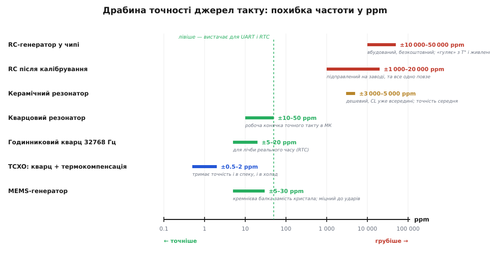
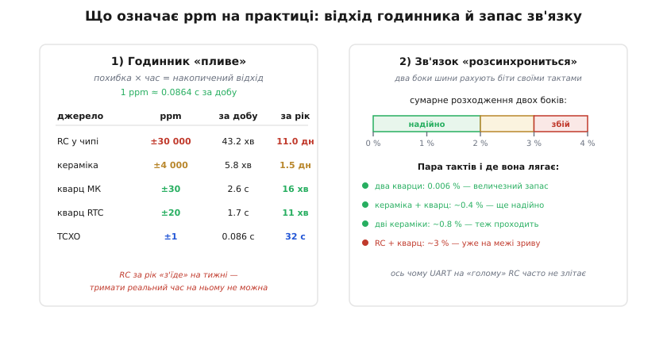
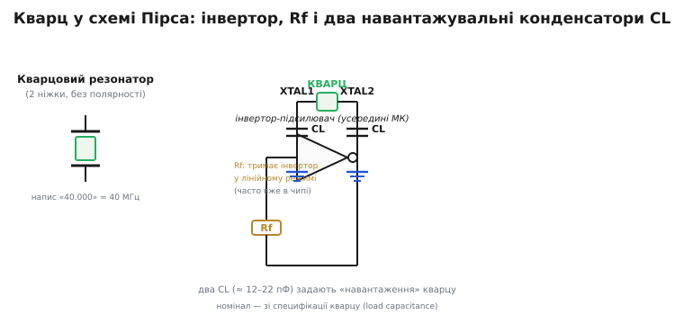

# Звідки береться такт: кварц, кераміка, RC і MEMS-генератори

> Такт — спільний ритм, від якого синхронна цифрова система; **точний** головний такт роблять кварцом, а простіший — кільцевим генератором. Тут доведемо цю думку до практики: який буває **фізичний** генератор такту, наскільки кожен точний (мова ppm), як кварцовий резонатор **під'єднують** до мікроконтролера й де на цьому спотикаються. Сам кварц-резонатор тут — той «компонент», що йому присвячено вставку. А свідомий вибір джерела такту в [налаштуваннях мікроконтролера](root:hw-arch/clock-power) — окрема тема; ми лишаємося на рівні «що це за деталь і як її завести».

## Що це за «компонент» і навіщо

«Компонент» цієї вставки — **резонатор такту**: маленька деталь, що задає системі еталонну частоту. Два крайні полюси — неточний кільцевий генератор і точний кварц; на практиці ж розробник обирає **джерело такту** з чотирьох типів. Найпростіший і вже знайомий — вбудований **RC-генератор** (*RC oscillator*): нічого не коштує й не вимагає зовнішніх деталей, але «гуляє» на відсотки. Точніший — дешевий **керамічний резонатор** (*ceramic resonator*), п'єзокераміка, часто з двома вбудованими конденсаторами. Робоча конячка точного такту — **кварцовий резонатор** (*crystal*, *quartz*, на схемах **XTAL**): той самий орієнтований зріз кварцу з [історії резонаторів](root:hw-digital/clock-signal/hist-piezo-resonators.md), стабільний до десятків ppm. І нарешті **MEMS-генератор** (*MEMS oscillator*) — кремнієва балка з вбудованою корекцією, що віддає готовий цифровий такт і не боїться ударів.

Щоб порівнювати ці чотири типи чесно, потрібна одна спільна мірка точності — і це **ppm**.

> 🧮 **Мова точності — ppm.** *ppm* (*parts per million*, «частин на мільйон») — це відносна похибка, виражена в мільйонних частках: 1 ppm = 1/1 000 000 = 0.0001 % = ±1 «зайвий» такт на кожен мільйон. Якщо кварц 16 МГц має похибку ±20 ppm, його реальна частота лежить у межах 16 000 000 × (1 ± 20·10⁻⁶) Гц, тобто ±320 Гц. Зручність ppm у тім, що міра **відносна**: ті самі ±20 ppm на годинниковому кварці 32768 Гц дають лише ±0.66 Гц, а на 240 МГц — ±4800 Гц, але **частка** скрізь однакова. Тому в даташитах точність джерел такту майже завжди подають саме в ppm, а не в герцах.

*Чотири типи джерел такту на одній логарифмічній шкалі похибки (ppm). RC-генератор у чипі — найгрубіший (тисячі-десятки тисяч ppm) і повзе з температурою; калібрування на заводі трохи допомагає, та не рятує. Керамічний резонатор — посередині (кілька тисяч ppm). Кварц — стрибок на два-три порядки точніше (десятки ppm), а годинниковий кварц 32768 Гц і MEMS-генератор тримаються в тій самій «точній» зоні. Найточніший — TCXO (кварц із вбудованою термокомпенсацією, частки ppm). Зелена риска позначає поріг, лівіше якого точності з запасом вистачає і для серійного зв'язку (UART), і для відліку реального часу.*

Драбина одразу показує головне правило вибору: **що точніше треба, то правіше по шкалі зупинятися не можна**. Лишається перекласти ці абстрактні ppm у дві конкретні неприємності, заради яких точність узагалі купують.

## Два наслідки похибки: «годинник пливе» і «зв'язок зривається»

Похибка в ppm б'є по двох речах, з якими ви матимете справу постійно. Перша — **відлік часу**: будь-який таймер лічить власні такти, тож похибка частоти **накопичується** в похибку часу. Друга — **серійний зв'язок**: два пристрої домовляються про швидкість (скажімо, UART на 115200 біт/с), але кожен відмірює біти **своїм** тактом, і якщо такти розійшлися надто сильно, приймач «з'їде» з біта на сусідній.

*Зліва: за скільки накопичена похибка «зрушить» годинник. 1 ppm — це ≈ 0.0864 с за добу; тож RC (тисячі ppm) «з'їде» на десятки хвилин за добу й на тижні за рік, кераміка — на хвилини за добу, а кварц — лише на секунди. Справа: для надійного UART сумарне розходження двох боків має лишатися в межах приблизно ±2 % (із запасом — менше). Пара кварців розходиться на тисячні частки відсотка — величезний запас; кераміка з кварцом ще проходить; а от «голий» RC проти кварцу легко дає близько 3 % — і зв'язок на самому RC часто не злітає.*

Звідси проста розв'язка: для відліку часу й серійного зв'язку беруть кварц (а для календаря — окремий годинниковий кварц 32768 Гц), тоді як вбудованого RC вистачає лише там, де такт потрібен «щоб щось цокало» всередині чипа. Найцікавіший із чотирьох варіантів — кварц — вимагає кількох зовнішніх деталей і правильного підключення; розберімо саме його.

## Розпіновка й підключення: кварц як петля інвертора

Кварцовий резонатор сам по собі **пасивний** і має лише **дві ніжки** без полярності (тому в схему його можна ставити будь-яким боком). Він не генерує нічого самотужки — він лише «дзвенить» на своїй частоті, коли його розгойдують. Розгойдує його **підсилювач усередині мікроконтролера**: між двома спеціальними ніжками чипа (їх звуть **XTAL1/XTAL2**, або **XIN/XOUT**) увімкнено інвертор, і кварц замикає його вихід назад на вхід — тобто стоїть у петлі **зворотного зв'язку**. Цю класичну схему звуть **осцилятором Пірса** (*Pierce oscillator*): інвертор постійно «штовхає» кварц, кварц нав'язує петлі свою частоту, і на ніжках встановлюється стійке коливання. Це та сама ідея самопідтримки через зворотний зв'язок, що й у [тригері-засувці](root:hw-digital/state-memory), лише націлена не на «застигнути в стані», а на «рівно дзвеніти».

*Кварцовий резонатор (зліва — умовне позначення з двох обкладок і кристала) під'єднують між ніжками XTAL1 і XTAL2. Усередині чипа між ними — інвертор-підсилювач; паралельно йому резистор Rf тримає інвертор у лінійному режимі (часто він уже інтегрований). Зовні до кожної ніжки додають по конденсатору **CL** на землю (типово 12–22 пФ) — це «навантажувальні» конденсатори, чий номінал беруть зі специфікації кварцу (параметр *load capacitance*). Кварц і обидва CL ставлять **упритул** до ніжок чипа, з короткою земляною петлею.*

Дві деталі на схемі заслуговують окремого слова, бо саме на них найчастіше спотикаються. **Резистор зворотного зв'язку Rf** змушує інвертор працювати не як ключ (0/1), а як **лінійний** підсилювач — без нього петля не «дзвенітиме» плавно; у сучасних мікроконтролерах він зазвичай вбудований, тож ззовні його ставити не треба. А ось два **навантажувальні конденсатори CL** — майже завжди зовнішні, і їхній номінал не випадковий: кварц у специфікації розрахований на певну «навантажувальну ємність», і поставити треба саме її (з поправкою на паразитну ємність доріжок). Помилишся з CL — кварц або не запуститься зовсім, або «з'їде» з номінальної частоти на кілька ppm.

## «Перший байт»: як зрозуміти, що кварц завівся

У кварцу немає «першого байта» в прямому сенсі — він не передає даних; його аналог — **переконатися, що генератор стартував і дає правильну частоту**. На відміну від RC, кварц розгойдується не миттєво: йому треба кілька тисяч періодів, щоб «розколихатися» (типово частки мілісекунди), тож система зазвичай стартує на внутрішньому RC й перемикається на кварц, коли той устоявся (саме [керування цим перемиканням](root:hw-arch/clock-power) — окрема тема).

Перевіряти частоту найкраще **не** торкаючись осцилографом самих ніжок XTAL: щуп своєю ємністю легко зриває кволі коливання або зсуває частоту. Краще вивести такт на контрольну ніжку, якщо чип таке вміє, і поміряти там, звіривши з очікуваним до потрібних ppm. Непрямий знак — що система взагалі **ожила** на потрібній швидкості: серійний порт відповідає, а тривалість програмних затримок збігається з розрахунком. Найпідступніше — коли кварц тихцем **не** завівся, а система лишилася на внутрішньому RC: усе нібито працює, але час і швидкість шини «попливли».

> 🔧 **Навіщо це.** Вибір джерела такту — одне з перших рішень у будь-якому проєкті на мікроконтролері, і ціна помилки висока. Винесіть головне. **RC** (вбудований) — безкоштовний, але неточний: годиться лише там, де байдуже до точного часу й нема серійного зв'язку. **Кераміка** — дешевий компроміс на кілька тисяч ppm. **Кварц** — стандарт точного такту (десятки ppm): саме його беруть під серійний зв'язок і відлік часу, і саме він вимагає двох конденсаторів CL правильного номіналу та акуратного розведення. **MEMS** — коли важлива стійкість до ударів і вібрації. А ppm — спільна мова, якою всі чотири порівнюють: переклавши похибку джерела у «секунди за добу» й «відсотки розходження шини», ви одразу бачите, чи вистачить його для вашої задачі.

## Типові граблі й варіації

Окрім уже названих пасток (неправильні чи забуті CL, тиха підміна кварцу внутрішнім RC), варто пам'ятати ще про розведення: кволі коливання кварцу легко збиває наводка, тож резонатор і обидва CL ставлять **упритул** до ніжок, із короткими доріжками й суцільною землею під осцилятором.

Сам клас резонаторів має кілька подоб, які варто впізнавати. **Двоногий кварц** — базовий варіант, що його ми й розбирали; до нього потрібні зовнішні CL. **Трикінцевий керамічний резонатор** — уже з вбудованими конденсаторами, тож зовнішніх деталей не треба зовсім (ціна — гірша точність). **Готовий генератор** (*oscillator*, на відміну від пасивного *resonator*) — це коли кварц чи MEMS уже зібрано з усією електронікою в один корпус із живленням: він має не дві, а **чотири** ніжки (живлення, земля, вихід, іноді дозвіл) і віддає готовий цифровий такт прямо в ніжку, не вимагаючи ні інвертора в чипі, ні CL. **TCXO** — той самий кварцовий генератор, але з термокомпенсацією, для часток ppm. А **MEMS-генератор** ззовні виглядає як звичайний чотириногий генератор, лише всередині в нього кремнієва балка замість кристала.

Спільна нитка, яку варто винести зі вставки, проста: такт у системі задає **резонатор**, і чим стабільніший його фізичний принцип — від примхливих затримок RC до пружного кристала кварцу, — тим менше ppm похибки й тим спокійніше працюють і годинник, і зв'язок. А який саме такт увімкнути в самому мікроконтролері та як ним керувати в регістрах — це вже [конфігурування тактування й живлення](root:hw-arch/clock-power).
