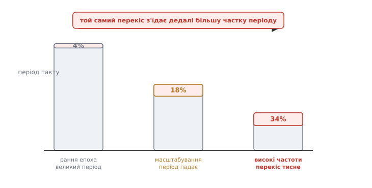
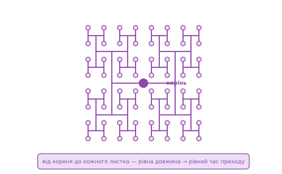

# 📜 Як перекіс такту з дріб'язку став окремим етапом дизайну

Є речі, які інженери довго не помічають — не тому, що вони дурні, а тому, що поки річ мала, її **справді можна** не помічати. Перекіс такту саме такий. Кілька десятиліть він тихо ховався всередині «запасу на всяк випадок», яким проєктувальник і так обкладав кожен такт. А потім кристали виросли, частоти підскочили — і те, що вміщалося в запас, з нього вилізло. Перекіс перестав бути похибкою округлення й став тим, що визначає, на якій частоті чип узагалі запуститься. У відповідь виник цілий окремий крок у ланцюжку проєктування — **синтез тактового дерева** (англ. *clock tree synthesis*, CTS), і клас алгоритмів, що його роблять.

Це історія про те, як кількість перетворюється на якість: як та сама фізика — сигнал біжить дротом скінченний час — спершу нічого не важила, а на іншому масштабі стала першорядним клопотом. Розберімо її від першопричини, з датами й іменами, а де історія обростає легендами — це чесно позначимо.

## Чому спершу перекіс справді можна було зневажати

Уявімо ранню синхронну схему — скажімо, логіку на друкованій платі або перший мікропроцесор початку 1970-х. Тактова частота — одиниці мегагерців, період — сотні наносекунд. Тригерів — десятки, від сили сотні. Дроти між ними — короткі, і фронт такту пробігає всю схему за частки наносекунди.

Тепер порахуймо співвідношення, і стане видно все. Хай перекіс — це, скажімо, 2 нс (щедро, як для маленької схеми), а період — 200 нс:

```
доля перекосу = t_skew / T = 2 нс / 200 нс = 0.01 = 1%
```

Один відсоток. Це менше, ніж інженер і так закладав на розкид параметрів, на температуру, на старіння. Перекіс просто **тонув** у загальному запасі. Його не рахували окремо не через недбальство, а тому що окремо рахувати не було чого: він губився серед більших невизначеностей.

> 🔧 **Навіщо це.** Це головна причина, чому раннє покоління синхронних схем чесно проєктували з **припущенням нульового перекосу** — і воно працювало. Модель «усі тригери клацають в одну мить» була не наївністю, а розумним наближенням для свого масштабу. Помилка з'явилася не в моделі, а в тому, що масштаб змінився, а модель лишили ту саму. Ось чому історію варто знати: щоб не тягти в новий масштаб припущення, які були слушні лише в старому.

Канонічне джерело тодішньої культури проєктування — підручник Карвера Міда (англ. *Carver Mead*) і Лінн Конвей (англ. *Lynn Conway*) «Вступ до систем НВІС» (*Introduction to VLSI Systems*, Addison-Wesley, 1980), який задав методологію проєктування великих інтегральних схем для цілого покоління. Там багато уваги приділено **тактуванню** — зокрема двофазному такту без перекриття (two-phase non-overlapping clock), — але перекіс як окрему **оптимізаційну задачу розведення** тодішня практика ще не виділяла: такт малювали як звичайний сигнал, і цього вистачало. Це не докір книжці — це знімок стану галузі: перекіс ще не доріс до того, щоб мати власний етап.

## Що зламало наближення: масштабування тягне всі важелі в один бік

Далі сталося те, що в напівпровідниках зветься **масштабуванням** (англ. *scaling*): з кожним поколінням техпроцесу транзистори меншали, їх ставало більше, частоти росли. І кожен із цих зсувів бив по перекосу — причому всі **в один бік**, погіршуючи.

**Більше тригерів — товстіше дерево.** Коли на кристалі не сотні, а десятки й сотні тисяч тригерів, одному дроту їх не нагодувати: сумарна ємність входів величезна. Такт доводиться розводити **розгалуженим деревом** із багатьма щаблями буферів. А що більше дерево й що більше в ньому щаблів, то більше місць, де гілки можуть вийти нерівними, — то більший розкид часу приходу.

**Довші дроти — довша затримка.** Більший кристал означає, що від центру до кутка сигнал долає більшу відстань. А затримка в дроті з масштабуванням поводиться підступно: сам дріт тоншає, його опір на одиницю довжини **росте**, і [RC-затримка](root:hw-analog/rc-time-constant) довгих ліній не падає разом із транзисторами, а починає **домінувати**. Різниця в довжині гілок перетворюється на дедалі більшу різницю в часі.

**Вищі частоти — коротший період.** І, головне, знаменник у нашому дробі стискається. Період падає з сотень наносекунд до одиниць, тоді до часток. А перекіс — величина **абсолютна**, у пікосекундах; він не меншає пропорційно періоду. Тож та сама пікосекунда з'їдає дедалі більшу **частку** такту.


*Світлий стовпчик — повний період (дозволений час на перегін), він падає з поколіннями. Червона шапка згори — частка, яку з'їдає перекіс. Абсолютний перекіс майже не меншає, а період стискається — тож частка стрибає з відсотка до третини. Точні числа умовні; важлива тенденція: те, що тонуло в запасі, з нього вилазить.*

Перерахуймо той самий дріб для швидкого сучасного тракту. Хай перекіс лишився навіть меншим — 150 пс, — а період став 3.3 нс (це, до речі, реальні числа мікропроцесора середини 1990-х, до них дійдемо):

```
доля перекосу = 150 пс / 3300 пс ≈ 0.045 = 4.5%
```

А на туго затиснутих трактах, де період підбивали під найгірший шлях, перекіс легко забирав **десяту частину** періоду й більше. Оглядова праця Ебі Фрідмана (англ. *Eby G. Friedman*) «Тактові розподільчі мережі в синхронних цифрових інтегральних схемах» (*Clock distribution networks in synchronous digital integrated circuits*, Proceedings of the IEEE, т. 89, № 5, 2001) прямо фіксує: у високопродуктивних системах перекіс став споживати помітну частку такту — той бюджет, який раніше просто ігнорували. Один відсоток можна зневажити. Десять — уже ні: це прямий податок на частоту, на якій продається чип.

> 🔧 **Навіщо це.** Ось у чому суть переходу «дріб'язок → першорядне»: жоден **окремий** ефект не змінився якісно — дроти й раніше мали затримку. Змінилося **співвідношення**. Тому історія перекосу — це майже чиста ілюстрація того, як інженерний пріоритет визначається не абсолютною величиною ефекту, а його **часткою** в бюджеті, який стискається. Той самий урок повторюється всюди в електроніці: величина, яку роками списують у «запас», раптом стає головним ворогом, щойно запас худне.

## Перша тривога прийшла з теорії масивів

Цікаво, що чи не найраніше й найрізкіше про межу забив на сполох не промисловий дизайн, а **теорія систолічних масивів** — регулярних ґраток простих процесорів, якими у ті роки захоплювалися для паралельних обчислень.

1985 року Ален Фішер (англ. *Allan L. Fisher*) і Гсян-Цзе Кунг (кит. 孔祥重, англ. *H. T. Kung*) з Університету Карнеґі-Меллона опублікували працю «Синхронізація великих НВІС-масивів процесорів» (*Synchronizing large VLSI processor arrays*, IEEE Transactions on Computers, т. 34, № 8, 1985). Вони поставили питання руба: якщо масив ростити, чи можна тактувати його так, щоб перекіс між **сусідніми** комірками лишався **обмеженим сталою**, хоч би скільки комірок додати?

І довели прикру річ: для **двовимірного** масиву, тактованого навіть симетричним деревом-«H», — **ні**. Зі зростанням ґратки перекіс між комунікуючими комірками неминуче росте, його не втримати під сталою межею. А якщо перекіс не обмежити, синхронна дисципліна ламається. Їхній висновок: там, де синхронне тактування не тягне, треба мішати синхронні елементи з **асинхронними** — вставляти рукостискання (handshake) між ділянками.

Це був ранній, ще теоретичний дзвінок: він показав, що «один такт на всіх» — не безкоштовна абстракція, а обіцянка, яку фізика з масштабом **відмовляється** виконувати. Промисловість дійде до того самого висновку своїм шляхом — через кристали, що перестають запускатися, — але формальну межу першими окреслили саме дослідники масивів.

## Перша відповідь: зробити геометрію симетричною — H-дерево

Якщо перекіс береться з **нерівних** шляхів, найпряміша ідея — зробити шляхи **рівними** за побудовою. Не вирівнювати постфактум, а розвести такт так симетрично, щоб відстань від кореня до кожного листка була однакова від початку.

Класичне втілення цієї ідеї — **H-дерево** (англ. *H-tree*). Візьми літеру «H»; постав джерело такту в її центр, а приймачі — на чотири кінці. Тепер кожен кінець зроби центром меншої «H», і так рекурсивно. За самою побудовою шлях дротом від кореня до **будь-якого** листка має однакову довжину — а якщо довжина є мірою ємності й затримки, то й час приходу однаковий. Симетрія робить роботу, якої інакше довелося б домагатися розрахунком.


*Кожен кінець «H» сам стає центром меншої «H». Шлях від кореня до будь-якого листка проходить однакову сумарну довжину дроту — тож (за лінійною моделлю затримки) фронт приходить до всіх листків в один час. Це не алгоритм, а геометричний рецепт: однакова форма → однаковий час.*

Строгу інженерну форму цієї ідеї для інтегральних схем дали 1986 року Хайдар Бакоглу (тур. *Haldun Bakoğlu*, англ. *H. B. Bakoglu*), Джеймс Вокер (англ. *James T. Walker*) і Джеймс Мейндл (англ. *James D. Meindl* — керівник відомої групи з інтегрованих систем у Стенфорді) у праці «Симетричне тактове розподільче дерево та оптимізовані швидкісні з'єднання для зменшеного перекосу в схемах НВІС і НВІ» (*A symmetric clock distribution tree and optimized high-speed interconnections for reduced clock skew in ULSI and WSI circuits*, ICCD, 1986). Вони показали, як симетричним деревом досягти дуже малого перекосу за розумної довжини дроту, і скільки щаблів буферів потрібно залежно від сумарного навантаження й допустимого перекосу. Ця праця стала однією з опорних для всієї подальшої роботи над тактовими мережами.

Але в H-дерева є межа, і вона важлива. Воно прекрасне, коли приймачі розкидані **рівномірно** й регулярно — як у тому самому систолічному масиві. А реальний кристал не такий: тригери сидять там, де їх поставив синтез логіки, купчаться нерівномірно, довкола них — заборонені зони, блоки пам'яті, макроблоки. Ідеальну «H» на таку нерівну карту не покладеш. Потрібен був не один красивий рецепт, а **алгоритм**, що будує збалансоване дерево під **довільне** розташування приймачів. І тут починається власне історія синтезу тактового дерева.

## Народження алгоритмів: збалансувати дерево під будь-яку карту

Кінець 1980-х — початок 1990-х: задача «розвести такт із малим перекосом під довільну карту тригерів» перетворюється на живий напрям у спільноті автоматизації проєктування (EDA), головним чином на конференціях DAC (Design Automation Conference) та ICCAD. За кілька років з'являються ідеї, що досі становлять кістяк промислових інструментів. Пройдімо їх по порядку — кожна лагодить ваду попередньої.

**1990 — метод середніх і медіан (MMM).** Марк Джексон (англ. *M. A. B. Jackson*), Арунабга Срінівасан (англ. *A. Srinivasan*) і Ернест Ку (кит. 葛守仁, англ. *Ernest S. Kuh*) з Каліфорнійського університету в Берклі в праці «Розведення такту для високопродуктивних ІС» (*Clock routing for high-performance ICs*, DAC, 1990) запропонували **метод середніх і медіан** (англ. *method of means and medians*, MMM). Ідея гарна своєю простотою: візьми всі приймачі, знайди їхній спільний центр ваги (**середнє**), а тоді розділи їх **медіаною** на дві рівні за кількістю половини — ліворуч і праворуч. З'єднай центр цілого з центрами обох половин. Далі повтори те саме рекурсивно всередині кожної половини. Виходить збалансоване двійкове дерево, у якого до кожного листка приблизно однакова кількість щаблів і приблизно рівні відстані. По суті, це **узагальнення H-дерева** на нерівномірну карту: там, де приймачі рівномірні, MMM і породжує щось H-подібне, а де ні — гнеться під них. Слабина — метод спирається на лінійну модель затримки й вирівнює радше **геометрію**, ніж власне затримку.

**1991 — рекурсивне геометричне парування (RGM).** Того ж кола задачу з іншого боку взяли Ендрю Канг (англ. *Andrew B. Kahng*), Джейсон Конг (кит. 丛京生, англ. *Jason Cong*) і Ґабрієль Робінс (англ. *Gabriel Robins*) у праці «Високопродуктивне розведення такту на основі рекурсивного геометричного парування» (*High-performance clock routing based on recursive geometric matching*, DAC, 1991). Замість ділити зверху вниз, вони будують дерево **знизу вгору**: розбивають приймачі на пари за принципом **найдешевшого парування** (min-cost matching) — з'єднують найближчих, — тоді кожну пару заступає її точка з'єднання, і процес повторюється на новому наборі точок, аж поки лишиться корінь. Такий висхідний підхід дає дерево, чия сумарна довжина дроту в середньому лише в сталу кількість разів більша за оптимальне дерево Штейнера, а перекіс — близький до нуля. Це вже виразно **алгоритм оптимізації**, а не геометричний шаблон.

**1991 — точний нульовий перекіс за Елмором.** Найгостріший поворот зробив того ж 1991 року Рен-Сон Цай (кит. 蔡仁松, англ. *Ren-Song Tsay*) з дослідного центру IBM ім. Т. Дж. Вотсона у праці «Точний нульовий перекіс» (*Exact zero skew*, ICCAD, 1991). Попередні методи балансували **довжину** дроту, мовчки вважаючи, що рівна довжина = рівна затримка. Цай сказав: балансуймо **саму затримку**, і то за реалістичнішою моделлю Елмора (Elmore delay), яка враховує, як опір і ємність по-справжньому визначають час фронту. Його рецепт **рекурсивний і висхідний**: маємо два піддерева, кожне вже з нульовим перекосом усередині; знаходимо на з'єднанні між ними таку **точку відводу** (tapping point), від якої затримка до листків обох піддерев **однакова** — і зливаємо їх у нове дерево, знову з нульовим перекосом. Повторюй угору до кореня. Краса методу — в **ієрархічності**: піддерева можна будувати незалежно й паралельно, а тоді зшити з точним нулем; він годиться і для одноступеневих дерев, і для багатоступеневих, і навіть для тактування кількох кристалів у системі.

**1992 — відкладене злиття й вкладання (DME).** Нарешті 1992 року Тін-Хай Чао (англ. *Ting-Hai Chao*), Ю-Чін Гсу (англ. *Yu-Chin Hsu*), Ян-Мін Го (англ. *Jan-Ming Ho*) і той самий Ендрю Канг оформили ідею в дуже ефективний і загальний алгоритм — **відкладене злиття й вкладання** (англ. *deferred-merge embedding*, DME). Спостереження в його основі тонке: коли зливаєш два піддерева, точка їхнього з'єднання не обов'язково одна — часто існує цілий **відрізок** рівноправних місць, звідки перекіс лишається нульовим. То **не фіксуймо** точку зарано (звідси «відкладене»): спершу пройдімо знизу вгору, тримаючи для кожного вузла цілу область допустимих місць, а тоді зверху вниз **виберімо** з кожної області конкретну точку так, щоб укоротити сумарний дріт. DME завжди дає **точний нульовий** перекіс щодо взятої моделі затримки (лінійної чи Елмора), для лінійної — ще й оптимальну довжину дроту, і працює **лінійно** швидко за кількістю приймачів. Саме ця пара ідей — топологія (як MMM чи парування) плюс DME для точного вкладання — і лягла в основу того, що промислові інструменти роблять донині.

> 🔧 **Навіщо це.** Зверни увагу на **напрям** цієї еволюції — він повчальний сам собою. Від красивого, але жорсткого геометричного шаблону (H-дерево) — до гнучкого поділу під довільну карту (MMM) — до оптимізації довжини (парування) — до балансу **справжньої** затримки, а не її замінника-довжини (Цай, DME). Кожен крок брав припущення попередника, знаходив, де воно бреше на новому масштабі, і замінював чеснішим. Це та сама механіка, що штовхала й весь перекіс із дріб'язку в першорядне: наближення служить, поки служить, а тоді його треба замінити — не викинути наосліп, а **уточнити** там, де воно почало давати збій.

## Важлива чесність: техніка колективна, «винахідника перекосу» немає

Тут варто зупинитися й сказати прямо, бо спокуса завжди є. У жодного з цих кроків **немає** одного героя-винахідника, якому належить «синтез тактового дерева». Перекіс такту — не чийсь винахід, а **фізичне явище**; а CTS — не осяяння однієї людини, а **напрям**, що складався зусиллями багатьох груп у Берклі, IBM, Карнеґі-Меллоні, стенфордській школі Мейндла й десятках інших місць, крок за кроком, стаття за статтею на DAC та ICCAD.

Тому чесне формулювання таке: **конкретні алгоритми** мають конкретних авторів і дати, які ми навели й звірили, — MMM (Джексон, Срінівасан, Ку, 1990), рекурсивне парування (Канг, Конг, Робінс, 1991), точний нульовий перекіс (Цай, 1991), DME (Чао, Гсу, Го, Канг, 1992). А от **саму ідею** «такт треба розводити збалансованим деревом як окремий етап» ніхто не «винайшов» одномоментно — вона визріла з практики, коли перекіс перестав уміщатися в запас. Приписувати цей клас технік одній особі чи одній фірмі було б історичною неправдою; це якраз той випадок, де відкриття **колективне** й розтягнуте в часі, і чесніше назвати кількох реальних учасників, ніж вигадати єдиного першовідкривача.

## Промислова перевірка боєм: тактова сітка Alpha

Поки теоретики шліфували алгоритми, промисловість вибивала перекіс власними руками — і найкращий пам'ятник цій боротьбі лишили мікропроцесори DEC Alpha початку-середини 1990-х. Вони цінні тим, що показують **інший** бік тієї самої задачі: коли перекіс критичний, а частота рекордна, інженери часом відмовлялися від дерева на користь **сітки** (grid) — суцільної тактової решітки, замкненої накоротко по всьому кристалу, щоб фізично зрівняти потенціал такту всюди.

Alpha 21064 (кодова назва EV4, 1992) — на той час один із найшвидших процесорів світу — гнав фінальний тактовий драйвер сумарною шириною транзисторів близько 35 см, щоб живити тактове навантаження порядку 3.25 нФ. Такт роздавали від центрального «хребта» (spine) по всьому кристалу; біля хребта перекіс був крихітний, а до країв — наростав. Виміряний перекіс — близько **240 пс**.

Наступне покоління, Alpha 21164 (EV5, 1995), уперлося саме в те, що перекіс від хребта до краю кристала завеликий, — і відповіло **двома** хребтами, щоб глобальні тактові лінії ніколи не долали більше чверті ширини чипа. Драйвери сумарно розрослися до ~58 см ширини, а перекіс при періоді 3.3 нс (тобто ~300 МГц) удалося втримати близько **150 пс**. Ті самі числа, що ми підставляли в дріб раніше, — не абстракція: це реальний бюджет реального чипа, де 150 пс перекосу з'їдали ~4.5% і за них воювали ціною сантиметрів транзисторної ширини.

> 🔧 **Навіщо це.** Історія Alpha показує межу самих дерев і причину, чому їхній синтез — не єдина відповідь. Дерево балансує затримку **розрахунком**; сітка глушить перекіс **фізично**, з'єднавши все накоротко, — ціною величезної потужності на перезарядку тієї решітки. Реальні високопродуктивні чипи й досі комбінують: збалансоване **дерево** доганяє такт до локальних зон, а всередині зони — **сітка** дотискає залишковий перекіс. Знати цей поділ корисно й сьогодні: якщо десь перекіс не піддається розведенню дерева, наступний важіль — не ще один буфер, а зшивання листків у сітку.

## Що з цієї історії лишається в руках інженера

Зведімо нитку — не як хроніку заради дат, а як урок, що працює далі.

Перекіс такту не змінив своєї природи за півстоліття: це, як і був, лише різниця часу приходу того самого фронту до різних тригерів, бо сигнал біжить нерівними дротами скінченний час. Змінилося одне — його **вага в бюджеті**. Поки період був сотні наносекунд, перекіс у кілька наносекунд тонув у загальному запасі (~1%), і чесно було проєктувати з припущенням нульового перекосу. Масштабування потягло всі важелі в один бік — більше тригерів (товще дерево), довші дроти (RC-затримка домінує), вищі частоти (період стискається) — і та сама абсолютна пікосекунда почала з'їдати десяту частину такту. Дріб'язок став першорядним не тому, що виріс, а тому, що виросло **навколо** нього все інше.

Відповіддю став окремий етап — **синтез тактового дерева** — і послідовність ідей, кожна чесніша за попередню: симетрична геометрія H-дерева (Бакоглу, Вокер, Мейндл, 1986) для рівномірних карт; поділ під довільну карту методом середніх і медіан (Джексон, Срінівасан, Ку, 1990); мінімізація дроту рекурсивним паруванням (Канг, Конг, Робінс, 1991); і, нарешті, баланс **справжньої** затримки замість довжини — точний нульовий перекіс (Цай, 1991) та відкладене злиття й вкладання (Чао, Гсу, Го, Канг, 1992). Жоден крок не був осяянням одинака; це колективний, датований шлях спільноти EDA, а не винахід із одним іменем. А промисловість — на прикладі тактової сітки Alpha — нагадала, що дерево не всесильне: там, де розрахунку замало, перекіс глушать фізично, замкнувши такт у решітку.

І практичний висновок, що переживе всі покоління техпроцесів: коли якась величина роками сидить у графі «запас», не вважай її навіки дрібною. Спитай, куди рухається **співвідношення**. Перекіс уже раз пройшов цей шлях від нуля уваги до окремого етапу дизайну — і те саме будь-коли може статися з наступною «дрібницею», щойно бюджет довкола неї схудне.
