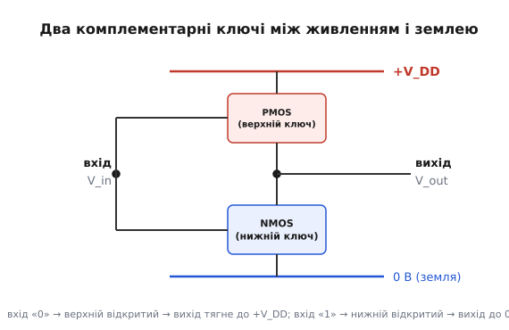
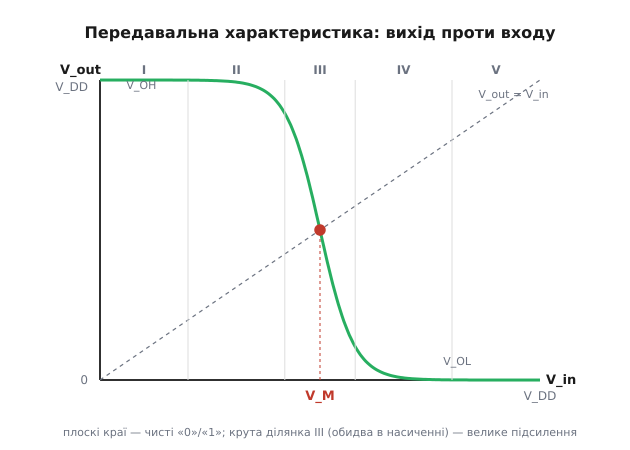
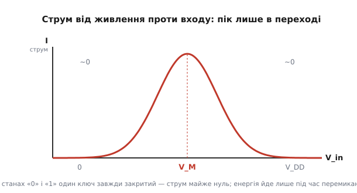

# Передавальна характеристика CMOS-інвертора

Цифрова схема живе в світі, де є лише «0» і «1». Але кремній цього світу не знає — він знає тільки напругу, що плавно змінюється від нуля до живлення. Десь на цьому шляху схема мусить вирішити: те, що на вході, — це вже «1» чи ще «0»? Крива, що показує, яку напругу схема виставить на виході залежно від напруги на вході, і є **передавальна характеристика** (англ. *transfer characteristic* — як вхід «передається» на вихід). Для CMOS-інвертора ця крива має напрочуд гарну форму, і саме її форма пояснює, чому вся цифрова техніка стоїть на CMOS.

Інвертор (лат. *invertere* — перевертати) — найпростіший логічний вентиль: подав «0» — отримав «1», подав «1» — отримав «0». Здавалося б, дрібниця. Але якщо зрозуміти, чому його передавальна крива виглядає саме так, стане зрозуміло і те, звідки в цифрі береться завадостійкість, чому логіка майже не гріється в спокої, і де вона все-таки платить за перемикання.

## Два ключі, увімкнені навпаки

Уявімо вихідний вузол схеми як точку, яку хтось тягне за мотузку вгору (до плюса живлення) або вниз (до землі). Якщо вгору тягне сильніше — на виході висока напруга, «1». Якщо вниз — низька, «0». CMOS-інвертор — це буквально два ключі: один зверху, між виходом і плюсом живлення, другий знизу, між виходом і землею. І хитрість у тому, що вони ввімкнені **навпаки** один до одного.

Верхній ключ — це PMOS-транзистор: він відкривається, коли на його затворі **низька** напруга. Нижній — NMOS: він відкривається, коли на затворі **висока**. Затвори обох з'єднані разом і є входом інвертора. Тому:

- вхід низький («0») → верхній ключ відкритий, нижній закритий → вихід тягнеться до плюса → «1»;
- вхід високий («1») → нижній відкритий, верхній закритий → вихід тягнеться до землі → «0».

Вхід перевернувся на виході. А головне — у кожному зі стійких станів **один із ключів завжди закритий**. Прямого шляху від плюса до землі немає, тож струм крізь інвертор майже не тече. Ця пара «завжди один закритий» — і є та сама комплементарність (лат. *complementum* — доповнення), від якої CMOS дістав своє «C». Хто хоче розібратися, як саме польовий транзистор працює як керований напругою ключ — [MOSFET у режимі ключа](root:hw-components/mosfet-modes): напруга на затворі керує каналом, поза порогом канал закритий, за порогом — відкритий і проводить.


*Два комплементарні ключі ділять один вихідний вузол; спільний затвор — вхід. У кожному стані один ключ закритий, тому наскрізного струму немає.*

> 🔧 **Навіщо це.** Саме ця структура «один завжди закритий» робить CMOS придатним для мільярдів вентилів на одному кристалі. Якби в стійкому стані інвертор постійно тягнув струм, сучасний процесор із його десятками мільярдів транзисторів згорів би від власного тепла в спокої. Форма передавальної кривої, яку ми зараз розберемо, — прямий наслідок цієї структури.

## Чому крива має форму «сходинки»

Тепер повільно піднімаймо напругу на вході від нуля до живлення й дивімося, що робить вихід. Поведінка природно розпадається на три частини.

**Поки вхід низький.** NMOS ще закритий — його затвор не дотягнувся до порога відкриття. PMOS натомість широко відкритий: на його затворі майже нуль відносно джерела, а це для нього — «повністю ввімкнено». Відкритий PMOS з'єднує вихід із плюсом майже без опору, а закритий NMOS не заважає. Вихід сидить рівно на живленні. Скільки вхід не піднімай у цій зоні — вихід не рухається. На кривій це плоска верхня поличка.

**Поки вхід високий.** Дзеркальна картина. NMOS широко відкритий, притягує вихід до землі; PMOS закритий. Вихід сидить на нулі, і знову не реагує на дрібні зміни входу. Плоска нижня поличка.

**Посередині стається різке.** Коли вхід підходить до половини живлення, обидва транзистори опиняються **водночас відкритими** — жоден іще не встиг закритися. Тепер вони працюють як два опори в дільнику напруги між плюсом і землею, і вихід стоїть там, куди його поставить їхнє співвідношення. Але тут криється тонкість: у цій вузькій зоні обидва транзистори перебувають у режимі **насичення** (англ. *saturation* — насичення, «більше струму не додаси»), де струм майже не залежить від напруги на самому транзисторі, зате різко залежить від напруги на затворі. Крихітна зміна входу сильно зсуває баланс між ними — і вихід падає з живлення майже до нуля на дуже короткому відрізку входу.

Складіть три частини разом — і отримаєте характерну сходинку: плоско зверху, стрімкий обрив посередині, плоско знизу.


*Плоскі краї відповідають чистим «1» і «0»; крута середня ділянка — де обидва транзистори в насиченні й інвертор працює як підсилювач з великим коефіцієнтом.*

Ця форма — не косметика. Плоскі краї означають, що навіть якщо вхідна напруга «пливе» (від завад, від просідання живлення, від сусідніх ліній), вихід усе одно виставить чистий рівень. А крутий обрив означає, що зона невизначеності, де сигнал «ні риба ні м'ясо», дуже вузька. Обидві риси — це те, чого хочемо від цифри: чіткі рівні й тонка сіра смуга між ними. Про те, як із цієї форми народжується запас, у межах якого завада ще не псує біт, — [запас завадостійкості](root:hw-digital/noise-margin): відстань між тим, що вихід гарантовано видає, і тим, що вхід гарантовано приймає; чим ширші плоскі краї й крутший обрив, тим більший цей запас.

## Точка перемикання V_M

Є на кривій одна особлива точка — там, де вихід дорівнює входу. Проведіть діагональ V_out = V_in: місце, де вона перетинає криву, і є **точка перемикання** (англ. *switching threshold*), яку позначають V_M. Це напруга, при якій інвертор «вагається»: тягне однаково і вгору, і вниз. Трохи нижче — переможе PMOS і вихід піде на «1»; трохи вище — переможе NMOS і вихід звалиться на «0». V_M — це та риса на осі входу, яку схема сприймає як межу між «0» і «1».

Де саме сидить V_M? У точці рівноваги обидва транзистори в насиченні й проганяють один і той самий струм (він же тече крізь них послідовно). Прирівнявши струми, дістанемо простий вираз:

```
       V_DD − |V_Tp| + V_Tn · √r
V_M = ─────────────────────────────
              1 + √r

де  r = k_n / k_p  (відношення «сили» NMOS до PMOS)
    V_Tn, V_Tp — порогові напруги транзисторів
    V_DD — напруга живлення
```

Головний висновок з формули — простий і корисний навіть без обчислень: **V_M керується співвідношенням сили двох транзисторів**. Якщо NMOS і PMOS однаково сильні (r = 1) і пороги симетричні, то V_M сідає рівно на половину живлення, V_DD/2, а крива стає гарно симетричною відносно центру. Це ідеал: обидва запаси завадостійкості однакові, і байдуже, чи завада штовхає сигнал угору, чи вниз. Хто хоче побачити повне виведення цієї формули — від рівняння струму насичення до розв'язку відносно V_M і до того, як r ставить точку перемикання, — [виведення точки перемикання](root:hw-digital/cmos-transfer-curve/math-vm-derivation.md).

## Чому PMOS роблять ширшим

Тут криється практичний нюанс, який видно на будь-якому кристалі під мікроскопом: PMOS-транзистори майже завжди помітно ширші за свої NMOS-пари. Причина фізична. Струм у транзисторі несуть заряджені частинки, і в NMOS це електрони, а в PMOS — так звані дірки (місця, звідки електрон пішов). Електрони рухаються по кремнію приблизно **у 2–3 рази рухливіше** за дірки. Тож PMOS тієї самої ширини за природою слабший — він гірше тягне.

Якби залишити транзистори однаковими, «сила» була б нерівна: сильний NMOS перетягнув би слабкий PMOS, точка перемикання V_M з'їхала б нижче половини живлення, і крива втратила б симетрію. Щоб компенсувати, PMOS **розширюють** приблизно в те саме число разів, у яке дірки повільніші за електрони. Ширший канал проводить більший струм — і слабкість матеріалу вирівнюється геометрією. Тому «квадратний» вигляд типової CMOS-комірки, де верхній транзистор явно товщий за нижній, — це не примха, а плата за фізику носіїв заряду.

**Приклад: куди з'їде V_M, якщо переплутати розміри.** Візьмімо живлення 3.3 В, пороги V_Tn = 0.6 В і |V_Tp| = 0.7 В. Спершу — правильно збалансований інвертор (r = 1):

```
V_M = (3.3 − 0.7 + 0.6·√1) / (1 + √1)
    = (3.3 − 0.7 + 0.6) / 2
    = 3.2 / 2
    = 1.60 В        ← майже V_DD/2 = 1.65 В, крива симетрична
```

Тепер уявімо, що PMOS лишили вузьким і не компенсували рухливість — NMOS вийшов утричі сильніший, r = 3:

```
√r = √3 ≈ 1.73
V_M = (3.3 − 0.7 + 0.6·1.73) / (1 + 1.73)
    = (2.6 + 1.04) / 2.73
    = 3.64 / 2.73
    ≈ 1.33 В        ← точка перемикання з'їхала вниз на ~0.3 В
```

Точка перемикання зсунулася майже на третину вольта нижче центру. На практиці це означає, що інвертор став «нервовим» до низьких сигналів: завада, яка штовхає вхід угору від нуля, швидше перекине його в «1», ніж мало б. Запас завадостійкості зверху й знизу перестав бути однаковим. Ось чому баланс розмірів — не дрібниця, а те, що прямо ставить робочу точку схеми.

> 🔧 **Навіщо це.** Коли інвертор — частина великого кристала, розробник не може підправляти кожен транзистор вручну. Він задає бібліотечну комірку раз, і мільйони її копій мають перемикатися однаково. Тому правильне співвідношення ширин PMOS/NMOS закладають у саму комірку — щоб V_M сіла посередині живлення й запас завадостійкості був симетричний. Помилка тут множиться на мільйони.

## Крутизна — це підсилення

Погляньмо ще раз на крутий обрив посередині кривої. Нахил кривої в цій зоні — це, за означенням, **коефіцієнт підсилення**: наскільки сильно змінюється вихід у відповідь на зміну входу. У середній зоні цей нахил величезний (в ідеалі — нескінченний, вертикальна лінія), бо обидва транзистори в насиченні й крихітна зміна входу перекидає вихід через усе живлення.

Це дає цифрі властивість, яку варто назвати окремо, — **відновлення сигналу**. Ось у чому суть. Якщо на вхід прийшов трохи зіпсований «0» — не рівно нуль, а, скажімо, з невеликою домішкою завади, — інвертор його зчитає й видасть на вихід чистий рівень, бо ми на плоскому краю кривої, де вихід не реагує на дрібні коливання входу. Зіпсований вхід → чистий вихід. Сигнал, пройшовши крізь вентиль, **очищається**. Тому в довгому ланцюгу логіки завади не накопичуються, як накопичувалися б в аналоговій схемі: кожен вентиль підтягує рівень назад до ідеалу.

Формально межу «краю» позначають точками, де нахил кривої дорівнює одиниці (де вихід і вхід міняються один-в-один). Ліва така точка задає найвищий вхід, який ще гарантовано читається як «0»; права — найнижчий, що читається як «1». Проміжок між тим, що вихід видає, і тим, що вхід приймає, і є запасом, у який може влізти завада, не зіпсувавши біт. Що крутіший обрив і ширші полички — то більший цей запас.

Ту саму крутизну можна навмисно посилити зворотним зв'язком, і тоді крива дістає гістерезис — вхід перемикається на «1» при одній напрузі, а назад на «0» — при нижчій. Це вже [тригер Шмітта](root:hw-digital/threshold-schmitt): дві різні точки перемикання замість однієї роблять вхід стійким до повільних, «брудних» сигналів, що дрижать біля порога.

## Куди подівся струм: пік лише в переході

Останнє, і найпрактичніше. Ми з'ясували, що в кожному зі стійких станів один транзистор закритий, тож наскрізного струму від плюса до землі немає. Але у **вузькій середній зоні**, поки вхід проходить крізь V_M, обидва транзистори на мить відкриті одночасно — і крізь них тече прямий, наскрізний струм (англ. *shoot-through* — «прострілювання» від живлення до землі). Це не помилка, а неминучість: щоб перемкнутися, схема мусить пройти через стан, де жоден ключ ще не встиг закритися.


*У станах «0» і «1» струм майже нульовий; гострий пік лежить рівно там, де вхід проходить точку перемикання й обидва транзистори на мить відкриті.*

Звідси випливає ключова риса енергетики CMOS: **вона витрачає енергію майже лише під час перемикання, а не тоді, коли просто тримає стан**. Що рідше вентиль перемикається — то менше він їсть. Що швидше сигнал на вході пролітає крізь зону V_M — то вужчий пік струму й менше втрачено на кожне перемикання. Тому повільні, «розмазані» фронти на входах — погано: вони затримують схему в тій самій середній зоні, де тече наскрізний струм, і збільшують нагрів. Це одна з головних причин, чому в цифрі бережуть різкість фронтів.

**Приклад: чому млявий фронт гріє.** Уявімо, що вхід інвертора проходить перехідну зону завширшки приблизно 1 В, у якій наскрізний струм сягає піку близько 2 мА. Якщо фронт швидкий і долає цю зону за 2 нс, а якщо млявий — за 20 нс:

```
Заряд, «злитий» наскрізь за одне перемикання Q ≈ I_пік · t_у_зоні / 2  (площа під піком)

швидкий фронт:  Q ≈ 2 мА · 2 нс / 2  = 2 пКл
млявий фронт:   Q ≈ 2 мА · 20 нс / 2 = 20 пКл     ← удесятеро більше на кожне перемикання
```

Наскрізні втрати виросли вдесятеро — і це лише через те, що сигнал повільніше проліз крізь зону перемикання. Помножте на мільйони перемикань за секунду — і млявий фронт перетворюється на відчутне зайве тепло. Ось чому передавальна крива важлива не тільки як картинка «вхід→вихід»: вона прямо каже, де схема втрачає енергію і як цього уникнути.

Уся ця поведінка — форма кривої, точка перемикання, крутизна, вузький пік струму — виростає з однієї простої ідеї: двох ключів, увімкнених навпаки, що ділять спільний вихід. Той самий принцип масштабується від одного інвертора до складніших вентилів, де замість одиночних транзисторів стоять їхні мережі, але логіка «хтось тягне вгору, хтось униз, наскрізного струму в спокої немає» лишається тією самою — [CMOS-вентиль](root:hw-digital/cmos-gate): мережі послідовних і паралельних транзисторів зверху й знизу реалізують будь-яку логічну функцію на тому самому комплементарному принципі.
