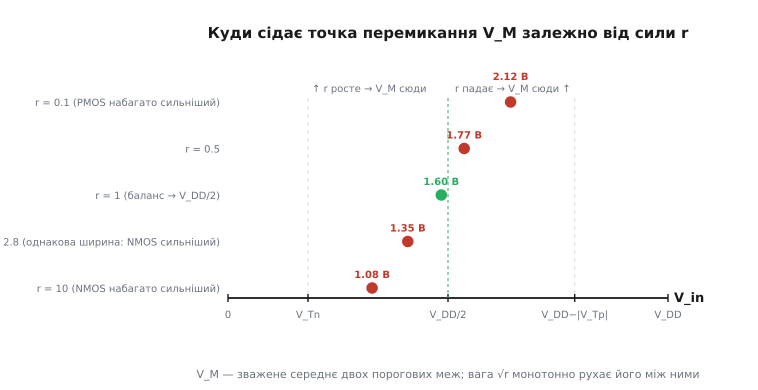

# 🧮 Виведення точки перемикання V_M

Точка перемикання інвертора — це напруга на вході, яку схема сприймає як межу між «0» і «1». Її позначають V_M і означають дуже конкретно: це та єдина напруга, при якій **вихід дорівнює входу**, V_out = V_in. Провести діагональ через квадрат передавальної кривої, знайти, де вона перетинає саму криву, — і ось вона, V_M. Але це геометричне означення нічого не пояснює. Воно каже, *де* точка, і мовчить, *чому* вона там. А цікаве саме «чому»: виявляється, що положення V_M повністю визначається одним-єдиним числом — співвідношенням «сили» двох транзисторів. Зараз ми виведемо це з фізики струму крізь транзистор, крок за кроком, і побачимо, як складна на вигляд формула

```
       V_DD − |V_Tp| + V_Tn · √r
V_M = ─────────────────────────────
              1 + √r
```

народжується з однієї простої вимоги рівноваги. А заразом стане ясно, чому інженери роблять PMOS ширшим за NMOS і що станеться з логікою, якщо цього не зробити.

## Що означає «точка рівноваги» фізично

Почнімо з картинки, яку варто тримати в голові весь час. Вихідний вузол інвертора — це точка, яку два транзистори тягнуть у різні боки. PMOS зверху тягне її до плюса живлення, NMOS знизу — до землі. Обидва увімкнені спільним затвором, який і є входом. Якщо детальніше про те, як напруга на затворі відкриває чи закриває канал польового транзистора, — [MOSFET як керований напругою ключ](root:hw-components/mosfet-modes): поки напруга затвор-джерело не перевалила поріг, канал закритий і струм не тече; за порогом канал відкривається, і що далі за поріг — то ширше він проводить.

У двох стійких станах усе просто: один транзистор широко відкритий, другий закритий, вихід сидить на живленні або на землі. Але нас цікавить не стійкий стан, а мить переходу. Уявімо, що ми повільно піднімаємо вхід від нуля. Спершу відкритий лише PMOS, вихід на плюсі. Піднімаємо далі — і в якийсь момент NMOS теж починає відкриватися (його затвор перевалив поріг). Тепер **обидва відкриті**, обидва проводять струм. PMOS усе ще тягне вгору, NMOS уже тягне вниз. Вихід повзе донизу з живлення.

Є одна особлива точка на цьому шляху, де тяга вгору й тяга вниз **зрівнюються**. Не в сенсі «однакові сили» абстрактно, а в дуже конкретному електричному сенсі: обидва транзистори прокачують **однаковий струм**. І це не збіг, а необхідність — вони ж з'єднані послідовно, від плюса через PMOS, через вузол виходу, через NMOS до землі. Струм, що входить у вузол зверху, мусить дорівнювати струму, що виходить знизу (інакше заряд накопичувався б у вузлі, а він не може — це просто провідник). Тож у будь-якій точці кривої струм крізь PMOS дорівнює струму крізь NMOS. Завжди.

> 🔧 **Навіщо це.** Умова «однаковий струм крізь обидва» — це не спеціальна властивість точки V_M, а закон збереження заряду, чинний по всій кривій. Особливість V_M в іншому: там обидва транзистори водночас перебувають у режимі насичення, де струм описується найпростішою формулою. Саме тому саме в цій точці рівняння струмів дає гарний замкнений розв'язок — і саме тому проєктувальник бібліотечної комірки може розрахувати V_M на папері, а не ганяти симуляцію на кожен варіант.

Питання «де сидить V_M» перетворюється на питання «при якій вхідній напрузі струм крізь відкритий PMOS дорівнює струму крізь відкритий NMOS, коли обидва в насиченні». Щоб на нього відповісти, треба знати, як струм транзистора залежить від напруг. Це і є square-law — закон квадрата.

## Струм насичення: закон квадрата, і звідки береться квадрат

Транзистор у режимі насичення (англ. *saturation* — насичення, «більше струму вже не додаси, скільки не піднімай стік») поводиться майже як джерело струму, кероване напругою на затворі. Струм тут майже не залежить від напруги на самому транзисторі (стік-джерело) — от чому крива в середній зоні така крута. Зате він різко залежить від того, **наскільки затвор перевалив поріг**. Цю різницю — між напругою затвор-джерело і пороговою напругою — називають напругою перевантаження (англ. *overdrive* — «понад те, що потрібно, щоб відкрити»). І струм насичення пропорційний **квадрату** цієї напруги:

```
I_D(насич) = (k / 2) · (V_GS − V_T)²
```

Тут V_GS — напруга затвор-джерело, V_T — порогова, а k — коефіцієнт «сили» транзистора, який збирає в собі всю фізику й геометрію: рухливість носіїв, ємність підзатворного окису на одиницю площі, і — головне для нас — відношення ширини каналу до довжини, W/L. Ширший канал (більше W) → більший k → сильніший транзистор. Запам'ятаймо це, бо саме тут ховається важіль, яким інженер керує положенням V_M.

Звідки квадрат? Це не підгонка під експеримент, а прямий наслідок фізики каналу, і варто побачити механізм, а не приймати на віру. Струм — це заряд, помножений на швидкість його руху. У каналі транзистора обидва множники залежать від перевантаження, і саме тому виходить квадрат:

- **Заряду в каналі більше, коли затвор сильніше відкритий.** Затвор і канал — це, по суті, обкладки конденсатора. Скільки заряду він наведе в каналі, залежить від напруги понад поріг: заряд ∝ (V_GS − V_T). Перевалив поріг ледь-ледь — тонесенький канал, мало заряду. Перевалив на вольт — товстий канал, багато заряду. Це перший множник.
- **Цей заряд ще й рухається швидше, коли перевантаження більше.** Швидкість носіїв задає поздовжнє поле вздовж каналу, а воно в режимі насичення теж пропорційне перевантаженню (V_GS − V_T). Це другий множник.

Перемножте два множники, кожен ∝ (V_GS − V_T), — і дістанете (V_GS − V_T)². Ось звідки квадрат: **більше заряду, і кожна порція заряду рухається швидше** — два незалежні ефекти, обидва ростуть із перевантаженням, тому струм росте як квадрат. Множник ½ виринає, коли акуратно проінтегрувати заряд уздовж каналу, бо в режимі насичення канал не рівномірний — біля стоку він звужується аж до перетискання (англ. *pinch-off* — защемлення). Точне значення ½ для нашого виведення несуттєве: воно однакове для обох транзисторів і скоротиться. Важлива сама квадратична форма.

Цей квадратичний опис — так звана модель Шоклі (англ. *square-law*, за Вільямом Шоклі, чия теорія польового каналу початку 1950-х дала цю квадратичну залежність струму насичення). Статус: усталена базова модель, точна для «довгих» транзисторів; для сучасних дуже коротких каналів вона завищує струм, і про поправку скажемо наприкінці. Але для розуміння, *звідки береться V_M і чим вона керується*, square-law — рівно той інструмент, що треба: досить простий, щоб довести все до формули руками, і досить правильний, щоб формула казала правду про фізику.

## Записуємо струм кожного транзистора біля V_M

Тепер обережно з напругами. Це місце, де плутають знаки, тож розберімо кожен транзистор окремо, дивлячись на його джерело.

**NMOS (нижній).** Його джерело сидить на землі (0 В). Затвор — це вхід інвертора, тобто V_in. Значить, напруга затвор-джерело NMOS дорівнює просто V_in. Поріг NMOS назвемо V_Tn (додатне число, скажімо 0.6 В). Струм насичення NMOS:

```
I_n = (k_n / 2) · (V_in − V_Tn)²
```

NMOS відкритий, поки V_in > V_Tn; що вищий вхід, то сильніше він тягне вихід донизу. Логічно: високий вхід має давати низький вихід.

**PMOS (верхній).** Ось де треба бути уважним. Джерело PMOS сидить не на землі, а на **плюсі живлення**, V_DD. Затвор — той самий вхід, V_in. Тому напруга затвор-джерело PMOS — це не V_in, а різниця V_in − V_DD, яка **від'ємна**. Поріг PMOS теж від'ємний (позначимо V_Tp, від'ємне число), і PMOS відкривається, коли V_GS менша (від'ємніша) за поріг: V_in − V_DD < V_Tp. Щоб не воювати зі знаками, домовимося писати |V_Tp| — модуль порога PMOS (те саме число за величиною, але додатне, скажімо 0.7 В).

Перевантаження PMOS — це наскільки джерело «вище» за суму (вхід + поріг). Акуратно: величина перевантаження PMOS дорівнює V_DD − V_in − |V_Tp|. Поки ця величина додатна, PMOS відкритий і тягне вгору. Струм насичення PMOS:

```
I_p = (k_p / 2) · (V_DD − V_in − |V_Tp|)²
```

Перевіримо здоровим глуздом. Хай V_in = 0 (вхід «0»). Тоді перевантаження PMOS = V_DD − 0 − |V_Tp| = V_DD − |V_Tp| — велике, PMOS широко відкритий, тягне вихід до плюса. Саме так і має бути: низький вхід → високий вихід. Хай V_in росте до V_DD − |V_Tp|: перевантаження падає до нуля, PMOS закривається. Знаки збігаються з фізикою — можна рахувати далі.

## Прирівнюємо струми й розв'язуємо

У точці рівноваги V_in = V_M, і обидва транзистори женуть однаковий струм: I_n = I_p. Пишемо це:

```
(k_n / 2) · (V_M − V_Tn)²  =  (k_p / 2) · (V_DD − V_M − |V_Tp|)²
```

Двійки в знаменниках однакові — скорочуються. Лишається:

```
k_n · (V_M − V_Tn)²  =  k_p · (V_DD − V_M − |V_Tp|)²
```

Тепер ключовий крок, який робить усе прозорим. Розділимо обидві частини на k_p:

```
(k_n / k_p) · (V_M − V_Tn)²  =  (V_DD − V_M − |V_Tp|)²
```

Уся фізика двох транзисторів — рухливості, ширини, ємності окису — зібралася в **одне-єдине число**, відношення сил:

```
r = k_n / k_p
```

Це і є той важіль, про який ми говорили. Формула стає:

```
r · (V_M − V_Tn)²  =  (V_DD − V_M − |V_Tp|)²
```

Обидві сторони — квадрати додатних величин (у робочій зоні обидва транзистори відкриті, тож обидві дужки додатні). Тому можна безпечно взяти квадратний корінь з обох сторін, і знак лишиться додатним:

```
√r · (V_M − V_Tn)  =  V_DD − V_M − |V_Tp|
```

Оце вже лінійне рівняння відносно V_M — квадрати зникли, корінь узяли. Далі чиста алгебра: розкриваємо ліву дужку, зносимо всі V_M ліворуч, решту праворуч.

```
√r · V_M − √r · V_Tn  =  V_DD − V_M − |V_Tp|
```

Додаємо V_M до обох сторін і переносимо √r·V_Tn праворуч:

```
√r · V_M + V_M  =  V_DD − |V_Tp| + √r · V_Tn
```

Ліворуч виносимо V_M за дужку:

```
V_M · (√r + 1)  =  V_DD − |V_Tp| + √r · V_Tn
```

Ділимо на (√r + 1) — і ось вона, точка перемикання:

```
       V_DD − |V_Tp| + V_Tn · √r
V_M = ─────────────────────────────
              1 + √r
```

Уся складність зникла. Точка перемикання — це просто зважене середнє двох порогових меж («де відкривається NMOS» і «де закривається PMOS»), а вага — квадратний корінь із відношення сил √r. Один транзистор сильніший — він перетягує V_M на свій бік. Ось і вся суть; решта статті — читати цю формулу.

## Читаємо формулу: симетричний випадок r = 1

Найважливіший окремий випадок — коли транзистори однаково сильні, k_n = k_p, тобто r = 1, а отже √r = 1. Підставимо:

```
       V_DD − |V_Tp| + V_Tn · 1        V_DD − |V_Tp| + V_Tn
V_M = ────────────────────────────  =  ──────────────────────
              1 + 1                             2
```

Якщо ще й пороги симетричні за величиною, |V_Tp| = V_Tn (типова ситуація в збалансованому процесі), то −|V_Tp| + V_Tn = 0, і члени з порогами взаємно знищуються:

```
V_M = V_DD / 2
```

Точка перемикання сідає **рівно посередині живлення**. Це ідеал, і ось чому. Передавальна крива стає симетричною відносно центру квадрата: скільки місця «дихати» лишається сигналу «1» зверху, стільки ж лишається сигналу «0» знизу. Обидва запаси завадостійкості однакові. Байдуже, чи завада штовхає вхід угору, чи вниз — інвертор однаково стійкий в обидва боки. Про те, як із форми кривої й положення V_M народжується сам цей запас, — [запас завадостійкості](root:hw-digital/noise-margin): це відстань між тим, що вихід гарантовано видає як чистий рівень, і тим, що вхід гарантовано приймає; симетрична V_M ділить цю відстань порівну між «0» і «1».

Зверніть увагу на витончену деталь: навіть якщо пороги трохи різні, а сили рівні (r = 1), точка перемикання не сідає точно на V_DD/2 — вона зсунута на півсуми порогів. Наприклад, при V_Tn = 0.6 В і |V_Tp| = 0.7 В:

```
V_M = (V_DD − 0.7 + 0.6) / 2 = (V_DD − 0.1) / 2
```

тобто на 0.05 В нижче середини. Дрібниця, але формула чесно її показує — і це якраз ознака того, що ми вивели правду, а не наближення «на око».

## Читаємо формулу: як r рухає точку

Тепер найцікавіше — що робить r ≠ 1. Придивімося до структури: V_M — це зважене середнє двох чисел, і вага √r сидить біля порога NMOS (V_Tn), а «одиниця» — біля межі PMOS (V_DD − |V_Tp|). Чим більший r, тим більша вага в NMOS-члена, тим ближче V_M присувається до нижнього краю. Спробуймо в межах.

**Дуже сильний NMOS (r → ∞).** Тоді √r величезний, і в чисельнику та знаменнику домінує саме він:

```
       V_DD − |V_Tp| + V_Tn·√r        V_Tn·√r
V_M ≈ ──────────────────────────  ≈  ──────────  =  V_Tn
              1 + √r                     √r
```

V_M сповзає аж до порога NMOS. Фізично зрозуміло: якщо NMOS набагато сильніший, він перетягує вихід донизу, щойно ледь-ледь відкриється, тобто щойно вхід перевалить V_Tn. Схема стає гіперчутливою до низьких сигналів — найменше підняття входу над порогом NMOS уже кидає вихід у «0».

**Дуже сильний PMOS (r → 0).** Тоді √r → 0, і лишається:

```
       V_DD − |V_Tp| + 0
V_M ≈ ────────────────────  =  V_DD − |V_Tp|
              1 + 0
```

V_M піднімається аж до межі, де закривається PMOS. Дзеркально: сильний PMOS тримає вихід угорі, поки не закриється сам, тобто поки вхід не підповзе під V_DD − |V_Tp|. Схема стає стійкою до низьких сигналів, зате нервовою до високих.

Отже, r — це буквально повзунок положення V_M між двома краями: r великий → V_M вниз до V_Tn, r малий → V_M вгору до V_DD − |V_Tp|, r = 1 → посередині. Ця монотонність — прямий наслідок того, що √r входить у зважене середнє. І оскільки залежність від r іде через корінь, вона **пом'якшена**: щоб помітно зсунути V_M, r треба міняти в рази, не на відсотки. Це добре — точка перемикання не сіпається від дрібних технологічних розкидів k_n і k_p.


*Точка перемикання — зважене середнє двох порогових меж; вага √r рухає її монотонно між порогом NMOS (сильний NMOS) і межею закриття PMOS (сильний PMOS), сідаючи на V_DD/2 у балансі.*

## Що таке r насправді: рухливість і геометрія

Ми весь час писали r = k_n/k_p як абстрактне «відношення сил». Розкриймо, з чого воно складається — бо саме тут ховається причина, чому реальні PMOS роблять ширшими.

Коефіцієнт k кожного транзистора має вигляд:

```
k = μ · C_ox · (W / L)
```

де μ — рухливість носіїв (наскільки легко вони біжать під полем), C_ox — ємність підзатворного окису на одиницю площі, W/L — відношення ширини каналу до довжини. Розділимо k_n на k_p. Ємність окису C_ox і довжина L зазвичай однакові для обох транзисторів однієї комірки — вони скорочуються. Лишається головне:

```
     k_n     μ_n · W_n
r = ───── = ───────────
     k_p     μ_p · W_p
```

Тут μ_n — рухливість електронів (носіїв у NMOS), μ_p — рухливість дірок (носіїв у PMOS). І ось фізичний факт, який усе визначає: **у кремнії електрони рухливіші за дірки приблизно у 2.5–3 рази**. Довідкові значення об'ємної рухливості: електрони — близько 1350 см²/(В·с), дірки — близько 480 см²/(В·с), тобто відношення μ_n/μ_p ≈ 2.8 (усталений факт; у реальному каналі транзистора рухливості нижчі через розсіяння на поверхні, але їхнє відношення лишається того самого порядку, ~2–2.5). Причина фізична: дірка — це не частинка, а відсутність електрона у зв'язку, і її «рух» — це естафета, коли сусідні електрони по черзі заповнюють вакансію; така естафета природно повільніша за вільний біг електрона провідності.

Тепер видно проблему. Якби зробити транзистори однакової ширини (W_n = W_p), то

```
r = μ_n / μ_p ≈ 2.8
```

NMOS вийшов би майже втричі сильнішим за PMOS **просто через матеріал**, без жодного наміру. А ми щойно бачили, що великий r тягне V_M вниз — точка перемикання сповзла б помітно нижче V_DD/2, крива втратила б симетрію, запаси завадостійкості перестали б бути рівними. Це і є прихована несправедливість кремнію: він за замовчуванням робить нижній ключ сильнішим за верхній.

Ліки очевидні з формули для r. Щоб дістати r = 1 (баланс), треба, щоб добутки μ·W зрівнялися:

```
μ_n · W_n = μ_p · W_p    ⟹    W_p / W_n = μ_n / μ_p ≈ 2.8
```

Тобто PMOS роблять **приблизно втричі ширшим** за NMOS — рівно в те число разів, у яке дірки повільніші за електрони. Ширший канал проводить пропорційно більший струм, і геометрія компенсує слабкість матеріалу. Ось чому на будь-якому кристалі під мікроскопом верхній (P) транзистор помітно товщий за нижній (N): це не примха, а точний розрахунок, щоб V_M сіла посередині.

> 🔧 **Навіщо це.** У бібліотеці стандартних комірок збалансований інвертор задають раз, і мільйони його копій розкидано по всьому кристалу. Відношення W_p/W_n ≈ 2–3 закладають прямо в геометрію комірки — це та константа, що ставить V_M на V_DD/2 і робить запас завадостійкості симетричним. Помилка в цьому відношенні не лишається локальною: вона однаково зсуває точку перемикання в кожній копії комірки, тобто множиться на мільйони. Тому баланс ширин — одне з найперших рішень у проєктуванні комірки, а не косметика.

Варто чесно сказати й про ціну балансу. Ширший PMOS — це більша площа й більша ємність затвора, яку треба перезаряджати при кожному перемиканні. Ідеальна симетрія V_M = V_DD/2 коштує швидкості й енергії. Тому в реальних бібліотеках відношення часто беруть трохи меншим за «повні» 2.8 (скажімо, 2 замість 2.8): V_M сідає *майже* посередині, симетрія *майже* ідеальна, зате комірка менша і швидша. Формула для V_M дозволяє точно порахувати, скільки симетрії ми віддаємо за кожну зекономлену одиницю ширини, — і саме тому вона робочий інструмент, а не прикраса підручника.

## Worked-приклад: рахуємо V_M і зсув від дисбалансу

Візьмімо конкретні числа й пройдімо формулу до кінця, щоб побачити її в дії. Живлення V_DD = 3.3 В, пороги V_Tn = 0.6 В, |V_Tp| = 0.7 В.

**Крок 1 — збалансований інвертор (r = 1).** PMOS зроблено втричі ширшим, рухливість скомпенсовано, сили рівні:

```
√r = √1 = 1
V_M = (3.3 − 0.7 + 0.6·1) / (1 + 1)
    = (3.3 − 0.7 + 0.6) / 2
    = 3.2 / 2
    = 1.60 В        ← майже V_DD/2 = 1.65 В (різниця 0.05 В — від несиметрії порогів)
```

Точка перемикання сіла на 1.60 В — практично посередині. Крива симетрична, запаси зверху й знизу майже рівні.

**Крок 2 — забули розширити PMOS (r ≈ 2.8).** Транзистори однакової ширини, тож r дорівнює самому відношенню рухливостей:

```
√r = √2.8 ≈ 1.67
V_M = (3.3 − 0.7 + 0.6·1.67) / (1 + 1.67)
    = (2.6 + 1.00) / 2.67
    = 3.60 / 2.67
    ≈ 1.35 В        ← точка перемикання з'їхала вниз на ~0.25 В від центру
```

Точка перемикання впала з 1.60 В до 1.35 В — на чверть вольта нижче, ніж мала б. Що це означає на практиці? Інвертор став «нервовим» до низьких сигналів. Уявімо, що на вхід приходить сигнал, який мав би читатися як чистий «0», але через завади трохи піднявся над нулем. У збалансованій схемі він мав би простір до 1.6 В, поки не почав би сприйматися як «1». А в незбалансованій межа опустилася до 1.35 В — простору стало менше на чверть вольта. Запас завадостійкості знизу з'їли, а зверху навпаки роздули. Симетрія зникла.

**Крок 3 — а якби, навпаки, перестаралися й зробили PMOS удвічі сильнішим за потрібне (r ≈ 0.5)?** Тоді:

```
√r = √0.5 ≈ 0.71
V_M = (3.3 − 0.7 + 0.6·0.71) / (1 + 0.71)
    = (2.6 + 0.43) / 1.71
    = 3.03 / 1.71
    ≈ 1.77 В        ← точка перемикання піднялася вище центру
```

Дзеркальна історія: тепер V_M заповзла вище середини, і схема стала нервовою вже до високих сигналів. Три розрахунки разом показують те, що формула обіцяла аналітично: r — це повзунок, який точно й передбачувано рухає точку перемикання, а квадратний корінь робить цей рух плавним.

## Що square-law не бачить, і чому це не псує висновок

Чесність вимагає сказати, де наша модель спрощує. Квадратичний закон I ∝ (V_GS − V_T)² точний для «довгих» транзисторів, де носії встигають розігнатися полем по всій довжині каналу. У сучасних дуже коротких каналах (десятки нанометрів) поле таке сильне, що носії впираються в стелю швидкості — настає насичення швидкості (англ. *velocity saturation*): швидкість перестає рости з полем, бо носії віддають зайву енергію решітці, розсіюючись на теплових коливаннях. Коли швидкість «застигла», один із двох множників, що давали квадрат, більше не росте, і струм починає залежати від перевантаження радше **лінійно**, ніж квадратично.

Це вловлює точніша модель — α-степеневий закон (Сакураї і Ньютон, IEEE Journal of Solid-State Circuits, квітень 1990), де показник степеня α сидить між 1 (повне насичення швидкості) і 2 (класичний квадрат): I ∝ (V_GS − V_T)^α. Та сама процедура — прирівняти струми в точці рівноваги — дає загальнішу формулу V_M, у якій замість √r стоїть r у степені 1/(1+α) абощо. Ключове: **структура висновку не змінюється**. V_M усе одно виходить зваженим середнім двох порогових меж, вага все одно керується відношенням сил r, і r усе одно рухає точку монотонно між тими самими краями. Змінюється лише *показник* степеня у ваги — з ½ (корінь) на щось між ⅓ і ½. Тому вся інтуїція, яку ми збудували на square-law, — «r керує положенням», «r = 1 дає симетрію», «PMOS ширший, бо дірки повільніші» — лишається чинною й для найсучасніших процесів. Просто число «наскільки саме зсунеться V_M» треба брати з точнішої моделі, а *напрямок і причину* зсуву square-law показує правильно й наочно.

І це, власне, головна цінність усього виведення. Ми не просто дістали формулу — ми побачили, що положення точки перемикання зводиться до одного числа r, що це число складається з рухливості й геометрії, і що баланс V_M = V_DD/2 — це свідоме інженерне рішення розширити PMOS, а не подарунок природи. Наступного разу, побачивши під мікроскопом кремнієву комірку з товстим верхнім транзистором, ви знатимете, яке саме рівняння він задовольняє.
