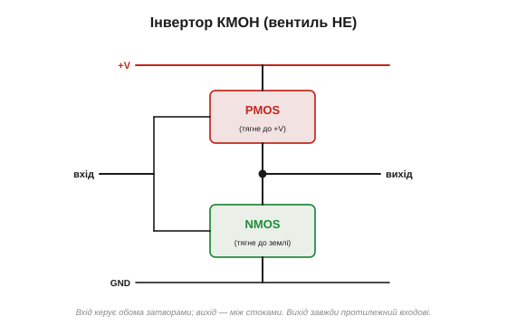
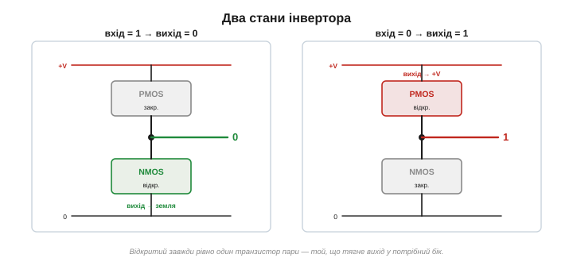
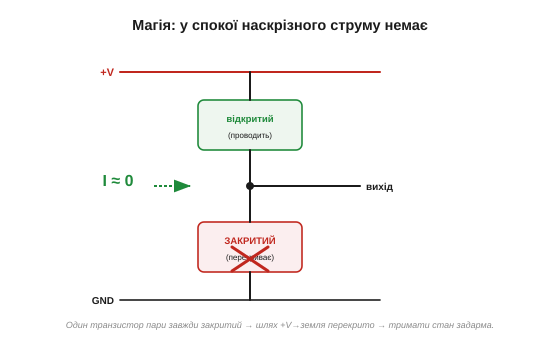
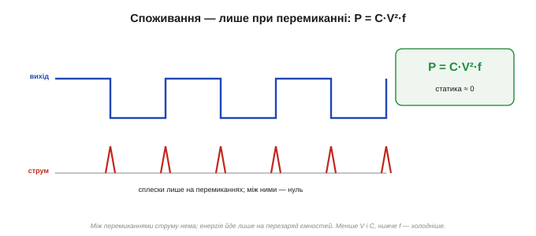
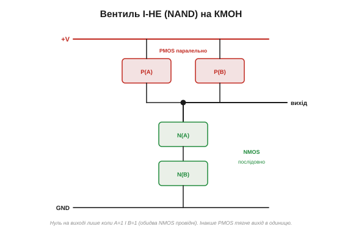
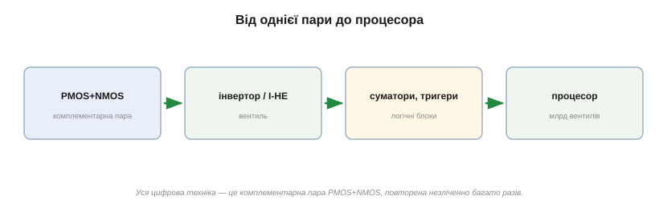

# CMOS: пара, з якої зроблено всю цифрову техніку

Існує ідея, що зводить разом [комплементарну пару](topic:hw-components/nmos-pmos) N- і P-канальних транзисторів і їхнє [динамічне споживання](topic:hw-components/gate-capacitance), — і вона варта того, щоб розібрати її як слід, бо вона найбільший тріумф польового транзистора й фундамент усієї цифрової техніки. Це **КМОН** *(CMOS — complementary MOS)*: пара з N- і P-канального MOSFET, із якої складено кожен процесор, кожну комірку пам'яті на Землі.

### Інвертор: найдрібніша цеглинка

Почнімо з найпростішого вузла — **інвертора** *(inverter)*, він же вентиль **НЕ**. Це рівно та [комплементарна пара](topic:hw-components/nmos-pmos):

- **PMOS** угорі, витоком до **+V** (він добре тягне вихід до одиниці);
- **NMOS** унизу, витоком до **землі** (він добре садить вихід до нуля);
- їхні **затвори з'єднані** — це **вхід**; їхні **стоки з'єднані** — це **вихід**.

Простежмо, що він робить:

- **Вхід = 1 (висока напруга):** NMOS відкривається (Vgs > 0), PMOS закривається (його Vgs ≈ 0). Вихід притягнуто до **землі** → **0**.
- **Вхід = 0 (низька напруга):** навпаки — PMOS відкривається, NMOS закривається. Вихід притягнуто до **+V** → **1**.

Вихід — завжди **перевернутий** вхід: 1→0, 0→1. Це і є «НЕ», найдрібніша цеглинка всієї логіки.


*Інвертор. PMOS тягне вихід до +V, NMOS — до землі; затвори з'єднані (вхід), стоки з'єднані (вихід). Вихід — завжди протилежний входові.*


*Два стани. Вхід «1» відмикає NMOS — вихід сідає на землю («0»). Вхід «0» відмикає PMOS — вихід підтягується до +V («1»). У кожному стані відкритий рівно один із пари.*

Цікава дрібниця: рівно **посередині** переходу, коли вхід близько до порога, інвертор насправді працює як **підсилювач** із великим підсиленням — обидва транзистори прочинені, і крихітна зміна входу дає велику зміну виходу. Цифрова техніка проскакує цю зону якнайшвидше (там і нечіткість, і витрати), а от в аналогових схемах той самий інвертор інколи навмисне тримають у ній — як готовий каскад підсилення. Але це вже інша історія.

### Магія: у спокої струму немає

Ось серце КМОН, заради чого все й затівалося. Придивіться: у **кожному** зі станів відкритий **рівно один** транзистор пари, а другий **закритий**. А отже, **немає наскрізного шляху** від +V до землі — він завжди перекритий тим, що закрите. Тому в усталеному стані крізь інвертор **струму майже не тече** (лише крихітний [струм витоку](topic:hw-components/mosfet-threshold)).

Це й є магія КМОН: **тримати** будь-який стан — «0» чи «1» — коштує майже **нічого**. Саме тому мільярд таких вентилів можна стиснути в один процесор, і він не розплавиться від самого лиш утримання стану.


*Чому КМОН майже не споживає. Хоч у якому стані, один транзистор пари закритий і перекриває шлях від +V до землі. Тож у спокої наскрізного струму немає — тримати стан задарма.*

> 🔧 **Навіщо це.** [Однотипна MOS-логіка](topic:hw-components/nmos-pmos) (як-от NMOS) обходилася резистором-підтяжкою замість другого транзистора. Той резистор у половині станів безперервно лив струм від +V до землі — чип грівся й жер енергію навіть нічого не роблячи. КМОН прибрала цей резистор, замінивши його **активним** PMOS, що в потрібний момент сам закривається. Звідси й стрибок економності: демонстраційна КМОН-схема споживала в спокої **в мільйон разів** менше за тодішню біполярну логіку. Це не покращення на відсотки — це інша ліга.

### Звідки ж тоді споживання: динаміка

Якщо в спокої струму нема, чому процесор гарячий? Бо споживання КМОН — **динамічне**: воно виникає лише в **мить перемикання**. Щоб перемкнути вихід, треба перезарядити всі ємності, що висять на ньому, — затвори наступних вентилів, ємність доріжок. Це той самий [заряд-розряд ємності затвора](topic:hw-components/gate-capacitance), тільки тепер у масштабі цілого чипа.

Енергія на одне перемикання — приблизно ½·C·V², а сумарна потужність:

```
P(динамічна) ≈ C · V² · f
```

де C — ємність навантаження, V — напруга живлення, f — частота перемикань. Одна формула керує **всім** споживанням цифрової техніки. З неї видно, чому борються за **низьку напругу** (квадрат!) і **малу ємність** (дрібніші транзистори), і чому розгін частоти f напряму додає тепла.


*КМОН споживає лише при перемиканні — на перезаряд ємностей виходу. P = C·V²·f. Тому знижують напругу (квадрат!) і ємність, а розгін частоти прямо додає тепла.*

Числа на відчуття. Хай один вентиль має на виході ємність C ≈ 1 фФ (фемтофарада), живлення V = 1 В, перемикається на f = 1 ГГц: енергія за такт ≈ ½·C·V² ≈ 0.5 фДж, а потужність C·V²·f ≈ 1 мкВт. Дрібниця! Та помножте на **мільярд** вентилів — і вже сотні ватів. Рятує те, що не всі вони перемикаються щотакту (більшість стоїть), тож реальне споживання менше; але порядок саме такий — звідси й уся боротьба за зниження V та C.

Є й дрібніша добавка до динаміки. У саму **мить** переходу, поки вхід проходить десь посередині, на коротку хвильку відкриваються **обидва** транзистори пари — і крізь них проскакує невеликий наскрізний імпульс (його звуть протіканням, *shoot-through*). Тому переходи й намагаються робити різкими: що швидше вхід проскочить «небезпечну середину», то менший цей імпульс. Але в усталеному стані наскрізного струму немає зовсім — протікання живе лише в коротку мить самого переходу.

> 🔧 **Навіщо це.** Саме ця формула P = C·V²·f і привела до «**стіни потужності**». Десятиліттями транзистори меншали, напруга падала — і частоту вдавалося піднімати майже задарма. Та десь по 2005 році напругу вже не було куди знижувати, а мільярди швидких вентилів стали виділяти стільки тепла, що далі гнати частоту стало неможливо. Тому процесори перестали просто «прискорюватися» й пішли вшир — у **багатоядерність**. Уся ця історія — наслідок одного рядка C·V²·f.

Та сама формула пояснює й те, чому живлення цифрових чипів десятиліттями **падало**: 5 В → 3.3 → 1.8 → близько 1 В сьогодні. Кожне зниження напруги через квадрат V² різко зменшує споживання й тепло, тож щойно технологія дозволяла, напругу опускали.

А от у найдрібнішому масштабі КМОН частково втратила свою магію. Коли транзистори зменшили до кількох нанометрів, [**підпороговий** струм витоку](topic:hw-components/mosfet-threshold) з кожного вентиля перестав бути зовсім мізерним, а помножений на мільярди — дав уже відчутне **статичне** споживання навіть у спокої. «Безкоштовний спокій» трохи зблід; сучасні чипи борються з витоком хитрощами, аж до вимикання живлення цілим непрацюючим блокам (*power gating*). Та принцип лишається непохитним: динаміка домінує, і КМОН досі поза конкуренцією.

### Від інвертора до будь-якої логіки

Інвертор — лише початок. Та сама ідея — **підтягувальна мережа з PMOS** (до +V) і **стягувальна з NMOS** (до землі), влаштовані так, щоб для будь-якого входу проводила рівно одна, — дає **всі** логічні вентилі.

Наприклад, вентиль **І-НЕ** *(NAND)*: знизу два NMOS **послідовно** (стягнуть вихід до нуля, лише якщо **обидва** входи «1»), а зверху два PMOS **паралельно** (підтягнуть до одиниці, якщо хоч один вхід «0»). Знову ж: для будь-якої комбінації входів працює рівно одна мережа, наскрізного струму нема, а вихід чистий.


*Вентиль І-НЕ (NAND). Стягувальна мережа — два NMOS послідовно (нуль лише коли обидва входи «1»); підтягувальна — два PMOS паралельно. Комплементарні мережі: проводить завжди рівно одна.*

А вентиль І-НЕ (як і АБО-НЕ) — **універсальний**: з самих лише НЕ-та-І комбінацій можна скласти будь-яку логічну функцію, будь-яке обчислення. Це не перебільшення: з самих І-НЕ складають суматори (щоб додавати числа), тригери (щоб пам'ятати біт), лічильники, дешифратори — і так, поверх за поверхом, аж до цілого процесора. Інженер-цифровик майже ніколи не думає про окремі транзистори: він оперує вентилями, а ті вже зведено до КМОН-пар на нижчому рівні. Складаючи мільйони й мільярди таких вентилів, отримують пам'ять, арифметику, цілий процесор. **Уся цифрова техніка — це КМОН-вентилі**, повторені незліченно багато разів.

І не лише обчислення. Швидка пам'ять процесора (кеш, регістри) — теж КМОН-вентилі, зчеплені в комірки, що тримають біт. Тобто і «думання», і «пам'ять» чипа зроблено з тієї самої комплементарної пари. Коли кажуть «у процесорі N мільярдів транзисторів», за цим стоять приблизно N/2 мільярдів КМОН-пар, кожна з яких — той самий PMOS+NMOS, що й на одному інверторі.


*Сходження масштабу. Інвертор → універсальний вентиль І-НЕ → логічні блоки → процесор із мільярдів КМОН-вентилів. Усе цифрове зведено до повторення комплементарної пари.*

### Чистота рівнів — теж від пари

Є ще одна причина, чому КМОН така надійна. [NMOS дає **сильний** нуль](topic:hw-components/nmos-pmos) (садить до самої землі), PMOS — **сильну** одиницю (тягне до самого +V). Тож вихід КМОН-вентиля гойдається **від рейки до рейки** — чистий «0» дорівнює землі, чиста «1» дорівнює +V, без провисань. А [поріг](topic:hw-components/mosfet-threshold) надійно відрізняє їх із запасом на шум. Тому цифровий сигнал можна передавати крізь мільярди вентилів, і він не «розпливається» — кожен вентиль відновлює чисті рівні.

Цю властивість звуть **відновленням** *(regeneration)*: кожен вентиль не просто передає сигнал, а наново «вичищає» його до повних рівнів — і ще й здатен живити входи **кількох** наступних вентилів (це звуть навантажувальною здатністю, *fan-out*). Завдяки цьому з вентилів можна будувати скільки завгодно глибокі ланцюги: сигнал не згасає й не бруднішає по дорозі, бо щоразу народжується заново. Аналоговий сигнал так не вміє — він із кожним каскадом лише псується; цифровий цим і сильний.

Зупинімося на мить, щоб оцінити масштаб зробленого. Кожне натискання клавіші, кожен піксель екрана, кожен байт у пам'яті телефона проходить крізь незліченні КМОН-вентилі — і всі вони мовчки тримають свої стани, майже нічого не споживаючи, аж поки не настане їхня черга перемкнутися. Уся обчислювальна міць нашої цивілізації стоїть, зрештою, на одній скромній парі транзисторів — PMOS над NMOS, — повтореній стільки разів, скільки людині годі й уявити.

### Народження КМОН

Цю ідею — поєднати P- і N-канальні транзистори в комплементарну пару заради майже нульового споживання — подали 1963 року у Fairchild Semiconductor **Френк Ванласс** *(Frank Wanlass)* та **Чіхтан Са** *(Chih-Tang Sah)*. Їхня демонстраційна схема споживала в спокої приголомшливо мало — на шість порядків менше за тодішню біполярну логіку. Тоді це здавалося цікавинкою без застосувань (надто повільно); мине років двадцять, поки КМОН переможе всі інші технології й стане єдиною основою цифрового світу. Перелом настав, коли вирішальним стало вже не швидкодія одного вентиля, а **сумарне тепло** мільйонів: тут КМОН із її майже нульовим спокоєм не мала рівних, і доба портативної та щільної електроніки зробила ідею Ванласса й Са безальтернативною. Двоє інженерів заклали те, на чому стоїть уся цифрова цивілізація, — а кому й за що належить визнання й чому винахід так довго чекав свого часу, розберемо в історії до теми.

> 📜 **Історія:** [CMOS — Френк Ванласс і майже нульове споживання](topic:hw-digital/cmos/hist-cmos.md)

### Дві ролі однієї пари

Так польовий транзистор доходить від ідеї до її найбільшого плоду. [Поле замість струму](topic:hw-components/field-control) дало прилад, що керується задарма; з нього роблять і [силові ключі](topic:hw-components/mosfet-power-switch), і — поєднавши N та P у комплементарну пару — усю цифрову логіку, що майже не споживає в спокої. Той самий силовий ключ показує себе й у найкласичнішій ролі — там, де **чотири** такі ключі разом крутять мотор в обидва боки, у схемі [**H-міст**](topic:hw-motion/h-bridge).

---
