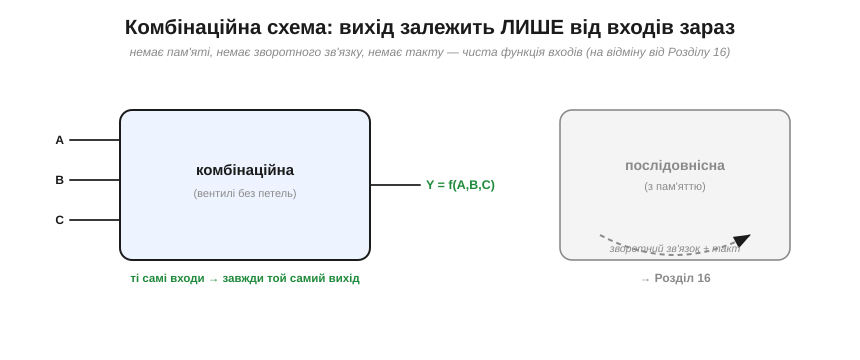
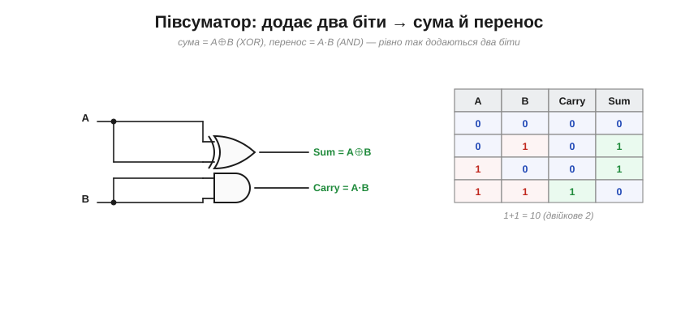
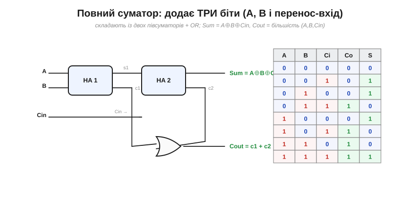
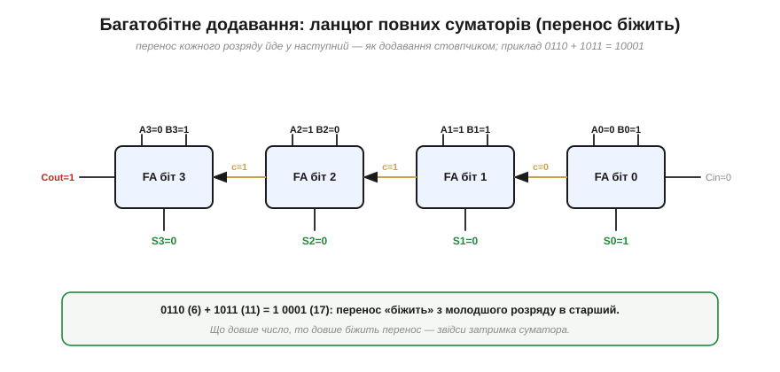
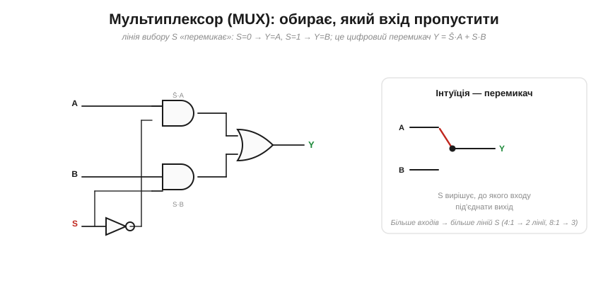
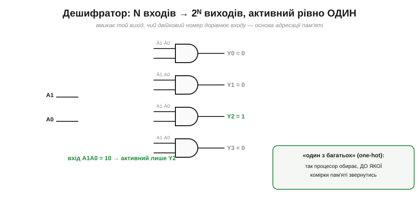

# Комбінаційні схеми: суматор, мультиплексор, дешифратор

Окремий вентиль — як окрема літера: корисно, та не дуже. Сила починається, коли з вентилів складають **блоки**, що роблять щось осмислене — додають числа, обирають сигнал, вмикають потрібний вихід. Такі блоки звуть **комбінаційними схемами** (*combinational circuits*), і саме з них, як із цеглин, складають процесор. Розберімо три найважливіші: **суматор** (рахує), **мультиплексор** (обирає) і **дешифратор** (адресує).

### Що таке комбінаційна схема

Спершу — означення, бо воно проводить важливу межу. Комбінаційна схема — це така, де **вихід залежить лише від того, що на входах ЗАРАЗ**. Подали ті самі входи — отримали той самий вихід, **завжди**, миттєво (з точністю до затримки вентилів). У неї немає **пам'яті**: вона не пам'ятає, що було секунду тому. (Одне застереження: поки сигнали ще «біжать» різними шляхами з **різними** затримками, на виході можливі короткі хибні сплески — **гонки** й **глітчі** (*hazards*); гарантована лише **усталена** відповідь, коли все вляглося. Для самої комбінаційної логіки це зазвичай не біда, але стає важливим там, де результат [защіпають за тактом](root:hw-digital/state-memory) — саме тому його читають уже після усталення.)


*Комбінаційна схема — це «чиста функція» входів: ніяких петель зворотного зв'язку, ніякого такту, ніякої пам'яті (ліворуч). Вентилі, з'єднані без кілець, — завжди комбінаційні. Протилежність — **послідовнісні** схеми (праворуч), які **пам'ятають** свій стан завдяки зворотному зв'язку й такту. Поки що — світ без пам'яті.*

Тримайте цю межу в голові: тут усе — **без пам'яті**; щойно з'являються зворотний зв'язок і «запам'ятовування», починається [інша, послідовнісна логіка](root:hw-digital/state-memory). Зараз будуємо комбінаційні блоки.

### Півсуматор: додати два біти

Найпростіша «рахувальна» схема — та, що додає **два** біти. Коли додаєш 1+1, результат — двійкове «10», тобто **сума** 0 і **перенос** 1. Отже, потрібні два виходи.


***Півсуматор** (*half-adder*). Біт **суми** — це A⊕B ([XOR](root:hw-digital/xor-comparison): 1, коли біти різні), а біт **переносу** — A·B (AND: 1 лише коли обидва 1). Таблиця підтверджує шкільне додавання: 0+0=00, 0+1=01, 1+0=01, 1+1=**10**. Саме тому XOR природно стає «бітом суми», а AND — «бітом переносу».*

«Пів-» він тому, що вміє складати лише два біти, а не враховує **перенос, що прийшов** із попереднього розряду. А для додавання багатозначних чисел це конче потрібно.

### Повний суматор: три біти

**Повний суматор** (*full-adder*) додає вже **три** біти: два доданки A, B і **перенос-вхід** Cin із молодшого розряду. На виході — біт суми й перенос-вихід Cout у старший розряд.


*Повний суматор зручно скласти з **двох півсуматорів**: перший додає A і B, другий додає до результату Cin. Біт суми виходить Sum = A⊕B⊕Cin (непарність трьох бітів — знову XOR!), а перенос Cout = 1, коли одиниць серед трьох **щонайменше дві** (функція «більшості») — його дають два внутрішні переноси, з'єднані через OR. Таблиця істинності на 8 рядків задає його повністю.*

Зверніть увагу на красу: Sum — це XOR усіх трьох входів (парність), а Cout — «більшість» (хто переважив). Ці дві функції — серце арифметики, і обидві складаються зі звичайних вентилів.

### Багатобітне додавання: ланцюговий перенос

Тепер головне. Щоб додати **багатобітні** числа, ставимо повні суматори в **ряд** — по одному на розряд — і з'єднуємо перенос-вихід кожного з перенос-входом наступного. Перенос **«біжить»** із молодшого розряду в старший, точно як ви переносите одиницю, додаючи стовпчиком на папері.


***Ланцюговий суматор** (*ripple-carry adder*) із чотирьох повних суматорів. Приклад: 0110 (6) + 1011 (11). Перенос народжується в розряді 1 (1+1=10) і **біжить** ланцюгом аж до виходу, даючи відповідь 1 0001 (17). Зверніть увагу на бурштинові стрілки переносу — це і є той «забіг» одиниці. А ще: що довше число, то довше біжить перенос, тож додавання великих чисел **повільніше** — звідси затримка, яку доводиться долати в [архітектурі процесора](root:hw-arch/what-is-processor).*

**Приклад (4-бітне додавання).** Додамо 0110 + 1011 розряд за розрядом, ведучи перенос.

```
розряд 0:  0 + 1 + 0(Cin) = 1   →  S0=1, перенос 0
розряд 1:  1 + 1 + 0       = 10  →  S1=0, перенос 1
розряд 2:  1 + 0 + 1       = 10  →  S2=0, перенос 1
розряд 3:  0 + 1 + 1       = 10  →  S3=0, перенос 1 (Cout)
результат:  1 0001  =  17   (а 6 + 11 = 17 ✓)
```

Це вже **арифметика в залізі**: схема з комбінаційних вентилів, що додає числа за один прохід сигналу. Той самий блок, лише ширший і трохи доповнений, стає **арифметико-логічним пристроєм** (АЛП) — обчислювальним [ядром процесора](root:hw-arch/what-is-processor). Так додавання будується з нуля, з самих вентилів.

### Мультиплексор: обрати вхід

Друга незамінна схема нічого не рахує — вона **обирає**. **Мультиплексор** (*multiplexer*, MUX) має кілька входів даних і **лінію вибору**, що вирішує, який саме вхід пропустити на вихід. Це цифровий «перемикач».


***Мультиплексор 2-в-1**. Лінія вибору S вирішує: за S=0 на вихід іде A, за S=1 — B. Логічно це Y = S̄·A + S·B (увімкнути A, коли S=0; увімкнути B, коли S=1; з'єднати через OR). Інтуїтивно — це перемикач, що під'єднує вихід до одного з входів (праворуч). Більше входів потребує більше ліній вибору: 4-в-1 — двох ліній, 8-в-1 — трьох (бо n ліній адресують 2ⁿ входів).*

Мультиплексор — усюдисущий: ним **спрямовують** дані («звідки взяти число — з пам'яті чи з регістра?»), будують програмовані функції, економлять дроти (багато сигналів по одній лінії по черзі). У процесорі MUX-и на кожному кроці вирішують, який сигнал куди тече.

### Дешифратор: один із багатьох

Третя схема — **дешифратор** (*decoder*). Він бере N-бітне число на вході й вмикає **рівно один** із 2ᴺ виходів — той, чий номер дорівнює вхідному числу. Решта виходів — нулі. Такий «один активний серед багатьох» називають **«один гарячий»** (*one-hot*).


***Дешифратор 2-в-4**. Двобітний вхід A1A0 вмикає один із чотирьох виходів: 00 → Y0, 01 → Y1, 10 → Y2, 11 → Y3. Кожен вихід — це AND відповідної комбінації входів (із потрібними інверсіями), тож активним стає рівно той, чия умова збіглася. Тут вхід 10 → горить лише Y2.*

Дешифратор — це **адресація** в чистому вигляді: «номер на вході → виберемо саме цей об'єкт». Саме так процесор обирає, до якої [комірки пам'яті](root:hw-arch/memory-as-array) звернутися: адреса декодується в сигнал «активувати цю комірку». Дешифратори, мультиплексори й суматори — це той рівень, на якому інженер уже мислить **блоками**, а не окремими вентилями.

Кожен такий блок усередині — це булева функція, яку спершу записують «в лоб» [сумою добутків](root:math-logic/boolean-algebra), а вона часто виходить надмірно довгою. Перетворювати її на коротший вираз законами Буля наосліп — марудно й легко помилитися. Є наочніший спосіб робити це **руками** — [карти Карно](root:hw-digital/karnaugh-maps): таблицю істинності перекладають у сітку, де сусіди різняться одним бітом, і громіздку суму добутків згортають у мінімальний вираз без алгебраїчної гімнастики.

> 🔧 **Навіщо це.** Це поворотний момент усього розділу: ви перестаєте думати «вентилями» й починаєте думати **блоками**. Бачите в схемі «MUX» — знаєте: тут щось **обирається** лінією вибору. «Decoder» — щось **адресується**. «Adder/ALU» — щось **рахується**. Ці блоки — стандартна лексика цифрової техніки: з них складають усе, від простого керування до процесора, не опускаючись щоразу до транзисторів. І кожен із них усередині — просто грамотно з'єднані AND, OR, NOT, XOR. Уміння бачити «суматор» там, де насправді сотні вентилів, — це і є інженерна **абстракція**, без якої скласти щось складне неможливо.

---

Підсумок: **комбінаційна** схема — це чиста функція входів **без пам'яті** (на відміну від [послідовнісних](root:hw-digital/state-memory), що свій стан пам'ятають). З вентилів складають корисні **блоки**: **півсуматор** (Sum=A⊕B, Carry=A·B) і **повний суматор** (три біти: Sum=A⊕B⊕Cin, Cout=більшість), а ланцюг повних суматорів дає **багатобітне додавання** з переносом, що «біжить» розрядами — основа арифметико-логічного [ядра процесора](root:hw-arch/what-is-processor). **Мультиплексор** лінією вибору **обирає** один із входів (Y=S̄A+SB), а **дешифратор** вмикає **один із 2ᴺ** виходів за номером на вході — основа [адресації пам'яті](root:hw-arch/memory-as-array). Головне — навчитися мислити **блоками**, а не вентилями: від однієї булевої операції до схем, що додають і обирають.

---
