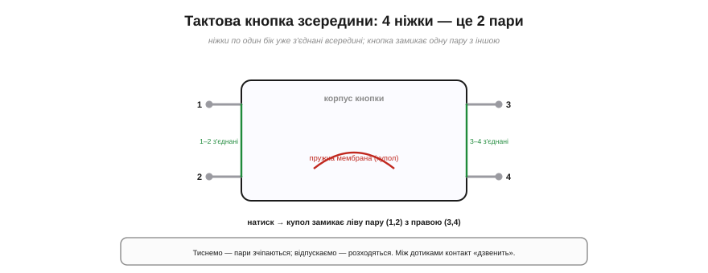
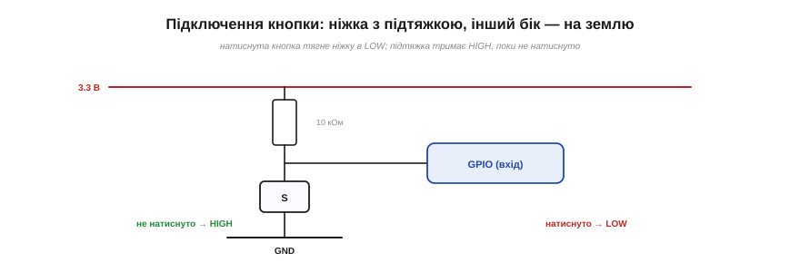

# 🔌 Тактова кнопка зсередини: чотири ніжки, одна кнопка

> Проста механічна кнопка зблизька: що в неї всередині, чому ніжок чотири й чому [брязкіт контактів](topic:hw-digital/contact-debounce) — не вада, а її природа.

## Що це за деталь

**Тактова кнопка** (*tactile pushbutton*) — найпоширеніший на макетках вимикач: крихітний квадратний корпус (часто 6×6 мм) із штовхачем згори, що **замикає** коло, доки на нього тиснеш, і **розмикає**, щойно відпустиш (момент-кнопка). Усередині — пружна металева **мембрана-купол**: натиск прогинає її, вона торкається контактів і зчіплює їх; відпускаєш — купол вистрибує назад. Той самий «клац», що ви чуєте й відчуваєте пальцем (*tactile* — «дотиковий»), і дав їй назву.

*Усередині — пружний купол-мембрана. Чотири ніжки — це дві пари, з'єднані попарно на заводі (1–2 і 3–4). Натиск зчіплює ліву пару з правою; відпускання — розчіплює. Між дотиками контакт «дзвенить».*

## Чому ніжок чотири, а кнопка одна

Найбільша загадка новачка: кнопка ж одна, чому в неї **чотири** ніжки? Бо насправді це **дві пари**, з'єднані всередині попарно. Дві ніжки по один бік корпусу вже **закорочені** між собою на заводі; дві по інший — так само. А натиск кнопки **зчіплює ліву пару з правою**. Тобто кнопка комутує не «ніжку з ніжкою», а **пару з парою**.

Звідси й найчастіша помилка: під'єднати дроти до **двох ніжок однієї пари** — а вони ж і так завжди замкнені, тож «кнопка» виходить вічно натиснутою. Правило просте: беріть ніжки **по діагоналі** (з різних пар) — тоді коло замикатиметься лише від натиску. Якщо плутаєтесь — задзвоніть тестером: пара, що дзвенить без натиску, — це «одна сторона».

## Підключення

Класична схема — кнопка як «тягач до землі». Один бік кнопки йде на **GPIO-вхід** із [**підтяжкою**](topic:hw-digital/floating-pullups) до живлення; інший — на **землю** (GND). Поки не натиснуто, підтяжка тримає вхід у **HIGH**; натиск замикає вхід на землю — і він падає в **LOW**. Зручно, що підтяжку можна взяти **внутрішню**, ту, що вже є в ESP32, — тоді зовнішніх деталей не треба зовсім, лише кнопка між ніжкою та GND.

*Кнопка тягне вхід до землі. Підтяжка (внутрішня чи 10 кОм) тримає HIGH, поки не натиснуто; натиск замикає вхід на GND — і він падає в LOW. Мінімум деталей: кнопка плюс підтяжка.*

## Перший байт

Заговорити з кнопкою найпростіше з усіх компонентів: налаштуйте ніжку входом із підтяжкою — і **читайте** її. LOW — натиснуто, HIGH — відпущено (при підтяжці до плюса). От і весь «протокол».

Та сире читання обманює: кнопка **дзвенить**. Між першим дотиком і спокоєм контакт кілька разів відскакує, даючи пачку перемикань на ~1–10 мс. Тому «прочитав LOW — порахував натиск» дасть кілька натисків там, де був один. Лікування — [**антибрязкіт**](topic:hw-digital/contact-debounce), апаратний чи програмний.

## Типові граблі

- **Замкнули одну пару.** Дроти на ніжки тієї самої сторони → кнопка вічно «натиснута». Беріть діагональ.
- **Забули підтяжку.** Без неї відпущений вхід [**плаває**](topic:hw-digital/floating-pullups) і ловить шум. Підтяжка обов'язкова — хоч внутрішня.
- **Не зробили антибрязкіт.** Один натиск рахується кількома. Це не поломка кнопки — це [фізика брязкоту](topic:hw-digital/contact-debounce).
- **Довгі дроти до кнопки.** Збирають наведення; для надійності тримайте коротко або фільтруйте.

## Варіації класу

Найпоширеніша — **6×6 мм** наскрізного монтажу (THT) під макетку; є й **SMD**-варіанти, **кутові** (під край плати), з різною висотою штовхача та **панельні** (великі, під отвір у корпусі). Розрізняються вони й **ресурсом** (дешеві — десятки тисяч натисків, якісні — мільйони) та зусиллям натиску. Електрично ж усе це — той самий простий момент-вимикач: замикає, доки тиснеш.
