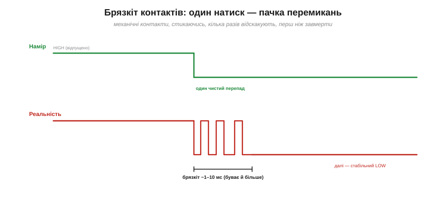
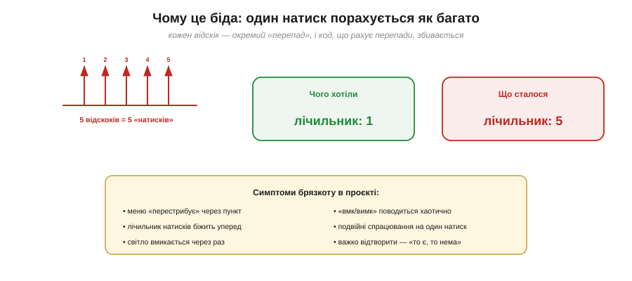
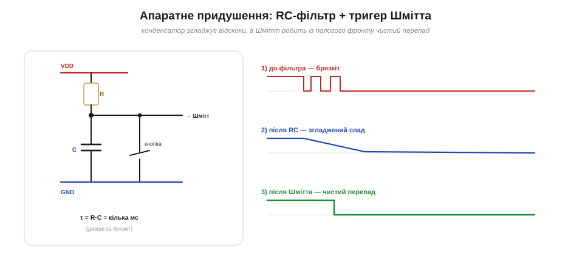
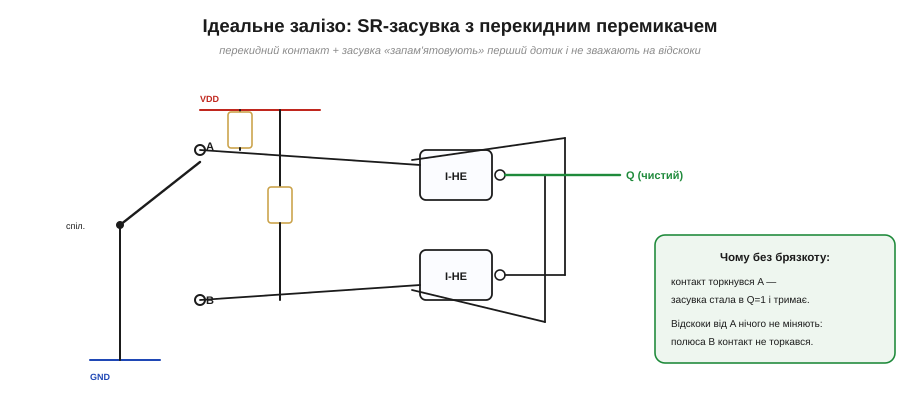
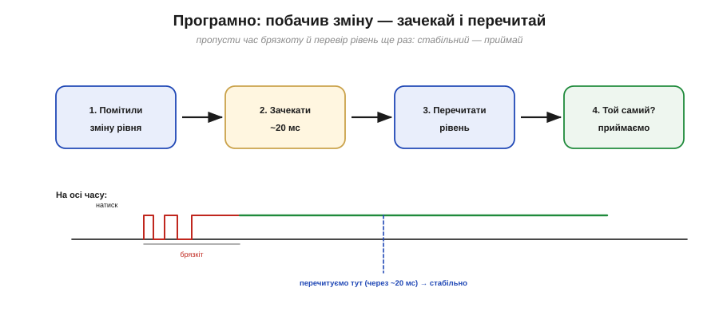
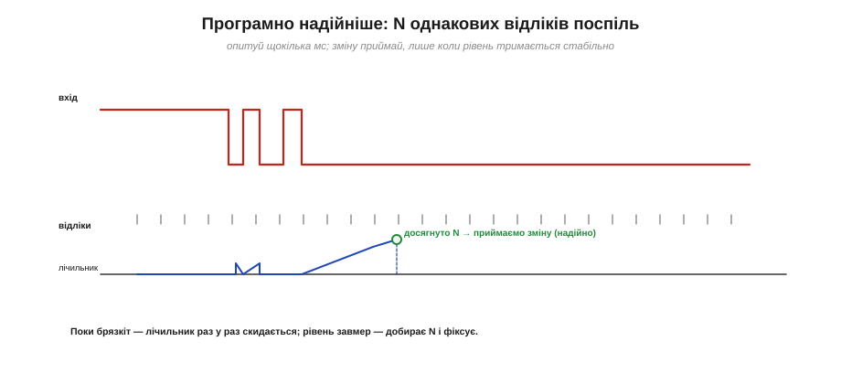

# Брязкіт контактів і його придушення (апаратно/програмно)

На схемі [кнопка з підтяжкою](topic:hw-digital/floating-pullups) — ідеал: pull-up тримає чистий HIGH, натиск дає чистий LOW. А на ділі один-єдиний натиск мікроконтролер часто бачить як **пачку** швидких 0-1-0-1. Винна не електроніка, а **механіка**: коли два металеві контакти стикаються, вони не злипаються миттєво й намертво — вони кілька разів **відскакують**, як упущений на стіл м'ячик, перш ніж завмерти. Це явище звуть **брязкотом контактів** (англ. *contact bounce*), і воно псує життя кожному, хто хоч раз читав кнопку. Ця тема — про те, звідки береться брязкіт, чому він ламає логіку й двома шляхами (залізом і кодом) приборкується.

### Що таке брязкіт

Кнопка чи перемикач — це пружні металеві контакти. Коли ви тиснете, рухомий контакт **налітає** на нерухомий і, як усяке пружне тіло, **відбивається**: торкнувся — відскочив — торкнувся ближче — знову відскочив — і так кілька разів, доки коливання не згаснуть і контакт не приляже остаточно. Кожен дотик на коротку мить **замикає** коло, кожен відскік — **розмикає**. На лінії це виглядає як швидка серія перемикань між HIGH і LOW, що триває від часу першого дотику до повного заспокоєння.

> 🔌 **Сама деталь.** Що там усередині тактової кнопки, чому в неї чотири ніжки (а кнопка — одна), як її під'єднати й чому брязкіт — її природна риса, а не брак: у вставці [Тактова кнопка зсередини](topic:hw-digital/contact-debounce/comp-tact-button.md).

> 📜 **Старий ворог.** Брязкіт — не клопіт ери мікроконтролерів: телеграфні реле, крокова АТС Строуджера й уся телефонна мережа століття боролися за чистий контакт. Як це було — в історичній вставці [Брязкіт старший за електроніку](topic:hw-digital/contact-debounce/hist-relay-bounce.md).


*Угорі — чого ми хочемо: один чистий перепад HIGH→LOW. Унизу — що насправді: контакт кілька разів відскакує, даючи пачку перемикань протягом ~1–10 мс, і лише потім завмирає в стабільному LOW. Те саме, до речі, стається й при **відпусканні** кнопки.*

Скільки триває брязкіт? Залежить від кнопки: від часток мілісекунди до десятків мілісекунд. Інженер Джек Ґанссл (Jack Ganssle) у відомому практичному дослідженні перемкнув десятки різних кнопок і виміряв їхній брязкіт — і висновок повчальний: більшість брязкоче менш як кілька мілісекунд, але трапляються й значно «балакучіші» екземпляри, а ще дешеві кнопки старіють і брязкочуть дедалі гірше. Звідси головна порада: не вгадуй «магічне число», а **виміряй або візьми з добрим запасом**. Для практики орієнтир простий — брязкіт живе в діапазоні **одиниць–десятків мілісекунд**.

Варто додати дві деталі. По-перше, брязкоче не лише замикання, а й **розмикання**: відпускаючи кнопку, контакти так само кілька разів «прощаються», перш ніж розійтися остаточно. По-друге, брязкіт **не сталий**: він залежить від сили натиску, кута, а головне — від **зносу**. З часом контакти окиснюються, бруднішають, пружина слабшає — і колись тиха кнопка починає брязкотати дедалі довше. Тому debounce — це не разове підлаштування під конкретний екземпляр, а **запас міцності** на все життя пристрою.

### Чому це ламає логіку

Здавалося б, кілька мілісекунд — мить, кого вони обходять? У тім-то й біда, що мікроконтролер **набагато швидший** за цю мить. Ядро ESP32 встигає за мілісекунду виконати сотні тисяч інструкцій, тож воно бачить **кожен** відскік як окрему, цілком справжню подію. Якщо ваш код рахує натиски «за перепадом» (а саме так найприродніше їх ловити — через переривання чи в циклі), то один фізичний натиск даватиме не одну подію, а п'ять, сім, десять.

Цікавий контраст: людина, читаючи ту саму кнопку очима по лампочці, брязкоту б **не помітила** — наше око надто повільне, щоб уловити десяток миготінь за 10 мс. А мікроконтролер на мегагерцах їх усі бачить. І байдуже, як саме ви читаєте ніжку — в циклі опитуванням чи апаратним перериванням: брязкіт б'є **обидва** способи. Переривання навіть гірше: кожен відскік — окремий виклик обробника, тож без фільтра лічильник у перериванні розганяється ще охочіше.


*П'ять відскоків код сприймає як п'ять натисків: лічильник стрибає на 5 замість 1. Звідси знайомі симптоми — меню «перестрибує» пункт, перемикач світла спрацьовує через раз, кнопка «вмк/вимк» поводиться хаотично. Найгидкіше — що баг **погано відтворюється**: брязкіт щоразу трохи інший.*

Парадокс у тому, що сам по собі мікроконтролер працює **бездоганно** — він чесно реагує на кожне перемикання, яке реально є на ніжці. Проблема не в коді й не в чипі, а в фізиці контакту. Тому й розв'язання — це **домовленість**: вважати пачку швидких перемикань протягом короткого вікна за **одну** подію. Реалізувати цю домовленість можна двома шляхами — залізом або кодом.

Перш ніж заглибитися, окинемо обидва оком. **Апаратний** шлях прибирає брязкіт фізично — фільтром чи засувкою — ще до того, як сигнал торкнеться ніжки; він коштує зайвих деталей, зате нічого не вимагає від коду й годиться навіть для переривань. **Програмний** не додає жодної деталі, а лише вчить прошивку «не вірити» першим швидким перемиканням; він безкоштовний залізом, але витрачає дрібку процесорного часу й уваги. Обидва добрі — вибір залежить від того, чого в проєкті більше: вільних ніжок і деталей чи вільних тактів.

### Шлях перший, апаратний: RC-фільтр і тригер Шмітта

[Лінія з підтяжкою](topic:hw-digital/floating-pullups) й паразитною ємністю — це вже RC-ланка. Якщо **навмисно** додати конденсатор від ніжки до GND, ця ємність почне **згладжувати** швидкі стрибки: під час відскоків конденсатор не встигає ані повністю зарядитися, ані розрядитися, тож замість гострих 0-1-0-1 на ніжці виходить плавно «розмазаний» перехід. Лишається перетворити цей пологий фронт назад у чистий цифровий — і тут стає в пригоді **тригер Шмітта** ([Schmitt trigger](topic:hw-analog/schmitt-trigger)): завдяки гістерезису він перетинає кожен поріг лише раз і видає один акуратний перепад.


*Апаратний ланцюжок: (1) до фільтра — брязкіт; (2) конденсатор C разом із резистором R згладжує його в пологий спад; (3) тригер Шмітта перетворює пологий фронт на один чистий перепад. Сталу τ = R·C беруть більшою за час брязкоту — кілька мілісекунд.*

Номінал підбирають за простим принципом: [стала часу](topic:hw-analog/rc-time-constant) **τ = R·C** має бути помітно **довшою** за брязкіт (щоб устигнути його згладити), але не настільки довгою, щоб реакція на натиск стала млявою. Кілька мілісекунд — звична величина (наприклад, R = 10 кОм і C = 100 нФ дають τ = 1 мс). Це надійний, «апаратно чесний» спосіб: він прибирає брязкіт ще **до** того, як сигнал дійде до ядра, не марнуючи ані такту процесора.

Тонкість, про яку часто забувають: проста схема «pull-up + C» добре гасить брязкіт при **відпусканні** (конденсатор неспішно заряджається крізь резистор), але при **натисканні** кнопка замикає конденсатор просто на землю — і той розряджається майже миттєво, тож відскоки на початку натиску можуть проскочити. Класичний засіб — поставити **невеликий послідовний резистор** між кнопкою і вузлом: тоді й розряд іде через опір, і обидва фронти згладжуються однаково. Дрібниця, та саме вона відрізняє «майже працює» від «працює завжди».

> 🔧 **Навіщо це.** Якщо кнопка вмикає щось критичне або висить на лінії переривання, де програмний debounce незручний, — поставте RC-фільтр прямо біля кнопки. Конденсатор на 100 нФ і резистор-підтяжка — копійчані деталі, а сигнал у мікроконтролер приходить уже чистий. Особливо це доречно, коли на тій самій ніжці ви хочете й апаратне [переривання](topic:hw-arch/interrupts): чистий фронт там безцінний.

### Ідеальне залізо: SR-засувка для перекидного перемикача

Є й «золотий стандарт» апаратного придушення — **[SR-засувка](topic:hw-digital/sr-latch)** (set-reset latch) у парі з **перекидним** (трипозиційним, SPDT) перемикачем. Ідея елегантна: щойно рухомий контакт торкнувся полюса A, засувка **запам'ятовує** цей стан і тримає його. Подальші відскоки контакта від A нічого не міняють — адже до протилежного полюса B контакт навіть не наближався, а змінити стан засувки може лише дотик до **іншого** полюса. Брязкіт зникає не «згладжуванням», а **логічно**: повторні торкання того самого полюса засувці байдужі.


*Перекидний перемикач і засувка на двох вентилях «І-НЕ». Дотик до полюса A ставить засувку в Q=1, і вона тримає цей стан. Відскоки від A не діють — щоб перекинути Q, контакт мусить торкнутися полюса B. Брязкіт усунено самою логікою, без жодних таймінгів.*

Спосіб бездоганний, але має ціну: потрібен саме **перекидний** перемикач (три виводи), а звичайна кнопка-«пімпочка» його не має. Тому SR-засувку ставлять там, де перемикач і так трипозиційний (важелі, тумблери), а для простих кнопок частіше беруть RC або код.

### Шлях другий, програмний: зачекати й перечитати

Найпростіший програмний debounce — **«зачекати й перечитати»**. Алгоритм такий: помітили зміну рівня на ніжці → **зачекали** трохи довше за час брязкоту (зазвичай ~20 мс) → **перечитали** рівень. Якщо він і досі той самий — це справжній натиск, приймаємо; якщо ні — то був брязкіт, ігноруємо. Ми просто **пропускаємо** галасливе вікно й дивимося на лінію тоді, коли вона вже завмерла.


*«Зачекати й перечитати»: після першої поміченої зміни код витримує паузу ~20 мс — довшу за брязкіт, — і лише потім читає рівень. На осі часу видно: пачка відскоків відбувається на початку, а перевірка припадає на спокійну ділянку, тож читання стабільне.*

У найгрубішому вигляді цю паузу роблять блокувальною (`delay(20)`), і для простих скетчів цього досить: 20 мс людина не відчує, адже сам натиск триває ~100 мс. Та блокувати весь мікроконтролер на 20 мс заради однієї кнопки — марнотратство; правильніше відмірювати ці 20 мс **[неблокувально](topic:sf-devices/nonblocking-time)**, через лічильник часу. Головне тут — сама ідея: дивитися на лінію після того, як брязкіт ущух.

Є й третій програмний прийом — **блокування на час** (lockout): прийняти перше ж перемикання, а далі на ~20–50 мс просто **ігнорувати** будь-які зміни, поки брязкіт ущухне. Він дає миттєву реакцію на перший дотик — на відміну від «зачекати й перечитати», що відповідає із затримкою, — але вимагає певності, що перше перемикання справжнє. Кожен із прийомів має свою нішу; об'єднує їх та сама думка — стиснути галасливе вікно в **одну** подію.

### Надійніше: N однакових відліків поспіль

Ще стійкіший програмний підхід — **інтегратор**, або «N однакових відліків». Замість одного перечитування ми **регулярно опитуємо** ніжку (скажімо, кожні 2 мс) і змінюємо збережений стан лише тоді, коли новий рівень протримався **N разів поспіль**. Один-два випадкові відскоки серед відліків лічильник щоразу **скидають**, тож пробитися крізь фільтр може лише по-справжньому стабільний рівень.


*Інтегратор: ніжку опитують рівними відліками. Поки триває брязкіт, лічильник однакових значень раз у раз скидається; коли рівень завмер, лічильник спокійно добирає N відліків — і аж тоді зміну приймають. Підхід чудово лягає на неблокувальний таймер.*

Цей спосіб не лише прибирає брязкіт, а й гасить випадкові електричні «вкрапи»: одиничну наводку лічильник теж відкине, бо вона не протримається N відліків. Тому інтегратор люблять у відповідальних пристроях — він заразом і debounce, і фільтр шуму.

Ще один бік програмного підходу — **виявлення фронту**. Нас зазвичай цікавить не сам рівень, а **момент зміни**: перехід «відпущено→натиснуто». Тому код тримає **попередній** стабільний стан кнопки й оголошує «натиск» лише тоді, коли новий стійкий стан **відрізняється** від попереднього. Кожну кнопку фільтрують **окремо** — зі своїм збереженим станом і своїм лічильником, — інакше один debounce плутав би сусідів. По суті, кожна кнопка стає крихітним **автоматом станів**: «спокій → можливий натиск → підтверджено».

> ⚙️ **Три способи в коді.** Лічильник однакових відліків, мітка часу (не блокуючи цикл) і повноцінний автомат станів — три ідіоми антибрязкоту з псевдокодом і порівнянням — у вставці [Антибрязкіт у коді](topic:hw-digital/contact-debounce/proj-debounce.md).

> 🔧 **Навіщо це.** Залізо чи код — як обрати? Програмний debounce **безкоштовний** за деталями, але «їсть» такти процесора й додає трохи затримки. Апаратний (RC, засувка) **розвантажує** код і дає чистий фронт навіть для переривань, але коштує зайвих компонентів і місця на платі. На практиці часто **поєднують**: дешевий RC згладжує найгірше, а легкий програмний фільтр доводить справу. Головне — **завжди** усувати брязкіт там, де натиск щось рахує чи перемикає; «само воно не розсмокчеться».

### Порахуймо: вікно debounce

Підберімо числа для типової кнопки.

**Приклад (вибір вікна debounce).** Кнопка брязкоче до ~10 мс; оберімо параметри двох програмних способів:

```
Запас: вікно debounce беремо більшим за брязкіт → T = 20 мс.

Спосіб «зачекати й перечитати»:
   зміна → пауза 20 мс → перечитати.
   затримка реакції ≤ 20 мс — для людини непомітно
   (натиск триває ~100 мс, реакція людини ~150 мс).

Спосіб «N однакових» (опитування кожні 2 мс):
   треба N = 5 однакових поспіль, щоб прийняти:
   час підтвердження = N × період = 5 × 2 мс = 10 мс.
   менший період або більший N → надійніше, але повільніше.

Правило: вікно debounce > найдовшого брязкоту твоєї кнопки,
   але < ~50 мс, щоб натиск лишався «миттєвим» для людини.
```

Висновок інтуїтивно зрозумілий: вікно фільтра має бути **досить довгим**, щоб перекрити брязкіт, і **досить коротким**, щоб людина не відчула затримки. Між «довшим за брязкіт» (~10–20 мс) і «коротшим за людську непомітність» (~50 мс) лежить зручний коридор, у який майже завжди легко влучити.

Отже, брязкіт — це механічні відскоки контактів (одиниці–десятки мілісекунд), які надто швидкий мікроконтролер чесно сприймає як багато окремих натисків. Лікують його залізом (RC-фільтр + тригер Шмітта; для перекидних перемикачів — SR-засувка) або кодом («зачекати й перечитати»; надійніше — N однакових відліків), а часто й поєднанням обох. Спільна ідея проста: **вважати пачку швидких перемикань за одну подію**. І ще одне застереження наостанок: ніжка тримає рівень не безмежно сильно, тож світлодіод чи реле не можна вішати на неї як завгодно — скільки струму вона справді витримує і як її захистити, визначають [межі струму виводу](topic:hw-digital/pin-drive-limits).
