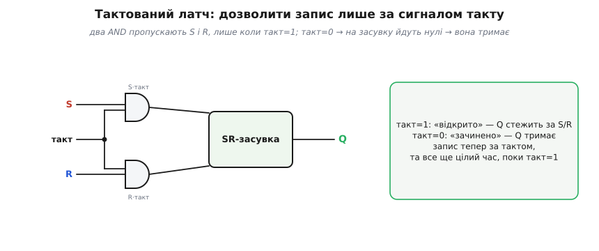
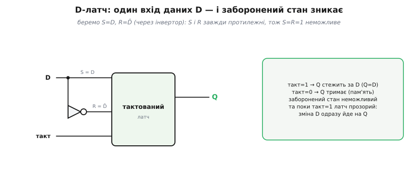
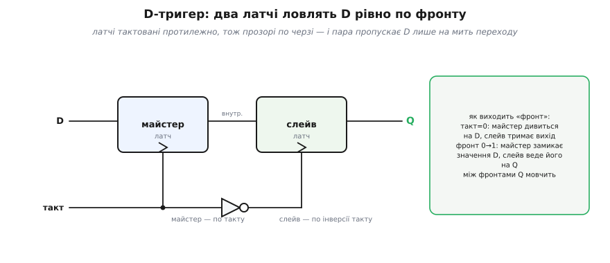
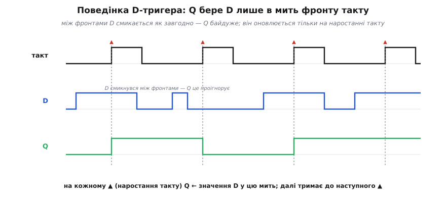
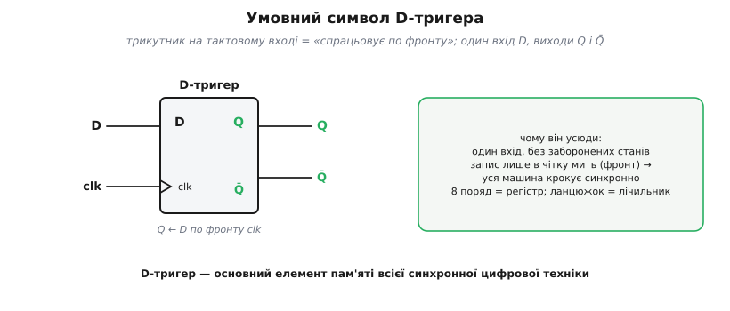

# D-тригер

[SR-засувка](topic:hw-digital/sr-latch) має дві вади, що заважають будувати з неї великі машини. По-перше, вона **прозора** — пише будь-коли, щойно змінилися входи; а нам треба, щоб сотні комірок оновлювалися **узгоджено**, в один домовлений момент. По-друге, у неї є **заборонений** стан S=R=1, через який легко напартачити. Обидві вади знімаються двома кроками — і в кінці постає головний елемент пам'яті всієї цифрової техніки: **D-тригер** (англ. *trigger* — «спускний гачок», від нідерл. *trekken* «тягнути, смикати»), що захоплює дані рівно по **фронту** такту.

### Тактований латч: писати лише за командою

Перша ідея проста: поставити перед входами засувки «ворота», які пропускають S і R лише тоді, коли дозволяє окремий сигнал — **такт** (англ. *clock*; саме слово «такт» — від лат. *tactus* «дотик», удар, що задає ритм). Такі ворота будуються двома вентилями AND.


*Входи S і R проходять крізь AND, другий вхід яких — **такт**. Коли такт=1, AND «прозорі» — S і R доходять до засувки, і вона працює як завжди. Коли такт=0, обидва AND видають 0 — на засувку йдуть нулі (режим «тримати»), і вона **ігнорує** входи. Запис відбувається не «будь-коли», а лише **за дозволом такту**. Та поки такт=1, латч усе ще прозорий — стежить за входами цілий цей час.*

Це вже крок уперед: ми керуємо тим, **коли** можна писати. Лишилася друга вада — заборонений стан, і саме її прибирає наступне спрощення схеми.

### D-латч: один вхід даних

Заборонений стан брався з того, що S і R **незалежні**, і можна випадково підняти обидва. Якщо ж зробити їх **завжди протилежними**, ситуація S=R=1 стане просто неможливою. Для цього беремо **один** вхід даних D і подаємо його на S напряму, а на R — через інвертор (тобто R=D̄).


*Вхід даних D іде на S, а його інверсія D̄ — на R. Тепер S і R **завжди** протилежні, тож заборонений стан виникнути не може. Поведінка проста: поки такт=1, вихід **стежить** за D (Q=D); коли такт=0, латч **тримає** останнє значення D. Один вхід, жодних заборон — куди зручніше за SR. Та одна риса лишилася: поки такт=1, латч **прозорий**, тобто будь-яка зміна D одразу проходить на вихід.*

D-латч (англ. *latch* «засувка, защіпка», від давньоангл. *læċċan* «хапати, ловити») — уже майже те, що треба: один вхід, без заборонених станів, керується тактом. Та сама **прозорість** і лишається проблемою: поки такт високий, вихід «бовтається» за входом. У складних схемах це небезпечно.

### Прозорість і захоплення по фронту

Уявімо, що вихід D-латча через якусь логіку повертається назад на його ж вхід (а так буде в лічильниках і регістрах зсуву). Поки такт високий, латч прозорий — і нове значення може **прогнатися** крізь нього й повернутися ще раз у тому самому такті, зробивши схему непередбачуваною. Нам треба, щоб латч ловив значення D **рівно один раз** — і то в чітко визначену **мить**, а не протягом цілого рівня такту.

Звідси й рішення: перейти від реакції на **рівень** такту до реакції на **фронт** (англ. *edge*) — на ту коротку мить, коли такт **перемикається** з 0 на 1. Елемент, що оновлює вихід лише в цю мить, називають **тригером** (англ. *flip-flop* — «перекидатися туди-сюди», бо схема перекидається між двома стійкими станами), на відміну від прозорого **латча**. Чому саме [фронт надійніший за рівень](topic:hw-digital/edge-vs-level) — окрема докладна розмова.

> 🔧 **Навіщо це.** Прозорість — не теоретична причепка, а перша річ, об яку розбивається жива схема. Зберіть зсувний регістр на прозорих латчах зі спільним тактом — і поки такт високий, біт «протече» крізь увесь ланцюжок за один такт замість зсуву на одну позицію. Саме тому пам'ять у процесорі будують на тригерах, а не на латчах: тригер ловить вхід **один раз** за такт, і ланцюжок зсуває рівно на крок.

### D-тригер: майстер і слейв

Найкласичніший спосіб зробити захоплення по фронту — поставити **два** D-латчі поспіль, тактовані **протилежно**: перший («майстер») і другий («слейв»).


*Майстер і слейв тактовані **в протифазі** (слейв — через інвертор такту), тож вони «прозорі» **по черзі**, і ніколи — водночас. Поки такт=0, майстер дивиться на D (а слейв тримає вихід); у мить **фронту** 0→1 майстер «замикається» на тому значенні D, що було якраз зараз, і передає його слейву, який виставляє його на вихід. Між фронтами вихід Q **не реагує** на D зовсім. Так пара латчів пропускає дані лише на коротку мить переходу — це й є **захоплення по фронту**.*

Суть трюку: оскільки два латчі прозорі в **різні** півперіоди, даним нема як «прослизнути» крізь обидва одразу — вони можуть «перестрибнути» з входу на вихід лише в **момент перемикання** такту. Виходить елемент, що оновлюється **раз за такт**, у строго визначену мить.

Цей принцип старший за цифрову схемотехніку: ще 1918 року британські фізики Вільям Еклз і Френк Джордан запатентували «тригерне реле» на двох вакуумних лампах — схему з двома стійкими станами, яка перекидається з одного в інший. Її й назвали згодом *flip-flop*; D-тригер — пряма її спадкоємиця, тільки на транзисторах і з одним входом даних.

### Поведінка: Q ловить D по фронту

Найкраще цю поведінку видно на часовій діаграмі — і її варто прочитати уважно, бо це головна діаграма всієї синхронної логіки.


*Угорі — **такт** (червоні ▲ позначають наростання — робочі фронти). Посередині — вхід **D**, що змінюється довільно. Унизу — вихід **Q**. На кожному фронті Q бере те значення, яке D має **саме в цю мить**, і тримає його до наступного фронту. Між фронтами D кілька разів смикається — і Q це **повністю ігнорує**. Тригер «фотографує» D у моменти фронтів, а решту часу не дивиться на нього взагалі.*

Простежмо за діаграмою Q на чотирьох фронтах:

```
фронт 1:  D = 1 у цю мить  →  Q ← 1   (тримає до фронту 2)
фронт 2:  D = 0 у цю мить  →  Q ← 0
фронт 3:  D = 1 у цю мить  →  Q ← 1
фронт 4:  D = 1 у цю мить  →  Q ← 1   (без зміни)
між фронтами D смикався — Q не зреагував
```

Та сама логіка, тільки в коді прошивки: тригер у програмному вигляді — це змінна, яку оновлюють **рівно в момент фронту**, а не щоразу, коли змінився вхід. Ось мінімальний D-тригер, що «спрацьовує» на наростанні тактового біта (типовий шматок, коли тактуєш зовнішню логіку ніжкою мікроконтролера):

**Умова: ловити стан лінії `D` у Q лише на фронті `CLK` 0→1.**

:::tabs
```cpp
#include <stdbool.h>

static bool clk_prev = false;   // такт на попередній ітерації
static bool q        = false;   // вихід тригера

// викликається часто (в циклі або по таймеру)
void dff_step(bool d, bool clk) {
    bool rising = clk && !clk_prev;   // фронт 0→1 саме зараз?
    if (rising) {
        q = d;                        // «фотографуємо» D у мить фронту
    }
    clk_prev = clk;                   // запам'ятати такт для наступного кроку
    // поза фронтом q не чіпаємо — між фронтами D ігнорується
}
```
```python
clk_prev = False   # такт на попередній ітерації
q        = False   # вихід тригера

# викликається часто (в циклі або по таймеру)
def dff_step(d, clk):
    global clk_prev, q
    rising = clk and not clk_prev     # фронт 0→1 саме зараз?
    if rising:
        q = d                         # «фотографуємо» D у мить фронту
    clk_prev = clk                    # запам'ятати такт для наступного кроку
    # поза фронтом q не чіпаємо — між фронтами D ігнорується
```
```js
let clkPrev = false;   // такт на попередній ітерації
let q       = false;   // вихід тригера

// викликається часто (в циклі або по таймеру)
function dffStep(d, clk) {
    const rising = clk && !clkPrev;   // фронт 0→1 саме зараз?
    if (rising) {
        q = d;                        // «фотографуємо» D у мить фронту
    }
    clkPrev = clk;                    // запам'ятати такт для наступного кроку
    // поза фронтом q не чіпаємо — між фронтами D ігнорується
}
```
```go
var clkPrev = false   // такт на попередній ітерації
var q       = false   // вихід тригера

// викликається часто (в циклі або по таймеру)
func dffStep(d, clk bool) {
    rising := clk && !clkPrev   // фронт 0→1 саме зараз?
    if rising {
        q = d                   // «фотографуємо» D у мить фронту
    }
    clkPrev = clk               // запам'ятати такт для наступного кроку
    // поза фронтом q не чіпаємо — між фронтами D ігнорується
}
```
:::

`rising` — true лише на тій ітерації, де `clk` уперше став 1 після 0; тільки тоді Q бере D. Решту часу `d` хоч як смикайся — Q тримає старе значення. Оце «оновлюю по фронту, а між фронтами не дивлюся» — і є та визначеність, якої бракувало прозорому латчу. Усі тригери, тактовані спільним сигналом, оновлюються **одночасно**, в один момент, — і машина крокує злагоджено.

### Символ і роль робочого коня

Малюють D-тригер компактним символом, у якому є одна важлива деталь.


*Прямокутник із входом **D**, виходами **Q** і **Q̄** та тактовим входом, позначеним **трикутником** «❯». Цей трикутник — ключовий знак: він означає «спрацьовує по **фронту**» (а не по рівню). Побачивши його на схемі, ви одразу знаєте: елемент захоплює D у мить фронту такту. Без трикутника це був би прозорий латч.*

D-тригер — справжній **робочий кінь** цифрової техніки, і ось чому. Він має один вхід, не має заборонених станів, а головне — пише **в чітко визначену мить**, тож уся машина може крокувати **синхронно**. Поставте 8 таких тригерів поряд, з'єднавши їхні такти, — і дістанете [регістр](topic:hw-digital/register) на байт. З'єднайте їх ланцюжком (вихід кожного → вхід наступного) — дістанете **зсувний регістр**; а додавши перемикання (toggle, D=Q̄) — [лічильник](topic:hw-digital/counters). Майже вся пам'ять усередині процесора, всі його регістри — це D-тригери, що клацають разом по спільному такту.

> 🔧 **Навіщо це.** D-тригер — це елемент, який ви насправді використовуватимете ([SR-засувку](topic:hw-digital/sr-latch) радше зустрінете в книжках, а D-тригер — у кожній схемі). Три речі винесіть. Перша: він бере **один** вхід D і запам'ятовує його по **фронту** такту — «що було на D в мить фронту, те й застрягло до наступного фронту». Друга: трикутник «❯» на тактовому вході в схемі = «по фронту»; це відрізняє тригер від латча, і плутати їх не можна. Третя: оскільки всі тригери ловлять дані **одночасно** (на спільному фронті), цифрова система працює **тактами** — крок, крок, крок, — і це фундамент усієї синхронної логіки, аж до [циклу процесора](topic:hw-arch/fetch-decode-execute). Запам'ятайте D-тригер як «комірку, що оновлюється раз за такт».

---

Щоб засувка годилася для великих машин, її **тактують**. Спершу — тактований латч: вентилі AND пропускають S/R лише коли такт=1. Далі — **D-латч**: один вхід D іде на S, а D̄ на R, тож заборонений стан зникає, і поки такт=1, Q=D. Та латч лишається **прозорим**; щоб ловити дані в одну **мить**, переходять від рівня до **фронту** — будують **D-тригер** (майстер-слейв із двох латчів у протифазі), що захоплює D рівно по фронту такту й тримає між фронтами. Його символ має **трикутник** «❯» на тактовому вході. D-тригер — основний елемент пам'яті: з нього роблять [регістри](topic:hw-digital/register) і [лічильники](topic:hw-digital/counters), і саме він змушує цифрову машину крокувати синхронно.
