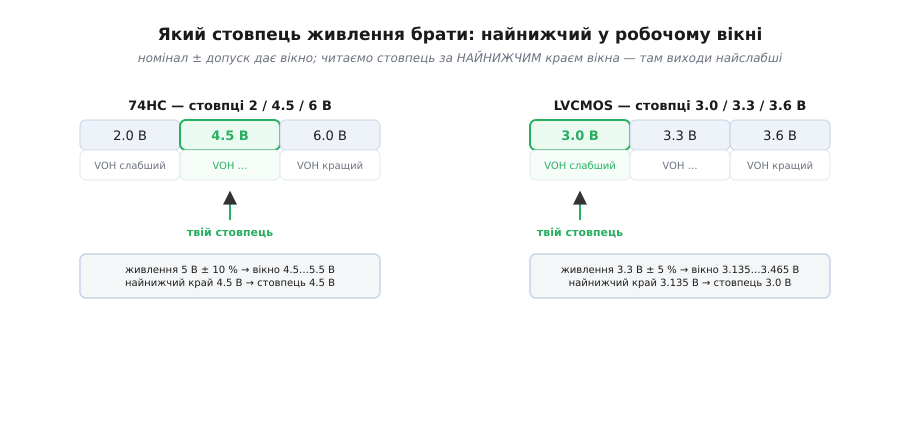
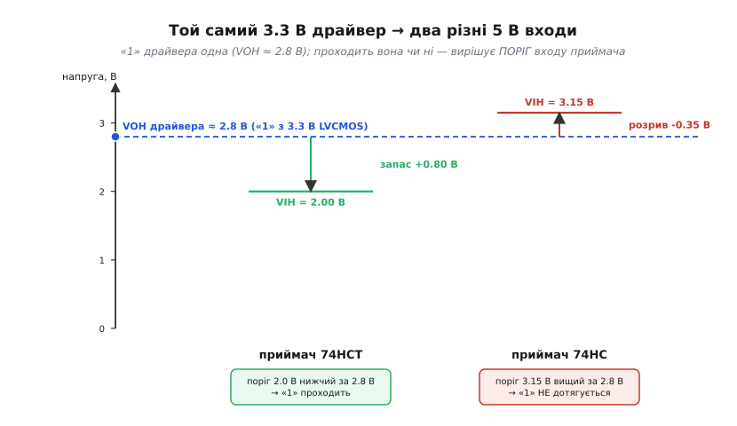

# ⚙️ Практикум: читаємо DC-таблицю справжнього чипа від початку до кінця

Одна річ — розуміти, що таке VOH чи «умова тесту», зовсім інша — сісти перед справжнім даташитом на п'ятнадцять сторінок, знайти потрібну таблицю серед десятка інших, вибрати з неї **ті самі** числа, що стосуються твоєї схеми, і на них порахувати, чи «порозуміються» два чипи. Між «знаю визначення» і «зробив правильно» лежить кілька конкретних кроків, на кожному з яких легко оступитися. Пройдімо їх один за одним — на реальних числах, до готового коду прошивки, що звіряє виміряні рівні з гарантованими межами й ловить несумісність автоматично.

Задача, яку розв'язуємо, зумисне неприємна: **зістикувати два РІЗНІ сімейства**. Драйвер живиться від 3.3 В (сучасна логіка LVCMOS), приймач — старий чип на 5 В. Це той випадок, коли «просто з'єднати піни» найчастіше й вибухає: рівні одного світу можуть не дотягтися до порогів іншого. І перевірити це можна **лише** прочитавши обидва даташити правильно — а не покладаючись на те, що «п'ять вольтів же більше за три, значить усе гаразд».

## Крок 0: три числа, які треба зафіксувати перед стартом

Перш ніж відкрити хоч один даташит, випишімо на папірці **робочі умови нашої плати** — бо саме за ними ми обиратимемо рядки й стовпці:

```
живлення драйвера:   3.3 В (номінал), допуск ±5 % → від 3.135 до 3.465 В
живлення приймача:   5.0 В (номінал), допуск ±10 % → від 4.5 до 5.5 В
робочий струм лінії: скільки реально потече крізь стик (порахуємо на кроці 4)
```

Ці три числа — компас усього практикуму. Без них таблиця даташита — просто ліс цифр: не знаючи свого живлення, не вибереш стовпець; не знаючи струму, не вибереш рядок. Тому крок нуль — не «прочитати даташит», а **сформулювати, ЩО ми в ньому шукаємо**.

> 🔧 **Навіщо це.** Дев'ять із десяти помилок стику народжуються ще тут — коли інженер лізе в таблицю, не вирішивши наперед, за яким живленням і струмом він її читає. Тоді око чіпляється за перше-ліпше «гарне» число (звісно, за найкращих умов), і розрахунок виходить фіктивний. Випиши умови першими — і половина пасток відпаде сама.

## Крок 1: знайти потрібну таблицю серед усіх

Даташит на логічний чип має не одну таблицю, а цілу низку, і плутати їх — перша типова пастка. Побіжний перелік того, що зустрінеш, і що з цього **не** наша ціль:

- **Absolute Maximum Ratings** (гранично допустимі) — це «за цією межею чип помирає», а не «за цією працює». Числа звідси в розрахунок рівнів **не беруть** ніколи: подаси на вхід напругу з цієї таблиці — і матимеш не логіку, а димок.
- **Recommended Operating Conditions** (рекомендовані умови) — діапазон живлення, температури, вхідних напруг, у якому виробник узагалі щось гарантує. Звідси беремо межі живлення й температури.
- **DC Electrical Characteristics** — **ось вона, наша**. Тут живуть VIH, VIL, VOH, VOL, струми витоку й спокою.
- **AC Characteristics / Switching Characteristics** — швидкості й затримки; для стику рівнів не потрібні (це інша перевірка).

Ознака правильної таблиці проста: у ній є стовпці **Min / Typ / Max** і рядки з символами на кшталт `VIH`, `VOL`. Якщо бачиш час у наносекундах — ти в AC-таблиці, гортай далі.

## Крок 2: серед кількох стовпців живлення вибрати свій

Ось де починається справжня майстерність читання. DC-таблицю виробник дає **не для одного живлення, а для кількох одразу** — бо той самий чип працює в діапазоні напруг, а пороги й рівні від живлення залежать. І тут — розвилка, повз яку легко проскочити.

Для **74HC** (чиста КМОН) таблиця зазвичай має три стовпці: **2.0 В · 4.5 В · 6.0 В**. Чому саме такі, а не «рівні» 3/5? Бо це **краї й середина** дозволеного діапазону 2…6 В: виробник показує найгірші кути. Якщо ти живиш чип від 5 В (з допуском ±10 % — від 4.5 до 5.5 В), твій стовпець — **4.5 В**, найнижчий у робочому вікні: саме там виходи найслабші (VOH найнижче, VOL найвище). Стовпець «6.0 В» — не твій, хоч 5 В і ближче до нього: проєктувати треба за найгіршим, а не за найкращим кутом.

Для **3.3-вольтової LVCMOS**-логіки картина інша: стовпці бувають **3.0 · 3.3 · 3.6 В** (або діапазоном «3.0…3.6 В» одним стовпцем). Тут теж береш **найнижчий** — 3.0 В: якщо номінал 3.3 В із допуском ±5 %, живлення сідає до 3.135 В, і гарантії для 3.0 В покривають цей найгірший випадок із запасом.


*Дві таблиці з кількома стовпцями живлення. Ліворуч 74HC (2/4.5/6 В): номінал 5 В із допуском ±10 % дає вікно 4.5…5.5 В, і читати треба стовпець 4.5 В — найнижчий у вікні, де виходи найслабші. Праворуч LVCMOS (3.0/3.3/3.6 В): номінал 3.3 В ±5 % дає вікно 3.135…3.465 В, читаємо стовпець 3.0 В. Правило одне: бери НАЙНИЖЧИЙ стовпець, що накриває твоє живлення знизу — це і є найгірший кут.*

Правило, яке варто закарбувати: **серед стовпців живлення бери найнижчий, що не вищий за твій мінімальний VCC у допуску**. Не номінал, не найближчий — найнижчий у робочому вікні. Це і є дисципліна найгіршого кута в дії.

> 🔧 **Навіщо це.** Взяти «гарний» стовпець — класична пастка молодшого інженера. Чип живиться від 5 В, у таблиці є стовпець 6 В із красивими числами (VOH аж під 6 В!) — і рука тягнеться взяти його. Але твоє живлення реально гуляє від 4.5 В, і саме там вихід найслабший. Візьмеш стовпець 6 В — на платі, де просіло до 4.5 В, «1» виявиться нижчою за пораховану, і стик, що «сходився на папері», відмовить. Стовпець — за найнижчим живленням, крапка.

## Крок 3: для свого струму вибрати правильний рядок VOH / VOL

Стовпець живлення обрано — тепер усередині нього для VOH і VOL зазвичай є **кілька рядків**, і різняться вони **умовою струму** (IOH / IOL). Це те саме «число без умови — не число», тільки тепер треба свідомо вибрати, який рядок твій.

Реальна DC-таблиця **74LVC** (сучасна швидка логіка) на VCC = 3.0 В дає VOH трьома рядками — за трьох різних струмів навантаження. Числа справжні, звірені за даташитами Nexperia / TI / Diodes на цей чип:

```
VOH ≥ VCC − 0.2 В  за  IOH = −100 мкА   (≈ 2.8 В — майже холостий хід)
VOH ≥ 2.4 В        за  IOH = −12 мА     (помірне навантаження)
VOH ≥ 2.3 В        за  IOH = −24 мА     (повне навантаження)
```

Три рядки — той самий вихід, той самий стан «1», але за холостого ходу він дотягується майже до 3.0 В, а під повними 24 мА гарантується лише 2.3 В. **Який брати?** Той, чий струм **не менший** за твій робочий. Тягнеш із виходу 8 мА — тобі мало підходить рядок «−12 мА» (він гарантує 2.4 В, і твої 8 мА його не перевищують). Тягнеш 20 мА — мусиш брати рядок «−24 мА» (2.3 В), бо рядок «−12 мА» ти вже перевищив, і його гарантія на тебе не поширюється.

Дзеркально для VOL на тому ж VCC = 3.0 В:

```
VOL ≤ 0.2 В   за  IOL = 100 мкА
VOL ≤ 0.4 В   за  IOL = 12 мА
VOL ≤ 0.55 В  за  IOL = 24 мА
```

Логіка та сама, тільки навпаки: що більший струм **втікає** у вихід у стані «0», то вище «0» піднімається над землею. За 24 мА «0» гарантовано не вище 0.55 В — уже помітно над нулем.

Практичний спосіб не помилитися: спершу порахуй свій робочий струм (крок 4), тоді в таблиці знайди **найближчий рядок із струмом ≥ твого** й візьми його число. Ніколи не бери рядок із меншим струмом, ніж у тебе, — його гарантія на твоєму режимі не діє.

> 🔧 **Навіщо це.** Тут ховається підступна пастка: взяти найкращий (майже холостий) рядок VOH, бо він дає найгарніше число. Береш «−100 мкА → 2.8 В», радієш запасу — а реально тягнеш 20 мА, де гарантовано лише 2.3 В. Пів*вольта* різниці, і саме її може забракнути на стику. Рядок — за СВОЇМ струмом, не за найкрасивішим числом.

## Крок 4: порахувати робочий струм стику

Щоб вибрати рядок, треба знати струм — тож порахуймо, скільки реально потече крізь наш стик. Коли на виході «висить» лише вхід (або кілька входів) сусіднього КМОН-чипа, струм цей крихітний: вхід КМОН — це ізольований затвор, тягне одиниці мікроампер. Але на лінії зазвичай не лише вхід:

```
складові струму на виході драйвера:
  входи приймачів:  N × Iвх   (для КМОН ≈ N × 1 мкА — копійки)
  резистор підтяжки: (VCC − Vвих) / Rпідтяжки   (якщо є)
  подільник / навантаження: за законом Ома
  ─────────────────────────────────────────
  разом: сума всіх, хто «висить» на піні
```

**Приклад (рахуємо струм стику).** Драйвер 3.3 В керує одним КМОН-входом приймача, і на лінії стоїть підтяжка до 3.3 В опором 10 кОм (типова для чистоти фронтів). У стані «0» вихід мусить «протягти» крізь підтяжку весь струм на землю:

```
Iчерез_підтяжку = VCC / Rпідтяжки = 3.3 / 10000 = 0.33 мА = 330 мкА
Iвхід_приймача  ≈ 1 мкА  (КМОН, мізер)
──────────────────────────────────────────────
Iробочий (стан «0») ≈ 0.33 мА
```

Отже, крізь вихід у стані «0» тече лише третина міліампера. У таблиці VOL це підпадає під **перший** рядок (IOL = 100 мкА... хоча 330 мкА трохи більше — тоді для безпеки беремо наступний, «12 мА → 0.4 В»). А в стані «1» через підтяжку струм не тече взагалі (обидва кінці на 3.3 В), лишається тільки мікроамперний вхід — тобто VOH читаємо з майже холостого рядка. Бачиш, як робочий струм **сам показує**, який рядок таблиці твій.

## Крок 5: перевірка стику навхрест — обидва напрямки

Тепер головне — власне звірка. Її роблять **навхрест**: беруть VOH/VOL із даташита того, хто **видає** (драйвер), і VIH/VIL із даташита того, хто **читає** (приймач). Дві умови, обидві мусять справдитися:

```
щоб «1» пройшла:  VOH(драйвера, за робочого струму)  ≥  VIH(приймача)
щоб «0» пройшов:  VOL(драйвера, за робочого струму)  ≤  VIL(приймача)
```

І ось де наша задача стає цікавою: **напрямок 3.3 В → 5 В залежить від того, ЯКИЙ саме 5-вольтовий чип** стоїть приймачем. Розберімо обидва варіанти, бо різниця між ними — це різниця між «працює» і «не працює».

### Варіант А: приймач — 74HCT (входи ТТЛ-сумісні)

Сімейство **74HCT** зроблено спеціально, щоб КМОН-чип на 5 В **розумів слабкі рівні** старої ТТЛ-логіки. Тому його вхідні пороги — не 0.7/0.3 від живлення, а фіксовані, низькі (звірено за даташитами NXP/Nexperia/Diodes на 74HCT00):

```
VIH(74HCT) = 2.0 В (Min)     ← вхід читає «1» уже від 2.0 В
VIL(74HCT) = 0.8 В (Max)     ← вхід читає «0» до 0.8 В
```

А наш драйвер 3.3 В LVCMOS у стані «1» (за майже холостого ходу) дає VOH ≈ 2.8 В і вище. Звіряємо:

```
«1»:  VOH(драйв.) = 2.8 В   ≥   VIH(HCT) = 2.0 В    →    ТАК, запас 0.8 В
«0»:  VOL(драйв.) = 0.4 В   ≤   VIL(HCT) = 0.8 В    →    ТАК, запас 0.4 В
```

Обидва напрямки проходять, і навіть із подушкою. **Стик 3.3 В LVCMOS → 5 В HCT працює напряму** — саме тому HCT так люблять як «міст» від нового 3.3-вольтового світу до старого 5-вольтового.

### Варіант Б: приймач — 74HC (входи чистого КМОН)

А тепер підмінімо приймач на звичайний **74HC** — і той самий драйвер раптом **перестане з ним говорити**. Бо входи чистого КМОН на 5 В (точніше, на 4.5 В у найгіршому кутку) вимагають:

```
VIH(74HC на 4.5 В) = 3.15 В (Min)    ← це 0.7 × 4.5, вхід читає «1» лише від 3.15 В!
VIL(74HC на 4.5 В) = 1.35 В (Max)
```

Звіряємо ту саму «1» драйвера:

```
«1»:  VOH(драйв.) = 2.8 В   ≥   VIH(HC) = 3.15 В    →    НІ!  бракує 0.35 В
```

**Провал.** «1» драйвера (2.8 В) не дотягується до порога 3.15 В, який вимагає КМОН-вхід приймача. На платі це виглядатиме як лінія, що «іноді працює»: за холодної кімнати й вдалого екземпляра ще проскочить, а за нагріву чи слабшого чипа — читатиметься як заборонена зона. Той самий драйвер, той самий провід — а стик або живий, або мертвий залежно від **одного слова** в назві приймача (HC чи HCT). Помітити це можна лише звіривши числа; «на око» HC і HCT не відрізниш.

Що робити, коли трапився варіант Б? Три виходи: поставити між чипами [зсувач рівнів](topic:hw-digital/level-shifter); замінити приймач на HCT-версію (варіант А); або підтягти лінію до 5 В — але це вже вимагає, щоб вихід драйвера **терпів** 5 В, інакше згорить.


*Вертикальна шкала напруг зі спільним рівнем «1» драйвера VOH ≈ 2.8 В (3.3 В LVCMOS). Ліворуч приймач HCT: поріг VIH = 2.0 В нижчий за 2.8 В — «1» проходить із запасом 0.8 В (зелена стрілка). Праворуч приймач HC: поріг VIH = 3.15 В ВИЩИЙ за 2.8 В — «1» не дотягується, розрив 0.35 В (червона стрілка). Той самий драйвер, різниця лише в порозі входу приймача.*

### Зворотний напрямок: 5 В → 3.3 В

Стик двосторонній, тож перевірмо й другий бік — 5-вольтовий чип видає, 3.3-вольтовий читає. Тут проблема інша: не «чи дотягнеться «1»» (5-вольтова «1» з надлишком перекриває будь-який 3.3-вольтовий поріг), а **чи витримає 3.3-вольтовий вхід аж 5 В на собі**. Багато 3.3-вольтових входів **не терплять** напруги вище за своє живлення — 5 В їх пробиває.

Рятує риса **5V-tolerant** (терпить 5 В): такі входи спеціально зроблені приймати до 5 В, хоч самі живляться від 3.3 В. Наш LVCMOS-чип 74LVC саме такий — його входи 5V-tolerant, тож 5-вольтова «1» від HC/HCT на його вхід заходить безпечно. Перевірка рівнів тут тривіальна (5-вольтові рівні з запасом перекривають 3.3-вольтові пороги), але перевірка **толерантності** — обов'язкова: не 5V-tolerant вхід під 5 В просто вигорить, і жодні рівні вже не матимуть значення.

```
«1»:  VOH(HC на 4.5 В) = 3.84 В   ≥   VIH(LVC) = 2.0 В    →    ТАК, з великим запасом
«0»:  VOL(HC на 4.5 В) = 0.33 В   ≤   VIL(LVC) = 0.8 В     →    ТАК
толерантність: вхід LVC витримує 5 В?  →  ТАК (5V-tolerant) — інакше стоп!
```

## Крок 6: готовий код прошивки — звірка виміряного з гарантованим

Тепер зберімо всю цю логіку в **робочий код**, який мікроконтролер виконує сам — наприклад, у самотесті плати, де він через АЦП міряє реальні рівні на піні й порівнює їх із межами з даташита. Головні інженерні рішення тут два: **усе в цілих мілівольтах** (жодних `float` у прошивці — дробові числа на дрібному мікроконтролері повільні й дають похибку округлення) і **запас рахуємо навхрест** обома напрямками, точно як на кроці 5.

```c
#include <stdint.h>
#include <stdbool.h>

// ── Межі з DC-таблиць, у ЦІЛИХ мілівольтах (звірено з даташитами) ──
// Драйвер: 3.3 В LVCMOS, найгірший кут VCC = 3.0 В.
#define DRV_VOH_MIN_MV   2800   // «1» майже без струму (VCC − 0.2 В)
#define DRV_VOL_MAX_MV    400   // «0» під помірним струмом (рядок IOL = 12 мА)

// Приймач А: 74HCT — входи ТТЛ-сумісні.
#define HCT_VIH_MIN_MV   2000   // читає «1» від 2.0 В
#define HCT_VIL_MAX_MV    800   // читає «0» до 0.8 В

// Приймач Б: 74HC на 4.5 В — входи чистого КМОН (0.7/0.3 · VCC).
#define HC_VIH_MIN_MV    3150   // читає «1» лише від 3.15 В
#define HC_VIL_MAX_MV    1350   // читає «0» до 1.35 В

// Скільки шуму лінія має проковтнути, перш ніж помилитись (бюджет запасу).
#define NOISE_BUDGET_MV   200

typedef enum { LVL_LOW, LVL_HIGH, LVL_FORBIDDEN } logic_level_t;

// Класифікувати ВИМІРЯНУ напругу за порогами КОНКРЕТНОГО приймача.
logic_level_t classify_level(uint16_t v_mv,
                             uint16_t vil_max_mv, uint16_t vih_min_mv)
{
    if (v_mv >= vih_min_mv) return LVL_HIGH;      // впевнена «1»
    if (v_mv <= vil_max_mv) return LVL_LOW;       // впевнений «0»
    return LVL_FORBIDDEN;                         // заборонена зона — тривога
}

// Результат звірки одного стику: проходить + запас у кожен бік.
typedef struct {
    bool     high_ok;         // «1» драйвера дотягується до VIH приймача?
    bool     low_ok;          // «0» драйвера нижче за VIL приймача?
    int16_t  high_margin_mv;  // VOH(драйв.) − VIH(прийм.); від'ємне = провал
    int16_t  low_margin_mv;   // VIL(прийм.) − VOL(драйв.); від'ємне = провал
} link_check_t;

// Перевірка стику НАВХРЕСТ: рівні драйвера проти порогів приймача.
// Усе в мВ, знаковий int16 — щоб від'ємний запас (провал) було видно.
link_check_t check_link(uint16_t drv_voh_mv, uint16_t drv_vol_mv,
                        uint16_t rx_vih_mv,  uint16_t rx_vil_mv,
                        uint16_t budget_mv)
{
    link_check_t r;
    // «1»: наскільки VOH драйвера перевищує поріг VIH приймача.
    r.high_margin_mv = (int16_t)drv_voh_mv - (int16_t)rx_vih_mv;
    r.high_ok = (r.high_margin_mv >= (int16_t)budget_mv);
    // «0»: наскільки VOL драйвера нижче за поріг VIL приймача.
    r.low_margin_mv  = (int16_t)rx_vil_mv - (int16_t)drv_vol_mv;
    r.low_ok  = (r.low_margin_mv >= (int16_t)budget_mv);
    return r;
}

// ── Приклад застосування: звіряємо обидва варіанти приймача ──
void self_test_link(void)
{
    // Варіант А: 3.3 В LVCMOS → 74HCT.
    link_check_t a = check_link(DRV_VOH_MIN_MV, DRV_VOL_MAX_MV,
                                HCT_VIH_MIN_MV, HCT_VIL_MAX_MV,
                                NOISE_BUDGET_MV);
    // a.high_ok == true,  a.high_margin_mv == 2800 − 2000 = +800 мВ
    // a.low_ok  == true,  a.low_margin_mv  ==  800 − 400  = +400 мВ

    // Варіант Б: той самий драйвер → 74HC.
    link_check_t b = check_link(DRV_VOH_MIN_MV, DRV_VOL_MAX_MV,
                                HC_VIH_MIN_MV, HC_VIL_MAX_MV,
                                NOISE_BUDGET_MV);
    // b.high_ok == false, b.high_margin_mv == 2800 − 3150 = −350 мВ  ← ПРОВАЛ!
    // b.low_ok  == true,  b.low_margin_mv  == 1350 − 400  = +950 мВ

    if (!b.high_ok) {
        // «1» не проходить: тривога ще на етапі самотесту, до збою в полі.
        raise_fault(FAULT_LEVEL_MISMATCH, b.high_margin_mv);
    }
}
```

Що тут важливо побачити. Функція `check_link` — це буквально дві умови стику з кроку 5, перекладені в код: `high_margin` — то `VOH − VIH`, `low_margin` — то `VIL − VOL`. Знаковий `int16_t` обрано **навмисно**: якщо запас від'ємний (стик не проходить), число вийде мінусовим, і це видно одразу, а не загубиться в беззнаковому переповненні. Порахувавши обидва варіанти, код ловить рівно те, що ми знайшли руками: варіант А проходить з подушкою, варіант Б **провалюється на «1»** (−350 мВ), і `raise_fault` б'є на сполох ще на столі — а не в полі за півроку, коли плата почне «іноді глючити».

А тепер — місток до вимірів. Якщо мікроконтролер має АЦП і реально міряє напругу на піні, `classify_level` каже, як цю напругу **прочитає приймач**. Той самий виміряний рівень 2.9 В класифікується по-різному залежно від того, хто приймає:

```c
uint16_t measured_mv = adc_read_pin_mv(TEST_PIN);   // напр., 2900 мВ

// Як цей рівень прочитає HCT-вхід?
logic_level_t as_hct = classify_level(measured_mv, HCT_VIL_MAX_MV, HCT_VIH_MIN_MV);
// 2900 ≥ 2000 → LVL_HIGH: HCT впевнено бачить «1».

// А як його прочитає HC-вхід?
logic_level_t as_hc  = classify_level(measured_mv, HC_VIL_MAX_MV, HC_VIH_MIN_MV);
// 2900 < 3150 і 2900 > 1350 → LVL_FORBIDDEN: HC у забороненій зоні!
```

Одне й те саме напруження на дроті — і «впевнена одиниця» для HCT, і «заборонена зона» для HC. Це вся суть DC-характеристик в одному рядку коду: рівень визначається **не сам по собі, а порогами того, хто читає**.

## Складність і типові пастки

Розрахунок стику нескладний — це два віднімання. Уся складність у **дисципліні**: узяти правильне число з правильного рядка правильного стовпця правильної таблиці. Ось повний перелік пасток, кожна з яких псувала реальні плати, і кожна коштує годин пошуку загадкового збою:

- **Узяли Typ замість Min/Max.** Найпоширеніша. `VOH typ = 2.9 В` виглядає краще за `VOH min = 2.3 В`, і рука тягнеться до першого. Але Typ — не гарантія, а «на око за кімнатної температури»; половина партії йому не відповідає. **Тільки Min для «підлоги», тільки Max для «стелі», ніколи Typ.**

- **Проґавили умову струму.** Взяли VOH із майже холостого рядка (−100 мкА → 2.8 В), а реально тягнуть 20 мА, де гарантовано лише 2.3 В. Піввольта різниці — і саме її бракує на стику. **Рядок VOH/VOL — за СВОЇМ робочим струмом; струм ≥ рядкового означає, що рядок уже не діє.**

- **Не той стовпець живлення.** Живлення 5 В, у таблиці спокусливий стовпець 6 В — беруть його. Але реальне живлення сідає до 4.5 В, де виходи найслабші. **Бери найнижчий стовпець, що накриває твій мінімальний VCC.**

- **Не той температурний стовпець.** Гарний даташит дає окремі числа для −40…+85 °C і −40…+125 °C; витоки з нагрівом ростуть на порядок, пороги повзуть. Плата працює на столі за +25 °C і відмовляє в закритому корпусі за +70 °C. **Звіряй температурний діапазон числа зі своїм.**

- **Переплутали мкА/мА.** Струм витоку входу — мікроампери (мкА), струм навантаження виходу — міліампери (мА). Тисячу разів різниці. Порахуєш скільки входів потягне вихід, сплутавши одиниці, — і або страшенно недооціниш розгалуження, або переоціниш струм на три порядки. **Дивись на одиницю в стовпці кожного числа окремо.**

- **Забули знак струму.** IOH пишуть із мінусом (−4 мА): струм **витікає** з виходу в стані «1». IOL — плюсом: **втікає** у стан «0». Знак — не формальність, він каже напрямок; переплутаєш — переплутаєш і який рядок VOH, а який VOL.

- **Порівняли рівні одного чипа з порогами того ж чипа.** Звірка **навхрест**: VOH/VOL — драйвера, VIH/VIL — приймача. Порівняв VOH драйвера з його ж VIH — порахував дурницю. **Видає один, читає інший — і числа беруться з РІЗНИХ даташитів.**

- **Забули про толерантність на зворотному напрямку.** 5 В → 3.3 В: рівні перекриваються з запасом, усе ніби добре — а вхід не 5V-tolerant, і 5 В його пробиває. **Спершу перевір, чи вхід терпить чужу напругу; лише потім рахуй рівні.**

- **float у прошивці.** Дробові розрахунки на дрібному мікроконтролері повільні й дають похибку округлення на границі. **Усе в цілих мілівольтах** — і швидко, і точно.

Спільний корінь усіх дев'яти — спроба взяти з таблиці **одне число** замість **числа з умовою**. Число в DC-таблиці ніколи не самотнє: за ним завжди стоїть стовпець живлення, рядок струму, температурний діапазон і знак. Береш число — бери разом із контекстом; інакше воно бреше. Хто засвоїв цю звичку, той ловить несумісність рівнів навхрест за хвилину на папері — поки вона ще безкоштовна, а не годинами на платі з мультиметром.
