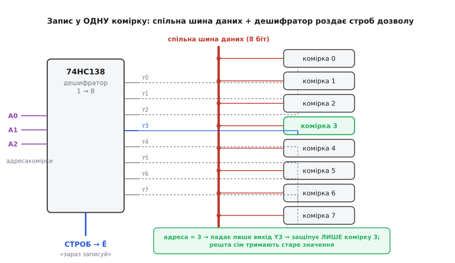

# ⚙️ Демультиплексор як роздавач строба запису

Уяви ряд однакових комірок — вісім регістрів-засувок, вісім клітинок пам'яті, вісім портів-розширювачів. Усі вони висять на **спільній** восьмибітній шині даних: ті самі вісім дротів заходять у кожну комірку паралельно. І тобі треба зробити просту, здавалося б, річ: покласти нове значення рівно в **одну** з них, обрану номером, а сім інших лишити такими, якими вони були — жодного біта не зачепити. Дані на дротах бачать усі; питання лише в тому, **хто з них їх візьме**.

Тут і криється задача, у якій демультиплексор працює не як абстракція з підручника, а як конкретна деталь на платі. І робота ця тонша, ніж «подав адресу — записав»: між моментом, коли ти виставляєш адресу, і моментом, коли клацає защіпка, ховається кілька пасток, які не ловить компілятор і які тихо псують сусідні комірки. Розберімо задачу від суті, напишемо робочий C для прошивки й пройдемося по кожній пастці з її механізмом.

## Задача: записати в одну комірку, не зачепивши решту

Почнімо з того, чому це взагалі проблема. Якби кожна комірка мала свою окрему шину даних і свій окремий сигнал «записуй», усе було б тривіально: пиши куди хочеш, ніхто нікому не заважає. Але окрема шина на кожну комірку — це десятки, а то й сотні зайвих дротів; ніхто так не робить. Натомість шину даних **розділяють** — вісім дротів на всіх, — і цим одразу народжується конфлікт: якщо всі комірки слухають ту саму шину, то команда «защіпни» піде в усіх одразу, і нове значення вскочить у **всі вісім** нараз. Роздача-віяло замість адресної доставки.

Отже, сама шина даних адреси не розрізняє. Розрізняти має **щось інше** — окремий сигнал, який дозволяє защіпнути дані рівно одній комірці. Практично кожна засувка, регістр чи мікросхема пам'яті має такий вхід: у регістра-защіпки це вхід дозволу `LE` (*latch enable*) чи тактовий фронт, у комірки пам'яті — вхід «дозвіл запису» `WĒ` (*write enable*, активний нулем), у мікросхеми на шині — «вибір кристала» `CS̄` (*chip select*). Поки цей вхід у пасивному стані, комірка ігнорує шину: хай там що на дротах, вона тримає старе значення. Активуєш вхід — комірка «розплющує очі» й підхоплює те, що зараз на шині.

Ось де вся задача переформульовується в одне речення. Шина даних — спільна на всіх; а **сигнал дозволу** треба провести рівно на **одну** обрану комірку. Тобто: узяти єдиний імпульс «зараз записуй» і спрямувати його на єдиного адресата за номером. Це буквально означення демультиплексора — «один вхід, багато виходів, адреса вирішує, на який». Роль даних `D` тут грає не значення, що пишемо (воно вже на шині), а **строб** — короткий імпульс «защіпнути». Демультиплексор роздає цей строб; на чий вихід він потрапив, та комірка й підхопить шину.

> 🔧 **Навіщо це.** Розділення «дані — спільні, дозвіл — адресний» це кістяк будь-якого блока пам'яті чи регістрового файла в цифрі. Регістровий файл із шістнадцяти регістрів усередині процесора влаштований саме так: одна шина запису на всі, а який регістр її підхопить, вирішує дешифратор номера регістра. Зрозумівши цей вузол на восьми зовнішніх засувках, ти впізнаєш його потім і в мікросхемі пам'яті, і в кристалі мікроконтролера — це та сама ідея в різному масштабі.

## Ідея: спільна шина + дешифратор із дозволом роздає строб

Складімо схему в голові. Дані — вісім ліній GPIO мікроконтролера — заходять паралельно на входи `D` усіх восьми засувок. Тепер потрібен вузол, що з номера 0…7 підніме рівно один сигнал дозволу. Ми вже знаємо, чим це робиться: [дешифратором-демультиплексором](root:hw-arch/address-decoding) — тим самим, що з трибітної адреси активує один вихід із восьми. Найпоширеніший у цій ролі — [74HC138](root:cat-hw-parts/74hc138), «1-of-8 decoder/demultiplexer»: три адресні входи `A0 A1 A2`, вісім виходів `Y0̄…Y7̄`, і кілька входів дозволу самого чипа.

Тонкість, яку треба взяти в руки з самого початку, — **полярність**. Виходи 74HC138 **активні-низькі**: обраний вихід падає в 0, а всі невибрані стоять у 1. І це не незручність, а якраз те, що треба, бо входи дозволу пам'яті теж активні-низькі: `WĒ`, `CS̄` спрацьовують нулем. Тобто вихід дешифратора, що опустив у 0 рівно одну лінію, прямо стає сигналом «защіпни саме цю комірку» — вони збігаються полярністю без жодного інвертора. Заводимо вісім виходів `Y0̄…Y7̄` на входи защіпки восьми комірок, адресу 0…7 на `A0 A1 A2` — і схема готова.

Лишається роздати **строб**. Ось найкрасивіший хід: сам імпульс «зараз записуй» ми подаємо не на адресу, а на **вхід дозволу дешифратора**. У 74HC138 таких входів три — два активні-низькі (`Ē1`, `Ē2`) і один активний-високий (`E3`). Коли дешифратор увімкнено (обидва низькі входи в 0, високий у 1), він працює нормально: активує обраний адресою вихід. А коли **не** ввімкнено — усі вісім виходів стоять у 1, тобто **жодна** комірка не отримує дозволу, хай яка адреса. Тому один із входів дозволу і є наш строб: тримаємо дешифратор вимкненим, а в потрібну мить на короткий час умикаємо — і рівно на цей час обрана комірка дістає імпульс защіпки.

*(Статус фактів про 74HC138: усталено, за даташитами Nexperia, TI, Diodes — три входи дозволу `Ē1`/`Ē2` активні-низькі та `E3` активний-високий; виходи активні-низькі; типова затримка вхід→вихід близько 21 нс для HC при 5 В.)*

Це і є вся ідея: **дані — на спільну шину заздалегідь; далі коротким імпульсом на вхід дозволу дешифратора пускаємо строб, який дешифратор роздає рівно обраній адресою комірці.** Демультиплексор тут — точний роздавач одного імпульсу; уся адресація зводиться до нього.


*Вісім ліній даних спільною шиною заходять на входи D усіх восьми засувок одразу — значення бачать усі. Адреса A0 A1 A2 задає номер комірки. Строб «зараз записуй» подають на вхід дозволу дешифратора; поки дешифратора вимкнено, усі його виходи в 1 і жодна засувка не защіпує. У мить строба дешифратор опускає в 0 рівно один вихід — і лише та засувка підхоплює шину, решта тримають старе.*

> 🔧 **Навіщо це.** Подавати строб на **дозвіл дешифратора**, а не смикати адресу, це головний практичний прийом усього вузла. Він дає безкоштовно дві речі: по-перше, поки строба немає, жодна комірка не пише, тож адресу можна спокійно міняти «на холодну»; по-друге, той самий вхід дозволу стає **загальним запобіжником** — тримаєш його вимкненим, і хоч би що коїлося на адресних лініях під час старту чи скидання, у пам'ять нічого випадково не потрапить. Це рятує від найгидкіших багів «щось саме перезаписалося».

## Робочий C: генерація адреси й строба на GPIO

Перекладімо схему в код прошивки. Задача розкладається на три речі: виставити адресу на трьох піни `A0 A1 A2`, тримати вхід дозволу дешифратора у пасивному стані, поки готуємося, і в потрібну мить видати на нього короткий активний імпульс. Почнімо з опису пінів і елементарних дій над ними. Код нижче — для абстрактного мікроконтролера з реєстрами `BSRR` (атомарна установка/скид біта порту), як у STM32; на іншій платформі зміняться лише імена реєстрів, логіка та сама.

```c
#include <stdint.h>

// --- Розкладка пінів (приклад; підстав свої порт і номери) ---
// Три адресні лінії 74HC138: A0, A1, A2
#define ADDR_PORT   GPIOB
#define A0_PIN      0
#define A1_PIN      1
#define A2_PIN      2

// Вхід дозволу дешифратора, куди подаємо СТРОБ.
// Беремо активний-низький вхід (E1 або E2 у 74HC138):
// дешифратор увімкнено, коли тут 0; вимкнено, коли 1.
#define STROBE_PORT GPIOB
#define STROBE_PIN  3          // -> на Ē1 дешифратора (активний нулем)

// BSRR: запис 1 у молодшу половину ВСТАНОВЛЮЄ біт,
//       запис 1 у старшу половину (│<<16) СКИДАЄ біт. Обидва — атомарно.
static inline void pin_high(GPIO_TypeDef *port, uint32_t pin) {
    port->BSRR = (1u << pin);
}
static inline void pin_low(GPIO_TypeDef *port, uint32_t pin) {
    port->BSRR = (1u << (pin + 16));
}
```

Тепер найважливіша деталь усього коду — **виставлення адреси**. Три біти адреси треба покласти на три піни; спокуса зробити це трьома окремими записами велика, але саме тут ховається пастка (розберемо нижче), тож зробимо адресу **одним** записом у `BSRR`, зібравши в одне слово і біти-«встановити», і біти-«скинути»:

```c
// Виставити 3-бітну адресу 0..7 на A0 A1 A2 ОДНИМ записом у BSRR.
// Для кожного адресного біта: якщо він 1 — ставимо піну set (молодша половина),
// якщо 0 — ставимо піну reset (старша половина, <<16). Один запис міняє всі три
// піни в один такт шини — жодного проміжного "напівзміненого" стану адреси.
static inline void set_address(uint32_t addr) {
    uint32_t set = 0, reset = 0;
    (addr & 1u) ? (set |= 1u << A0_PIN) : (reset |= 1u << A0_PIN);
    (addr & 2u) ? (set |= 1u << A1_PIN) : (reset |= 1u << A1_PIN);
    (addr & 4u) ? (set |= 1u << A2_PIN) : (reset |= 1u << A2_PIN);
    ADDR_PORT->BSRR = set | (reset << 16);   // set — нижні 16 біт, reset — верхні
}
```

Зверни увагу: `BSRR` дозволяє в **одному** записі і піднімати одні біти, і опускати інші, тому всі три адресні лінії перемикаються **одночасно**, одним тактом. Це ключ до того, щоб адреса ніколи не проходила через «сміттєві» проміжні значення дорогою від старого номера до нового.

Тепер — власне запис у комірку. Порядок дій тут **священний**, і його диктує фізика: спершу дані мусять стояти на шині й **устоятися**, і лише потім можна давати строб; інакше комірка защіпне те, що ще не встигло прийти. Складімо всю операцію:

```c
extern void bus_write(uint8_t value);   // виставити 8 біт на спільну шину даних
extern void short_delay(void);          // коротка пауза (див. нижче про тривалість)

// Записати value у комірку номер addr (0..7).
// Порядок КРИТИЧНИЙ: дані -> адреса -> устоятися -> імпульс строба -> зняти.
void cell_write(uint32_t addr, uint8_t value) {
    // 1. Дешифратор має бути ВИМКНЕНИЙ (строб неактивний = 1), поки готуємось.
    pin_high(STROBE_PORT, STROBE_PIN);   // Ē = 1: усі виходи в 1, ніхто не пише

    // 2. Виставити дані на спільну шину — їх бачать усі комірки, але не пишуть.
    bus_write(value);

    // 3. Виставити адресу ОДНИМ записом (див. set_address).
    set_address(addr);

    // 4. Дати даним і адресі устоятися (setup time) ПЕРЕД стробом.
    short_delay();

    // 5. Активний імпульс строба: Ē -> 0. Дешифратор оживає, обраний вихід падає
    //    в 0 і защіпує рівно цю комірку. Ширина імпульсу — щонайменше hold time.
    pin_low(STROBE_PORT, STROBE_PIN);
    short_delay();

    // 6. Зняти строб: Ē -> 1. Дешифратор вимкнено, комірка утримала нове значення.
    pin_high(STROBE_PORT, STROBE_PIN);
}
```

Прочитай крок за кроком, і видно логіку кожного рядка. Дешифратор весь час вимкнено, крім вузького вікна між кроками 5 і 6 — саме тому все, що ми робимо з даними й адресою до того (кроки 2–3), **безпечне**: жодна комірка не пише. Дані стають на шину, адреса — одним записом, обом даємо мить устоятися, і лише тоді — короткий провал строба в 0, за який обрана комірка защіпує шину. Після цього строб знову в 1, вікно запису закрите. Записали рівно в одну комірку; сім інших навіть не поворухнулися.

Про тривалість пауз. `short_delay()` тут не «на всякий випадок», а має цілком конкретний фізичний сенс, і його довжину диктують два числа з даташитів. Перша пауза (крок 4) покриває **час установлення** (*setup time*): скільки дані й адреса мусять бути стабільні **до** защіпки. Друга (крок 5) задає **ширину імпульсу** строба — вона мусить перекрити **час утримання** (*hold time*) защіпки плюс затримку самого дешифратора (для 74HC138 близько 21 нс вхід→вихід). Для повільних сигналів на макетній платі десятки-сотні наносекунд із запасом вистачає; на швидкій шині ці паузи рахують точно за даташитом кожної мікросхеми.

Тепер загорнімо це в дію, ближчу до реальної, — записати весь блок значень по черзі, кожне у свою комірку:

```c
// Залити масив із 8 значень у 8 комірок: кожне у свою адресу.
void block_write(const uint8_t data[8]) {
    for (uint32_t addr = 0; addr < 8; ++addr) {
        cell_write(addr, data[addr]);   // одна комірка за прохід, решта недоторкані
    }
}
```

Кожен прохід циклу — самодостатня операція `cell_write`, яка сама подбала про порядок «дані → адреса → строб → зняти» і сама лишила дешифратор вимкненим на виході. Тому проходи не «течуть» один в одного: між записами дешифратор завжди вимкнено, і зміна адреси на наступну комірку відбувається у безпечному вікні, коли строба немає. Це прямо приводить нас до пасток, бо саме на стиках цих кроків усе й ламається.

## Складність і пастки

Обчислювально тут немає нічого — кілька записів у реєстри порту, **O(1)** на комірку. Уся складність вузла — **часова**: у якому порядку й з якими проміжками міняти сигнали. Кожна з пасток нижче компілюється без жодного попередження й проявляється не як падіння програми, а як **тихо зіпсовані сусідні комірки** — найважчий для лову різновид бага.

**Перша й найкласичніша — гонитва даних і строба.** Якщо дати строб **раніше**, ніж дані устоялися на шині, комірка защіпне не те значення, що ти хотів, а те, що випадково було на дротах у ту мікросекунду — або взагалі проміжний «недоліт», поки лінії ще перемикаються. Візуально код може виглядати правильно, а результат — сміття, і не завжди те саме сміття, бо залежить від того, наскільки шина встигла. Лік прямий і закладений у `cell_write` жорстким порядком: **спершу дані на шину, пауза на установлення, і лише потім імпульс дозволу**. Ніколи навпаки. Це те саме правило `setup`-часу, що й у будь-якої [защіпки-тригера](root:hw-digital/d-flip-flop): вхід мусить бути стабільним **до** фронту, який його ловить.

**Друга, найпідступніша — глітч на виходах під час зміни адреси.** Ось чому в коді адресу виставляють **одним** записом у `BSRR`, а не трьома окремими. Уяви, що ти міняєш адресу трьома послідовними командами «встанови A2», «встанови A1», «встанови A0». Між цими командами адреса на входах дешифратора проходить через **проміжні** значення. Перехід із комірки 0 (`000`) у комірку 7 (`111`) трьома записами може піти шляхом `000 → 100 → 110 → 111` — і в проміжку дешифратор устигне на наносекунди активувати виходи 4 і 6, яких ти не просив! Якщо в цю саму мить дешифратор увімкнено й строб активний, ці **чужі** комірки клюнуть на короткий провал і можуть защіпнути шину — ти зіпсуєш дані там, куди й не збирався писати. Захист подвійний: по-перше, **не міняти адресу, поки строб активний** (у `cell_write` адресу виставляють, коли дешифратор вимкнено); по-друге, **одночасне** перемикання всіх адресних бітів одним записом у `BSRR`, щоб проміжних адрес фізично не виникало. *(Цей глітч документований і в бібліотеках для 74HC138: біти адреси на GPIO змінюються не строго разом, тож рекомендують вимикати дешифратор на час зміни адреси.)*

**Третя — ненавмисне подвійне спрацювання строба.** Якщо строб іде через механічний контакт, брязкучу лінію чи занадто вузький/брудний імпульс, дешифратор може «побачити» **два** імпульси там, де ти дав один. Для комірки-защіпки другий імпульс на тій самій адресі здебільшого нешкідливий (защіпне те саме), але якщо між двома імпульсами встигла змінитися шина — другий запише не те. А в лічильниках чи автоматах, які реагують на **кожен** фронт дозволу, подвійний строб — це вже подвійний крок, прямий баг. Тому строб мусить бути **один і чистий**: формуй його з цифрового виходу (не з дребезжачого контакту), а якщо джерело брудне — прожени через [тригер Шмітта](root:hw-digital/threshold-schmitt) або притлум програмно, як [брязкіт кнопки](root:hw-digital/contact-debounce). Правило те саме, що для будь-якого краю-події: фронт має бути один.

**Четверта — дозвіл дешифратора не тримають вимкненим під час перемикання адреси.** Це узагальнення другої й третьої пасток, і воно найважливіше практично. Якщо лишити дешифратор **увімкненим** увесь час, то будь-яка зміна адреси миттєво «перекидає» активний низький вихід з однієї лінії на іншу — і, через несинхронність адресних бітів, дорогою чіпає проміжні. Поки дозвіл активний, кожен такий проміжний вихід — це реальний імпульс защіпки в чужу комірку. Тому дисципліна одна: **дозвіл дешифратора активний рівно стільки, скільки триває сам запис, і ані такту довше**. Уся інша робота — виставлення даних, зміна адреси, підготовка наступного значення — відбувається, коли дешифратор **вимкнено** (`Ē = 1`), і жоден його вихід не активний. Тоді хай адреса проходить крізь будь-які проміжні значення — це нікого не зачепить, бо роздавати строб нема кому.

Є й п'ята, дрібніша, але живуча — **сплутати полярність**. Виходи 74HC138 активні-низькі, і вхід дозволу защіпки часто теж активний-низький; легко на автоматі написати «активувати = виставити 1», і тоді твій «дозвіл» умикатиме всі комірки, крім потрібної, — рівно навпаки. Тому в коді вхід дозволу дешифратора смикають у **0** для активного стану (`pin_low` на кроці 5), а не в 1, і це прямо звірено з таблицею істинності чипа. Переплутаєш рівень — і вузол працюватиме дзеркально, псуючи все, крім адресата.

> 🔧 **Навіщо це.** Усі п'ять пасток мають спільний корінь: **час і полярність, а не логіка**. Логічно схема тривіальна — «адреса обирає, строб защіпує». Але між тактами живе фізика: сигнали не перемикаються миттєво й не строго разом, а защіпка ловить рівно ту мить, коли на неї приходить дозвіл. Тому надійний код будують не «правильною формулою», а **правильним порядком і правильними вікнами**: дані раніше за строб, адресу одним записом, дозвіл — вузьким вікном лише на час запису, полярність — за даташитом. Заклади ці чотири звички, і вузол «запис у одну комірку з багатьох» працюватиме роками, не чіпаючи сусідів; знехтуй бодай однією — і дістанеш примарний баг, де «іноді псується не та комірка», який шукають тижнями.
