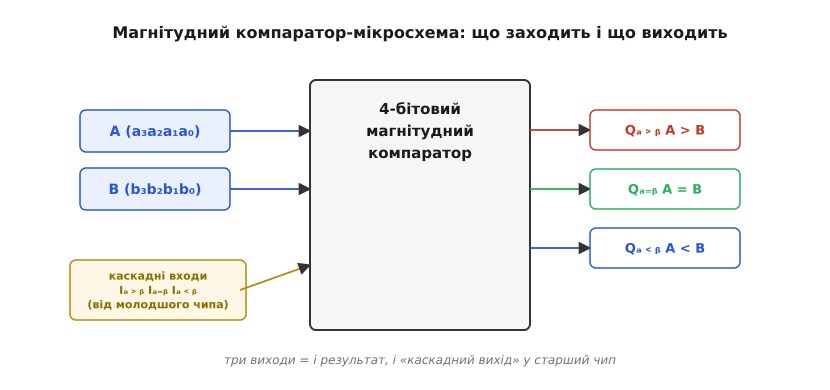
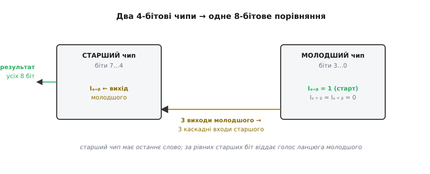
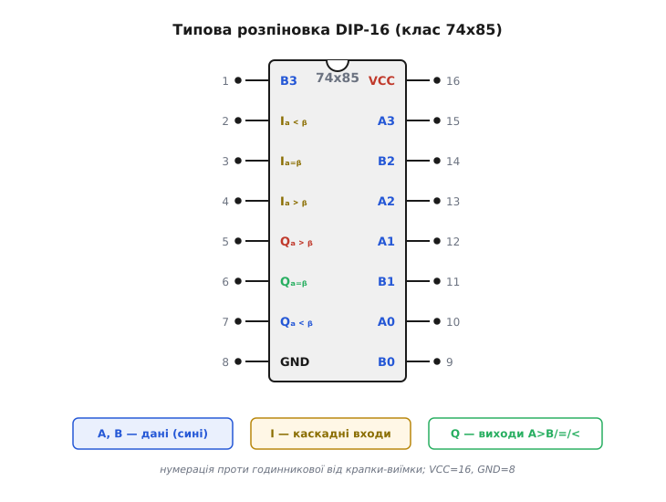
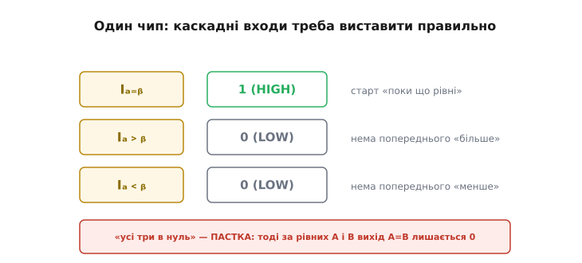

# 🔌 Каскадований магнітудний компаратор

У [статті про цифровий компаратор](topic:hw-digital/digital-comparator) ми виростили порівняння двох чисел із однобітового зерна: ступені зчіплюються в **каскад** від старшого розряду до молодшого, а найстаршому ступеню подають стартовий стан «поки що рівні». Ось саме цей каскад давним-давно згорнули в **готову мікросхему** — і в ту саму мікросхему вбудували вивідні лапки, якими один чип **чіпляють до іншого**, нарощуючи ширину числа без жодного зайвого вентиля. Про цей клас пристроїв тут і йдеться: що це за чип, які в нього ніжки, як його підключити самого й ланцюжком, і на яких дрібницях новачки спотикаються найчастіше.

Це **комбінаційна мікросхема середньої логіки** (*MSI, medium-scale integration*) — тобто в одному корпусі захований невеликий готовий вузол, а не окремі вентилі й не програмований процесор. Вона нічого не запам'ятовує, не має такту, не потребує прошивки: подав на входи два числа — і на трьох виходах негайно (крізь затримку логіки) з'явилося їхнє відношення за величиною. Класичний представник цього класу — **4-бітовий магнітудний компаратор** (типовий приклад — родина `74x85` у TTL і `CD4585` у КМОН; про них наприкінці). «Магнітудний» тут означає «за величиною»: чип порівнює **самі значення** чисел, а не окремі біти — тобто відповідає на «яке з двох чисел більше», а не просто «які біти різні».

> 🔧 **Навіщо це.** Здавалося б, навіщо окремий чип, коли будь-який мікроконтролер порівнює числа однією інструкцією? Бо порівняння в залізі відбувається **без процесора й без такту** — суто на затримці вентилів, за десятки наносекунд, і не забирає жодного машинного циклу. Там, де рішення «більше / рівні / менше» має спрацьовувати миттєво й безперервно (адресний дешифратор, апаратний захист, тригер логічного аналізатора), окремий компаратор дає відповідь швидше й надійніше, ніж програмна перевірка в циклі.

## Що в чипа заходить і що виходить

Розберімо блок-схему — не нутрощі (вони вже відомі з каскаду однобітових ступенів), а **зовнішній інтерфейс**: які групи ніжок є і за що кожна відповідає. Груп рівно чотири.


*Ліворуч заходять два числа A і B (по чотири біти кожне) та знизу — три каскадні входи від молодшого чипа. Праворуч виходять три взаємовиключні лінії A>B, A=B, A<B. Ці ж три виходи слугують і «каскадним виходом»: їх заводять у старший чип, коли нарощують ширину.*

Перша група — **дані A** (біти a₃…a₀) і **дані B** (біти b₃…b₀), разом вісім вхідних ніжок. Це два числа, які порівнюємо. Друга група — **три виходи**: `A>B`, `A=B`, `A<B`. Як ми знаємо зі статті, будь-якої миті активний рівно один із них, бо два числа перебувають в одному й лише одному з трьох відношень. Третя група — і ось вона нова — **три каскадні входи** (їх ще звуть входами-розширювачами, *expansion inputs*): `I(A>B)`, `I(A=B)`, `I(A<B)`. Це той самий «вхід попереднього рішення», що ми подавали найстаршому ступеню каскаду, але тепер виведений назовні корпусу. Четверта група — банальна, але без неї нічого не працює: **живлення** (VCC і GND).

Ключова думка, заради якої весь цей чип цікавий: **три виходи водночас є й каскадним виходом**. Окремих «вихідних для каскаду» ніжок немає — ті самі `A>B`/`A=B`/`A<B`, що показують результат, ти або читаєш як відповідь, або заводиш у каскадні входи наступного чипа. Тобто «вихід рішення» одного компаратора стикується з «входом попереднього рішення» іншого — і два чипи зливаються в один ширший, точно як два однобітові ступені всередині.

## Навіщо каскадні входи: продовження того самого ланцюга

Спинімося на каскадних входах докладніше, бо саме вони відрізняють цей клас від простого «чорного ящика на 4 біти». Пригадаймо правило ступеня з каскаду: «якщо старші розряди вже вирішили — пропускаю їхній вердикт далі незмінним; якщо вони рівні — вирішую сам за своєю парою бітів». Каскадні входи — це **канал, яким у чип заходить чуже, уже готове рішення старшого сусіда**, а логіка всередині чипа поводиться з ним точно за цим правилом.

Механізм такий. Чип спершу дивиться на **свої** чотири пари бітів. Якщо вони не всі рівні — тобто в межах цих чотирьох розрядів уже видно, хто більший, — чип **сам** виносить вирок і виставляє відповідний вихід, а на каскадні входи навіть не оглядається. А от якщо всі чотири пари його бітів **збіглися** (за його даними A і B рівні), то власного слова в чипа немає — і він **пропускає на вихід те, що прийшло на каскадні входи**. Ось і вся хитрість: рівний чип стає прозорою трубою для чужого рішення.

Тепер зрозуміло, як два чипи роблять 8-бітове порівняння. Розбиваємо 8-бітові числа на старшу тетраду (біти 7…4) і молодшу (біти 3…0). **Старший** чип порівнює старші тетради, **молодший** — молодші. Виходи молодшого заводимо в каскадні входи старшого. Якщо старші тетради різняться — старший чип вирішує сам, і що там у молодших, уже неважливо (правило старшого біта!). Якщо ж старші тетради рівні — старший чип стає прозорим і віддає на вихід голос молодшого. Точно те саме «перша відмінність від старшого краю вирішує», лише масштабоване на цілі тетради.


*Молодший чип порівнює біти 3…0, старший — біти 7…4. Три виходи молодшого заведено в три каскадні входи старшого. Старший чип має останнє слово: за різних старших тетрад вирішує сам, а за рівних — пропускає на спільний вихід вердикт молодшого. Наймолодший чип у ланцюгу стартує зі стану «поки що рівні».*

Зверни увагу на **напрям стикування**: виходи **молодшого** чипа → каскадні входи **старшого**. Це збиває, бо рішення ж «тече від старшого до молодшого» всередині одного чипа — а між чипами дріт іде ніби навпаки. Суперечності немає: усередині чипа пріоритет справді спускається від старших бітів до молодших, але **готове рішення молодшого блока має піднятися** й показатися старшому, щоб той, коли його власні біти рівні, знав, що сказали молодші. Старший чип — останній у черзі на слово, тож саме він тримає спільний вихід усього числа.

Ланцюг не обмежений двома чипами. Три 4-бітові компаратори дають 12 біт, чотири — 16, і так далі: виходи кожного молодшого блока — у каскадні входи наступного старшого. «Розширюваний до будь-якої кількості біт без зовнішніх вентилів» — це саме про здатність зчіплюватися цими трьома лініями.

## Типова розпіновка

Тепер про ніжки конкретно. Класичний магнітудний компаратор живе у **корпусі DIP-16** (16 виводів, дві ніжки, які майже точно відповідають цоколівці й у нащадків-КМОН). Ніжки рахують, як завжди, **проти годинникової стрілки** від позначки — крапки-заглибини чи півкруглої виїмки на одному з торців корпусу; ніжка 1 — ліворуч від виїмки, якщо тримати чип виїмкою вгору.


*Шістнадцять ніжок класу 74x85. Сині — дані A і B, вкраплені по обидва боки корпусу. Золоті (ніжки 2-4) — три каскадні входи. Виходи (ніжки 5-7) — трьома кольорами відношень. Живлення нестандартно рознесене: VCC на ніжці 16, GND на ніжці 8.*

Дві речі варто прочитати з цієї розпіновки уважно. Перше: **дані розкидані впереміш** — біти A і B не зібрані в дві акуратні шеренги, а чергуються по обидва боки корпусу (a₃ на ніжці 15, b₃ на ніжці 1, a₀ на ніжці 10, b₀ на ніжці 9…). Це не примха: так усередині кристала коротші й рівніші доріжки до кожної пари бітів. Практичний наслідок — **розводити плату під такий чип треба за даташитом, а не «за здоровим глуздом»**: інтуїтивна здогадка про порядок ніжок майже напевно помилкова.

Друге: **три каскадні входи стоять поряд із трьома виходами** (входи — ніжки 2-4, виходи — 5-7). Це зроблено навмисне, щоб два чипи на платі лягали поруч і три коротенькі перемички «виходи молодшого → каскадні входи старшого» йшли майже впритул, без довгих дротів через усю плату.

## Як підключати

Підключення розпадається на три обов'язкові кроки: живлення, дані, каскадні входи. Перші два прості, третій — місце головної пастки.

**Живлення.** VCC і GND — на відповідні шини. Обов'язково постав **керамічний 0.1 мкФ упритул між VCC і GND** цього чипа: комбінаційна логіка при перемиканні смикає короткі імпульси струму, і без цього конденсатора-накопичувача (*decoupling capacitor*) вони «дзвенять» шиною живлення й сіють хибні перемикання. Це універсальне правило для будь-якої цифрової мікросхеми, і компаратор — не виняток.

**Дані.** Вісім вхідних ніжок — на два числа. Тут важить лише одне, зате критично: **не переплутати вагу бітів**. Старший біт числа A має лягти на ніжку старшого біта A (a₃), молодший — на a₀; так само для B. Переплутаєш порядок — і чип чесно порівняє, але **не ті числа**: він же не знає, який твій біт «головніший», він вірить ніжкам. Жоден вхід не можна лишати висіти в повітрі: непід'єднаний вхід КМОН-логіки ловить наводки й дає хаотичний результат. Невживані старші біти (коли твоє число вужче за чип) прив'язують до нуля.

**Каскадні входи — і ось де спотикаються найчастіше.** Коли чип **один** (або це **наймолодший** у ланцюгу), його каскадним входам однаково треба задати стартовий стан — той самий «поки що рівні», що ми подавали найстаршому ступеню всередині. І тут пастка: інтуїція підказує «нема попереднього рішення — заземлю всі три каскадні входи в нуль», а це **помилка**.


*Для одинокого чипа (чи наймолодшого в ланцюгу): каскадний вхід I(A=B) підтягують у одиницю (HIGH), а I(A>B) та I(A<B) саджають у нуль (LOW). «Усі три в нуль» — типова пастка: тоді за рівних A і B вихід A=B лишиться в нулі, і чип не покаже рівність.*

Правильно так: **`I(A=B)` — у одиницю (HIGH)**, а `I(A>B)` та `I(A<B)` — у нуль (LOW). Чому саме так, видно з логіки прозорого чипа. Коли всі біти чипа збіглися, він пропускає каскадні входи на виходи як є. Якщо в цьому стані на `I(A=B)` стоїть одиниця, а на решті нулі — вихід `A=B` дістане одиницю, і чип чесно скаже «числа рівні». А от якщо всі три каскадні входи в нулі, то за рівних чисел прозорий чип віддасть на всі три виходи нулі — і вихід `A=B` теж буде нуль. Виходить абсурд: числа рівні, а лінія «рівні» мовчить. Тому наймолодший вхід ланцюга **мусить стартувати зі стану «рівні»**, тобто з одиницею на `I(A=B)`.

**Стандартне підключення одинокого компаратора.**
```
   I(A=B)  →  VCC через 1…10 кОм (або прямо на "1")   — старт "поки що рівні"
   I(A>B)  →  GND ("0")                                — нема попереднього "більше"
   I(A<B)  →  GND ("0")                                — нема попереднього "менше"
   VCC     →  +живлення,  GND → земля,  0.1 мкФ між ними
```

## Перше вмикання: перевірити на трьох парах чисел

Зібравши чип уперше, не варто одразу гнати на нього робочі дані — спершу переконайся, що каскадні входи виставлені правильно, бо саме там ховається тиха помилка. Найшвидша перевірка — подати **три показові пари** й глянути, який вихід загорівся.

**Перше вмикання: три контрольні пари.**
```c
// Логіка перевірки, яку емулює твоя думка (або тестовий МК, що керує входами):
// подаємо пару чисел на входи чипа й читаємо, який вихід = 1.

// пара 1: A = 0b0101 (5),  B = 0b0011 (3)   → очікуємо активним лише A>B
// пара 2: A = 0b0110 (6),  B = 0b0110 (6)   → очікуємо активним лише A=B
// пара 3: A = 0b0010 (2),  B = 0b1000 (8)   → очікуємо активним лише A<B

// Головна перевірка — саме ПАРА 2 (рівні числа):
// якщо при A == B вихід A=B мовчить, а горить щось інше або нічого —
// значить I(A=B) не підтягнуто в "1". Це найчастіша причина.
```

Головний рядок тут — **пара рівних чисел**. Якщо на ній вихід `A=B` не загорівся, діагноз майже завжди один: забули підтягнути `I(A=B)` в одиницю. Пари «більше» й «менше» здебільшого спрацьовують і за неправильних каскадних входів (бо там чип вирішує сам, не оглядаючись на каскад), тому саме рівність — найчутливіший тест на правильне підключення.

## Затримка: платимо за каскад

За здатність нескінченно нарощувати шириною платимо **затримкою поширення** (*propagation delay*). Рішення мусить фізично «протекти» крізь логіку, а в ланцюгу з кількох чипів — ще й крізь усі каскадні стики. У найгіршому разі (числа різняться аж у наймолодшому біті наймолодшого чипа) сигнал проходить увесь ланцюг від першого чипа до останнього.

Розробники цього класу зробили корисну річ, щоб пом'якшити біду: **каскадний шлях усередині чипа коротший за звичайний**. У класичному 74x85 сигнал від каскадного входу до виходу проходить лише **два рівні вентилів**, а не весь чотирибітовий гребінець. Тобто кожен доданий у ланцюг чип додає до затримки не «повну свою глибину», а лише ці два вентилі каскадного тракту. Порядок величини для одного 74x85 — **десятки наносекунд** (у TTL-варіанта LS — близько 20…30 нс від зміни даних до встановлення виходу); КМОН-варіант CD4585 повільніший — типово **близько 180 нс при 10 В живлення** (КМОН узагалі тим швидший, чим вища напруга).

```
затримка ланцюга ≈ затримка першого чипа (весь гребінець)
                 + (кількість наступних чипів) · (2 вентилі каскадного тракту)
```

> 🔧 **Навіщо це.** Ця арифметика вирішує, скільки чипів можна зчепити, поки схема ще встигає за потрібним темпом. Якщо порівняння має завершитися за такт швидкого лічильника чи до фронту стробу, довгий ланцюг може не встигнути — і тоді або беруть швидший логічний ряд (той самий 74-й номер, але серія F чи AC замість LS), або дроблять число на групи, що порівнюються паралельно, а їхні результати зводять окремою логікою. Це той самий компроміс «простий каскад проти швидкості», що й у суматора з наскрізним переносом.

## Типові граблі класу

- **Усі каскадні входи в нуль.** Найпоширеніша помилка з цим класом. Числа рівні, а вихід `A=B` мовчить, бо `I(A=B)` не підтягнуто в одиницю. Правило залізне: одинокий чи наймолодший чип — `I(A=B)`=1, два інші каскадні входи =0.
- **Каскад стикнули не в той бік.** Виходи заведено з молодшого чипа в старший, а не навпаки, — і 16-бітове порівняння дає дурниці. Пам'ятай: **виходи молодшого → каскадні входи старшого**; старший тримає спільний вихід.
- **Переплутана вага бітів даних.** a₃ потрапив на ніжку молодшого біта абощо. Чип порівнює справно, але **не ті числа**. Дані розкидані по корпусу впереміш — розводь строго за даташитом, не «за логікою розташування».
- **Висячі входи.** Невживані старші біти (число вужче за чип) лишили в повітрі — вони ловлять наводки й псують результат. Прив'яжи їх до нуля в **обох** числах (щоб порожні розряди були рівні між собою й не збивали порівняння).
- **Забутий конденсатор живлення.** Немає 0.1 мкФ біля VCC/GND — швидкі фронти дзвенять шиною, з'являються поодинокі хибні перемикання, які важко зловити. Став завжди.
- **Мовчазне очікування двотактного виходу там, де його нема.** Це стосується не 74x85 (у нього виходи звичайні двотактні), а деяких рідших компараторів з відкритим виходом — перевір по даташиту, чи виходу потрібна [підтяжка](topic:hw-components/open-collector-output), перш ніж заводити його прямо в логіку.

## Варіації класу

Клас «готовий магнітудний компаратор» існує в кількох іпостасях, і вибір між ними — це вибір **логічного ряду** та **ширини**, а не якоїсь принципово іншої поведінки.

**За технологією й швидкістю.** Історично цей вузол з'явився в **TTL** (транзисторно-транзисторна логіка) як 4-бітовий магнітудний компаратор класичного 7400-го ряду. Той самий чип випускали десятки виробників у різних серіях того самого ряду: повільніша й економніша **LS** (Low-power Schottky), швидші **S**, **F**, **AS**. Пізніше прийшла **КМОН** (комплементарний метал-оксид-напівпровідник): і власне 4000-й ряд (класичний 4-бітовий CMOS-компаратор), і швидкі КМОН-версії того самого 74-го номера (HC/HCT/AC). КМОН-варіанти беруть мізерний статичний струм і працюють у ширшому діапазоні напруг живлення, зате «голі» КМОН-серії — повільніші за швидкі біполярні. Функція, розпіновка й правило каскадування в усіх цих іпостасей **одні й ті самі** — різняться лише швидкість, споживання й напруга живлення.

**За шириною.** Базовий чип — **4-бітовий**, і саме він, зчеплений каскадом, покриває будь-яку ширину. Траплялися й **8-бітові** магнітудні компаратори в одному корпусі (з тими самими трьома каскадними входами, тільки даних удвічі більше) — вони економлять один чип на кожні 8 біт і один каскадний стик, але суть та сама.

**За «магнітудний проти рівності».** Якщо схемі потрібне лише «рівні / не рівні», повний магнітудний компаратор — надлишок: рівність, як ми знаємо зі [статті](topic:hw-digital/digital-comparator), збирається дешевше, самим «XNOR кожного біта плюс AND», без каскаду й правила старшого біта. Під це є окремий, простіший клас — **компаратори рівності** (наприклад, 8-бітовий чип, що дає один вихід «усі біти збіглися»). Бери магнітудний компаратор лише тоді, коли справді треба розрізняти «більше» й «менше»; для чистого «рівні?» є дешевший вузол.

Ось так каскад однобітових ступенів, що ми виростили теоретично, живе в кремнії: чотири біти на чип, три виходи-відношення, які водночас служать каскадним виходом, і три каскадні входи, якими чипи зчіплюються в число будь-якої ширини. Уся практика зводиться до трьох речей — не переплутати вагу бітів даних, підтягнути `I(A=B)` наймолодшого чипа в одиницю й пам'ятати, що виходи молодшого блока йдуть у каскадні входи старшого. Решту робить фізика вентилів за десятки наносекунд.
