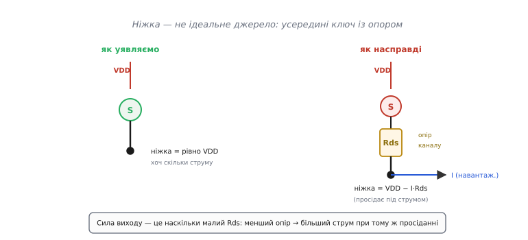
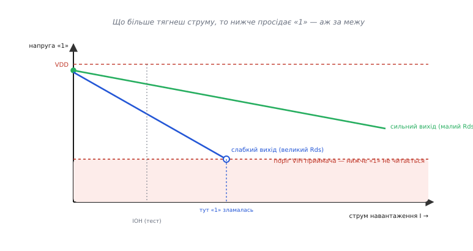
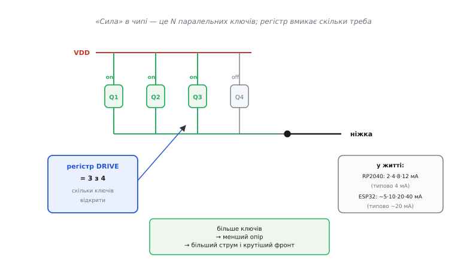
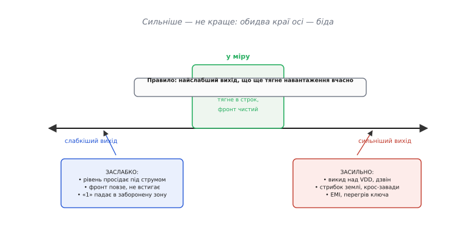

# Сила виходу GPIO: скільки струму витягне ніжка, поки «1» ще «1»

Уяви, що ти щойно налаштував ніжку мікроконтролера на вихід і виставив на ній одиницю. У голові картинка проста: на ніжці тепер живлення, рівно 3.3 В, і це джерело напруги, з якого можна брати струм скільки завгодно. Підключаєш світлодіод — світиться. Підключаєш другий, третій, довгий шлейф до сусідньої плати — і раптом рівень «поплив»: замість 3.3 В на ніжці 2.6 В, приймач на тому кінці читає щось невиразне, а зв'язок збоїть. Нічого не згоріло. Просто ніжка **не** ідеальне джерело напруги — і те, наскільки вона близька до ідеалу, називають **силою виходу** (англ. *drive strength* — «сила приводу»).

## Чому ніжка просідає: усередині — ключ із опором

Розберімо, що фізично стоїть за виводом «одиниця». Коли ти пишеш логічну одиницю, усередині відкривається верхній транзистор і з'єднує ніжку з шиною живлення; логічний нуль відкриває нижній транзистор і садить ніжку на землю. Ці два транзистори — і є [вихід push-pull, «тягни-штовхай»](topic:hw-digital/push-pull-output): один тягне ніжку вгору, другий штовхає вниз, обидва разом ніколи не відкриті.

> 🔧 **Навіщо це.** Уся ця стаття — про верхній і нижній транзистори цього виходу. Сила виходу — це просто наскільки «жирні» ці транзистори: тонкий канал має великий опір і кволо тримає рівень під навантаженням, широкий канал — малий опір і тримає впевнено.

Ключове: відкритий транзистор — **не** ідеальний вимикач із нульовим опором. Це канал із цілком відчутним опором **Rds(on)** (англ. *resistance drain-source, on* — опір «стік-витік» у відкритому стані), одиниці чи десятки ом. І цей опір стоїть **послідовно** між живленням і ніжкою.



*Ідеальна ніжка тримала б VDD за будь-якого струму; справжня віддає VDD мінус падіння на власному опорі каналу.*

Тепер усе стає на місця. За законом Ома на цьому опорі падає напруга, щойно тече струм:

```
U_ніжки = VDD − I · Rds(on)
```

Поки струм малий, падіння мізерне й ніжка майже на VDD. Але візьми більше струму — і падіння зростає, рівень «одиниці» повзе вниз. Сила виходу — це просто **наскільки малий Rds(on)**: сильний вихід має малий опір і майже не просідає, слабкий — великий опір і просідає рано.

## Де «одиниця» перестає бути одиницею

Саме по собі просідання ще не біда — біда починається, коли рівень падає **нижче порога**, на якому приймач ще впізнає одиницю. Адже [«0» і «1» — це не точні числа, а діапазони напруг](topic:hw-digital/logic-levels-as-ranges): усе вище певного порога VIH приймач читає як одиницю, усе нижче — вже ні. Просідання з'їдає запас до цього порога.



*Кожен вихід «просідає» по прямій з нахилом Rds(on); слабкий перетинає межу читабельної одиниці при куди меншому струмі.*

Даташит не змушує тебе рахувати опір самотужки — він одразу дає готову точку на цій прямій. У розділі [DC Characteristics](topic:hw-digital/datasheet-dc-characteristics) стоїть пара чисел: **VOH при IOH** для одиниці й **VOL при IOL** для нуля. Читати так: «якщо тягнути з ніжки струм IOH, напруга одиниці гарантовано не впаде нижче VOH». Наприклад, «VOH = 2.4 В при IOH = 8 мА» означає: витягуй до 8 мА — і матимеш щонайменше 2.4 В. Хочеш більше струму — рівень поповзе нижче, і гарантії вже немає.

> 🔧 **Навіщо це.** VOH/IOH і VOL/IOL — це не абстракція, а перше, у що дивишся, добираючи навантаження. Скільки світлодіодів запаралелити на ніжку, чи потягне вона довгий дріт, чи не «сяде» шина — усе впирається в цю пару чисел. Виведення прямої просідання з Rds(on), поділ струму між кількома запаралеленими виходами й бюджет фронту від ємності — у [математичній вставці](topic:hw-digital/drive-strength/math-drive-droop.md).

## Друга половина сили: як швидко ніжка перемикає ємність

Досі йшлося про статику — рівень під сталим струмом. Але сила виходу керує ще й **швидкістю фронту**, і тут причина та сама. Будь-яке навантаження має ємність: затвор наступної мікросхеми, доріжка на платі, кабель. Щоб змінити напругу на ємності, її треба **зарядити**, а заряд несе струм. Зв'язок жорсткий:

```
I = C · (dU / dt)
```

Читай навпаки: за наявного струму I швидкість зміни напруги дорівнює dU/dt = I / C. Сильніший вихід дає більший струм — отже, **швидший фронт** на тій самій ємності. Слабкий вихід ту саму ємність заряджає мляво, фронт [наростає поволі](topic:hw-digital/edges-rise-time), і на швидкій шині ніжка просто не встигає дійти до рівня, поки не час наступного біта.

Ось чому сила виходу й [керування крутістю фронту](topic:hw-digital/slew-rate-control) — по суті два боки однієї монети: підкрутив силу — змінив і струм просідання, і швидкість зарядки ємності заразом.

## Керована сила: скільки транзисторів увімкнути

Раз сила виходу — це опір каналу, то керувати нею означає **керувати опором**. У чипі це роблять елегантно: замість одного транзистора ставлять кілька однакових **паралельно**. Паралельні опори додаються як провідності, тож два відкриті ключі мають удвічі менший опір, ніж один, чотири — вчетверо. Спеціальний регістр вмикає стільки, скільки треба.



*Більше відкритих ключів — менший сумарний опір — більший струм і крутіший фронт; одним регістром керуєш обома.*

У реальних мікроконтролерах це виглядає так. **RP2040** (серце Raspberry Pi Pico) дає чотири рівні — 2, 4, 8 і 12 мА, типово 4 мА після скидання. **ESP32** має чотири рівні сили приблизно 5, 10, 20 і 40 мА, з типовим близько 20 мА. У **STM32** сила зашита в регістр швидкості `OSPEEDR` (Low/Medium/High/Very High): вибираючи «швидкість», ти насправді вибираєш силу виходу — той самий набір паралельних ключів. (Ці числа — з даташитів відповідних сімейств; статус: усталено.)

Керується це буквально одним рядком. На ESP-IDF:

```c
#include "driver/gpio.h"

// Ніжка тягне сильнострумне навантаження — піднімаємо силу до максимуму
gpio_set_drive_capability(GPIO_NUM_5, GPIO_DRIVE_CAP_3);   // ~40 мА

// А цю лінію женемо на високій частоті по короткій доріжці —
// беремо помірну силу, щоб не дзвеніла
gpio_set_drive_capability(GPIO_NUM_18, GPIO_DRIVE_CAP_1);  // ~10 мА
```

На RP2040 через його SDK:

```c
#include "hardware/gpio.h"

gpio_set_drive_strength(15, GPIO_DRIVE_STRENGTH_12MA);  // максимум для RP2040
gpio_set_drive_strength(16, GPIO_DRIVE_STRENGTH_2MA);   // мінімум, тиха лінія
```

## Головна пастка: сильніше — не краще

Здавалося б, постав усюди максимум — рівень триматиметься твердо, фронти будуть різкі, зв'язок надійний. Це найпоширеніша й найдорожча помилка. Сильний вихід приносить свій набір лих, і що сильніший — то гірших.



*Обидва краї осі — обрив; сила виходу — це вибір точки, а правильна точка не скраю, а посередині.*

Корінь проблеми — той самий струм. Дуже сильний вихід шпарить крутющий фронт: dU/dt величезна, отже, і струм заряджання ємності на короткій миті велетенський. А різкий фронт разом із неминучою індуктивністю дротів дає три біди заразом:

- **Викид і дзвін.** Крутий фронт на лінії з індуктивністю й ємністю — це збуджений коливальний контур: напруга вискакує над VDD, потім дзвенить туди-сюди, поки не згасне. Приймач може прочитати цей викид як зайвий перемик.
- **[Стрибок землі](topic:hw-pcb/ground-bounce).** Різкий кидок струму крізь індуктивність спільного дроту землі підіймає «землю» всього чипа на частку вольта. На ту мить усі решта тихих ніжок теж смикаються — і сусідній вхід може хибно спрацювати.
- **Завади (EMI, англ. *electromagnetic interference*).** Круті фронти багаті на високі гармоніки; доріжка стає антеною й пхає перешкоди в ефір та в сусідні лінії. Це те, на чому вироби провалюють сертифікацію.

Звідси залізне правило: **бери найслабшу силу, що ще тягне твоє навантаження вчасно** — і жодним рівнем сильнішу. Сильна ніжка потрібна рідко: швидка паралельна шина пам'яті, довгий шлейф із помітною ємністю, тактовий сигнал на кілька приймачів. Кнопка, світлодіод, повільна лінія — там мінімальна сила не лише достатня, а й **краща**: тихіша, холодніша, чистіша.

> 🔧 **Навіщо це.** Дуже часто «плата ловить перешкоди» чи «не проходить EMC» лікується не переробкою, а зменшенням сили виходу на кількох ніжках. Найдешевша правка сигнальної цілісності, яку варто спробувати першою: там, де швидкість дозволяє, спусти силу на щабель-два.

## Сила виходу — це не запобіжник

Важливо не сплутати силу виходу з **максимально допустимим струмом** ніжки. Це різні речі. Сила виходу каже, до якого струму ще **гарантується логічний рівень** — тобто де закінчується **корисна** робота. Абсолютний максимум каже, де ніжка **фізично згорить** від перегріву каналу, і це зовсім інша межа в даташиті. Виставити велику силу — не те саме, що дозволити велику потужність: [навантажувальна здатність і фізичні межі ніжки](topic:hw-digital/pin-drive-limits) живуть окремо, зі своїми числами (струм на ніжку, сумарний струм на порт, температура).

Класичний приклад — світлодіод без резистора «бо ніжка й так дає 12 мА». Так, вихід у 12 мА **впорається** зі струмом. Але без резистора струм визначає не ніжка, а різниця напруг на світлодіоді, і легко вискочити за абсолютний максимум — навіть коли «сила виходу» це начебто дозволяє. Сила каже про рівень, запобіжник — про виживання; плутати їх не можна.

## Як це осідає в голові

Отже, коротко про суть. Ніжка виходу — це транзистор-ключ із власним невеликим опором, а не ідеальне джерело. Тому:

```
рівень «1»  = VDD − I · Rds(on)      ← статика: просідання під струмом
швидкість   = I / C                   ← динаміка: як швидко заряджає ємність
```

Обидві формули дивляться на той самий струм, і сила виходу керує ним через опір каналу — фізично через те, скільки паралельних транзисторів увімкнено. Мало сили — рівень просідає й фронт повзе; забагато — викид, дзвін, стрибок землі, EMI. Правильна сила не скраю, а рівно та мінімальна, що ще тягне навантаження в потрібний строк.
