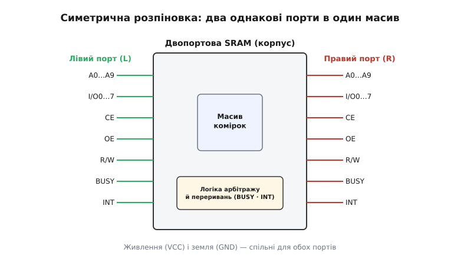

# 🔌 Двопортова SRAM з апаратним арбітражем: розпіновка, BUSY, каскад «головна–підпорядкована»

Клас мікросхем, про який тут ідеться, — це двопортова статична пам'ять (SRAM), у якій **арбітраж зіткнень виконує саме залізо мікросхеми**, а назовні виведено сигнал зайнятості. Історично архетип класу — родина 1K×8, де окрема «головна» (master) мікросхема веде арбітраж, а «підпорядкована» (slave) лише слухається її; на цій самій схемі поведінки збудовано десятки ширших родичів (більша ємність, слово ×16, версії з семафорами). Партномери тут не предмет — предмет **спільна поведінка**: у будь-якого виробника ці мікросхеми вмикаються однаково, мають однакові за призначенням виводи й однакові граблі. Розберімо, як така мікросхема виглядає ззовні, як її підключити, як зробити нею перший обмін між двома ядрами й де вона підкидає прикрощі.

Щоб зрозуміти, **чому** порти влаштовані саме так і що робить сигнал BUSY, потрібне спершу відчуття самої [двопортової пам'яті](root:hw-digital/dual-port-ram): один масив комірок, двоє незалежних воріт, а єдина справжня небезпека — коли обидві сторони тягнуться в ту саму комірку в ту саму мить. Ця вставка бере той принцип як даність і показує його **втілення в конкретному класі корпусів**.

## Що це за клас

Усередині — звичайний масив SRAM-комірок, до кожної з яких прибудовано **два** комплекти ключів доступу зі своїми розрядними лініями. Назовні це дає два цілком окремі порти, які прийнято звати **лівим** і **правим** (у даташитах — індекси L і R). Кожен порт — самодостатній набір ніжок: своя шина адреси, своя шина даних, свої керівні лінії. Ліве й праве ядра під'єднуються кожне до свого порту й працюють асинхронно — у власних тактових ритмах, не питаючи дозволу.

Що робить цей клас саме цим класом — **вбудований арбітр**. Мікросхема сама стежить за адресами обох портів; щойно вони збіглися й обидва звертання активні, логіка порівнює, чия адреса стала стійкою **раніше**, дозволяє доступ переможцеві, а спізнілому виставляє сигнал **BUSY** («зайнято»). Жодного зовнішнього арбітра шини не треба — уся розв'язка зіткнення захована в кремнії. Це головна відмінність від «голого» двопортового масиву без логіки: тут мікросхема не лише зберігає дані, а й **вирішує суперечки за них**.

> 🔧 **Навіщо це.** Готовий арбітр усередині — це те, за що цей клас беруть. Ви не пишете протокол «хто коли ходить», не будуєте зовнішню логіку старшинства, не боїтеся розірваних слів у спільній комірці: поставив мікросхему, зв'язав дві шини — і два ядра обмінюються даними, а залізо саме гарантує, що ніхто не впіймає «недопечене» слово. Ціна — трохи більше ніжок, зовнішній резистор на BUSY і знання кількох тонкощів, про які нижче.

## Блок-схема: що всередині корпусу

Уявімо начинку одним поглядом. У центрі — **масив комірок**. З лівого боку до нього веде лівий комплект: дешифратор адреси (перетворює число на адресних лініях у вибір рядка й стовпця), буфери даних (двобічні — то на вхід, то на вихід), керування читанням/записом. Дзеркально праворуч — такий самий правий комплект. Обидва дешифратори дивляться в **той самий** масив, лише кожен зі свого боку.

Між ними сидить **логіка арбітражу й переривань** — окремий блок, що не бере участі в зберіганні даних, а лише наглядає. Він порівнює адреси двох портів, ловить збіг, вирішує старшинство й керує лініями BUSY та INT. Саме цей блок робить пам'ять «розумною»: без нього був би просто масив із двома входами, який мовчки псував би дані на зіткненні.

У родичів із семафорами до цього додається ще один незалежний блок — **набір із восьми латчів-семафорів**, який стоїть **збоку від масиву даних** і має власні адреси. Він теж наглядовий, теж арбітрує, але вже не за адресами масиву, а за тим, хто першим написав нуль у латч. Про нього — окремо нижче.

## Типова розпіновка двох портів

Ззовні мікросхема виглядає як **два симетричні набори ніжок**, ліворуч і праворуч, плюс живлення. Для родини 1K×8 (масив 1024 слова по 8 біт) кожен порт має такий склад:

```
На КОЖЕН порт (індекс L для лівого, R для правого):
  A0…A9        — 10 адресних ліній (2¹⁰ = 1024 комірки)
  I/O0…I/O7    — 8 двобічних ліній даних (то вхід, то вихід)
  CE  (chip enable)    — «вибір мікросхеми»: активний нулем, вмикає порт
  OE  (output enable)  — «дозвіл виходу»: активний нулем, відкриває дані назовні
  R/W (read / write)   — напрям: 1 — читання, 0 — запис
  BUSY  — «зайнято» для цього порту (докладно нижче)
  INT   — «переривання» для цього порту (докладно нижче)
```

Число адресних ліній прямо задає ємність: десять ліній — рівно 1024 комірки, бо 2¹⁰ = 1024. Ширша пам'ять того самого класу просто додає адресних ніжок (одинадцять ліній — 2048 слів, дванадцять — 4096) і, за потреби, більше ліній даних. Логіка сигналів при цьому не міняється — міняється лише розмір масиву.

Три керівні сигнали на порт варто затямити разом, бо вони працюють у зв'язці. **CE** вмикає порт узагалі: поки він у «1», порт спить, ніжки даних відпущені, живлення мінімальне. **R/W** каже, куди тече слово: у «1» порт читає, у «0» — пише. **OE** відкриває буфер даних назовні при читанні: без активного OE навіть увімкнений порт, що читає, не виставить дані на ніжки. Розділення на CE, OE й R/W дає тонкий контроль: можна тримати мікросхему ввімкненою, але вихід закритим (наприклад, поки шина зайнята іншим пристроєм), і відкрити його лише в потрібну мить.


*Симетрична розпіновка. Два однакові за складом порти — лівий і правий — дивляться в один масив; між ними сидить логіка, що арбітрує зіткнення (BUSY) і передає переривання (INT). Живлення й земля — спільні.*

## Сигнал BUSY: відкритий стік і зовнішня підтяжка

BUSY — серце цього класу, і його електрична природа важлива не менше за логічну. Кожен порт має свій вивід BUSY, і мікросхема притягує його до нуля, коли **цей** порт програв гонку за спільну комірку: «зачекай, зараз тобі не можна, доступ у сусіда». Поки зіткнення немає, BUSY відпущений і стоїть у «1».

Ключова деталь: BUSY зроблено **з відкритим стоком** (open drain). Це означає, що вивід уміє лише **притягувати** лінію донизу, до нуля; угору, до «1», його не тягне ніщо всередині — це робить **зовнішній резистор-підтяжка** до плюса живлення. Той самий принцип, що й у будь-якого [виходу з відкритим колектором](root:hw-components/open-collector-output): ніжка або замикає лінію на землю, або відпускає її, а рівень «відпущено» задає підтяжка.

> 🔧 **Навіщо це.** Відкритий стік тут не примха, а необхідність для розширення слова. Коли треба ширша за 8 біт пам'ять, кілька мікросхем ставлять поряд, і їхні виводи BUSY **зв'язують у спільний дріт**. Відкритий стік дозволяє це зробити напряму: будь-яка мікросхема, що вважає себе зайнятою, притягує спільну лінію до нуля, а вільними лишається лише тоді, коли **всі** відпустили. Виходить [монтажне «І»](root:hw-digital/wired-logic) — «зайнято, якщо зайнятий хоч хтось». Двотактний вихід так з'єднати не можна: коли одна мікросхема тягла б угору, а друга вниз, між ними потекло б коротке замикання. **Обов'язкове правило: одна підтяжка на всю спільну лінію BUSY**, типово одиниці кілоом — не по резистору на кожну мікросхему (інакше паралельні підтяжки перевантажать вихід струмом).

Логіку BUSY у прошивці читають так само, як звичайний вхід рівня: перед записом у спільну область ядро дивиться на свій BUSY і, якщо він у нулі, притримує звернення. Проте частіше BUSY заводять не в код, а **в апаратний вхід очікування** (WAIT) мікроконтролера чи в шинну логіку: тоді залізо саме розтягує цикл доступу, поки BUSY активний, і код взагалі не думає про зіткнення.

## Арбітраж за різницею часу становлення адрес

Як мікросхема вирішує, кому дозволити, а кому виставити BUSY? За **різницею в часі**. Арбітр стежить, коли на кожному порту адреса стала стійкою й звернення — дійсним. Якщо ці дві події рознесені в часі бодай на частки наносекунди, усе просто: хто раніше — той переможець, іншому BUSY. Проблема виникає, коли розрив стискається **до нуля**: два майже одночасні звернення треба рознести на два чіткі стани — «перший» і «другий», — а зробити це миттєво фізика не дозволяє.

Тут арбітр входить у [метастабільність](root:hw-digital/metastability-timing): його внутрішній тригер на межі рішення на коротку мить «зависає» між станами, не в змозі одразу визначитися. Виробники це знають і **закладають затримку**, за яку арбітр гарантовано розв'яжеться, перш ніж виставить остаточний BUSY. Тому в даташиті є окремий параметр — час на арбітраж (позначають як час дійсності BUSY після збігу адрес): **доти сигналу BUSY довіряти не можна**, він ще «дозріває». Ядро мусить дати цей час, перш ніж покладатися на BUSY, — або через апаратний WAIT, або витримавши таймінг доступу за даташитом.

## Каскад «головна–підпорядкована» для слова 16+ біт

Один корпус класу 1K×8 дає слово завширшки 8 біт. Коли системі треба 16 біт (чи ширше), мікросхеми ставлять поряд: одна тримає молодший байт, друга — старший, обидві адресуються тими самими адресними лініями паралельно. Але тут стається пастка, заради якої й вигадали поділ на **головну** й **підпорядковану**.

Уяви наївний варіант: дві однакові мікросхеми з арбітрами, обидві зі своїми BUSY. Обидва арбітри бачать той самий збіг адрес — але через мізерний розкид можуть **вирішити його по-різному**: один арбітр віддасть слово лівому порту, другий — правому. Тоді 16-бітне слово розірветься: молодший байт піде одному ядру, старший — іншому. Катастрофа саме там, де арбітраж мав рятувати.

Розв'язок — **один арбітр на всіх**. Одну мікросхему призначають **головною** (master): її BUSY — це справжні відкриті стоки-**виходи**, і саме вона веде арбітраж. Другу (і всі решта в цьому слові) роблять **підпорядкованою** (slave): у неї виводи BUSY — не виходи, а **входи**. BUSY підпорядкованої мікросхеми внутрішньо **забороняє запис**: поки на її вході BUSY нуль, вона не пише. Виходи BUSY головної зв'язують із входами BUSY підпорядкованих — і рішення головного арбітра дзеркалиться на весь ланцюг. Головна вирішила «лівому не можна» → притягла спільну лінію BUSY → підпорядковані побачили нуль на своїх входах BUSY → **всі** заблокували запис лівого порту водночас. Слово лишається цілим, бо рішення одне на всіх.

```
Слово 16 біт з двох мікросхем 1K×8:

  адресні лінії A0…A9 ── паралельно на обидві мікросхеми
  ГОЛОВНА (master):        I/O0…7  = біти 0…7    BUSY = ВИХІД (відкр. стік)
  ПІДПОРЯДКОВАНА (slave):  I/O0…7  = біти 8…15   BUSY = ВХІД (гальмує запис)

           BUSY(вихід головної) ──┬── резистор-підтяжка до +V
                                  └── BUSY(вхід підпорядкованої)
```

> 🔧 **Навіщо це.** Поділ master/slave дає повношвидкісну безпомилкову роботу на 16, 32 і більше біт **без жодної зовнішньої логіки**: не треба дискретних тригерів, щоб узгодити арбітрів. Один головний вирішує, решта повторюють. Розробнику лишається правильно вибрати корпус (master чи slave — це різні партномери в родині) і зв'язати лінії BUSY.

## Вісім латчів-семафорів: інша розв'язка тієї ж проблеми

У частини мікросхем класу (родичі з ширшим набором функцій) до арбітра з BUSY додано **набір із восьми латчів-семафорів** — окремий, незалежний від масиву даних вузол зі своїми адресами. Це друга, зовсім інша стратегія розв'язання зіткнень: не залізо гальмує доступ у реальному часі, а **дві сторони самі домовляються** протоколом.

Семафор — прапорець, **активний нулем**: вільний читається як 1, захоплений — як 0. Щоб узяти замок на спільний блок даних, сторона робить дві дії поспіль:

```
1) пише 0 у вибраний семафор  (заявляє намір)
2) читає його назад
   прочитала 0 → замок її, блок можна чіпати
   прочитала 1 → її випередили, чекати й пробувати згодом
```

Уся суть — у **гарантії заліза**: коли обидві сторони пишуть 0 в один семафор майже одночасно, вбудований арбітр (пара навхрест зв'язаних вентилів) пропускає лише **одну** — ту, що зайшла на крихту раніше, — і саме їй віддає прочитане 0, а другій латч віддає 1. Прапорець фізично не може стати «захопленим для обох». Якщо нуль пишуть у вільний семафор, він стає нулем на цьому боці й одиницею на іншому — тобто протилежна сторона одразу бачить «зайнято». Звільняють замок зворотно: власник пише 1, семафор знову читається як вільний.

Тонкість, спільна з BUSY: латч-семафор теж має всередині арбітр, і при справді одночасному записі він теж на мить вагається. Але тут це **не страшно**, і в цьому головна перевага семафора над BUSY. BUSY мусить дати відповідь **у реальному часі**, посеред циклу доступу до пам'яті, — тому його метастабільність напряму подовжує цикл, і на неї закладають жорсткий таймінг. Семафор натомість — **добровільний рукостискання**: сторона написала 0, і **сама** повертається прочитати вердикт трохи згодом; вона не тримає шину, нікого не блокує, просто перечитує біт. Затримку арбітра семафор ховає в тому, що читання-назад іде окремою операцією, а не всередині того самого звернення. Тому семафор зручний там, де сторони можуть дозволити собі спитати «а можна?» заздалегідь, а не гальмувати кожне звернення до масиву.

Практичний бік — захоплення семафора у прошивці. Латчі відображені в адресний простір як звичайні комірки:

```c
#define SEM0  (*(volatile uint8_t *)0x8000)  // латч-семафор № 0 у просторі DPRAM

bool sem_try_lock(void)      // true, якщо ресурс тепер наш
{
    SEM0 = 0;                // 1) пишемо 0 — заявляємо намір
    return (SEM0 & 1) == 0;  // 2) читаємо назад: 0 → замок наш, 1 → нас випередили
}

void sem_unlock(void)
{
    SEM0 = 1;                // віддаємо замок: 1 → семафор знову вільний
}
```

Слово `volatile` (англ. «мінливий») тут критичне: без нього компілятор вирішив би, що читати назад щойно записану комірку марно, і викинув би друге звернення — а саме в ньому вся суть, бо назад ми читаємо не «своє» значення, а **вердикт арбітра**.

## Лінії переривань: поштові скриньки INT

Крім арбітражу, клас зазвичай має пару виводів **INT** (по одному на порт) — апаратний спосіб однієї сторони «постукати» іншій. Механізм простий і спирається на **дві виділені комірки-скриньки** в кінці масиву. Одна скринька належить лівому напряму, друга — правому:

- коли одна сторона **пише** у скриньку іншої сторони, у тієї **спалахує INT** («тобі повідомлення»);
- коли адресат **звертається** до своєї скриньки (читає її), його INT **гасне** («прийняв»).

Для архетипної родини 1K×8 (адреси 0…3FF) скриньки — це дві найвищі адреси: запис у комірку **3FF** підіймає INT правого порту, а він гасить його, звернувшись до 3FF; запис у **3FE** підіймає INT лівого порту, а той гасить його, звернувшись до 3FE. Точні адреси залежать від ємності (у ширшої пам'яті це просто дві найвищі комірки), але **принцип незмінний**: пишеш у чужу скриньку — будиш сусіда; читаєш свою — квитуєш. Це рятує від безупинного опитування: замість крутити цикл «а чи не з'явилося щось?», ядро спить і прокидається на INT, коли скринька справді наповнилась.

## Перший обмін: покласти байт і збудити сусіда

Зберемо все в найпростіший робочий сценарій — одна сторона кладе байт у спільну комірку й будить другу перериванням. Мікросхема відображена у пам'ять мікроконтролера як звичайний масив адрес, тож робота з нею — прості читання й запис за вказівником:

**Умова: ліве ядро кладе значення у спільну комірку й повідомляє праве ядро через його скриньку 3FF.**

```c
#include <stdint.h>

// База DPRAM у адресному просторі мікроконтролера (приклад).
#define DPRAM      ((volatile uint8_t *)0x8000)
#define DP_MBOX_R  0x3FF          // скринька, запис у яку будить ПРАВИЙ порт

// Ліве ядро: покласти байт і штовхнути праве ядро перериванням.
void left_send(uint16_t addr, uint8_t value)
{
    DPRAM[addr] = value;         // 1) кладемо дані у спільну комірку
    DPRAM[DP_MBOX_R] = 0;        // 2) пишемо у скриньку правого → у нього спалахує INT
}

// Праве ядро: обробник переривання INT.
void right_on_int(void)
{
    volatile uint8_t ack = DPRAM[DP_MBOX_R];  // читання скриньки ГАСИТЬ мій INT
    (void)ack;
    // ... тут забрати дані зі спільних комірок і обробити ...
}
```

Зверни увагу на два місця. `DPRAM` оголошено `volatile` — інакше компілятор «оптимізує» звернення до зовнішньої пам'яті, і обмін зламається. І читання скриньки в обробнику — не порожня дія: **саме воно гасить INT**; пропустиш його — переривання застрягне ввімкненим і сипатиметься без кінця. Значення, записане у скриньку, тут неважливе (кладемо 0) — важливий сам **факт** запису в цю адресу.

## Типові граблі класу

**Забули підтяжку на BUSY.** Вивід відкритого стоку сам угору не тягне; без зовнішнього резистора до плюса лінія BUSY плаває, ловить наводки, і арбітраж поводиться випадково. Лікування — одна підтяжка (одиниці кілоом) на спільну лінію BUSY.

**Кілька підтяжок на спільній лінії BUSY.** Коли каскадують кілька мікросхем і кожній ставлять свою підтяжку, резистори стають паралельно, сумарний опір падає, і крізь вихід, що тримає нуль, тече завеликий струм. Правило: **одна** підтяжка на всіх.

**Довіра до BUSY надто рано.** BUSY має «дозріти» — арбітру потрібен час, за який він гарантовано вийде з метастабільності. Прочитаєш BUSY раніше за вказаний у даташиті час на арбітраж — упіймаєш недостовірний стан. Давай арбітру покладений час (через WAIT або таймінг доступу).

**Наївний каскад без master/slave.** Дві однакові мікросхеми-master у 16-бітному слові матимуть **два** арбітри, які можуть вирішити збіг по-різному й розірвати слово між ядрами. Ширше за 8 біт — обов'язково одна головна, решта підпорядковані, з BUSY-виходами головної на BUSY-входи підпорядкованих.

**Семафор без `volatile` або без читання-назад.** Якщо не перечитати семафор після запису нуля, ти не дізнаєшся вердикт арбітра — і двоє можуть вважати, що обидва захопили замок. А без `volatile` компілятор саме це читання й викине. Захоплення семафора — це **завжди** «пиши 0, потім читай назад».

**Незгашене переривання.** INT гасне лише тоді, коли адресат **сам звернеться до своєї скриньки**. Забудеш прочитати скриньку в обробнику — INT застрягне, і система потоне в нескінченних перериваннях.

**Спільна комірка без семафора.** Апаратний BUSY захищає лише від **розриву окремого слова** на одночасному доступі; він **не** робить атомарною послідовність із кількох звернень. Якщо ядра ділять структуру з кількох байтів, порядок доступу до неї треба захистити семафором (або скринькою-протоколом) — самого BUSY замало.

## Варіації класу

Родина широка, але поведінка спільна — міняються лише розміри й набір функцій:

- **Ємність.** Від 1K×8 угору: 2K, 4K, 8K і далі — просто більше адресних ліній і більший масив; сигнали ті самі.
- **Ширина слова.** Є корпуси, де слово вже 16 біт «з коробки» (×16), тож для 16-бітної шини не треба каскаду з двох ×8. Ширше слово — простіше підключення, дорожчий корпус.
- **Master / slave.** Для каскадування слова родина ділиться на головні (BUSY — виходи, є арбітр) і підпорядковані (BUSY — входи, гальмують запис). Це різні партномери одного сімейства.
- **З семафорами vs без.** Базові версії мають лише арбітр із BUSY та переривання; ширші — ще й вісім латчів-семафорів для програмної домовленості. Вибір за тим, як зручніше розв'язувати зіткнення: залізним BUSY у реальному часі чи семафорним рукостисканням наперед.
- **Синхронні порти.** Крім класичних асинхронних, є синхронні різновиди, де кожен порт тактується власним синхросигналом і працює конвеєром — для швидких шин. Логіка арбітражу зберігається, міняється спосіб доступу.

Хоч би який конкретний корпус ти взяв, упізнати клас легко: **два симетричні порти, вбудований арбітр, сигнал BUSY з відкритим стоком і, часто, скриньки-переривання**. Знаєш ці чотири прикмети — знаєш, як мікросхему підключити, як нею обмінятися першим байтом і де вона підкладе граблі. Найчастіше сьогодні цю саму логіку зустрінеш не окремою мікросхемою, а блоком усередині програмованої логіки чи мосту шин — зокрема під [асинхронною чергою FIFO](root:hw-digital/async-fifo), де двопортовий буфер переносить потік через межу двох тактових ритмів.
