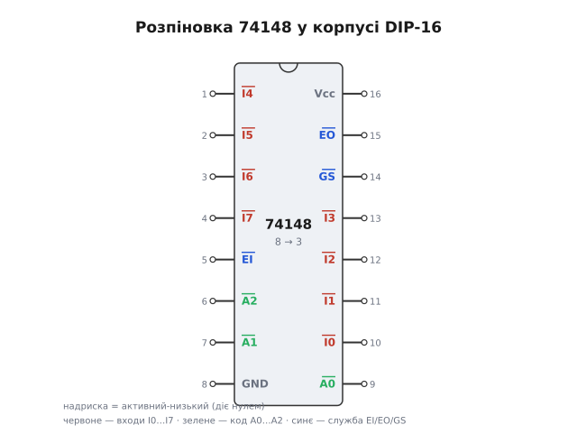
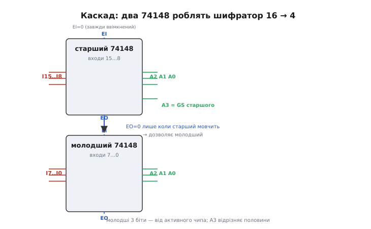

# 📋 74148 — пріоритетний шифратор: розпіновка, таблиця істинності, підключення

Пріоритетну логіку шифратора — елементи АБО плюс обв'язка «кожен вхід озирається на старших за себе» — давно відлили в готову мікросхему. Найвідоміша з них — **74148**, шифратор 8→3 із родини цифрових мікросхем [серії 74](topic:hw-digital/logic-74). Це той самий пріоритетний шифратор, тільки не намальований на схемі, а запакований у корпус на шістнадцять ніжок: вкидаєш вісім ліній запиту — забираєш трибітний номер найстаршої активної плюс прапорець «є взагалі що кодувати». Тут ми розберемо саме цей клас чипа: як він влаштований усередині, як читати його ніжки, як його підключити, як прочитати перший байт із нього — і де він підкладає новачкові дві однакові пастки, бо думає «навпаки».

Одразу застереження про назву. «74148» — не один конкретний товар, а **ціле сімейство** сумісних за виводами й логікою чипів від різних виробників і в різних технологіях: біполярні (звичайні TTL і швидкі), маловживні енергоощадні, сучасні КМОН. Літери-приставки (на кшталт LS, HC, F, ALS) міняють швидкодію, живлення й вхідні пороги, але **розпіновка, логіка й таблиця істинності — ті самі**. Тому ми говоримо про клас «74148» узагальнено; коли доходить до конкретної плати, точні числа (затримка, струм, діапазон напруг) береш із паспорта саме тієї приставки, яка лежить у тебе в руці.

## Що це за пристрій

74148 — **комбінаційний пріоритетний шифратор**: вісім входів запиту, три виходи двійкового коду, один вихід-прапорець «дійсно» і дві службові ніжки для складання чипів у каскад. Жодної пам'яті всередині немає — виходи в кожну мить є чистою функцією входів (це [комбінаційна схема](topic:hw-digital/combinational-circuits), не автомат зі станом). Подав вісім рівнів — миттєво отримав код; прибрав — код зник. Затримка від зміни входу до усталеного виходу вимірюється одиницями-десятками наносекунд залежно від технології, і це єдине, що заважає назвати перетворення «миттєвим».

Функція чипа рівно та, що ми виводили в основній статті. Серед активних входів перемагає **найстарший за номером**, і його номер з'являється на трьох вихідних лініях. Якщо активних кілька — молодші мовчазно програють; якщо жодного — окремий прапорець сигналить «порожньо», і код на виході тоді нічого не означає. Уся цінність готового чипа в тому, що ця пріоритетна логіка вже зведена в один корпус разом із обв'язкою для каскадування, тож із двох таких корпусів збираєш шифратор на шістнадцять входів, не докуповуючи жодного вентиля.

> 🔧 **Навіщо це.** У 1970-х і 1980-х, до появи мікроконтролерів із вбудованим контролером переривань, 74148 був **стандартним способом** зробити систему пріоритетів переривань на розсипу: вісім ліній запиту від периферії заходять у чип, трибітний код найважливішого йде на шину або в таблицю векторів, прапорець «дійсно» будить процесор. Сьогодні цю роль з'їла логіка всередині мікроконтролера, але сам чип живий: він і досі найдешевший спосіб згорнути «одне гаряче з восьми» у число там, де тягти окрему лінію від кожного джерела дорого — у клавіатурах, панелях кнопок, сканерах, найпростіших контролерах шини.

## Блок-схема: що всередині корпусу

Уявімо чип прозорим і подивимось, з яких вузлів він складений — не на рівні кожного транзистора, а на рівні функційних блоків, бо саме так його зручно тримати в голові.

Серце — та сама **пріоритетна мережа**: вісім вхідних ліній заходять у гребінку логіки, де кожна лінія «озирається» на всі старші за себе. Лінія бере участь у формуванні коду лише тоді, коли вона активна **і** всі старші за неї мовчать. Ця мережа має два завдання одразу: вибрати переможця (найстаршу активну) і виставити на трьох виходах його номер. Виходи ми звемо A2 A1 A0, де A2 — старший біт.

До пріоритетної мережі підвішений **вузол дозволу**. Він дивиться на ніжку EI (*enable input* — «дозвіл входу») і працює як головний рубильник: поки EI не активний, увесь чип «сплить» — усі виходи стоять у пасивному стані, і жоден вхід нічого не значить. Тільки коли EI дозволяє, мережа взагалі починає слухати входи. Ця ніжка — не примха, вона і є ключ до каскадування: нею старший чип уміє замкнути рота молодшому.

Ще два вузли — **логіка ознак**. Перший формує прапорець GS (*group select* — «груповий вибір», його ж часто звуть *valid*, «дійсно»): він спрацьовує, коли чип дозволений і активний бодай один вхід. Другий формує EO (*enable output* — «дозвіл виходу»): він спрацьовує, коли чип дозволений, але **жоден** вхід не активний. GS каже «я знайшов переможця, код на виході справжній», EO каже «мені нема кого кодувати, передаю чергу далі». Ці два прапорці — дзеркальні одна одній ознаки, і саме їхнє протиставлення робить чип придатним для стосу з кількох корпусів.


*Розпіновка корпусу DIP-16. Ніжки з надрискою — активні-низькі: діють нулем, а не одиницею. Червоні — вісім входів запиту I0…I7, зелені — трибітний код A2 A1 A0, сині — службові EI (дозвіл входу), EO (дозвіл виходу), GS (груповий вибір). Живлення Vcc і земля GND — сірі, у протилежних кутах, як майже завжди в цій родині.*

## Активний-низький: чому чип думає «навпаки»

Ось перша й найпідступніша риса цього класу, об яку спотикається кожен, хто підходить до нього з інтуїцією «активне = одиниця». У 74148 **і входи, і виходи, і всі три службові ніжки — активні-низькі** (англ. *active-low* — «активний у нулі»). Це означає: щоб «натиснути» вхід номер 5, ти подаєш на нього **нуль**, а не одиницю; коли на виході «код 5», там стоять не рівні числа 5, а **інверсія** цих рівнів.

Чому так зроблено — не примха дизайнера, а спадок технології. Ранні біполярні вентилі надійніше й швидше **стягують** лінію в нуль, ніж підтягують у одиницю; вхід із внутрішнім підтягуванням угору природно спокоїться в одиниці, а зовнішній сигнал його «садить» у нуль. Тому в родині 74 безліч керувальних ніжок (дозволи, скиди, вибори чипа) історично зроблені активними-низькими — так вони поєднуються з іншою логікою без зайвих інверторів. 74148 просто послідовний у цьому до кінця: інверсні не лише керувальні ніжки, а й дані.

Практичний наслідок один, але його треба закарбувати. Спокій лінії — це одиниця; подія — нуль. Вісім входів у спокої тримають 11111111, і чип бачить «жодного запиту». Натиснув вхід 5 — на ньому з'явився нуль, решта лишились в одиницях: 11011111. А на виході код теж інверсний: справжньому номеру 5 (двійкове 101) відповідають рівні 010 на ніжках A2 A1 A0. Щоб дістати число, яким можна користуватися, ці три біти доводиться **перевернути** — або в наступній логіці, або одним рядком у прошивці. Сама пріоритетна суть від інверсії не міняється ні на йоту: перемагає той самий найстарший активний вхід. Міняється лише те, якими рівнями це записано на ніжках.

## Розпіновка й підключення

Корпус — класичний DIP на шістнадцять ніжок (буває й планарний для поверхневого монтажу, але нумерація логічно та сама). Розкладка ніжок стандартна для всього класу:

```
ніжка  сигнал   роль
  1     I4       вхід запиту 4        (активний-низький)
  2     I5       вхід запиту 5
  3     I6       вхід запиту 6
  4     I7       вхід запиту 7        (найвищий пріоритет)
  5     EI       дозвіл входу         (0 = чип працює)
  6     A2       старший біт коду     (інверсний)
  7     A1       середній біт коду
  8     GND      земля
  9     A0       молодший біт коду
 10     I0       вхід запиту 0        (найнижчий пріоритет)
 11     I1       вхід запиту 1
 12     I2       вхід запиту 2
 13     I3       вхід запиту 3
 14     GS       груповий вибір       (0 = є дійсний запит)
 15     EO       дозвіл виходу        (0 = дозволений, але порожній)
 16     Vcc      живлення             (типово +5 В)
```

Мінімальне робоче підключення — це:

**Живлення.** Vcc на ніжку 16, земля на ніжку 8. Обов'язково блокувальний конденсатор (англ. *decoupling capacitor*) близько до ніжок живлення — типово 100 нФ між Vcc і GND, притиснутий до корпусу. Без нього швидкі перемикання восьми входів просаджують живлення голкою, і чип видає збої, яких потім не знайдеш осцилографом. Це правило для всієї родини 74, не лише для шифратора.

**Входи.** Вісім ліній запиту на ніжки I0…I7. Тут ключове правило активно-низької логіки: **жоден вхід не можна лишати висіти в повітрі**. Непідключений TTL-вхід поводиться як плаваючий і читається то нулем, то одиницею від наведень — а для нашого чипа випадковий нуль означає фантомний запит. Тому всі невживані входи **підтягують до одиниці** (до Vcc через резистор порядку 1…10 кОм, або й прямо, якщо паспорт дозволяє). Кнопку чи давач вішають так, щоб у спокої на вході була одиниця, а подія садила його в нуль — тобто кнопка замикає вхід на землю, а підтяжка тримає одиницю, поки її не натиснуто.

**Дозвіл.** Ніжку EI (5) треба **притиснути в нуль**, інакше чип спить і всі виходи стоять пасивні. Для одиночного чипа EI просто садять на землю назавжди — «завжди ввімкнений». У каскаді EI старшого так само на землі, а EI кожного молодшого приходить від EO старшого сусіда (про це нижче).

**Виходи.** Три біти коду A2 A1 A0 (ніжки 6, 7, 9) і два прапорці GS (14), EO (15) — туди, куди треба: на шину, у наступну логіку, на світлодіоди для наочності. Пам'ятай про інверсію коду.

## Перший байт: читаємо таблицю істинності

Найкращий спосіб відчути чип — прогнати кілька станів і подивитись, що на виході. Складемо коротку таблицю істинності. Домовимось про запис: `H` — висока напруга (одиниця, ≈ Vcc), `L` — низька (нуль, ≈ земля), `×` — «байдуже». Виходи читаємо просто як рівні на ніжках, ще **не перевертаючи** їх подумки — так видно, що чип насправді виставляє.

```
EI  I7 I6 I5 I4 I3 I2 I1 I0 │ A2 A1 A0 │ GS EO │ що означає
──────────────────────────── │ ──────── │ ───── │ ───────────────────────
 H   ×  ×  ×  ×  ×  ×  ×  ×  │  H  H  H │  H  H │ чип вимкнений (EI=H): усе пасивне
 L   H  H  H  H  H  H  H  H  │  H  H  H │  H  L │ дозволений, та порожньо → EO=L
 L   L  ×  ×  ×  ×  ×  ×  ×  │  L  L  L │  L  H │ активний I7 (найстарший) → код 7
 L   H  L  ×  ×  ×  ×  ×  ×  │  L  L  H │  L  H │ активний I6, I7 мовчить → код 6
 L   H  H  H  H  H  H  H  L  │  H  H  H │  L  H │ активний лише I0 → код 0, але GS=L
 L   H  H  H  L  ×  L  ×  ×  │  L  H  H │  L  H │ активні I4 та молодші → виграє I4 → код 4
```

Прочитаємо рядки, бо кожен несе окрему думку.

**Рядок 1: чип спить.** EI = H — рубильник розімкнений. Усі виходи в пасиві (H), обидва прапорці H. Хоч би що робилося на входах — чипа немає в грі. Це стан «мене вимкнули».

**Рядок 2: дозволений, але тиша.** EI = L, всі входи H (у активно-низькій логіці це «жодного запиту»). Код стоїть у пасиві (HHH), GS = H («дійсного немає»), а от EO **упав у L**. Ось ключова ознака: «я ввімкнений, я слухаю, і мені нема кого кодувати — черга твоя». Саме цей нуль на EO і поїде далі в каскаді.

**Рядок 3: працює пріоритет.** EI = L, активний I7 (він у L). I7 — найстарший, тож хай там що на решті входів (× — байдуже), виграє він. На виході рівні LLL. Перевертаємо подумки — виходить 111 = **7**. GS = L («код справжній»), EO = H («я зайнятий, далі нічого не передаю»). Ось воно, пріоритетне кодування в дії.

**Рядок 4: наступний за старшинством.** I7 = H (мовчить), I6 = L (активний). Виграє I6. Рівні LLH, перевертаємо → 110 = **6**. Усе логічно спускається на щабель.

**Рядок 5: найважливіший для розуміння.** Активний лише I0 — найслабший. Рівні на коді HHH, перевертаємо → 000 = **0**. Але зверни увагу: ці самі рівні HHH стояли й у рядку 2, коли не було **жодного** запиту! Код 0 і «порожньо» на трьох бітах виглядають однаково. Розрізняє їх **тільки GS**: тут GS = L («є дійсний, це чесний нуль»), а в рядку 2 GS = H («порожньо, код ігноруй»). Без прапорця нуль був би сліпою зоною — саме тому GS не розкіш, а необхідність.

**Рядок 6: суперечка розв'язана.** Активні I4 і хтось із молодших (I2). Пріоритет віддає перемогу старшому — I4. Рівні LHH → 011 = **4**. Молодший I2 навіть не впливає: він затулений. Порівняй із голим шифратором з основної статті, який на двох активних видав би фантомну суму — тут суперечка вирішена чесно.

Зведемо два прапорці в одну думку, бо новачки їх плутають. **GS = L** ⟺ «є переможець, читай код». **EO = L** ⟺ «я ввімкнений, але порожній». Вони ніколи не бувають у нулі одночасно: або чип когось кодує (GS=L, EO=H), або мовчить (GS=H, EO=L), або взагалі вимкнений (обидва H). Ця взаємовиключність — не збіг, вона навмисна, і на ній тримається весь каскад.

## Складання в каскад: 16→4 без зайвих вентилів

Тепер найкрасивіше. Один чип кодує вісім ліній. А що, коли треба шістнадцять — чи тридцять дві? Наївно було б докупити купу логіки, щоб «звести» коди двох чипів. Але 74148 зроблений так, що два корпуси стикуються **майже без обв'язки**, і весь фокус — у парі ніжок EI та EO.

Ідея тримається на єдиному спостереженні з таблиці: EO старшого чипа падає в нуль **тільки тоді, коли старший чип порожній**. А нуль на EO — це якраз «дозвіл» для сусіда. Тож заводимо **EO старшого чипа у EI молодшого**. Виходить залізне правило: поки старший бачить хоч один свій запит, його EO стоїть у одиниці — і молодший **замкнений** (його EI = H, він спить, усі його виходи пасивні). Щойно старший спорожнів — його EO падає в нуль, молодший прокидається й починає слухати свою вісімку. Пріоритет тече згори вниз сам собою, без жодного арбітра.


*Два корпуси в стосі. Старший бере входи 15…8, молодший — 7…0. EI старшого притиснутий у нуль (завжди ввімкнений). EO старшого йде в EI молодшого: поки старший зайнятий, він гасить молодший; спорожнів — дозволяє. Молодші три біти коду беруться від того чипа, що зараз активний (їхні виходи об'єднують), а четвертий, старший біт A3 — це прапорець GS старшого: він каже, у якій половині шістнадцяти сидить переможець.*

Лишається зібрати чотирибітний код. Молодші три біти (A2 A1 A0) обох чипів **об'єднують** — це безпечно, бо неактивний чип тримає свої виходи в пасиві й не заважає активному (у реальному підключенні тут або чипи з відкритим стоком, або проста логіка АБО, залежно від технології; суть — молодша трійка йде від того, хто зараз кодує). А четвертий, найстарший біт A3 бере **прапорець GS старшого чипа**: якщо переможець сидить у старшій половині (входи 15…8), GS старшого активний — і A3 каже «верхня половина»; якщо переможець у молодшій — старший порожній, A3 показує «нижня». Разом чотири біти однозначно кодують будь-яку з шістнадцяти ліній, і найстарша активна перемагає в усьому діапазоні.

Ту саму гру можна продовжити: чотири корпуси через ланцюжок EO→EI дають шифратор на тридцять дві лінії з п'ятибітним кодом. Пріоритет так само тече згори вниз крізь увесь стос. Це і є та ідея — пріоритет, що каскадується, — яка потім лягла в основу апаратних контролерів переривань: там усередині живе рівно такий стос пріоритетної логіки.

## Типові граблі

Клас 74148 підступний саме тим, що працює «навпаки» до наївної інтуїції. Ось де найчастіше набивають ґулі.

**Плутанина полярності — головна помилка.** Дев'ять із десяти перших невдач — це «подав одиницю, щоб натиснути вхід». Не працює: активне тут — нуль. Так само на виході: побачив LLL і вирішив «код нуль», а насправді це сім. Лікується одним: перед роботою з чипом уголос кажеш собі «спокій — одиниця, подія — нуль, код інверсний» і перевіряєш кожну ніжку через цю призму.

**Висячі входи.** Невживаний вхід не можна лишати в повітрі. Плаваючий TTL-вхід ловить наводки й час від часу читається нулем — а нуль тут це запит. Симптом: чип «сам собою» іноді видає фантомний код, найчастіше саме той, чий вхід забули підтягнути. Усі невживані входи — підтяжкою в одиницю до Vcc.

**Забутий EI.** Лишив ніжку дозволу висіти — і чип або спить (якщо наводка тримає її в одиниці), або працює через раз. Для одиночного чипа EI **завжди** садять на землю. Симптом «нічого не кодує, виходи мертві в одиницях» — перша підозра саме EI.

**Ігнорування GS.** Найпідступніша діра: код 000 від входу 0 і «порожньо» на трьох бітах виглядають однаково. Хто читає лише три біти коду й не дивиться на GS — той плутає «натиснуто нуль» із «не натиснуто нічого». Правило: код чипа дійсний **тільки** коли GS активний; побачив GS у пасиві — код викидай, там сміття.

**Переплутані EO і GS у каскаді.** Обидва прапорці активні-низькі, обидва «щось сигналять», і початківець заводить у EI сусіда не той. Заведеш GS замість EO — каскад ламається: молодший вмикатиметься тоді, коли старший **зайнятий**, а не коли він порожній, і пріоритет перевернеться. Запам'ятай різницю: у сусіда йде **EO** («я порожній, бери чергу»), а GS — це готова ознака «дійсно» і, у каскаді, старший біт коду.

**Дренаж і об'єднання виходів.** У каскаді молодші біти двох чипів об'єднують. Робити це «в лоб», якщо виходи чипа двотактні (активно тягнуть і вгору, і вниз), не можна — два активні виходи, що тягнуть у різні боки, борються й палять струм. Тут потрібна або відповідна технологія виходу, або проста логіка-змішувач. Для одиночного чипа проблеми немає — вона з'являється рівно тоді, коли з'єднуєш виходи кількох корпусів.
