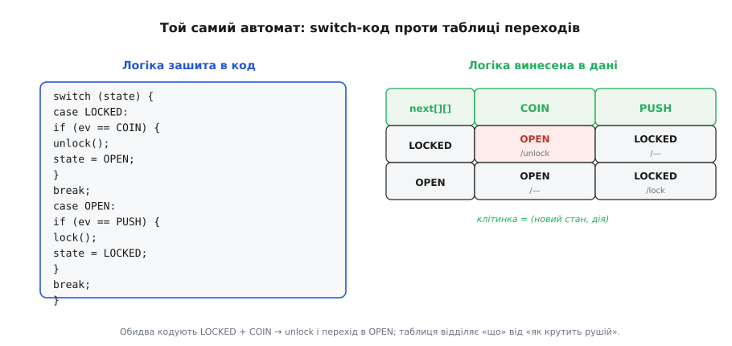
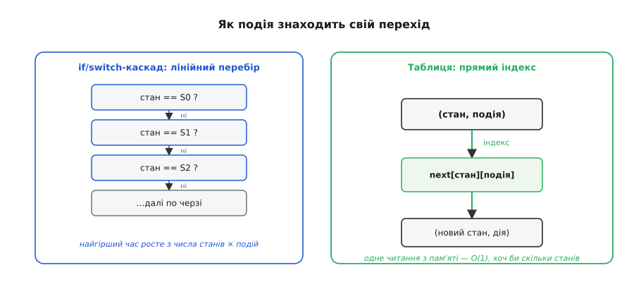
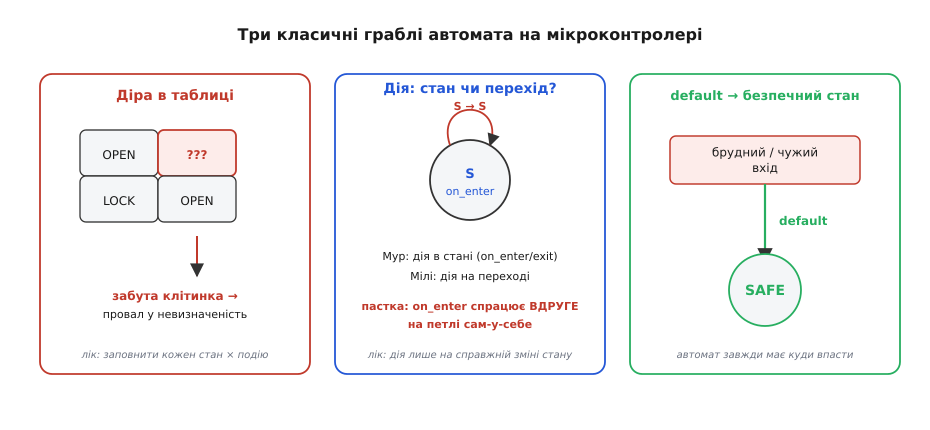

# ⚙️ Автомат у коді: switch проти таблиці переходів

> Як [скінченний автомат](root:hw-digital/finite-state-machines) лягає в код. У залізі він — тригери, що тримають стан, плюс логіка переходів. Той самий автомат щодня живе й **у програмі** на мікроконтролері — кнопкою з антибрязкотом, розбором протоколу, перемиканням режимів. І тут одразу постає вибір, як його **записати**: розгалуженням `switch` чи **таблицею переходів** як даними. Різниця не косметична — вона визначає, наскільки автомат легко розширювати й наскільки важко в ньому помилитися.

## Задача

Маємо [скінченний автомат](root:hw-digital/finite-state-machines): скінченна множина **станів**, потік **подій** на вході, і правило — у якому стані яка подія куди **переводить** і яку **дію** при цьому виконати. Як приклад візьмемо канонічний навчальний автомат — турнікет: стани `LOCKED`/`OPEN`, події `COIN` (жетон) і `PUSH` (штовхнули). Питання вставки вузьке й практичне: яким **кодом** це втілити на МК, щоб автомат було легко читати, безпечно розширювати й важко «зламати» забутим переходом.

## Ідея


*Ліворуч — логіка автомата «зашита» в код: `switch(state)`, усередині `if` по події, дія й присвоєння нового стану. Праворуч — та сама логіка винесена в **дані**: двовимірна таблиця `next[state][event]`, де клітинка задає (новий стан, дію). Обидва описують той самий перехід (`LOCKED` + `COIN` → `unlock` і в `OPEN`), але таблиця відділяє «що робить автомат» від «як його крутить рушій».*

Перший підхід — **`switch`**: зовнішній `switch` по стану, всередині розгалуження по події, у гілці — виклик дії й присвоєння нового стану. Це найочевидніший спосіб, і для трьох-чотирьох станів він цілком читабельний. Вада в тому, що **логіка автомата розмазана по коду**: щоб додати стан, треба вписати нову гілку, не забувши в **кожній** іншій гілці передбачити переходи до неї й з неї. Зі зростанням числа станів `switch` розповзається, а ймовірність забути комбінацію зростає квадратично.

Другий підхід — **таблиця переходів**: ту саму інформацію кладуть у **дані** — двовимірний масив `next[state][event]`, де кожна клітинка зберігає пару «(новий стан, дія)». Тоді код, що крутить автомат (**рушій**, *engine*), стає крихітним і **незмінним**: знайшов клітинку — виконав дію — оновив стан. Уся поведінка живе в таблиці, тож додати стан — це **дописати рядок**, а не правити логіку. Це прямий нащадок таблиці станів (*flow table*), яку ще в 1950-х запровадив Девід Гаффмен: стан — рядок, подія — стовпець.


*Як подія знаходить свій перехід. У `switch`/`if`-каскаді (ліворуч) виконавець перебирає гілки згори вниз — у найгіршому разі час росте з числа станів, помножених на події. У таблиці (праворуч) пара (стан, подія) — це просто **індекс**: одне читання з пам'яті, час сталий незалежно від розміру автомата.*

Є між ними й різниця у **швидкості пошуку** переходу, хоч на малих автоматах вона й непомітна. `switch`, що розгортається в ланцюг порівнянь, у найгіршому разі перебирає гілки по черзі. Таблиця ж адресується **індексом**: `next[state][event]` — це одне звертання до пам'яті, O(1) незалежно від числа станів. (Компілятор іноді й сам перетворює щільний `switch` на стрибок за таблицею, тож на практиці розрив менший, ніж здається, — але концептуально таблиця завжди стала.)

## Рушій у коді

Рушій табличного автомата вкладається в кілька рядків — і саме ця стислість і є його головна перевага. Таблицю кладемо в `const` (тобто у flash), а зберігається лише змінна `state`:

:::tabs
```cpp
#include <stdint.h>

typedef enum { LOCKED, OPEN, STATE_COUNT } state_t;
typedef enum { COIN, PUSH, EVENT_COUNT } event_t;

typedef void (*action_fn)(void);   /* дія переходу (модель Мілі) */

typedef struct {
    state_t   next;                /* новий стан */
    action_fn action;             /* що зробити на переході; NULL — нічого */
} cell_t;

/* уся поведінка — тут, як дані; рядок = стан, стовпець = подія */
static const cell_t table[STATE_COUNT][EVENT_COUNT] = {
    /*           COIN                 PUSH               */
    [LOCKED] = { { OPEN,   unlock }, { LOCKED, NULL } },
    [OPEN]   = { { OPEN,   NULL   }, { LOCKED, lock } },
};

static state_t state = LOCKED;

void fsm_dispatch(event_t ev) {
    if (ev >= EVENT_COUNT) {            /* чужа / невалідна подія */
        state = LOCKED;                /* failsafe: безпечний стан турнікета — замкнено */
        return;
    }
    cell_t c = table[state][ev];        /* один індекс — O(1) */
    if (c.action) c.action();          /* дія НА переході — модель Мілі */
    if (c.next != state) {             /* перехід СПРАВДІ змінює стан? */
        on_exit(state);                /* дії «на виході» зі старого… */
        on_enter(c.next);              /* …і «на вході» в новий — модель Мура */
    }
    state = c.next;
}
```
```python
from enum import IntEnum

class State(IntEnum):
    LOCKED = 0
    OPEN   = 1

class Event(IntEnum):
    COIN = 0
    PUSH = 1

# клітинка: (новий стан, дія переходу — модель Мілі; None — нічого)
# уся поведінка — тут, як дані; рядок = стан, стовпець = подія
table = {
    #                COIN                        PUSH
    State.LOCKED: {Event.COIN: (State.OPEN,   unlock), Event.PUSH: (State.LOCKED, None)},
    State.OPEN:   {Event.COIN: (State.OPEN,   None),   Event.PUSH: (State.LOCKED, lock)},
}

state = State.LOCKED

def fsm_dispatch(ev):
    global state
    if ev not in table[state]:         # чужа / невалідна подія
        state = State.LOCKED           # failsafe: безпечний стан турнікета — замкнено
        return
    nxt, action = table[state][ev]     # один індекс — O(1)
    if action:                         # дія НА переході — модель Мілі
        action()
    if nxt != state:                   # перехід СПРАВДІ змінює стан?
        on_exit(state)                 # дії «на виході» зі старого…
        on_enter(nxt)                  # …і «на вході» в новий — модель Мура
    state = nxt
```
:::

Зверніть увагу на дві деталі. Виклик `c.action()` **на переході** — це модель **Мілі** (дія прив'язана до стрілки); пара `on_enter`/`on_exit`, прив'язана до стану, — це модель **Мура**. Реальний код часто змішує обидві, і це нормально, доки ви свідомо вирішили, **що** до чого прив'язуєте.

Турнікет тут — лише наочна мініатюра; справжню силу таблиця показує на чомусь більшому. Візьміть розбір кадру по [послідовній лінії](root:hw-digital/finite-state-machines): стани `IDLE → START → DATA → STOP`, події «надійшов байт», «тайм-аут», «помилка парності». У `switch`-варіанті кожен новий стан протоколу змушує обійти **всі** наявні гілки й допильнувати, куди з них тепер можна потрапити; у табличному — ви дописуєте один рядок `[STATE] = { … }` і одразу бачите по сітці, чи заповнені всі його клітинки. Що складніший протокол, то більший цей розрив: рушій не росте взагалі, росте лише таблиця-дані. Саме тому драйвери шин (UART, I²C, USB) усередині майже завжди табличні автомати, а не дерево `if`-ів — інакше додати один стан означало б ризикнути зламати десять інших.

Ще одна практична дрібниця — **дія за замовчуванням у клітинці**. Часто більшість пар (стан, подія) означають «лишитися на місці, нічого не робити»: таку клітинку заповнюють `{ ТОЙ_САМИЙ_СТАН, NULL }`, і вона перестає бути «дірою». Так таблиця водночас і документує поведінку (видно, де навмисно нічого не стається), і захищає від невизначеності — порожніх клітинок не лишається за побудовою.

> 🔧 **Навіщо це.** Тільки-но автомат на МК переростає три-чотири стани — кнопка з режимами, розбір протоколу, машина зарядки, — пишіть його **таблицею в `const`**, а не каскадом `switch`. Виграш не в швидкості (її на таких розмірах однаково вистачає), а в тому, що **повноту видно оком**: сітка «стан × подія» одразу показує, яку клітинку ви забули, тоді як забутий `case` мовчки провалюється в `default`. Рушій лишається той самий на будь-який автомат — пишеться раз і не чіпається.

## Складність і пастки на МК


*Три класичні граблі. Зліва: **діра** в таблиці — забута клітинка, і автомат «провалюється» в невизначеність. У центрі: **де викликати дію** — у стані (Мур) чи на переході (Мілі); дія «на вході» зрадливо спрацьовує вдруге, якщо стан переходить сам у себе. Справа: **default → безпечний стан** — на «брудний» вхід автомат мусить мати куди впасти.*

Складність рушія — **O(1)** на подію (одне індексування) і **O(станів × подій)** пам'яті під таблицю; для типового МК-автомата на одиниці-десятки станів це копійки. Небезпеки не в швидкості, а в **повноті й коректності**, і всі вони добре відомі:

- **Діри в таблиці — найгірша пастка.** Якщо для пари (стан, подія) клітинку забули, автомат потрапляє в невизначеність — «провалюється» в чужий стан або падає. Тому таблицю заповнюють **повністю**: кожен стан × кожна подія. Невідому чи неможливу подію в стані не лишають порожньою, а явно скеровують — лишитися на місці або піти в безпечний стан із записом у лог.
- **`default` має вести в безпеку.** У залізі вхід буває «брудним»: шум, збій, чужа чи невчасна подія. Автомат мусить **завжди** мати визначений `default` — куди впасти при будь-якій несподіванці (часто це стан `SAFE`/`ERROR` чи `IDLE`). Автомат, що «зависає» на невідомій події, на МК неприпустимий.
- **Дія в стані vs на переході (Мур vs Мілі).** Якщо чіпляти дію «на вході в стан» (`on_enter`), а перехід веде зі стану **в нього ж**, дія спрацює **повторно** — класичне джерело подвійних `unlock()`. Рецепт: оберіть **одну** модель і кличте `on_enter`/`on_exit` лише на **справжній** зміні стану (`c.next != state`), як у коді вище.
- **Хто постачає події — окрема відповідальність.** Автомат **споживає** події, але не породжує їх. Натиск кнопки спершу очищають від брязкоту, зовнішній сигнал — [синхронізують](root:hw-digital/metastability-timing), байт приходить з переривання. Якщо в потік подій пролізе «брудна» подія, жодна модель автомата вас не врятує — сміття на вході дасть сміття на виході.
- **Таблиця в незмінній пам'яті.** На МК таблицю переходів зазвичай кладуть у `const`/flash: і місце в ОЗП економиться, і логіку автомата неможливо випадково зіпсувати записом. Збереженим лишається тільки `state` — одна змінна, рівно той самий «банк тригерів», що [тримає стан у залізі](root:hw-digital/state-memory), тільки програмний.

Висновок: `switch` — це автомат, **записаний як код**, і він добрий, поки станів мало; таблиця переходів — це автомат, **записаний як дані**, і він виграє, щойно автомат росте: рушій лишається крихітним і незмінним, повноту легко перевірити оком по сітці, а нову поведінку додають рядком таблиці. Обидва — це той самий [скінченний автомат](root:hw-digital/finite-state-machines), лише перенесений із тригерів у пам'ять програми; і вся інженерія тут — не в синтаксисі, а в тому, щоб **жодна** клітинка не лишилася незаданою.
