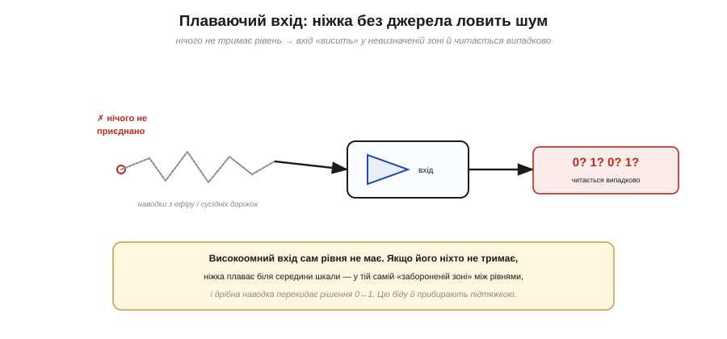
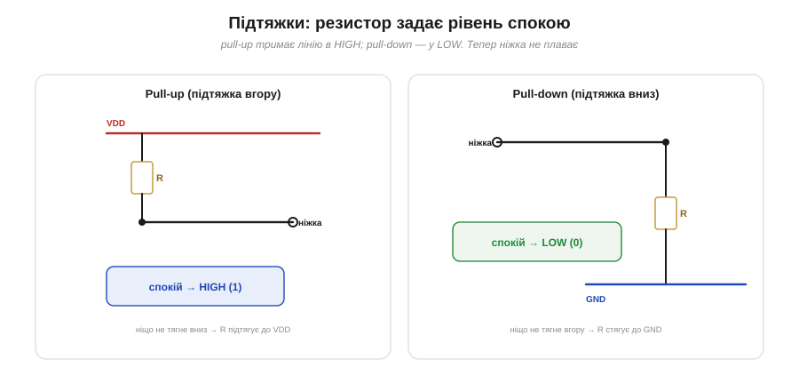
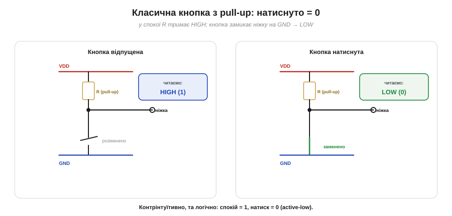
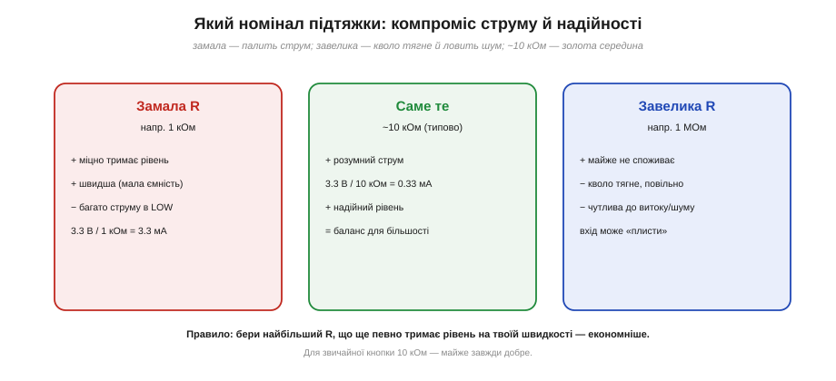
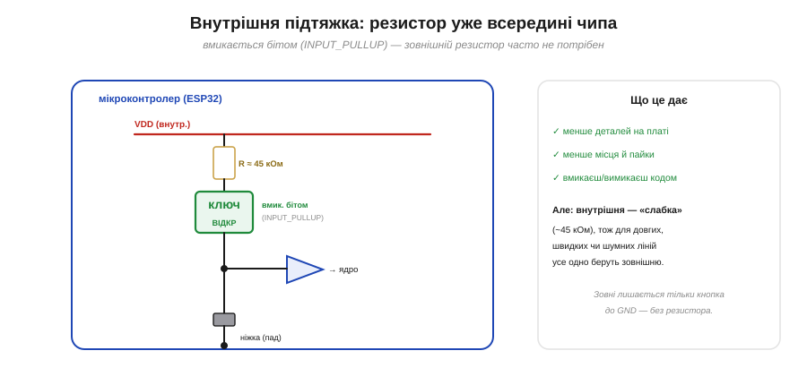
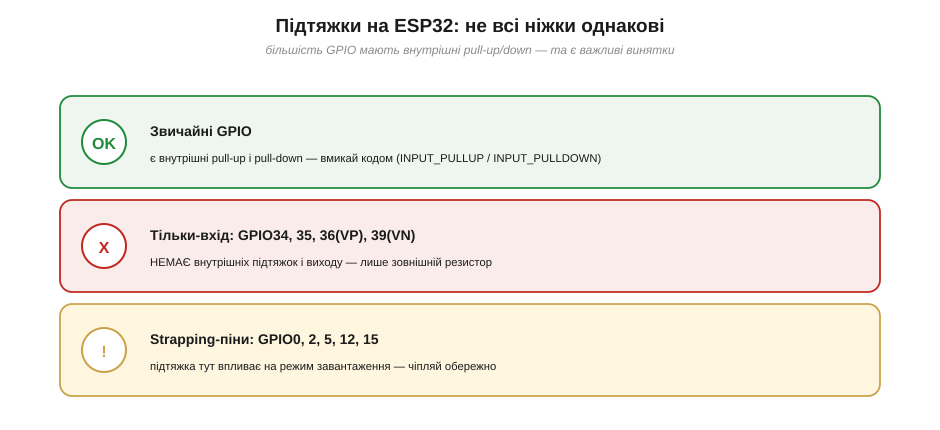

# Плаваючий пін і підтяжки

Цифровий вхід — це високоомний «вимірювач», що зчитує напругу на лінії; а **що** він прочитає, коли до ніжки **взагалі нічого** не приєднано? Інтуїція підказує «нуль» — але це хибно. Нуль — це теж певна напруга (близько GND), яку хтось мусить **тримати**. Якщо ж лінію не тримає ніхто, на ній немає **жодного** означеного рівня: ніжка «плаває». І плаває вона найгіршим можливим чином — десь посеред шкали, у тій самій [забороненій зоні між рівнями](topic:hw-digital/logic-thresholds), ловлячи кожну наводку. Ця тема — про те, чому так стається і як це лікують **підтяжками** (pull-up / pull-down): найдешевшими й найчастішими резисторами на будь-якій платі.

### Що читає вхід, до якого нічого не приєднано

Високоомний вхід майже не бере струму — це його чеснота (не навантажує джерело), але водночас його ахіллесова п'ята. Бо коли джерела **нема**, ніжці нема звідки взяти рівень. Вона перетворюється на крихітну **антену**: довгий металевий провідник, що вловлює наводки від сусідніх доріжок, від мережі 50 Гц, від радіоефіру, від руху вашої руки поряд. Ці наводки гойдають напругу на ніжці туди-сюди довкола середини шкали — а саме там, у невизначеній зоні між VIL і VIH, вхід «не певен». Результат — `digitalRead` повертає то 0, то 1, без жодної закономірності.


*Якщо до високоомного входу нічого не приєднано, ніжка «висить» антеною й ловить наводки. Напруга плаває біля середини шкали — у забороненій зоні між рівнями — і вхід читається випадково: 0, 1, 0, 1… Жодного джерела рівня немає, тож і рівня немає.*

Гірше того, шкода не лише в «випадкових» читаннях. Коли напруга надовго застрягає **посеред** діапазону, всередині вхідного буфера обидва транзистори [комплементарної пари](topic:hw-digital/push-pull-output) виявляються **прочиненими** одночасно — і крізь буфер тече наскрізний струм. Плаваючий вхід тому ще й **марно гріє** чіп і піднімає споживання, що особливо болить у батарейних пристроях. Підсумок простий і категоричний: **невикористаний цифровий вхід не можна лишати плаваючим**. Йому треба дати означений рівень спокою — і саме це робить підтяжка.

Цей ефект легко відчути на досліді: лиши вхід ESP32 ні до чого не приєднаним і читай `digitalRead` у циклі — побачиш, як значення стрибає саме тоді, коли підносиш палець чи рухаєш дріт поряд. Ніжка буквально працює радіоприймачем. У великій схемі таке «привидне» читання здатне зненацька «натиснути» неіснуючу кнопку чи збити логіку, а знайти причину важко: вона невидима й випадкова. Тому плаваючих входів просто не лишають — це гігієна, а не перестраховка.

### Підтяжка: резистор, що задає рівень спокою

**Підтяжка** — це резистор, що **слабко** прив'язує лінію до означеного рівня, поки її ніхто не тримає активно. Є два дзеркальні варіанти:

- **Pull-up** (підтяжка вгору) — резистор від лінії до **VDD**. У спокої він підтягує ніжку до VDD → стан спокою **HIGH (1)**.
- **Pull-down** (підтяжка вниз) — резистор від лінії до **GND**. У спокої він стягує ніжку до GND → стан спокою **LOW (0)**.


*Дві дзеркальні підтяжки. Pull-up (резистор до VDD) задає спокій HIGH; pull-down (резистор до GND) — спокій LOW. Резистор «слабкий», тож будь-яке справжнє джерело легко його перемагає — а коли джерела нема, підтяжка втримує означений рівень.*

Ключове слово — **слабко**. Це той самий принцип, що в [open-drain-виходах](topic:hw-digital/open-drain-output): підтяжка тримає рівень лише доти, доки лінію не смикнув хтось **сильніший**. Натиснута кнопка, що замикає ніжку на GND, легко «переборює» pull-up і садить лінію в LOW; відпустиш кнопку — і кволий резистор спокійно повертає HIGH. Підтяжка не бореться з активним сигналом — вона лише заповнює **тишу**, задаючи рівень тоді, коли активного джерела немає. Тому її номінал беруть досить великим (кілоомами), щоб у «робочому» стані вона майже не заважала й не палила струму.

Звідси важливе застереження: на одній лінії має бути **щось одне** — або pull-up, або pull-down, але не обидва водночас. Якщо ненароком увімкнути обидві (скажімо, зовнішній pull-down і внутрішній pull-up разом), вони утворять **дільник напруги** й затягнуть ніжку кудись посередині — рівно в ту [невизначену зону між рівнями](topic:hw-digital/logic-thresholds), від якої ми тікаємо. Підтяжка має тягнути лінію певно в **один** бік; дві протилежні підтяжки нейтралізують одна одну й роблять тільки гірше.

### Класична кнопка: pull-up і логіка «active-low»

Найчастіше підтяжку зустрічають у схемі кнопки. Канонічне ввімкнення таке: **pull-up** тримає ніжку в HIGH, а **кнопка з'єднує ніжку з GND**. Поки кнопку не чіпають, лінію тримає резистор → вхід читає **HIGH (1)**. Натиснули — ніжка замикається на землю → вхід читає **LOW (0)**.


*Кнопка з pull-up у двох станах. Відпущена (ліворуч): резистор тримає HIGH → читаємо 1. Натиснута (праворуч): кнопка замикає ніжку на GND, перемагаючи слабку підтяжку → читаємо 0. Натиск = нуль — це й називають логікою «active-low».*

Новачка це збиває з пантелику: натиснута кнопка дає **нуль**, а не одиницю. Така інверсна логіка зветься **active-low** («активний — низький»), і вона не примха, а давня, добре обґрунтована традиція цифрової схемотехніки: історично «стягнути вниз» було простіше й надійніше, ніж «підняти вгору», тож активним станом зробили саме LOW. Можна, звісно, зробити й навпаки — **pull-down** плюс кнопка до **VDD**: тоді спокій буде LOW, а натиск дасть HIGH (логіка «active-high»). Обидва варіанти робочі; pull-up + active-low просто історично поширеніший, і його ви бачитимете частіше.

А чому взагалі потрібен резистор — чому не з'єднати кнопку просто між ніжкою і GND, без нього? Бо тоді, **поки кнопку відпущено**, ніжка знову лишається ні до чого не приєднаною — і ми повертаємося до плаваючого входу з усіма його випадковими читаннями. Резистор і потрібен саме для того, щоб **стан спокою був означеним**.

> 🔧 **Навіщо це.** Запам'ятайте схему-заготовку: **кнопка → GND, плюс pull-up, у коді чекаємо LOW**. Коли в проєкті кнопка «сама себе натискає» або реагує через раз — найперше перевірте підтяжку: чи вона є, чи правильного боку, чи ввімкнена внутрішня. І не дивуйтеся інверсії: натиснуто — це `0`. У прошивці це часто пишуть явно, як-от `if (digitalRead(PIN) == LOW) { /* натиснуто */ }`, щоб не заплутатися.

### Який номінал брати

Підтяжка завжди компроміс — точно як підтяжка в [open-drain](topic:hw-digital/open-drain-output). Замалий резистор тримає рівень міцно і швидко, але в активному стані (коли лінію тягнуть у протилежний бік) марно палить струм. Завеликий — майже не споживає, зате тягне кволо: на довгій чи швидкій лінії він не встигає «перемогти» паразитну ємність, а ще стає вразливим до струмів витоку й наводок, і вхід знову починає «плисти». Золота середина для звичайних кнопок і повільних ліній — **близько 10 кОм**.


*Компроміс номіналу. Замала R (≈1 кОм) — міцно й швидко, але 3.3 мА струму в активному стані. Завелика R (≈1 МОм) — майже без споживання, та кволо й чутливо до шуму. ~10 кОм — баланс для більшості випадків (0.33 мА).*

Практичне правило формулюють так: бери **найбільший** резистор, що ще певно тримає рівень на твоїй швидкості, — це найощадніше. Для кнопки, яку натискають раз на секунду, і 100 кОм підійде; для швидкої шини беруть одиниці кілоом.

> 🧮 **Звідки саме «10 кОм».** Три тиски — марний струм (знизу) та шум, витік і повільний фронт (згори) — затискають номінал у вузьке вікно. Як вони рахуються й чому ~10 кОм — золота середина: у вставці [Чому підтяжка саме 10 кОм](topic:hw-digital/floating-pullups/math-pullup-value.md).

Чому більший резистор «повільніший», варто зрозуміти точніше. Будь-яка лінія має паразитну **ємність** (сам провідник, вхід мікросхеми, монтаж), і разом із підтяжкою вона утворює RC-ланку: коли активне джерело відпускає лінію, підтяжка заряджає цю ємність не миттєво, а за час близько **τ = R·C**. Для R = 10 кОм і типових ~50 пФ це лише пів мікросекунди, а для R = 1 МОм — уже десятки мікросекунд, протягом яких напруга «повзе» вгору крізь невизначену зону. Ось чому на швидких лініях підтяжку беруть меншою: щоб фронт устигав підстрибувати в HIGH між перемиканнями. Це та сама фізика, що й «слабкий, повільний HIGH» в [open-drain](topic:hw-digital/open-drain-output) — підтяжка скрізь поводиться однаково.

### Внутрішня підтяжка: вона вже в чипі

Резистори-підтяжки потрібні так часто, що виробники **вбудували їх у сам мікроконтролер**. Усередині біля кожної (майже) ніжки сидить підтяжка з вимикачем-транзистором; ви вмикаєте її **бітом у регістрі** — у коді це режим `INPUT_PULLUP` (або `INPUT_PULLDOWN`). Зовнішній резистор тоді не потрібен зовсім: кнопку чіпляють просто між ніжкою і GND, а підтяжку вмикає прошивка.


*Підтяжка вже всередині: резистор (~45 кОм у ESP32) через транзистор-ключ під'єднано до внутрішнього VDD, а ключ вмикає біт `INPUT_PULLUP`. Зовні лишається тільки кнопка до GND — без жодного зовнішнього резистора.*

Зручність очевидна — менше деталей, менше пайки, перемикання прямо з коду. Та є нюанс: внутрішні підтяжки **слабкі**. У ESP32 вони близько **45 кОм** — це чимало, тож для довгих, швидких або шумних ліній внутрішньої може забракнути, і тоді ставлять зовнішню, меншу. Для звичайної кнопки на короткому дроті внутрішньої цілком досить.

Ще дві дрібниці про внутрішні підтяжки варто тримати в голові. По-перше, їхній опір має широкий **розкид** — у даташитах часто дають діапазон, а не точне число, — тож покладатися на конкретні «45 кОм» у розрахунках не варто: це орієнтир, а не константа. По-друге, налаштування підтяжки **скидається при перезавантаженні**: після кожного reset прошивка має знову викликати `pinMode(PIN, INPUT_PULLUP)`, інакше ніжка стартує без неї — класична причина «то працює, то ні» після ввімкнення живлення.

> 🔧 **Навіщо це.** `pinMode(PIN, INPUT_PULLUP)` — ваш найшвидший спосіб прибрати плаваючий вхід без жодного заліза. Призвичайтеся вмикати підтяжку **завжди**, коли налаштовуєте вхід під кнопку: один рядок коду економить резистор і рятує від «привидів» на ніжці. Але якщо лінія довга чи поруч сильні завади — не покладайтеся на кволі 45 кОм, додайте зовнішній резистор на кілька кілоом.

### Застереження ESP32: не всі ніжки однакові

Тут чатує пастка, на якій спотикаються майже всі новачки з ESP32. **Не кожна** ніжка має внутрішню підтяжку.


*Три категорії ніжок ESP32. Звичайні GPIO мають і pull-up, і pull-down. Ніжки «тільки-вхід» GPIO34/35/36/39 не мають **ні** внутрішніх підтяжок, **ні** виходу — лише зовнішній резистор. Strapping-піни (0, 2, 5, 12, 15) при завантаженні читаються як режим, тож підтяжка на них впливає на запуск.*

Ніжки **GPIO34, 35, 36 (VP) і 39 (VN)** — «тільки-вхід»: у них немає ні вихідного каскаду, ні внутрішніх підтяжок. Повісите туди кнопку, розраховуючи на `INPUT_PULLUP`, — і вона не запрацює, бо підтягувати нема чим; для цих ніжок підтяжка **тільки зовнішня**. Окрема обережність — зі **strapping-пінами** (GPIO0, 2, 5, 12, 15): їхній рівень у момент скидання задає **режим завантаження** чипа, тож зайва підтяжка чи притиснута до них кнопка можуть завадити ESP32 нормально стартувати. Це не означає «не використовуй їх» — лише «знай, що там, і чіпляй свідомо».

Практично з усього цього випливає проста звичка: перш ніж обрати ніжку, зазирни в розпіновку плати й переконайся, що вона вміє те, що тобі треба. Для кнопки з внутрішньою підтяжкою бери звичайний GPIO (скажімо, 4, 13, 14, 25, 26, 27), а GPIO34–39 лишай для випадків, де підтяжку даси зовні або вона не потрібна зовсім — як-от аналоговий вхід чи вже готовий цифровий сигнал від іншої мікросхеми. Одна хвилина звірки з розпіновкою економить годину пізнішого «чому воно не реагує».

### Порахуймо: струм підтяжки і кнопка

Відчуймо числами, скільки коштує підтяжка в кнопковій схемі.

**Приклад (струм через кнопку з pull-up).** Кнопка з підтяжкою **R = 10 кОм** до **VDD = 3.3 В**:

```
Кнопка ВІДПУЩЕНА:
   ніжка = HIGH; вхід високоомний, струму майже нема.
   спожив ≈ 0.

Кнопка НАТИСНУТА (ніжка замкнена на GND через кнопку):
   через підтяжку тече  I = VDD / R = 3.3 / 10000 = 0.33 мА
   ніжка сидить на ~0 В = LOW (читаємо 0).

Якщо взяти ВНУТРІШНЮ підтяжку ESP32 (R ≈ 45 кОм):
   I = 3.3 / 45000 ≈ 0.073 мА  — ще ощадніше (бо слабша)

Висновок: струм тече ЛИШЕ поки кнопку натиснуто.
0.33 мА — дрібниця для звичайного пристрою; та якщо кнопку
довго тримають натиснутою в батарейному приладі — беруть
більший R, щоб зменшити цей струм.
```

Числа підтверджують інтуїцію: у спокої кнопкова схема не споживає нічого, а під час натиску струм визначає підтяжка — більший резистор означає менший струм. Тому для рідкісних натисків байдуже, а для довгих утримань в автономних пристроях номінал підбирають ощадніше.

Отже, плаваючий вхід — це ніжка без означеного рівня: вона ловить шум і читається випадково, та ще й марно гріє чіп. Лікують це **підтяжкою** — слабким резистором до VDD (pull-up, спокій HIGH) або до GND (pull-down, спокій LOW); у кнопці це дає логіку active-low «натиснуто = 0». Номінал — компроміс струму й надійності (типово ~10 кОм), а часто й зовсім не потрібен зовні, бо підтяжка вже є **всередині** чипа (`INPUT_PULLUP`, ~45 кОм у ESP32) — з важливим винятком ніжок «тільки-вхід» і strapping-пінів. Та навіть із доброю підтяжкою кнопка приховує ще одну прикрість: механічні контакти, стикаючись, **брязкочуть**, і один натиск ніжка бачить як пачку швидких 0/1. Це **брязкіт** (англ. *bounce* — відскок) і способи його приборкати — окрема тема про [усунення брязкоту контактів](topic:hw-digital/contact-debounce).
