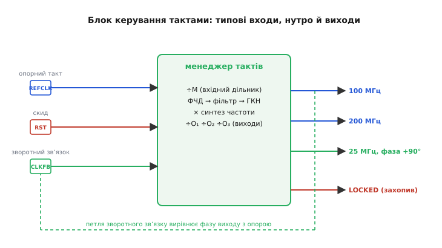
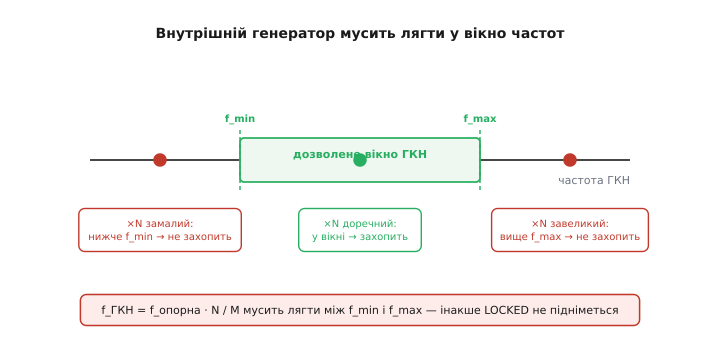
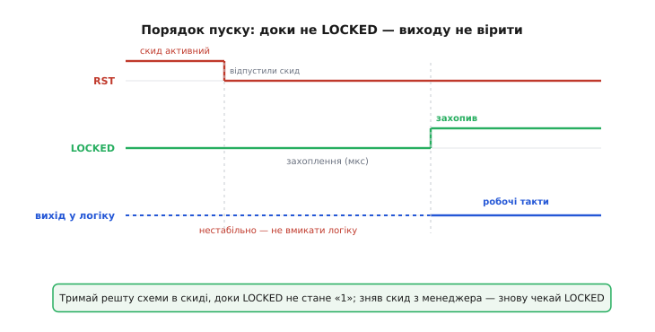

# 🔌 Блок керування тактами: чому один вхідний кварц перетворюється на цілий оркестр тактів

Зовнішній генератор рідко дає саме те, що треба схемі. На платі стоїть, скажімо, кварц на 25 МГц — а логіці потрібно 100 МГц, паралельному інтерфейсу пам'яті — ще й той самий такт, зсунутий по фазі, а якомусь повільному вузлу вистачить і 25 МГц. Три різні такти з одного вхідного фронту, усі жорстко пов'язані між собою, усі чисті. Робить це один вбудований блок, який у різних виробників зветься по-різному, але поводиться скрізь однаково настільки, що говорити про нього варто як про **клас**, а не про конкретну модель. Розберімо цей клас: що в нього входить, що виходить, як він множить і ділить частоту, чистить тремтіння й зсуває фазу — і на які граблі наступає кожен, хто бере його вперше.

Клас цей — те, що стоїть просто перед [тактовою мережею FPGA](topic:hw-digital/fpga-clock-network): між зовнішнім тактовим піном і глобальним буфером, що заводить такт у збалансоване дерево. Він настільки типовий і настільки однаково влаштований у різних кремнієвих родинах, що конкретні партномери тут лише заважали б: сенс скрізь той самий. Тому — про клас, без жодної назви мікросхеми.

### Що це за клас вузла

**Блок керування тактами** (в англійській термінології — *clock management block*, а в конкретних родинах *PLL* чи *MMCM*, від *Mixed-Mode Clock Manager* — змішаний менеджер тактів) — це вбудований у кремній вузол, що бере один опорний такт і виробляє з нього кілька власних тактів потрібної частоти й фази, попутно очищаючи їх від тремтіння. Серце його — [фазове автопідстроювання частоти (PLL)](topic:hw-analog/phase-locked-loop): петля, що виробляє власний рівний внутрішній такт і зворотним зв'язком тримає його в фазі з опорним. Саме тому, що вихід — це **власний** генератор, лише **прив'язаний** до входу, з нього можна взяти зовсім іншу частоту, ніж на вході, і при цьому не втратити прив'язки до опори.

> 🔧 **Навіщо це.** Ключова думка, з якої випливає все інше: менеджер тактів **не проводить** вхідний такт наскрізь, як провід. Він **синтезує новий** такт власним генератором і лише **синхронізує** його з опорою. Тому вихід не успадковує форму вхідного фронту — його частота, фаза й навіть чистота задаються менеджером, а не кварцом. Це і робить вузол таким корисним: із простого дешевого кварца на платі виходить набір точних, взаємопов'язаних тактів під усі потреби дизайну — без десятка окремих генераторів.

Три речі цей клас робить, і всі три — наслідок того, що вихід є прив'язаним власним генератором.

**Множення й ділення частоти.** Внутрішній генератор може бігти на іншій частоті, ніж опора, — петля лише стежить, щоб їхні **поділені** версії збігалися. Постав на вхід дільник ÷M, а в петлю зворотного зв'язку — дільник ÷N, і петля змусить внутрішній генератор бігти так, щоб його поділена на N частота дорівнювала поділеній на M опорі. Звідси проста формула синтезу:

```
f_ГКН = f_опорна · N / M
```

Тут «ГКН» — той самий внутрішній **генератор, керований напругою** (англ. *voltage-controlled oscillator*, VCO; укр. ГКН), серце PLL. Із 25 МГц і парою N=8, M=2 виходить 100 МГц; іншими N і M — інша частота. А вже цю частоту генератора кожен вихідний канал ділить своїм власним дільником ÷O — тож із одного внутрішнього генератора менеджер роздає **кілька** різних вихідних частот одночасно.

**Чищення тремтіння.** Вхідний фронт «тремтить» — його період трохи гуляє від такту до такту (англ. *jitter* — дрож). Петля зворотного зв'язку реагує на вхід не миттєво: вона має власну смугу, і швидкі, дрібні гуляння опори просто **не встигають** протиснутися крізь неї. Внутрішній генератор біжить своїм рівним ходом, петля підправляє його лише повільно — тож на виході такт **рівніший** за вхідний. Це не магія, а звичайна фільтрація: петля низькочастотно пропускає повільні відхилення опори й глушить швидкі. Тому менеджер тактів заодно працює як **чистильник** такту — і саме тому шумний, довгий, наведений вхідний фронт після нього стає придатним.

**Зсув фази.** Оскільки вихідний такт — власний генератор, менеджер може навмисне **посунути** його фронт у часі щодо опори: на чверть періоду, на пів, на будь-яку задану частку. Навіщо — стане ясно нижче, коли дійдемо до зворотного зв'язку й вирівнювання фази; поки досить бачити, що це третій талант класу.


*Типова будова класу. Зліва входять опорний такт, скид і сигнал зворотного зв'язку; усередині вхідний дільник ÷M, фазочастотний детектор із фільтром і внутрішнім генератором (ГКН) та вихідні дільники ÷O; справа виходять кілька синтезованих тактів різної частоти й фази плюс окремий прапорець LOCKED. Петля зворотного зв'язку веде один із виходів назад на вхід CLKFB — так менеджер вирівнює фазу виходу з опорою.*

### Типова «розпіновка»: три входи, кілька виходів і один прапорець

У цього класу немає фізичних ніжок — він живе всередині кристала, і його «розпіновка» — це порти, які розробник під'єднує в мові опису апаратури. Але набір портів на диво сталий у всіх реалізацій, тож перелічімо його як типову розпіновку класу.

**Входи.**

- **Опорний такт** (типово *REFCLK* / *CLKIN*) — той фронт, що ловимо: приходить зі спеціального тактового піна або з іншого такту в кристалі. Це єдиний обов'язковий тактовий вхід; від нього синтезується все.
- **Скид** (типово *RST* / *RESET*) — сигнал, що вертає менеджер у вихідний стан і змушує його заново захоплювати частоту. Активний скид тримає внутрішній генератор у спокої; знявши скид, менеджер починає підстроювання з чистого аркуша.
- **Вхід зворотного зв'язку** (типово *CLKFB* / *CLKFBIN*) — сюди заводять **вихід** менеджера (той, за фазою якого стежимо), щоб петля порівнювала його з опорою. Це і є та петля, що робить PLL петлею. Часто менеджер має внутрішній зворотний зв'язок і цей вхід можна просто замкнути на відповідний вихід — але саме через нього задають, **чию** фазу вирівнювати.

**Виходи.**

- **Кілька синтезованих тактів** (типово *CLKOUT0*, *CLKOUT1*, …) — головний продукт: різні частоти й фази, кожен зі свого дільника ÷O. Один менеджер дає їх кілька — стільки, скільки вихідних дільників у нього закладено.
- **Сигнал «захопив»** (типово *LOCKED* / *LOCK*) — окремий логічний вихід, що стоїть у нулі, поки менеджер ще підстроюється, і піднімається в одиницю, коли внутрішній генератор **захопив** опору й виходи стали стабільними та точними. Це найважливіший і найчастіше забутий вихід усього класу — до нього ми ще повернемося окремо, бо на ньому спотикаються найчастіше.

Ось як ця розпіновка виглядає в мові опису апаратури — узагальнено, без прив'язки до конкретної мікросхеми:

```verilog
clock_manager cm (
    .REFCLK   (clk_25mhz),   // вхід: опорний такт із піна
    .RST      (rst_in),      // вхід: скид менеджера
    .CLKFB    (clk_fb),      // вхід зворотного зв'язку (часто = один із виходів)
    .CLKOUT0  (clk_100),     // вихід: 100 МГц
    .CLKOUT1  (clk_200),     // вихід: 200 МГц
    .CLKOUT2  (clk_25_ph),   // вихід: 25 МГц зі зсувом фази
    .LOCKED   (pll_locked)   // вихід: «захопив/готово»
);
```

### Як його підключають

Тепер де цей блок стоїть у ланцюгу такту й що до чого чіпляють. Місце його чітке: **між тактовим піном і глобальним буфером**. Сирий фронт заходить зі спеціального тактового піна на вхід REFCLK; менеджер його множить-ділить і чистить; а вже кожен вихід іде далі — і тут ховається перша тонкість, яку новачки пропускають.

**Вихід менеджера мусить іти через глобальний буфер.** Здавалося б: менеджер — солідний вбудований вузол, його вихід уже чистий і сильний, чому б не тягти його одразу в логіку? Тому, що вихід менеджера сам по собі сидить у **звичайній сітці**, а не в збалансованому тактовому дереві. Якщо повести його в тригери напряму, він розповзеться загальними проводами й назбирає весь той [перекіс такту](topic:hw-digital/fpga-clock-network), заради позбавлення від якого й будували тактову мережу. Тому вихід менеджера **обов'язково** заводять у [глобальний тактовий буфер](topic:hw-digital/fpga-clock-network) — ті самі ворота в збалансоване дерево, — і лише звідти він розноситься по кристалу з малим перекосом. Менеджер синтезує **правильну частоту й фазу**, а глобальний буфер несе її **однаково до всіх тригерів**; це два різні завдання, і кожне робить свій вузол.

> 🔧 **Навіщо це.** Легко подумати, що менеджер тактів **заміняє** глобальний буфер, — і повести його вихід прямо в логіку. Це помилка того самого класу, що й розведення такту звичайним проводом: частота буде правильна, а перекіс — руйнівний. Правило залізне: **менеджер задає частоту, буфер несе її деревом**; вихід менеджера завжди проходить через глобальний буфер, перш ніж стати тактом для тригерів. Інструмент зазвичай вставляє цей буфер сам, упізнавши тактовий вихід менеджера, — але розуміти, що він там **обов'язково є**, критично.

**Петлю зворотного зв'язку замикають навмисно.** Вхід CLKFB треба на щось завести — і **на що саме** його заведеш, те менеджер і вирівняє по фазі з опорою. Тут і криється сенс зсуву фази й **вирівнювання затримки** (англ. *deskew* — усунення перекосу). Заведи в CLKFB вихід **після** глобального буфера — і петля змусить фронт **на виході буфера** збігтися з опорним фронтом, скомпенсувавши затримку самого буфера й дерева. Тобто менеджер не просто множить частоту, а й **виставляє вихідний фронт рівно там, де треба** — хоч у фазі з опорою, хоч зі зсувом на задану частку періоду. Ось навіщо потрібен зовнішній вхід зворотного зв'язку, а не глухо захована петля: він дає розробникові керувати **фазою** виходу, а не лише його частотою.

```
пін ─→ REFCLK ┌──────────────┐ CLKOUT0 ─→ [глоб. буфер] ─→ у дерево тактів
              │  менеджер     │                 │
              │  тактів       │←── CLKFB ────────┘  (петля вирівнює фазу
              └──────────────┘                       виходу з опорою)
```

### «Перший байт»: що тут насправді налаштовують

У цього класу немає «першого байта» у сенсі команди по шині — уся конфігурація задається наперед, ще при синтезі проєкту, кількома числами. Але ці числа критичні, тож перелічімо, що реально доводиться задавати, не прив'язуючись до жодного партномера.

**Множник і вхідний дільник (N і M).** Вони разом задають частоту внутрішнього генератора за формулою `f_ГКН = f_опорна · N / M`. Це головні числа: від них залежать усі вихідні частоти. Обирають їх **не як заманеться**, а під жорстке обмеження, про яке — за мить.

**Вихідні дільники (O для кожного каналу).** Кожен вихід ділить частоту генератора своїм числом: `f_вих = f_ГКН / O`. Хочеш 100 і 200 МГц з одного генератора на 400 МГц — постав O=4 і O=2. Так один менеджер роздає цілий набір пов'язаних частот.

**Зсув фази для кожного виходу.** Окреме число (у градусах або в частках періоду) каже, наскільки посунути фронт цього виходу. Нуль — фаза в фазу; +90° — на чверть періоду пізніше. Це те, чим користуються, щоб узгодити такт із зовнішньою пам'яттю чи інтерфейсом, де дані треба ловити не по самому фронту, а трохи згодом.

```c
// Узагальнене «налаштування» менеджера тактів (параметри синтезу, не регістри).
// Конкретні імена полів — у мові опису апаратури й паспорті кристала.
//   f_опорна = 25 МГц
//   N = 16, M = 1  →  f_ГКН = 25 · 16 / 1 = 400 МГц   (мусить лягти у вікно ГКН!)
//   O0 = 4  →  CLKOUT0 = 100 МГц,  фаза 0°
//   O1 = 2  →  CLKOUT1 = 200 МГц,  фаза 0°
//   O2 = 16 →  CLKOUT2 = 25  МГц,  фаза +90°
```

І одразу — головне обмеження, що робить вибір N, M, O не вільним. Внутрішній генератор фізично здатний бігти лише в певному **вікні частот**: є нижня межа f_min і верхня f_max, поза якими він або не запуститься, або не втримається. Тому добуток `f_опорна · N / M` мусить лягти **між** цими межами. Якщо взяти множник замалий — генератор мав би бігти нижче f_min і не захопить; завеликий — вище f_max, і теж не захопить. Ось чому N і M підбирають **у парі** з вихідними дільниками: спершу заганяють генератор у вікно, а вже потім кожен вихід ділить його частоту до потрібної. Те саме стосується й вхідної частоти на самому фазовому детекторі: поділена опора `f_опорна / M` теж має власне дозволене вікно.


*Чому множник і дільник не будь-які. Внутрішній генератор захоплює лише в межах свого вікна (між f_min і f_max). Множник, що заганяє його нижче f_min або вище f_max, — і менеджер просто не підніме LOCKED. Тому f_ГКН = f_опорна · N / M мусить лягти у вікно, а потрібні низькі частоти дістають уже вихідними дільниками.*

> 🔧 **Навіщо це.** Це найковарніша з «тихих» помилок класу. Числа N, M, O компілюються без жодної скарги, дизайн збирається — а менеджер мовчки не захоплює, бо генератор загнали за вікно. На виході — або нічого, або сміття, і причину видно лише якщо стежити за LOCKED. Тому досвідчений розробник **спершу перевіряє, що f_ГКН лягла у вікно**, а вже тоді радіє потрібним вихідним частотам. Майстри цього не рахують руками — довіряють майстрові конфігурації (майстер тактів у середовищі), який сам добирає N, M, O під задані частоти й не випустить генератор за межі; але коли менеджер заводять руками, вікно перевіряють обов'язково.

### Граблі №1: узяти вихід до того, як піднявся LOCKED

Тепер про пастку, у яку падає майже кожен, хто бере менеджер тактів уперше, — і про яку мовчить безтурботна блок-схема. Менеджер захоплює частоту **не миттєво**. Коли на нього подали опору й зняли скид, внутрішня петля починає підстроювання: генератор поволі підтягується до потрібної частоти й фази, і поки він не втягнувся, **вихідні такти нестабільні** — частота гуляє, фронти стрибають. Триває це недовго, порядку мікросекунд, але з погляду тактів це тисячі періодів, протягом яких на виходах — не такт, а хаос.

І ось тут криється біда. Уся логіка, що тактується від менеджера, вмикається **разом із кристалом**, тобто ще до того, як менеджер захопив. Якщо не вжити заходів, тригери починають клацати по цих хаотичних, ще не стабілізованих фронтах — і схема стартує в **невизначеному** стані, з якого може й не вибратися. Найгірше, що поводиться це **нестабільно**: іноді дизайн «якось запускається», іноді ні — залежно від того, як лягли перші фронти. Такі помилки найважче ловити, бо вони не повторюються.

Розв'язок простий і незмінний для всього класу: **тримати решту схеми в скиді, доки не піднявся LOCKED**. Той самий прапорець LOCKED, що менеджер підіймає, захопивши опору, — це і є сигнал «мої виходи вже справжні, можна працювати». Його заводять у ланцюг скиду всієї логіки, що живиться від цього менеджера: поки LOCKED у нулі — вся ця логіка тримається в скиді й нічого не робить; піднявся LOCKED — скид знімається, і схема стартує вже по чистих, стабільних тактах.

```verilog
// Синхронна логіка стартує лише після захоплення менеджера.
// Поки LOCKED == 0 — тримаємо все в скиді.
wire sys_rst = ~pll_locked;   // скид активний, доки менеджер не захопив

always @(posedge clk_100) begin
    if (sys_rst)
        state <= IDLE;         // менеджер ще не готовий — сидимо в скиді
    else
        state <= next_state;   // виходи стабільні — працюємо
end
```


*Порядок пуску менеджера. Поки триває захоплення (мікросекунди після зняття скиду), виходи нестабільні — вмикати по них логіку не можна. LOCKED піднімається аж коли внутрішній генератор захопив опору; лише з цієї миті такти робочі. Тому решту схеми тримають у скиді від LOCKED — і зняли скид з менеджера — знову чекають, доки LOCKED повернеться.*

> 🔧 **Навіщо це.** Це правило номер один усього класу: **вихід менеджера не існує, поки не піднявся LOCKED**. Дев'ять із десяти «загадкових» стартових збоїв дизайну з PLL — це логіка, що почала клацати по ще не захоплених тактах. Заведи LOCKED у скид системи — і збій зникає начисто, безкоштовно, бо прапорець менеджер і так виставляє. Пропусти цей крок — і дістанеш найпідступніший різновид помилки: дизайн, що «іноді стартує». Той самий прапорець готовності, до речі, чекають у будь-якому PLL: спершу [захоплення](topic:hw-analog/phase-locked-loop), тоді робота.

### Граблі №2: змінити опору й не скинути менеджер

Друга біда того ж класу тонша, бо в звичайному житті, коли опора одна й стала, вона не спливає. Але щойно опорний такт **міняється** — його перемкнули на інше джерело, або він на мить пропав і повернувся, або плата стартує з нестабільним ще кварцом — менеджер може лишитися в дивному, напівзахопленому стані. Він же стежить за опорою петлею; вибий у нього опору з-під ніг чи підміни її — і петля, що була захоплена на стару частоту, не обов'язково чисто перезахопиться на нову. Іноді LOCKED лишається піднятим, хоча виходи вже поїхали; іноді менеджер зависає між станами.

Тому правило класу: **після будь-якої зміни опорного такту менеджер треба скинути**. Активний імпульс на вхід RST змушує менеджер забути стару прив'язку й почати захоплення нової частоти з чистого аркуша. І — увага — знявши скид, треба **знову чекати LOCKED**, бо після скиду менеджер знову проходить те саме захоплення за мікросекунди, і всі граблі №1 повертаються. Тобто зміна опори — це завжди трійка «скинь → зачекай LOCKED → працюй».

Окремий, м'якший випадок тієї ж біди — **старт кристала з ще не готовою опорою**. Поки FPGA конфігурується, менеджер тримається в скиді автоматично; якщо на момент кінця конфігурації опора вже присутня й стабільна, цього першого скиду досить, і додатковий не потрібен. Але якщо опора на старті ще гуляє (кварц не розкачався), менеджер варто скинути явно, коли опора вже стала. Практичне правило просте: **опора нестабільна — тримай менеджер у скиді**; стала — знімай скид і чекай LOCKED.

```verilog
// Зміна опорного такту: скинути менеджер, тоді знову чекати захоплення.
//   1. ref_changed      → підняти RST менеджера
//   2. відпустити RST    → менеджер заново захоплює нову частоту
//   3. дочекатися LOCKED  → лише тоді вихід знову робочий
//
// Хибно: перемкнути опору й далі вважати такт готовим —
//        LOCKED може ще стояти піднятим, а виходи вже поїхали.
```

> 🔧 **Навіщо це.** Це та пастка, що не проявляється на макеті, поки такт один і стабільний, — а вилазить у реальному пристрої з перемиканням джерел такту або з живленням, що моргнуло. Симптом характерний: після зміни такту частина логіки починає збоїти, хоча «менеджер начебто захоплений». Перша підозра — забутий скид після зміни опори. Візьми за звичку **на кожну зміну опорного такту вішати скид менеджера й повторне очікування LOCKED** — і цілий клас плавучих збоїв просто не виникне.

### Варіації класу

Узагальнений «блок керування тактами» існує в кількох різновидах — корисно знати, чим вони різняться, знову без жодного партномера.

**Простий PLL-менеджер.** Базовий варіант: множення й ділення частоти, кілька виходів, зсув фази **обмежений** (часто лише грубими кроками — чверть, половина періоду). Його беруть, коли треба просто отримати кілька частот з одного кварца й не потрібен тонкий зсув фази. Дешевший ресурсом, тож у кристалі їх зазвичай більше.

**Змішаний менеджер (тип MMCM).** Той самий PLL, але з тоншим і ширшим набором можливостей: **дрібний, майже неперервний зсув фази** (сотні кроків на період), динамічне перелаштування частоти й фази **на ходу** (через окремий службовий порт, не спиняючи кристал), точніше вирівнювання затримки. Його беруть там, де фаза критична — інтерфейси швидкої пам'яті, узгодження даних із тактом. Складніший і дефіцитніший, тож на нього не переводять те, що впорається простий PLL.

**Менеджер із динамічним перелаштуванням.** Варіація не будови, а керування: до менеджера додано службовий порт (типово окрема мала шина конфігурації), яким **під час роботи** можна міняти множники, дільники й фазу, не пересинтезовуючи проєкт. Це вже ближче до справжнього «першого байта»: розробник шле в цей порт нові числа й після кожної зміни, звісно, знову чекає LOCKED. Беруть там, де частоту треба міняти в польоті — під різні режими роботи.

**Менеджер-чистильник (jitter cleaner).** Варіація, заточена не так на синтез, як на **очищення** такту: дуже вузька смуга петлі, щоб якнайсильніше придушити тремтіння вхідного фронту. Такий менеджер бере брудний, наведений, довгий вхідний такт і віддає рівний — ціною того, що повільно реагує на зміни опори (вузька смуга — довше захоплення). Беруть там, де над усе чистота такту, а не швидкість перелаштування.

Спільне в усіх різновидах — суть незмінна: **власний внутрішній генератор, петлею прив'язаний до опори, роздає кілька синтезованих тактів різної частоти й фази, а прапорець LOCKED каже, коли їм можна вірити**. Звідси й обидві головні чесноти класу: з одного дешевого кварца — цілий оркестр точних, пов'язаних тактів, кожен чистіший за вхідний. І звідси ж обидві вічні граблі — узяти вихід до LOCKED і забути скид після зміни опори, — які об'єднує одне просте правило: **менеджер тактів говорить через LOCKED, і поки він мовчить, виходу нема**.
