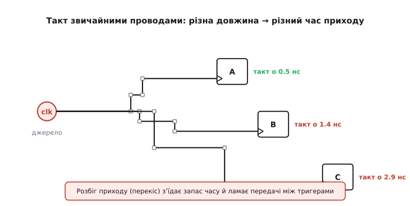
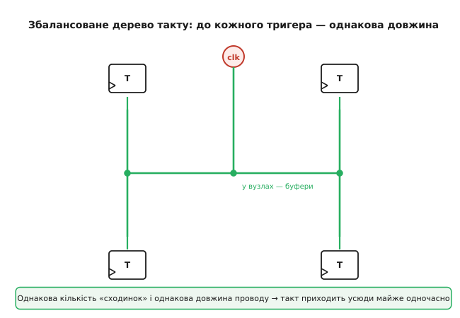
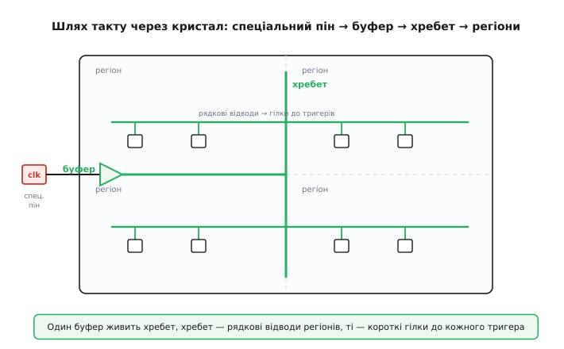
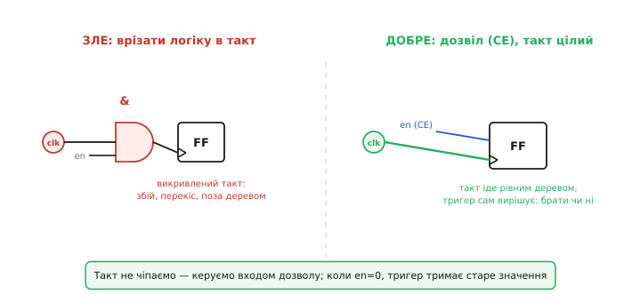

# Тактова мережа FPGA

Уся синхронна логіка живе під один спільний удар — [тактовий сигнал](topic:hw-digital/clock-signal) (англ. *clock* — годинник), рівний ритм, по фронту якого всі [тригери](topic:hw-digital/d-flip-flop) одночасно фіксують свої значення. Слово «одночасно» тут не прикраса, а вимога: якщо два тригери, що передають дані один одному, клацнуть не в ту саму мить, передача може зламатися. І ось тут велика FPGA впирається у фізику. Кристал завбільшки з ніготь містить сотні тисяч тригерів, розкиданих по всій площі; провести до кожного з них той самий фронт **у той самий момент** — окрема інженерна задача, заради якої в чип вбудовано цілу спеціальну мережу, відмінну від звичайних сигнальних проводів. Розберімо, чому вона взагалі потрібна, як влаштована і що з нею мусить робити розробник.

### Чому такту не годиться звичайний провід

Почнімо з наївного плану: узяти вихід тактового джерела і розвести його [загальною маршрутизацією](topic:hw-digital/inside-fpga) — тими самими програмованими проводами й перемикачами, якими ходять усі інші сигнали. План провалюється, і причина проста та фізична.

Сигнал у кремнії поширюється не миттєво. Кожен відрізок проводу має опір і ємність, кожен перемикач маршрутизації додає затримку; що довший шлях і що більше перемикачів на ньому — то пізніше приходить фронт. А тепер згадаймо, що тригери розкидані по всьому кристалу: один сидить за два кроки від джерела, інший — у протилежному кутку через десятки перемикачів. Розведи такт абияк — і той самий фронт дійде до ближнього тригера, скажімо, за 0.5 нс, а до дальнього — за 2.9 нс. Ця різниця часу приходу однакового фронту до різних тригерів має назву **перекіс такту** (англ. *clock skew* — перекіс, зсув). І саме він руйнує синхронність.


*Той самий фронт іде до кожного тригера власним шляхом загальної сітки. Проводи різної довжини й різна кількість перемикачів дають різний час приходу — перекіс. Тригер A клацає раніше, ніж C бачить свій фронт, і передача A→C стає ненадійною.*

Чому це небезпечно, видно на парі сусідів. Хай тригер A віддає дані тригеру B по тому самому такту. Задум: по фронту B засікає те, що A **тримав до фронту**. Але якщо через перекіс фронт приходить до B помітно **раніше**, ніж до A, то B може встигнути клацнути ще до того, як A оновився, — і схопити або старе значення двічі, або, гірше, значення в мить його зміни, коли воно ще нестабільне. Це і є класична пастка [метастабільності й порушень часу утримання](topic:hw-digital/metastability-timing): дані на вході тригера мусять бути стабільні впродовж вікна навколо фронту, а перекіс це вікно з'їдає. Ось чому такт — не звичайний сигнал: для даних невелика розбіжність затримок нешкідлива, а для спільного ритму вона фатальна.

> 🔧 **Навіщо це.** Перекіс — головна причина, чому в FPGA не можна «просто розвести» тактовий сигнал як будь-який інший. Коли новачок бере такт і жене його через логіку та звичайні лінії, синтез або лається, або пропускає дизайн, який потім збоїть на швидкості. Правило залізне: **тактовий сигнал заводять лише в спеціальну тактову мережу**, і саме тому інструмент так пильно стежить, звідки такт зайшов і чи не потрапив у загальну сітку.

### Рішення — збалансоване дерево з рівними шляхами

Якщо біда в тому, що шляхи до тригерів **різні**, напрошується розв'язок: зробити їх **однаковими**. Не важливо, наскільки шлях довгий, — важливо, щоб до **кожного** тригера він був однакової довжини й з однаковою кількістю підсилювачів. Тоді фронт хай приходить не за нуль, але **всюди в той самий момент**, і перекіс майже зникає.

Форма, яка це дає, — симетричне дерево, що гілкується. Від джерела йде стовбур, ділиться навпіл, кожна половина знову навпіл — і так, доки гілочки не дійдуть до кожного куточка кристала. Оскільки на кожному рівні гілки однакові, шлях від кореня до будь-якого листка проходить однакову кількість розгалужень і однакову довжину проводу. За характерний вигляд — повторювані відрізки, що на кресленні складаються в літеру «H», вкладену в більшу «H», — таку структуру звуть **H-деревом** (англ. *H-tree*). Це стандартний спосіб роздати сигнал по площі з мінімальним перекосом, і саме його інженери вбудовують у кремній як тактову мережу.


*Стовбур ділиться симетрично, гілки на кожному рівні однакові, у вузлах стоять буфери-підсилювачі. Шлях від кореня до будь-якого листка має однакову довжину й однакову кількість сходинок, тож фронт приходить до всіх тригерів майже одночасно. Це і є суть спеціальної тактової мережі.*

Дерево не лишають пасивним. На розгалуженнях ставлять **буфери** (англ. *buffer* — підсилювач-повторювач): вони відновлюють крутість і силу фронту, щоб той не «розмивався» на довгому шляху й міг тягнути тисячі тригерів на кінцях. Буфери на однакових рівнях однакові — тому вони додають однакову затримку й **не псують** балансу. Виходить мережа, яку кремнієві архітектори прораховують і вивіряють ще на етапі проєктування чипа: розробнику дизайну не треба самому балансувати шляхи — потрібна структура вже вбудована, лишається правильно нею скористатися.

### Як увімкнутися в мережу: спеціальні піни та глобальні буфери

Мережа є, але як у неї потрапити? Не будь-який контакт годиться: якщо завести такт випадковим піном і тягти його до кореня дерева звичайними проводами, ми знову назбираємо перекосу ще **до** входу в збалансовану частину. Тому по краю кристала виділено особливі **тактові піни** (англ. *clock-capable pins* — контакти, здатні приймати такт): вони мають короткий, вивірений шлях просто до входу тактової мережі. Зовнішній генератор чіпляють саме до такого піна — і фронт одразу лягає в підготовлену магістраль.

На вході в мережу з боку кристала сидить ключовий елемент — **глобальний тактовий буфер** (у типовій термінології — *BUFG*, від англ. *Buffer, Global* — глобальний буфер). Це не просто підсилювач: це **ворота** тактової мережі. Сигнал, поданий на вхід глобального буфера, підхоплюється кореневим стовбуром збалансованого дерева й розноситься по всьому кристалу з малим перекосом і великою силою. Поза цим буфером сигнал у мережу не потрапляє — і в цьому весь сенс: інструмент **зобов'язує** будь-який справжній такт пройти через глобальний буфер, тим самим гарантуючи, що він поїде спеціальною магістраллю, а не загальною сіткою. Кількість таких буферів у чипі обмежена — їх десятки, — бо саме стільки незалежних тактів мережа фізично здатна розвести без перекосу.

У мові опису апаратури ([HDL](topic:hw-digital/hdl)) це часто виглядає як явне під'єднання: розробник **прямо вставляє** глобальний буфер між входом такту й рештою схеми, кажучи інструменту «оцей сигнал — тактовий, жени його магістраллю».

**Явне заведення зовнішнього такту в глобальну мережу (стиль Xilinx, Verilog).** Вхідний пін `clk_pin` під'єднуємо до внутрішнього такту `clk` через глобальний буфер — далі `clk` уже їде збалансованим деревом:

```verilog
wire clk_pin;   // приходить зі спеціального тактового піна
wire clk;       // внутрішній такт — уже в глобальній мережі

// глобальний буфер: ворота в тактове дерево
BUFG clk_buf (
    .I (clk_pin),   // вхід — сирий такт із піна
    .O (clk)        // вихід — розведений магістраллю
);

// уся синхронна логіка тактується вже від clk
always @(posedge clk) begin
    counter <= counter + 1'b1;
end
```

Тут `BUFG` — не логіка й не затримка «для галочки», а вказівка структурі: цей сигнал заходить у глобальну тактову мережу. Часто інструмент вставляє такий буфер сам, упізнавши тактовий вхід, — але розуміти, що він там **обов'язково є**, критично: без нього такт лишився б у загальній сітці з усім її перекосом.

### Ієрархія: глобальні, регіональні та листові гілки

Одне збалансоване дерево на весь великий кристал було б неповоротким: будь-яка зміна тягла б перебудову всієї магістралі, а тактів у реальному дизайні багато — і не кожному треба покривати **весь** чип. Тому мережу роблять **ярусною**, і ця будова прямо повторює те, як [FPGA поділена на регіони](topic:hw-digital/inside-fpga).

Кристал розбито на прямокутні **тактові регіони** (англ. *clock regions* — тактові області): кожен покриває свій шмат логіки. Магістраль такту йде так: глобальний буфер живить центральний **хребет** (англ. *spine* — хребет, вертикальна магістраль), що тягнеться крізь увесь кристал; від хребта в кожен регіон відходять **рядкові відводи** (горизонтальні магістралі регіону); а вже від них — короткі **листові гілки** до кожного окремого тригера в регіоні. Виходить дерево з дерев: глобальне вгорі, регіональне всередині кожної області, листове біля кожного тригера.


*Такт заходить спеціальним піном у глобальний буфер, той живить центральний хребет, хребет роздає рядкові відводи в кожен тактовий регіон, а відводи — короткі гілки до кожного тригера. Поділ на регіони дає локальні буфери й дозволяє кільком тактам ділити кристал, не заважаючи один одному.*

Ця ярусність народжує **два види буферів**, і різниця між ними — суто практична. **Глобальний** буфер доносить свій такт до **будь-якого** регіону — це для головних, найважливіших тактів, яких у дизайні небагато. **Регіональний** буфер (у типовій термінології — *BUFR* / *BUFH*, від англ. *regional* / *horizontal* — регіональний / горизонтальний) живить лише **свій** регіон чи пару сусідніх — цього досить для такту, що потрібен лише в одному кутку чипа, і при цьому не витрачається дефіцитний глобальний ресурс. Логіка вибору проста: **глобальний буфер — для тактів, що йдуть по всьому кристалу; регіональний — для локальних**. Коли головних тактів у дизайні більше, ніж глобальних буферів, частину локальних свідомо переводять на регіональні — і мережа лишається в межах своїх ресурсів.

> 🔧 **Навіщо це.** Глобальних буферів у чипі рівно стільки, скільки їх є, — і це **тверда стеля**: якщо дизайн просить більше незалежних глобальних тактів, ніж їх у кристалі, розведення просто не збереться. Тому досвідчений розробник **рахує такти заздалегідь**: скільки з них справді мусять покривати весь чип (їм — глобальні буфери), а які локальні (тим — регіональні). Ще одна пастка — надто багато тригерів на одному глобальному такті поза межами, де мережа тримає перекіс; тоді допомагає рознести навантаження регіонами. Ці рішення прямо впливають на те, чи [зійдеться таймінг дизайну](topic:hw-digital/fpga-timing-and-routing).

### Чистий такт: PLL і синтез частоти

Дотепер ми несли до тригерів той такт, що зайшов ззовні, як є. Але зовнішній генератор рідко дає саме те, що треба схемі. Кварц на платі видає, скажімо, 25 МГц, а логіці потрібно 100 МГц; або потрібно кілька тактів різної частоти для різних частин дизайну; або сам зовнішній фронт «тремтить» — його період трохи гуляє від такту до такту. Тому просто перед тактовою мережею в FPGA вбудовано блоки, що такт **очищають і перетворюють**.

Серце такого блока — [фазове автопідстроювання частоти (PLL)](topic:hw-analog/phase-locked-loop) (англ. *Phase-Locked Loop* — петля фазового захоплення): схема, що виробляє власний рівний такт і петлею зворотного зв'язку **тримає його в фазі** з опорним. Оскільки її вихід — це рівний внутрішній генератор, лише **прив'язаний** до входу, він, по-перше, дозволяє **синтезувати іншу частоту** (помножити чи поділити опорну — так із 25 МГц роблять 100 МГц, як докладніше розібрано для [прескейлера й синтезу частоти](topic:hw-digital/prescaler)); по-друге, **чистить тремтіння** (англ. *jitter* — дрож): дрібні гуляння вхідного фронту петля згладжує, і на виході такт рівніший за вхідний; по-третє, дозволяє **зсунути фазу** — навмисно посунути фронт у часі, коли це потрібно для узгодження з зовнішньою пам'яттю чи інтерфейсом.

Ці блоки-менеджери такту стоять **між тактовим піном і глобальним буфером**: сирий фронт заходить із піна, менеджер його множить-ділить і чистить, а вже його вихід іде в глобальний буфер і далі магістраллю. Так тригери отримують не те, що було на кварці, а рівно ту частоту й ту фазу, яку заклав розробник. Узагальнений вигляд такого блока — його типові входи (опорний такт, скид, зворотний зв'язок), виходи (кілька синтезованих тактів) і сигнал «захопив/готово», а також класичні граблі підключення — винесено в окрему вставку [про блок керування тактами як клас](topic:hw-digital/fpga-clock-network/comp-clock-management-block.md).

Коли з одного менеджера виходить кілька тактів різної частоти, схема природно розпадається на кілька **тактових доменів** — груп логіки, кожна під своїм ритмом. Передавати дані між ними напряму не можна: фронти в різних доменів свої, і на межі знову чигає метастабільність. Як безпечно перекидати сигнали через таку межу — окрема, дуже практична тема [перетину тактових доменів](topic:hw-digital/clock-domain-crossing); тут важливо лише бачити, звідки ці домени беруться: з того, що тактова мережа несе не один такт, а кілька, синтезованих під потреби різних частин дизайну.

### Головне правило роботи з тактом: не чіпай його логікою

З усього сказаного випливає одне практичне правило, яке новачки порушують найчастіше, а досвідчені бережуть свято: **тактовий сигнал не пропускають через звичайну логіку**. Спокуса є завжди — «хай тригер клацає лише коли `enable`, тож заведімо такт через І-вентиль із сигналом дозволу». Це зветься **врізанням у такт** (англ. *clock gating* — врізання, замикання такту вентилем), і в FPGA воно небезпечне одразу з двох боків.

По-перше, вентиль на логіці може дати **збій** (англ. *glitch* — коротка хибна пічка): якщо його входи міняються не миттю одночасно, на виході проскакує паразитний імпульс — а для такту зайвий імпульс означає зайвий, непроханий фронт, по якому тригери клацнуть даремно. По-друге, вихід такого вентиля сидить **у загальній сітці**, поза збалансованим деревом, — тобто ми власноруч повертаємо весь той перекіс, заради позбавлення від якого й будували мережу.

Правильний шлях — не чіпати такт, а керувати **входом дозволу самого тригера**. Кожен тригер у FPGA має окремий вхід **дозволу такту** (англ. *clock enable*, CE — дозвіл такту): такт іде на тригер завжди, рівним деревом, а вхід CE вирішує, **приймати** по цьому фронту нове значення чи тримати старе. У HDL це виходить само собою, варто описати намір словами «онови, коли дозволено».


*Ліворуч: такт заведено через І-вентиль із сигналом дозволу — виходить викривлений такт зі збоями й перекосом, поза деревом. Праворуч: такт іде в тригер незайманим збалансованою мережею, а окремий вхід дозволу (CE) вирішує, брати нове значення чи тримати старе. Правий варіант — єдино правильний у FPGA.*

**Дозвіл замість врізання в такт (Verilog).** Лічильник має рахувати лише коли `en=1`, інакше тримати значення. Правильний опис — умова **всередині** такту, а не вентиль **на** такті:

```verilog
// ПРАВИЛЬНО: такт незайманий, працює вхід дозволу тригера
always @(posedge clk) begin
    if (en)
        counter <= counter + 1'b1;   // оновлюємо лише коли дозволено
    // коли en == 0, тригер просто тримає старе значення
end
```

Інструмент побачить цей опис і задіє **вбудований вхід CE** тригера — такт лишиться в дереві цілий, а рахунок ітиме лише за дозволом. Порівняймо з тим, як робити **не можна**:

```verilog
// ЗЛЕ: такт урізано вентилем — збій і втрата балансу мережі
wire gated_clk = clk & en;           // паразитний фронт + вихід у загальній сітці
always @(posedge gated_clk) begin
    counter <= counter + 1'b1;
end
```

Другий варіант може навіть «запрацювати» на макеті, але на швидкості чи в іншій температурі він видасть зайвий фронт або перекіс — і дизайн почне збоїти нестабільно, а такі помилки найважче ловити. Коли ж вимкнути потрібен **цілий великий блок** заради економлення живлення, для цього є **спеціальні** буфери з вбудованим дозволом (глобальний буфер із входом CE): вони гасять такт **на рівні магістралі** чисто, без збоїв, — тобто навіть тут врізання роблять не логікою, а призначеним для цього елементом мережі.

> 🔧 **Навіщо це.** Це найпрактичніше правило всієї теми: **керуй даними, а не тактом**. Дев'ять із десяти випадків, коли тягне «загейтувати» такт, розв'язуються входом дозволу CE — безкоштовно, бо він у кожному тригері вже є, і безпечно, бо такт лишається в дереві. А коли справді треба вимкнути такт цілому блоку (заради живлення), беруть спеціальний буфер із дозволом, а не вентиль. Порушиш це правило — і дістанеш найпідступніший клас помилок: дизайн, що «іноді працює».

### Як усе складається докупи

Тактова мережа FPGA — це відповідь на одну фізичну незручність: сигнал не поширюється миттєво, а тригерів по кристалу тисячі, тож донести до всіх той самий фронт **одночасно** звичайними проводами неможливо. Звідси все інше. Щоб прибрати перекіс — **збалансоване дерево** з рівними шляхами й буферами у вузлах. Щоб у нього чисто ввійти — **спеціальні тактові піни та глобальні буфери** як єдині ворота. Щоб один кристал ділили кілька тактів і не кожен покривав усе — **ярусність** із глобальними й регіональними буферами по тактових регіонах. Щоб такт був потрібної частоти й чистий — **PLL-менеджери** перед мережею. І щоб нічого з цього не зруйнувати — **золоте правило** не заводити такт у логіку, а керувати входом дозволу тригера.

Побачивши цю мережу як **єдину інженерну відповідь** на перекіс, легко тримати в голові й усі похідні поради: рахувати глобальні такти під стелю буферів, класти локальні на регіональні, синтезувати частоти менеджером, а дозвіл робити на даних. Саме ця спеціальна, ретельно збалансована магістраль і дає FPGA право на слово «синхронна»: тисячі тригерів по всьому кристалу справді б'ються в один ритм.
