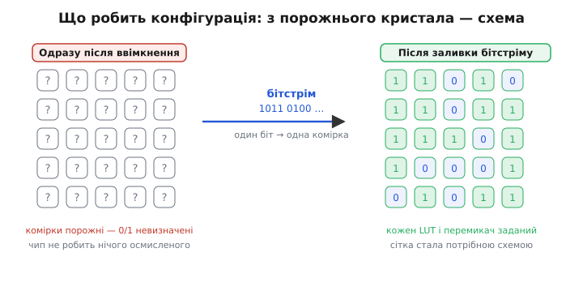
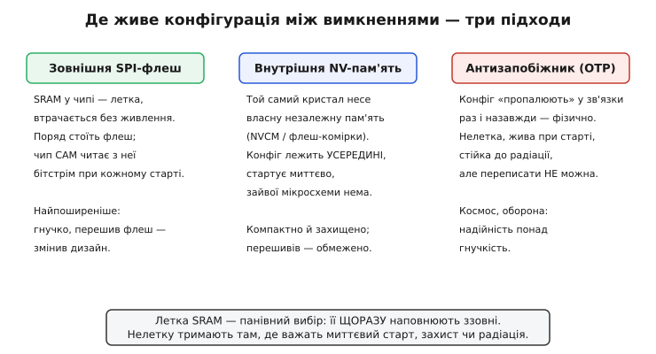
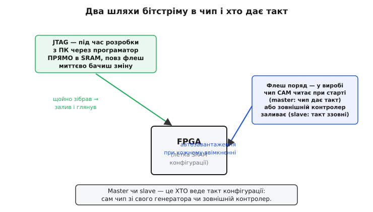

# Конфігурація FPGA: бітстрім, Flash, JTAG

Увімкніть щойно припаяну FPGA — і вона не робить нічого. Не тому, що зламана: тому, що всередині ще немає жодної схеми. [FPGA](root:hw-digital/programmable-logic) — це поле однакових логічних клітинок і перемикачів, які самі по собі нічого не означають; конкретною схемою вони стають лише тоді, коли хтось задасть вміст кожної [таблиці підстановки (LUT)](root:hw-digital/lut) і положення кожного перемикача маршрутизації. Ці мільйони налаштувань зберігаються у крихітних комірках пам'яті по всьому кристалу — і саме їх треба чимось наповнити. Наповнення цих комірок і зветься **конфігурацією** (лат. *configuratio* — надання певної форми): дія, що з порожнього поля робить потрібний пристрій.

Ключова, часто несподівана обставина: у переважної більшості FPGA ця пам'ять **летка** (англ. *volatile* — та, що випаровується). Комірки конфігурації зроблено на статичній RAM (SRAM), а SRAM тримає свій вміст лише поки є живлення. Вимкнули струм — усі налаштування зникли, кристал знову порожній. Тож конфігурація — не разова операція «прошив на заводі й забув», як у мікроконтролері, а дія, яку доводиться **повторювати при кожному ввімкненні**. Уся ця стаття — про те, звідки береться опис схеми, у якому вигляді він приходить і якими шляхами потрапляє в чип.


*Одразу після ввімкнення комірки конфігурації порожні й чип безпорадний; бітстрім заливає в них конкретні нулі й одиниці — один біт на комірку — і однорідна сітка вмить набуває вигляду потрібної схеми.*

## Бітстрім: опис схеми як довгий потік бітів

Почнімо з того, що саме заливають. Інструмент розробки, зібравши дизайн, видає файл, який називають **бітстрімом** (англ. *bitstream* — потік бітів). Назва точна до буквальності: це справді довга послідовність бітів, де кожен відповідає **одній комірці конфігурації**. Один біт каже, яким має бути певний розряд у певній LUT; інший — чи з'єднати даний відрізок дроту з сусіднім через певний перемикач; третій налаштовує режим ноги вводу-виводу. Складіть усі ці біти в один потік — і матимете повний, до останньої дрібниці, опис того, якою схемою кристал має стати.

Звідси випливає перша важлива риса бітстріму: він **непрозорий** для людини й **прив'язаний до конкретної моделі чипа**. Це не текст і не програма, яку можна почитати, — це сира карта станів усіх комірок саме цього кристала, у порядку, який знає лише його виробник. Бітстрім для одного сімейства FPGA не має жодного сенсу для іншого: у них інша кількість комірок, інше розташування, інший внутрішній лад. Тому бітстрім не пишуть руками й не переносять між різними чипами — його щоразу генерує інструмент саме під ту модель, у яку заливатимуть.

Друга риса — **розмір**. Комірок у сучасній FPGA — від сотень тисяч до сотень мільйонів, і на кожну припадає біт, тож бітстрім важить від сотень кілобіт (у найменших чипів) до сотень мегабіт (у найбільших). Це число прямо визначає, скільки треба місця, щоб бітстрім десь зберігати, і скільки часу забере його заливка при старті. Обидва питання ми порахуємо на прикладі наприкінці.

> 🔧 **Навіщо це.** Розуміння, що бітстрім — це «карта всіх комірок цього кристала», рятує від типової плутанини новачка, який шукає в ньому «свій код» чи намагається залити чужий файл у інший чип. Бітстрім не читають і не редагують — його **генерують заново** щоразу, коли змінили дизайн, і завжди строго під конкретну модель. А ще з розміру бітстріму (він написаний у документації на чип) одразу видно, яка потрібна пам'ять для зберігання й чи вкладеться старт у відведений час.

## Де живе бітстрім між вимкненнями

Тепер головне наслідкове питання. Якщо комірки летки́ й при вимиканні все зникає, то бітстрім мусить десь **пережити** відсутність живлення — інакше пристрій після кожного вимкнення був би мертвий. Тут є три різні відповіді, і вони визначають, як улаштована плата.


*Летку SRAM-конфігурацію треба щоразу наповнювати ззовні — і панівний спосіб це робити — окрема флеш поряд; нелетку внутрішню пам'ять чи пропалений антизапобіжник тримають там, де важать миттєвий старт, захист чи стійкість до радіації.*

**Найпоширеніший спосіб — окрема мікросхема флеш-пам'яті поряд із FPGA.** Це маленька [SPI-флеш](root:hw-components/spi-flash) (англ. *flash* — «спалах», за способом швидкого стирання цілими блоками), незалежна пам'ять, що тримає свій вміст без живлення. У неї один раз записують бітстрім, а далі FPGA при кожному ввімкненні **сама читає** його звідти й заливає в свої комірки. Такий поділ праці зручний: гнучка, але летка логіка сидить у FPGA, а стійкий до вимикання опис її схеми — у дешевій сусідній мікросхемі. Перешив флеш новим бітстрімом — і після наступного старту чип оживе вже іншою схемою.

**Другий спосіб — внутрішня незалежна пам'ять у самому кристалі.** Деякі FPGA несуть на борту власну нелетку пам'ять (її називають, наприклад, NVCM — англ. *Non-Volatile Configuration Memory*, незалежна пам'ять конфігурації), куди бітстрім записують один раз, і далі кристал наповнює свою SRAM **із самого себе**, без жодної зовнішньої мікросхеми. Виграш подвійний: старт майже миттєвий (не треба тактувати довге читання по зовнішній шині) і на платі однією мікросхемою менше, а сам бітстрім захищений — його не видно ззовні на шині, тож важче скопіювати. Плата за це — обмежене число перезаписів і трохи вища ціна чипа.

**Третій спосіб — антизапобіжник (англ. *antifuse* — «протизапобіжник»).** Тут конфігурацію не зберігають у пам'яті, а **фізично пропалюють** у кристалі: у потрібних місцях електричним імпульсом назавжди утворюють провідну зв'язку там, де її не було. Це протилежність звичайного запобіжника, який зв'язок розриває, — звідси й назва. Такий чип нелеткий і живий одразу при старті, бо схема в ньому не «залита», а вплавлена в кремній; його майже неможливо перепрограмувати чи зчитати, і він винятково стійкий до збоїв від радіації — заряджена частинка космічного променя не змінить фізичної зв'язки. Ціна — **одноразовість** (англ. *OTP*, *one-time programmable* — програмований один раз): помилився в дизайні — чип на викид. Тому антизапобіжникові FPGA живуть там, де надійність важить понад усе, а переписувати нічого й не треба: космос, оборона, тривала промислова техніка. Першою їх почала випускати фірма Actel (перші вироби — 1988 рік; згодом її купила Microsemi, нині частина Microchip). *(Дати й факти про антизапобіжникові FPGA звірено; статус: підтверджено.)*

Ці три підходи не конкурують «хто кращий» — вони про різні пріоритети. Летка SRAM із зовнішньою флеш дає максимум гнучкості й тому панує у звичайній техніці; внутрішня нелетка пам'ять виграє там, де цінні миттєвий старт і захист; антизапобіжник — там, де понад усе надійність і стійкість до радіації.

## Два шляхи бітстріму в чип: JTAG і Flash

Знаючи, звідки береться бітстрім, розгляньмо, якими фізичними шляхами він потрапляє в комірки. Їх, по суті, два, і вони служать двом різним етапам життя пристрою — розробці та роботі у виробі.


*Під час розробки бітстрім заливають прямо в летку SRAM через JTAG із ПК — щоб миттєво бачити зміну; у готовому виробі бітстрім лежить у флеш поряд, і чип наповнює SRAM автоматично при кожному ввімкненні.*

**JTAG — шлях розробника.** Поки ви пишете й налагоджуєте дизайн, вам треба **швидко** заливати нову версію й одразу дивитися, чи працює. Заводити її щоразу у флеш було б повільно й марудно. Тому під час розробки бітстрім вантажать **прямо в летку SRAM** чипа, повз усяку флеш, через окремий службовий інтерфейс — **JTAG**. Це чотири-п'ять сигнальних ліній, до яких під'єднують невеликий програматор між ПК і платою; інструмент розробки жене бітстрім цими лініями просто в комірки конфігурації. Залив — за секунди побачив результат — виправив — залив знову. Такий бітстрім живе лише до вимикання (він же в летці SRAM), але для налагодження це якраз і треба.

Сам JTAG — не FPGA-винахід, і назва його промовиста. Це скорочення від **Joint Test Action Group** (англ. — «спільна робоча група з тестування»): так звався комітет інженерів (з фірм Philips, British Telecom, GEC, Texas Instruments та інших), який наприкінці 1980-х шукав спосіб перевіряти вже спаяні плати, до контактів яких годі дотягтися щупом. Плід їхньої праці 1990 року закріпили як стандарт **IEEE 1149.1** під назвою «Standard Test Access Port and Boundary-Scan Architecture». Головна ідея — [граничне сканування (boundary scan)](root:hw-digital/jtag-boundary-scan): у мікросхему вбудовують ланцюжок службових комірок по її «межі», якими можна керувати й зчитувати їх ззовні тими самими чотирма лініями. Механізм виявився таким зручним, що ним стали не лише перевіряти пайку, а й заливати прошивки та конфігурації — тому в кожній FPGA є порт JTAG, і саме ним найзручніше заливати бітстрім за столом. *(Дати й склад групи звірено: комітет JTAG діяв у 1980-х, стандарт IEEE 1149.1 ухвалено 1990 року; статус: підтверджено.)*

**Flash — шлях готового виробу.** Коли дизайн готовий і пристрій має працювати сам, без ПК поряд, бітстрім записують у ту саму сусідню флеш — і далі FPGA справляється без сторонньої допомоги. Ось тут виникає важлива відмінність режимів, і зветься вона **master проти slave** (англ. *master/slave* — «ведучий/ведений»). Різниця в одному: **хто дає такт** — сигнал, під який біти по черзі вдвигаються в чип.

У режимі **master** такт конфігурації веде **сама FPGA** зі свого внутрішнього генератора: при ввімкненні вона сама починає цокати, сама читає біти з флеш і сама себе наповнює. Це найпростіша схема для автономного виробу — поставив флеш поруч, і чип оживає без нічого.

У режимі **slave** такт дає **щось зовнішнє** — сусідній мікроконтролер або процесор, — а FPGA лише пасивно приймає біти в ритмі, який їй задають. Так роблять, коли в системі вже є головний обчислювач, якому зручно самому дістати бітстрім (хай навіть з мережі чи картки) і залити його у FPGA під своїм контролем. Як саме зовнішній контролер вантажить бітстрім у FPGA-slave і на що там зважати, розібрано з робочим кодом у [прикладі-завантажувачі конфігурації](root:hw-digital/fpga-configuration/proj-fpga-loader.md).

> 🔧 **Навіщо це.** Плутанина «чому мій дизайн зникає після вимикання» — найчастіше питання новачка, і відповідь саме тут: через JTAG ти заливаєш у **летку** SRAM, тож до першого вимикання. Щоб пристрій оживав сам, бітстрім треба покласти у **флеш** (це окрема дія в інструменті — «прошити flash», а не «сконфігурувати чип»). А вибір master/slave визначає розводку плати: у master до FPGA просто чіпляють флеш і кілька резисторів; у slave лінії конфігурації ведуть до головного мікроконтролера, який керуватиме заливкою. Переплутати режим — і пристрій або не стартує сам, або конфліктує за такт із контролером.

## Скільки це важить і скільки триває

Абстрактні «сотні кілобіт» стають зрозумілими лише в числах. Порахуймо для невеликої FPGA два практичні питання: яку флеш поставити й скільки триватиме старт.

**Скільки місця й часу треба бітстріму на 4 мегабіти в режимі master-SPI на 20 МГц.** Нехай інструмент видав бітстрім розміром 4 Мбіт (типово для маленького чипа), а флеш чип читає по одній лінії SPI (англ. *Serial Peripheral Interface* — послідовний периферійний інтерфейс) з тактом 20 мегагерц.

```
розмір бітстріму            = 4 Мбіт = 4 194 304 біт
                            = 524 288 байт ≈ 0.5 МБ

потрібна флеш (з запасом)   → беремо 8 Мбіт: місце під бітстрім
                              лишається ще й на майбутнє більший дизайн

час заливки (1 біт за такт):
  такт SPI                  = 20 МГц → 20 000 000 біт/с
  час = 4 194 304 / 20 000 000
                            ≈ 0.21 с
```

Висновок одразу практичний. По-перше, флеш беруть **із запасом**: бітстрім займе половину 8-мегабітної мікросхеми, а решта — на випадок, що дизайн виросте. По-друге, старт коштує **близько п'ятої частки секунди** — непомітно, коли пристрій вмикають зрідка, але цілком відчутно, якщо він має ожити «миттєво». Пришвидшити можна двома шляхами: читати флеш не по одній лінії, а по чотирьох одразу (тоді час падає вчетверо), або взяти чип із внутрішньою нелеткою пам'яттю, який стартує майже без затримки. Обидва — прямий наслідок того, що заливка йде «біт за тактом», тож або більше ліній, або ближче джерело.

А ось як виглядає найпростіший шматок керування у ролі master-контролера, що на слабкій системі бажає **дочекатися**, поки FPGA доконфігурується, перш ніж із нею працювати. FPGA піднімає лінію `DONE` у високий рівень, коли всі комірки заповнено:

```c
// чекаємо, поки FPGA підніме DONE — ознаку, що конфігурація завершена.
// nCONFIG уже відпущено, бітстрім тече з флеш; поки DONE=0 — чип іще
// наповнює свою SRAM і працювати з ним НЕ можна.
while (!gpio_read(FPGA_DONE_PIN)) {
    // необов'язкова, але корисна страховка: якщо DONE не піднявся
    // за розумний час, конфігурація зірвалася (порожня чи побита флеш)
    if (config_timeout_elapsed()) {
        report_error(ERR_FPGA_CONFIG_FAILED);
        break;
    }
}
// сюди дійшли лише коли DONE=1 — тепер FPGA несе задану схему й готова
```

Цей крихітний цикл підкреслює головну думку всієї статті: **до підняття `DONE` у FPGA ще немає схеми**, і будь-яка спроба з нею взаємодіяти нічого не дасть. Конфігурація — це не миттєвість, а процес із чітким кінцем, і серйозна система цей кінець дочікується, а не припускає.

> 🔧 **Навіщо це.** Сигнал `DONE` (і парний до нього `nCONFIG`/`PROGRAM`, яким конфігурацію запускають наново) — це те, що на реальній платі виводять на світлодіод або заводять у мікроконтролер. Якщо світлодіод `DONE` після ввімкнення **не засвітився** — конфігурація не вдалася, і винен майже завжди не дизайн, а флеш: порожня, записана не тим бітстрімом чи не тим режимом. Тому перше, що дивляться, коли «плата з FPGA не подає ознак життя», — це стан `DONE`: він однозначно каже, дійшла конфігурація до кінця чи ні.

## Ціла картина

Складімо все докупи. FPGA після ввімкнення — порожнє поле однакових клітинок; конкретною схемою воно стає лише коли в його комірки конфігурації заллють **бітстрім** — довгий потік бітів, де кожен задає одну комірку, згенерований інструментом строго під цю модель чипа. Оскільки в переважної більшості FPGA ці комірки **летки** (SRAM), бітстрім мусить десь пережити вимикання: найчастіше — у сусідній **флеш**, звідки чип читає його сам при кожному старті (режим master) або куди заливає зовнішній контролер (режим slave); рідше — у внутрішній нелеткій пам'яті кристала; в антизапобіжникових чипах схему взагалі пропалюють у кремній раз і назавжди. А під час розробки бітстрім ганяють прямо в летку SRAM через службовий інтерфейс **JTAG** — щоб миттєво бачити кожну зміну.

Головне, що варто винести: конфігурація FPGA — це **окремий, повноцінний етап**, а не дрібна формальність. Дизайн може бути бездоганний, а пристрій — мертвий, якщо бітстрім не туди залито, не в тому режимі чи не дочекалися його кінця. Тому конфігурацію проєктують так само уважно, як і саму схему: обирають, де житиме бітстрім, яким шляхом він піде в чип і як система дізнається, що кристал нарешті став тим, чим має бути.
