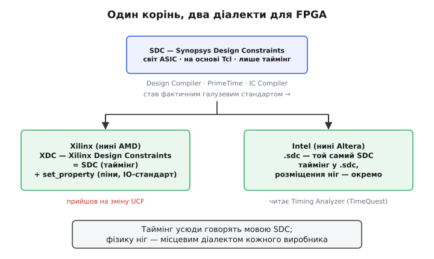

# 📜 Звідки взявся SDC: як формат зі світу великих мікросхем став спільною мовою

Коли ти вперше відкриваєш файл обмежень для FPGA і бачиш там `create_clock`, `set_input_delay`, `set_false_path`, легко подумати, що ці команди хтось вигадав саме для FPGA. Насправді ні. Ці слова прийшли з іншого світу — світу великих замовних мікросхем (ASIC), де їх придумали на десятиліття раніше, ще до того, як настільна FPGA стала масовою. І прийшли не випадково: за ними стоїть історія про те, як один формат від однієї фірми поволі витіснив усі інші й став тим, чим сьогодні є — спільною мовою, якою розмовляють інструменти конкурентів, що одне одного терпіти не можуть. Ця історія варта того, щоб її розповісти, бо вона пояснює найдивнішу рису файлу обмежень: чому в Xilinx і в Intel/Altera **однакові** команди для такту, але **різні** для ніг.

## Задача, якої раніше не існувало

Щоб зрозуміти, звідки взявся SDC, треба спершу відчути задачу, яку він розв'язує, — а вона з'явилася не одразу. У 1970-х інженер малював мікросхему руками: транзистор за транзистором, доріжку за доріжкою. Таких схем було небагато, і людина, що їх креслила, тримала весь таймінг у голові. Питання «а чи вкладаємося ми в такт» вирішувалося олівцем на папері, бо елементів було кілька тисяч, і критичний шлях можна було пройти пальцем по кресленню.

Потім кількість транзисторів почала подвоюватися кожні пару років, і ручне креслення стало неможливим фізично. Схему більше не малювали — її **описували** [мовою опису апаратури](topic:hw-digital/hdl): «ось регістр, ось така логіка, тактуй цим сигналом». А з опису мікросхему вирощувала програма — **синтезатор**. Але тут і виникла нова, доти неіснуюча задача. Синтезатор бачить опис і розуміє, **що** робить схема. Він не знає одного: **наскільки швидко це має працювати**. Бо швидкість — не властивість опису. Це вимога, яку ставить інженер: «я хочу, щоб цей блок тягнув 200 мегагерц». З тексту схеми таку вимогу не вивести ніяк — її треба **сказати окремо**.

Ось у цей момент — коли синтез став машинним, а вимоги до часу лишилися людськими — і народилася потреба в окремому описі часових вимог. Комусь треба було придумати мову, якою інженер каже машині: ось мій цільовий такт, ось звідки й куди йдуть дані на межі блоку, а отут не перевіряй — цим шляхом робоче не біжить. Саме цю мову згодом і назвуть SDC.

## Synopsys і машина, що вирощує схеми

Фірму, яка цю мову породила, заснували в грудні 1986 року — спершу під назвою Optimal Solutions, у Research Triangle Park у Північній Кароліні; наступного року вона перебралася до Каліфорнії й перейменувалася на **Synopsys**. За нею стояв гурт інженерів, що вийшов з дослідницької групи General Electric з автоматизованого проєктування; фактичним лідером і головним обличчям фірми був **Арт де Ґеус** (нід. *Aart de Geus* — голландець за походженням, який приніс у справу докторські дослідження з логічного синтезу з Університету Карнеґі — Меллона). *(Дати й імена звірені з життєписом Synopsys та біографією де Ґеуса — статус: підтверджено.)*

> 🔧 **Навіщо це.** Важливо не саме ім'я фірми, а **звідки** прийшов формат: не з боку FPGA, а з боку синтезу великих мікросхем. Це пояснює всю подальшу асиметрію. У SDC ідеально розроблено все, що стосується **часу** (бо синтез ASIC — це передусім боротьба за таймінг), і геть нічого немає про **фізичні ноги корпусу** (бо в ASIC ноги розводять зовсім інакше, ніж у готовому FPGA). Саме тому FPGA-виробникам довелося SDC **доповнювати** — а не тому, що вони полінувалися зробити своє.

Перший і головний продукт Synopsys вийшов 1987 року й називався **Design Compiler** (англ. *Design Compiler* — «компілятор проєкту»). Назва точна: як компілятор перетворює текст програми на машинні інструкції, так Design Compiler перетворював опис схеми [мовою опису апаратури](topic:hw-digital/hdl) на готову сітку логічних елементів. Це був переворот. Те, що раніше кресли́ли місяцями, тепер синтезувалося за тижні, і галузь ухопилася за цей інструмент обома руками — бо кількість транзисторів росла швидше, ніж встигали інженери з олівцями.

Але щоб Design Compiler синтезував схему **правильно**, йому треба було сказати мету: під який такт оптимізувати, які затримки на межах, де не старатися. Ці вказівки писали окремими командами, і набір цих команд поступово усталився у формат, який назвали за фірмою — **SDC**, *Synopsys Design Constraints*, «обмеження проєкту від Synopsys». Той самий опис часових вимог потім читали й інші інструменти тієї ж фірми: **PrimeTime** — окремий аналізатор таймінгу (перевіряє час, коли схема вже зібрана), і пізніший **IC Compiler** — трасувальник (розкладає елементи по кристалу й веде доріжки). Один формоопис — троє інструментів однієї родини.

## Чому саме Tcl, а не власна мова

Тут варто спинитися на технічному рішенні, яке з висоти сьогодення виглядає очевидним, а тоді таким не було: SDC зробили **не окремою власною мовою, а надбудовою над [Tcl](topic:sf-lang/tcl)** — готовою мовою сценаріїв, яку саме в ті роки почали вбудовувати всюди, де інструментові потрібна була якась «мова керування».

Чому це важило? Уяви альтернативу: фірма вигадує власний синтаксис із власними правилами — власними дужками, власними змінними, власним способом писати цикл. Тоді кожен інженер мусив би вчити ще одну, ні на що не схожу мову, а сама фірма — вічно її доробляти й лагодити. Натомість Synopsys сказала: команди на кшталт `create_clock` — це просто **команди Tcl**. І одразу задарма отримала все, що в Tcl уже було: змінні, цикли, підстановку `[...]`, можливість написати не статичний список, а справжній маленький **сценарій**, який сам обчислює, скільки в дизайні тактів і як їх назвати.

```
# завдяки Tcl обмеження — не мертвий список, а сценарій:
# один цикл прибиває однаковий стандарт відразу всім лініям шини
foreach pin {D0 D1 D2 D3 D4 D5 D6 D7} {
    set_property IOSTANDARD LVCMOS33 [get_ports $pin]
}
```

Оце рішення — «не власна мова, а надбудова над Tcl» — і є першою причиною, чому SDC згодом так легко розповзся по всій галузі. Формат, який є діалектом **уже відомої** мови, підхопити набагато простіше, ніж чужу вигадку з нуля: інструментові-читачеві досить вбудувати той самий Tcl-тлумач і навчити його жменьки нових команд. Саме тому й досі перше, що бентежить новачка у файлі обмежень, — що це **не таблиця налаштувань, а програма**, яку виконують згори вниз. Ця риса не примха: вона родом з дня, коли SDC вирішили будувати на Tcl.

## Як формат однієї фірми став спільним для всіх

Тепер найцікавіше — момент, коли SDC перестав бути «внутрішнім форматом Synopsys» і став тим, що інженери називають **фактичним стандартом** (англ. *de facto standard* — стандарт «за фактом», якого всі дотримуються не тому, що хтось наказав, а тому, що так склалося). Це різниця тонка, але принципова. Є стандарти **юридичні** — коли комітет збирається, голосує й видає документ із номером (так, скажімо, роблять стандарти на мову C чи на USB). А є стандарти **фактичні** — коли жодного комітету не було, а формат усе одно став обов'язковим, бо його прийняли всі, і не прийняти вже не можна: інакше твій інструмент нікому не потрібен.

SDC пішов другим шляхом, і ось чому це сталося майже неминуче. Design Compiler у 1990-х став практично безальтернативним у синтезі ASIC — величезна частка мікросхем у світі проходила через нього. А отже, **усі часові вимоги для цих мікросхем уже були записані мовою SDC**. І тепер уяви, що ти робиш конкурентний інструмент — свій аналізатор таймінгу чи свій трасувальник. Перед тобою вибір: або вигадати власний формат обмежень (і тоді жоден клієнт не зможе принести до тебе свої напрацьовані файли — доведеться все переписувати руками, а на це ніхто не піде), або **прочитати той самий SDC**, що вже лежить у клієнта. Вибір, по суті, зроблено за тебе. Так формат Synopsys поволі всмоктали всі — не з любові до Synopsys, а тому що інакше твій продукт мертвий у колисці.

> 🔧 **Навіщо це.** Ця логіка — «читай те, що вже написано у всіх» — і є двигун, який робить формат стандартом. Її корисно бачити, бо вона повторюється всюди в техніці: перемагає не найкращий формат, а той, у якому вже **накопичено роботу**. SDC переміг не тому, що елегантніший за уявних суперників, а тому, що на ньому вже було записано вимоги до половини мікросхем планети, і переписувати цю гору ніхто не хотів.

Так замкнулося коло: що більше інструментів читали SDC, то невигідніше було писати обмеження в чомусь іншому; що менше писали в іншому, то обов'язковіше кожен новий інструмент мусив розуміти SDC. Формат перетворився на **спільну мову таймінгу** — те, чим лишається й сьогодні. Варто додати чесну засторогу: єдиного офіційного тексту-стандарту, який усі підписали, за SDC довго не було — це справді «стандарт за фактом», а не за печаткою; сам формат тим часом жив і нумерувався версіями (наприклад, у пізніх версіях додали дрібниці на кшталт можливості лишати коментар до команди). *(Статус: підтверджено, що SDC — Tcl-заснований формат, який читають Design Compiler, PrimeTime та IC Compiler і який підхопили сторонні виробники; точні номери й дати ранніх версій формату публічно задокументовані слабко — тут статус радше «усталене галузеве знання», ніж «звірена дата».)*


*Формат народився для синтезу великих мікросхем і лише потім розійшовся у FPGA двома діалектами; спільним лишився таймінг, розійшлася — фізика ніг.*

## Коли SDC прийшов у світ FPGA

Тепер повернімося до FPGA — і побачимо, чому історія роздвоїлася. FPGA-виробникам теж потрібно було, щоб інженер задавав такт і перевіряв таймінг. Винаходити для цього власну мову було б божевіллям: інженери **вже вміли** писати `create_clock`, бо звикли до нього у світі ASIC, і будь-який свій формат довелося б їм нав'язувати проти звички. Тому виробники FPGA зробили розумно — **узяли готовий SDC** для всього, що стосується часу. І тут вони збіглися: команди такту, затримок, винятків у Xilinx і в Intel/Altera по суті ті самі, бо в обох це той самий успадкований SDC.

Розбіжність почалася там, де SDC **мовчить**, — на фізичних ногах. Пригадаймо: SDC народився для ASIC, а в ASIC немає готового корпусу з пронумерованими ногами, до яких треба прибити сигнали, — там кристал проєктують від початку. Тож у чистому SDC просто **немає** команди «посади цей сигнал на ногу H5 і задай їй логіку 3.3 вольта». А для FPGA це половина всієї роботи! Ноги реальні, їх сотні, вони вже розведені на платі, і без прив'язки до них плата не заведеться. Цю прогалину кожен виробник мусив закрити сам — **своїм** розширенням. Тут єдина мова й закінчилася, а почалися діалекти.

### Xilinx: від UCF до XDC

У Xilinx (яку 2022 року поглинула **AMD**, тож нині це формально формат AMD) старим власним форматом обмежень був **UCF** (англ. *User Constraints File* — «файл обмежень користувача»). UCF був **не** з родини SDC — це був свій окремий синтаксис, який Xilinx придумала до того, як SDC став неминучим. І в певний момент фірма визнала: тягнути власну мову, коли вся галузь говорить мовою SDC, безглуздо. З появою нового середовища проєктування **Vivado** (на початку 2010-х) Xilinx перейшла на новий формат — **XDC** (англ. *Xilinx Design Constraints*), який влаштований як гібрид: **таймінг у ньому — стандартний SDC**, а фізику ніг задають доданими командами `set_property`. За офіційним формулюванням AMD, обмеження XDC «ґрунтуються на стандартному форматі Synopsys Design Constraints (SDC)». *(Статус: підтверджено документацією AMD/Xilinx — XDC заснований на SDC й прийшов на зміну UCF з переходом на Vivado; конкретний рік переходу тут даю як початок 2010-х, бо різні джерела прив'язують його до перших випусків Vivado.)*

Перехід UCF → XDC був не косметичним перейменуванням, а зміною самої природи файлу. UCF був радше набором рядків-декларацій; XDC — це **[Tcl](topic:sf-lang/tcl)-сценарій**, який тлумач читає й виконує командами згори вниз, точно як SDC. Тому старі проєкти не можна було просто перейменувати — обмеження доводилося **переписувати**, розуміючи різницю, а не механічно перекладати. Це типова ціна, яку платять, коли власний формат нарешті поступається галузевому: разовий біль міграції в обмін на те, що далі говориш спільною мовою.

### Intel/Altera: просто `.sdc`

У таборі, який довго звався **Altera**, а з 2015 по 2025 рік належав **Intel** (2025-го Altera знову стала окремою фірмою), шлях був простіший і чесніший до самої назви. Тут часові вимоги кладуть у файл із розширенням **`.sdc`** — тобто прямо називають його ім'ям формату, без власної абревіатури. Читає цей файл аналізатор таймінгу, який колись мав ім'я **TimeQuest**, а нині зветься просто **Timing Analyzer**; в описах Altera його прямо називають аналізатором «ASIC-міцності, що підтримує галузевий стандарт SDC». Розміщення ж ніг тут задають **окремо** від таймінгу — власними механізмами середовища Quartus, не в тому самому `.sdc`. *(Статус: підтверджено документацією Altera/Intel — таймінг у файлі `.sdc`, який читає TimeQuest / Timing Analyzer як SDC-формат.)*

Варто відзначити й тіньовий бік цієї спадкоємності. У давніших версіях Quartus жив старіший, «класичний» шлях аналізу таймінгу зі своїми настройками; SDC-підхід через TimeQuest прийшов йому на зміну для новіших родин чипів і поступово став єдиним. Тобто навіть усередині одного виробника перемога SDC не була миттєвою — старий спосіб якийсь час доживав поруч, аж доки його не витіснив формат, яким уже говорила решта світу.

## Що з цієї історії лишається в руках інженера

Складімо докупи, бо за іменами й датами легко втратити головну думку. Формат файлу обмежень **роздвоєний рівно по лінії свого походження**. Усе, що стосується **часу** — такт, затримки на межах, винятки, — прийшло з єдиного кореня, зі світу синтезу великих мікросхем, з формату SDC фірми Synopsys, і тому виглядає майже однаково хоч у Xilinx/AMD, хоч в Intel/Altera. А все, що стосується **фізичних ніг** корпусу, SDC ніколи не покривав — бо для ASIC це не мало сенсу, — і тому кожен FPGA-виробник закрив цю прогалину **власним** діалектом: `set_property` у XDC в одних, окремий механізм Quartus в інших.

Практична вигода з цього знання цілком відчутна. Коли ти переносиш дизайн з інструмента одного виробника до іншого, **таймінгова частина** обмежень переїжджає майже дослівно — бо це спільний SDC, і `create_clock` там і там означає те саме. А от **прив'язку ніг** доведеться переписати повністю, бо вона написана місцевим діалектом, і в новому середовищі команди інші. Розуміння, **чому** так — що одне з єдиного кореня, а друге з окремих гілок, — рятує від зайвого клопоту: не намагаєшся перекласти те, що й так однакове, і не сподіваєшся, що ноги «переїдуть самі».

І остання думка, ширша за самий файл. Історія SDC — це маленька, але дуже показова притча про те, як узагалі народжуються стандарти в техніці. Ніхто не збирав комітет, ніхто не наказував «усім писати такт мовою Synopsys». Просто один інструмент став настільки поширеним, що формат його вхідних даних перетворився на мову, якою **вигідно** говорити всім, — і не говорити нею стало неможливо. Ти щоразу торкаєшся цієї історії, коли пишеш перший рядок файлу обмежень: `create_clock` у твоєму FPGA-проєкті — це слово, придумане 1987 року для машини, що вирощувала зовсім інші мікросхеми, яке пережило свого першого хазяїна й стало спільним надбанням галузі.
