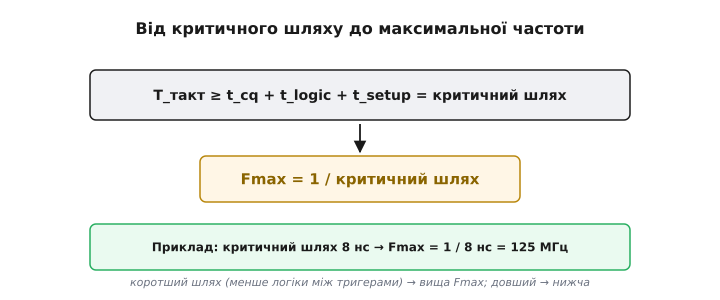
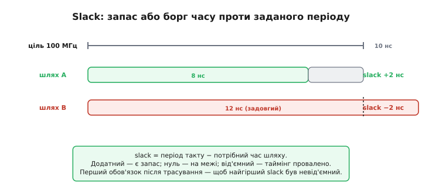
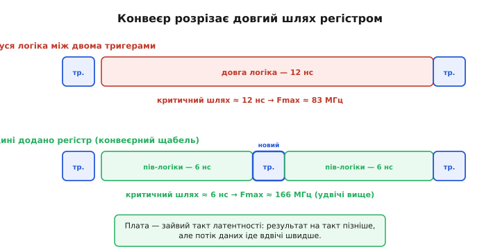

# Таймінг FPGA

Таймінг (від англ. *timing* — узгодження в часі) вирішує, що насправді обмежує частоту FPGA. Питання виростає з [setup/hold і метастабільності](root:hw-digital/metastability-timing), тільки прикладених не до однієї пари тригерів, а до цілого дизайну на десятки тисяч клітинок. Тема має репутацію складної, але її ядро напрочуд просте й тримається на одному понятті — **критичний шлях** (англ. *critical path*; *critical* — вирішальний, від грец. *kritikós* — той, що вирішує). Зрозумівши його, видно і звідки береться максимальна частота, і чому деякі дизайни «не збираються» на потрібному такті, і як це лікувати. Усе вирішується тим, що відбувається між двома фронтами такту.

### Що обмежує частоту: шлях від тригера до тригера

Уся синхронна схема (а майже всі дизайни на FPGA синхронні) працює [тактами](root:hw-digital/clock-signal): на кожному фронті тригери **захоплюють** нові значення, між фронтами комбінаційна логіка ці значення **перемелює**. Питання частоти зводиться до одного: чи встигає сигнал за **один період** такту вийти з одного тригера, пройти логіку й **усістися** на вході наступного?


*Сума трьох часів — вийти з джерела (t_cq), пройти логіку (t_logic), устигнути на setup — і є довжина перегону; найдовший перегін у дизайні зветься критичним.*

Саме тут абстрактний таймінг оживає. **Setup-час** (англ. *set up* — наставити, підготувати) — це інтервал перед фронтом, протягом якого вхід тригера має вже бути стабільним, інакше тригер [зірветься в метастабільність](root:hw-digital/metastability-timing). Поруч живе **hold-час** (англ. *hold* — утримувати) — скільки даним триматися стабільними вже **після** фронту; його ламають надто **швидкі** шляхи, тоді як частоту обмежують надто повільні, тож у розмові про Fmax головний — setup. На рівні цілого дизайну setup працює так: сигнал, що виходить із джерела, **зобов'язаний** прибути на приймач не пізніше ніж за t_setup до наступного фронту. Загальний час подорожі складається з трьох частин: вийти з джерела (t_cq, від англ. *clock-to-Q* — від фронту такту до появи на виході Q), пролетіти логіку й дроти (t_logic) і встигнути на setup. Цей маршрут «від тригера до тригера» — і є той самий «один крок» роботи [програмовної логіки](root:hw-digital/programmable-logic), що відрізняє її від процесорного такту. А оскільки в дизайні таких шляхів безліч, доля частоти вирішується **найдовшим** із них.

### Від критичного шляху до Fmax

Найдовший шлях і є критичний, і саме він диктує, наскільки коротким може бути такт. Звідси — формула максимальної частоти, проста й невблаганна.


*Період такту впирається в критичний шлях, тож максимальна частота Fmax = 1 / критичний шлях: шлях 8 нс дає 125 МГц.*

Логіка тут залізна, і її варто проговорити. Якщо найдовший шлях триває, скажімо, 8 наносекунд, то давати новий фронт частіше ніж раз на 8 нс **не можна**: сигнал на найповільнішому маршруті просто не добіжить, приймач захопить недороблене значення й зірветься. Отже, період такту обмежений знизу критичним шляхом, а частота — обмежена зверху: **Fmax** (від англ. *frequency* — частота, *maximum* — найбільша) **= 1 / критичний шлях**. Наслідок цього протилежний звичній інтуїції про [тактову частоту процесора](root:hw-arch/clock-frequency): частоту тут визначає **не паспортний показник чипа**, а **сам дизайн** — те, скільки логіки нагромаджено між тригерами. Покладеш багато — шлях довгий, Fmax низька; розкладеш ощадливо — навпаки. Інструмент же має сказати, чи вкладається критичний шлях у бажаний такт, і робить це через поняття запасу.

### Slack: запас або борг часу

Після [трасування дизайну](root:embedded/fpga-flow) інструмент рахує **таймінг-аналіз**: для кожного шляху порівнює потрібний час із доступним періодом такту. Різниця зветься **slack** (англ. *slack* — провис, вільний запас, як ненатягнутий кінець мотузки), і її знак — це вирок дизайну.


*При цілі 10 нс шлях на 8 нс дає запас +2 нс, а шлях на 12 нс — борг −2 нс: від'ємний slack означає провалений таймінг.*

Поняття slack робить таймінг **вимірюваним**, і саме ним оперує розробник щодня. Додатний slack означає «встигаємо із запасом стільки-то наносекунд» — добре, дизайн працюватиме надійно. Нуль — «рівно на межі», тривожно. **Від'ємний** slack — «не встигаємо», і це вирок: на заданій частоті схема працюватиме ненадійно або не працюватиме зовсім, бо найдовший шлях не вкладається в період. Тому, отримавши результат трасування, дивляться на **найгірший** (worst-case) slack по всьому дизайну: якщо він невід'ємний — таймінг зійшовся, можна заливати; якщо ні — треба втручатися. Найчастіше втручання зводиться до одного перевіреного прийому — розрізати довгий шлях.

### Як лікують довгий шлях: конвеєр

Що робити, коли slack від'ємний — критичний шлях задовгий? Очевидне «знизити частоту» рятує не завжди, бо частота буває задана ззовні (швидкістю інтерфейсу, потоком даних). Головний прийом інший: **розрізати** довгий шлях тригером навпіл, перетворивши його на дві коротші ділянки. Це і є **конвеєризація** (англ. *pipelining*, від *pipeline* — трубопровід, де порції течуть одна за одною) — той самий [конвеєр, що пришвидшує процесор](root:hw-arch/pipeline).


*Регістр посередині ділить логіку навпіл — критичний шлях падає з 12 до 6 нс, Fmax росте з 83 до 166 МГц ціною зайвого такту латентності.*

Так змикаються дві ідеї цифрової техніки. У [процесорі конвеєр](root:hw-arch/pipeline) перекриває стадії команди; у FPGA він стає універсальним інструментом таймінгу. Суть та сама: довгий шлях — це багато роботи за один такт; уставивши регістр посередині, ми ділимо роботу на **два** такти, і кожна половина тепер коротша, тож період можна вкоротити, а Fmax підняти. Платимо тим самим, що й у процесорі: **латентністю** (англ. *latency* — затримка) — результат тепер виходить на такт пізніше, бо проходить через зайвий регістр. Але **пропускна здатність** при цьому навіть зростає: дані течуть конвеєром швидше. Це фундаментальний компроміс цифрового проєктування — більше тактів затримки заради вищої частоти, — і на FPGA ним користуються постійно.

**Приклад (порахуймо Fmax до й після конвеєра).** Нехай ланцюг логіки між тригерами дає таку розкладку часу.

```
Параметри (типові порядки для навчального прикладу):
  t_cq    (clock-to-Q тригера)        = 0.5 нс
  t_setup (вимога setup приймача)      = 0.5 нс
  t_logic (затримка логіки на шляху)   = 11.0 нс   ← домінує

Критичний шлях = t_cq + t_logic + t_setup
              = 0.5 + 11.0 + 0.5 = 12.0 нс
Fmax = 1 / 12.0 нс ≈ 83.3 МГц

Розрізаємо логіку регістром навпіл (по 5.5 нс кожна половина):
  новий t_logic однієї ділянки = 5.5 нс
  критичний шлях = 0.5 + 5.5 + 0.5 = 6.5 нс
Fmax = 1 / 6.5 нс ≈ 153.8 МГц     (майже вдвічі вище)

Ціна: латентність зросла з 1 такту до 2 (результат на такт пізніше).
```
Висновок: вузьке місце — t_logic; розрізавши його регістром, ми майже подвоїли частоту ціною одного зайвого такту затримки.

> 🔧 **Навіщо це.** Таймінг — це те, на що розробник FPGA дивиться **після кожної збірки**, тож варто завести три звички. Перша: **читати найгірший slack** — невід'ємний означає «дизайн працюватиме на цій частоті», від'ємний означає «ні», і доти, доки він від'ємний, заливати чип немає сенсу. Друга: **скорочувати критичний шлях**, а не «оптимізувати код» у софтовому сенсі — менше рівнів логіки між тригерами, обережніше з довгими ланцюгами арифметики; саме це, а не кількість рядків [мовою опису апаратури](root:hw-digital/hdl), визначає швидкість. Третя: **конвеєризувати**, коли частоти бракує, — додавати регістрові щаблі, свідомо обмінюючи латентність на Fmax. Ці три звички відрізняють дизайн, що надійно працює на потрібній частоті, від такого, що «то працює, то ні».

> 🧮 Аналізатор рахує запас не для одного перегону, а для кожного приймача водночас, і називає найгірший — WNS; саме він задає Fmax усього дизайну, а головну вагу в ньому несе не логіка, а маршрут між клітинками. Повний розрахунок — у статті про [статичний часовий аналіз](root:hw-digital/static-timing-analysis).

---

Коротко про головне: частоту FPGA обмежує **критичний шлях** — найдовший маршрут «від тригера до тригера». За один період такту сигнал має вийти з джерела (t_cq), пройти логіку (t_logic) і встигнути на вхід приймача за t_setup до фронту (інакше — [метастабільність](root:hw-digital/metastability-timing)); сума цих часів на найдовшому шляху не може перевищувати період. Звідси **Fmax = 1 / критичний шлях**, і визначає її **сам дизайн**, а не паспорт чипа. Інструмент рахує **slack** = період − потрібний час: додатний — встигаємо, від'ємний — **таймінг провалено**; найперше перевіряють найгірший slack. Лікують довгий шлях [**конвеєризацією**](root:hw-arch/pipeline): розрізають логіку регістром навпіл, кожна половина коротшає, Fmax росте — ціною зайвого такту **латентності**, але з вищою пропускною здатністю.
