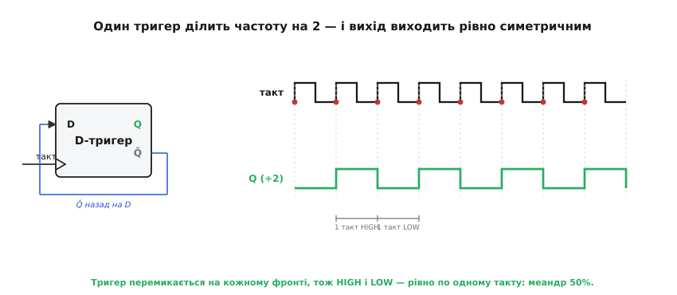
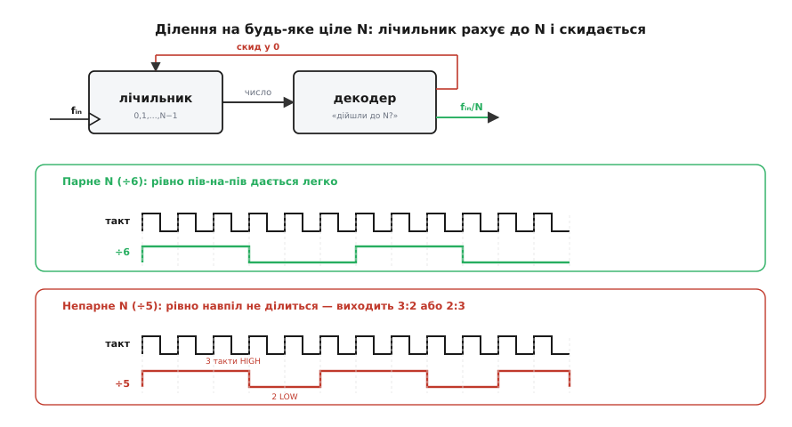
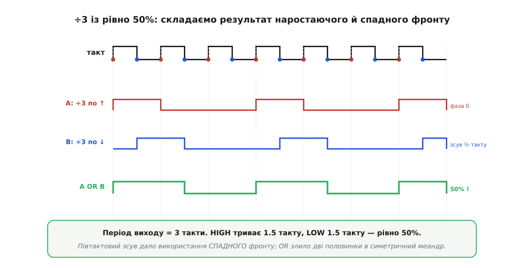

# Дільник частоти

Кожна цифрова схема живе за одним ритмом — [тактом](topic:hw-digital/clock-signal), рівномірною прямокутною хвилею, під яку вона крокує. Але ритм у кристалі часто буває **один-єдиний**: кварц видає, скажімо, 16 МГц, і саме стільки, назавжди. А в реальній машині різним вузлам потрібні різні швидкості: цьому лічильнику — 1 МГц, тому індикаторові — 1 Гц, іншій периферії — 2 МГц. Виникає буденна, але фундаментальна задача — узяти одну наявну частоту й зробити з неї **повільнішу**, точно в задане число разів. Схема, що це робить, зветься **дільником частоти** (англ. *frequency divider*, від лат. *dividere* — розділяти): на вхід їй іде частота fᵢₙ, а на виході з'являється fᵢₙ поділена на ціле N.

Варто одразу відділити **функцію** від конкретного заліза. «Дільник частоти» — це не окрема мікросхема й не якийсь особливий вентиль; це **роль**, яку виконує послідовнісна схема з пам'яттю. Ту саму роль під іншими іменами грають [лічильник](topic:hw-digital/counters) (коли ту саму лічбу читають як число), [прескейлер](topic:hw-digital/prescaler) (коли дільник ставлять першим, перед швидкою логікою) чи ділянка [таймера](topic:hw-digital/clock-signal). А вкладений у зворотну петлю [фазового автопідстроювання](topic:hw-analog/phase-locked-loop), той самий дільник ÷N обертається геть на протилежне — на **множник** частоти: петля жене генератор доти, доки поділена ним частота не збіжиться з опорною, тож генератор іде рівно в N разів швидше за неї. Тут ми дивимося саме на **ділення як таке**: як зі швидкої хвилі народжується повільна, чому найпростіший дільник дає ідеально симетричний вихід, і де ховається єдина по-справжньому підступна дрібниця — форма вихідного імпульсу при непарному N.

### Ділення на 2 — і чому вихід задарма симетричний

Почнімо з найдрібнішого дільника, з якого будується решта, — **÷2**. Уся його суть в одному [D-тригері](topic:hw-digital/d-flip-flop), у якого вхід D з'єднано з власним інвертованим виходом Q̄. Тригер захоплює те, що на D, лише на активному фронті такту — а на D сидить **протилежне** до поточного Q. Тому на кожному фронті Q перевертається: був 0 — став 1, був 1 — став 0. Виходить нескінченне 0, 1, 0, 1… Такий тригер, увімкнений «сам на себе», перемикається щотакту й зветься **T-тригером** (англ. *toggle* — перемикати).

Порахуймо, що сталося з частотою. Щоб Q пройшов **повний** цикл — з 0 в 1 і знову в 0, — потрібні **два** активні фронти такту, тобто два повні періоди вхідної хвилі. Отже, період виходу вдвічі довший за вхідний, а частота — рівно вдвічі менша. Один тригер поділив частоту на два.


*Вхід D під'єднано до власного Q̄, тож на кожному фронті такту Q перевертається. Повний цикл виходу займає два фронти = два періоди такту, тому Q удвічі повільніший. І, головне, кожна половина виходу триває рівно один такт: HIGH — один період, LOW — один період. Форма виходу — ідеальний меандр 50%, і це виходить само собою.*

Тут ховається результат, вартий окремої зупинки. Вихід ÷2 має **рівно 50% [шпаруватості](topic:hw-digital/clock-signal)** (частка часу у високому рівні) — не «приблизно», а **точно за побудовою**, і геть незалежно від того, наскільки кривий сам вхідний такт. Ось чому. Q міняє рівень **тільки** на активному фронті — скажімо, на наростанні. Між двома сусідніми наростаннями лежить рівно один період такту. Q тримає високий рівень від одного наростання до наступного (один період), тоді низький — до ще наступного (ще один період). Половинки виходу відміряні **однаковими** проміжками — відстанню між однойменними фронтами, — тож вони рівні одна одній **автоматично**. Навіть якщо вхідний такт сам був несиметричний (HIGH коротший за LOW), дільника ÷2 це не обходить: він дивиться лише на наростання, а між наростаннями завжди повний період.

> 🔧 **Навіщо це.** Симетрія виходу — не косметика. Багато вузлів (керування вихідним каскадом, змішувачі в радіо, входи інших дільників) хочуть саме меандр 50%, бо несиметричний сигнал вносить парні гармоніки й зайві завади. Найдешевший спосіб **очистити** шпаруватість брудного генератора — пропустити його крізь ÷2: на виході, хай яким кривим був вхід, буде рівно пів-на-пів. Тому подвоєний кварц із наступним ÷2 — типовий трюк, щоб дістати чистий такт потрібної частоти.

### Ланцюг: ділення на 2, 4, 8, 16…

Один тригер ділить на 2 — а що, як послідовно з'єднати кілька, тактуючи кожен наступний виходом попереднього? Перший поділить fᵢₙ на 2. Для другого тригера «тактом» служить уже поділена вдвічі хвиля, тож він поділить її ще навпіл — разом на 4. Третій — на 8, четвертий — на 16. N тригерів поспіль ділять частоту на **2ᴺ**. Кожен вихід у цьому ланцюгу — теж чистий меандр 50% (кожен тригер ділить на 2 за тим самим правилом), просто дедалі повільніший.

Такий ланцюг, де кожен тригер тактується попереднім, зветься **ланцюговим** (англ. *ripple* — брижі: перемикання «брижами» біжить розрядами) і дає ділення лише на **степені двійки**. За копійчану простоту доводиться платити тим, що зміна не миттєва: старший тригер перемкнеться лише після того, як спрацював молодший, той — після ще молодшого, і так уся черга. Кожен тригер додає свою [затримку поширення](topic:hw-digital/gate-timing), тож вихід останнього відстає від фронту такту на **суму** затримок усіх ланок. Для самого ділення частоти це зазвичай байдуже — важлива лише **частота** виходу, а не мікроскопічний зсув його фронту. Але якщо кілька поділених сигналів треба звести докупи або підхопити спільним тактом, цей розбіг фаз між ланками стає джерелом [глітчів](topic:hw-digital/glitch-combinational); тоді замість ланцюгового будують [синхронний](topic:hw-digital/synchronous-counter), де всі тригери перемикаються від одного спільного такту одночасно.

### Ділення на будь-яке ціле: лічильник плюс детектор межі

Степенів двійки рідко досить. Щоб дістати 1 МГц із 16 МГц, треба поділити на 16 — гаразд, це 2⁴. А щоб дістати рівно 1 МГц із 10 МГц, треба поділити на **10**, а десять — не степінь двійки. Потрібне ділення на **довільне** ціле N.

Ідея природно виростає з попереднього. Візьмімо звичайний двійковий лічильник (той самий ланцюг тригерів, лише читаний як число) і **додаймо детектор**, що стежить за станом і, щойно лічильник добіг до N, **скидає** його в нуль. Тоді лічильник ганяє по колу 0, 1, 2, …, N−1, 0, 1, … — і повертається в нуль **раз на N тактів**. Це і є [лічильник за модулем N](topic:hw-digital/counters) (*modulo-N*, від лат. *modulus* — міра). Будь-який сигнал, що спрацьовує раз за оберт кола — момент скидання, або старший біт, або окремий вихід «переповнення», — має частоту рівно fᵢₙ / N.


*Лічильник крокує від нуля, декодер («дійшли до N?») скидає його назад у нуль — оберт займає N тактів, тож вихід іде на частоті fᵢₙ/N. Для **парного** N (÷6) поділити оберт навпіл легко: тримаємо вихід високим перші N/2 тактів і низьким решту — виходить рівно 50%. Для **непарного** N (÷5) навпіл не ділиться: 5 тактів не розкладаються на дві однакові половини, тож найпростіший вихід дає 3:2 (60%), а не 50%.*

Тепер стає видно, звідки береться єдина справжня складність усієї теми. Задати **частоту** ділення легко: скільки треба, до того й лічимо. А от **форма** вихідного імпульсу залежить від парності N. Якщо N **парне**, оберт кола складається з парного числа тактів, і його чесно ділять на дві однакові половини: перші N/2 тактів вихід тримають високим, наступні N/2 — низьким. Виходить рівно 50%. Але якщо N **непарне** — скажімо, 5, — оберт має непарне число тактів, і **жоден** цілий поріг не розрубає його навпіл: 5 = 3 + 2, і найкраще, що дає проста схема, — це 3 такти в одному рівні й 2 в іншому, тобто 60% або 40%. Рівної половини цілими тактами не буває.

Часто-густо це не проблема: якщо дільник живить наступний лічильник, тому байдуже до шпаруватості — він реагує лише на фронти. Але коли на виході має бути **чистий такт 50%** (для радіо, для тактування, для змішувача), непарне ділення потребує окремого прийому.

### Непарне ділення з рівно 50%: зіграти на спадному фронті

Розв'язок красивий, і будується він просто на очах. Уся біда непарного N у тому, що ми дозволили виходові міняти рівень **лише на наростаючому** фронті — а цілими тактами непарний період навпіл не ріжеться. Але між двома наростаннями є ще один момент, яким досі нехтували: **спадний** фронт такту, рівно посередині періоду. Він дає нам можливість зсунути подію на **пів такту** — а пів такту — це якраз половина тієї «зайвої» непарності, якої бракувало для симетрії.

Зробімо два однакові дільники ÷3. Перший веде свій вихід по **наростаючому** фронту — його імпульс, скажімо, високий перший такт із кожних трьох (33%). Другий будуємо так само, але тактуємо його **спадним** фронтом — його точнісінько така сама хвиля виходить **зсунутою на пів такту** праворуч. А тепер **складемо** обидві через АБО. Там, де перша хвиля вже спала, друга ще тримається зайві пів такту — і навпаки. Дві несиметричні тридцятитрьохвідсоткові хвилі, зсунуті на пів такту, зливаються в один імпульс, що триває **півтора** такту, після якого йде **півтора** такту паузи. Період — три такти, а половини — рівні. Вийшов ідеальний меандр 50% при діленні на непарне число.


*Хвиля A (÷3 по наростаючому фронту) висока перший такт із трьох. Хвиля B — та сама, але тактована спадним фронтом, тож зсунута рівно на пів такту. Їхнє АБО дає імпульс завдовжки півтора такту й паузу півтора такту: період 3 такти, половини рівні — 50%. Ключ у тому, що спадний фронт додав саме той піврозмір, якого бракувало непарному N для симетрії.*

Ось у чому глибша думка: щоб поділити на непарне число з рівною шпаруватістю, схемі мало **одного** фронту такту — вона мусить скористатися **обома**, наростаючим і спадним. Наростаючий дає цілі такти, спадний — недостаючі половинки. Цей прийом («подвійний фронт») — стандарт для непарних дільників у синтезаторах і тактових деревах; за ним стоїть довга [історія боротьби за симетричний вихід](topic:hw-digital/frequency-divider/hist-odd-symmetry.md), із першими патентами ще з початку 1980-х.

### Той самий дільник — у прошивці

Апаратна ідея дослівно переноситься в код, і побачити її там корисно, бо стає видно кожну дрібницю. Програмний дільник — це змінна-лічильник: на кожній вхідній події її нарощують, а коли добігла до межі, скидають і перемикають вихід. Скидання в нуль грає роль детектора з попередньої схеми, а перемикання виходу — роль T-тригера.

**Умова.** На вхід (ніжка перериває процесор на кожному наростанні) надходить сигнал fᵢₙ. Треба видати на вихідну ніжку сигнал fᵢₙ / 8 — тобто поділити на 8. Скільки лічити?

```c
#define N 8u                       // на скільки ділимо частоту

volatile uint32_t out_periods = 0; // повних періодів виходу (для обліку)

void on_input_edge(void) {         // виклик на кожному наростанні входу
    static uint8_t cnt = 0;        // лічильник обертів (як ланцюг тригерів)
    if (++cnt >= N) {              // добігли до N —
        cnt = 0;                   // скид у 0 (як mod-N повертається в нуль)
        OUT_PIN ^= 1u;             // перемикаємо вихід (^=1 — це toggle-тригер у коді)
        out_periods++;             // рахуємо повні періоди виходу
    }
}
```

Тут одразу видно тонкість, яку в залізі легко проґавити. Ми перемикаємо вихід **раз на N** вхідних фронтів, тобто повний період виходу — це один HIGH-відрізок плюс один LOW-відрізок — займає **2·N** вхідних фронтів. Тому цей код ділить не на 8, а на **16**. Якщо мета — поділити рівно на 8, лічити треба до 4: перемикання виходу через кожні N/2 фронтів дає повний період у N фронтів. Загальне правило просте: **перемикання** виходу ділить на подвоєне число обертів, бо один період виходу — це два перемикання. А заразом виринає та сама межа парності: рівний за тривалістю HIGH і LOW цілими вхідними фронтами вийде лише тоді, коли N/2 — ціле, тобто коли N парне. Для непарного N доведеться або миритися з нерівними половинами, або, як у залізі, чіплятися і за спадний фронт входу.

> 🔧 **Навіщо це.** Дільник у прошивці — щоденний прийом: поділити частоту енкодера, зробити з такту периферії повільніший строб, згенерувати тон. Дві пастки, видимі просто з коду. Перша: `^= 1` ділить на **2·N**, а не на N, — легко помилитися вдвічі. Друга: рівна шпаруватість цілими тактами буває лише для парного дільника. І третя, невидима в цьому фрагменті: якщо вхід — брудний механічний сигнал, [дребезг контакту](topic:hw-digital/contact-debounce) накрутить зайві фронти, і дільник почне брехати; такий вхід спершу чистять.
