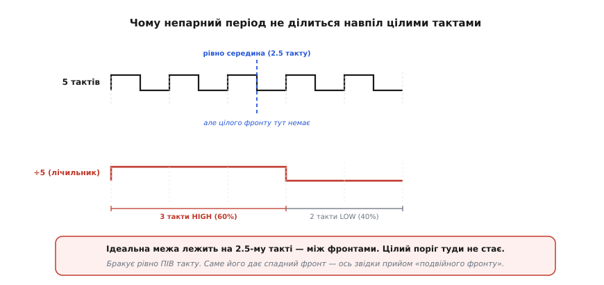

# 📜 Боротьба за симетричний вихід при непарному діленні

Є задачі, які виглядають дрібними, аж поки не сядеш їх розв'язувати. «Поділи частоту на три й зроби вихід рівним меандром» — звучить так, наче це має вийти саме собою, як виходить ділення на два. Але не виходить. І ця непіддатливість не випадкова: вона вшита в саму арифметику непарного числа. Ціле покоління інженерів натикалося на неї щоразу, коли треба було з однієї частоти зробити повільнішу в непарне число разів — і водночас чисту, пів-на-пів. Історія цієї маленької впертості веде від хитрощів із порядком з'єднання лічильників, через швидку логіку радіолічильників 1970-х, до акуратних цифрових патентів початку 1980-х, які нарешті сказали прямо: щоб чесно поділити на непарне, схемі мало **одного** фронту такту — вона мусить узяти **обидва**.

## Чому три ніяк не ділиться навпіл

Спершу треба відчути, у чому саме затик, бо без цього вся подальша винахідливість здається метушнею на рівному місці. Ділення на два дає рівний меандр задарма (див. основну статтю), бо один тригер перемикається на кожному активному фронті: HIGH триває рівно один такт, LOW — рівно один такт, і половини не можуть не бути рівними. Симетрія тут не мета зусиль, а безкоштовний наслідок того, що між двома однойменними фронтами завжди лежить цілий період.

А тепер спробуймо так само поділити на три. Найпростіша схема — лічильник, що рахує 0, 1, 2 і скидається; вихід тримають високим, поки лічильник у якихось із цих станів, і низьким у решті. Але три такти ніяк не розкладаються на дві рівні купки цілими тактами: три — це два плюс один, і хоч як переставляй, вийде або 2:1, або 1:2. Найкраще, що дає лічильник, — це два такти в одному рівні й один у другому, тобто шпаруватість 2/3 ≈ 67% (або 33%). Не 50%.

Те саме з будь-яким непарним N. Візьмімо п'ять. Ідеальна межа, що ділить п'ять тактів навпіл, лежить рівно посередині — на позначці 2.5 такту. А тактовий генератор дає фронти лише в цілих точках: на 0, 1, 2, 3, 4, 5. **Рівно посередині фронту немає.** Схема, що вміє міняти вихід тільки на своєму (наростаючому) фронті, змушена округлити цю межу до найближчого цілого — тобто поставити її на 2 або на 3. Звідси горезвісне 3:2: три такти HIGH, два LOW, шпаруватість 60%.

*П'ять тактів рівно навпіл ділить лінія на 2.5-му такті — а там, між фронтами, схемі нема за що зачепитися. Простий лічильник округлює межу до цілого й видає три такти HIGH проти двох LOW: 60% замість 50%. Бракує рівно **пів такту** — і вся подальша винахідливість цієї історії про те, як цей брак пів такту роздобути.*

Ось у чому суть: непарному N бракує до симетрії рівно **пів такту**. Не такту, не двох — половини. І доки схема бачить лише один фронт, узяти цю половину нізвідки. Уся історія боротьби — це, по суті, історія того, як інженери шукали, звідки взяти той нещасний півперіод.

> 🔧 **Навіщо це.** Коли непарний дільник живить наступний лічильник, шпаруватість байдужа — лічильник реагує лише на фронти, а не на те, скільки часу сигнал тримав рівень. Але щойно вихід дільника йде на щось, чутливе до форми — на змішувач у радіо, на тактовий вхід швидкої логіки, на двотактний вихідний каскад, — 3:2 стає справжньою проблемою: несиметричний сигнал тягне за собою парні гармоніки й з'їдає запас за часом. Саме такі застосування й змушували шукати чесні 50%.

## Перший обхід: не боротися, а переставити

Найраніший і найдешевший прийом узагалі не розв'язував непарної задачі — він її **уникав**. Ідея проста до нахабства: якщо тобі треба поділити на парне число, складене з непарного множника, постав непарний ступінь **першим**, а ділення на два — **останнім**.

Класичний приклад — поділити на десять. Десять — це п'ять помножити на два. Можна зробити ÷2, тоді ÷5 — а можна ÷5, тоді ÷2. Частота на виході однакова в обох випадках: поділена на десять. Але **форма** — різна. Якщо останнім стоїть ділення на п'ять (непарне), вихід успадкує його кривизну, 3:2. А якщо останнім стоїть ділення на два, то хоч яким кривим прийшов до нього сигнал від ÷5-ланки, тригер ÷2 перемкнеться на кожному його фронті й видасть рівний меандр. Ділення на два в кінці **завжди** випрямляє шпаруватість, бо воно дивиться лише на фронти вхідного сигналу, а не на його форму.

Цей трюк живий і донині — він буквально закладений у розведення ніжок класичних лічильників-мікросхем. У популярному [десятковому лічильнику](topic:hw-digital/counters) серії 7490 (і його нащадка 74HC390) навмисне зроблено дві окремі секції — ÷2 і ÷5, — щоб їх можна було з'єднати в потрібному порядку: хочеш просто поділити на десять — з'єднуй як зручно; хочеш **симетричний** вихід — жени сигнал спершу крізь ÷5, а ÷2 постав останнім. Одна й та сама мікросхема дає або кривий, або рівний вихід — залежно лише від того, яку секцію ти поставив у кінець ланцюга.

Але цей прийом має чіткі межі. Він працює тільки тоді, коли підсумкове N **парне** й його можна розкласти на «непарну середину плюс двійку в кінці». А для **самого непарного** N — поділити на 3, на 5, на 7 і лишити результат непарним — переставляння не рятує: нема куди сховати непарність, вона й є остаточний коефіцієнт. Для по-справжньому непарного ділення з рівними половинами потрібне щось інше.

## Швидка логіка радіо: коли непарність стала дорогою

Наприкінці 1960-х і в 1970-х задача з академічної перетворилася на нагальну — і винні в цьому радіо та вимірювальна техніка. З'явилися частотоміри й синтезатори, яким треба було лічити й ділити сигнали в сотні мегагерців, а тодішня звичайна логіка так швидко не встигала. Порятунком стала **емітерно-зв'язана логіка** (англ. *emitter-coupled logic*, ECL) — родина, де транзистори навмисне не заганяють у насичення, тож перемикаються дуже швидко. На ECL будували [прескейлери](topic:hw-digital/prescaler) — швидкі фронт-дільники, що ставали першими в ланцюгу й «пригальмовували» сигнал до частот, посильних для звичайних лічильників.

І тут непарність вилізла знову, але вже дорого. Щоб синтезатор міг перестроюватися по одному кроку сітки, а не стрибками, придумали **проковтування імпульсів** (англ. *pulse swallowing*): двомодульний прескейлер, що вміє ділити то на N, то на N+1. Найзнаменитіший такий чип — Fairchild 11C90 (близько середини 1970-х) — ділив на 10 або на 11 аж до 650 МГц і вище. А оскільки один із його режимів давав ділення на непарне (÷11), у ньому вже стикалися з тим самим: за замовчуванням його вихід був високим шість тактів і низьким п'ять — те саме нерівне 6:5, породжене непарним циклом. Розробники навіть виводили окремий керуючий вхід, яким можна було підправити зворотну логіку так, щоб вихід став п'ять на п'ять там, де це важило.

Тобто до кінця 1970-х картина була така: непарне ділення — усюди, де швидке радіо; його кривий вихід — відома морока; а способи його випрямити — набір ad hoc хитрощів, розкиданих по конкретних мікросхемах: десь переставляння секцій, десь керуючий вхід прескейлера, десь окремий тригер ÷2, доліплений ззаду. Загального, чистого, суто цифрового рецепту «поділи на непарне й дістань рівно 50%» ще не було сформульовано так, щоб його можна було просто повторити.

## Rockwell, 1982: сказати прямо — треба обидва фронти

Саме цю прогалину закрили два патенти, поданих однією компанією й одним винахідником на самому зламі десятиліть. **Rockwell International** — велика американська аерокосмічно-електронна корпорація — узяла в роботу винахід інженера на ім'я **Стівен Дж. Клендінінг** (Steven J. Clendening), і з нього виросли два документи з майже однаковою назвою: **«Divide by three clock divider with symmetrical output»** — «Дільник частоти на три з симетричним виходом».

Ключова заявка — **US 4 348 640 A**, подана **25 вересня 1980 року** й видана **7 вересня 1982 року**. Її супроводжує близнюк **US 4 366 394 A** з тією самою назвою — інший схемний підхід до тієї самої мети, того ж авторства й тієї ж компанії. *(Статус доказовості: усталено — це первинні патентні документи Патентного відомства США, з точними датами й іменами. Винахідник і правовласник — американські; жодної потреби в іншій національній атрибуції немає.)*

Що в них важливого — не самі схеми (їх відтоді вигадали десятки), а **чітко сформульована ідея**, як усе-цифровим шляхом, без аналогової [ФАПЧ](topic:hw-digital/prescaler) і без хитрих аналогових ліній затримки, дістати з непарного ділення рівний меандр. І обидва патенти, кожен по-своєму, зводяться до однієї думки: **скористатися й наростаючим, і спадним фронтом такту**.

Подивімося на обидва шляхи поруч — вони добре показують, що суть одна, а втілень багато.

*Ліворуч (US 4 348 640): два JK-тригери роблять проміжну частоту ⅔F, ще несиметричну, а ділення на два ззаду перетворює її на рівний F/3 — той самий трюк «÷2 в кінці випрямляє форму», але вбудований у цифрову структуру. Праворуч (US 4 366 394): вихідний тригер прямо тримають у стані set чи reset **два послідовні фронти** між перемиканнями, а самі перемикання роблять на **почергових інвертованих** третіх фронтах — тобто то по наростанню, то по спаданню. Різні схеми — одна суть: непарне ділення чесно ділиться навпіл лише тоді, коли схема бачить обидва фронти.*

Розберімо перший, бо він особливо гарний тим, що ховає стару ідею всередині нового. Замість тупо лічити до трьох, схема робить проміжну хвилю з частотою **дві третини** від вхідної (⅔F) — оту саму несиметричну, з коефіцієнтом близько 33%, зшиту з кількох зсунутих потоків від пари JK-тригерів. А тоді ця ⅔F іде на звичайний **÷2**. І ось де магія: ⅔F, поділена на два, дає рівно **⅓F** — тобто ділення вхідної частоти на три, — і оскільки ÷2 у кінці **завжди** видає рівний меандр, вихід виходить симетричним. Це той самий прийом «непарне спереду, двійка ззаду», що й у переставлянні секцій 7490, — але тепер загорнутий у самодостатню схему, яка ділить саме на три й видає чисті 50% без жодного зовнішнього налаштування. Автор патенту так і називає серце схеми — «divide by one and one-half circuit», дільник на півтора: бо ⅔F — це і є вхід, поділений на півтора (F ÷ 1.5 = ⅔F), а наступна двійка добиває до трьох.

Другий патент іде навпростець, без проміжної ⅔F. Він тримає вихідний тригер у високому рівні рівно **півтора періоду виходу** й у низькому — рівно півтора, орудуючи ним так: перемикання ставлять не на кожному третьому наростанні, а **почергово** — то на третьому наростанні, то на третьому спаданні. Оскільки спадання зсунуте від наростання рівно на пів такту, це почергове перемикання й додає ту саму половинку, якої бракувало. Вихід виходить симетричним просто тому, що його краї лягають то на цілий фронт, то на «півфронт» посередині періоду.

## У чому справжня мораль

Обидва патенти — і вся дрібна історія до них — сходяться в одному твердженні, яке варто винести окремо, бо воно глибше за будь-яку конкретну схему.

**Один фронт такту несе цілі такти. Обидва фронти несуть ще й половинки.** Доки ти дозволяєш виходові дільника міняти рівень тільки на наростанні (або тільки на спаданні), твоя найдрібніша одиниця часу — цілий період такту, і будь-який непарний період неминуче ріжеться навпіл криво, бо посередині нема за що вхопитися. Щойно ти дозволяєш зачепитися й за спадний фронт, у тебе з'являється половина такту як робоча одиниця — і рівно цієї половини завжди бракувало непарному N до симетрії. Тому чесне непарне ділення з 50% — це не питання «складнішого лічильника», а питання **двох фронтів**. Це і є те, що патенти Rockwell сказали прямо й повторюваним чином, після десятиліття розрізнених хитрощів.

Варто чесно окреслити й **межі** цієї заслуги, щоб не роздути її на легенду. Клендінінг і Rockwell не «винайшли ідею використати обидва фронти» з нічого — грати на спадному фронті, доліплювати ÷2 в кінець, підправляти симетрію керуючим входом уміли й до них, розсипом, у конкретних мікросхемах. І далеко не вони поставили тут крапку: пізніші роботи узагальнили прийом на будь-яке непарне N (не лише на три), на дробові дільники виду N.5, на дуже високі частоти зі спеціальними тригерами, що спрацьовують на обох фронтах одразу (англ. *double-edge-triggered*). Заслуга цих двох патентів вужча й точніша: вони **чітко, суто цифрово й повторювано** сформулювали, як зробити симетричний непарний дільник без аналогових милиць — і тим перетворили розсип хитрощів на named, відтворюваний метод. У винаходах узагалі рідко буває один герой і один «перший»; тут — акуратний, задокументований крок у довгому колективному русі, і саме так його й варто пам'ятати.

І остання, майже філософська нотка. Уся ця морока виросла з однієї крихітної арифметичної обставини: непарне число не ділиться на два націло. Здавалося б, дрібниця для першого класу. Але в залізі, де час нарізаний тактовими фронтами, ця дрібниця обертається цілою галуззю прийомів — від порядку з'єднання ніжок лічильника до патентів на двофронтові схеми. Це добра ілюстрація того, як найпростіша математична впертість, потрапивши в фізичну реалізацію, породжує несподівано багату інженерну історію.
