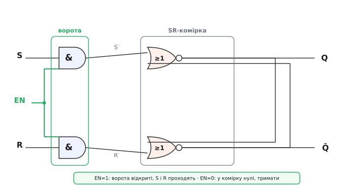
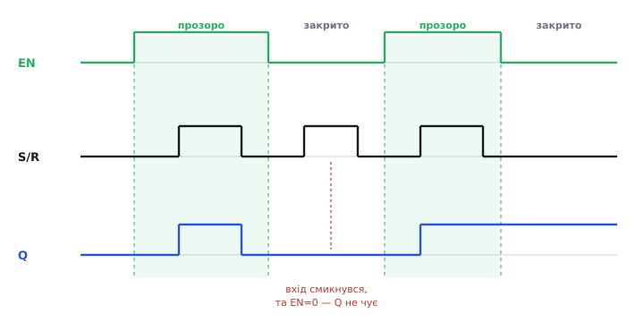
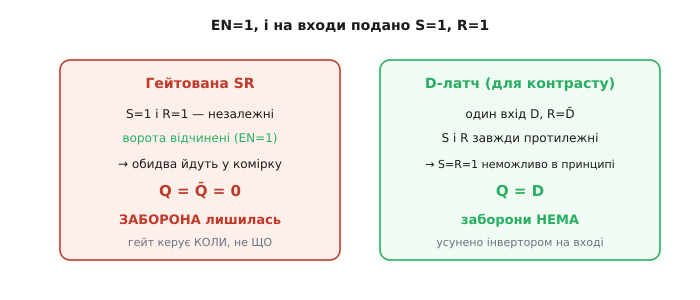
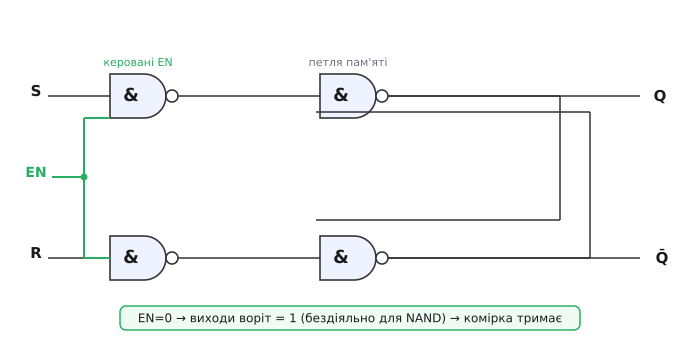

# Гейтована SR-засувка

[Проста SR-засувка](root:hw-digital/sr-latch) має один норов, який заважає будувати з неї щось велике: вона слухає входи **завжди**. Щойно на S чи R смикнувся рівень — вихід тієї ж миті стрибає слідом. Це зветься **прозорість** (*transparent*): між входом і виходом немає жодних воріт, наказ проходить наскрізь у будь-яку секунду. Для однієї комірки це буває навіть зручно, але уяви тисячу таких комірок у регістрі, які мусять оновитися **разом, в одну домовлену мить**, — і кожна з них ловить свій вхід тоді, коли їй заманеться. Вийде хаос: поки один сигнал ще їде дротом, інша комірка вже перемкнулась від старого значення сусідки, та підхопила ще щось третє. Потрібен спосіб сказати комірці: «зараз можна писати, а решту часу — не смій».

Саме це й додає **гейтована SR-засувка** (від англ. *gate* — «ворота, застава»; те саме слово, що й у «logic gate»): та сама SR-комірка, але перед її входами поставлені **ворота**, які пропускають S і R лише тоді, коли дозволяє окремий керувальний сигнал. Цей сигнал звуть **дозволом** (*enable*, EN) або, коли він періодичний, — **тактом**. Ідея вузька й акуратна: не змінити пам'ять, а лише **обмежити, коли до неї можна достукатися**. Розберімо, з чого ці ворота зробити, як вони змінюють поведінку, і — головне — чого вони **не** виправляють, бо саме тут криється найпоширеніша плутанина.

## Ворота з двох AND

Ворота треба зробити так, щоб вони мали два чіткі режими. Коли дозвіл є — S і R проходять до комірки незмінними, і засувка поводиться як звичайна SR. Коли дозволу немає — на комірку мусять приходити такі значення, за яких вона **тримає** те, що є. А режим «тримати» у SR-засувки один-єдиний: S=0, R=0. Отже, ворота при закритому дозволі зобов'язані силоміць подати на обидва входи **нулі**, хоч би що там було на зовнішніх S і R.

Вентиль, який робить рівно це, — **AND** (логічне «І»). Згадаймо його правило: на виході одиниця тільки тоді, коли **обидва** входи одиниці; досить одному входу стати нулем — і вихід нуль. Заведімо на один вхід кожного AND зовнішній сигнал (S або R), а на другий вхід обох — спільний дозвіл EN. Тоді EN стає **ключем-заслінкою**:

```
EN = 0  →  вихід AND = 0  завжди (байдуже, що на S чи R)
EN = 1  →  вихід AND = S  (або R)   — сигнал проходить незмінним
```

При EN=0 обидва AND видають нулі — на комірку йде S=0, R=0, тобто чистий наказ «тримати», і жодне смикання зовнішніх входів крізь зачинені ворота не проходить. При EN=1 кожен AND просто повторює свій сигнальний вхід — S і R доходять до комірки як є, і вона працює точнісінько як гола SR-засувка. Один вентиль на кожен вхід — і ми отримали керування тим, **коли** дозволено писати.


*Зовнішні S і R проходять крізь два вентилі AND, другий вхід яких — спільний дозвіл EN. Коли EN=1, кожен AND прозоро пропускає свій сигнал (S′=S, R′=R) — і сама SR-комірка (два NOR навхрест, петля пам'яті) працює звично. Коли EN=0, обидва AND видають 0: у комірку йде «тримати», і зовнішні входи вона не чує. Ворота керують не вмістом пам'яті, а лише доступом до неї.*

> 🔧 **Навіщо це.** Ця схема — точка, де цифрова техніка вперше отримує поняття «момент запису». Без дозволу комірка ловить входи будь-коли; з дозволом інженер сам вирішує вікно, у яке дані дійсні й стабільні, і лише тоді відчиняє ворота. На платі це впізнається одразу: якщо в комірку даних заведено окремий сигнал «WE» (write enable) або «LE» (latch enable), який десь формується логікою адрес чи станів, — це той самий EN, і перша річ, яку перевіряють при дивних записах, це **чи справді ворота були відчинені саме тоді, коли на входах стояли потрібні дані**.

## Прозоре вікно, а не миттєвий клац

Тут криється тонкість, яку легко проґавити, а вона визначає весь характер пристрою. Ворота **не** захоплюють дані в одну нескінченно коротку мить. Поки EN тримається на одиниці, ворота стоять **відчиненими весь цей час**, і засувка лишається **прозорою** протягом усього високого рівня EN: будь-яка зміна S чи R у цей проміжок одразу проходить на вихід. Це називають **чутливістю до рівня** (*level-sensitive*): важливий сам **рівень** дозволу — високий він чи низький, — а не короткий перехід між ними.

Тому правильний образ — не «клац і зняли знімок», а **вікно прозорості**. Поки EN=1 — вікно відчинене, і вихід є живим дзеркалом входів. Щойно EN падає в 0 — вікно зачиняється, і засувка **застигає** з тим значенням, яке було на входах **в останню мить** перед закриттям. Далі, поки EN=0, зовнішні входи можуть смикатися скільки завгодно — вихід їх не чує й тримає заморожене значення.


*Поки EN високий (затінені смуги — вікна прозорості), вихід Q слідує за входом: набрав 1, коли вхід став 1, впав, коли вхід упав. Щойно EN падає, вікно зачиняється й Q застигає. Ключовий момент — у закритій зоні: вхід смикнувся в 1, але EN=0, і Q цього просто не чує, тримаючи попереднє значення. У другому вікні Q знову підхопив вхід і, коли ворота зачинилися на одиниці, зберіг її. Захоплюється не мить, а весь рівень EN.*

Цю поведінку зручно тримати в голові як маленьку модель. У прошивці, що емулює логіку чи опитує зовнішню комірку, гейтована SR-засувка описується буквально одним `if`:

**Приклад (модель гейтованої SR-засувки).** Оновлюємо збережений біт `q` лише коли дозвіл активний; за S=R=1 лишаємо позначку недопустимого стану.

```c
// стан засувки: збережений біт q. Викликаємо на кожну зміну входів.
static int q = 0;             // поточне значення виходу

void gated_sr(int S, int R, int EN) {
    if (!EN) return;          // ворота зачинені — вхід ігноруємо, q не чіпаємо
    if (S && R) {             // заборонена комбінація — ворота її НЕ ловлять
        // непередбачувано в залізі; у моделі просто не пишемо
        return;
    }
    if (S)      q = 1;        // set
    else if (R) q = 0;        // reset
    // S=0,R=0 при EN=1 — теж «тримати»: q лишається як був
}
```

Зверни увагу на **перший рядок**: усе тіло функції виконується тільки при `EN`. Це і є ворота — весь наказ входів існує лише всередині дозволу; поза ним функція навіть не торкається `q`. Саме це `return` на закритих воротах і відрізняє гейтовану засувку від голої, де запис ішов би безумовно.

> 🔧 **Навіщо це.** Прозоре вікно — двосічне. З одного боку, воно дає керований момент запису. З іншого — поки вікно відчинене, засувка передає на вихід **усе**, зокрема й шум, брязкіт та проміжні перекоси входів. Тому на практиці дозвіл роблять **коротким** імпульсом рівно там, де дані вже стабільні: чим вужче вікно, тим менше шансів упіймати сміття. А ще з цього прямо випливає, чому наступний крок еволюції пам'яті — [тригери, чутливі до фронту](root:hw-digital/edge-vs-level), а не до рівня: вони звужують вікно до самої миті переходу такту, і прозорість зникає зовсім.

## Ворота керують «коли», а не «що» — заборона лишається

Ось найважливіше місце цієї теми, і саме його часто плутають. Ворота дозволу розв'язують **одну** ваду простої SR-засувки — прозорість, тобто питання **коли** можна писати. Але вони **не чіпають** другої вади — **забороненого стану S=R=1**. І це не недогляд, а логічна неминучість: ворота лише вирішують, **пропустити** сигнали чи ні; вони не втручаються в те, **які саме** значення пропускають.

Простежмо. Поки EN=0, заборона просто не встигає нашкодити: обидва AND тримають нулі, у комірку йде «тримати», і S=R=1 на зовнішніх входах нікуди не проходить. Здавалося б, урятовані. Та щойно EN стає 1 — ворота чесно пропускають **усе, що на входах**. Якщо цієї миті там стоїть S=1 і R=1, обидва AND видадуть по одиниці, у комірку прийде та сама заборонена пара, і засувка втне те саме недобре: обидва виходи Q і Q̄ стануть нулями (перестануть бути протилежними), а коли S і R згодом упадуть, кінцевий стан вирішиться **гонитвою** — випадковими відмінностями швидкостей двох гілок, аж до зависання в [метастабільності](root:hw-digital/metastability-timing). Дозвіл лише **відклав** проблему до моменту відчинення воріт, але не прибрав її.


*Ліворуч — гейтована SR при EN=1: S і R незалежні, ворота чесно пропускають обидві одиниці, і заборонений стан Q=Q̄=0 виникає, як і в голої засувки. Ворота керують лише тим, коли сигнали проходять, а не тим, які вони. Праворуч — для контрасту D-латч: там єдиний вхід D роздвоюють інвертором (R=D̄), тож S і R завжди протилежні й пара «1,1» стає неможливою в принципі. Це вже інше, глибше виправлення, ніж просто ворота.*

Різницю варто закарбувати одним реченням: **гейтована SR-засувка керує моментом запису, але лишає відповідальність за коректність даних на тому, хто ці дані подає**. Якщо є ризик, що S і R водночас стануть одиницями, ворота від нього не захистять — потрібно або зовні гарантувати, що така пара не трапиться, або перейти до схеми, де вона неможлива за побудовою. Найпоширеніше таке виправлення — звести два входи в один: подати дані D на set, а їхню інверсію D̄ на reset. Тоді входи завжди протилежні, заборона зникає, і виходить [D-латч](root:hw-digital/d-flip-flop) — прямий нащадок гейтованої SR-засувки, у якого прибрано саме цю останню слабину. Гейтована SR — це щабель **до** нього: ворота вже є, а захисту від «1,1» ще нема.

> 🔧 **Навіщо це.** Практичний висновок гострий. Побачивши в схемі гейтовану SR-комірку (два незалежні входи S/R плюс дозвіл), не заспокоюйся тим, що «є ж enable, все під контролем». Enable стереже **час**, а не **зміст**. Джерело, що формує S і R, мусить саме гарантувати, що воно ніколи не підніме обидва разом — інакше в момент відчинення воріт зловиш непередбачуваний стан, який у логах виглядатиме як «випадковий» збій пам'яті. Якщо такої гарантії дати не можна — це сигнал, що треба не гейтована SR, а D-подібна комірка з єдиним входом даних.

## Активно-низька версія на чотирьох NAND

На практиці гейтовану SR-засувку рідко будують дослівно «NOR-комірка плюс два AND»: у реальному кремнію (як-от у сімействі [CMOS](root:hw-digital/cmos-gate)) базовий і найдешевший вентиль — це **NAND** («І-НЕ»), а не окремі AND і NOR. Тому класична реалізація складається з **чотирьох однакових NAND**: два з них — комірка пам'яті, ще два — ворота дозволу. Схема виходить однорідною й компактною.

Логіка тут дзеркальна, і її треба зрозуміти, а не завчити. NAND видає нуль лише тоді, коли **обидва** входи одиниці; будь-який нуль на вході робить вихід одиницею. Заведімо на вхідні NAND зовнішні S, R і спільний дозвіл EN. Поки EN=0, обидва вхідні NAND мають на одному вході нуль — тож обидва видають **одиниці**, байдуже що на S і R. А для внутрішньої комірки з NAND (де входи активно-низькі) пара «1,1» — це і є режим **«тримати»**. Отже, EN=0 знову означає «ворота зачинені, комірка зберігає», але цього разу «бездіяльний» рівень воріт — це одиниця, а не нуль.


*Два вхідні NAND (ліворуч) пропускають S і R лише за високого EN; коли EN=0, їхні виходи — одиниці, тобто для правої NAND-комірки це «тримати». Два праві NAND, з'єднані навхрест, і є петля пам'яті. Уся засувка з чотирьох однакових вентилів — саме так її й кладуть у кремній, бо NAND дешевший за суміш AND і NOR.*

Через дзеркальність міняється й те, як виглядає заборона. У цій побудові недопустима комбінація на **внутрішніх** входах комірки — це коли обидва вони одночасно **нулі** (а не одиниці, як у NOR-варіанті). А відповідає їй на зовнішніх S, R і EN ситуація, коли ворота відчинені (EN=1) і водночас **активні обидва** зовнішні входи. Суть та сама: одночасний наказ «постав 1» і «постав 0» лишається забороненим — просто рівні, якими він виражається, перевернуті. Тому, читаючи чужу схему, завжди спершу з'ясуй, на NOR вона чи на NAND, і **який рівень EN вважається «відчинено»**: переплутавши полярність, легко вирішити, що засувка «глюкнула», хоча вона працює точно за таблицею.

> 🔧 **Навіщо це.** Знання, що це чотири NAND, а не абстрактні «латч плюс ворота», дуже практичне при роботі з дискретною логікою. Одна мікросхема на кшталт чотиривентильного NAND-корпусу вміщає рівно одну таку засувку — і на макеті її збирають саме так. А ще саме NAND-версія лежить в основі найкласичнішого застосування SR-комірки — [придушення брязкоту](root:hw-digital/contact-debounce) механічного перемикача: там ворота часто й не потрібні, але сама активно-низька комірка та сама.

## Скільки має тривати дозвіл

Останнє, що робить гейтовану засувку придатною до реального заліза, — розуміння, що ворота не можна відчиняти й зачиняти **як завгодно швидко чи будь-коли**. Тут з'являються два прості часові вимоги, і обидва ростуть з того, що петля пам'яті перемикається не миттєво.

Перше: **дозвіл мусить бути досить широким**. Щоб новий стан устиг «защепнутися» — тобто щоб регенеративна петля встигла добігти по колу й підтвердити сама себе, — імпульс EN має тривати щонайменше стільки, скільки займає це перемикання (кілька затримок вентилів). Занадто вузький імпульс дозволу може відчинити ворота й зачинити їх раніше, ніж комірка встигне надійно перекинутися, — і вона лишиться в проміжному, невизначеному стані. Це та сама небезпека [метастабільності](root:hw-digital/metastability-timing), тільки спричинена закоротким вікном запису.

Друге: **дані мають бути стабільними біля закриття воріт**. Оскільки захоплюється значення, яке стоїть на входах **в останню мить** прозорого вікна, входи S і R не повинні смикатися саме тоді, коли EN падає. Якщо вхід міняється рівно в мить закриття, засувка не знає, яке значення вважати «останнім», — і знову ризикує застигнути посередині. Ці дві вимоги — «тримай ворота відчиненими достатньо» і «не чіпай дані на самому закритті» — є першими, найпростішими родичами суворих часових умов [встановлення й утримання](root:hw-digital/hold-violation), які потім керуватимуть усією синхронною логікою. Гейтована засувка показує їхню суть у найголішому вигляді: вікно має бути не лише в потрібному місці, а й достатньо тривалим і з чистими краями.

Історія самого цього переходу — від першого «завжди ввімкненого» тригера [Екклза–Джордана](root:hw-digital/gated-sr-latch/hist-gated-latch.md) до ідеї навмисно **обмежувати мить запису окремим сигналом** — коротка, але повчальна: вона показує, як пам'ять із простого фіксатора стану перетворилася на кероване, дисципліноване вікно, з якого потім виросло тактування всієї цифрової техніки.

> 🔧 **Навіщо це.** Ці два правила — не академічна формальність, а найчастіша причина «примарних» збоїв у саморобній логіці на латчах. Якщо імпульс дозволу формується як вузький глітч від якоїсь комбінаційної схеми, він може виявитися то досить широким, то ні — і засувка писатиме через раз, «за настроєм». Тому дозвіл беруть від чистого, достатньо довгого сигналу, а дані підводять і встигають заспокоїти **до** того, як ворота почнуть зачинятися. Побачив нестабільну засувку — виміряй ширину імпульсу EN і поглянь, чи не міняються входи саме на його спадному краї.
