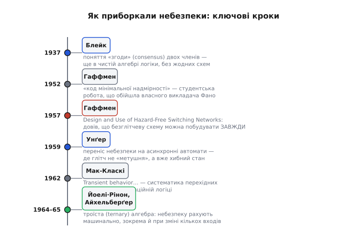

# 📜 Коротка історія безглітчевих мереж

Уявіть інженера кінця 1940-х — початку 1950-х, який щойно повірив у нову й дуже гарну ідею: логіку машини можна проєктувати **алгеброю**. Клод Шеннон (Claude Shannon) ще 1938 року показав, що ввімкнено/вимкнено реле — це те саме, що «істина/хиба» булевої алгебри, і відтоді схему стало можна не намацувати паяльником навмання, а **виводити** з формули, спрощувати, доводити правильність. Здавалося, залізо нарешті підкорилося математиці остаточно.

І тут воно зрадило. Інженер бере логічно бездоганну схему — таблиця істинності зійшлася в кожному рядку, алгебра чиста, — вмикає її, дивиться осцилографом на вихід і бачить те, чого в жодному рядку таблиці немає: під час перемикання входу вихід **смикається**. Короткий хибний імпульс там, де за всією математикою мало стояти незмінне значення. Формула каже «одиниця» і до, і після — а між ними, на частку мікросекунди, вискакує нуль.

Це був справжній шок для тодішнього способу думати. Не поломка деталі, не поганий контакт — **справна** схема, зібрана точно за правильною формулою, поводиться не так, як формула. Виходить, булева алгебра описує щось не до кінця. Ось із цього подиву — «чому математично правильна схема бреше в залізі?» — і виросла ціла гілка теорії, яку ми сьогодні звемо аналізом небезпек (англ. *hazard* — «ризик, небезпека»). Її головним героєм став чоловік, чиє ім'я ви, найпевніше, знаєте зовсім з іншого приводу.

*Приборкання глітча — не подія, а півтора десятиліття: спершу зрозуміли, що небезпека взагалі є; тоді довели, що її завжди можна прибрати; далі перенесли задачу на автомати й навчилися рахувати небезпеку алгоритмом. Кольори віх — лише щоб око чіплялося за роки, не більше.*

## Студент, що обійшов свого професора

У 1951 році в Массачусетському технологічному інституті (MIT) молодий аспірант **Девід Гаффмен** (David Albert Huffman, 1925, Аллаєнс, штат Огайо — 1999) сидів на курсі теорії інформації, який читав **Роберт Фано** (Robert Fano) — один із людей, що будували цю науку разом із Шенноном. Фано дав студентам вибір: або складати підсумковий іспит, або написати курсову роботу. Тема курсової звучала невинно: знайти найощадливіший двійковий код — такий, щоб частіші символи кодувалися коротше й повідомлення в середньому виходило найкоротшим.

Чого Фано студентам **не сказав** — що це відкрита задача, над якою тоді безуспішно билися і він сам, і Шеннон. Гаффмен цього не знав, а тому не знав і що вона «нерозв'язна». Він місяцями штовхав її і нічого не виходило. За кілька днів до іспиту він здався: викинув усі напрацювання в кошик і сів учити квитки. І наступного ранку його **осяяло** — саме те, що він щойно викинув, і було дорогою до розв'язку. Він зрозумів, що будувати код треба **знизу вгору**: не ділити повідомлення на частини згори, як робив Фано, а зливати два найрідші символи в один, потім знову два найрідші, і так, поки не збереться дерево. Так народився **код Гаффмена** — і донині це основа стиснення даних усюди, від архіваторів до формату JPEG.

Тут варто спинитися на самій людині, бо це не випадковий геній однієї ідеї. Гаффмен закінчив електротехніку в Університеті штату Огайо ще у **1944 році**, у вісімнадцять з чимось, тоді два роки прослужив офіцером на флоті (радар), повернувся, здобув магістра, і аж тоді потрапив до MIT. Тобто перед нами інженер-практик, що вже тримав у руках реальні схеми, а не лише формули. І — деталь, яка все пояснює: **сам Гаффмен вважав своєю головною роботою зовсім не славетний код**. Код був побічним відкриттям студента. Серцем його докторської була інша річ — **синтез послідовнісних схем**.

> 🔧 **Навіщо це.** Історія коду Гаффмена — не просто цікавий анекдот про удачу. Вона показує спосіб думання, з якого потім виросло приборкання глітчів: не приймати задачу «згори як дано», а **перебудувати саму постановку** так, щоб розв'язок став очевидним. Точно так само Гаффмен потім не став ловити кожен окремий глітч на кожній конкретній схемі — він переставив питання: «а чи можна взагалі побудувати схему так, щоб глітч був **неможливий за конструкцією**?»

## Докторська, з якої все й почалося

Докторську дисертацію «Синтез послідовнісних схем» (*The Synthesis of Sequential Switching Circuits*) Гаффмен захистив у MIT у **1953 році** під керівництвом **Семюела Колдвелла** (Samuel H. Caldwell) і того ж року лишився там викладати. Роботу згодом надрукували в *Journal of the Franklin Institute* (1954), і за неї Гаффмену дали медаль Луїса Леві (Levy Medal) Інституту Франкліна. Це та сама праця, у якій він увів **діаграму станів автомата** й систематичний спосіб її будувати — те, що сьогодні кожен студент цифрової техніки малює не задумуючись.

І ось у цій роботі про автомати причаїлася важлива думка. Автомат — це схема з пам'яттю: комбінаційна логіка рахує наступний стан, а защіпки його запам'ятовують. Але якщо комбінаційна частина під час перемикання **смикнеться** хибним імпульсом, а цей імпульс потрапить у ланцюг зворотного зв'язку чи на защіпку — автомат може **зіскочити не в той стан**. Тобто глітч у послідовнісній схемі — це вже не косметична дрібниця на екрані осцилографа, а можлива **справжня помилка роботи машини**. Ось чому Гаффмен, розбираючись з автоматами, неминуче наткнувся на нижчий шар — на самі глітчі в комбінаційній логіці, з якої ті автомати складаються.

Він побачив те, що ми розбирали в основній статті: причина хибного імпульсу — не шум, не завада, а **різні затримки різних шляхів** до одного вентиля. Один і той самий вхід доходить до виходу двома дорогами неоднакової довжини, на стику вони на мить розходяться — і виникає сплеск. Таблиця істинності його не показує, бо описує лише **застиглі** стани, а не дорогу між ними. І ключове прозріння Гаффмена було ось яке: **раз причина в структурі схеми, то й лікувати треба структуру** — не деталі, не живлення, не екранування, а саму розкладку логіки.

## Головний доказ: безглітчеву схему можна зробити ЗАВЖДИ

У **1957 році** в *Journal of the Association for Computing Machinery* (том 4, число 1, сторінки 47–62) вийшла стаття Гаффмена з назвою, що прямо б'є в ціль: **«Проєктування й застосування безглітчевих комутаційних мереж»** (*The Design and Use of Hazard-Free Switching Networks*). Це та праця, на яку ми посилаємось у темі про глітчі як на першоджерело.

Що саме вона довела — і чому це було так важливо?

По-перше, Гаффмен акуратно **розділив** типи неприємностей. Він показав, що бувають небезпеки, породжені самою **схемою** (та сама пара шляхів з різними затримками — і її можна прибрати), а бувають небезпеки, закладені в самій **функції** (коли одночасно міняється кілька входів, і між старим та новим набором лежить проміжний, на якому функція дає інше значення — цього переробкою вентилів не приберти). Це розрізнення — між тим, що ми звемо структурною небезпекою і функційною, — саме звідти.

По-друге, і це головне, він **довів конструктивну теорему**: для будь-якої булевої функції, за зміни **одного** входу, схему **завжди** можна побудувати так, щоб вона не давала жодного хибного імпульсу. Не «інколи вдається», не «якщо пощастить з деталями», а **завжди** — і він показав **як** саме її будувати. Рецепт виявився напрочуд практичним: дописати надлишкові члени, які накривають кожен небезпечний стик, — рівно ті «зайві за логікою» AND-члени, що ми додаємо в основній статті, коли ліквідовуємо статичну 1-небезпеку. І — тонкий, дуже інженерний хід — Гаффмен зробив це **без винаходу нової алгебри**: у межах звичайної булевої, просто розумно нею користуючись. Наступне покоління піде іншим шляхом і алгебру таки розширить, але сам Гаффмен обійшовся наявним апаратом.

Ось у чому справжня вага цієї роботи. До неї глітч був **прикрою несподіванкою**: зібрав схему — а вона смикається, і ти латаєш конкретний випадок. Після неї глітч став **керованою величиною**: наперед відомо, де небезпека сидить, відомо, що її завжди можна прибрати, і відомо, якою ціною (зайві вентилі). Задача перейшла з розряду «лови біду по факту» в розряд «проєктуй так, щоб біди не було». Це і є те, що обіцяла тема: **хто й коли формально приборкав небезпеки й довів, що схему завжди можна зробити безглітчевою**. Зробив це Девід Гаффмен, 1957 року. *Статус: усталений факт — стаття цитована як засаднича в усіх подальших оглядах теорії небезпек.*

> 🔧 **Навіщо це.** Практичний висновок теореми Гаффмена живе донині у вашому редакторі схем. Коли синтезатор логіки (той, що перетворює опис на вентилі) має зробити коло, у якому глітч критичний, він спирається саме на цю гарантію: безглітчевий варіант **існує**, лишається його згенерувати, доплативши надлишковими вентилями. Без доказу 1957 року інструмент не мав би права обіцяти результат — бо ніхто б не знав, що результат узагалі досяжний.

## Родовід ліків: «згода» членів старша за самі схеми

Тут варто відступити вбік і показати одну красиву річ: **накривний член**, яким лікують статичну небезпеку (той самий A·B, що тримає вихід під час переходу), — насправді **старший** за всю історію з глітчами. Його коріння — у чистій алгебрі логіки, задовго до того, як хтось узагалі глянув осцилографом на вентиль.

Ще у **1937 році** математик **Арчі Блейк** (Archie Blake) у докторській роботі ввів поняття, яке англійською зветься *consensus* — «згода» двох членів формули. Ідея суто алгебрична: якщо один член містить якусь змінну прямо, а другий — ту саму змінну з запереченням, то з них можна «вивести» третій член, де тієї змінної немає взагалі, — і він логічно вже випливає з перших двох. Блейка цікавило не залізо, а мінімізація формул: він показав, що формула не є по-справжньому повною щодо своїх простих множників, поки таку «згоду» ще можна взяти. Жодних затримок, жодних сплесків — чиста логіка на папері.

Це поняття кілька разів **перевідкривали**. Незалежно до нього прийшли **Едвард Самсон і Бертон Міллс** (Edward Samson, Burton Mills) у 1954 році, а тоді, у **1955-му**, знаменитий логік **Віллард Ван Орман Квайн** (Willard Van Orman Quine) — і саме Квайн дав йому назву *consensus*, яка й прижилася. Той самий Квайн, чиє ім'я ви знаєте з методу Квайна–Мак-Класкі для спрощення булевих функцій.

І аж тепер найгарніше. Виявилося, що суто **алгебричний** об'єкт — «згода» двох членів, придуманий, щоб охайніше мінімізувати формули, — має **фізичний** сенс, про який Блейк і Квайн не думали: якщо цей «зайвий» член **не викидати**, а навпаки, лишити в схемі, то він **фізично тримає вихід** у ту мить, коли одна група вентилів уже відпустила одиницю, а сусідня ще не схопила. Те, що математик 1937 року вважав надлишковим і хотів прибрати заради краси формули, інженер кінця 1950-х **свідомо лишає** заради того, щоб схема не зморгнула. Алгебрична «згода» й фізичне «накриття стику» — це той самий член, побачений з двох боків. Гаффменів рецепт проти глітчів і Блейкова теорема про згоду зустрілися саме тут. *(Алгебру цього члена й доказ, чому він прибирає структурну, але не функційну небезпеку, розписано окремо в [математиці накривного члена](topic:hw-digital/glitch-combinational/math-consensus.md).)*

## Далі: небезпека переїжджає в автомати

Гаффмен розчистив головне питання для комбінаційної логіки, але справжня драма глітча — там, де він може зіпсувати **стан машини**. Тож наступний крок зробили ті, хто взявся за **асинхронні автомати** — схеми з пам'яттю **без спільного такту**, де немає рятівного «прочитаємо вхід лише за фронтом, коли все вляглося». У такій схемі кожен глітч потенційно фатальний, бо його нема кому перечекати.

У **1959 році** **Стівен Унґер** (Stephen H. Unger, нар. 1931) друкує в *IRE Transactions on Circuit Theory* працю «Небезпеки й затримки в асинхронних послідовнісних комутаційних схемах» (*Hazards and Delays in Asynchronous Sequential Switching Circuits*). Тут глітч уже не «безневинна метушня на виході, яку защіпне такт», а прямий шлях до **хибного переходу стану** й до **критичних перегонів** — коли результат залежить від того, який із сигналів випадково прийде першим. Унґер (він, до речі, довго викладав у Колумбійському університеті й лишався одним із головних голосів асинхронної школи) переніс поняття небезпеки з рівня «один вентиль смикнувся» на рівень «весь автомат зіскочив не туди» і показав, як будувати таблиці переходів так, щоб цього уникати. Його книжка «Асинхронні послідовнісні комутаційні схеми» (*Asynchronous Sequential Switching Circuits*, 1969) на десятиліття стала настільною для цієї теми.

Паралельно **Едвард Мак-Класкі** (Edward J. McCluskey, 1929–2016) — той самий, чиє ім'я в методі Квайна–Мак-Класкі — у праці «Перехідна поведінка комбінаційних логічних мереж» (*Transient Behavior of Combinational Logic Networks*, 1962) **систематизує** саму перехідну поведінку комбінаційної логіки: не окремі випадки, а загальну картину того, як мережа поводиться **між** усталеними станами. Мак-Класкі, який згодом заснував у Стенфорді відому лабораторію надійності обчислень, разом із Гаффменом дав тій частині теорії ім'я, що часом трапляється в підручниках, — **процедура Гаффмена–Мак-Класкі** для виявлення й усунення небезпек.

## Навчити машину рахувати небезпеку: троїста логіка

Лишалося ще одне. Гаффмен показав, що небезпеку **можна** прибрати; Унґер і Мак-Класкі розширили це на автомати й систематизували. Але як **автоматично знайти** всі небезпечні місця у великій схемі — не малюючи карту Карно руками для кожної пари сусідніх станів? Для машинної перевірки потрібен був апарат, який рахує сам.

І ось тут наступне покоління зробило те, від чого сам Гаффмен свідомо втримався: **розширило алгебру**. Замість двох значень — 0 і 1 — увели **третє**, проміжне: «зараз перемикається, значення непевне». Це **троїста логіка** (англ. *ternary*, від лат. *ternarius* — «по три»). Ідея гарна своєю прямотою: якщо вхід зараз у переході, підставмо в схему замість нього це третє значення й порахуймо — і там, де на виході теж вийде «непевно» (а не тверде 0 чи 1), схема **може** глітчнути. Небезпека стала не тим, що треба виглядати оком на карті, а тим, що **обчислюється** підстановкою.

Першими цю дорогу для **статичних** небезпек у комбінаційній логіці проклали **Майкл Йоелі й Шломо Рінон** (Michael Yoeli, Shlomo Rinon) у статті «Застосування троїстої алгебри до вивчення статичних небезпек» (*Application of Ternary Algebra to the Study of Static Hazards*, *Journal of the ACM*, том 11, число 1, 1964, сторінки 84–97). Їхні прийоми виявлення й усунення небезпек були **аналогом процедур Гаффмена–Мак-Класкі**, тільки переведеним на рейки, зручні для обчислення.

А завершив і узагальнив цю лінію **Едвард Айхельберґер** (Edward B. Eichelberger, нар. 1934, Норфолк, штат Вірджинія) у праці **«Виявлення небезпек у комбінаційних і послідовнісних комутаційних схемах»** (*Hazard Detection in Combinational and Sequential Switching Circuits*, *IBM Journal of Research and Development*, том 9, число 2, **1965**, сторінки 90–99). Айхельберґер зробив троїсту алгебру **єдиним інструментом**, що охоплює одразу все: і комбінаційні схеми, і послідовнісні; і зміну **одного** входу, і — що набагато складніше — **одночасну зміну кількох** входів; і статичні небезпеки, і перегони в автоматах. Одна процедура, що ловить **будь-який** тип небезпеки чи гонки, здатної загнати схему в неправильний стан. Ось те машинне «око», якого бракувало: тепер небезпеку в довільній схемі можна знайти алгоритмом, а не олівцем.

## Чому в підсумку переміг такт, а не накривні члени

І тут історія робить повчальний поворот, який пояснює, **чому** в основній статті найпершою й найнадійнішою радою стоїть «тримай усе синхронним», а не «дописуй накривні члени».

Погляньмо на самого Айхельберґера. Він прийшов в IBM 1956 року інженером-схемотехніком, у 1963-му здобув докторат у Прінстоні саме з **теорії комутації** — і, озброєний усім цим апаратом виявлення небезпек, пішов працювати над реальними мікросхемами найбільшого на планеті виробника обчислювальних машин. Здавалося б, ось людина, яка мала б наробити безглітчевих асинхронних схем на всі процесори IBM. А він зробив рівно **протилежне**.

Найвідоміша праця Айхельберґера — не про накривні члени, а про **рівнево-чутливий сканувальний дизайн** (*Level-Sensitive Scan Design*, LSSD), який він розробив в IBM наприкінці 1960-х — на початку 1970-х. Суть LSSD — **дисципліна**: усі елементи пам'яті ведуться **тактом**, схема будується **суворо синхронною**, а перехідні процеси навмисне дозволяють вилягатися **до** фронту такту. Тобто замість того, щоб героїчно ловити кожен глітч троїстою алгеброю, індустрія **прибрала саме поле бою**: якщо все читається лише за фронтом, коли метушня вже вщухла, то внутрішні глітчі просто **перестають когось обходити** — рівно те золоте правило, яким закінчується основна стаття. LSSD став наріжним каменем **тестопридатного** дизайну — за нього Айхельберґер із Томасом Вільямсом (Thomas Williams) дістали 1989 року премію Мак-Дауелла (McDowell Award).

У цьому — головний історичний урок теми. Півтора десятиліття блискучих голів — Гаффмен, Унґер, Мак-Класкі, Йоелі, Рінон, Айхельберґер — до дрібниць розібрали, як **боротися** з глітчем: коли він є, як його побачити, як прибрати, як порахувати машиною. А тоді та сама спільнота (і той самий Айхельберґер особисто) дійшла до глибшого висновку: у більшості реальних машин глітч не треба **перемагати** — його треба зробити **несуттєвим**, звівши все на синхронний такт. Складний апарат виявлення й усунення небезпек нікуди не зник: він і сьогодні працює всередині інструментів синтезу й там, де синхронності досягти не можна (асинхронні вузли, тактові дерева, входи скидання). Але як щоденна практика **переміг такт** — бо він прибирає причину клопоту цілком, а не латає наслідок.

Тож коли ви наступного разу побачите на осцилографі вузький хибний сплеск на виході логіки й **знизнете плечима**, бо він піде на вхід даних і його перечекає фронт, — знайте, що за цим спокоєм стоїть довга робота: спершу треба було **здивуватися**, що справна схема бреше; тоді довести, що брехню **завжди** можна прибрати; тоді навчитися рахувати її машиною; і врешті зрозуміти, що найрозумніше — просто не ставити схему в становище, де ця брехня має значення.
