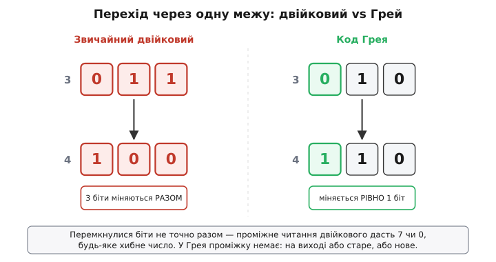
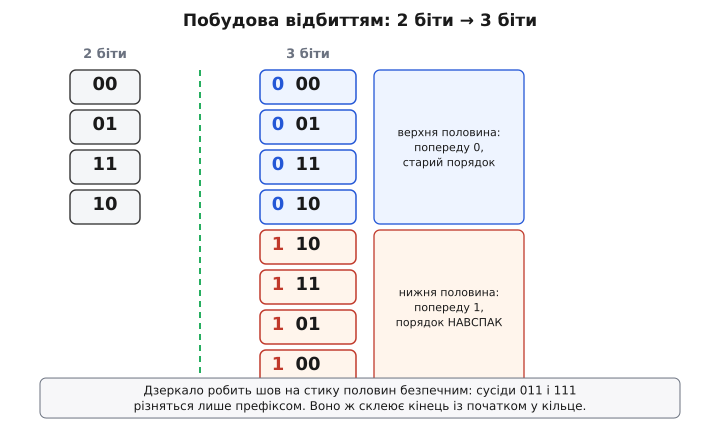
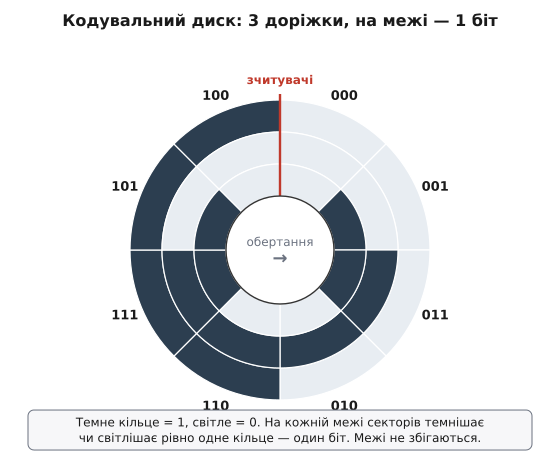

# Код Грея

Уявімо вал, що крутиться, і ми хочемо знати його кут. На вал садять диск із доріжками, які зчитувач читає як двійкове число: 000, 001, 010… і так навколо. Здавалося б, готово — диск крутиться, число росте, кут відомий. Але саме тут ховається пастка, через яку наївне рішення видає не дрібну похибку, а цілковите безглуздя — і саме з цієї пастки виріс код Грея.

## Звідки біда: межа, де міняється кілька бітів одразу

Подивімось на один-єдиний перехід — від 3 до 4. У звичайному двійковому це **011 → 100**: міняються всі три біти разом. А тепер згадаймо, що в залізі ніщо не буває ідеально одночасним. Доріжки на диску витравлені з мікронними неточностями, зчитувачі стоять не строго по одній лінії, фронти сигналів мають різну крутість. Тому в ту коротку мить, коли зчитувач переповзає межу, біти перемикаються **не разом**, а кожен у свій момент.

І ось що з цього виходить. Поки старший біт уже став одиницею, а молодші ще не встигли впасти в нуль, на виході стоїть, скажімо, **111 = 7**. За мить молодші опадуть — і буде правильне 100 = 4. Але між цими двома станами зчитувач устиг показати **сімку** — число, до якого валу зовсім не близько. Між сусідніми кутами 3 і 4 виходить миттєвий стрибок на 7, а в інших переходах — на 0, на 6, на будь-що. Для системи керування, яка читає кут і вирішує, куди рухатись, такий фантомний викид — це команда смикнутись казна-куди.

Корінь біди один: **коли на межі міняється більш ніж один біт, проміжне читання може дати будь-яке хибне число**. Чим більше бітів перемикаються одночасно, тим ширший набір сміття, що визирає на виході в момент переходу.

> 🔧 **Навіщо це.** Та сама проблема — не лише на диску. Будь-який лічильник, чий вихід читає *інша* схема асинхронно (не в такт), небезпечний рівно тому самому: схема-читач може зловити момент, коли частина бітів уже перемкнулась, а частина ще ні, і прочитати число, якого ніколи «насправді» не було. Тому код Грея потрібен скрізь, де багатобітне число перетинає межу між незалежними частинами пристрою.

Напрошується думка: а що, як влаштувати рахунок так, щоб **на кожному кроці міняв стан рівно один біт**? Тоді в момент переходу неоднозначність зникає сама собою. Біт або вже перемкнувся — і ми бачимо нове число, або ще ні — і ми бачимо старе. Третього не дано: проміжного «сміттєвого» стану просто немає, бо мінятися більше нічому.



*Той самий перехід 3→4 у двох кодуваннях. Ліворуч три біти перемикаються разом — ловиться хибне 7. Праворуч міняється один біт, проміжного стану немає.*

## Код, де сусіди різняться одним бітом

Послідовність, у якій кожні два сусідні числа відрізняються рівно в одному розряді, і називають **кодом Грея** (на честь Френка Грея з Bell Labs; сам він звав його *reflected binary code* — «відбитий двійковий код»). Ось як виглядає трибітний:

```
десяткове   двійкове    Грей
   0           000        000
   1           001        001
   2           010        011
   3           011        010
   4           100        110
   5           101        111
   6           110        101
   7           111        100
```

Проведіть пальцем по стовпчику Грея згори вниз і простежте, що міняється на кожному кроці: 000→001 (молодший), 001→011 (середній), 011→010 (молодший), 010→110 (старший)… **завжди рівно один біт**. Це не випадковість і не таблиця, яку треба зубрити, — за нею стоїть простий механізм побудови.

## Як його будують: відбиття

Назва «відбитий» прямо вказує на спосіб. Беремо код на менше число бітів і будуємо з нього код на один біт ширший за два кроки:

1. **Пишемо список як є**, спереду дописавши кожному 0.
2. **Пишемо той самий список навспак** (знизу вгору), спереду дописавши кожному 1.
3. Склеюємо обидві половини — це й буде код на біт ширший.

Перевірмо на однобітному. Однобітний Грей — це просто `0, 1`. Робимо двобітний:

```
верх (0 + список):   00, 01
низ (1 + навспак):   11, 10
разом:               00, 01, 11, 10
```

Тепер чому це працює саме так. Усередині кожної половини сусіди різняться одним бітом — бо так було в коротшому коді, а спільний префікс (0 чи 1) нічого не псує. Лишається один підозрілий стик — **шов між половинами**, де закінчується верх і починається низ. Але ми навмисне розвернули нижню половину дзеркалом, тому по обидва боки шва стоять **однакові молодші біти** (останній елемент верху і перший елемент низу — це той самий рядок коротшого коду). Різниця між ними — тільки в дописаному спереду біті: 0 проти 1. Знову один біт. Дзеркало існує саме для того, щоб зробити шов безпечним.



*Відбиття: верхня половина — старий порядок із 0 попереду, нижня — навспак із 1 попереду. Дзеркало гарантує, що на стику половин міняється лише префікс.*

Той самий механізм дарує ще одну властивість задарма. Найперший елемент (усі нулі) і найостанніший різняться теж **одним бітом** — старшим. Тобто код **замкнений у кільце**: дійшовши до кінця, можна повернутись на початок, знову перемкнувши лише один біт. Для валу, що крутиться нескінченно, це обов'язково: перехід «остання позиція → перша» має бути таким самим безпечним, як усі інші.

## Кодувальний диск

Тепер видно, як насправді влаштований диск абсолютного [шифратора положення](topic:hw-digital/encoder). Кожному біту коду відповідає своя кільцева доріжка: де біт дорівнює одиниці — сектор зачорнений (зчитувач бачить, наприклад, метал чи непрозоре поле), де нуль — світлий. Доріжки малюють так, щоб уздовж кола йшла саме послідовність Грея.



*Диск, на якому записано трибітний Грей. Темне кільце — одиниця, світле — нуль. На будь-якій межі секторів темнішає чи світлішає лише одне кільце.*

Ключове видно одразу: **жодна межа між секторами не збігається з межею на іншій доріжці**. На звичайному двійковому диску всі доріжки переходять одночасно в точках, де старший біт перемикається, — і там кілька зчитувачів одночасно опиняються на межі, кожен видає хто 0, хто 1. На грей-диску в кожній точці кола межу перетинає рівно одна доріжка. Хоч на мить зупини диск будь-де — два сусідні зчитувачі максимум по один бік або точно на межі однієї доріжки, тож читання — або старе число, або нове, без вигадок поміж.

## Назад у звичайний двійковий: трюк із XOR

Код Грея чудовий для зчитування, але арифметика на ньому незручна: додати, відняти, порівняти зручніше у звичайному двійковому. Тому майже завжди число читають у Грею, а одразу за зчитувачем перетворюють назад. На щастя, перетворення в обидва боки — це кілька операцій [«виключного АБО»](topic:hw-digital/xor-comparison) (англ. *XOR*, символ ⊕): один біт на виході дорівнює одиниці тоді й лише тоді, коли два входи різні.

**Двійкове → Грей** напрочуд просте. Кожен біт Грея — це XOR відповідного біта двійкового числа з його ж сусідом-старшим:

```
g = b ⊕ (b >> 1)
```

Чому саме так. Біт Грея має сигналити «тут двійкове число змінило цей розряд порівняно зі старшим сусіднім розрядом», а XOR із зсунутою копією ровно це й ловить — різницю між сусідніми бітами.

**Грей → двійкове** трохи довше, бо кожен біт двійкового залежить від усіх старших бітів Грея. Старший біт переписуємо як є, а далі кожен наступний двійковий біт — це XOR біта Грея з уже відновленим старшим двійковим бітом:

```
b(старший)   = g(старший)
b(наступний) = g(наступний) ⊕ b(попередній, старший)
```

На реальній прошивці обидва напрямки — кілька рядків:

**Перетворення в обидва боки для 32-бітного числа**

:::tabs
```cpp
#include <stdint.h>

// звичайне двійкове число -> код Грея
uint32_t bin_to_gray(uint32_t b) {
    return b ^ (b >> 1);
}

// код Грея -> звичайне двійкове число
uint32_t gray_to_bin(uint32_t g) {
    g ^= g >> 16;   // згортаємо вплив усіх старших бітів
    g ^= g >> 8;    // каскадом зсувів-XOR за log2(розрядності) кроків
    g ^= g >> 4;
    g ^= g >> 2;
    g ^= g >> 1;
    return g;
}
```
```python
# звичайне двійкове число -> код Грея
def bin_to_gray(b: int) -> int:
    return b ^ (b >> 1)

# код Грея -> звичайне двійкове число
def gray_to_bin(g: int) -> int:
    g ^= g >> 16   # згортаємо вплив усіх старших бітів
    g ^= g >> 8    # каскадом зсувів-XOR за log2(розрядності) кроків
    g ^= g >> 4
    g ^= g >> 2
    g ^= g >> 1
    return g
```
:::

`bin_to_gray` — буквально формула, один такт логіки. `gray_to_bin` виглядає хитро, але це той самий ланцюжок «кожен біт = XOR усіх старших», лише згорнутий у п'ять зсувів замість циклу по бітах: спершу домішуємо вплив бітів за 16 розрядів, потім за 8, 4, 2, 1 — і за п'ять кроків кожен біт увібрав усі старші. Перевіримо подумки на трибітному 110: `110 ⊕ 011 = 101`, далі `101 ⊕ 001 = 100`, решта зсувів нічого не додають для трьох бітів — виходить 100 = 4. Звіряємось із таблицею вгорі: рядок Грея 110 справді відповідає десятковому 4. Працює.

## Де це по-справжньому рятує: межа між тактовими доменами

Енкодер — найнаочніший приклад, але не найважливіший. Найгостріше код Грея потрібен там, де двійкове число передають із однієї тактованої частини схеми в іншу, що працює від **іншого такту**. Класика — лічильник-вказівник усередині [асинхронного буфера FIFO](topic:hw-digital/clock-domain-crossing), де записувач і читач живуть на різних частотах і кожен мусить бачити чужий лічильник.

Проблема та сама, що на диску, лише замість зчитувача — тригери приймальної сторони. Якщо передати звичайний двійковий лічильник, приймач може засемплити його рівно в мить, коли частина бітів уже перемкнулась, а частина ще ні, і захопити неіснуюче число — а в FIFO це означає вирішити, що буфер порожній, коли він повний, або навпаки. Зробивши лічильник грей-кодованим, ми гарантуємо, що в будь-яку мить переходу міняється лише один біт: приймач захопить або старе значення, або нове, і помилка зведеться щонайбільше до однієї позиції замість випадкового стрибка. Це не прибирає [метастабільність](topic:hw-digital/metastability-timing) самого тригера на межі — її гасять окремо, синхронізатором, — але прибирає головну біду багатобітного переходу: фантомні проміжні числа.

## Межі: де код Грея не чарівна паличка

Корисно одразу окреслити, чого він **не** робить. По-перше, він не зменшує помилок усередині одного синхронного домену, де всі біти оновлюються по одному фронту такту, — там проміжних читань і так немає, а Грей лише ускладнив би арифметику. По-друге, він рятує від помилки переходу лише тоді, коли число змінюється **на одну позицію за раз**: якщо лічильник стрибає через значення, гарантія одного біта зникає. По-третє, сам по собі він не виявляє й не виправляє помилок — це не завадостійкий код, а спосіб упорядкувати числа; якщо біт спотворився від шуму, Грей цього не помітить.

Тому правило просте: код Грея — інструмент для **межі**, де багатобітне число читають асинхронно й де воно повзе по одній позиції. Енкодер, асинхронний лічильник між доменами, будь-який багатобітний сигнал, що перетинає кордон між незалежними тактами, — ось його місце. Усередині звичайної синхронної логіки рахуйте у простому двійковому й не множте сутностей.

Окрема, дуже земна історія — як саме Френк Грей дійшов до цього коду в надрах телефонної лабораторії, працюючи зовсім не над енкодерами, а над оцифруванням сигналу, і чому французький інженер користувався тим самим прийомом ще за сімдесят років до патенту. Її варто розповісти окремо: [як народився відбитий двійковий код](topic:hw-digital/gray-code/hist-gray-baudot.md).
