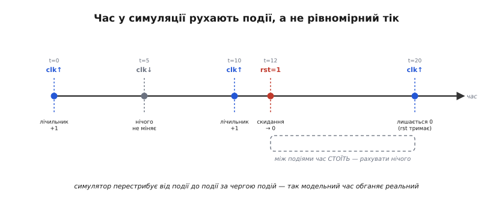
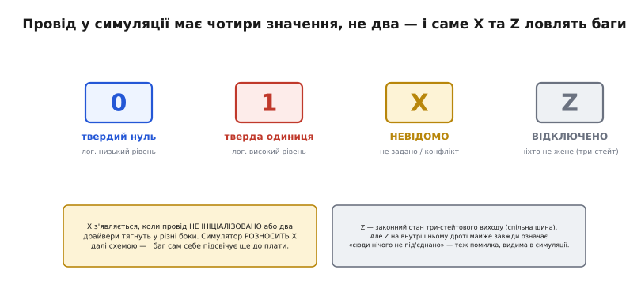

# Симуляція HDL: testbench і перевірка до синтезу

Ви описали схему [мовою опису апаратури](root:hw-digital/hdl) — акуратний модуль лічильника чи передавача. Лишається одне негарне питання: а він **робить те, що ви задумали**? Спокуса — просто [синтезувати](root:hw-digital/hdl) опис, залити конфігурацію в [FPGA](root:hw-digital/inside-fpga) і глянути на плату. Але це найдорожчий спосіб дізнатися, що ви помилилися. Синтез великого проєкту йде хвилинами; прошивання — ще час; а коли на платі щось не так, ви бачите лише **кінцевий симптом** (світлодіод не блимає, байт по лінії кривий) і не бачите, **у якому такті всередині** стан пішов не туди. Шукати помилку тестером по ніжках корпусу — усе одно що шукати друкарську помилку в книжці, гортаючи її крізь шпарину. Тому інженери майже ніколи так не роблять. Спершу вони **проганяють опис у симуляторі** — програмі, що вдає роботу цієї схеми в часі на звичайному комп'ютері, без жодного кремнію.

Різниця в ціні помилки — разюча, і саме вона робить симуляцію не факультативом, а серцевиною розробки на HDL.


*Без симуляції кожна помилка коштує повного кола «синтез → прошити → паяти-мацати тестером», а це години, і повторюється щоразу. Із симуляцією опис проганяється на комп'ютері за секунди: тестбенч показує баг, ви правите текст і женете знову; синтез і плата — уже потім, один раз, коли поведінка чиста. Оптимізують не швидкість схеми, а швидкість власного циклу «помилився — дізнався».*

> 🔧 **Навіщо це.** Цикл «зробив зміну → дізнався, чи вона правильна» ви пройдете за проєкт сотні разів. Якщо один оберт коштує п'ять хвилин синтезу й пайки, робота повзе; якщо секунду симуляції — летить. Симуляція коротшає саме цей цикл, тому нею починають і нею перевіряють кожну правку, а плату чіпають наприкінці.

## Симуляція — це не запуск програми

Тут легко спіткнутися об звичку з програмування. «Просимулювати» звучить як «запустити», але HDL-опис [не виконується процесором](root:hw-digital/hdl) — він описує схему, що існує вся водночас. То що ж тоді «біжить» у симуляторі?

Біжить **модель**. Симулятор бере ваш опис і будує в пам'яті комп'ютера математичну картину цієї схеми: які є дроти, які вентилі й тригери, хто на кого впливає. Далі він **вдає плин часу**: подає на входи ті значення, що ви звеліли, і за законами логіки обраховує, як відгукнеться кожен дріт, кожен тригер — такт за тактом модельного часу. На екрані ви бачите **хвилі** (англ. *waveform*, форма коливання) — як кожен сигнал змінюється в часі, ніби зняли їх осцилографом, тільки осцилограф уявний і бачить **усе всередині**, до найглибшого дроту.

Ключове слово — **модельний час**. Він не має нічого спільного з часом на вашому годиннику. Симулятор може за секунду реального часу прорахувати мілісекунду роботи схеми — або, для складного проєкту, повзти набагато повільніше за реальність. Час усередині симуляції — це просто число, лічильник, який симулятор посуває вперед. І посуває він його дуже хитро.

## Час рухають події, а не рівний тік

Наївно було б рахувати схему «щонаносекунди»: узяв крок 1 нс, перерахував усі дроти, ще крок, ще перерахунок. Це марнотратство — бо **між змінами нічого не відбувається**. Якщо [такт](root:hw-digital/clock-signal) наступного разу зміниться аж через 20 нс, то всі 20 нс усі тригери стоять, і рахувати там нема чого.

Тому реальні симулятори **керовані подіями** (англ. *event-driven*, «рухомі подіями»). Симулятор тримає **чергу подій** — список запланованих змін, кожна з міткою модельного часу: «о такому-то часі такий-то дріт стане таким-то». Він бере найближчу подію, стрибає модельним часом одразу до неї, застосовує зміну — а зміна одного дроту може **породити нові події** (спрацював тригер → зміниться його вихід → відгукнеться логіка далі), які теж лягають у чергу зі своїм часом. Опрацював — бере наступну. Між двома подіями модельний час **перестрибує порожнечу миттєво**, бо там рахувати нічого. Саме так симуляція обганяє реальність: вона рахує лише **моменти, коли щось справді міняється**.


*Симулятор не крокує рівномірно — він перестрибує від події до події за чергою подій. На фронті такту лічильник збільшується; спадний фронт нічого не змінює; сигнал скидання в проміжку кидає лічильник у нуль. Ділянка між подіями (тут t=12…20) порожня — там нічого не міняється, тож симулятор просто переносить модельний час уперед, не витрачаючи роботи. Через це модельний час і випереджає реальний.*

Ця картина пояснює й дрібні дива, які інакше збивають з пантелику: чому в HDL для симуляції пишуть **затримки** через `#` («через стільки одиниць часу»), чому такт задають як «півперіоду туди, півперіоду сюди» через ті самі затримки, і чому дві події, заплановані на **той самий момент**, потребують чітких правил, хто раніше — інакше результат був би невизначений. Але щоб цим усім скористатися, потрібне те, що взагалі **подає на схему входи** й дивиться на виходи. Це окремий шматок HDL — тестбенч.

## Тестбенч: несправжній світ навколо дизайну

Симулятор сам по собі нічого не подасть на ваш модуль — він лише обраховує наслідки. Хтось має **згенерувати вхідні сигнали**: смикати такт, подати скидання, виставити дані, натиснути уявну кнопку. Цей «хтось» — окремий модуль, який пишуть спеціально для перевірки й ніколи не синтезують у залізо. Його звуть **тестбенч** (англ. *testbench*, дослівно «випробний стіл» — як верстак у лабораторії, куди кладуть прилад і чіпляють до нього генератори й вимірювачі).

Тестбенч — це **несправжній світ**, зшитий навколо вашого дизайну. Усередині нього ваш модуль стоїть як **DUT** (англ. *device under test*, «пристрій, що випробовується») — саме той шматок, чию поведінку ви перевіряєте. Тестбенч робить рівно три речі: створює для DUT такт і всі подразники (англ. *stimulus*, збудник), стежить за його виходами й **порівнює їх з тим, чого ви очікуєте**. І одна деталь одразу видає його природу: у тестбенча **немає жодного виводу назовні** — він нікуди не під'єднується, бо він і є цілий уявний всесвіт, поза яким нічого немає.


*Тестбенч — модуль без виводів (`module tb;`), що обгортає перевірюваний дизайн (DUT). Ліворуч він сам породжує для DUT такт і подразники (`clk`, `rst`, `en`), праворуч — читає виходи (`count`) і звіряє з очікуваним. Наприкінці друкує вердикт: `PASS` або `FAIL` із міткою часу, де все пішло не так. Ані DUT, ані тестбенч не торкаються плати — усе живе в симуляторі.*

Тепер видно кістяк будь-якого тестбенча. Він оголошує сигнали-дроти, якими з'єднається з DUT. Він **під'єднує DUT** — вставляє екземпляр вашого модуля й підмикає до нього ці дроти. Він в одному місці **безперервно робить такт** (перемикає `clk` кожні півперіоду через затримку). А в іншому місці **розгортає сценарій**: спершу подай скидання, за кілька тактів зніми, тоді ввімкни дозвіл — і дивись, що вийде. Це «в одному місці одне, в іншому інше, і все паралельно» — прямий наслідок того, що [HDL описує паралельне залізо](root:hw-digital/hdl): генератор такту й сценарій подразників живуть **одночасно**, як два незалежні прилади на верстаку.

Ось голий кістяк тестбенча для простого лічильника, щоб побачити всі частини разом:

```verilog
`timescale 1ns/1ps          // одиниця часу — 1 нс

module tb;                  // тестбенч: жодного виводу назовні
    reg  clk = 0;           // сигнали, якими годуємо DUT
    reg  rst = 1;
    reg  en  = 0;
    wire [3:0] count;       // вихід DUT читаємо сюди

    counter dut (           // під'єднуємо DUT (наш дизайн)
        .clk(clk), .rst(rst), .en(en), .count(count));

    always #5 clk = ~clk;   // такт: період 10 нс, живе весь час

    initial begin           // сценарій: розгортається один раз
        #12  rst = 0;       // за 12 нс зняти скидання
        #10  en  = 1;       // ще за 10 нс дозволити лік
        #200 $finish;       // за 200 нс завершити симуляцію
    end
endmodule
```

Тут `always #5 clk = ~clk;` — вічний генератор такту: кожні 5 нс модельного часу перевертає `clk`, даючи меандр із періодом 10 нс. Поряд `initial begin … end` — це **сценарій, що виконується один раз** зверху вниз, і затримки `#` у ньому — не «зачекати процесором», а **запланувати подію на пізніше** в черзі симулятора. `$finish` — системна команда «зупини симуляцію». Дві конструкції — `always` і `initial` — крутяться **паралельно**: одна безкінечно тіпає такт, друга раз проводить дизайн крізь сценарій. Лишилося найважливіше: як тестбенч **говорить** з вами про побачене.

## Системні задачі: як тестбенч звітує

Усередині тестбенча можна робити те, чого в **синтезованій** схемі не буває ніколи: друкувати текст, читати файли, брати поточний модельний час. Це **системні задачі** (англ. *system task*) — команди самому симуляторові, які починаються з долара `$` і **не перетворюються на залізо** (їх і не намагаються синтезувати — вони існують лише для перевірки). Кількох вистачає на 90 % роботи:

- `$display(...)` — надрукувати рядок один раз, як `printf` у C. Формат такий самий: `$display("count = %d", count);`.
- `$monitor(...)` — надрукувати **щоразу, коли щось із названого зміниться**. Оголосив один раз — і симулятор сам звітує про кожну зміну; зручно стежити за жменькою сигналів.
- `$time` — поточний модельний час (число). Друкують `%0t`, щоб позначити, **коли** щось сталося: `$display("FAIL @ %0t", $time);`.
- `$finish` — завершити симуляцію. Без неї `always #5 clk = ~clk;` тіпав би такт **вічно**, і симуляція ніколи б не спинилася.

Здавалося б, дрібниці — але саме вони перетворюють симуляцію з «подивимось на хвилі очима» на **автоматичну перевірку**, і різниця тут принципова.

## Око проти самоперевірки

Найпростіше — прогнати симуляцію й **очима роздивитись хвилі**: ось такт, ось лічильник росте, ось скидання кинуло його в нуль, начебто гаразд. Для першого знайомства з модулем це нормально. Але як спосіб **упевнитися**, що все правильно, воно тендітне: людина втомлюється, пропускає один кривий такт серед тисячі, а на складному дизайні хвиль стільки, що всіх не переглянути. І головне — щоразу, змінивши опис, доведеться **дивитися заново**.

Тому серйозний тестбенч роблять **самоперевірним** (англ. *self-checking*): він не лише подає входи, а й **сам знає правильну відповідь** і **сам звіряє** з нею вихід DUT. Замість «подивись, чи схоже» — тверде «якщо не збіглося, кричи». У Verilog це буквально одне порівняння:

```verilog
if (count !== expected) begin
    $display("FAIL @ %0t: count=%d, чекали %d", $time, count, expected);
    $finish;                 // спинитись одразу на першій розбіжності
end
```

Тепер симуляція сама виносить вердикт: пройшла тиша до кінця — модуль здоровий; вискочило `FAIL` — ось **точний час і місце**, де поведінка розійшлася з очікуванням. Це і є та миттєва «дізнався, що помилився», заради якої симулюють. Повний приклад такого тестбенча — де очікуване значення рахує проста модель поряд із DUT, а перевірка йде на кожному такті — розібрано в окремій вставці [самоперевірний тестбенч крок за кроком](root:hw-digital/hdl-simulation/proj-selfcheck-testbench.md).

Зверніть увагу на дрібницю, що виявляється зовсім не дрібницею: у порівнянні стоїть `!==`, а не звичне `!=`. Три знаки замість двох — бо в симуляції у дроту не два значення, а **чотири**, і саме на цій відмінності тримається головна користь симуляції до синтезу.

## Чотири значення: 0, 1, X і Z

На реальній платі дріт або підтягнутий до [логічної одиниці](root:hw-digital/logic-levels-as-ranges), або до нуля — двійка й уся недовга. Симулятор навмисно багатший: він знає **чотири значення** сигналу, і два «зайві» — не примха, а найгостріший інструмент виловлювання помилок.


*У симуляції провід має чотири значення. `0` і `1` — звичні тверді рівні. `X` — невідомо: сигнал ще не ініціалізовано, або два джерела тягнуть його в різні боки. `Z` — високий опір, дріт ніхто не жене (законний стан три-стейтового виходу на спільній шині, але на внутрішньому дроті — майже завжди помилка). Обидва «зайві» значення існують саме щоб симуляція **підсвітила** негаразди, невидимі на живій платі.*

**X — «невідомо».** Це не якийсь проміжний рівень напруги, а чесне зізнання симулятора: «я не знаю, що тут». Воно з'являється, коли [регістр](root:hw-digital/d-flip-flop) ще не отримав жодного значення (не було скидання, а живиться сміттям), або коли **два джерела** женуть один дріт у протилежні боки (конфлікт драйверів). Найцінніше — симулятор **розносить X далі схемою**: невідоме на вході логіки дає невідоме на виході, і те тягнеться, поки не впреться у вихідний сигнал, який ви перевіряєте. Тож коли самоперевірка ловить `X` там, де мала бути цифра, — це майже завжди **забутий скид** або **гонитва драйверів**, і ви бачите це **в симуляції**, а не як загадкове «інколи не працює» на платі. На живому кремнії такого «X» немає: там регістр після ввімкнення просто набуде **якогось** випадкового 0 чи 1 — і помилка сховається за тим, що «здебільшого щастить».

**Z — «відключено».** Це стан [три-стейтового виходу](root:hw-digital/cmos-transmission-gate), який навмисно **нікого не жене**, віддаючи дріт іншому — саме так кілька пристроїв ділять одну шину, по черзі беручи над нею владу. На своєму місці `Z` законний. Але `Z`, що виринув на **внутрішньому** дроті, майже завжди означає інше: «сюди забули щось під'єднати», обірваний зв'язок — і це теж баг, добре видимий у симуляції.

Ось звідки те `!==`. Звичайне `==` порівнює як на платі й на `X` губиться (дає непевну відповідь), а `!==` і `===` порівнюють **чотиризначно, буквально**: вони прямо кажуть, чи стоїть на дроті саме `X` чи саме `Z`. Тому в самоперевірці беруть їх — щоб «невідомо» не проскочило повз перевірку як «начебто збіглося». Ця чотиризначна логіка й робить симуляцію такою прозорою до синтезу: помилки, які на платі ховаються за випадковістю ввімкнення, тут **світяться самі**.

> 🔧 **Навіщо це.** Забути скинути регістр — класична пастка: на платі воно «зазвичай працює», бо тригер випадково стає в 0, аж поки одного холодного ранку не стане в 1 — і пристрій поводиться дивно раз на сто вмикань. У симуляції той самий регістр світить `X` **одразу**, з першого прогону, і самоперевірка падає з точним часом. Ловити це на кремнії — дні; у симуляторі — секунди.

## Що симуляція ловить, а що ні — і як це доповнює синтез

Варто чесно окреслити межу, бо симуляція всесильна не в усьому. Вона перевіряє **логіку та поведінку**: чи правильно рахує лічильник, чи вкладає [автомат](root:hw-digital/finite-state-machines) байт у [правильний кадр](root:hw-digital/hdl), чи не лишилися десь `X` і `Z`. Це відповідь на питання «чи роблю я те, що задумав». Але звичайна («функційна») симуляція зазвичай рахує так, наче логіка миттєва, а тому **не бачить фізичних затримок** конкретного кремнію — реального часу проходження сигналу крізь вентилі та дроти після [синтезу](root:hw-digital/hdl).

А час — окрема загроза. Схема може бути **логічно бездоганною**, та все одно не працювати на платі, якщо сигнал не встигає добігти від тригера до тригера за один період такту. Це вже питання **[часового аналізу](root:hw-digital/fpga-timing-and-routing)** — окремого етапу, що рахує найдовший шлях у синтезованій схемі й перевіряє, чи вкладається він у такт. Тому реальний маршрут двоступеневий: **симуляція** доводить, що логіка **правильна**, а **часовий аналіз** — що вона **встигає**. Одне без одного дірява: бездоганна за часом схема, яка рахує не те, — марна; правильна логіка, що не встигає, — теж. Симуляція закриває першу половину, і закриває її дешево, до того як кремній узагалі торкнувся справи.

Дві мови опису апаратури, у яких симуляція народилася й дозріла, прийшли з геть різних світів — одна з тісного стартапу, друга із замовлення оборонного відомства США, — і ця подвійна історія по-своєму повчальна; її розказано у вставці [дві колиски симуляції HDL](root:hw-digital/hdl-simulation/hist-simulator-origins.md).

## Суть на одну думку

Симуляція HDL — це прогін вашого опису схеми в програмі-моделі, що вдає плин часу без жодного кремнію, керуючись **чергою подій**: перестрибує від зміни до зміни, рахуючи лише моменти, коли щось справді відбувається. Навколо дизайну ви пишете **тестбенч** — несправжній світ без виводів, що сам породжує такт і подразники, дивиться на виходи й найкраще — **сам звіряє** їх із очікуваним, кричачи `FAIL` із точним часом на першій розбіжності. Багатша за плату **чотиризначна логіка** (0, 1, X, Z) підсвічує саме ті помилки — забутий скид, конфлікт драйверів, обірваний зв'язок, — які на живому кремнії ховаються за випадковістю ввімкнення. І все це — **до синтезу**, коли виправити коштує секунди, а не день пайки. А те, чого функційна симуляція не бачить — чи встигає сигнал за такт, — доміряє окремий [часовий аналіз](root:hw-digital/fpga-timing-and-routing). Разом вони й дають упевненість, що описана словами схема справді робитиме те, що ви задумали.
