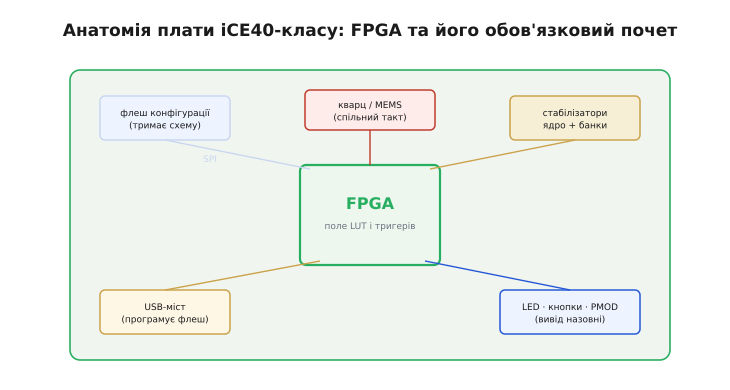
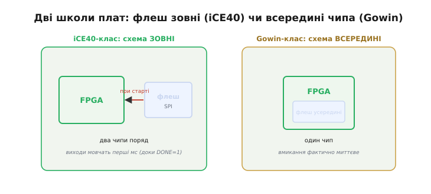
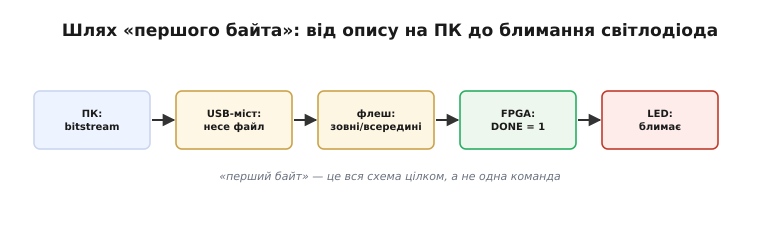

# 🔌 Перші FPGA-плати хобіста: iCE40- і Gowin-клас — що розпаяно на платі

Аматорська **FPGA-плата** (англ. *FPGA board / dev board* — плата розробника) — це невелика друкована плата, у центрі якої стоїть програмована логіка, а навколо неї розпаяно рівно той «почет», без якого чип не ожив би. Сам FPGA після ввімкнення **порожній**: усередині є поле клітинок логіки й [тригерів](root:hw-digital/lut), але яка з них чим стане — визначає **схема** (bitstream — потік бітів конфігурації), яку треба десь зберігати й якось у чип заливати. Тому аматорська плата — не «чип із ніжками», а маленька екосистема: живлення, джерело такту, пам'ять зі схемою, місток до комп'ютера й виводи назовні.

Практично всі такі плати поділяються на **два класи** — не за виробником, а за тим, **де після вимкнення живе схема**. У **iCE40-класі** (родина Lattice iCE40) схема лежить у **зовнішній** флеш-мікросхемі поряд із FPGA; у **Gowin-класі** (китайська родина LittleBee та подібні) флеш **вбудована в сам чип**. Ця, на перший погляд дрібна, різниця визначає і кількість деталей на платі, і відчуття «миттєвості» при ввімкненні.

## Блок-схема: що саме розпаяно на платі

На готовій платці iCE40-класу навколо центрального чипа завжди той самий набір сусідів — упізнавши його раз, ви впізнаєте будь-яку таку плату.


*Що розпаяно на платі. У центрі — сам FPGA (поле LUT і тригерів). Ліворуч-зверху — флеш конфігурації, що тримає схему й по SPI ллє її в чип при старті; під нею — USB-міст, яким ту флеш програмують із комп'ютера. Зверху — кварц чи MEMS-генератор спільного такту; праворуч — кілька стабілізаторів (окремо ядро близько 1.2 В, окремо банки виводів); знизу — світлодіоди (зокрема DONE), кнопки й гребінки PMOD, що виводять вільні ніжки назовні.*

Пройдімося цим «почтом», бо кожен сусід тут закриває конкретну потребу чипа. **Флеш конфігурації** — головний компаньйон iCE40-класу: сам FPGA порожній, тож схему між вимкненнями тримає окрема дрібна SPI-флеш поряд. **USB-міст** — невеликий чип (часто рідня [мікроконтролера](root:hw-arch/microcontroller) в ролі перетворювача), що обертає USB з комп'ютера на сигнали SPI чи JTAG, якими ту флеш програмують; без нього плату не було б чим «заговорити» зі столу. **Кварц** або [MEMS-генератор](root:hw-digital/clock-signal) дає спільний такт для всієї паралельної логіки. **Стабілізаторів** кілька, бо [ядру](root:hw-digital/programmable-logic) треба низька напруга (часто близько 1.2 В), а банкам виводів — окремо й своїми рівнями. Нарешті, **світлодіоди, кнопки й гребінки PMOD** — це інтерфейс із людиною: DONE показує, що схема завантажилась, решта світлодіодів і кнопок дають найпростіший спосіб щось побачити й натиснути, а PMOD виводить вільні ніжки FPGA назовні, до зовнішніх модулів.

## Розпіновка: куди підходять сигнали

Виводи на такій платі групуються не «по функції», як у мікроконтролера, а так само, як у самого [FPGA](root:hw-digital/programmable-logic) — **за призначенням**. Глянемо на типову розкладку країв плати:

```
            ┌─────────────────────────────────────┐
   USB ─────┤ роз'єм живлення + USB-міст           │
   5V/GND ──┤ → стабілізатори → VCC ядра й банків  │
   PMOD A ══╡ вільні ніжки FPGA (вхід/вихід)       │══ PMOD B
   PMOD A ══╡ ви самі призначаєте напрям           │══ PMOD B
   LED ─────┤ DONE / користувацькі світлодіоди     │
   BTN ─────┤ кнопки RESET / користувацькі         │
   (SPI) ───┤ FPGA ↔ флеш конфігурації (внутрішньо)│
            └─────────────────────────────────────┘
```

- **USB і живлення** — через цей роз'єм плата і живиться, і програмується: міст сидить одразу за ним, а стабілізатори роздають із 5 В потрібні [рівні](root:hw-digital/logic-families).
- **PMOD** — гребінки вільних ніжок FPGA. На відміну від фіксованих ніжок мікроконтролера, тут майже будь-який вивід ви **самі** призначаєте входом чи виходом; стандартний крок гребінки дає чіпляти готові модулі.
- **LED і BTN** — світлодіоди (серед них DONE) і кнопки: найдешевший спосіб побачити, що схема працює, ще не маючи нічого зовнішнього.
- **SPI до флеші** — ця лінія зазвичай захована на платі: нею FPGA при старті зчитує схему. У Gowin-класі назовні її нема взагалі, бо флеш усередині чипа.

## Підключення й два класи плат: де живе схема

Найважливіша відмінність двох класів стосується підключення напряму: від неї залежить, **скільки** чипів ви бачите на платі і як швидко вона оживає.


*Дві школи на платі хобіста. Ліворуч — iCE40-клас: на платі два чипи поруч, FPGA і окрема флеш SPI, з якої схема вливається при кожному ввімкненні; виходи мовчать перші мілісекунди, доки DONE не підніметься в «1». Праворуч — Gowin-клас: флеш усередині FPGA, на платі один чип, тож вмикання відчувається фактично миттєвим. Принцип «схему [вантажать при старті](root:hw-digital/programmable-logic)» спільний — різниця лише в тому, флеш зовні чи всередині.*

Підключення двох класів через це трохи різне. У **iCE40-класі** поряд із FPGA має справно жити флеш конфігурації, а USB-міст — уміти в неї писати; «підключити плату» означає дати USB (це і живлення, і канал програмування) — далі при старті чип сам вливає схему з флеші. У **Gowin-класі** окремої флеші нема, тож USB-міст пише схему прямо у **внутрішню** пам'ять чипа. З боку стола дія однакова — увіткнути USB-кабель; різниться лише те, що відбувається всередині перші мілісекунди.

Варто знати про одну зручну дрібницю iCE40-класу. Багато таких чипів уміють приймати схему не лише з флеші, а й **напряму** в свою пам'ять конфігурації через USB-міст — тоді вона живе в чипі лише до вимкнення живлення. Це швидкий шлях «спробувати»: залив, подивився, поправив — без запису у флеш; а коли схема готова «назавжди», її пишуть у флеш конфігурації, щоб плата піднімалася сама без комп'ютера. Так на одній платі співіснують швидка проба й постійна прошивка.

## «Перший байт»: від комп'ютера до блимання світлодіода

Головна відмінність цього класу — у тому, **чим** є «перший байт». Для [мікроконтролера](root:hw-arch/microcontroller) це команда по шині, яку процесор виконує. Тут «перший байт» — це **вся схема цілком**, яку треба провести з комп'ютера на плату й вкласти в чип; жодна окрема команда нічого не означає, поки не завантажилась уся конфігурація.


*Шлях «першого байта» — чотири кроки. На комп'ютері набір інструментів перетворює [опис схеми](root:hw-digital/hdl) на файл-прошивку bitstream; USB-кабель через міст несе цей файл у плату; bitstream лягає у флеш — зовнішню (iCE40) чи внутрішню (Gowin); при старті FPGA вливає схему в себе, піднімає сигнал DONE, і виходи оживають. Унизу — дві ознаки, що чип «заговорив»: DONE у «1» і, найпереконливіше, блимання світлодіода найменшою власноруч описаною схемою.*

Розпізнати, що чип таки «заговорив», можна за двома ознаками. Перша — вивід **DONE**: поки він не піднявся в «1», на виходах нічого осмисленого нема, і це нормально, а не «мертвий» чип. А найпереконливіша перевірка — **блимання світлодіода**: найдрібніша схема, яку взагалі можна описати, ділить кварц [лічильником](root:hw-digital/counters) і вмикає LED раз на секунду. Побачили рівне блимання — отже, увесь ланцюжок від опису до заліза живий; це і є «hello world» цього класу.

## Граблі цього класу

Перші граблі ростуть прямо з будови плати — і майже всі вони про той самий «почет», що оточує чип.

- **«Мертва» плата після ввімкнення.** FPGA і має бути порожнім, поки не завантажилась схема. Якщо DONE так і не піднявся — винна найчастіше порожня чи погано записана флеш конфігурації або зрив завантаження, а не «баг у логіці». В iCE40-класі додається підозра на саму зовнішню флеш (поганий контакт); у Gowin-класі цей сусід відпадає, бо флеш усередині.
- **USB-міст не бачить плати.** Програмування йде через міст, тож найперша стіна — саме він: не той кабель (трапляються «лише для зарядки», без даних), не встановлений драйвер, не той роз'єм. Поки міст не відгукнувся, до FPGA черга й не дійшла.
- **Сплутані рівні на PMOD.** Вільні ніжки FPGA працюють на [рівні свого банка](root:hw-digital/logic-families) — часто 3.3 В. Завести туди сигнал вищого рівня — те саме, що й будь-яка несумісність рівнів: у кращому разі вхід не зрозуміють, у гіршому псується вивід.
- **Кволе живлення від USB.** Густо заповнена логіка споживає помітний струм; через довгий тонкий кабель чи слабкий порт стабілізаторам не вистачає — і з'являються плаваючі, «неможливі» збої. Лікується нормальним кабелем і портом.
- **Залив у пробу замість постійного запису (і навпаки).** В iCE40-класі легко сплутати два способи: схема, залита **напряму** в чип, зникне після вимкнення; постійний запис іде у флеш. Якщо плата щоразу прокидається порожньою — найімовірніше, лили в чип, а не у флеш.

## Варіації класу й де що шукати

Той самий принцип «схему вантажать при старті» носять плати різного калібру, і впізнати клас легко за тим, **скільки чипів** біля програмованої логіки. У **iCE40-класі** поряд із FPGA завжди видно окрему флеш-мікросхему й USB-міст — від крихітних «свистків», що повністю ховаються в USB-порту, до платок із кількома гребінками PMOD; саме цей клас, завдяки відкритому [набору інструментів](root:embedded/fpga-flow), став для багатьох першою FPGA. У **Gowin-класі** окремої флеші біля чипа нема — схема живе всередині, плата вмикається миттєво й коштує зазвичай менше. Поряд із обома живе дрібніша [рідня — **CPLD**](root:hw-digital/programmable-logic)-клас: програмована логіка з конфігурацією всередині, готова до роботи зразу після ввімкнення, яку ставлять не «погратися з полем логіки», а лише «склеїти» кілька ліній. Спільне в усіх цих плат — те, що відрізняє їх від великих FPGA-систем: програмована логіка тут не загублена серед сотні інших чипів, а стоїть у центрі з мінімальним почтом, щоб її легко було взяти в руки й описати першу власну [схему мовою опису апаратури](root:hw-digital/hdl).
