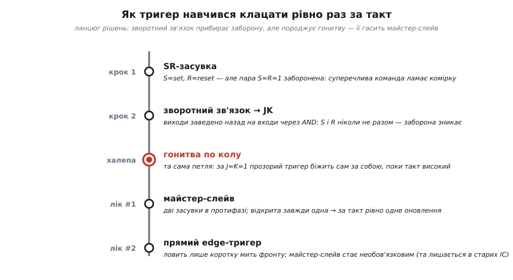

# 📜 Звідки взялися літери J і K — і хто приборкав гонитву по колу

> Дві загадки живуть у назві «JK-тригер». Перша: чому саме **J** і **K** — адже сусідні **S** і **R** чесно означають *set* і *reset*, а **D** — *data*, **T** — *toggle*? Мусить же і тут щось критися. Друга, тихіша: перш ніж навчилися ловити тактовий **фронт** напряму, тригер якось-таки змусили клацати рівно раз за такт — як? Обидві відповіді ведуть не до підручника, а до конкретних людей: інженера з фірми, що будувала перші швидкі друкарки, і до хитрого прийому з **двох засувок**, поставлених у протифазі. Ця розповідь — про те, звідки насправді взялися ті літери (і чому байка про Джека Кілбі — саме байка), і про майстер-слейв як перший робочий лік від «бігання по колу».

Почнімо з чесного зізнання: більшість позначень у цифровій логіці — прозорі. **S**-**R** — це **s**et і **r**eset, «постав» і «скинь». **D**-тригер бере **d**ata — дані, які треба запам'ятати. **T**-тригер — від **t**oggle, «перемикатися». Літери самі проговорюють, що роблять входи. І тому природно очікувати, що **J** і **K** — теж абревіатура: люди роками вигадують, ніби це «**J**ump» і «**K**ill», чи ще щось таке. Спокуса знайти сенс у літерах така сильна, що навколо неї виросла ціла легенда. А правда виявилася прозаїчнішою — і саме тому цікавішою.

---

## Людина, яка роздавала літери за абеткою

Найдокументованіша версія походження назви веде до інженера на ім'я **Елдред Нелсон** (англ. *Eldred C. Nelson*), який на початку 1950-х працював у компанії **Hughes Aircraft** — тій самій авіаційно-електронній фірмі Говарда Г'юза, де тоді народжувалася рання цифрова техніка. Нелсон проєктував логічні системи, у яких тригерів було багато, і кожному треба було якось назвати входи. Він вирішив питання найпростішим із можливих способів: **роздавав входам літери підряд за абеткою**, тригер за тригером.

Схема виходила така:

```
тригер #1:  входи A, B
тригер #2:  входи C, D
тригер #3:  входи E, F
тригер #4:  входи G, H
тригер #5:  входи J, K
```

Придивіться до останнього рядка — і побачите розгадку. Після **H** мала б іти **I**. Але **I** в рукописних схемах і формулах надто легко сплутати з **одиницею** (`1`) — а в двійковій логіці, де скрізь нулі й одиниці, це прямий шлях до помилки. Тому Нелсон **пропустив I** й перескочив одразу на **J** та **K**. Отак п'ятий за ліком тригер дістав входи `J` і `K` — не тому, що ці літери щось означають, а просто тому, що на них припала черга після викинутої «I».

Тобто **J і K — не абревіатура взагалі**. Це порядкові літери абетки, як номери на дверях. Тригер, у якого обидва входи, підняті водночас, змушували вихід **перекидатися**, виявився саме тим п'ятим у Нелсоновому переліку — і назва «JK» прилипла до цієї поведінки, а не до конкретної п'ятірки схем. Коли згодом такий тригер став окремим, добре означеним типом, він поніс ці дві випадкові літери з собою — уже назавжди.

> 🔧 **Навіщо це.** Практичний висновок простий, але рятує від плутанини: **не шукайте в «J» і «K» прихованого слова**. У S/R/D/T літера підказує функцію входу, і це корисна опора для пам'яті. У JK такої опори немає — вхід `J` не «джампить», вхід `K` не «кілить». Тримайте в голові саму таблицю (J·K̄ ставить, J̄·K скидає, J=K=1 перекидає), а не мнемоніку з букв, — бо мнемоніки тут просто не існує, і всі, що ходять, — вигадані заднім числом.

---

## Лист, що зберіг цю історію

Звідки ми взагалі знаємо про Нелсона й абеткову роздачу? Історія легко могла б розчинитися — це ж не гучне відкриття, а робоча звичка одного інженера. Урятував її **лист до редакції**.

1968 року інженер **П. Л. Ліндлі** (англ. *P. L. Lindley*), що працював у **Лабораторії реактивного руху** (*Jet Propulsion Laboratory*, JPL — той самий центр NASA, який веде міжпланетні місії), написав листа до фахового журналу **EDN** — американського видання для інженерів-електронників. Лист датований **13 червня 1968 року** й опублікований у **серпневому** числі. У ньому Ліндлі й переказав почуту з перших вуст історію: що назву **JK** увів Елдред Нелсон, під керівництвом якого Ліндлі свого часу працював у Hughes Aircraft, і що Нелсон роздавав входам літери саме тим абетковим порядком, пропустивши «I».

Цінність цього листа — у ланцюжку свідчень. Ліндлі не переказував чутку «десь чув»: він **безпосередньо працював під Нелсоном** і знав історію зсередини, а потім зафіксував її в друці, поки живі були учасники. Для інженерної історії, де багато що передається усно й обростає вигадками, такий документований слід — велика рідкість.

> **Статус доказовості.** Це **усталена, добре задокументована версія** — її наводить і англомовна Вікіпедія в статті про тригери, і фахові обговорення, з посиланням саме на лист Ліндлі (EDN, лист від 13.06.1968, опубл. серпень 1968). Первинне джерело — сам лист; переказ у ньому — свідчення учасника подій. Це не «залізний» протокол, але найнадійніше, що маємо, і воно узгоджене з іншим, ще твердішим доказом — патентом, до якого зараз перейдемо.

---

## Патент, де вже стоять «j-вхід» і «k-вхід»

Лист Ліндлі — свідчення. А ось **тверда, письмова опора під ним**: власний **патент Нелсона**, поданий ще до всякого листа.

8 вересня **1953 року** Елдред Нелсон подав до патентного відомства США заявку на систему під назвою **«High-Speed Printing System»** («Швидкодійна друкарська система») — цифрову електроніку для керування друком. Патент видали 2 вересня **1958 року** за номером **US 2,850,566**, права належали Hughes Aircraft. І в тексті цього патенту тригер уже описано з входами, які автор прямо називає **j-вхід** і **k-вхід** (англ. *j-input*, *k-input*), а виходи — **Q** і **Q̄**. Тобто позначення `j`/`k` для входів тригера **чорним по білому стоїть у документі 1953 року**, підписаному самим Нелсоном.

Це замикає доказ. Ми маємо два незалежні сліди, що вказують на одну людину:

```
1953 — заявка на патент US 2,850,566 (Нелсон, Hughes):
       у тексті вже вжито «j-input» і «k-input»          ← первинний документ
1968 — лист Ліндлі до EDN:
       переказ історії про абеткову роздачу від Нелсона  ← свідчення учасника
```

Патент фіксує **факт** уживання літер `j`, `k` рукою Нелсона на кілька років раніше за будь-які підручники. Лист пояснює **чому саме ці літери** — через абеткову лічбу з викинутою «I». Разом вони роблять версію «назву JK ввів Елдред Нелсон» настільки надійною, наскільки взагалі буває в історії інженерних дрібниць.

> 🔧 **Навіщо це.** Тут захована й корисна звичка мислення для самого читача: коли натрапляєте на «загальновідоме» пояснення назви чи «хто перший», варто спитати — а **де первинний слід**? Патент, датована стаття, лист учасника — це докази; «усі знають, що…» — ще ні. У випадку JK первинний слід є (патент 1953-го), і саме тому цій версії можна вірити, а конкурентним байкам — ні.

---

## Байка про Джека Кілбі (і чому це саме байка)

А тепер про легенду, заради спростування якої половина цієї розповіді й пишеться. Дуже поширена оповідка каже, ніби «JK» — це ініціали **Джека Кілбі** (англ. *Jack Kilby*), інженера Texas Instruments, який 1958 року зробив першу інтегральну мікросхему й згодом дістав за це Нобелівську премію. Мовляв, тригер назвали на його честь: **J** — Jack, а **K**… а ось тут байка вже плутається сама в собі, бо в «Jack Kilby» на друге слово припадає літера, і «K» до неї притягнуто силоміць.

Розберімо, чому це не витримує перевірки:

- **Хронологія не збігається.** Нелсон уживає `j`/`k` у заявці **1953 року**. Перша інтегральна схема Кілбі — **1958 рік**. Не можна назвати тригер на честь досягнення, якого на момент назви ще п'ять років не існувало.
- **Логіка ініціалів не тримається.** «Джек Кілбі» — це J.K. лише якщо брати першу літеру імені й першу літеру прізвища. Але тоді нізвідки взялася б ціла абеткова система A-B, C-D, E-F, G-H, у якій `J`,`K` — просто наступна за чергою пара. Нелсонів ряд пояснює `J` і `K` **разом з усіма попередніми літерами**; версія «Кілбі» пояснює тільки ці дві й зависає в повітрі.
- **Кілбі не мав стосунку до цього тригера.** Його внесок — інтегральна схема як така, а не означення JK-тригера.

Ходять і геть екзотичні варіанти — ніби літери взяв якийсь інженер зі своїх ініціалів на кресленнях, і вони «прижилися». Такі здогади не мають ні первинного джерела, ні датованого сліду й лишаються чистими припущеннями.

> **Статус доказовості.** «Названо на честь Джека Кілбі» — **міф** (легенда), а не факт: спростовується вже самою хронологією (1953 проти 1958) і наявністю повного абеткового ряду в Нелсона. Це класична **народна етимологія** — заднім числом підшукане «красиве» пояснення для назви, справжня причина якої давно забулася. Кілбі — цілком реальна й велика постать в історії електроніки, але до літер «J» і «K» вона непричетна; приписувати йому цю назву означає підмінити задокументовану дрібницю ефектною вигадкою.

Чому ж легенда така живуча? Бо вона **приємніша**. «Пропустив I, щоб не сплутати з одиницею» — суха канцелярська дрібниця; «названо на честь нобелівського лауреата» — гарна історія з героєм. Людська пам'ять радо міняє першу на другу. Саме тому історію варто час від часу звіряти з документами, а не з тим, що «звучить правильно».

---

## Коли JK став окремим типом: курс 1954 року

Одна річ — Нелсон уживав літери `j`,`k` у своїй системі; інша — коли **JK-тригер** оформився як окремий, названий тип поряд із SR, D і T, про який пишуть і вчать. Тут теж є доволі конкретна прив'язка, і знову від Ліндлі.

За тим самим свідченням, чотири класичні типи тригера — **SR, D, T, JK** — уперше системно обговорювалися **1954 року на курсі з проєктування обчислювальних машин в Каліфорнійському університеті в Лос-Анджелесі** (UCLA), який читав **Монтгомері Фістер** (англ. *Montgomery Phister*). Згодом ці типи ввійшли до його книжки **«Logical Design of Digital Computers»** («Логічне проєктування цифрових обчислювальних машин»). Тобто саме в навчально-книжковому викладі середини 1950-х чотири тригери стали тим упорядкованим «зоопарком», який ми й досі проходимо; частину назв закріпив Фістер.

Цю нитку варто тримати нарізно від Нелсонової. Нелсон **дав літери** (робоча практика, патент 1953-го). Курс і книжка Фістера **зробили з JK окремий, канонічний тип** серед інших (систематизація, ~1954 і далі). Одне не заперечує другого — це два послідовні кроки: спершу позначення народилося в живій інженерній роботі, потім його прибрали до навчального ладу.

> **Статус доказовості.** Прив'язка «курс UCLA 1954, Фістер» походить **із того самого свідчення Ліндлі** й повторюється в довідкових джерелах; це **правдоподібно й узгоджено**, хоч і спирається на переказ, а не на, скажімо, збережений розклад занять. Розумно тримати це як «добре засвідчену традицію викладу», а не як карбовану дату.

---

## Друга загадка: як приборкали «гонитву по колу»

Тепер — про другу річ, сховану в історії JK. Сам тригер із **зворотним зв'язком** виходів на входи (те, що прибирає заборонений стан SR-засувки) має вроджену халепу: якщо він **прозорий** — тобто реагує на **рівень** такту, поки той високий, — то за J=K=1 вихід починає **скакати сам за собою**. Перекинувся з 0 у 1 → одиниця через петлю набігла на вхід → наказ «перекинути» ще чинний, а такт **усе ще високий** → перекинувся назад у 0 → і так кілька разів, поки триває один високий рівень. У який стан вихід урешті сяде — залежить від точної ширини імпульсу, тобто **непередбачувано**. Це і є [гонитва по колу](root:hw-digital/jk-flip-flop) (англ. *race-around* — «бігання навколо»).

Сьогодні лік відомий: ловити не **рівень**, а коротку мить **фронту** — тоді «вікно» триває мить, і петля просто не встигає обернутися вдруге. Але **прямі** тригери по фронту з'явилися не одразу. Тож постає історичне питання: чим приборкували гонитву **до** того, як навчилися чисто ловити фронт? Відповідь — гарний інженерний прийом під назвою **майстер-слейв** (англ. *master–slave* — «господар–підлеглий»).

### Дві засувки в протифазі

Ідея майстер-слейв така елегантна, що до неї варто дійти самому. Проблема прозорого тригера в тому, що **вхід і вихід «прозорі» одночасно**: доки такт високий, дані течуть наскрізь, і петля встигає обернутися. А що, як **розірвати цю одночасність** — зробити так, щоб та частина, яка **слухає вхід**, і та, яка **виставляє вихід у петлю**, ніколи не були відкриті разом?

Саме це й роблять, поставивши **дві засувки поспіль** і тактуючи їх **у протифазі** (одну — прямим тактом, другу — інвертованим):

```
       ┌───────────┐        ┌───────────┐
вхід → │  МАЙСТЕР   │ ─────→ │   СЛЕЙВ    │ → вихід
       │ (засувка 1)│        │ (засувка 2)│
       └───────────┘        └───────────┘
         такт = 1               такт = 0
       слухає вхід,           тримається;           ← коли такт ВИСОКИЙ
       вихід у петлю          повторює майстра
         замкнений

         такт = 0               такт = 1
       тримається,            бере від майстра       ← коли такт НИЗЬКИЙ
       вхід замкнений         і виставляє назовні
```

Простежмо один повний такт. Поки такт **високий**, відкритий лише **майстер**: він слухає входи `J`,`K` і всередині себе перемикається — але **слейв у цю мить закритий**, тож назовні (і назад у петлю зворотного зв'язку) нове значення **ще не виходить**. Коли такт **падає** в нуль, ролі міняються: майстер **замикається** (запам'ятав те, що набрав), а слейв **відмикається** й переписує собі значення майстра, виставляючи його на вихід. Ключове: **обидві засувки ніколи не відкриті водночас** — завжди рівно одна слухає, а друга тримає.

Ось чому гонитва зникає. Щоб петля обернулася вдруге, новий вихід мусив би за той самий високий рівень такту **повернутися на вхід і знову протиснутися наскрізь**. Але наскрізного шляху немає: поки такт високий, слейв закритий і назовні нічого не пускає, а щойно такт падає й слейв відкривається — **майстер уже закритий** і нового кола не почне. За повний такт відбувається рівно **одне** оновлення. Дві прозорі, самі по собі «небезпечні» засувки, поставлені в протифазу, разом поводяться як **один** керований тактом тригер — уже без бігання по колу.

> 🔧 **Навіщо це.** Майстер-слейв — не музейний експонат: на ньому збудовано **безліч реальних JK- і D-тригерів** у серіях дискретної логіки (класичні мікросхеми 7473, 7476 — це JK саме майстер-слейв). Практичний слід, який варто знати: «класичний» майстер-слейв JK має особливість — **ловлення одиниці** (англ. *ones-catching*): якщо на вхід за час високого рівня такту **бодай на мить** прийшла одиниця (наприклад, від наведеної завади), майстер її **запам'ятає** й на спаді передасть слейву, навіть якщо на момент спаду входи вже інші. Тому в чутливих схемах воліють **справжні edge-тригери**, які дивляться лише на коротку мить фронту й такої «пам'яті на завади» не мають. Побачите на схемі старий 7473 — знайте: це майстер-слейв, і будьте обережні з голками на його входах, поки такт високий.

### Місце майстер-слейв в історії

Отже, у розвитку тригера є чіткий порядок кроків, і майстер-слейв — важлива середня ланка:


*Ланцюг рішень, а не просто дати. Спершу зворотний зв'язок виходів на входи прибирає заборонену пару S=R=1 — так із SR-засувки постає JK. Та сама петля, проте, робить прозорий тригер **несправним**: за J=K=1 вихід біжить по колу. Перший робочий лік — **майстер-слейв**: дві засувки в протифазі, з яких завжди відкрита лише одна, тож за такт стається одне оновлення. Згодом навчилися ловити **фронт напряму**, і потреба у двох засувках відпала — але сам прийом лишився в тисячах випущених мікросхем.*

Тобто майстер-слейв — це **перший спосіб**, яким гонитву по колу приборкали на практиці, ще до того, як edge-тригери навчилися ловити фронт «в лоб». Він розв'язав задачу не хитрою фізикою швидкого фронту, а простою **логічною уловкою**: розвів у часі «слухати» і «казати». Історично це типовий хід інженерії — коли прямого способу ще нема, задачу обходять розумною перебудовою з наявних деталей. Пізніші тригери, які ловлять фронт безпосередньо, зробили майстер-слейв необов'язковим для нових проєктів, але не викреслили його: у старих серіях логіки він і досі працює, і його «ловлення одиниці» треба тримати в голові, коли маєш справу з такими мікросхемами.

---

## Що з усього цього винести

Дві історії з назви «JK-тригер» сходяться в одну думку: **за сухими позначеннями стоять живі люди й конкретні обставини**, а не завжди — красива логіка.

Літери **J** і **K** не означають нічого — це порядкові букви абетки, які Елдред Нелсон у Hughes Aircraft роздав входам своїх тригерів, пропустивши «I», щоб не плутати з одиницею; слід цього лишився в його патенті 1953 року (де вже стоять `j-input`/`k-input`) і в листі П. Л. Ліндлі до EDN 1968-го, що зберіг пояснення. Гарна байка про «Джека Кілбі» — саме байка: вона розбивається об хронологію (Нелсонові літери на п'ять років старші за першу інтегральну схему Кілбі) і об те, що абетковий ряд A-B-C-D-…-J-K пояснює ці букви повністю, без жодного героя. Як окремий тип поряд із SR/D/T тригер JK оформився в навчальному викладі середини 1950-х (курс Монтгомері Фістера в UCLA, ~1954, і його книжка).

А **майстер-слейв** — дві засувки в протифазі — був **першим робочим ліком** від гонитви по колу, поки не навчилися ловити тактовий фронт напряму: розвівши в часі «слухати вхід» і «виставляти вихід», він змусив тригер оновлюватися рівно раз за такт. Прямі edge-тригери згодом зробили цей прийом необов'язковим — але не непотрібним: у старих мікросхемах він живий, разом зі своєю пасткою «ловлення одиниці».
