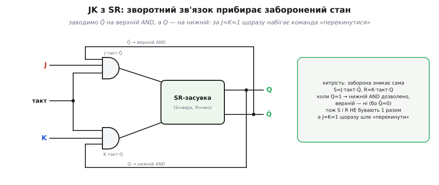
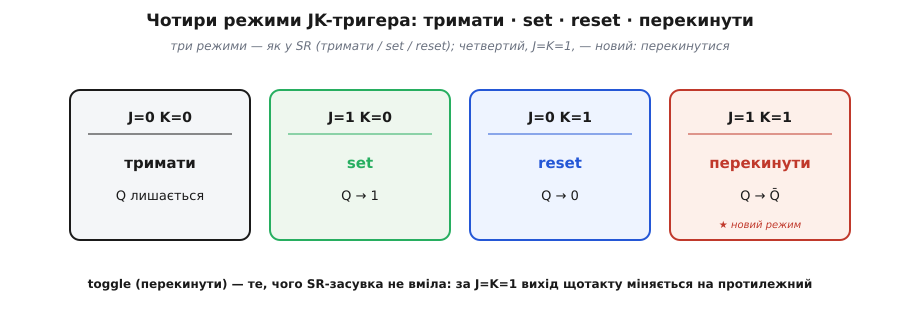
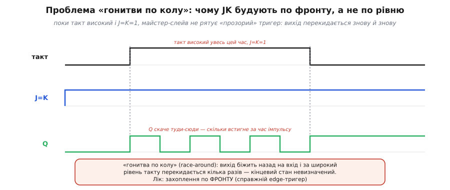
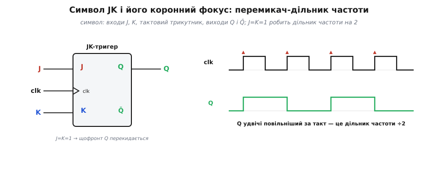

# JK-тригер

[SR-засувка](root:hw-digital/sr-latch) — найпростіша керована комірка пам'яті: **S** ставить вихід у 1, **R** скидає в 0, а коли обидва входи нулі, вона тримає біт. Одна річ у ній муляє: комбінація **S=R=1 заборонена**. Подати обидва накази водночас — «і встанови, і скинь» — це суперечлива команда, від якої засувка ламається (обидва виходи стають однакові, і хто переможе на виході «гонки», коли входи відпустиш, — непередбачувано). Жити з дірою в таблиці істинності незручно: у великій схемі рано чи пізно на входи випадково прийде саме ця пара. **JK-тригер** — це та сама засувка, у якій четвертий, заборонений раніше кут не просто «залатали», а **зробили найкориснішим режимом**: за J=K=1 вихід щотакту **перекидається** на протилежний. Один хитрий доробок — і з вади народжується нова здатність, якої в SR не було зовсім.

### Хитрість: завести виходи назад на входи

Заборонений стан брався з того, що ми могли ввімкнути S і R **одночасно**. А що, як зробити так, щоб схема сама **не пускала** обидва накази разом — залежно від того, у якому вона зараз стані? Ось ідея, до якої варто дійти самому. Уявімо, що вихід Q уже дорівнює 1. Тоді команда «set» (постав у 1) — марна: вихід і так одиниця. Корисна лишається тільки «скинь». Дзеркально: коли Q=0, зайва вже команда «reset», а має сенс лише «set». Тобто **в кожному стані реально потрібен лише один із двох наказів** — саме той, що веде до зміни.

Скористаймося цим. Перед засувкою поставимо два вентилі AND, і на кожен, крім вхідного сигналу й [такту](root:hw-digital/clock-signal), заведемо ще й **поточний вихід** — але навхрест: верхній AND (той, що керує входом S) додатково впустить сигнал лише коли Q̄=1 (тобто Q=0), а нижній AND (керує R) — лише коли Q=1.


*Входи J і K проходять крізь AND разом із тактом — і додатково крізь **зворотний зв'язок від виходів**: на верхній AND заведено Q̄, на нижній — Q. Тому внутрішній S = J·такт·Q̄, а R = K·такт·Q. Ключове: коли Q=1, множник Q̄=0 глушить верхній AND, тож S не може стати 1; коли Q=0 — навпаки глушиться нижній. **S і R фізично не бувають одиницями одночасно** — заборонений стан зникає сам собою, без жодних окремих запобіжників. А комбінація J=K=1 щотакту шле рівно ту команду, що перекидає вихід у протилежний бік.*

Ось чому це працює так гарно: заборону ми не «заборонили» ще однією схемою-сторожем, а **вивели з петлі зворотного зв'язку**. Стан виходу сам вирішує, який із двох входів зараз має право діяти. Тому хоч би що подали на J і K, до внутрішньої SR-засувки ніколи не дійде суперечлива пара — а найцікавіший випадок J=K=1 перетворюється на «завжди роби той крок, що змінює вихід».

Літери **J** і **K** тут не абревіатура (на відміну від S=set, R=reset — це поширена пастка). За найдокументованішою версією їх просто [призначили по порядку абетки](root:hw-digital/jk-flip-flop/hist-jk-name.md), пропустивши «I», щоб не сплутати з одиницею. Розхожа байка про «названо на честь Джека Кілбі» — саме байка.

### Чотири режими: три знайомі плюс один новий

Розкладемо поведінку JK по чотирьох комбінаціях входів (усі — у момент робочого фронту такту). Три з них — точно ті самі, що в SR-засувки; уся новизна в четвертому.


*Чотири режими. **J=0, K=0 — тримати**: жодного наказу, вихід лишається собою (пам'ять). **J=1, K=0 — set**: Q→1. **J=0, K=1 — reset**: Q→0. **J=1, K=1 — перекинути (toggle)**: Q стає протилежним до себе (Q→Q̄). Перші три — як у SR; четвертий — новий, і саме він робить JK цікавим: там, де SR ламалася, JK міняє вихід на зворотний.*

Ту саму таблицю зручно тримати в голові однією формулою — вона зветься характеристичним рівнянням тригера й одразу дає наступний стан Q через входи й теперішній Q:

```
Q(наст) = J·Q̄ + K̄·Q
```

Перевірмо, що вона справді описує всі чотири рядки — підставмо кожну пару J, K:

```
J=0, K=0:  Q(наст) = 0·Q̄ + 1·Q = Q        → тримати
J=1, K=0:  Q(наст) = 1·Q̄ + 1·Q = Q̄+Q = 1  → set (завжди 1)
J=0, K=1:  Q(наст) = 0·Q̄ + 0·Q = 0        → reset (завжди 0)
J=1, K=1:  Q(наст) = 1·Q̄ + 0·Q = Q̄        → перекинути
```

Останній рядок — уся суть: за J=K=1 наступний стан дорівнює **інверсії** теперішнього. Подаси такт іще раз — і Q знову перекинеться. Тримай J=K=1 і клацай тактом — вихід ітиме 0, 1, 0, 1, … За це toggle-режим і цінують.

> 🔧 **Навіщо це.** Практик тримає в пам'яті не таблицю з чотирьох рядків, а один факт: **JK — це «покращена SR», у якої заборонена комбінація перетворена на перемикач**. Коли на схемі бачите JK з обома входами, підв'язаними до одиниці (часто просто до живлення), — це не «set і reset водночас», а навмисний **перемикач стану**: щофронт вихід міняється на протилежний. Це найчастіше застосування JK у житті, тож упізнавайте його з першого погляду.

### Пастка «гонитви по колу» — і чому JK будують по фронту

Зворотний зв'язок, який прибрав заборону, приносить власну халепу — якщо зробити тригер **прозорим** (таким, що реагує на **рівень** такту, поки той високий). Прозорість означає: доки такт=1, зміни на вході одразу протискаються на вихід. А в JK вихід ще й **заведений назад на вхід**. Складімо це разом за J=K=1.

Такт піднявся — тригер перекинув Q, скажімо, з 0 у 1. Але Q через петлю тут-таки повертається на вхід, тож умова «перекинути» лишається чинною, а такт **усе ще високий**. Значить, схема перекидає Q знову — тепер у 0. Той нуль знов набігає на вхід… і поки триває один високий рівень такту, вихід встигає **скакати туди-сюди кілька разів**. Це і є **«гонитва по колу»** (англ. *race-around* — «бігання навколо»): вихід ганяє по петлі сам за собою, і в який стан він урешті сяде, коли такт нарешті впаде, залежить від точної тривалості імпульсу — тобто **непередбачувано**.


*Угорі — такт, що тримається високим **довше**, ніж час одного перемикання. Посередині — J=K=1 (наказ «перекидатися») усталено. Унизу — вихід Q: поки такт високий, він **осцилює** — перекидається стільки разів, скільки встигне. Коли такт нарешті впаде, кінцевий стан Q — лотерея, бо залежить від ширини імпульсу супроти швидкості вентилів. Це робить прозорий JK непридатним. Лік один: захоплювати вхід не за **рівень**, а за коротку мить **фронту**.*

Виходить, прозорий (тактований за рівнем) JK — глухий кут: сама здатність до toggle обертається неконтрольованою осциляцією. Тому справжні JK-тригери роблять **чутливими до фронту** (англ. *edge* — «край, кромка»): вони дивляться на входи лише в ту коротку мить, коли такт **перемикається** з 0 на 1, і геть ігнорують його решту часу. За один фронт відбувається рівно **одне** перекидання — петля не встигає обернутися вдруге, бо «вікно» триває мить, а не цілий рівень. Чому саме [фронт надійніший за рівень](root:hw-digital/edge-vs-level) і як його ловлять — окрема докладна розмова; історично першим робочим прийомом стала [схема «майстер-слейв»](root:hw-digital/jk-flip-flop/hist-jk-name.md) з двох засувок у протифазі, а сучасні тригери ловлять фронт безпосередньо.

> 🔧 **Навіщо це.** Звідси практичне правило: **JK-тригер зі схеми чи довідника — завжди по фронту** (на його тактовому вході малюють трикутник «❯»). «Прозорого» JK у реальних мікросхемах ви не зустрінете — його не буває саме через гонитву по колу. Тож коли підключаєте JK, тактуйте його чистим фронтом; а якщо самі формуєте такт ніжкою мікроконтролера — давайте один короткий перепад 0→1 на кожне бажане перемикання, а не тримайте лінію високою.

### Поведінка в часі й у коді

Зберімо все докупи на прикладі, де JK працює перемикачем. Хай на входах постійно J=K=1; тоді на кожному фронті такту вихід міняється на протилежний — і Q виходить рівно **вдвічі повільнішим** за такт.


*Ліворуч — умовний символ: входи **J** і **K**, тактовий вхід із **трикутником** «❯» (знак «по фронту»), виходи **Q** і **Q̄**. Праворуч — що дає J=K=1: на кожному робочому фронті такту (▲) Q перекидається, тож повний період Q охоплює **два** періоди такту. Один JK у режимі toggle — це готовий **дільник частоти на 2**; поставите кілька ланцюжком — поділите на 4, 8, 16 і так далі.*

Простежмо вихід на кількох фронтах за J=K=1, починаючи з Q=0:

```
старт:    Q = 0
фронт 1:  перекинути → Q = 1
фронт 2:  перекинути → Q = 0
фронт 3:  перекинути → Q = 1
фронт 4:  перекинути → Q = 0
```

Один повний цикл Q (0→1→0) припадає на два такти — це й означає «поділ на два».

Та сама логіка в коді прошивки. JK у програмному вигляді — це змінна стану, яку оновлюють **рівно в момент фронту** такту за правилом чотирьох режимів. Ось мінімальна реалізація — типовий шматок, коли тактуєш зовнішню JK-логіку ніжкою мікроконтролера й хочеш повторити її поведінку в моделі чи в тесті:

**Умова: на фронті `clk` 0→1 оновити вихід `q` за входами `j`, `k`; поза фронтом — не чіпати.**

```c
#include <stdbool.h>

static bool clk_prev = false;   // такт на попередній ітерації
static bool q        = false;   // вихід тригера

// викликається часто (в циклі або по таймеру)
void jk_step(bool j, bool k, bool clk) {
    bool rising = clk && !clk_prev;   // фронт 0→1 саме зараз?
    if (rising) {
        if      ( j && !k) q = true;      // set
        else if (!j &&  k) q = false;     // reset
        else if ( j &&  k) q = !q;        // перекинути (toggle)
        // j==0 && k==0 → тримати: q не чіпаємо
    }
    clk_prev = clk;                    // запам'ятати такт для наступного кроку
    // поза фронтом q лишається як був
}
```

Зверніть увагу на дві речі. По-перше, оновлення відбувається **лише** коли `rising` — це і є «по фронту»; поки такт стоїть високим, друга ітерація вже не побачить фронту (`clk_prev` теж 1), тож ніякої гонитви по колу в коді не виникає — рівно як у справжньому edge-тригері. По-друге, гілка `j && k` робить `q = !q` — те саме toggle, що на діаграмі. Хочете дільник на 2 — тримайте `j=k=1` і клацайте `clk`; хочете вручну ставити біт — користуйтеся гілками set/reset.

> 🔧 **Навіщо це.** JK колись був **універсальним будівельним блоком**: маючи його, ви маєте і D-тригер (з'єднайте K через інвертор з J — і K=J̄, лишиться чистий «запиши D»), і T-тригер-перемикач (J=K=1), і звичайну засувку set/reset. Тому в стару логіку (серії дискретних мікросхем) JK ставили як «тригер на всі випадки». У сучасних [FPGA](root:hw-digital/programmable-logic) і мікроконтролерах базовою коміркою натомість зробили простіший [D-тригер](root:hw-digital/d-flip-flop) — його легше виготовляти масово, а toggle і решту режимів дешевше зібрати навколо нього логікою. Тож JK найчастіше зустрінете у **лічильниках** і **дільниках частоти** (де toggle — рідний режим) та в навчанні як місток від засувки до повноцінного тригера.

### Де він живе

JK — це не окрема «ще одна пам'ять», а **вивершення лінії SR-засувки**: та сама бістабільна комірка, у якій зворотний зв'язок прибрав заборонений стан і подарував toggle. Його коронне застосування — **рахувати**. Ланцюжок JK у режимі перемикання ділить частоту навпіл на кожному щаблі (÷2, ÷4, ÷8…), а це і є асинхронний двійковий [лічильник](root:hw-digital/counters): кожен наступний тригер клацає вдвічі рідше за попередній, і на виходах ланцюжка проступає двійкове число тактів. Там, де треба поділити тактову частоту чи порахувати імпульси простими засобами, JK-перемикач — природний вибір.

---

**Коротко.** JK-тригер — це [SR-засувка](root:hw-digital/sr-latch), у якій виходи заведено назад на входи через два AND: завдяки цьому S і R ніколи не бувають одиницями разом, **заборонений стан зникає**, а колишня «погана» комбінація J=K=1 стає найкориснішим режимом — **перекинути** (toggle: Q→Q̄). Чотири режими: 00 тримати, 10 set, 01 reset, 11 перекинути; усе разом — рівняння `Q(наст)=J·Q̄+K̄·Q`. Через зворотний зв'язок прозорий (за рівнем) JK впадав би в **гонитву по колу**, тому справжні JK ловлять вхід лише **по фронту** (трикутник «❯» на такті). Режим toggle робить JK готовим **дільником частоти на 2** й основою двійкових [лічильників](root:hw-digital/counters); історично JK був універсальним тригером, з якого виводяться і D, і T, хоч сьогодні базовою коміркою частіше служить простіший [D-тригер](root:hw-digital/d-flip-flop).
